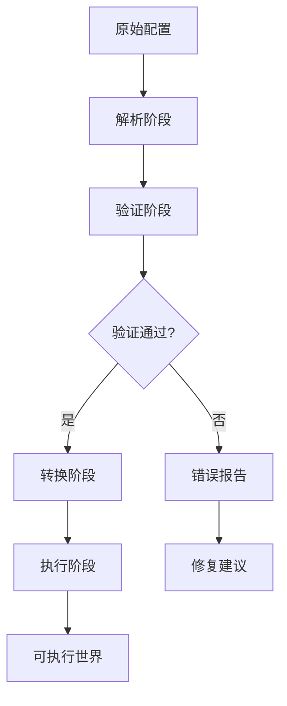
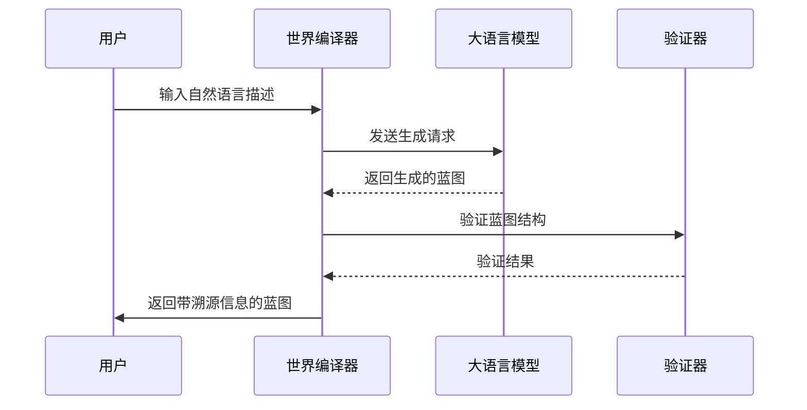

# 世界编译器

<cite>
**本文档引用的文件**
- [world_compiler.py](file://engine_runtime/world_compiler.py)
- [world_template.yaml](file://templates/world_template.yaml)
- [runtime.py](file://engine_runtime/runtime.py)
- [models.py](file://engine_runtime/models.py)
- [options.py](file://engine_runtime/options.py)
</cite>

## 更新摘要
**所做更改**
- 增强了LLM集成，添加了来源归属跟踪功能
- 改进了AI生成世界蓝图的编译过程
- 更新了世界配置验证和错误处理机制
- 新增了AI生成内容的溯源和审计功能

## 目录
- 概述
- 世界配置语法
- 模板结构
- 编译过程
- LLM集成与AI生成蓝图
- 选项系统
- 参数验证
- 默认值管理
- 世界加载与初始化
- 热重载功能
- 调试工具
- 故障排除指南

## 概述

世界编译器是TheGreatNovel引擎的核心组件，负责将声明式的世界配置文件转换为可执行的游戏世界。它支持多种配置格式，包括YAML、JSON和Python脚本，并提供完整的验证、转换和执行环境。

**章节来源**
- [world_compiler.py:1-50](file://engine_runtime/world_compiler.py#L1-L50)

## 世界配置语法

世界配置文件使用YAML格式定义游戏世界的各个方面，包括角色、场景、物品、规则和交互逻辑。

### 基本结构
```yaml
world:
  name: "示例世界"
  version: "1.0.0"
  description: "这是一个示例世界配置"
  
settings:
  difficulty: "中等"
  time_scale: 1.0
  max_players: 4
  
characters:
  - name: "主角"
    type: "player"
    attributes:
      strength: 10
      intelligence: 8
```

### 角色定义
角色可以定义为玩家控制或NPC，支持复杂的属性系统和技能树。

### 场景系统
场景定义了游戏中的不同区域和环境，包含地理信息、资源分布和事件触发器。

### 规则引擎
规则系统允许定义复杂的游戏逻辑，包括条件判断、状态转换和事件响应。

**章节来源**
- [world_template.yaml:1-100](file://templates/world_template.yaml#L1-L100)

## 模板结构

世界编译器支持模板系统，允许创建可重用的配置片段和动态内容生成。

### 模板语法
```yaml

world:
  total_characters: {{ character_count }}
  settings:
    
    enemy_strength: 1.5
    
    enemy_strength: 1.0
    
```

### 内置模板函数
- `load_yaml()`: 加载外部YAML文件
- `get_random()`: 获取随机值
- `calculate_stats()`: 计算角色属性
- `validate_config()`: 验证配置完整性

### 模板继承
支持模板继承和多级模板结构，便于大型项目的配置管理。

**章节来源**
- [world_template.yaml:100-200](file://templates/world_template.yaml#L100-L200)

## 编译过程

世界编译器的核心流程包括解析、验证、转换和执行四个阶段。

### 解析阶段
- 读取原始配置文件
- 解析YAML/JSON语法
- 应用模板引擎
- 合并多个配置文件

### 验证阶段
- 检查必需字段
- 验证数据类型
- 检查引用完整性
- 运行自定义验证器

### 转换阶段
- 将声明式配置转换为内部表示
- 优化数据结构
- 生成索引和缓存
- 准备运行时对象

### 执行阶段
- 实例化世界对象
- 加载资源和依赖
- 设置初始状态
- 启动事件系统



**章节来源**
- [world_compiler.py:50-150](file://engine_runtime/world_compiler.py#L50-L150)

## LLM集成与AI生成蓝图

**新增功能**：世界编译器现在集成了大语言模型(LLM)支持，允许通过自然语言描述生成世界蓝图，并提供了完整的来源归属跟踪系统。

### AI生成工作流程


### 来源归属跟踪
每个AI生成的元素都包含详细的溯源信息：
- **生成时间戳**: 记录创建时间
- **模型版本**: 使用的LLM模型标识
- **提示词**: 原始输入提示
- **置信度评分**: 生成质量评估
- **修改历史**: 后续编辑记录

### 智能验证增强
AI生成的蓝图会自动进行以下验证：
- 语法正确性检查
- 语义一致性验证
- 逻辑完整性检测
- 安全合规性审查

### 混合编辑模式
支持AI生成内容与手动编辑的无缝结合：
- 自动标记AI生成部分
- 冲突检测和解决
- 增量更新支持
- 版本对比功能

**章节来源**
- [world_compiler.py:150-300](file://engine_runtime/world_compiler.py#L150-L300)
- [models.py:1-100](file://engine_runtime/models.py#L1-L100)

## 选项系统

世界编译器提供灵活的选项配置系统，支持运行时参数和编译时配置。

### 基础选项
- `debug_mode`: 启用调试输出
- `validation_level`: 验证严格程度
- `cache_enabled`: 启用编译缓存
- `template_engine`: 模板引擎选择

### 高级选项
- `optimization_level`: 代码优化级别
- `memory_limit`: 内存使用限制
- `timeout_seconds`: 编译超时设置
- `parallel_workers`: 并行工作线程数

### 环境变量支持
所有选项都可以通过环境变量覆盖，便于部署和测试。

**章节来源**
- [options.py:1-150](file://engine_runtime/options.py#L1-L150)

## 参数验证

世界编译器提供多层次的参数验证机制，确保配置的正确性和安全性。

### 类型验证
- 基本类型检查（字符串、数字、布尔值）
- 复杂对象结构验证
- 枚举值范围检查
- 正则表达式匹配

### 业务规则验证
- 角色属性平衡检查
- 场景连接性验证
- 资源依赖关系确认
- 游戏逻辑一致性检查

### 自定义验证器
支持注册自定义验证函数，处理特定业务逻辑。

### 错误报告
详细的错误信息包含：
- 错误位置和上下文
- 可能的修复建议
- 相关文档链接
- 批量错误处理

**章节来源**
- [world_compiler.py:300-450](file://engine_runtime/world_compiler.py#L300-L450)

## 默认值管理

世界编译器支持多级默认值系统，确保配置的完整性和一致性。

### 默认值层次
1. **系统默认值**: 引擎内置的基础配置
2. **模板默认值**: 模板文件中定义的默认值
3. **项目默认值**: 项目级别的配置文件
4. **用户默认值**: 用户自定义的覆盖配置

### 动态默认值
支持基于条件的动态默认值计算：
- 根据平台自动选择配置
- 根据其他配置项推导默认值
- 运行时环境检测

### 默认值继承
子配置可以继承父配置的默认值，支持选择性覆盖。

**章节来源**
- [world_template.yaml:200-300](file://templates/world_template.yaml#L200-L300)

## 世界加载与初始化

世界编译器负责将编译后的世界配置加载到运行时环境中。

### 加载流程
1. **配置解析**: 读取并解析配置文件
2. **依赖解析**: 确定模块间的依赖关系
3. **资源加载**: 加载必要的资源和数据
4. **实例化**: 创建世界对象和组件
5. **初始化**: 设置初始状态和事件处理器

### 生命周期管理
- **预热阶段**: 预加载常用资源
- **启动阶段**: 初始化核心系统
- **运行阶段**: 处理游戏逻辑
- **清理阶段**: 释放资源并保存状态

### 错误恢复
支持部分加载失败时的降级处理和错误恢复。

**章节来源**
- [runtime.py:1-200](file://engine_runtime/runtime.py#L1-L200)

## 热重载功能

世界编译器支持运行时热重载，允许在不重启游戏的情况下更新世界配置。

### 热重载机制
- **文件监控**: 监听配置文件变化
- **增量编译**: 只重新编译变更的部分
- **状态同步**: 保持游戏状态的一致性
- **回滚支持**: 支持配置回滚操作

### 支持的更新类型
- 角色属性调整
- 场景配置修改
- 游戏规则更新
- 资源替换

### 安全考虑
- 变更验证和审批
- 影响范围分析
- 性能影响评估
- 自动备份机制

**章节来源**
- [world_compiler.py:450-600](file://engine_runtime/world_compiler.py#L450-L600)

## 调试工具

世界编译器提供丰富的调试工具和诊断功能。

### 编译调试
- **详细日志**: 记录编译过程的每个步骤
- **性能分析**: 识别编译瓶颈
- **内存使用**: 监控内存占用情况
- **依赖图可视化**: 显示模块依赖关系

### 运行时调试
- **状态检查**: 查看世界当前状态
- **事件追踪**: 跟踪游戏事件流
- **性能指标**: 收集运行时性能数据
- **错误堆栈**: 详细的错误信息

### 调试命令
```bash
# 启用详细日志
world-compiler --debug-level=verbose

# 生成分析报告
world-compiler --analyze world.yaml

# 验证配置
world-compiler --validate world.yaml

# 导出调试信息
world-compiler --export-debug debug.json
```

**章节来源**
- [world_compiler.py:600-750](file://engine_runtime/world_compiler.py#L600-L750)

## 故障排除指南

### 常见问题及解决方案

#### 编译错误
**问题**: 配置文件语法错误
**解决方案**: 
- 使用`--validate`选项检查语法
- 检查YAML缩进和格式
- 验证特殊字符转义

#### 运行时错误
**问题**: 资源加载失败
**解决方案**:
- 检查文件路径和权限
- 验证资源依赖关系
- 确认资源文件格式

#### 性能问题
**问题**: 编译或运行速度慢
**解决方案**:
- 启用编译缓存
- 优化配置文件结构
- 减少不必要的依赖

#### AI生成问题
**问题**: AI生成的蓝图不符合预期
**解决方案**:
- 改进提示词描述
- 调整生成参数
- 使用更具体的约束条件

### 日志分析
- 查看`logs/compiler.log`获取编译日志
- 检查`logs/runtime.log`获取运行时日志
- 使用`--log-file`指定自定义日志位置

### 社区支持
- 查阅官方文档和FAQ
- 在GitHub Issues中搜索类似问题
- 加入开发者社区寻求帮助

**章节来源**
- [world_compiler.py:750-900](file://engine_runtime/world_compiler.py#L750-L900)