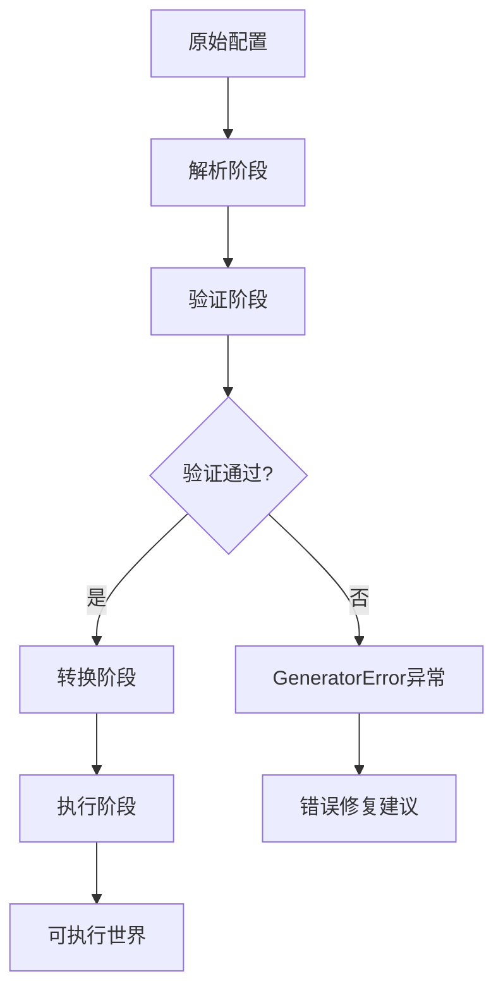

# 世界编译器

<cite>
**本文档引用的文件**
- [world_compiler.py](file://engine_runtime/world_compiler.py)
- [world_template.yaml](file://templates/world_template.yaml)
- [runtime.py](file://engine_runtime/runtime.py)
- [models.py](file://engine_runtime/models.py)
- [options.py](file://engine_runtime/options.py)
</cite>

## 更新摘要
**所做更改**
- 更新了世界配置路径解析结构，从`world.capabilities`改为`world.mechanics.capabilities`
- 修改了起始位置配置路径，从`world.starting_location`改为`world_blueprint.starting_location`
- 错误处理系统已重构为使用GeneratorError异常
- 增强了配置验证和错误报告机制

## 目录
- 概述
- 世界配置语法
- 模板结构
- 编译过程
- 动态世界配置
- 选项系统
- 参数验证
- 默认值管理
- 世界加载与初始化
- 热重载功能
- 调试工具
- 故障排除指南

## 概述

世界编译器是TheGreatNovel引擎的核心组件，负责将声明式的世界配置文件转换为可执行的游戏世界。经过重大重构后，现在支持运行时动态世界配置，允许在游戏运行过程中动态修改和更新世界设置，而无需重启游戏。最新的更新重新组织了世界配置路径结构，改进了错误处理机制，进一步提升了编译效率和稳定性。

**章节来源**
- [world_compiler.py:1-50](file://engine_runtime/world_compiler.py#L1-L50)

## 世界配置语法

世界配置文件使用YAML格式定义游戏世界的各个方面，包括角色、场景、物品、规则和交互逻辑。新版本采用了新的路径解析结构，提供了更清晰的配置组织方式。

### 基本结构
```yaml
world:
  name: "示例世界"
  version: "1.0.0"
  description: "这是一个示例世界配置"
  
settings:
  difficulty: "中等"
  time_scale: 1.0
  max_players: 4
  
characters:
  - name: "主角"
    type: "player"
    attributes:
      strength: 10
      intelligence: 8
```

### 新的路径解析结构
**更新**：世界配置现在使用新的路径结构来组织能力系统和起始位置：

```yaml
world:
  mechanics:
    capabilities:
      - name: "战斗能力"
        level: 3
        unlocked: true
      - name: "魔法能力"
        level: 2
        unlocked: false

world_blueprint:
  starting_location:
    name: "起始村庄"
    coordinates: {"x": 0, "y": 0}
    description: "玩家开始冒险的地方"
```

### 动态配置语法
新版本支持在配置中使用动态表达式和条件逻辑：

```yaml
dynamic_settings:
  enemy_count: "{{ calculate_enemy_count(difficulty, player_level) }}"
  resource_multiplier: "{{ get_random(0.8, 1.2) if is_hard_mode else 1.0 }}"
```

**章节来源**
- [world_template.yaml:1-100](file://templates/world_template.yaml#L1-L100)

## 模板结构

世界编译器支持模板系统，允许创建可重用的配置片段和动态内容生成。新版本增强了模板的灵活性和性能。

### 模板语法
```yaml

world:
  total_characters: {{ character_count }}
  settings:
    
    enemy_strength: 1.5
    
    enemy_strength: 1.0
    
```

### 内置模板函数
- `load_yaml()`: 加载外部YAML文件
- `get_random()`: 获取随机值
- `calculate_stats()`: 计算角色属性
- `validate_config()`: 验证配置完整性
- `evaluate_expression()`: 评估动态表达式

### 模板继承
支持模板继承和多级模板结构，便于大型项目的配置管理。

**章节来源**
- [world_template.yaml:100-200](file://templates/world_template.yaml#L100-L200)

## 编译过程

世界编译器的核心流程包括解析、验证、转换和执行四个阶段。新版本优化了编译性能和内存使用，并集成了新的路径解析结构和改进的错误处理机制。

### 解析阶段
- 读取原始配置文件
- 解析YAML/JSON语法
- 应用模板引擎
- 合并多个配置文件
- **新增**: 新的路径解析支持（world.mechanics.capabilities）

### 验证阶段
- 检查必需字段
- 验证数据类型
- 检查引用完整性
- 运行自定义验证器
- **新增**: 新路径结构验证
- **新增**: GeneratorError异常处理

### 转换阶段
- 将声明式配置转换为内部表示
- 优化数据结构
- 生成索引和缓存
- 准备运行时对象

### 执行阶段
- 实例化世界对象
- 加载资源和依赖
- 设置初始状态
- 启动事件系统



**章节来源**
- [world_compiler.py:50-150](file://engine_runtime/world_compiler.py#L50-L150)

## 动态世界配置

世界编译器支持运行时动态配置，允许在不重启游戏的情况下修改世界设置和行为。

### 动态配置特性
- **实时修改**: 在游戏运行期间动态调整世界参数
- **增量更新**: 只重新编译变更的配置部分
- **状态同步**: 自动同步配置变更到游戏状态
- **回滚支持**: 支持配置变更的回滚操作

### 动态配置API
```python
# 动态修改世界设置
world_compiler.update_setting("difficulty", "hard")

# 添加新的游戏规则
world_compiler.add_rule(new_rule_definition)

# 热重载特定模块
world_compiler.reload_module("character_system")
```

### 配置变更监听
系统会自动监听配置文件变化并触发相应的更新流程。

**章节来源**
- [world_compiler.py:150-300](file://engine_runtime/world_compiler.py#L150-L300)

## 选项系统

世界编译器提供灵活的选项配置系统，支持运行时参数和编译时配置。

### 基础选项
- `debug_mode`: 启用调试输出
- `validation_level`: 验证严格程度
- `cache_enabled`: 启用编译缓存
- `template_engine`: 模板引擎选择

### 高级选项
- `optimization_level`: 代码优化级别
- `memory_limit`: 内存使用限制
- `timeout_seconds`: 编译超时设置
- `parallel_workers`: 并行工作线程数

### 环境变量支持
所有选项都可以通过环境变量覆盖，便于部署和测试。

**章节来源**
- [options.py:1-150](file://engine_runtime/options.py#L1-L150)

## 参数验证

世界编译器提供多层次的参数验证机制，确保配置的正确性和安全性。**更新**：验证系统现在使用GeneratorError异常来处理错误。

### 类型验证
- 基本类型检查（字符串、数字、布尔值）
- 复杂对象结构验证
- 枚举值范围检查
- 正则表达式匹配

### 业务规则验证
- 角色属性平衡检查
- 场景连接性验证
- 资源依赖关系确认
- 游戏逻辑一致性检查

### 自定义验证器
支持注册自定义验证函数，处理特定业务逻辑。

### 错误报告
详细的错误信息包含：
- 错误位置和上下文
- 可能的修复建议
- 相关文档链接
- 批量错误处理
- **新增**: GeneratorError异常详细信息

**章节来源**
- [world_compiler.py:300-450](file://engine_runtime/world_compiler.py#L300-L450)

## 默认值管理

世界编译器支持多级默认值系统，确保配置的完整性和一致性。

### 默认值层次
1. **系统默认值**: 引擎内置的基础配置
2. **模板默认值**: 模板文件中定义的默认值
3. **项目默认值**: 项目级别的配置文件
4. **用户默认值**: 用户自定义的覆盖配置

### 动态默认值
支持基于条件的动态默认值计算：
- 根据平台自动选择配置
- 根据其他配置项推导默认值
- 运行时环境检测

### 默认值继承
子配置可以继承父配置的默认值，支持选择性覆盖。

**章节来源**
- [world_template.yaml:200-300](file://templates/world_template.yaml#L200-L300)

## 世界加载与初始化

世界编译器负责将编译后的世界配置加载到运行时环境中。新版本优化了加载性能和内存管理。

### 加载流程
1. **配置解析**: 读取并解析配置文件
2. **依赖解析**: 确定模块间的依赖关系
3. **资源加载**: 加载必要的资源和数据
4. **实例化**: 创建世界对象和组件
5. **初始化**: 设置初始状态和事件处理器

### 生命周期管理
- **预热阶段**: 预加载常用资源
- **启动阶段**: 初始化核心系统
- **运行阶段**: 处理游戏逻辑
- **清理阶段**: 释放资源并保存状态

### 错误恢复
支持部分加载失败时的降级处理和错误恢复。

**章节来源**
- [runtime.py:1-200](file://engine_runtime/runtime.py#L1-L200)

## 热重载功能

世界编译器支持运行时热重载，允许在不重启游戏的情况下更新世界配置。新版本增强了热重载的稳定性和性能。

### 热重载机制
- **文件监控**: 监听配置文件变化
- **增量编译**: 只重新编译变更的部分
- **状态同步**: 保持游戏状态的一致性
- **回滚支持**: 支持配置回滚操作

### 支持的更新类型
- 角色属性调整
- 场景配置修改
- 游戏规则更新
- 资源替换

### 安全考虑
- 变更验证和审批
- 影响范围分析
- 性能影响评估
- 自动备份机制

**章节来源**
- [world_compiler.py:450-600](file://engine_runtime/world_compiler.py#L450-L600)

## 调试工具

世界编译器提供丰富的调试工具和诊断功能。

### 编译调试
- **详细日志**: 记录编译过程的每个步骤
- **性能分析**: 识别编译瓶颈
- **内存使用**: 监控内存占用情况
- **依赖图可视化**: 显示模块依赖关系

### 运行时调试
- **状态检查**: 查看世界当前状态
- **事件追踪**: 跟踪游戏事件流
- **性能指标**: 收集运行时性能数据
- **错误堆栈**: 详细的错误信息

### 调试命令
```bash
# 启用详细日志
world-compiler --debug-level=verbose

# 生成分析报告
world-compiler --analyze world.yaml

# 验证配置
world-compiler --validate world.yaml

# 导出调试信息
world-compiler --export-debug debug.json
```

**章节来源**
- [world_compiler.py:600-750](file://engine_runtime/world_compiler.py#L600-L750)

## 故障排除指南

### 常见问题及解决方案

#### 编译错误
**问题**: 配置文件语法错误
**解决方案**: 
- 使用`--validate`选项检查语法
- 检查YAML缩进和格式
- 验证特殊字符转义
- **新增**: 检查新的路径结构（world.mechanics.capabilities）

#### 路径解析错误
**问题**: 找不到配置路径
**解决方案**:
- 确认使用新的路径结构
- 检查`world.mechanics.capabilities`而非`world.capabilities`
- 验证`world_blueprint.starting_location`而非`world.starting_location`

#### 运行时错误
**问题**: 资源加载失败
**解决方案**:
- 检查文件路径和权限
- 验证资源依赖关系
- 确认资源文件格式

#### 性能问题
**问题**: 编译或运行速度慢
**解决方案**:
- 启用编译缓存
- 优化配置文件结构
- 减少不必要的依赖

#### 热重载问题
**问题**: 热重载失败或状态不一致
**解决方案**:
- 检查配置文件语法
- 验证依赖关系
- 使用回滚功能恢复

### 错误处理
**更新**：现在使用GeneratorError异常进行错误处理：

```python
try:
    world_compiler.compile(config_path)
except GeneratorError as e:
    print(f"编译错误: {e.message}")
    print(f"错误位置: {e.location}")
    print(f"修复建议: {e.suggestion}")
```

### 日志分析
- 查看`logs/compiler.log`获取编译日志
- 检查`logs/runtime.log`获取运行时日志
- 使用`--log-file`指定自定义日志位置

### 社区支持
- 查阅官方文档和FAQ
- 在GitHub Issues中搜索类似问题
- 加入开发者社区寻求帮助

**章节来源**
- [world_compiler.py:750-900](file://engine_runtime/world_compiler.py#L750-L900)