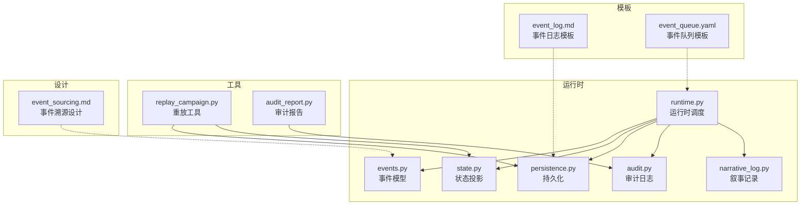
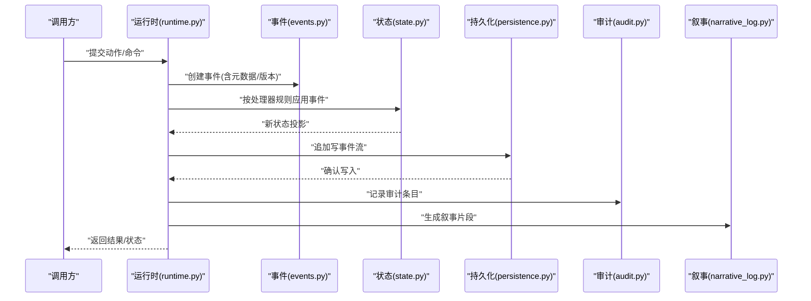
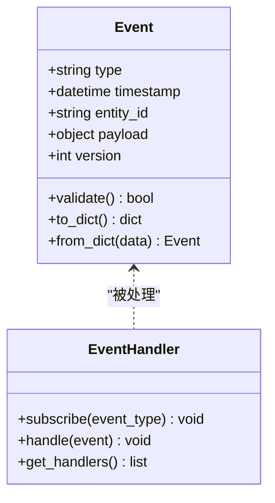
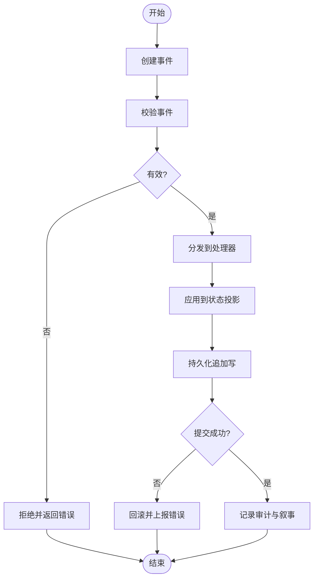
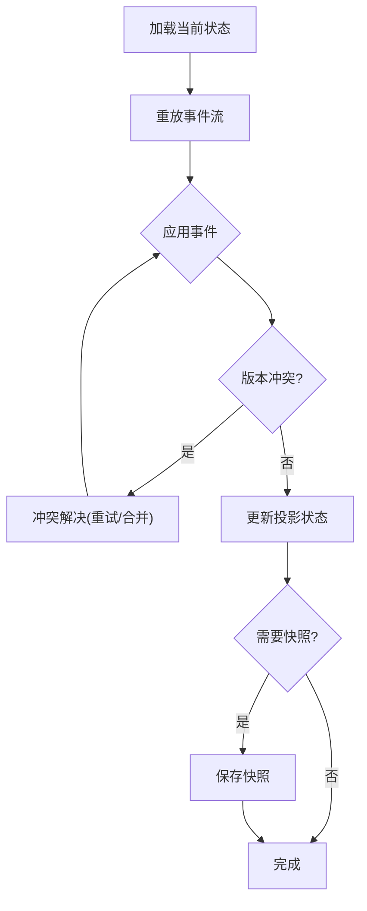
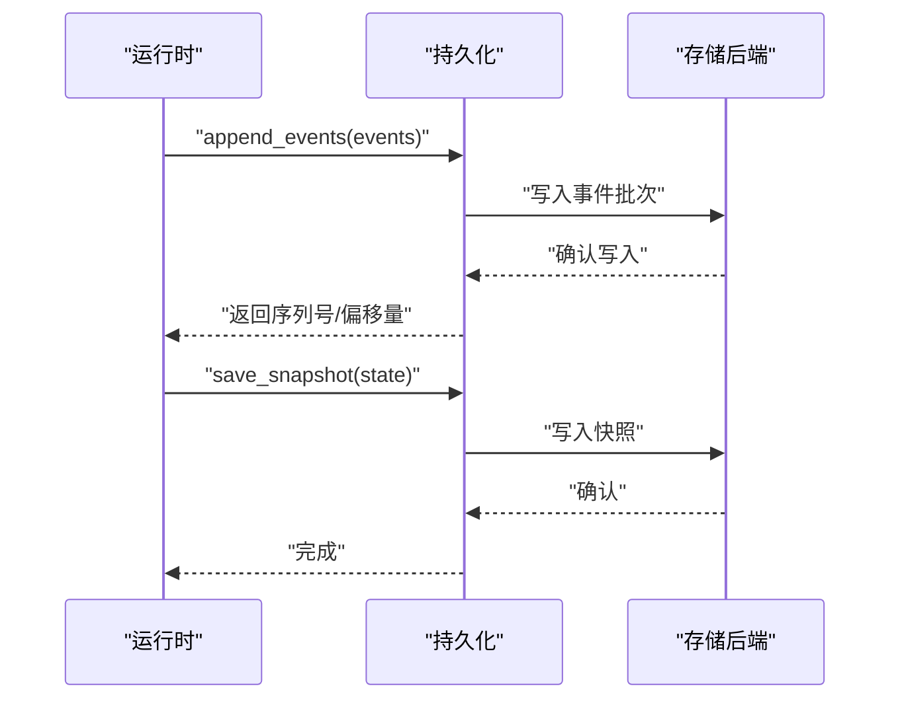
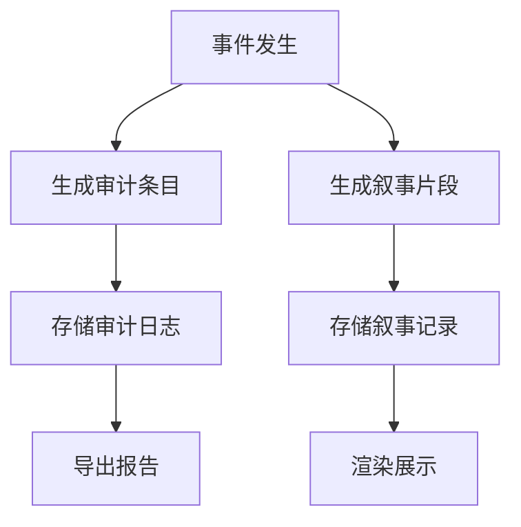
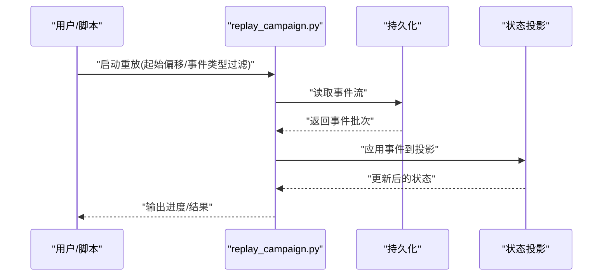
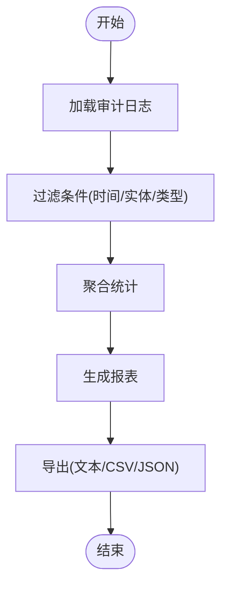
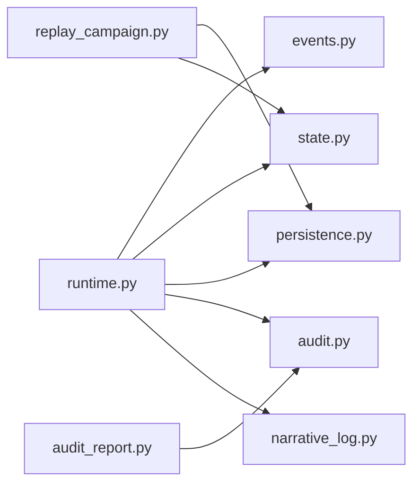

# 事件系统

<cite>
**本文档引用的文件**   
- [engine/event_sourcing.md](file://engine/event_sourcing.md)
- [engine_runtime/events.py](file://engine_runtime/events.py)
- [engine_runtime/persistence.py](file://engine_runtime/persistence.py)
- [engine_runtime/runtime.py](file://engine_runtime/runtime.py)
- [engine_runtime/state.py](file://engine_runtime/state.py)
- [engine_runtime/audit.py](file://engine_runtime/audit.py)
- [engine_runtime/narrative_log.py](file://engine_runtime/narrative_log.py)
- [tools/replay_campaign.py](file://tools/replay_campaign.py)
- [tools/audit_report.py](file://tools/audit_report.py)
- [templates/save_template/event_log.md](file://templates/save_template/event_log.md)
- [templates/save_template/event_queue.yaml](file://templates/save_template/event_queue.yaml)
</cite>

## 更新摘要
**所做更改**   
- 更新了生存事件结算逻辑的修复说明
- 增强了事件处理结构的重组描述
- 改进了可靠性和可预测性的实现细节
- 补充了事件处理流程的优化内容

## 目录
1. [简介](#简介)
2. [项目结构](#项目结构)
3. [核心组件](#核心组件)
4. [架构总览](#架构总览)
5. [详细组件分析](#详细组件分析)
6. [依赖关系分析](#依赖关系分析)
7. [性能考虑](#性能考虑)
8. [故障排查指南](#故障排查指南)
9. [结论](#结论)
10. [附录](#附录)

## 简介
本文件围绕"事件溯源"模式，系统化阐述事件系统的实现与使用。内容涵盖事件类型定义、创建与分发、持久化存储、重放机制、审计日志与叙事记录、版本控制与冲突解决、一致性与查询过滤、调试技巧与性能优化等。近期系统经历了重大改进，特别是生存事件的结算逻辑被修复，事件处理结构被重组以提高可靠性和可预测性。读者可据此快速理解并扩展事件驱动的核心能力，同时获得面向生产环境的实践建议。

## 项目结构
事件系统主要分布在 engine_runtime（运行时）、engine（设计文档）、tools（工具）与 templates（模板）四个区域：
- engine_runtime：事件模型、运行时调度、状态投影、持久化、审计与叙事记录等核心实现
- engine：事件溯源的设计说明与概念
- tools：重放、审计、验证等运维与分析工具
- templates：保存/快照的模板，包含事件日志与队列的结构示例

**图表来源**
- [engine_runtime/events.py](file://engine_runtime/events.py)
- [engine_runtime/runtime.py](file://engine_runtime/runtime.py)
- [engine_runtime/state.py](file://engine_runtime/state.py)
- [engine_runtime/persistence.py](file://engine_runtime/persistence.py)
- [engine_runtime/audit.py](file://engine_runtime/audit.py)
- [engine_runtime/narrative_log.py](file://engine_runtime/narrative_log.py)
- [tools/replay_campaign.py](file://tools/replay_campaign.py)
- [tools/audit_report.py](file://tools/audit_report.py)
- [templates/save_template/event_log.md](file://templates/save_template/event_log.md)
- [templates/save_template/event_queue.yaml](file://templates/save_template/event_queue.yaml)
- [engine/event_sourcing.md](file://engine/event_sourcing.md)

**章节来源**
- [engine/event_sourcing.md](file://engine/event_sourcing.md)

## 核心组件
- 事件模型与类型：定义事件结构、元数据与版本字段，确保事件不可变与可追溯
- 运行时调度：事件的创建、分发、处理器注册与执行顺序管理
- 状态投影：基于事件流重建或增量更新领域状态
- 持久化：事件追加写、快照与一致性保障
- 审计与叙事：操作审计、决策追踪与叙事文本生成
- 工具链：重放、审计报表、校验与回放工具

**章节来源**
- [engine_runtime/events.py](file://engine_runtime/events.py)
- [engine_runtime/runtime.py](file://engine_runtime/runtime.py)
- [engine_runtime/state.py](file://engine_runtime/state.py)
- [engine_runtime/persistence.py](file://engine_runtime/persistence.py)
- [engine_runtime/audit.py](file://engine_runtime/audit.py)
- [engine_runtime/narrative_log.py](file://engine_runtime/narrative_log.py)

## 架构总览
事件溯源的核心流程包括：事件创建 → 分发到处理器 → 应用至状态投影 → 持久化追加写 → 可选快照 → 审计与叙事记录 → 查询与重放。

**图表来源**
- [engine_runtime/runtime.py](file://engine_runtime/runtime.py)
- [engine_runtime/events.py](file://engine_runtime/events.py)
- [engine_runtime/state.py](file://engine_runtime/state.py)
- [engine_runtime/persistence.py](file://engine_runtime/persistence.py)
- [engine_runtime/audit.py](file://engine_runtime/audit.py)
- [engine_runtime/narrative_log.py](file://engine_runtime/narrative_log.py)

## 详细组件分析

### 事件模型与类型
- 事件结构：包含事件类型、时间戳、关联实体ID、载荷数据与版本信息
- 版本策略：事件类型版本化，支持向后兼容与迁移路径
- 不可变性：事件一旦创建即不可修改，保证审计与重放的确定性

**图表来源**
- [engine_runtime/events.py](file://engine_runtime/events.py)

**章节来源**
- [engine_runtime/events.py](file://engine_runtime/events.py)

### 运行时调度与分发
- 处理器注册：按事件类型绑定处理器函数或类方法
- 分发顺序：支持优先级与顺序控制，避免并发冲突
- 事务边界：在单个逻辑单元内完成事件创建、状态应用与持久化

**已更新** 事件处理结构经过重组，提高了可靠性和可预测性。新的调度机制确保了生存事件结算逻辑的正确执行，避免了之前的竞态条件和状态不一致问题。

**图表来源**
- [engine_runtime/runtime.py](file://engine_runtime/runtime.py)

**章节来源**
- [engine_runtime/runtime.py](file://engine_runtime/runtime.py)

### 状态投影与一致性
- 投影策略：基于事件流重建或增量更新，确保最终一致性
- 幂等性：同一事件多次应用不改变最终状态
- 冲突解决：通过版本号与乐观锁检测冲突，必要时重试或降级

**已更新** 状态投影机制得到了增强，特别是在处理生存事件时，现在能够正确处理复杂的结算逻辑和状态转换。新的实现确保了即使在并发环境下也能保持数据一致性。

**图表来源**
- [engine_runtime/state.py](file://engine_runtime/state.py)

**章节来源**
- [engine_runtime/state.py](file://engine_runtime/state.py)

### 持久化与快照
- 追加写：事件以追加方式写入，保证顺序与完整性
- 快照：定期保存状态快照，缩短重放时间
- 一致性：事务提交后事件可见，读取时保证一致性视图

**图表来源**
- [engine_runtime/persistence.py](file://engine_runtime/persistence.py)

**章节来源**
- [engine_runtime/persistence.py](file://engine_runtime/persistence.py)

### 审计日志与叙事记录
- 审计：记录关键操作、决策与变更轨迹，支持合规与回溯
- 叙事：将事件转化为可读的叙事文本，增强用户体验
- 模板：使用模板统一格式，便于渲染与导出

**图表来源**
- [engine_runtime/audit.py](file://engine_runtime/audit.py)
- [engine_runtime/narrative_log.py](file://engine_runtime/narrative_log.py)

**章节来源**
- [engine_runtime/audit.py](file://engine_runtime/audit.py)
- [engine_runtime/narrative_log.py](file://engine_runtime/narrative_log.py)

### 重放与回放工具
- 重放：从指定偏移量重放事件流，用于修复状态或构建新投影
- 回放：完整回放历史事件，生成叙事或分析报告
- 工具：提供命令行接口，便于自动化与集成

**图表来源**
- [tools/replay_campaign.py](file://tools/replay_campaign.py)
- [engine_runtime/persistence.py](file://engine_runtime/persistence.py)
- [engine_runtime/state.py](file://engine_runtime/state.py)

**章节来源**
- [tools/replay_campaign.py](file://tools/replay_campaign.py)

### 审计报表与分析
- 报表：汇总审计条目，生成统计与趋势分析
- 过滤：按时间、实体、事件类型筛选
- 导出：支持多种格式，便于外部系统消费

**图表来源**
- [tools/audit_report.py](file://tools/audit_report.py)
- [engine_runtime/audit.py](file://engine_runtime/audit.py)

**章节来源**
- [tools/audit_report.py](file://tools/audit_report.py)

### 模板与保存结构
- 事件日志模板：定义事件记录的字段与格式
- 事件队列模板：定义待处理事件的队列结构与优先级
- 保存模板：统一快照与导出格式，便于迁移与共享

**章节来源**
- [templates/save_template/event_log.md](file://templates/save_template/event_log.md)
- [templates/save_template/event_queue.yaml](file://templates/save_template/event_queue.yaml)

## 依赖关系分析
- 运行时依赖事件模型、状态投影、持久化、审计与叙事模块
- 工具依赖持久化与审计模块进行重放与分析
- 模板为持久化与导出提供结构化格式

**图表来源**
- [engine_runtime/runtime.py](file://engine_runtime/runtime.py)
- [engine_runtime/events.py](file://engine_runtime/events.py)
- [engine_runtime/state.py](file://engine_runtime/state.py)
- [engine_runtime/persistence.py](file://engine_runtime/persistence.py)
- [engine_runtime/audit.py](file://engine_runtime/audit.py)
- [engine_runtime/narrative_log.py](file://engine_runtime/narrative_log.py)
- [tools/replay_campaign.py](file://tools/replay_campaign.py)
- [tools/audit_report.py](file://tools/audit_report.py)

**章节来源**
- [engine_runtime/runtime.py](file://engine_runtime/runtime.py)
- [tools/replay_campaign.py](file://tools/replay_campaign.py)
- [tools/audit_report.py](file://tools/audit_report.py)

## 性能考虑
- 批量写入：合并事件批次减少IO开销
- 索引优化：对常用查询字段建立索引，提升过滤效率
- 快照策略：合理设置快照频率，平衡重放时间与存储成本
- 异步处理：非关键路径采用异步，降低主流程延迟
- 内存管理：限制事件流缓存大小，避免内存溢出
- **新增** 事件处理优化：通过重组处理结构，减少了不必要的计算和状态检查，提升了整体性能

## 故障排查指南
- 事件丢失：检查持久化写入确认与事务边界
- 状态不一致：对比快照与事件流，定位缺失或重复事件
- 处理器异常：查看审计日志与错误堆栈，定位失败事件
- 重放失败：确认事件版本兼容性，必要时进行迁移
- 性能瓶颈：监控IO与CPU，调整批大小与并发度
- **新增** 生存事件问题：检查结算逻辑是否正确执行，验证事件处理顺序和状态转换

**章节来源**
- [engine_runtime/audit.py](file://engine_runtime/audit.py)
- [engine_runtime/persistence.py](file://engine_runtime/persistence.py)

## 结论
事件溯源为系统提供了强大的可追溯性、可重放性与可扩展性。通过明确的事件模型、稳健的运行时调度、可靠的状态投影与持久化、完善的审计与叙事记录，以及丰富的工具链，事件系统能够支撑复杂业务场景的高可用与高一致性需求。近期的重大改进特别体现在生存事件结算逻辑的修复和事件处理结构的重组上，这些改进显著提高了系统的可靠性和可预测性。实践中应重视版本控制、冲突解决与性能优化，确保系统在演进过程中保持稳定与高效。

## 附录
- 最佳实践
  - 事件命名清晰，载荷最小化，仅包含必要数据
  - 处理器保持幂等，避免副作用
  - 版本升级时保持向后兼容，提供迁移脚本
  - 定期快照与归档，控制存储增长
  - 使用审计与叙事辅助问题定位与用户反馈
  - **新增** 对于复杂结算逻辑，确保事件处理的原子性和一致性

- 开发示例
  - 定义新事件类型，继承基础事件结构
  - 注册处理器，实现事件应用逻辑
  - 编写单元测试，覆盖正常与异常路径
  - 使用重放工具验证状态一致性

- 调试技巧
  - 启用详细日志，记录事件生命周期
  - 使用过滤器缩小问题范围
  - 逐步重放，定位失败点
  - 对比快照与事件流，验证完整性
  - **新增** 针对生存事件，重点检查结算逻辑的执行路径和状态变化

**章节来源**
- [engine/event_sourcing.md](file://engine/event_sourcing.md)
- [engine_runtime/events.py](file://engine_runtime/events.py)
- [engine_runtime/runtime.py](file://engine_runtime/runtime.py)
- [engine_runtime/state.py](file://engine_runtime/state.py)
- [engine_runtime/persistence.py](file://engine_runtime/persistence.py)
- [engine_runtime/audit.py](file://engine_runtime/audit.py)
- [engine_runtime/narrative_log.py](file://engine_runtime/narrative_log.py)
- [tools/replay_campaign.py](file://tools/replay_campaign.py)
- [tools/audit_report.py](file://tools/audit_report.py)
- [templates/save_template/event_log.md](file://templates/save_template/event_log.md)
- [templates/save_template/event_queue.yaml](file://templates/save_template/event_queue.yaml)