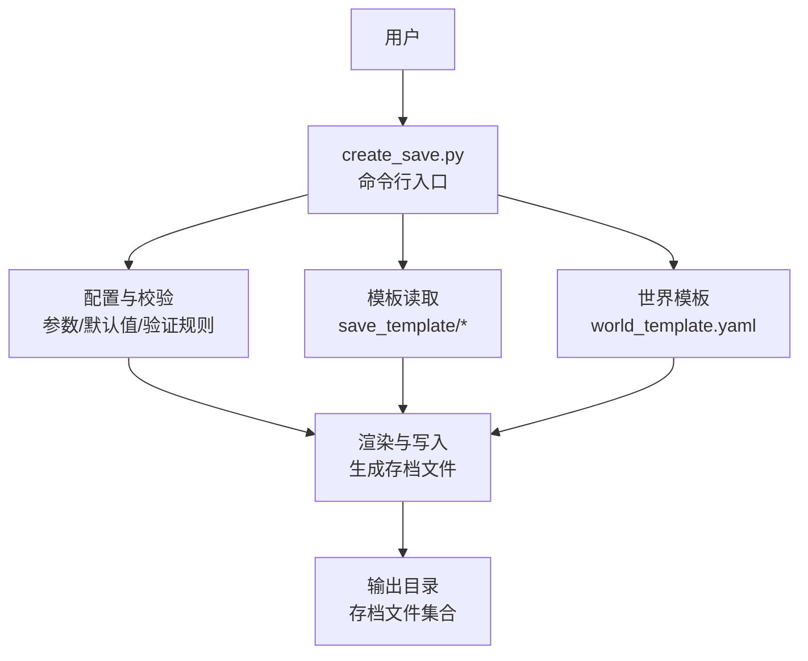
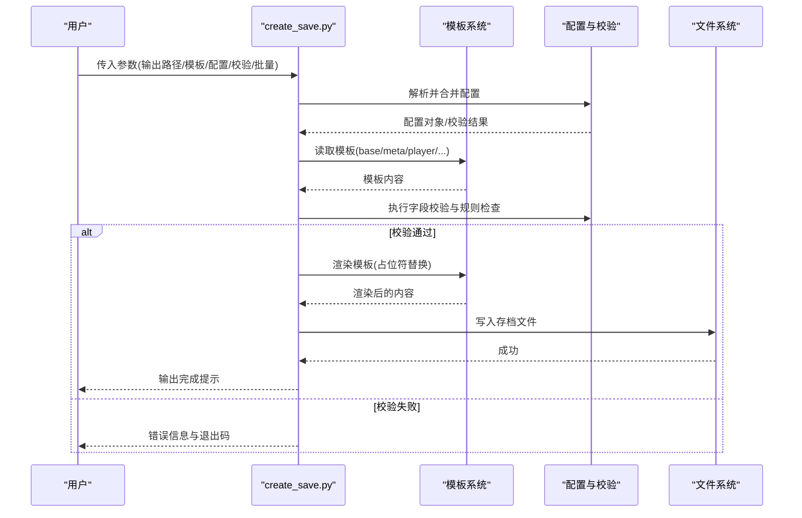
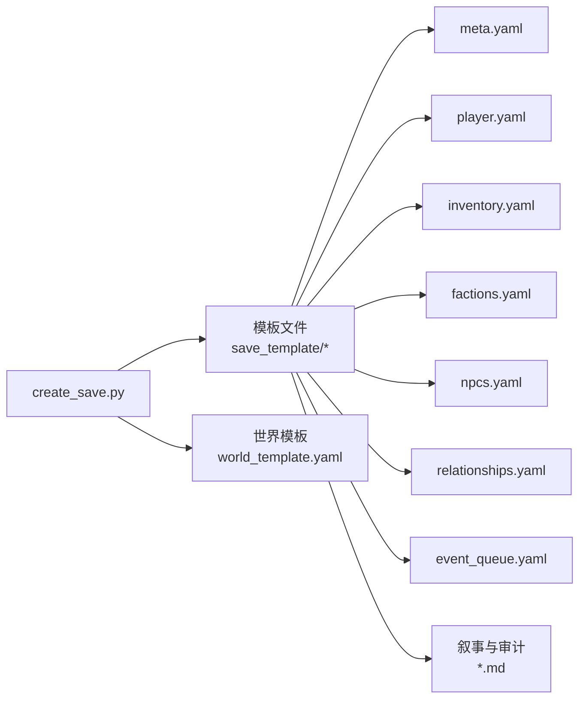

# 存档创建工具

<cite>
**本文引用的文件**   
- [create_save.py](file://tools/create_save.py)
- [base.yaml](file://templates/save_template/base.yaml)
- [meta.yaml](file://templates/save_template/meta.yaml)
- [player.yaml](file://templates/save_template/player.yaml)
- [inventory.yaml](file://templates/save_template/inventory.yaml)
- [factions.yaml](file://templates/save_template/factions.yaml)
- [npcs.yaml](file://templates/save_template/npcs.yaml)
- [relationships.yaml](file://templates/save_template/relationships.yaml)
- [event_queue.yaml](file://templates/save_template/event_queue.yaml)
- [conversation_log.md](file://templates/save_template/conversation_log.md)
- [decision_audit.md](file://templates/save_template/decision_audit.md)
- [event_log.md](file://templates/save_template/event_log.md)
- [novel_draft.md](file://templates/save_template/novel_draft.md)
- [story.md](file://templates/save_template/story.md)
- [world_template.yaml](file://templates/world_template.yaml)
</cite>

## 目录
1. [简介](#简介)
2. [项目结构](#项目结构)
3. [核心组件](#核心组件)
4. [架构总览](#架构总览)
5. [详细组件分析](#详细组件分析)
6. [依赖关系分析](#依赖关系分析)
7. [性能考虑](#性能考虑)
8. [故障排查指南](#故障排查指南)
9. [结论](#结论)
10. [附录](#附录)

## 简介
本文件为“存档创建工具”的完整技术文档，聚焦于 tools/create_save.py 的用途、命令行参数与使用方法。该工具用于从模板生成新的游戏存档，支持通过配置文件进行数据校验与错误处理，并提供批量创建与自动化脚本示例。同时，文档对存档格式、文件结构与元数据要求进行了详细说明，帮助开发者与使用者快速上手并稳定集成到工作流中。

## 项目结构
存档创建工具围绕“模板 + 配置 + 输出”的模式组织：
- 模板层：templates/save_template 提供存档各子文件的模板（YAML/Markdown），以及 world_template.yaml 作为世界级配置模板。
- 工具层：tools/create_save.py 负责解析参数、加载模板、应用配置、执行校验与生成最终存档。
- 输出层：生成的存档由多个 YAML 与 Markdown 文件组成，包含玩家状态、库存、派系、NPC、关系、事件队列、对话与决策审计等。

图表来源
- [create_save.py](file://tools/create_save.py)
- [base.yaml](file://templates/save_template/base.yaml)
- [meta.yaml](file://templates/save_template/meta.yaml)
- [world_template.yaml](file://templates/world_template.yaml)

章节来源
- [create_save.py](file://tools/create_save.py)
- [base.yaml](file://templates/save_template/base.yaml)
- [meta.yaml](file://templates/save_template/meta.yaml)
- [world_template.yaml](file://templates/world_template.yaml)

## 核心组件
- 命令行接口
  - 输入：目标输出路径、模板路径、世界模板、可选的配置覆盖项、校验开关、批量模式等。
  - 行为：解析参数、加载模板、合并配置、执行数据校验、渲染并写出存档文件。
- 模板系统
  - 基于 YAML/Markdown 的模板文件，定义存档结构与字段约束。
  - 支持占位符替换与条件渲染（依据配置）。
- 配置与校验
  - 使用配置对象或命令行参数驱动字段填充与类型校验。
  - 失败时返回明确的错误信息，便于定位问题。
- 批量与自动化
  - 支持传入多组配置，循环生成多个存档实例。
  - 可与外部脚本结合实现 CI/CD 中的自动化测试与回归。

章节来源
- [create_save.py](file://tools/create_save.py)
- [meta.yaml](file://templates/save_template/meta.yaml)
- [world_template.yaml](file://templates/world_template.yaml)

## 架构总览
以下序列图展示一次典型的存档创建流程：从命令行调用到最终输出文件。

图表来源
- [create_save.py](file://tools/create_save.py)
- [base.yaml](file://templates/save_template/base.yaml)
- [meta.yaml](file://templates/save_template/meta.yaml)
- [player.yaml](file://templates/save_template/player.yaml)
- [inventory.yaml](file://templates/save_template/inventory.yaml)
- [factions.yaml](file://templates/save_template/factions.yaml)
- [npcs.yaml](file://templates/save_template/npcs.yaml)
- [relationships.yaml](file://templates/save_template/relationships.yaml)
- [event_queue.yaml](file://templates/save_template/event_queue.yaml)
- [conversation_log.md](file://templates/save_template/conversation_log.md)
- [decision_audit.md](file://templates/save_template/decision_audit.md)
- [event_log.md](file://templates/save_template/event_log.md)
- [novel_draft.md](file://templates/save_template/novel_draft.md)
- [story.md](file://templates/save_template/story.md)
- [world_template.yaml](file://templates/world_template.yaml)

## 详细组件分析

### 命令行接口与参数
- 主要参数
  - 输出路径：指定存档生成目录。
  - 模板路径：指向 save_template 目录或单个模板文件。
  - 世界模板：world_template.yaml 的路径，用于全局配置。
  - 配置覆盖：以键值对形式覆盖模板默认值。
  - 校验开关：是否启用严格的数据校验。
  - 批量模式：传入多组配置，循环生成多个存档。
- 参数解析与默认值
  - 未提供的参数采用模板默认值或工具内置默认值。
  - 冲突参数会触发警告或拒绝执行。
- 错误处理
  - 参数缺失或类型错误将返回明确错误信息。
  - 校验失败时列出具体字段与原因。

章节来源
- [create_save.py](file://tools/create_save.py)

### 模板系统与文件格式
- 模板文件
  - base.yaml：基础框架与通用字段。
  - meta.yaml：存档元数据（版本、时间戳、作者、描述等）。
  - player.yaml：玩家角色属性与状态。
  - inventory.yaml：物品清单与数量。
  - factions.yaml：派系关系与阵营状态。
  - npcs.yaml：NPC 列表与属性。
  - relationships.yaml：角色间关系强度与历史。
  - event_queue.yaml：待处理事件队列。
  - conversation_log.md / decision_audit.md / event_log.md / novel_draft.md / story.md：叙事与审计文本。
- 占位符与变量
  - 模板中使用占位符表示可替换字段，由配置注入。
  - 支持条件渲染与嵌套结构。
- 文件结构约定
  - 每个子模块一个文件，命名清晰，便于独立维护。
  - YAML 文件遵循一致的键名与层级结构。

章节来源
- [base.yaml](file://templates/save_template/base.yaml)
- [meta.yaml](file://templates/save_template/meta.yaml)
- [player.yaml](file://templates/save_template/player.yaml)
- [inventory.yaml](file://templates/save_template/inventory.yaml)
- [factions.yaml](file://templates/save_template/factions.yaml)
- [npcs.yaml](file://templates/save_template/npcs.yaml)
- [relationships.yaml](file://templates/save_template/relationships.yaml)
- [event_queue.yaml](file://templates/save_template/event_queue.yaml)
- [conversation_log.md](file://templates/save_template/conversation_log.md)
- [decision_audit.md](file://templates/save_template/decision_audit.md)
- [event_log.md](file://templates/save_template/event_log.md)
- [novel_draft.md](file://templates/save_template/novel_draft.md)
- [story.md](file://templates/save_template/story.md)

### 数据验证与错误处理
- 校验规则
  - 必填字段检查、类型校验、取值范围限制、唯一性约束。
  - 跨文件一致性检查（如引用 ID 存在性）。
- 错误分类
  - 参数错误：缺少必需参数、类型不匹配。
  - 模板错误：占位符未替换、语法错误。
  - 业务规则错误：数值越界、关系矛盾、事件非法。
- 错误输出
  - 清晰的错误消息与定位信息（文件名、行号、字段名）。
  - 在批量模式下记录失败条目并继续其他任务。

章节来源
- [create_save.py](file://tools/create_save.py)
- [meta.yaml](file://templates/save_template/meta.yaml)
- [player.yaml](file://templates/save_template/player.yaml)
- [event_queue.yaml](file://templates/save_template/event_queue.yaml)

### 批量创建与自动化
- 批量模式
  - 通过传入多组配置，循环生成多个存档实例。
  - 支持按批次分组与进度反馈。
- 自动化脚本
  - 与 CI/CD 集成，定期生成测试存档。
  - 结合 diff 工具对比模板变更影响。
- 最佳实践
  - 将常用配置保存为 JSON/YAML 清单，便于复用。
  - 在流水线中开启严格校验，确保质量。

章节来源
- [create_save.py](file://tools/create_save.py)
- [world_template.yaml](file://templates/world_template.yaml)

### 使用示例与最佳实践
- 基本用法
  - 指定输出路径与模板路径，使用默认配置生成存档。
- 覆盖配置
  - 通过命令行参数覆盖特定字段，快速定制存档。
- 批量生成
  - 准备多组配置，一次性生成多个存档用于测试。
- 最佳实践
  - 保持模板最小化与职责单一。
  - 在配置中集中管理可变字段，避免硬编码。
  - 使用校验开关提高稳定性。

章节来源
- [create_save.py](file://tools/create_save.py)
- [meta.yaml](file://templates/save_template/meta.yaml)
- [player.yaml](file://templates/save_template/player.yaml)
- [inventory.yaml](file://templates/save_template/inventory.yaml)
- [factions.yaml](file://templates/save_template/factions.yaml)
- [npcs.yaml](file://templates/save_template/npcs.yaml)
- [relationships.yaml](file://templates/save_template/relationships.yaml)
- [event_queue.yaml](file://templates/save_template/event_queue.yaml)
- [conversation_log.md](file://templates/save_template/conversation_log.md)
- [decision_audit.md](file://templates/save_template/decision_audit.md)
- [event_log.md](file://templates/save_template/event_log.md)
- [novel_draft.md](file://templates/save_template/novel_draft.md)
- [story.md](file://templates/save_template/story.md)
- [world_template.yaml](file://templates/world_template.yaml)

## 依赖关系分析
- 内部依赖
  - create_save.py 依赖模板文件与 world_template.yaml。
  - 模板之间通过共享键名与引用保持一致性。
- 外部依赖
  - YAML/Markdown 解析库（由运行环境提供）。
  - 文件系统操作（读写输出目录）。
- 耦合与内聚
  - 工具层与模板层解耦，便于独立演进。
  - 校验逻辑集中在工具层，提升内聚性。

图表来源
- [create_save.py](file://tools/create_save.py)
- [base.yaml](file://templates/save_template/base.yaml)
- [meta.yaml](file://templates/save_template/meta.yaml)
- [player.yaml](file://templates/save_template/player.yaml)
- [inventory.yaml](file://templates/save_template/inventory.yaml)
- [factions.yaml](file://templates/save_template/factions.yaml)
- [npcs.yaml](file://templates/save_template/npcs.yaml)
- [relationships.yaml](file://templates/save_template/relationships.yaml)
- [event_queue.yaml](file://templates/save_template/event_queue.yaml)
- [conversation_log.md](file://templates/save_template/conversation_log.md)
- [decision_audit.md](file://templates/save_template/decision_audit.md)
- [event_log.md](file://templates/save_template/event_log.md)
- [novel_draft.md](file://templates/save_template/novel_draft.md)
- [story.md](file://templates/save_template/story.md)
- [world_template.yaml](file://templates/world_template.yaml)

章节来源
- [create_save.py](file://tools/create_save.py)
- [world_template.yaml](file://templates/world_template.yaml)

## 性能考虑
- 模板渲染
  - 避免重复解析，缓存已加载的模板内容。
  - 大文件分块写入，减少内存占用。
- 校验优化
  - 并行校验独立字段，缩短整体耗时。
  - 提前短路失败路径，减少不必要的计算。
- I/O 优化
  - 批量写入时使用缓冲策略。
  - 输出目录预创建与权限检查前置。

[本节为通用指导，无需具体文件来源]

## 故障排查指南
- 常见问题
  - 参数缺失：检查必需参数是否提供。
  - 模板错误：确认占位符正确且未被意外删除。
  - 校验失败：根据错误信息修正字段类型或取值。
- 调试技巧
  - 开启详细日志，定位失败位置。
  - 使用最小配置复现问题，逐步扩大范围。
- 恢复建议
  - 回滚到上一个已知可用的模板版本。
  - 清理输出目录后重试，避免残留文件干扰。

章节来源
- [create_save.py](file://tools/create_save.py)
- [meta.yaml](file://templates/save_template/meta.yaml)
- [player.yaml](file://templates/save_template/player.yaml)
- [event_queue.yaml](file://templates/save_template/event_queue.yaml)

## 结论
存档创建工具通过模板与配置的分离设计，提供了灵活、可扩展的存档生成能力。严格的校验与清晰的错误信息确保了生成过程的可控性与可维护性。借助批量与自动化能力，该工具能够无缝融入开发与测试流程，提升效率与质量。

[本节为总结性内容，无需具体文件来源]

## 附录
- 存档格式规范
  - YAML 文件：键名统一、层级清晰、注释完善。
  - Markdown 文件：结构化标题、列表与表格，便于阅读与解析。
- 元数据要求
  - 版本号、时间戳、作者、描述等字段必须存在且有效。
  - 版本兼容性声明，便于升级与迁移。
- 自动化脚本示例
  - 使用循环与配置清单批量生成存档。
  - 结合 CI/CD 平台定时执行，保证持续集成。

章节来源
- [meta.yaml](file://templates/save_template/meta.yaml)
- [world_template.yaml](file://templates/world_template.yaml)
- [create_save.py](file://tools/create_save.py)