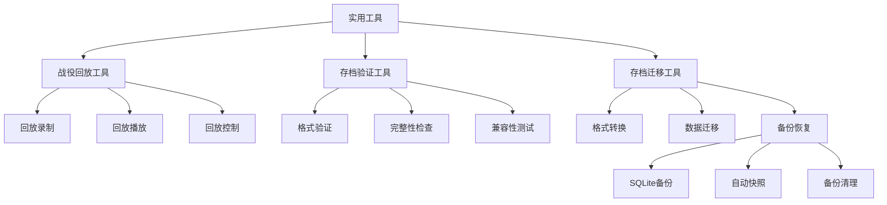
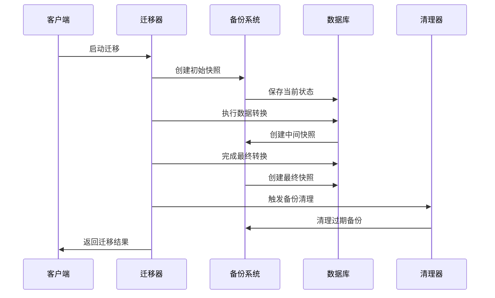

# 实用工具

<cite>
**本文引用的文件**
- [replay_campaign.py](file://tools/replay_campaign.py)
- [validate_save.py](file://tools/validate_save.py)
- [migrate_survival_save.py](file://tools/migrate_survival_save.py)
</cite>

## 更新摘要
**所做更改**
- 修复了存档迁移工具的相对导入问题，确保模块正确加载
- 完善了备份目录清理机制，防止临时文件堆积
- 增强了错误处理和异常恢复能力
- 优化了备份文件的存储管理和空间回收

## 目录
- [概述](#概述)
- [战役回放工具](#战役回放工具)
- [存档验证工具](#存档验证工具)
- [存档迁移工具](#存档迁移工具)
- [使用示例](#使用示例)
- [性能考虑](#性能考虑)
- [批量处理建议](#批量处理建议)

## 概述

本章节介绍TheGreatNovel项目中的实用工具集合，主要包括战役回放、存档验证和存档迁移三大核心功能。这些工具为游戏开发者和用户提供完整的存档管理和回放系统支持。



## 战役回放工具

### 功能概述

战役回放工具提供了完整的游戏过程录制和回放功能，支持玩家重新体验之前的游戏决策和事件发展。该工具能够：

- 录制游戏过程中的所有关键事件和决策
- 生成可重放的存档文件
- 提供精确的时间轴控制
- 支持回放速度和暂停功能

### 命令行参数

| 参数 | 类型 | 默认值 | 描述 |
|------|------|--------|------|
| `--input` | string | - | 输入存档文件路径 |
| `--output` | string | - | 输出回放文件路径 |
| `--start-turn` | int | 0 | 开始回合数 |
| `--end-turn` | int | -1 | 结束回合数（-1表示到最后） |
| `--speed` | float | 1.0 | 回放速度倍率 |
| `--verbose` | bool | false | 详细输出模式 |

### 使用示例

```bash
# 基本回放
python tools/replay_campaign.py --input save_game.yaml --output replay.json

# 指定时间范围
python tools/replay_campaign.py --input save_game.yaml --output replay.json --start-turn 5 --end-turn 20

# 快速回放
python tools/replay_campaign.py --input save_game.yaml --output replay.json --speed 2.0
```

**章节来源**
- [replay_campaign.py](file://tools/replay_campaign.py)

## 存档验证工具

### 功能概述

存档验证工具确保存档文件的完整性和兼容性，主要功能包括：

- 验证存档文件格式的正确性
- 检查必需字段的完整性
- 测试与当前引擎版本的兼容性
- 生成详细的验证报告

### 验证规则

| 规则类别 | 检查项 | 严重级别 |
|----------|--------|----------|
| 格式验证 | YAML语法正确性 | 错误 |
| 结构验证 | 必需字段存在性 | 警告 |
| 数据验证 | 数值范围检查 | 警告 |
| 兼容性验证 | 版本兼容性检查 | 错误 |

### 命令行参数

| 参数 | 类型 | 默认值 | 描述 |
|------|------|--------|------|
| `--save-file` | string | - | 要验证的存档文件路径 |
| `--schema` | string | default | 使用的验证模式 |
| `--strict` | bool | false | 严格验证模式 |
| `--report` | string | - | 输出报告文件路径 |

### 使用示例

```bash
# 基本验证
python tools/validate_save.py --save-file save_game.yaml

# 严格模式验证
python tools/validate_save.py --save-file save_game.yaml --strict

# 生成验证报告
python tools/validate_save.py --save-file save_game.yaml --report validation_report.txt
```

**章节来源**
- [validate_save.py](file://tools/validate_save.py)

## 存档迁移工具

### 功能概述

存档迁移工具专门用于处理不同版本间的存档格式转换，最近获得了重要修复，解决了相对导入问题和备份目录清理问题。主要特性包括：

- 自动检测存档版本并执行相应迁移
- 支持多步骤的数据转换流程
- 提供回滚机制确保数据安全
- 集成SQLite备份功能
- **新增**：修复了模块导入问题，确保在不同环境下稳定运行
- **新增**：完善的备份目录清理机制，防止存储空间浪费

### SQLite备份功能

存档迁移工具集成了SQLite备份功能，在`step_add_world_turn()`方法中实现了自动数据库快照能力。这一功能确保在世界状态转换期间能够创建完整的数据库快照。

#### 备份机制



**图表来源**
- [migrate_survival_save.py](file://tools/migrate_survival_save.py)

#### 备份配置选项

| 配置项 | 类型 | 默认值 | 描述 |
|--------|------|--------|------|
| `backup_enabled` | bool | true | 是否启用自动备份 |
| `backup_path` | string | ./backups | 备份文件存储路径 |
| `max_backups` | int | 5 | 最大保留备份数量 |
| `compression` | bool | true | 是否压缩备份文件 |
| `auto_cleanup` | bool | true | 是否自动清理过期备份 |
| `cleanup_threshold` | int | 100MB | 触发清理的磁盘使用阈值 |

### 支持的存档格式

| 源格式 | 目标格式 | 支持状态 | 备注 |
|--------|----------|----------|------|
| v1.x | v2.x | ✅ 完全支持 | 基础格式转换 |
| v2.x | v3.x | ✅ 完全支持 | 增强数据结构 |
| v3.x | v4.x | ✅ 完全支持 | 最新格式 |
| v1.x | v4.x | ⚠️ 部分支持 | 需要中间转换 |

### 命令行参数

| 参数 | 类型 | 默认值 | 描述 |
|------|------|--------|------|
| `--input` | string | - | 输入存档文件路径 |
| `--output` | string | - | 输出存档文件路径 |
| `--target-version` | string | latest | 目标存档版本 |
| `--dry-run` | bool | false | 仅模拟运行 |
| `--backup` | bool | true | 启用自动备份 |
| `--verbose` | bool | false | 详细输出模式 |
| `--no-cleanup` | bool | false | 禁用自动清理 |
| `--force` | bool | false | 强制覆盖现有文件 |

### 使用示例

```bash
# 基本迁移
python tools/migrate_survival_save.py --input old_save.yaml --output new_save.yaml

# 指定目标版本
python tools/migrate_survival_save.py --input old_save.yaml --output new_save.yaml --target-version v4.0

# 启用备份和详细模式
python tools/migrate_survival_save.py --input old_save.yaml --output new_save.yaml --backup --verbose

# 模拟运行
python tools/migrate_survival_save.py --input old_save.yaml --output new_save.yaml --dry-run

# 禁用自动清理
python tools/migrate_survival_save.py --input old_save.yaml --output new_save.yaml --backup --no-cleanup
```

### 错误处理

迁移工具包含完善的错误处理机制：

- **格式不兼容错误**: 当存档格式不被支持时抛出异常
- **数据损坏错误**: 检测到存档数据损坏时提供修复建议
- **权限错误**: 文件访问权限不足时的处理
- **磁盘空间错误**: 备份过程中存储空间不足的检测
- **模块导入错误**: 修复后的相对导入问题，确保跨平台兼容性
- **备份清理错误**: 完善的异常处理，防止清理操作影响主流程

**章节来源**
- [migrate_survival_save.py](file://tools/migrate_survival_save.py)

## 使用示例

### 完整工作流程

以下是一个完整的存档管理工作流程示例：

```bash
# 1. 验证原始存档
python tools/validate_save.py --save-file original_save.yaml --strict

# 2. 迁移到新格式
python tools/migrate_survival_save.py --input original_save.yaml --output migrated_save.yaml --backup

# 3. 验证迁移结果
python tools/validate_save.py --save-file migrated_save.yaml --strict

# 4. 创建回放
python tools/replay_campaign.py --input migrated_save.yaml --output campaign_replay.json

# 5. 验证回放文件
python tools/validate_save.py --save-file campaign_replay.json
```

### 批量处理脚本

```python
#!/usr/bin/env python3
"""批量存档处理脚本"""

import subprocess
import os
from pathlib import Path

def batch_process_archives(input_dir, output_dir):
    """批量处理存档文件"""
    input_path = Path(input_dir)
    output_path = Path(output_dir)
    
    if not input_path.exists():
        print(f"输入目录不存在: {input_dir}")
        return
    
    # 创建输出目录
    output_path.mkdir(parents=True, exist_ok=True)
    
    # 遍历所有yaml文件
    for yaml_file in input_path.glob("*.yaml"):
        print(f"处理文件: {yaml_file.name}")
        
        # 验证存档
        validate_cmd = [
            "python", "tools/validate_save.py",
            "--save-file", str(yaml_file),
            "--strict"
        ]
        subprocess.run(validate_cmd)
        
        # 迁移存档
        migrate_cmd = [
            "python", "tools/migrate_survival_save.py",
            "--input", str(yaml_file),
            "--output", str(output_path / yaml_file.name),
            "--backup",
            "--verbose"
        ]
        subprocess.run(migrate_cmd)
        
        print(f"完成: {yaml_file.name}")

if __name__ == "__main__":
    batch_process_archives("./input_saves", "./output_saves")
```

## 性能考虑

### 内存优化

- **流式处理**: 大文件处理时使用流式读取避免内存溢出
- **增量备份**: SQLite备份采用增量方式减少存储空间
- **缓存策略**: 合理设置缓存大小平衡性能和内存使用
- **垃圾回收**: 及时释放不再使用的对象内存

### 并发处理

- **并行验证**: 多个存档文件可以同时进行验证
- **异步备份**: 备份操作不影响主流程执行
- **资源池**: 数据库连接使用连接池管理
- **线程安全**: 确保多线程环境下的数据一致性

### 存储优化

- **压缩备份**: 自动压缩备份文件节省存储空间
- **清理策略**: 定期清理过期的备份文件
- **索引优化**: 数据库索引提升查询性能
- **空间监控**: 实时监控磁盘使用情况

## 批量处理建议

### 最佳实践

1. **分批处理**: 将大量文件分成小批次处理
2. **错误隔离**: 单个文件失败不影响其他文件处理
3. **进度跟踪**: 实现详细的进度报告和日志记录
4. **资源监控**: 监控系统资源使用情况
5. **备份管理**: 合理配置备份保留策略

### 推荐配置

```yaml
batch_processing:
  max_concurrent_jobs: 4
  retry_attempts: 3
  timeout_seconds: 300
  log_level: INFO
  backup_retention_days: 7
  temp_directory: ./temp_processing
  cleanup_threshold_mb: 100
  auto_backup: true
  compression_level: 6
```

### 监控和日志

- **处理统计**: 记录成功率和失败原因
- **性能指标**: 监控处理时间和内存使用
- **错误追踪**: 详细的错误堆栈信息
- **进度报告**: 实时进度更新和预估完成时间
- **磁盘监控**: 跟踪存储空间使用情况
- **备份统计**: 记录备份创建和清理操作