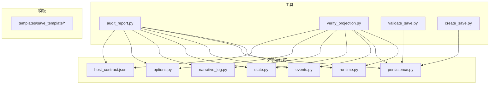
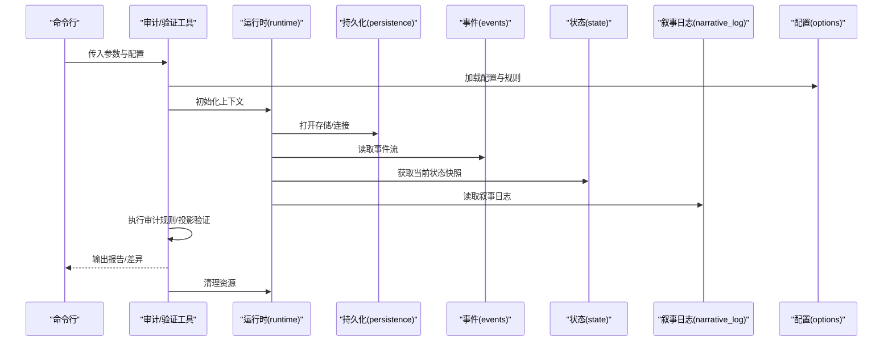
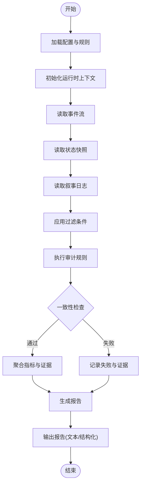
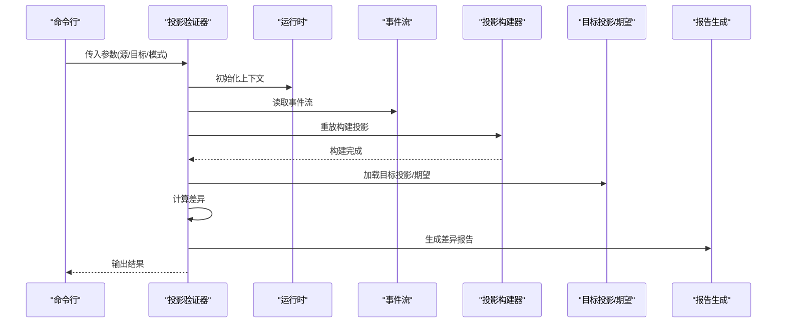
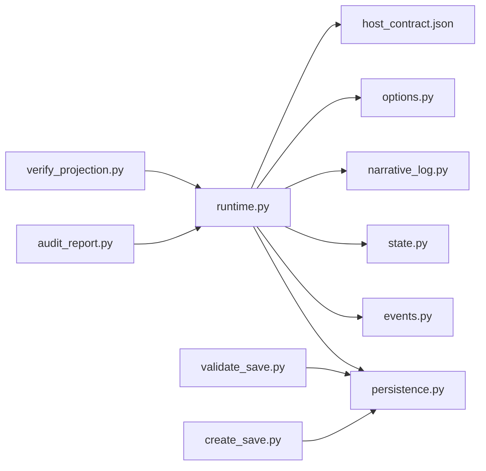

# 审计分析工具

<cite>
**本文档引用的文件**   
- [audit_report.py](file://tools/audit_report.py)
- [verify_projection.py](file://tools/verify_projection.py)
- [runtime.py](file://engine_runtime/runtime.py)
- [persistence.py](file://engine_runtime/persistence.py)
- [events.py](file://engine_runtime/events.py)
- [state.py](file://engine_runtime/state.py)
- [narrative_log.py](file://engine_runtime/narrative_log.py)
- [options.py](file://engine_runtime/options.py)
- [host_contract.json](file://engine_runtime/host_contract.json)
- [validate_save.py](file://tools/validate_save.py)
- [create_save.py](file://tools/create_save.py)
</cite>

## 目录
1. [简介](#简介)
2. [项目结构](#项目结构)
3. [核心组件](#核心组件)
4. [架构总览](#架构总览)
5. [详细组件分析](#详细组件分析)
6. [依赖关系分析](#依赖关系分析)
7. [性能考虑](#性能考虑)
8. [故障排除指南](#故障排除指南)
9. [结论](#结论)
10. [附录](#附录)

## 简介
本文件面向“审计分析工具”的使用与维护，重点说明以下两个工具的用途、使用方法与输出解读：
- audit_report.py：生成审计报告，汇总事件溯源数据、状态快照与叙事日志，提供一致性校验与问题定位。
- verify_projection.py：对投影（Projection）进行验证，确保从事件流推导出的视图与期望一致，保障数据完整性与可重现性。

文档涵盖命令行参数、输出格式、报告解读、审计配置选项与自定义规则设置，以及与事件溯源系统的集成方式与数据完整性保证。同时提供故障排除指南与常见问题解决方案，帮助读者快速上手并高效排障。

## 项目结构
本项目围绕引擎运行时与工具集组织代码。与审计相关的核心位置如下：
- tools：包含审计与验证工具脚本
- engine_runtime：事件溯源运行时、持久化、状态管理、协议与模板等
- templates：保存模板与报告模板
- tests：测试用例与夹具

图表来源
- [audit_report.py](file://tools/audit_report.py)
- [verify_projection.py](file://tools/verify_projection.py)
- [runtime.py](file://engine_runtime/runtime.py)
- [persistence.py](file://engine_runtime/persistence.py)
- [events.py](file://engine_runtime/events.py)
- [state.py](file://engine_runtime/state.py)
- [narrative_log.py](file://engine_runtime/narrative_log.py)
- [options.py](file://engine_runtime/options.py)
- [host_contract.json](file://engine_runtime/host_contract.json)

章节来源
- [audit_report.py](file://tools/audit_report.py)
- [verify_projection.py](file://tools/verify_projection.py)
- [runtime.py](file://engine_runtime/runtime.py)
- [persistence.py](file://engine_runtime/persistence.py)
- [events.py](file://engine_runtime/events.py)
- [state.py](file://engine_runtime/state.py)
- [narrative_log.py](file://engine_runtime/narrative_log.py)
- [options.py](file://engine_runtime/options.py)
- [host_contract.json](file://engine_runtime/host_contract.json)

## 核心组件
- 审计报告生成器（audit_report.py）
  - 职责：读取事件流与状态快照，结合叙事日志与配置，生成结构化审计报告；支持过滤、聚合与一致性检查。
  - 关键能力：事件回溯、状态对比、叙事一致性校验、指标统计、异常标记。
- 投影验证器（verify_projection.py）
  - 职责：基于事件流重放构建投影，并与目标投影或期望结果比对，输出差异与失败原因。
  - 关键能力：事件重放、投影重建、差异计算、断言与报告。

章节来源
- [audit_report.py](file://tools/audit_report.py)
- [verify_projection.py](file://tools/verify_projection.py)

## 架构总览
审计与验证流程围绕事件溯源运行时展开：工具通过运行时接口访问事件、状态与持久化层，按配置执行审计规则与投影验证，最终输出报告。

图表来源
- [audit_report.py](file://tools/audit_report.py)
- [verify_projection.py](file://tools/verify_projection.py)
- [runtime.py](file://engine_runtime/runtime.py)
- [persistence.py](file://engine_runtime/persistence.py)
- [events.py](file://engine_runtime/events.py)
- [state.py](file://engine_runtime/state.py)
- [narrative_log.py](file://engine_runtime/narrative_log.py)
- [options.py](file://engine_runtime/options.py)

## 详细组件分析

### 审计报告生成器（audit_report.py）
- 功能要点
  - 读取事件流与状态快照，结合叙事日志生成多维度的审计报告。
  - 支持按时间范围、事件类型、实体ID等维度过滤。
  - 执行一致性检查：事件顺序、状态变更合法性、叙事与事件对齐。
  - 输出结构化报告（JSON/YAML/Markdown），便于后续处理与展示。
- 典型使用场景
  - 定期健康检查与合规审计。
  - 发布前回归审计，确保事件流与状态一致。
  - 问题定位与根因分析，辅助排查数据不一致。
- 输出解读
  - 摘要：总体通过率、错误数、警告数、审计时长。
  - 明细：每个检查项的结果、证据（事件ID、状态片段）、建议修复步骤。
  - 附件：原始事件片段、状态快照、叙事日志片段。

图表来源
- [audit_report.py](file://tools/audit_report.py)
- [events.py](file://engine_runtime/events.py)
- [state.py](file://engine_runtime/state.py)
- [narrative_log.py](file://engine_runtime/narrative_log.py)
- [options.py](file://engine_runtime/options.py)

章节来源
- [audit_report.py](file://tools/audit_report.py)
- [events.py](file://engine_runtime/events.py)
- [state.py](file://engine_runtime/state.py)
- [narrative_log.py](file://engine_runtime/narrative_log.py)
- [options.py](file://engine_runtime/options.py)

### 投影验证器（verify_projection.py）
- 功能要点
  - 基于事件流重放构建投影，与目标投影或期望结果进行比对。
  - 支持增量验证与全量重放两种模式。
  - 输出差异详情（字段级差异、缺失/多余事件、时序问题）。
- 典型使用场景
  - 投影重构后的正确性验证。
  - 事件模型变更后的向后兼容验证。
  - 数据迁移与恢复后的完整性校验。
- 输出解读
  - 验证摘要：通过/失败、差异数量、耗时。
  - 差异清单：具体字段差异、受影响的事件与实体。
  - 建议：修复方向与回滚策略。

图表来源
- [verify_projection.py](file://tools/verify_projection.py)
- [events.py](file://engine_runtime/events.py)
- [runtime.py](file://engine_runtime/runtime.py)

章节来源
- [verify_projection.py](file://tools/verify_projection.py)
- [events.py](file://engine_runtime/events.py)
- [runtime.py](file://engine_runtime/runtime.py)

### 与事件溯源系统的集成
- 运行时接口
  - 通过运行时统一访问事件、状态与叙事日志，屏蔽底层存储细节。
  - 支持事务与一致性边界，确保审计与验证的原子性。
- 持久化层
  - 提供事件追加、查询与快照读写能力。
  - 支持多后端（文件、数据库）与版本控制。
- 协议与契约
  - host_contract.json定义宿主与运行时的交互契约，包括事件模型、状态结构与扩展点。
- 数据完整性保证
  - 事件不可变性与有序性。
  - 状态快照与事件流的校验和/签名。
  - 投影重放的幂等性与确定性。

章节来源
- [runtime.py](file://engine_runtime/runtime.py)
- [persistence.py](file://engine_runtime/persistence.py)
- [events.py](file://engine_runtime/events.py)
- [state.py](file://engine_runtime/state.py)
- [host_contract.json](file://engine_runtime/host_contract.json)

### 审计配置选项与自定义规则
- 配置来源
  - options.py提供默认配置与加载机制。
  - 可通过命令行参数覆盖默认值。
- 常见选项
  - 过滤条件：时间范围、事件类型、实体ID。
  - 检查级别：仅警告、警告+错误、严格模式。
  - 输出格式：JSON、YAML、Markdown。
  - 并行度与超时：控制性能与稳定性。
- 自定义规则
  - 在配置中声明规则名称、匹配条件与断言逻辑。
  - 支持组合规则与优先级排序。
  - 规则执行结果纳入报告与指标统计。

章节来源
- [options.py](file://engine_runtime/options.py)
- [audit_report.py](file://tools/audit_report.py)
- [verify_projection.py](file://tools/verify_projection.py)

## 依赖关系分析
- 工具与运行时
  - audit_report.py与verify_projection.py均依赖runtime.py提供的统一接口。
  - 通过persistence.py访问事件与状态，通过events.py解析事件模型，通过state.py操作状态快照，通过narrative_log.py读取叙事日志。
- 外部契约
  - host_contract.json约束事件与状态结构，确保跨模块一致性。
- 工具间协作
  - validate_save.py用于保存文件校验，create_save.py用于创建标准保存文件，可与审计与验证工具配合形成完整流水线。

图表来源
- [audit_report.py](file://tools/audit_report.py)
- [verify_projection.py](file://tools/verify_projection.py)
- [runtime.py](file://engine_runtime/runtime.py)
- [persistence.py](file://engine_runtime/persistence.py)
- [events.py](file://engine_runtime/events.py)
- [state.py](file://engine_runtime/state.py)
- [narrative_log.py](file://engine_runtime/narrative_log.py)
- [options.py](file://engine_runtime/options.py)
- [host_contract.json](file://engine_runtime/host_contract.json)
- [validate_save.py](file://tools/validate_save.py)
- [create_save.py](file://tools/create_save.py)

章节来源
- [audit_report.py](file://tools/audit_report.py)
- [verify_projection.py](file://tools/verify_projection.py)
- [runtime.py](file://engine_runtime/runtime.py)
- [persistence.py](file://engine_runtime/persistence.py)
- [events.py](file://engine_runtime/events.py)
- [state.py](file://engine_runtime/state.py)
- [narrative_log.py](file://engine_runtime/narrative_log.py)
- [options.py](file://engine_runtime/options.py)
- [host_contract.json](file://engine_runtime/host_contract.json)
- [validate_save.py](file://tools/validate_save.py)
- [create_save.py](file://tools/create_save.py)

## 性能考虑
- 事件流读取与过滤
  - 优先使用索引与分页，避免全量扫描。
  - 合理设置时间窗口与实体过滤，减少不必要的数据加载。
- 投影重放
  - 增量重放优于全量重放；缓存中间状态以提升重复验证效率。
  - 控制并发度与内存占用，防止OOM。
- 报告生成
  - 延迟序列化与按需输出，避免大对象一次性构造。
  - 使用流式写入降低峰值内存。
- 资源管理
  - 显式关闭持久化连接与文件句柄。
  - 设置合理的超时与重试策略。

[本节为通用指导，不直接分析具体文件]

## 故障排除指南
- 常见问题
  - 事件流读取失败：检查持久化连接、权限与路径；确认事件模型版本兼容。
  - 投影重放不一致：核对事件顺序与幂等性；检查投影构建器的确定性。
  - 报告为空或缺失：确认过滤条件与输入数据范围；检查日志与调试输出。
  - 性能瓶颈：优化过滤与索引；调整并发与批大小。
- 诊断步骤
  - 启用详细日志与追踪，定位失败阶段。
  - 使用validate_save.py校验保存文件完整性。
  - 使用create_save.py生成最小可复现样本。
  - 逐步缩小范围，隔离问题事件或实体。
- 修复建议
  - 修正事件模型或投影逻辑，确保向后兼容。
  - 补充缺失事件或修复状态快照。
  - 更新配置与规则，避免误报。

章节来源
- [validate_save.py](file://tools/validate_save.py)
- [create_save.py](file://tools/create_save.py)
- [persistence.py](file://engine_runtime/persistence.py)
- [events.py](file://engine_runtime/events.py)
- [state.py](file://engine_runtime/state.py)

## 结论
审计分析工具以事件溯源为核心，通过统一的运行时接口实现事件、状态与叙事的综合审计与投影验证。借助灵活的配置与规则体系，用户可定制检查策略，获得高质量的可解释报告。结合故障排除指南与性能优化建议，可在生产环境中稳定运行，保障数据完整性与系统可靠性。

[本节为总结，不直接分析具体文件]

## 附录
- 命令行参数参考
  - 审计报告：支持输入路径、过滤条件、输出格式、检查级别、并行度与超时等。
  - 投影验证：支持源/目标路径、重放模式、差异阈值、输出格式与调试开关。
- 输出格式示例
  - JSON/YAML：机器可读，便于自动化处理。
  - Markdown：人类可读，适合审查与归档。
- 最佳实践
  - 将审计与验证纳入CI/CD流水线，确保每次变更都经过一致性检查。
  - 维护事件模型与投影的向后兼容策略，避免破坏性变更。
  - 定期生成基线报告，跟踪趋势与回归。

[本节为补充信息，不直接分析具体文件]