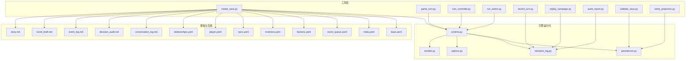
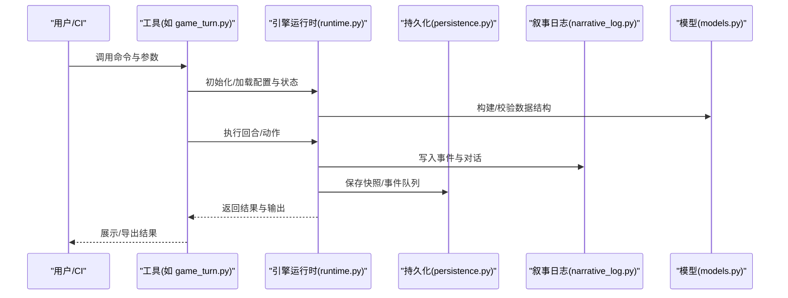
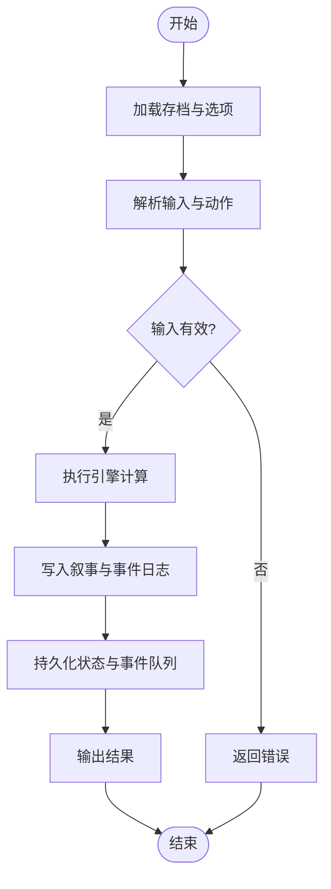
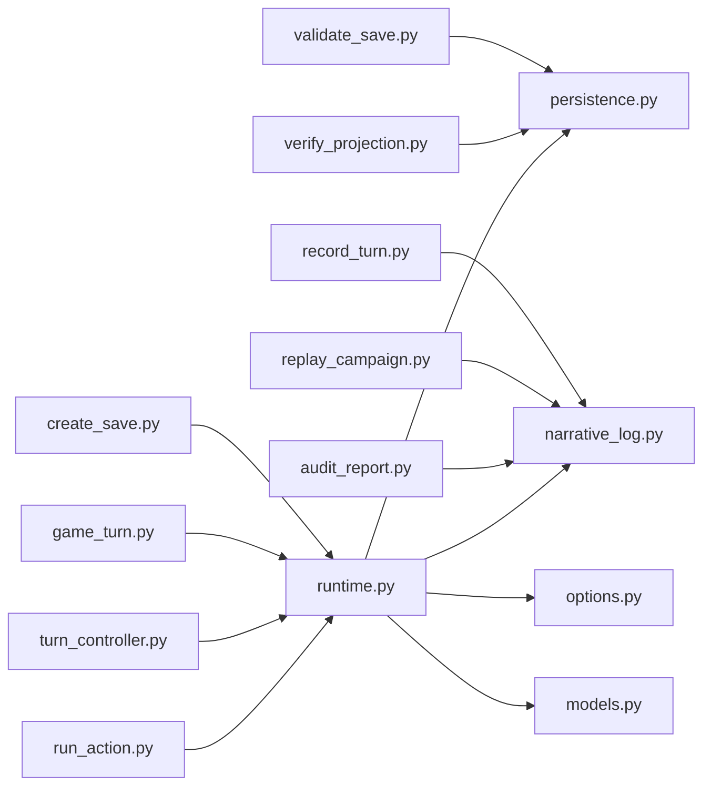

# 工具集

<cite>
**本文引用的文件**   
- [tools/audit_report.py](file://tools/audit_report.py)
- [tools/create_save.py](file://tools/create_save.py)
- [tools/game_turn.py](file://tools/game_turn.py)
- [tools/record_turn.py](file://tools/record_turn.py)
- [tools/replay_campaign.py](file://tools/replay_campaign.py)
- [tools/run_action.py](file://tools/run_action.py)
- [tools/turn_controller.py](file://tools/turn_controller.py)
- [tools/validate_save.py](file://tools/validate_save.py)
- [tools/verify_projection.py](file://tools/verify_projection.py)
- [engine_runtime/runtime.py](file://engine_runtime/runtime.py)
- [engine_runtime/persistence.py](file://engine_runtime/persistence.py)
- [engine_runtime/narrative_log.py](file://engine_runtime/narrative_log.py)
- [engine_runtime/options.py](file://engine_runtime/options.py)
- [engine_runtime/models.py](file://engine_runtime/models.py)
- [templates/save_template/base.yaml](file://templates/save_template/base.yaml)
- [templates/save_template/meta.yaml](file://templates/save_template/meta.yaml)
- [templates/save_template/event_queue.yaml](file://templates/save_template/event_queue.yaml)
- [templates/save_template/factions.yaml](file://templates/save_template/factions.yaml)
- [templates/save_template/inventory.yaml](file://templates/save_template/inventory.yaml)
- [templates/save_template/npcs.yaml](file://templates/save_template/npcs.yaml)
- [templates/save_template/player.yaml](file://templates/save_template/player.yaml)
- [templates/save_template/relationships.yaml](file://templates/save_template/relationships.yaml)
- [templates/save_template/conversation_log.md](file://templates/save_template/conversation_log.md)
- [templates/save_template/decision_audit.md](file://templates/save_template/decision_audit.md)
- [templates/save_template/event_log.md](file://templates/save_template/event_log.md)
- [templates/save_template/novel_draft.md](file://templates/save_template/novel_draft.md)
- [templates/save_template/story.md](file://templates/save_template/story.md)
</cite>

## 目录
1. [简介](#简介)
2. [项目结构](#项目结构)
3. [核心组件](#核心组件)
4. [架构总览](#架构总览)
5. [详细组件分析](#详细组件分析)
6. [依赖关系分析](#依赖关系分析)
7. [性能考虑](#性能考虑)
8. [故障排除指南](#故障排除指南)
9. [结论](#结论)
10. [附录](#附录)

## 简介
本工具集围绕“引擎运行时”提供一套命令行工具，用于存档创建、回合控制、动作执行、审计与回放等关键流程。通过统一的 CLI 接口，用户可以在本地或 CI/CD 环境中自动化运行游戏回合、生成审计报告、校验存档一致性，并回放历史事件以进行调试与分析。

## 项目结构
工具集位于 tools 目录下，每个脚本对应一个明确的职责：
- create_save.py：从模板与初始状态创建存档
- game_turn.py：驱动单回合的完整生命周期（输入、计算、输出）
- turn_controller.py：回合调度与控制逻辑
- run_action.py：执行单个动作并更新状态
- record_turn.py：录制回合过程到持久化日志
- replay_campaign.py：回放已录制的战役/回合序列
- audit_report.py：基于事件与决策日志生成可读性强的审计报告
- validate_save.py：校验存档结构与数据完整性
- verify_projection.py：验证投影结果与快照一致性

图表来源
- [tools/create_save.py](file://tools/create_save.py)
- [tools/game_turn.py](file://tools/game_turn.py)
- [tools/turn_controller.py](file://tools/turn_controller.py)
- [tools/run_action.py](file://tools/run_action.py)
- [tools/record_turn.py](file://tools/record_turn.py)
- [tools/replay_campaign.py](file://tools/replay_campaign.py)
- [tools/audit_report.py](file://tools/audit_report.py)
- [tools/validate_save.py](file://tools/validate_save.py)
- [tools/verify_projection.py](file://tools/verify_projection.py)
- [engine_runtime/runtime.py](file://engine_runtime/runtime.py)
- [engine_runtime/persistence.py](file://engine_runtime/persistence.py)
- [engine_runtime/narrative_log.py](file://engine_runtime/narrative_log.py)
- [engine_runtime/options.py](file://engine_runtime/options.py)
- [engine_runtime/models.py](file://engine_runtime/models.py)
- [templates/save_template/base.yaml](file://templates/save_template/base.yaml)
- [templates/save_template/meta.yaml](file://templates/save_template/meta.yaml)
- [templates/save_template/event_queue.yaml](file://templates/save_template/event_queue.yaml)
- [templates/save_template/factions.yaml](file://templates/save_template/factions.yaml)
- [templates/save_template/inventory.yaml](file://templates/save_template/inventory.yaml)
- [templates/save_template/npcs.yaml](file://templates/save_template/npcs.yaml)
- [templates/save_template/player.yaml](file://templates/save_template/player.yaml)
- [templates/save_template/relationships.yaml](file://templates/save_template/relationships.yaml)
- [templates/save_template/conversation_log.md](file://templates/save_template/conversation_log.md)
- [templates/save_template/decision_audit.md](file://templates/save_template/decision_audit.md)
- [templates/save_template/event_log.md](file://templates/save_template/event_log.md)
- [templates/save_template/novel_draft.md](file://templates/save_template/novel_draft.md)
- [templates/save_template/story.md](file://templates/save_template/story.md)

章节来源
- [tools/create_save.py](file://tools/create_save.py)
- [tools/game_turn.py](file://tools/game_turn.py)
- [tools/turn_controller.py](file://tools/turn_controller.py)
- [tools/run_action.py](file://tools/run_action.py)
- [tools/record_turn.py](file://tools/record_turn.py)
- [tools/replay_campaign.py](file://tools/replay_campaign.py)
- [tools/audit_report.py](file://tools/audit_report.py)
- [tools/validate_save.py](file://tools/validate_save.py)
- [tools/verify_projection.py](file://tools/verify_projection.py)
- [engine_runtime/runtime.py](file://engine_runtime/runtime.py)
- [engine_runtime/persistence.py](file://engine_runtime/persistence.py)
- [engine_runtime/narrative_log.py](file://engine_runtime/narrative_log.py)
- [engine_runtime/options.py](file://engine_runtime/options.py)
- [engine_runtime/models.py](file://engine_runtime/models.py)
- [templates/save_template/base.yaml](file://templates/save_template/base.yaml)
- [templates/save_template/meta.yaml](file://templates/save_template/meta.yaml)
- [templates/save_template/event_queue.yaml](file://templates/save_template/event_queue.yaml)
- [templates/save_template/factions.yaml](file://templates/save_template/factions.yaml)
- [templates/save_template/inventory.yaml](file://templates/save_template/inventory.yaml)
- [templates/save_template/npcs.yaml](file://templates/save_template/npcs.yaml)
- [templates/save_template/player.yaml](file://templates/save_template/player.yaml)
- [templates/save_template/relationships.yaml](file://templates/save_template/relationships.yaml)
- [templates/save_template/conversation_log.md](file://templates/save_template/conversation_log.md)
- [templates/save_template/decision_audit.md](file://templates/save_template/decision_audit.md)
- [templates/save_template/event_log.md](file://templates/save_template/event_log.md)
- [templates/save_template/novel_draft.md](file://templates/save_template/novel_draft.md)
- [templates/save_template/story.md](file://templates/save_template/story.md)

## 核心组件
- 存档创建（create_save.py）：基于模板与初始配置生成结构化存档，包含元数据、事件队列、阵营、库存、NPC、玩家、关系及叙事草稿等。
- 回合控制（game_turn.py、turn_controller.py）：编排单回合的输入收集、动作解析、引擎计算、结果输出与持久化。
- 动作执行（run_action.py）：将具体动作注入引擎，触发状态变更与事件生成。
- 录制与回放（record_turn.py、replay_campaign.py）：记录回合事件流并支持按时间线回放，便于调试与审计。
- 审计与报告（audit_report.py）：聚合事件与决策日志，生成人类可读的审计报告。
- 校验与验证（validate_save.py、verify_projection.py）：确保存档结构正确、数据一致，以及投影结果与快照一致。

章节来源
- [tools/create_save.py](file://tools/create_save.py)
- [tools/game_turn.py](file://tools/game_turn.py)
- [tools/turn_controller.py](file://tools/turn_controller.py)
- [tools/run_action.py](file://tools/run_action.py)
- [tools/record_turn.py](file://tools/record_turn.py)
- [tools/replay_campaign.py](file://tools/replay_campaign.py)
- [tools/audit_report.py](file://tools/audit_report.py)
- [tools/validate_save.py](file://tools/validate_save.py)
- [tools/verify_projection.py](file://tools/verify_projection.py)

## 架构总览
工具层通过引擎运行时提供的能力完成业务编排，运行时负责状态管理、事件源、持久化与选项处理。模板定义了存档的结构与默认值。

图表来源
- [engine_runtime/runtime.py](file://engine_runtime/runtime.py)
- [engine_runtime/persistence.py](file://engine_runtime/persistence.py)
- [engine_runtime/narrative_log.py](file://engine_runtime/narrative_log.py)
- [engine_runtime/models.py](file://engine_runtime/models.py)
- [tools/game_turn.py](file://tools/game_turn.py)

## 详细组件分析

### 存档创建（create_save.py）
- 用途：根据模板与初始配置生成存档目录与文件，包括元数据、事件队列、阵营、库存、NPC、玩家、关系、对话与故事草稿等。
- 典型参数：
  - 输出目录路径
  - 模板目录路径
  - 初始玩家信息（名称、属性等）
  - 初始阵营与关系配置
  - 是否覆盖已有存档
- 使用示例：
  - 在终端中指定输出目录与模板目录，传入玩家与阵营初始数据，生成存档。
- 输出格式：
  - YAML 文件定义结构与数据（如 base.yaml、meta.yaml、event_queue.yaml、factions.yaml、inventory.yaml、npcs.yaml、player.yaml、relationships.yaml）。
  - Markdown 文件用于叙事与审计（如 conversation_log.md、decision_audit.md、event_log.md、novel_draft.md、story.md）。
- 错误处理：
  - 模板缺失或路径无效时提示并退出。
  - 必填字段缺失时给出明确错误信息。
  - 覆盖策略需显式确认以避免误删。

章节来源
- [tools/create_save.py](file://tools/create_save.py)
- [templates/save_template/base.yaml](file://templates/save_template/base.yaml)
- [templates/save_template/meta.yaml](file://templates/save_template/meta.yaml)
- [templates/save_template/event_queue.yaml](file://templates/save_template/event_queue.yaml)
- [templates/save_template/factions.yaml](file://templates/save_template/factions.yaml)
- [templates/save_template/inventory.yaml](file://templates/save_template/inventory.yaml)
- [templates/save_template/npcs.yaml](file://templates/save_template/npcs.yaml)
- [templates/save_template/player.yaml](file://templates/save_template/player.yaml)
- [templates/save_template/relationships.yaml](file://templates/save_template/relationships.yaml)
- [templates/save_template/conversation_log.md](file://templates/save_template/conversation_log.md)
- [templates/save_template/decision_audit.md](file://templates/save_template/decision_audit.md)
- [templates/save_template/event_log.md](file://templates/save_template/event_log.md)
- [templates/save_template/novel_draft.md](file://templates/save_template/novel_draft.md)
- [templates/save_template/story.md](file://templates/save_template/story.md)

### 回合控制（game_turn.py、turn_controller.py）
- 用途：编排单回合的完整生命周期，包括输入收集、动作解析、引擎计算、结果输出与持久化。
- 典型参数：
  - 存档路径
  - 回合编号
  - 输入文件或标准输入
  - 输出格式（文本/JSON）
  - 是否启用录制
- 使用示例：
  - 指定存档路径与回合编号，提供输入后执行回合，输出结果并可录制事件。
- 处理流程：
  - 加载存档与选项
  - 解析输入与动作
  - 调用引擎运行时执行计算
  - 生成叙事与事件日志
  - 持久化状态与事件队列
  - 输出结果

图表来源
- [tools/game_turn.py](file://tools/game_turn.py)
- [tools/turn_controller.py](file://tools/turn_controller.py)
- [engine_runtime/runtime.py](file://engine_runtime/runtime.py)
- [engine_runtime/narrative_log.py](file://engine_runtime/narrative_log.py)
- [engine_runtime/persistence.py](file://engine_runtime/persistence.py)

章节来源
- [tools/game_turn.py](file://tools/game_turn.py)
- [tools/turn_controller.py](file://tools/turn_controller.py)
- [engine_runtime/runtime.py](file://engine_runtime/runtime.py)
- [engine_runtime/narrative_log.py](file://engine_runtime/narrative_log.py)
- [engine_runtime/persistence.py](file://engine_runtime/persistence.py)

### 动作执行（run_action.py）
- 用途：将单个动作注入引擎，触发状态变更与事件生成，常用于批量或自动化场景。
- 典型参数：
  - 存档路径
  - 动作定义（类型、目标、参数）
  - 是否立即持久化
  - 输出格式
- 使用示例：
  - 指定存档路径与动作 JSON/YAML，执行后输出变更摘要。
- 错误处理：
  - 动作非法或缺少必要参数时报错。
  - 引擎拒绝动作时返回原因。

章节来源
- [tools/run_action.py](file://tools/run_action.py)
- [engine_runtime/runtime.py](file://engine_runtime/runtime.py)
- [engine_runtime/models.py](file://engine_runtime/models.py)

### 录制与回放（record_turn.py、replay_campaign.py）
- 用途：
  - record_turn.py：录制回合事件流到持久化日志，便于后续回放与审计。
  - replay_campaign.py：回放已录制的战役/回合序列，重现历史状态与输出。
- 典型参数：
  - 录制/回放的目标路径
  - 时间范围或回合范围
  - 输出格式（文本/JSON）
- 使用示例：
  - 录制当前回合的事件流；随后回放指定范围的回合以复现问题。
- 错误处理：
  - 录制失败时保留部分日志并提示。
  - 回放时若事件缺失或损坏，跳过并记录警告。

章节来源
- [tools/record_turn.py](file://tools/record_turn.py)
- [tools/replay_campaign.py](file://tools/replay_campaign.py)
- [engine_runtime/narrative_log.py](file://engine_runtime/narrative_log.py)

### 审计与报告（audit_report.py）
- 用途：聚合事件与决策日志，生成可读性强的审计报告，便于审查与回溯。
- 典型参数：
  - 存档路径或事件日志路径
  - 报告输出路径
  - 过滤条件（时间、类型、实体）
- 使用示例：
  - 指定存档路径，生成包含事件统计、决策摘要与异常告警的报告。
- 输出格式：
  - Markdown 报告，包含表格与摘要。

章节来源
- [tools/audit_report.py](file://tools/audit_report.py)
- [engine_runtime/narrative_log.py](file://engine_runtime/narrative_log.py)

### 校验与验证（validate_save.py、verify_projection.py）
- 用途：
  - validate_save.py：校验存档结构与数据完整性，确保所有必需文件存在且格式正确。
  - verify_projection.py：验证投影结果与快照一致性，确保事件源与最终状态一致。
- 典型参数：
  - 存档路径
  - 严格模式（是否允许可选字段缺失）
  - 输出详细诊断
- 使用示例：
  - 对生成的存档进行校验；对回放后的状态进行一致性验证。
- 错误处理：
  - 发现不一致时列出具体差异与修复建议。

章节来源
- [tools/validate_save.py](file://tools/validate_save.py)
- [tools/verify_projection.py](file://tools/verify_projection.py)
- [engine_runtime/persistence.py](file://engine_runtime/persistence.py)

## 依赖关系分析
工具层依赖引擎运行时提供的状态管理、事件源、持久化与选项处理。模板定义了存档的结构与默认值。

图表来源
- [tools/create_save.py](file://tools/create_save.py)
- [tools/game_turn.py](file://tools/game_turn.py)
- [tools/turn_controller.py](file://tools/turn_controller.py)
- [tools/run_action.py](file://tools/run_action.py)
- [tools/record_turn.py](file://tools/record_turn.py)
- [tools/replay_campaign.py](file://tools/replay_campaign.py)
- [tools/audit_report.py](file://tools/audit_report.py)
- [tools/validate_save.py](file://tools/validate_save.py)
- [tools/verify_projection.py](file://tools/verify_projection.py)
- [engine_runtime/runtime.py](file://engine_runtime/runtime.py)
- [engine_runtime/persistence.py](file://engine_runtime/persistence.py)
- [engine_runtime/narrative_log.py](file://engine_runtime/narrative_log.py)
- [engine_runtime/options.py](file://engine_runtime/options.py)
- [engine_runtime/models.py](file://engine_runtime/models.py)

章节来源
- [tools/create_save.py](file://tools/create_save.py)
- [tools/game_turn.py](file://tools/game_turn.py)
- [tools/turn_controller.py](file://tools/turn_controller.py)
- [tools/run_action.py](file://tools/run_action.py)
- [tools/record_turn.py](file://tools/record_turn.py)
- [tools/replay_campaign.py](file://tools/replay_campaign.py)
- [tools/audit_report.py](file://tools/audit_report.py)
- [tools/validate_save.py](file://tools/validate_save.py)
- [tools/verify_projection.py](file://tools/verify_projection.py)
- [engine_runtime/runtime.py](file://engine_runtime/runtime.py)
- [engine_runtime/persistence.py](file://engine_runtime/persistence.py)
- [engine_runtime/narrative_log.py](file://engine_runtime/narrative_log.py)
- [engine_runtime/options.py](file://engine_runtime/options.py)
- [engine_runtime/models.py](file://engine_runtime/models.py)

## 性能考虑
- 批量操作：
  - 使用 run_action.py 批量注入动作，减少往返开销。
  - 合并多个小动作为批次提交，降低持久化频率。
- 持久化优化：
  - 合理设置刷新策略，避免频繁写盘。
  - 使用增量更新而非全量重写。
- 日志与审计：
  - 仅在需要时启用录制，避免 I/O 瓶颈。
  - 对审计报告进行分页与过滤，减少输出体积。
- 内存与并发：
  - 大存档分块加载，避免一次性载入全部数据。
  - 回放任务可并行执行不同片段，但需注意共享资源竞争。

[本节为通用指导，不直接分析具体文件]

## 故障排除指南
- 常见错误：
  - 模板缺失或路径无效：检查模板目录与文件名是否正确。
  - 必填字段缺失：根据错误信息补充缺失的配置项。
  - 动作非法：核对动作类型与参数是否符合模型定义。
  - 事件缺失或损坏：使用 replay 工具定位缺失片段，必要时重建事件。
- 调试技巧：
  - 启用详细日志与录制，逐步缩小问题范围。
  - 使用 validate_save.py 快速定位存档结构问题。
  - 使用 verify_projection.py 检查投影一致性。
- 恢复策略：
  - 回滚到上一个已知良好的存档版本。
  - 重放最近成功回合，重建缺失事件。

章节来源
- [tools/validate_save.py](file://tools/validate_save.py)
- [tools/verify_projection.py](file://tools/verify_projection.py)
- [tools/replay_campaign.py](file://tools/replay_campaign.py)
- [tools/audit_report.py](file://tools/audit_report.py)

## 结论
本工具集提供了从存档创建、回合控制、动作执行到审计与回放的完整闭环，适用于本地开发与 CI/CD 自动化。通过清晰的 CLI 接口与结构化模板，用户可以高效地编排与调试游戏流程，并确保数据一致性与可追溯性。

[本节为总结性内容，不直接分析具体文件]

## 附录

### 批量操作与自动化脚本
- 批量创建存档：
  - 循环遍历初始配置列表，调用 create_save.py 生成多份存档。
- 批量执行动作：
  - 准备动作清单（JSON/YAML），逐条调用 run_action.py 并汇总结果。
- 批量回放：
  - 使用 replay_campaign.py 指定时间范围，自动回放并导出报告。

章节来源
- [tools/create_save.py](file://tools/create_save.py)
- [tools/run_action.py](file://tools/run_action.py)
- [tools/replay_campaign.py](file://tools/replay_campaign.py)

### CI/CD 集成指南
- 步骤建议：
  - 安装依赖与环境变量配置。
  - 生成测试存档（create_save.py）。
  - 执行回合与动作（game_turn.py、run_action.py）。
  - 生成审计报告（audit_report.py）。
  - 校验存档与投影（validate_save.py、verify_projection.py）。
- 失败处理：
  - 捕获非零退出码，记录错误日志。
  - 上传中间产物（事件日志、报告）以便排查。

章节来源
- [tools/audit_report.py](file://tools/audit_report.py)
- [tools/validate_save.py](file://tools/validate_save.py)
- [tools/verify_projection.py](file://tools/verify_projection.py)

### 与其他工具的集成方法
- 外部输入：
  - 通过标准输入或配置文件向工具传递参数。
- 输出消费：
  - 将 Markdown/JSON 输出接入文档系统或看板。
- 扩展开发：
  - 新增动作类型需在 models.py 中定义结构，并在 run_action.py 中实现处理逻辑。
  - 新增持久化策略可在 persistence.py 中扩展存储后端。

章节来源
- [engine_runtime/models.py](file://engine_runtime/models.py)
- [tools/run_action.py](file://tools/run_action.py)
- [engine_runtime/persistence.py](file://engine_runtime/persistence.py)

### 配置选项与输出格式
- 配置选项：
  - 存档路径、模板路径、输出目录、严格模式、日志级别等。
- 输出格式：
  - YAML/Markdown/JSON 等多种格式，便于不同下游消费。
- 错误处理：
  - 统一错误码与消息，便于自动化处理。

章节来源
- [engine_runtime/options.py](file://engine_runtime/options.py)
- [templates/save_template/base.yaml](file://templates/save_template/base.yaml)
- [templates/save_template/meta.yaml](file://templates/save_template/meta.yaml)