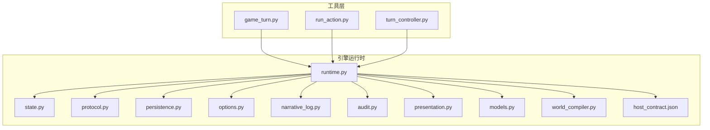
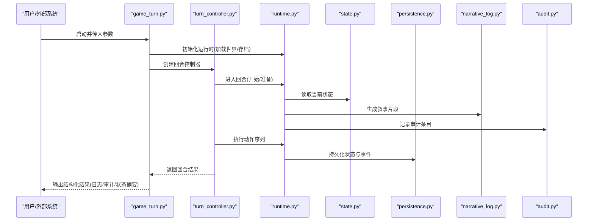
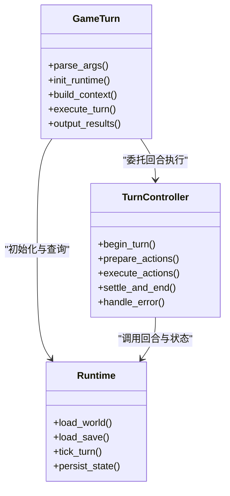
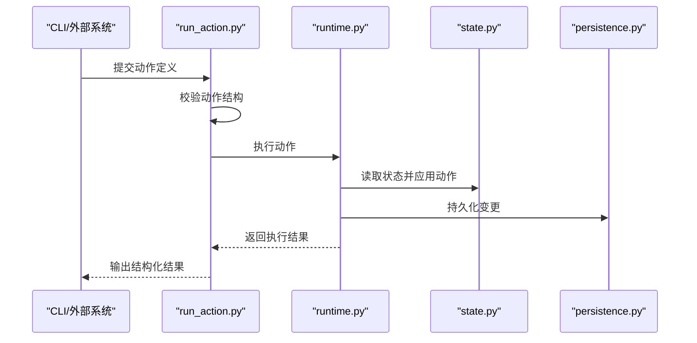
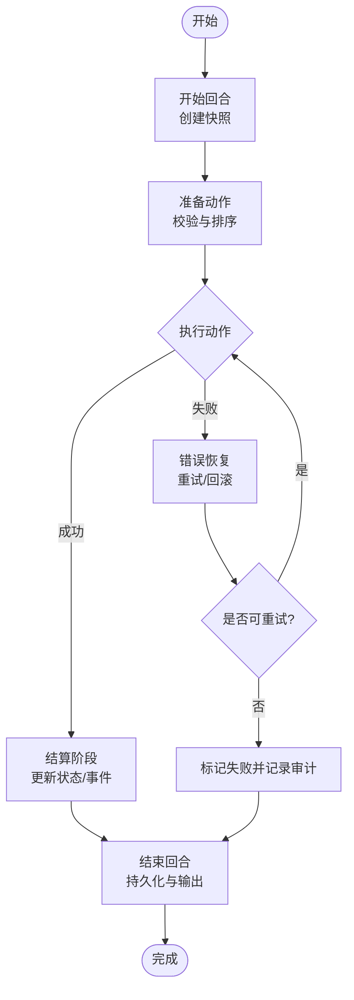
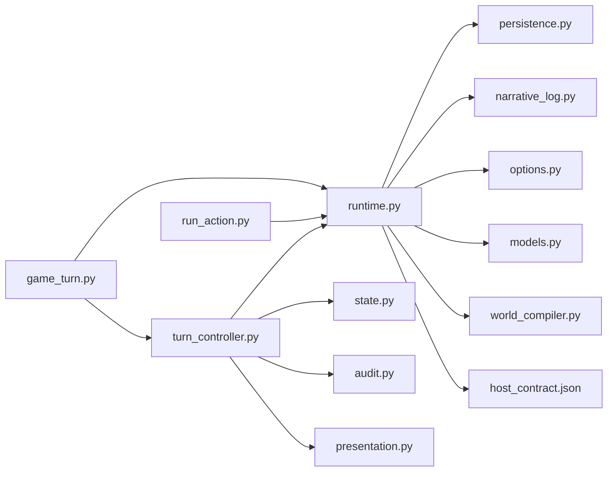

# 游戏控制工具

<cite>
**本文档引用的文件**   
- [game_turn.py](file://tools/game_turn.py)
- [run_action.py](file://tools/run_action.py)
- [turn_controller.py](file://tools/turn_controller.py)
- [runtime.py](file://engine_runtime/runtime.py)
- [state.py](file://engine_runtime/state.py)
- [protocol.py](file://engine_runtime/protocol.py)
- [persistence.py](file://engine_runtime/persistence.py)
- [options.py](file://engine_runtime/options.py)
- [narrative_log.py](file://engine_runtime/narrative_log.py)
- [audit.py](file://engine_runtime/audit.py)
- [presentation.py](file://engine_runtime/presentation.py)
- [models.py](file://engine_runtime/models.py)
- [world_compiler.py](file://engine_runtime/world_compiler.py)
- [host_contract.json](file://engine_runtime/host_contract.json)
</cite>

## 目录
1. [简介](#简介)
2. [项目结构](#项目结构)
3. [核心组件](#核心组件)
4. [架构总览](#架构总览)
5. [详细组件分析](#详细组件分析)
6. [依赖关系分析](#依赖关系分析)
7. [性能考虑](#性能考虑)
8. [故障排查指南](#故障排查指南)
9. [结论](#结论)
10. [附录](#附录)

## 简介
本文件为“游戏控制工具”的完整技术文档，聚焦 tools 目录下的三个关键脚本：
- game_turn.py：驱动单回合执行的主入口，负责解析输入、调度动作、与引擎运行时交互并持久化结果。
- run_action.py：执行单个动作（Action）的工具，支持从文件或标准输入读取动作定义，调用引擎并输出结构化结果。
- turn_controller.py：回合控制器，封装回合生命周期管理、状态同步、错误恢复与重试策略。

文档涵盖：
- 回合执行流程、动作处理与控制器逻辑
- 命令行参数、配置选项与输出格式
- 与引擎运行时的交互方式、状态管理与错误恢复机制
- 性能优化建议与调试技巧
- 实际使用示例与批处理脚本模板

## 项目结构
本项目采用分层组织：
- engine_runtime：引擎运行时库，提供协议、状态、持久化、审计、呈现等能力
- tools：面向用户的控制工具与辅助脚本
- templates：存档与世界的模板文件
- tests：测试用例与夹具

图表来源
- [runtime.py](file://engine_runtime/runtime.py)
- [state.py](file://engine_runtime/state.py)
- [protocol.py](file://engine_runtime/protocol.py)
- [persistence.py](file://engine_runtime/persistence.py)
- [options.py](file://engine_runtime/options.py)
- [narrative_log.py](file://engine_runtime/narrative_log.py)
- [audit.py](file://engine_runtime/audit.py)
- [presentation.py](file://engine_runtime/presentation.py)
- [models.py](file://engine_runtime/models.py)
- [world_compiler.py](file://engine_runtime/world_compiler.py)
- [host_contract.json](file://engine_runtime/host_contract.json)

章节来源
- [game_turn.py](file://tools/game_turn.py)
- [run_action.py](file://tools/run_action.py)
- [turn_controller.py](file://tools/turn_controller.py)
- [runtime.py](file://engine_runtime/runtime.py)

## 核心组件
本节概述三大工具的职责与协作关系：
- game_turn.py：作为用户主入口，解析命令行参数，加载世界与存档，构造回合上下文，调用 turn_controller 完成回合执行，最终输出叙事日志与审计记录。
- run_action.py：轻量动作执行器，适合在自动化流水线中调用，支持批量动作与幂等执行。
- turn_controller.py：回合控制器，负责回合生命周期（开始、准备、执行、结算、结束）、状态快照、错误恢复与重试、以及与其他工具的协调。

章节来源
- [game_turn.py](file://tools/game_turn.py)
- [run_action.py](file://tools/run_action.py)
- [turn_controller.py](file://tools/turn_controller.py)

## 架构总览
工具层通过协议与引擎运行时交互，遵循 host_contract 约定的接口契约。运行时内部维护状态机、事件队列、叙事日志与审计记录，并通过持久化模块将变更落盘。

图表来源
- [game_turn.py](file://tools/game_turn.py)
- [turn_controller.py](file://tools/turn_controller.py)
- [runtime.py](file://engine_runtime/runtime.py)
- [state.py](file://engine_runtime/state.py)
- [persistence.py](file://engine_runtime/persistence.py)
- [narrative_log.py](file://engine_runtime/narrative_log.py)
- [audit.py](file://engine_runtime/audit.py)

## 详细组件分析

### game_turn.py 分析
职责与流程：
- 解析命令行参数（如世界路径、存档路径、回合编号、输出目录、日志级别等）
- 初始化引擎运行时，加载世界与存档数据
- 构建回合上下文（玩家输入、动作列表、约束条件）
- 委托 turn_controller 执行回合
- 收集并输出叙事日志、审计记录与状态摘要

典型用法：
- 交互式回合：逐条输入动作或从文件导入
- 批处理模式：指定动作文件，自动执行并归档结果

章节来源
- [game_turn.py](file://tools/game_turn.py)

#### 类图（概念映射）

图表来源
- [game_turn.py](file://tools/game_turn.py)
- [turn_controller.py](file://tools/turn_controller.py)
- [runtime.py](file://engine_runtime/runtime.py)

### run_action.py 分析
职责与流程：
- 接收动作定义（JSON/YAML 或标准输入）
- 校验动作结构与必填字段
- 调用引擎运行时执行动作并返回结构化结果
- 支持幂等执行与重试（基于动作 ID 或版本）

典型用法：
- 在 CI/CD 中作为动作执行单元
- 与外部编排系统对接（如任务队列）

章节来源
- [run_action.py](file://tools/run_action.py)

#### 序列图（动作执行流）

图表来源
- [run_action.py](file://tools/run_action.py)
- [runtime.py](file://engine_runtime/runtime.py)
- [state.py](file://engine_runtime/state.py)
- [persistence.py](file://engine_runtime/persistence.py)

### turn_controller.py 分析
职责与流程：
- 管理回合生命周期：开始、准备、执行、结算、结束
- 状态快照与回滚：在执行前保存快照，失败时恢复
- 错误恢复与重试：捕获异常、记录审计、按策略重试
- 与 runtime 交互：调用 tick_turn、获取叙事与审计输出

典型用法：
- 被 game_turn.py 调用以完成复杂回合逻辑
- 在自动化场景中独立使用，配合外部调度

章节来源
- [turn_controller.py](file://tools/turn_controller.py)

#### 流程图（回合控制算法）

图表来源
- [turn_controller.py](file://tools/turn_controller.py)
- [runtime.py](file://engine_runtime/runtime.py)
- [state.py](file://engine_runtime/state.py)
- [audit.py](file://engine_runtime/audit.py)

### 与引擎运行时的交互方式
- 协议约定：通过 protocol.py 定义的请求/响应模型与 host_contract.json 的接口契约进行通信
- 状态管理：state.py 提供状态读写与一致性保障；runtime.py 协调状态变更与事件派发
- 持久化：persistence.py 负责存档与增量更新；narrative_log.py 与 audit.py 分别记录叙事与审计
- 呈现：presentation.py 格式化输出，便于人类阅读与机器解析

章节来源
- [protocol.py](file://engine_runtime/protocol.py)
- [host_contract.json](file://engine_runtime/host_contract.json)
- [state.py](file://engine_runtime/state.py)
- [runtime.py](file://engine_runtime/runtime.py)
- [persistence.py](file://engine_runtime/persistence.py)
- [narrative_log.py](file://engine_runtime/narrative_log.py)
- [audit.py](file://engine_runtime/audit.py)
- [presentation.py](file://engine_runtime/presentation.py)

## 依赖关系分析
工具层对引擎运行时的依赖如下：
- game_turn.py 依赖 turn_controller.py 与 runtime.py
- run_action.py 直接依赖 runtime.py 与 persistence.py
- turn_controller.py 依赖 runtime.py、state.py、audit.py 与 presentation.py

图表来源
- [game_turn.py](file://tools/game_turn.py)
- [run_action.py](file://tools/run_action.py)
- [turn_controller.py](file://tools/turn_controller.py)
- [runtime.py](file://engine_runtime/runtime.py)
- [state.py](file://engine_runtime/state.py)
- [audit.py](file://engine_runtime/audit.py)
- [presentation.py](file://engine_runtime/presentation.py)
- [persistence.py](file://engine_runtime/persistence.py)
- [narrative_log.py](file://engine_runtime/narrative_log.py)
- [options.py](file://engine_runtime/options.py)
- [models.py](file://engine_runtime/models.py)
- [world_compiler.py](file://engine_runtime/world_compiler.py)
- [host_contract.json](file://engine_runtime/host_contract.json)

章节来源
- [game_turn.py](file://tools/game_turn.py)
- [run_action.py](file://tools/run_action.py)
- [turn_controller.py](file://tools/turn_controller.py)
- [runtime.py](file://engine_runtime/runtime.py)

## 性能考虑
- 批量动作合并：在 run_action.py 中支持批量提交，减少往返开销
- 状态快照优化：仅在必要时创建快照，避免频繁 I/O
- 异步与并发：在可能的情况下对独立动作进行并行执行（需保证幂等与无冲突）
- 缓存热点数据：对频繁读取的世界常量进行内存缓存
- 日志与审计分级：根据环境调整日志级别，降低磁盘写入压力

[本节为通用指导，不直接分析具体文件]

## 故障排查指南
常见问题与定位方法：
- 动作执行失败：检查 run_action.py 的动作校验与 runtime 的错误返回；查看 audit.py 的审计条目
- 状态不一致：对比 state.py 的快照与持久化结果，确认 persistence.py 的写入顺序
- 渲染异常：检查 presentation.py 的输出格式与 options.py 的配置项
- 世界编译问题：使用 world_compiler.py 验证模板与资源完整性

章节来源
- [run_action.py](file://tools/run_action.py)
- [runtime.py](file://engine_runtime/runtime.py)
- [audit.py](file://engine_runtime/audit.py)
- [state.py](file://engine_runtime/state.py)
- [persistence.py](file://engine_runtime/persistence.py)
- [presentation.py](file://engine_runtime/presentation.py)
- [options.py](file://engine_runtime/options.py)
- [world_compiler.py](file://engine_runtime/world_compiler.py)

## 结论
game_turn.py、run_action.py 与 turn_controller.py 共同构成游戏控制工具的核心。它们通过统一的协议与引擎运行时交互，实现可靠的回合执行、动作处理与状态管理。借助完善的错误恢复、审计与持久化机制，可在复杂场景下保持稳定性与可观测性。结合性能优化与调试技巧，能够高效支撑自动化与大规模游戏控制需求。

[本节为总结，不直接分析具体文件]

## 附录

### 命令行参数与配置选项
- game_turn.py
  - 常用参数：世界路径、存档路径、回合编号、输出目录、日志级别、是否启用调试
  - 输出格式：JSON/YAML 的结构化结果，包含叙事片段、审计条目与状态摘要
- run_action.py
  - 常用参数：动作输入源（文件/标准输入）、输出目标、重试次数、幂等键
  - 输出格式：动作执行结果与错误信息
- turn_controller.py
  - 常用参数：快照策略、重试策略、错误恢复阈值、审计级别

章节来源
- [game_turn.py](file://tools/game_turn.py)
- [run_action.py](file://tools/run_action.py)
- [turn_controller.py](file://tools/turn_controller.py)
- [options.py](file://engine_runtime/options.py)

### 实际使用示例与批处理脚本
- 单回合执行：
  - 使用 game_turn.py 指定世界与存档，传入动作文件或交互式输入，输出到指定目录
- 批量动作执行：
  - 使用 run_action.py 循环处理动作文件，记录每个动作的执行结果
- 自动化流水线：
  - 结合 turn_controller.py 的回合控制逻辑，在 CI/CD 中执行多回合模拟，并归档日志与审计

[本节为通用示例，不直接分析具体文件]

### 与引擎的交互方式、状态管理与错误恢复
- 交互方式：通过 protocol.py 的请求/响应模型与 host_contract.json 的接口契约
- 状态管理：state.py 提供原子读写与一致性保障；runtime.py 协调状态变更与事件派发
- 错误恢复：turn_controller.py 实现快照与回滚，按策略重试并记录审计

章节来源
- [protocol.py](file://engine_runtime/protocol.py)
- [host_contract.json](file://engine_runtime/host_contract.json)
- [state.py](file://engine_runtime/state.py)
- [runtime.py](file://engine_runtime/runtime.py)
- [turn_controller.py](file://tools/turn_controller.py)
- [audit.py](file://engine_runtime/audit.py)

### 调试技巧
- 开启详细日志：提高日志级别，观察运行时关键路径
- 审计追踪：检查 audit.py 的审计条目，定位动作执行与状态变更
- 快照对比：比较前后快照，识别不一致点
- 单元测试：针对 run_action.py 的动作校验与边界条件编写测试

章节来源
- [runtime.py](file://engine_runtime/runtime.py)
- [audit.py](file://engine_runtime/audit.py)
- [state.py](file://engine_runtime/state.py)
- [run_action.py](file://tools/run_action.py)