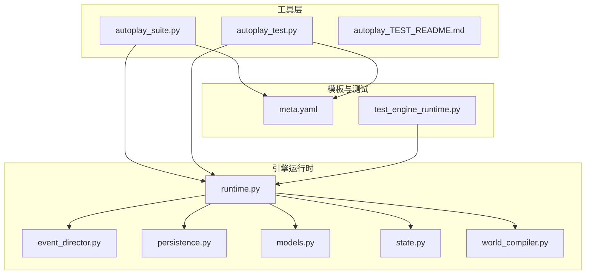
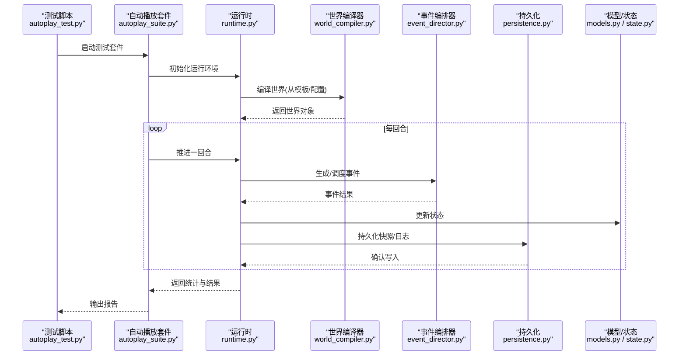
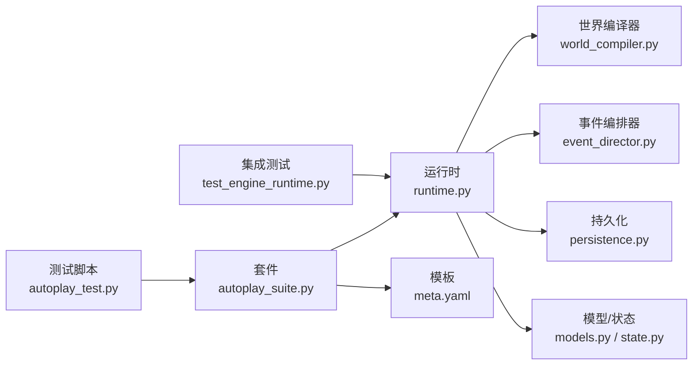

# 自动播放测试框架

<cite>
**本文引用的文件**   
- [tools/autoplay_suite.py](file://tools/autoplay_suite.py)
- [tools/autoplay_test.py](file://tools/autoplay_test.py)
- [tools/autoplay_TEST_README.md](file://tools/autoplay_TEST_README.md)
- [engine_runtime/runtime.py](file://engine_runtime/runtime.py)
- [engine_runtime/event_director.py](file://engine_runtime/event_director.py)
- [engine_runtime/persistence.py](file://engine_runtime/persistence.py)
- [engine_runtime/models.py](file://engine_runtime/models.py)
- [engine_runtime/state.py](file://engine_runtime/state.py)
- [engine_runtime/world_compiler.py](file://engine_runtime/world_compiler.py)
- [templates/save_template/meta.yaml](file://templates/save_template/meta.yaml)
- [tests/test_engine_runtime.py](file://tests/test_engine_runtime.py)
</cite>

## 目录
1. [简介](#简介)
2. [项目结构](#项目结构)
3. [核心组件](#核心组件)
4. [架构总览](#架构总览)
5. [详细组件分析](#详细组件分析)
6. [依赖关系分析](#依赖关系分析)
7. [性能考量](#性能考量)
8. [故障排查指南](#故障排查指南)
9. [结论](#结论)
10. [附录](#附录)

## 简介
本仓库包含一个“自动播放测试框架”，用于驱动游戏引擎运行时进行自动化回放与回归测试。该框架通过统一的入口脚本组织用例、调度引擎运行、持久化结果，并支持基于模板的存档加载与校验。其目标是在无需人工干预的情况下，批量执行多轮“回合”推进，验证事件编排、世界编译、状态更新与持久化的正确性。

## 项目结构
- tools 目录：自动播放测试套件与单测脚本、说明文档等
- engine_runtime 目录：引擎运行时核心（事件编排、世界编译、状态管理、持久化等）
- templates 目录：存档模板与元数据定义
- tests 目录：集成测试与示例世界配置

图表来源
- [tools/autoplay_suite.py](file://tools/autoplay_suite.py)
- [tools/autoplay_test.py](file://tools/autoplay_test.py)
- [engine_runtime/runtime.py](file://engine_runtime/runtime.py)
- [engine_runtime/event_director.py](file://engine_runtime/event_director.py)
- [engine_runtime/persistence.py](file://engine_runtime/persistence.py)
- [engine_runtime/models.py](file://engine_runtime/models.py)
- [engine_runtime/state.py](file://engine_runtime/state.py)
- [engine_runtime/world_compiler.py](file://engine_runtime/world_compiler.py)
- [templates/save_template/meta.yaml](file://templates/save_template/meta.yaml)
- [tests/test_engine_runtime.py](file://tests/test_engine_runtime.py)

章节来源
- [tools/autoplay_suite.py](file://tools/autoplay_suite.py)
- [tools/autoplay_test.py](file://tools/autoplay_test.py)
- [tools/autoplay_TEST_README.md](file://tools/autoplay_TEST_README.md)
- [engine_runtime/runtime.py](file://engine_runtime/runtime.py)
- [engine_runtime/event_director.py](file://engine_runtime/event_director.py)
- [engine_runtime/persistence.py](file://engine_runtime/persistence.py)
- [engine_runtime/models.py](file://engine_runtime/models.py)
- [engine_runtime/state.py](file://engine_runtime/state.py)
- [engine_runtime/world_compiler.py](file://engine_runtime/world_compiler.py)
- [templates/save_template/meta.yaml](file://templates/save_template/meta.yaml)
- [tests/test_engine_runtime.py](file://tests/test_engine_runtime.py)

## 核心组件
- 自动播放套件与测试脚本：提供统一入口，负责用例发现、参数注入、运行循环与结果汇总
- 引擎运行时：封装世界编译、事件编排、状态管理与持久化，对外暴露最小接口供测试驱动调用
- 模型与状态：定义数据结构与运行时状态，确保可序列化与一致性
- 世界编译器：将模板或外部描述转换为运行时可用的世界对象
- 持久化：读写存档与审计日志，保证可回放与可复现

章节来源
- [tools/autoplay_suite.py](file://tools/autoplay_suite.py)
- [tools/autoplay_test.py](file://tools/autoplay_test.py)
- [engine_runtime/runtime.py](file://engine_runtime/runtime.py)
- [engine_runtime/event_director.py](file://engine_runtime/event_director.py)
- [engine_runtime/persistence.py](file://engine_runtime/persistence.py)
- [engine_runtime/models.py](file://engine_runtime/models.py)
- [engine_runtime/state.py](file://engine_runtime/state.py)
- [engine_runtime/world_compiler.py](file://engine_runtime/world_compiler.py)

## 架构总览
自动播放测试框架以“测试脚本 -> 运行时 -> 子系统”的分层方式组织。测试脚本负责编排与断言；运行时协调世界编译、事件编排、状态更新与持久化；子模块各司其职，降低耦合度。

图表来源
- [tools/autoplay_test.py](file://tools/autoplay_test.py)
- [tools/autoplay_suite.py](file://tools/autoplay_suite.py)
- [engine_runtime/runtime.py](file://engine_runtime/runtime.py)
- [engine_runtime/world_compiler.py](file://engine_runtime/world_compiler.py)
- [engine_runtime/event_director.py](file://engine_runtime/event_director.py)
- [engine_runtime/persistence.py](file://engine_runtime/persistence.py)
- [engine_runtime/models.py](file://engine_runtime/models.py)
- [engine_runtime/state.py](file://engine_runtime/state.py)

## 详细组件分析

### 自动播放套件（autoplay_suite.py）
- 职责：组织测试用例、解析参数、控制生命周期、聚合结果
- 关键点：
  - 用例发现与过滤：按标签/名称筛选需要执行的测试
  - 资源准备：加载模板、创建临时工作目录、清理中间产物
  - 运行循环：逐用例调用运行时，收集指标与失败信息
  - 报告输出：汇总成功/失败/耗时/错误堆栈

章节来源
- [tools/autoplay_suite.py](file://tools/autoplay_suite.py)

### 自动播放测试（autoplay_test.py）
- 职责：具体测试场景的实现与断言
- 关键点：
  - 构造输入：根据用例选择世界模板与初始状态
  - 调用运行时：发起回合推进，获取事件与状态变更
  - 断言规则：检查关键状态量、事件序列、持久化产物
  - 异常处理：捕获并记录运行时异常，便于定位问题

章节来源
- [tools/autoplay_test.py](file://tools/autoplay_test.py)

### 引擎运行时（runtime.py）
- 职责：对外暴露最小接口，协调世界编译、事件编排、状态更新与持久化
- 关键点：
  - 初始化：加载配置、构建上下文、注册子系统
  - 回合推进：触发事件编排、应用状态变更、落盘快照
  - 资源管理：生命周期结束时的清理与审计输出

章节来源
- [engine_runtime/runtime.py](file://engine_runtime/runtime.py)

### 事件编排器（event_director.py）
- 职责：生成、排序与分发事件，驱动世界演化
- 关键点：
  - 事件源：从世界状态、玩家行为、随机种子等产生事件
  - 调度策略：优先级、冲突解决、批处理
  - 副作用：调用其他子系统（如计算、排名、社交）

章节来源
- [engine_runtime/event_director.py](file://engine_runtime/event_director.py)

### 世界编译器（world_compiler.py）
- 职责：将模板/配置转换为运行时世界对象
- 关键点：
  - 模板解析：读取 YAML/JSON 模板，校验必填字段
  - 对象构建：实例化实体、关系、规则集
  - 校验与回滚：在构建失败时回滚部分变更

章节来源
- [engine_runtime/world_compiler.py](file://engine_runtime/world_compiler.py)

### 持久化（persistence.py）
- 职责：读写存档、审计日志与中间状态
- 关键点：
  - 格式：YAML/JSON 序列化，兼容模板结构
  - 原子性：先写临时文件再替换，避免损坏
  - 审计：记录关键操作与时间戳，支持回放

章节来源
- [engine_runtime/persistence.py](file://engine_runtime/persistence.py)

### 模型与状态（models.py, state.py）
- 职责：定义数据结构与运行时状态
- 关键点：
  - 不可变性：关键对象尽量不可变，减少并发风险
  - 版本化：状态结构带版本号，便于迁移
  - 序列化：提供 to_dict/from_dict 等方法

章节来源
- [engine_runtime/models.py](file://engine_runtime/models.py)
- [engine_runtime/state.py](file://engine_runtime/state.py)

### 存档模板（meta.yaml）
- 职责：定义存档元数据与默认值
- 关键点：
  - 字段约束：类型、范围、必填项
  - 默认值：为缺失字段提供合理默认
  - 兼容性：向后兼容旧版本存档

章节来源
- [templates/save_template/meta.yaml](file://templates/save_template/meta.yaml)

### 集成测试（test_engine_runtime.py）
- 职责：端到端验证运行时能力
- 关键点：
  - 场景覆盖：正常流程、边界条件、异常路径
  - 断言策略：状态快照对比、事件序列校验
  - 隔离性：每个用例独立环境，避免相互影响

章节来源
- [tests/test_engine_runtime.py](file://tests/test_engine_runtime.py)

## 依赖关系分析
- 低耦合设计：测试脚本仅依赖运行时接口，不感知内部实现细节
- 明确边界：世界编译器、事件编排器、持久化各自承担单一职责
- 潜在循环依赖：应避免在运行时与持久化之间直接双向引用，必要时通过接口解耦

图表来源
- [tools/autoplay_test.py](file://tools/autoplay_test.py)
- [tools/autoplay_suite.py](file://tools/autoplay_suite.py)
- [engine_runtime/runtime.py](file://engine_runtime/runtime.py)
- [engine_runtime/world_compiler.py](file://engine_runtime/world_compiler.py)
- [engine_runtime/event_director.py](file://engine_runtime/event_director.py)
- [engine_runtime/persistence.py](file://engine_runtime/persistence.py)
- [engine_runtime/models.py](file://engine_runtime/models.py)
- [engine_runtime/state.py](file://engine_runtime/state.py)
- [templates/save_template/meta.yaml](file://templates/save_template/meta.yaml)
- [tests/test_engine_runtime.py](file://tests/test_engine_runtime.py)

章节来源
- [tools/autoplay_suite.py](file://tools/autoplay_suite.py)
- [tools/autoplay_test.py](file://tools/autoplay_test.py)
- [engine_runtime/runtime.py](file://engine_runtime/runtime.py)
- [engine_runtime/world_compiler.py](file://engine_runtime/world_compiler.py)
- [engine_runtime/event_director.py](file://engine_runtime/event_director.py)
- [engine_runtime/persistence.py](file://engine_runtime/persistence.py)
- [engine_runtime/models.py](file://engine_runtime/models.py)
- [engine_runtime/state.py](file://engine_runtime/state.py)
- [templates/save_template/meta.yaml](file://templates/save_template/meta.yaml)
- [tests/test_engine_runtime.py](file://tests/test_engine_runtime.py)

## 性能考量
- 批量执行：套件应支持并行或队列化执行，缩短整体回归时间
- 增量编译：世界编译器缓存已编译的世界对象，避免重复开销
- 事件批处理：合并高频小事件，减少锁竞争与 IO 次数
- 持久化优化：使用缓冲写入与异步落盘，降低主线程阻塞
- 内存管理：及时释放不再使用的中间对象，避免内存泄漏

[本节为通用指导，不直接分析具体文件]

## 故障排查指南
- 常见问题
  - 模板解析失败：检查 meta.yaml 必填字段与类型约束
  - 事件冲突：查看事件编排器的优先级与冲突解决策略
  - 持久化损坏：确认原子写入与回滚机制是否生效
  - 状态不一致：比对快照与预期状态，定位变更点
- 定位步骤
  - 启用更详细的日志级别
  - 缩小用例范围，逐步二分定位
  - 导出中间产物（事件队列、状态快照）进行离线分析
- 常见修复
  - 修正模板字段或缺失默认值
  - 调整事件调度策略或增加重试逻辑
  - 修复持久化路径权限与磁盘空间不足

章节来源
- [tools/autoplay_TEST_README.md](file://tools/autoplay_TEST_README.md)
- [engine_runtime/persistence.py](file://engine_runtime/persistence.py)
- [engine_runtime/event_director.py](file://engine_runtime/event_director.py)
- [engine_runtime/world_compiler.py](file://engine_runtime/world_compiler.py)

## 结论
自动播放测试框架通过清晰的层次划分与明确的职责边界，实现了高效的自动化回放与回归测试。借助模板驱动的存档与强一致的状态管理，能够在大规模用例下保持稳定性与可复现性。建议持续完善性能优化与故障诊断能力，进一步提升测试吞吐与可维护性。

[本节为总结性内容，不直接分析具体文件]

## 附录
- 快速开始
  - 使用套件脚本运行全部用例
  - 指定单个测试文件或标签执行
  - 查看生成的存档与审计日志
- 扩展指南
  - 新增用例：在测试脚本中定义新场景与断言
  - 新增模板：在模板目录添加新的存档模板
  - 自定义事件：在事件编排器中注册新的事件源与处理器

[本节为补充信息，不直接分析具体文件]