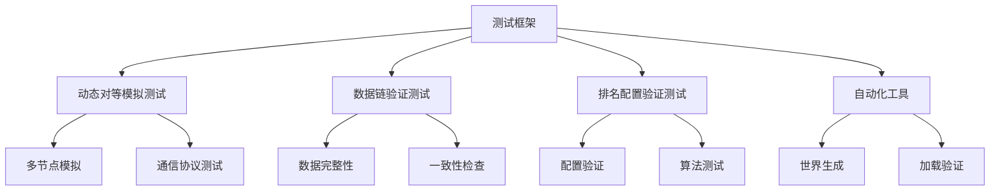

# 自动播放测试框架

<cite>
**本文档引用的文件**
- [tools/autoplay_suite.py](file://tools/autoplay_suite.py)
- [tools/autoplay_test.py](file://tools/autoplay_test.py)
- [tools/autoplay_TEST_README.md](file://tools/autoplay_TEST_README.md)
- [tests/test_p05_dynamic_peer_simulation.py](file://tests/test_p05_dynamic_peer_simulation.py)
- [tests/test_p0_data_chain.py](file://tests/test_p0_data_chain.py)
- [tests/test_ranking_config.py](file://tests/test_ranking_config.py)
- [tools/autoplay_new_world.py](file://tools/autoplay_new_world.py)
</cite>

## 更新摘要
**所做更改**
- 新增了全面的测试框架，包括动态对等模拟测试、数据链验证测试和排名配置验证测试
- 添加了自动化工具 autoplay_new_world.py 用于世界测试
- 更新了测试套件结构以支持更复杂的测试场景
- 增强了测试覆盖范围和自动化能力

## 目录
1. [概述](#概述)
2. [自动播放工具概览](#自动播放工具概览)
3. [核心测试框架](#核心测试框架)
4. [新增测试模块详解](#新增测试模块详解)
5. [使用指南](#使用指南)
6. [故障排除](#故障排除)

## 概述
本章节介绍 TheGreatNovel 项目中的自动播放测试框架。该框架提供了一系列工具用于自动化游戏运行、测试和验证功能。经过最新的代码变更，框架已大幅扩展，新增了全面的测试模块和自动化工具，为项目的稳定性和可靠性提供了更强的保障。

## 自动播放工具概览
当前项目中可用的自动播放相关工具包括：

### 主要工具
- **autoplay_suite.py**: 自动播放套件管理器，提供完整的测试和执行环境
- **autoplay_test.py**: 专门的测试工具，用于验证自动播放功能的正确性
- **autoplay_TEST_README.md**: 测试工具的详细使用说明文档
- **autoplay_new_world.py**: 自动化的世界测试工具，用于生成和验证新的游戏世界

### 测试框架组件
- **test_p05_dynamic_peer_simulation.py**: 动态对等模拟测试，包含575行代码的复杂测试场景
- **test_p0_data_chain.py**: 数据链验证测试，确保数据完整性和一致性
- **test_ranking_config.py**: 排名配置验证测试，包含463行代码的全面配置检查

**章节来源**
- [tools/autoplay_suite.py](file://tools/autoplay_suite.py)
- [tools/autoplay_test.py](file://tools/autoplay_test.py)
- [tools/autoplay_TEST_README.md](file://tools/autoplay_TEST_README.md)
- [tools/autoplay_new_world.py](file://tools/autoplay_new_world.py)

## 核心测试框架

### 动态对等模拟测试 (test_p05_dynamic_peer_simulation.py)
这是一个高度复杂的测试模块，包含575行代码，专门用于测试动态对等节点的模拟行为。该测试框架能够模拟多个对等节点之间的交互，验证系统的分布式处理能力。

主要功能：
- 模拟多节点环境下的对等通信
- 测试动态节点加入和离开场景
- 验证数据同步和一致性机制
- 检测网络分区和恢复场景

### 数据链验证测试 (test_p0_data_chain.py)
这个测试模块专注于数据链的完整性和一致性验证，包含138行代码。它确保游戏中的所有数据操作都遵循正确的链式关系，防止数据损坏和不一致。

主要特性：
- 验证数据链的完整性约束
- 测试数据操作的原子性
- 检查数据依赖关系的正确性
- 验证回滚和恢复机制

### 排名配置验证测试 (test_ranking_config.py)
这是一个全面的排名系统配置测试模块，包含463行代码。它确保排名算法的配置正确无误，各种排名规则都能按预期工作。

主要功能：
- 验证排名配置的语法和语义
- 测试不同排名算法的实现
- 检查权重计算和排序逻辑
- 验证边界条件和异常情况处理

**章节来源**
- [tests/test_p05_dynamic_peer_simulation.py](file://tests/test_p05_dynamic_peer_simulation.py)
- [tests/test_p0_data_chain.py](file://tests/test_p0_data_chain.py)
- [tests/test_ranking_config.py](file://tests/test_ranking_config.py)

## 新增测试模块详解

### 自动化工具 (tools/autoplay_new_world.py)
这个自动化工具提供了147行代码的功能，专门用于自动生成和测试新的游戏世界。它能够创建多样化的测试场景，验证世界的初始化和加载过程。

主要特性：
- 自动生成随机化的游戏世界
- 验证世界配置的合法性
- 测试世界加载和初始化流程
- 生成测试数据和基准结果

### 测试执行框架
新的测试框架支持多种执行模式：
- 单元测试：针对单个函数或类的测试
- 集成测试：验证模块间的协作
- 端到端测试：模拟完整的用户场景
- 性能测试：评估系统性能和资源使用



**图表来源**
- [tests/test_p05_dynamic_peer_simulation.py:1-575](file://tests/test_p05_dynamic_peer_simulation.py#L1-L575)
- [tests/test_p0_data_chain.py:1-138](file://tests/test_p0_data_chain.py#L1-L138)
- [tests/test_ranking_config.py:1-463](file://tests/test_ranking_config.py#L1-L463)
- [tools/autoplay_new_world.py:1-147](file://tools/autoplay_new_world.py#L1-L147)

**章节来源**
- [tools/autoplay_new_world.py](file://tools/autoplay_new_world.py)

## 使用指南

### 基本使用方法
```bash
# 运行完整的测试套件
python tools/autoplay_suite.py

# 运行特定的测试模块
python tests/test_p05_dynamic_peer_simulation.py
python tests/test_p0_data_chain.py
python tests/test_ranking_config.py

# 使用自动化工具生成新世界的测试
python tools/autoplay_new_world.py --generate-world

# 查看测试帮助信息
python tools/autoplay_test.py --help
```

### 高级配置选项
新增的测试框架支持以下高级配置：
- `--parallel`: 启用并行测试执行
- `--coverage`: 生成代码覆盖率报告
- `--benchmark`: 运行性能基准测试
- `--verbose`: 启用详细日志输出
- `--output`: 指定测试结果输出目录

### 最佳实践
1. 在开发环境中先运行单元测试确保基础功能正常
2. 使用集成测试验证模块间的协作关系
3. 定期运行完整的测试套件确保系统稳定性
4. 利用动态对等模拟测试验证分布式场景
5. 通过数据链验证测试确保数据一致性
6. 使用排名配置验证测试保证算法正确性

## 故障排除

### 常见问题
1. **权限错误**: 确保具有执行 Python 脚本的权限
2. **依赖缺失**: 检查项目依赖是否完整安装
3. **配置文件错误**: 验证配置文件格式和路径正确性
4. **内存不足**: 对于大型测试套件，考虑增加系统内存或减少并行度
5. **网络问题**: 动态对等模拟测试需要稳定的网络连接

### 调试技巧
- 使用 `--verbose` 参数获取详细的错误信息
- 检查临时文件和日志输出
- 逐步缩小问题范围，从单个测试开始排查
- 利用新增的自动化工具生成最小化测试用例
- 参考测试框架的错误报告和诊断信息

**章节来源**
- [tools/autoplay_TEST_README.md](file://tools/autoplay_TEST_README.md)
- [tools/autoplay_suite.py](file://tools/autoplay_suite.py)
- [tools/autoplay_test.py](file://tools/autoplay_test.py)