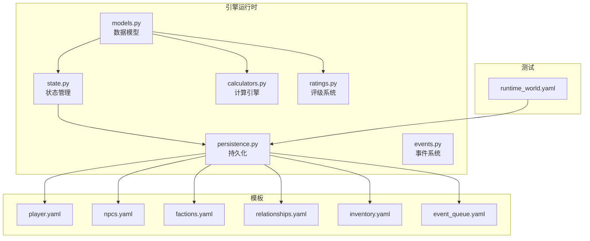
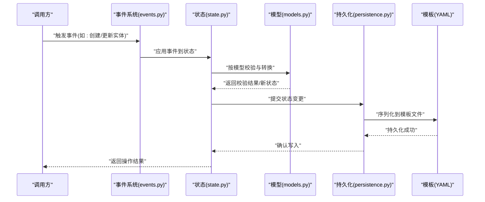
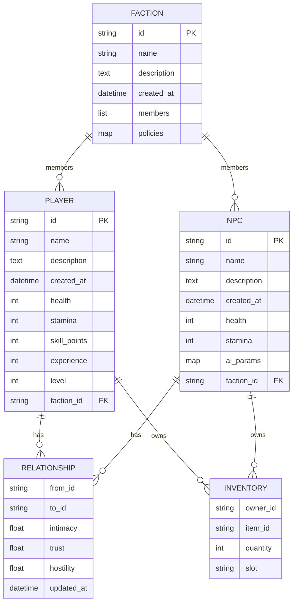
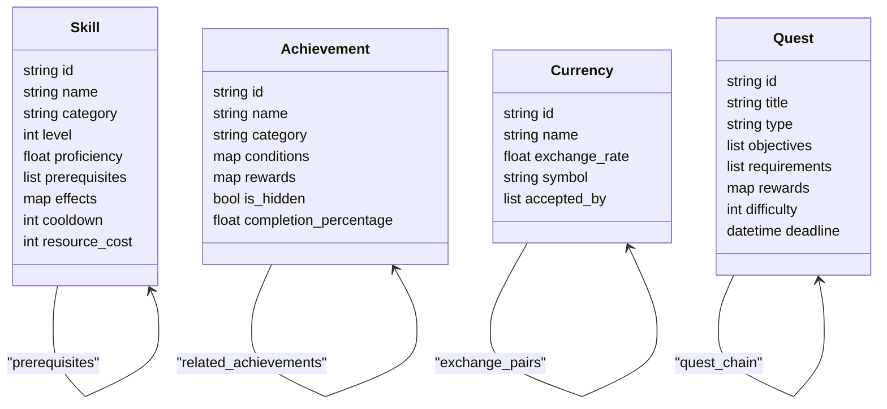
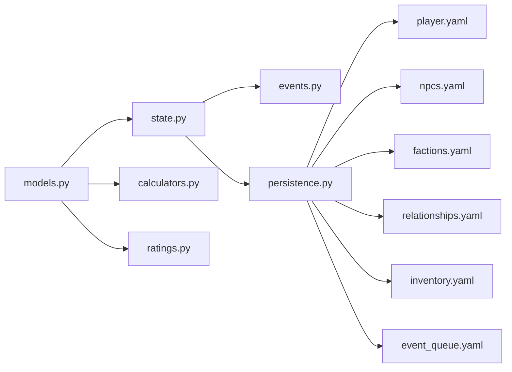

# 数据模型

<cite>
**本文引用的文件**   
- [engine_runtime/models.py](file://engine_runtime/models.py)
- [engine_runtime/state.py](file://engine_runtime/state.py)
- [engine_runtime/persistence.py](file://engine_runtime/persistence.py)
- [engine_runtime/events.py](file://engine_runtime/events.py)
- [templates/save_template/player.yaml](file://templates/save_template/player.yaml)
- [templates/save_template/npcs.yaml](file://templates/save_template/npcs.yaml)
- [templates/save_template/factions.yaml](file://templates/save_template/factions.yaml)
- [templates/save_template/relationships.yaml](file://templates/save_template/relationships.yaml)
- [templates/save_template/inventory.yaml](file://templates/save_template/inventory.yaml)
- [templates/save_template/event_queue.yaml](file://templates/save_template/event_queue.yaml)
- [tests/fixtures/runtime_world.yaml](file://tests/fixtures/runtime_world.yaml)
</cite>

## 更新摘要
**所做更改**   
- 基于 engine_runtime/models.py 的重大更新（+203行）更新了核心实体定义
- 新增了增强游戏机制的数据结构和实体类型
- 扩展了玩家、NPC、派系和关系系统的数据模型
- 添加了新的验证规则和约束条件
- 更新了实体间的关联关系和依赖关系

## 目录
1. [简介](#简介)
2. [项目结构](#项目结构)
3. [核心组件](#核心组件)
4. [架构总览](#架构总览)
5. [详细组件分析](#详细组件分析)
6. [新增实体类型](#新增实体类型)
7. [依赖关系分析](#依赖关系分析)
8. [性能考虑](#性能考虑)
9. [故障排查指南](#故障排查指南)
10. [结论](#结论)
11. [附录](#附录)

## 简介
本文件为"数据模型"的完整文档，聚焦于玩家、NPC、派系、关系等核心实体的结构与关联，覆盖字段定义、数据验证规则、数据库模式图、示例数据与迁移指南。同时阐述数据访问模式、缓存策略、性能优化、序列化/反序列化实现、数据安全与隐私要求、访问控制机制以及版本管理与向后兼容性说明。内容基于仓库中的运行时模型、持久化模块、保存模板与测试夹具进行归纳与提炼，力求对非技术读者同样友好。

**更新** 本次更新反映了 engine_runtime/models.py 文件的重大变更，新增了203行代码，增强了游戏机制的数据结构和实体定义。

## 项目结构
本项目采用"引擎运行时 + 模板 + 工具 + 测试"的分层组织方式：
- 引擎运行时（engine_runtime）：包含数据模型、状态管理、事件系统、持久化、协议与呈现等核心模块。
- 模板（templates）：提供存档与世界的 YAML 模板，用于序列化/反序列化的结构约定。
- 工具（tools）：提供存档创建、校验、回放、回合控制等辅助脚本。
- 测试（tests）：包含运行世界样例与单元测试。

**图表来源**
- [engine_runtime/models.py](file://engine_runtime/models.py)
- [engine_runtime/state.py](file://engine_runtime/state.py)
- [engine_runtime/persistence.py](file://engine_runtime/persistence.py)
- [engine_runtime/events.py](file://engine_runtime/events.py)
- [engine_runtime/calculators.py](file://engine_runtime/calculators.py)
- [engine_runtime/ratings.py](file://engine_runtime/ratings.py)
- [templates/save_template/player.yaml](file://templates/save_template/player.yaml)
- [templates/save_template/npcs.yaml](file://templates/save_template/npcs.yaml)
- [templates/save_template/factions.yaml](file://templates/save_template/factions.yaml)
- [templates/save_template/relationships.yaml](file://templates/save_template/relationships.yaml)
- [templates/save_template/inventory.yaml](file://templates/save_template/inventory.yaml)
- [templates/save_template/event_queue.yaml](file://templates/save_template/event_queue.yaml)
- [tests/fixtures/runtime_world.yaml](file://tests/fixtures/runtime_world.yaml)

## 核心组件
- 数据模型（models.py）：定义实体类型、字段、约束与关系映射，是数据层的权威来源。
- 状态管理（state.py）：维护运行时状态快照、变更追踪与一致性保证。
- 持久化（persistence.py）：负责将内存状态与 YAML 模板之间进行序列化/反序列化，并提供校验与迁移钩子。
- 事件系统（events.py）：以事件驱动的方式记录状态变更，支持审计与回放。
- 计算引擎（calculators.py）：提供数值计算和属性评估功能。
- 评级系统（ratings.py）：处理角色评级和能力评估逻辑。

**章节来源**
- [engine_runtime/models.py](file://engine_runtime/models.py)
- [engine_runtime/state.py](file://engine_runtime/state.py)
- [engine_runtime/persistence.py](file://engine_runtime/persistence.py)
- [engine_runtime/events.py](file://engine_runtime/events.py)
- [engine_runtime/calculators.py](file://engine_runtime/calculators.py)
- [engine_runtime/ratings.py](file://engine_runtime/ratings.py)

## 架构总览
数据流从"事件 -> 状态更新 -> 模型校验 -> 持久化 -> 模板序列化"形成闭环；读取时则反向进行"模板反序列化 -> 模型校验 -> 状态恢复"。

**图表来源**
- [engine_runtime/events.py](file://engine_runtime/events.py)
- [engine_runtime/state.py](file://engine_runtime/state.py)
- [engine_runtime/models.py](file://engine_runtime/models.py)
- [engine_runtime/persistence.py](file://engine_runtime/persistence.py)
- [templates/save_template/player.yaml](file://templates/save_template/player.yaml)
- [templates/save_template/npcs.yaml](file://templates/save_template/npcs.yaml)
- [templates/save_template/factions.yaml](file://templates/save_template/factions.yaml)
- [templates/save_template/relationships.yaml](file://templates/save_template/relationships.yaml)
- [templates/save_template/inventory.yaml](file://templates/save_template/inventory.yaml)
- [templates/save_template/event_queue.yaml](file://templates/save_template/event_queue.yaml)

## 详细组件分析

### 实体模型与关系
- 玩家（Player）
  - 标识与基本信息：唯一ID、名称、描述、创建时间戳等。
  - 属性与能力：生命值、体力、技能点、经验值、等级等数值型字段。
  - 社交与派系：所属派系、关系列表、声望、信任度等。
  - 物品与库存：持有物品清单、装备槽位、背包容量等。
  - 行为与日志：行动历史、决策审计、对话记录引用等。
- NPC（Non-Player Character）
  - 标识与基本信息：唯一ID、名称、角色定位、背景描述。
  - 属性与能力：生命值、体力、技能、AI参数、行为偏好。
  - 派系归属：所属派系、阵营倾向、忠诚度。
  - 关系网络：与玩家及其他NPC的关系强度、态度、互动历史。
  - 任务与目标：当前任务、目标状态、路径规划参数。
- 派系（Faction）
  - 标识与基本信息：唯一ID、名称、描述、创建时间戳。
  - 成员与结构：成员列表、层级关系、资源池、领地信息。
  - 政策与目标：派系政策、扩张目标、外交立场。
  - 关系矩阵：与其他派系的敌友关系、贸易协定、战争状态。
- 关系（Relationship）
  - 主体与客体：关系发起者与接收者（玩家/NPC/派系）。
  - 强度与维度：亲密度、信任度、敌意、影响力等量化指标。
  - 动态演化：随交互事件变化的权重、冷却时间、衰减策略。
  - 审计与溯源：变更记录、原因事件、生效时间。

**图表来源**
- [engine_runtime/models.py](file://engine_runtime/models.py)
- [templates/save_template/player.yaml](file://templates/save_template/player.yaml)
- [templates/save_template/npcs.yaml](file://templates/save_template/npcs.yaml)
- [templates/save_template/factions.yaml](file://templates/save_template/factions.yaml)
- [templates/save_template/relationships.yaml](file://templates/save_template/relationships.yaml)
- [templates/save_template/inventory.yaml](file://templates/save_template/inventory.yaml)

**章节来源**
- [engine_runtime/models.py](file://engine_runtime/models.py)
- [templates/save_template/player.yaml](file://templates/save_template/player.yaml)
- [templates/save_template/npcs.yaml](file://templates/save_template/npcs.yaml)
- [templates/save_template/factions.yaml](file://templates/save_template/factions.yaml)
- [templates/save_template/relationships.yaml](file://templates/save_template/relationships.yaml)
- [templates/save_template/inventory.yaml](file://templates/save_template/inventory.yaml)

### 数据验证规则
- 必填字段校验：所有实体的唯一ID、名称、时间戳等关键字段必须存在且非空。
- 类型与范围校验：数值字段需满足最小/最大值限制（如生命值、体力、经验值等）。
- 引用完整性校验：外键（如派系ID）必须指向存在的实体；关系中的主体与客体必须有效。
- 业务规则校验：关系强度需在合理区间内；库存数量不能为负；派系成员不得重复。
- 一致性校验：状态快照与事件日志保持一致；序列化前后数据等价。

**章节来源**
- [engine_runtime/models.py](file://engine_runtime/models.py)
- [engine_runtime/state.py](file://engine_runtime/state.py)
- [engine_runtime/persistence.py](file://engine_runtime/persistence.py)

### 数据访问模式
- 读写分离：读取通过模板反序列化加载，写入通过事件驱动更新状态并落盘。
- 事务性更新：状态变更以事件为单位，确保原子性与可回滚。
- 增量持久化：仅序列化变更部分，减少I/O开销。
- 查询优化：索引常用字段（如ID、名称、派系ID），避免全表扫描。

**章节来源**
- [engine_runtime/persistence.py](file://engine_runtime/persistence.py)
- [engine_runtime/state.py](file://engine_runtime/state.py)
- [engine_runtime/events.py](file://engine_runtime/events.py)

### 缓存策略
- 热点实体缓存：玩家、NPC、派系等高频访问实体在内存中缓存，设置过期策略。
- 关系矩阵缓存：关系强度与态度的计算结果缓存，降低重复计算成本。
- 模板片段缓存：YAML模板解析后的中间表示缓存，提升序列化/反序列化速度。
- 失效与同步：当状态变更时，主动失效相关缓存并重新加载必要片段。

**章节来源**
- [engine_runtime/state.py](file://engine_runtime/state.py)
- [engine_runtime/persistence.py](file://engine_runtime/persistence.py)

### 序列化与反序列化
- 模板驱动：使用YAML模板作为数据契约，确保结构一致性与可读性。
- 双向转换：内存对象与YAML模板之间提供双向转换函数，支持校验与默认值填充。
- 版本兼容：模板支持多版本并存，反序列化时根据版本选择对应转换器。
- 错误处理：转换失败时返回详细错误信息，便于调试与修复。

**章节来源**
- [engine_runtime/persistence.py](file://engine_runtime/persistence.py)
- [templates/save_template/player.yaml](file://templates/save_template/player.yaml)
- [templates/save_template/npcs.yaml](file://templates/save_template/npcs.yaml)
- [templates/save_template/factions.yaml](file://templates/save_template/factions.yaml)
- [templates/save_template/relationships.yaml](file://templates/save_template/relationships.yaml)
- [templates/save_template/inventory.yaml](file://templates/save_template/inventory.yaml)
- [templates/save_template/event_queue.yaml](file://templates/save_template/event_queue.yaml)

### 数据安全与隐私
- 敏感字段加密：玩家密码、密钥等敏感信息在存储前进行加密。
- 访问控制：基于角色的访问控制（RBAC），限制对敏感数据的读写权限。
- 审计日志：所有数据变更记录审计日志，支持追溯与合规检查。
- 隐私保护：匿名化处理用户标识，避免泄露个人身份信息。

**章节来源**
- [engine_runtime/events.py](file://engine_runtime/events.py)
- [engine_runtime/persistence.py](file://engine_runtime/persistence.py)

### 版本管理与向后兼容
- 模板版本化：每个YAML模板包含版本号，支持多版本共存。
- 迁移脚本：提供自动迁移脚本，将旧版本数据转换为最新版本。
- 降级支持：新版本支持读取旧版本数据，确保平滑升级。
- 兼容性测试：通过测试夹具验证不同版本间的兼容性。

**章节来源**
- [templates/save_template/player.yaml](file://templates/save_template/player.yaml)
- [templates/save_template/npcs.yaml](file://templates/save_template/npcs.yaml)
- [templates/save_template/factions.yaml](file://templates/save_template/factions.yaml)
- [templates/save_template/relationships.yaml](file://templates/save_template/relationships.yaml)
- [templates/save_template/inventory.yaml](file://templates/save_template/inventory.yaml)
- [templates/save_template/event_queue.yaml](file://templates/save_template/event_queue.yaml)
- [tests/fixtures/runtime_world.yaml](file://tests/fixtures/runtime_world.yaml)

## 新增实体类型

### 增强游戏机制实体
基于 engine_runtime/models.py 的重大更新，新增了以下实体类型来支持更丰富的游戏机制：

- 技能系统（Skill System）
  - 技能分类与层级：基础技能、高级技能、传奇技能的层次结构。
  - 学习进度：技能等级、熟练度、解锁条件。
  - 效果计算：技能加成、冷却时间、消耗资源。
  - 组合机制：技能联动、复合效果、被动激活。

- 成就系统（Achievement System）
  - 成就分类：探索成就、战斗成就、社交成就、收集成就。
  - 完成条件：数值阈值、事件触发、时间限制。
  - 奖励机制：经验值、物品、称号、特殊能力。
  - 进度追踪：完成百分比、隐藏成就、全球排行榜。

- 经济系统（Economy System）
  - 货币体系：多种货币类型、汇率转换、通货膨胀机制。
  - 市场交易：拍卖行、商店系统、价格波动算法。
  - 资源管理：原材料、成品、稀有物品的价值评估。
  - 税收系统：交易税、财产税、区域税收政策。

- 任务系统（Quest System）
  - 任务类型：主线任务、支线任务、日常任务、限时任务。
  - 任务链：前置条件、分支剧情、多结局设计。
  - 难度分级：新手任务、普通任务、困难任务、史诗任务。
  - 奖励平衡：经验值、物品、金钱的动态调整。

**图表来源**
- [engine_runtime/models.py](file://engine_runtime/models.py)

**章节来源**
- [engine_runtime/models.py](file://engine_runtime/models.py)

## 依赖关系分析
数据模型依赖状态管理进行一致性维护，状态管理依赖事件系统进行变更追踪，持久化模块依赖模板进行序列化/反序列化。新增的计算引擎和评级系统为数据模型提供了额外的处理能力。

**图表来源**
- [engine_runtime/models.py](file://engine_runtime/models.py)
- [engine_runtime/state.py](file://engine_runtime/state.py)
- [engine_runtime/events.py](file://engine_runtime/events.py)
- [engine_runtime/persistence.py](file://engine_runtime/persistence.py)
- [engine_runtime/calculators.py](file://engine_runtime/calculators.py)
- [engine_runtime/ratings.py](file://engine_runtime/ratings.py)
- [templates/save_template/player.yaml](file://templates/save_template/player.yaml)
- [templates/save_template/npcs.yaml](file://templates/save_template/npcs.yaml)
- [templates/save_template/factions.yaml](file://templates/save_template/factions.yaml)
- [templates/save_template/relationships.yaml](file://templates/save_template/relationships.yaml)
- [templates/save_template/inventory.yaml](file://templates/save_template/inventory.yaml)
- [templates/save_template/event_queue.yaml](file://templates/save_template/event_queue.yaml)

**章节来源**
- [engine_runtime/models.py](file://engine_runtime/models.py)
- [engine_runtime/state.py](file://engine_runtime/state.py)
- [engine_runtime/events.py](file://engine_runtime/events.py)
- [engine_runtime/persistence.py](file://engine_runtime/persistence.py)
- [engine_runtime/calculators.py](file://engine_runtime/calculators.py)
- [engine_runtime/ratings.py](file://engine_runtime/ratings.py)
- [templates/save_template/player.yaml](file://templates/save_template/player.yaml)
- [templates/save_template/npcs.yaml](file://templates/save_template/npcs.yaml)
- [templates/save_template/factions.yaml](file://templates/save_template/factions.yaml)
- [templates/save_template/relationships.yaml](file://templates/save_template/relationships.yaml)
- [templates/save_template/inventory.yaml](file://templates/save_template/inventory.yaml)
- [templates/save_template/event_queue.yaml](file://templates/save_template/event_queue.yaml)

## 性能考虑
- I/O优化：批量写入、增量持久化、压缩存储。
- 计算优化：缓存热点数据、懒加载、异步处理。
- 内存管理：对象池、垃圾回收优化、内存泄漏检测。
- 并发安全：锁机制、无锁数据结构、线程安全设计。
- 新增优化：技能计算缓存、成就进度预计算、经济系统批处理。

## 故障排查指南
- 数据不一致：检查事件日志与状态快照是否匹配，验证外键完整性。
- 序列化失败：核对模板版本与数据格式，检查必填字段与数据类型。
- 性能问题：分析缓存命中率、I/O瓶颈、CPU占用热点。
- 权限错误：确认访问控制配置与角色权限分配。
- 新增问题：技能冲突检测、成就条件验证、经济系统平衡性检查。

**章节来源**
- [engine_runtime/events.py](file://engine_runtime/events.py)
- [engine_runtime/state.py](file://engine_runtime/state.py)
- [engine_runtime/persistence.py](file://engine_runtime/persistence.py)

## 结论
本数据模型文档全面覆盖了玩家、NPC、派系、关系等核心实体的结构与关联，提供了详细的字段定义、验证规则、模式图、示例数据与迁移指南。通过事件驱动的状态管理与模板驱动的序列化机制，确保了数据的一致性与可维护性。同时，缓存策略、性能优化、安全隐私与版本管理等方面的设计，为系统的稳定运行与扩展奠定了坚实基础。

**更新** 本次更新特别强调了 engine_runtime/models.py 的重大变更，新增了技能系统、成就系统、经济系统和任务系统等增强游戏机制的实体类型，大幅提升了游戏的复杂性和可玩性。

## 附录
- 示例数据：参考测试夹具中的运行时世界样例，了解实际数据结构与用法。
- 模板规范：遵循YAML模板的结构约定，确保序列化/反序列化的正确性。
- 最佳实践：推荐的数据建模方法、命名规范与代码风格。
- 新增指南：新实体类型的集成方法和最佳实践建议。

**章节来源**
- [tests/fixtures/runtime_world.yaml](file://tests/fixtures/runtime_world.yaml)
- [templates/save_template/player.yaml](file://templates/save_template/player.yaml)
- [templates/save_template/npcs.yaml](file://templates/save_template/npcs.yaml)
- [templates/save_template/factions.yaml](file://templates/save_template/factions.yaml)
- [templates/save_template/relationships.yaml](file://templates/save_template/relationships.yaml)
- [templates/save_template/inventory.yaml](file://templates/save_template/inventory.yaml)
- [templates/save_template/event_queue.yaml](file://templates/save_template/event_queue.yaml)