# 事件溯源引擎

<cite>
**本文引用的文件**   
- [engine/event_sourcing.md](file://engine/event_sourcing.md)
- [engine/base.md](file://engine/base.md)
- [engine/knowledge.md](file://engine/knowledge.md)
- [engine/social.md](file://engine/social.md)
- [engine_runtime/events.py](file://engine_runtime/events.py)
- [engine_runtime/persistence.py](file://engine_runtime/persistence.py)
- [engine_runtime/runtime.py](file://engine_runtime/runtime.py)
- [engine_runtime/state.py](file://engine_runtime/state.py)
- [engine_runtime/models.py](file://engine_runtime/models.py)
- [engine_runtime/protocol.py](file://engine_runtime/protocol.py)
- [engine_runtime/narrative_log.py](file://engine_runtime/narrative_log.py)
- [engine_runtime/audit.py](file://engine_runtime/audit.py)
- [engine_runtime/calculators.py](file://engine_runtime/calculators.py)
- [engine_runtime/ratings.py](file://engine_runtime/ratings.py)
- [engine_runtime/options.py](file://engine_runtime/options.py)
- [engine_runtime/presentation.py](file://engine_runtime/presentation.py)
- [engine_runtime/world_compiler.py](file://engine_runtime/world_compiler.py)
- [templates/save_template/event_log.md](file://templates/save_template/event_log.md)
- [tools/replay_campaign.py](file://tools/replay_campaign.py)
- [tools/verify_projection.py](file://tools/verify_projection.py)
</cite>

## 目录
1. [简介](#简介)
2. [项目结构](#项目结构)
3. [核心组件](#核心组件)
4. [架构总览](#架构总览)
5. [详细组件分析](#详细组件分析)
6. [依赖关系分析](#依赖关系分析)
7. [性能考虑](#性能考虑)
8. [故障排查指南](#故障排查指南)
9. [结论](#结论)
10. [附录](#附录)

## 简介
本文件面向希望理解并实现“事件溯源（Event Sourcing）”的开发者，围绕该仓库中的事件溯源引擎进行系统化说明。内容涵盖：
- 事件溯源的核心概念与与传统CRUD的差异
- 事件的定义、存储、处理与回放机制
- 事件生命周期管理、状态重建算法与并发控制策略
- 如何编写事件处理器、订阅事件流与管理事件版本
- 性能优化技巧、调试方法与故障恢复策略

本引擎将系统状态建模为不可变事件的有序序列，通过重放事件来重建当前状态，从而获得完整审计轨迹、可回溯性与更强的业务可观测性。

## 项目结构
仓库采用分层组织：
- engine：领域知识与设计文档，包含事件溯源方法论与领域知识
- engine_runtime：运行时实现，包括事件模型、持久化、运行时调度、状态重建、审计与呈现等
- templates：存档模板，包含事件日志等结构化模板
- tools：工具集，支持回放、验证投影、生成存档等

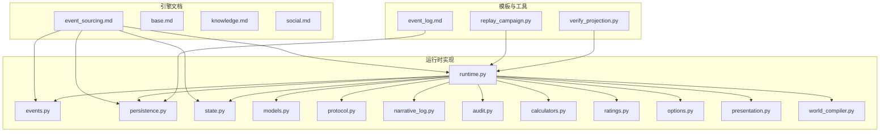

图表来源
- [engine/event_sourcing.md](file://engine/event_sourcing.md)
- [engine/base.md](file://engine/base.md)
- [engine/knowledge.md](file://engine/knowledge.md)
- [engine/social.md](file://engine/social.md)
- [engine_runtime/events.py](file://engine_runtime/events.py)
- [engine_runtime/persistence.py](file://engine_runtime/persistence.py)
- [engine_runtime/runtime.py](file://engine_runtime/runtime.py)
- [engine_runtime/state.py](file://engine_runtime/state.py)
- [engine_runtime/models.py](file://engine_runtime/models.py)
- [engine_runtime/protocol.py](file://engine_runtime/protocol.py)
- [engine_runtime/narrative_log.py](file://engine_runtime/narrative_log.py)
- [engine_runtime/audit.py](file://engine_runtime/audit.py)
- [engine_runtime/calculators.py](file://engine_runtime/calculators.py)
- [engine_runtime/ratings.py](file://engine_runtime/ratings.py)
- [engine_runtime/options.py](file://engine_runtime/options.py)
- [engine_runtime/presentation.py](file://engine_runtime/presentation.py)
- [engine_runtime/world_compiler.py](file://engine_runtime/world_compiler.py)
- [templates/save_template/event_log.md](file://templates/save_template/event_log.md)
- [tools/replay_campaign.py](file://tools/replay_campaign.py)
- [tools/verify_projection.py](file://tools/verify_projection.py)

章节来源
- [engine/event_sourcing.md](file://engine/event_sourcing.md)
- [engine/base.md](file://engine/base.md)
- [engine/knowledge.md](file://engine/knowledge.md)
- [engine/social.md](file://engine/social.md)
- [engine_runtime/runtime.py](file://engine_runtime/runtime.py)
- [engine_runtime/events.py](file://engine_runtime/events.py)
- [engine_runtime/persistence.py](file://engine_runtime/persistence.py)
- [engine_runtime/state.py](file://engine_runtime/state.py)

## 核心组件
- 事件模型与协议：定义事件类型、元数据与序列化契约，确保跨版本兼容
- 持久化层：提供事件追加、快照与一致性保障
- 运行时调度器：编排事件处理、状态重建、回放与并发控制
- 状态与投影：基于事件重建聚合状态，并提供查询视图
- 审计与叙事日志：记录决策与过程，便于追溯与复盘
- 计算与评分：对事件结果进行量化评估与影响度量
- 选项与呈现：配置运行时行为与输出格式

章节来源
- [engine_runtime/events.py](file://engine_runtime/events.py)
- [engine_runtime/persistence.py](file://engine_runtime/persistence.py)
- [engine_runtime/runtime.py](file://engine_runtime/runtime.py)
- [engine_runtime/state.py](file://engine_runtime/state.py)
- [engine_runtime/models.py](file://engine_runtime/models.py)
- [engine_runtime/protocol.py](file://engine_runtime/protocol.py)
- [engine_runtime/narrative_log.py](file://engine_runtime/narrative_log.py)
- [engine_runtime/audit.py](file://engine_runtime/audit.py)
- [engine_runtime/calculators.py](file://engine_runtime/calculators.py)
- [engine_runtime/ratings.py](file://engine_runtime/ratings.py)
- [engine_runtime/options.py](file://engine_runtime/options.py)
- [engine_runtime/presentation.py](file://engine_runtime/presentation.py)
- [engine_runtime/world_compiler.py](file://engine_runtime/world_compiler.py)

## 架构总览
事件溯源引擎以“事件不可变、状态可重建”为核心原则。运行时从持久化层读取事件序列，按序应用至状态机或投影，得到一致的系统状态；同时支持回放与审计，保证可观测与可诊断。

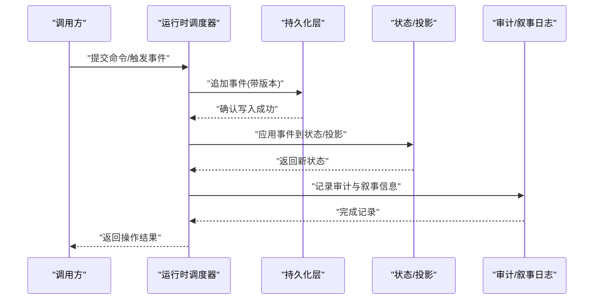

图表来源
- [engine_runtime/runtime.py](file://engine_runtime/runtime.py)
- [engine_runtime/persistence.py](file://engine_runtime/persistence.py)
- [engine_runtime/state.py](file://engine_runtime/state.py)
- [engine_runtime/narrative_log.py](file://engine_runtime/narrative_log.py)
- [engine_runtime/audit.py](file://engine_runtime/audit.py)

## 详细组件分析

### 事件模型与协议
- 事件定义：统一的事件结构与元数据，包含类型、时间戳、关联ID、版本号等
- 协议约束：序列化/反序列化规则、兼容性检查、迁移策略
- 版本管理：事件版本的演进与向后兼容策略

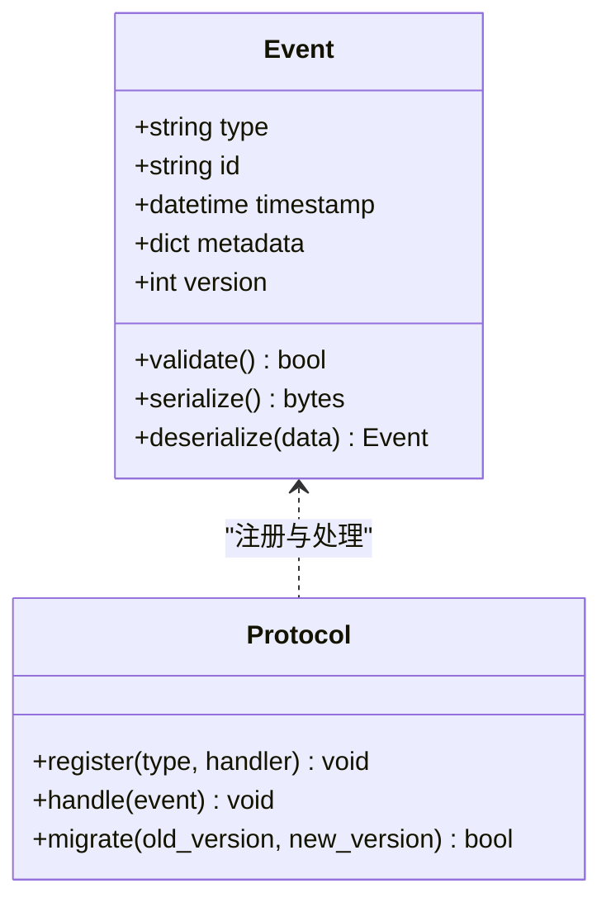

图表来源
- [engine_runtime/events.py](file://engine_runtime/events.py)
- [engine_runtime/protocol.py](file://engine_runtime/protocol.py)

章节来源
- [engine_runtime/events.py](file://engine_runtime/events.py)
- [engine_runtime/protocol.py](file://engine_runtime/protocol.py)

### 持久化层
- 事件追加：原子追加、幂等写入、冲突检测
- 快照机制：定期快照以减少回放开销
- 一致性：事务边界、回滚策略、校验和

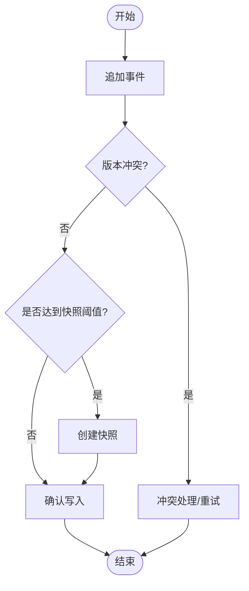

图表来源
- [engine_runtime/persistence.py](file://engine_runtime/persistence.py)

章节来源
- [engine_runtime/persistence.py](file://engine_runtime/persistence.py)

### 运行时调度器
- 事件编排：顺序应用、并行回放、失败重试
- 状态重建：从快照+增量事件重建聚合状态
- 并发控制：锁粒度、隔离级别、死锁避免

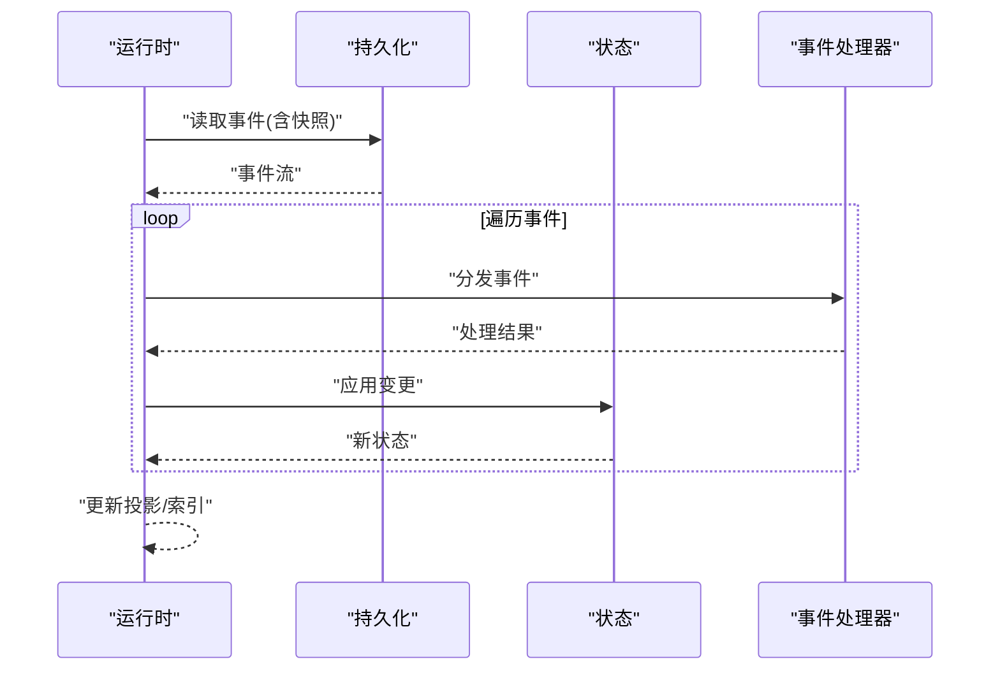

图表来源
- [engine_runtime/runtime.py](file://engine_runtime/runtime.py)
- [engine_runtime/state.py](file://engine_runtime/state.py)
- [engine_runtime/events.py](file://engine_runtime/events.py)

章节来源
- [engine_runtime/runtime.py](file://engine_runtime/runtime.py)
- [engine_runtime/state.py](file://engine_runtime/state.py)
- [engine_runtime/events.py](file://engine_runtime/events.py)

### 状态与投影
- 聚合状态：由事件驱动的状态机，保证确定性
- 投影：只读视图，用于查询与展示
- 重建算法：从事件流重建状态，支持增量与全量

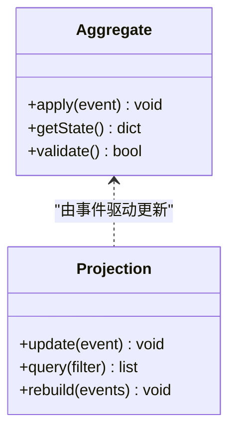

图表来源
- [engine_runtime/state.py](file://engine_runtime/state.py)
- [engine_runtime/models.py](file://engine_runtime/models.py)

章节来源
- [engine_runtime/state.py](file://engine_runtime/state.py)
- [engine_runtime/models.py](file://engine_runtime/models.py)

### 审计与叙事日志
- 审计：记录关键决策、输入输出、错误与重试
- 叙事日志：人类可读的过程描述，便于复盘

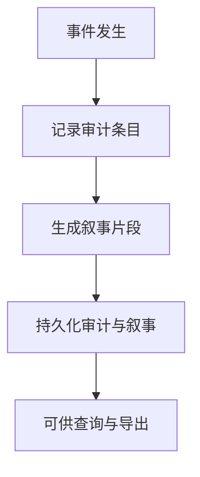

图表来源
- [engine_runtime/audit.py](file://engine_runtime/audit.py)
- [engine_runtime/narrative_log.py](file://engine_runtime/narrative_log.py)

章节来源
- [engine_runtime/audit.py](file://engine_runtime/audit.py)
- [engine_runtime/narrative_log.py](file://engine_runtime/narrative_log.py)

### 计算与评分
- 计算器：对事件结果进行数值化处理
- 评分体系：多维度指标评估事件影响

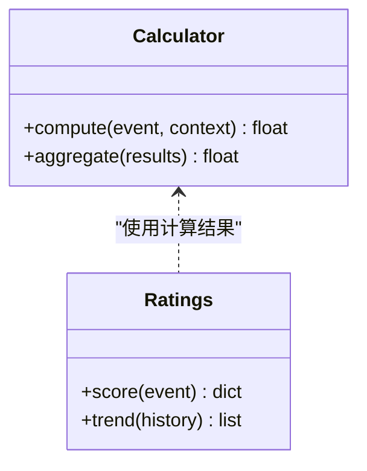

图表来源
- [engine_runtime/calculators.py](file://engine_runtime/calculators.py)
- [engine_runtime/ratings.py](file://engine_runtime/ratings.py)

章节来源
- [engine_runtime/calculators.py](file://engine_runtime/calculators.py)
- [engine_runtime/ratings.py](file://engine_runtime/ratings.py)

### 选项与呈现
- 选项：运行时配置项，如回放模式、日志级别、快照频率
- 呈现：格式化输出、报表生成、可视化

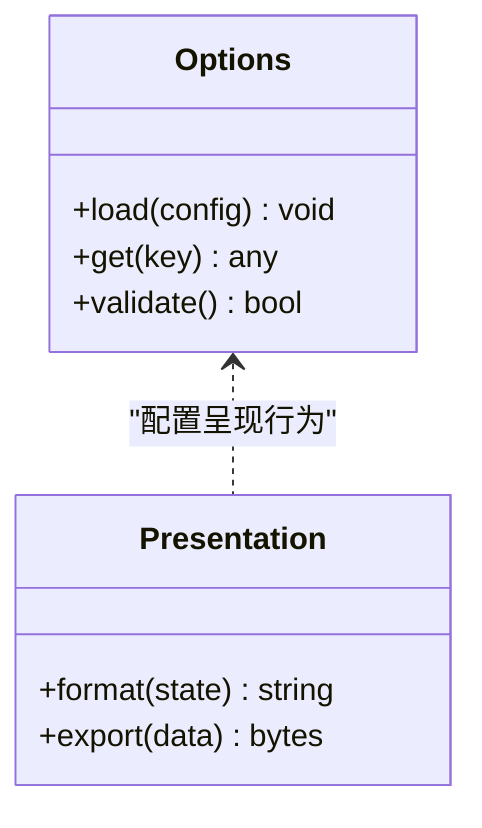

图表来源
- [engine_runtime/options.py](file://engine_runtime/options.py)
- [engine_runtime/presentation.py](file://engine_runtime/presentation.py)

章节来源
- [engine_runtime/options.py](file://engine_runtime/options.py)
- [engine_runtime/presentation.py](file://engine_runtime/presentation.py)

### 世界编译器
- 编译：将领域模型与事件规则编译为可执行逻辑
- 优化：静态分析与代码生成以提升性能

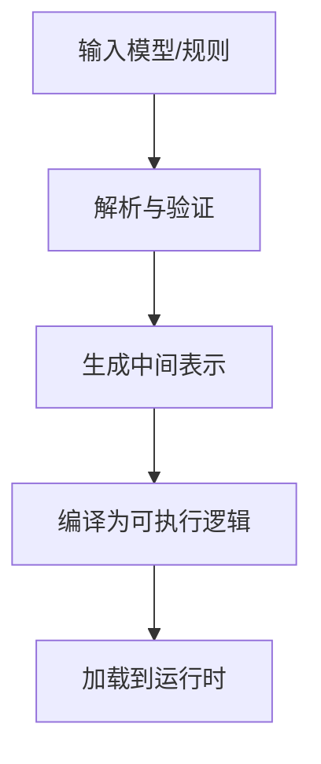

图表来源
- [engine_runtime/world_compiler.py](file://engine_runtime/world_compiler.py)

章节来源
- [engine_runtime/world_compiler.py](file://engine_runtime/world_compiler.py)

## 依赖关系分析
运行时模块之间的依赖关系如下：

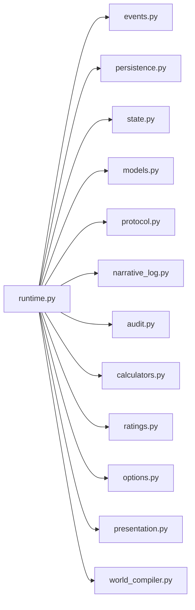

图表来源
- [engine_runtime/runtime.py](file://engine_runtime/runtime.py)
- [engine_runtime/events.py](file://engine_runtime/events.py)
- [engine_runtime/persistence.py](file://engine_runtime/persistence.py)
- [engine_runtime/state.py](file://engine_runtime/state.py)
- [engine_runtime/models.py](file://engine_runtime/models.py)
- [engine_runtime/protocol.py](file://engine_runtime/protocol.py)
- [engine_runtime/narrative_log.py](file://engine_runtime/narrative_log.py)
- [engine_runtime/audit.py](file://engine_runtime/audit.py)
- [engine_runtime/calculators.py](file://engine_runtime/calculators.py)
- [engine_runtime/ratings.py](file://engine_runtime/ratings.py)
- [engine_runtime/options.py](file://engine_runtime/options.py)
- [engine_runtime/presentation.py](file://engine_runtime/presentation.py)
- [engine_runtime/world_compiler.py](file://engine_runtime/world_compiler.py)

章节来源
- [engine_runtime/runtime.py](file://engine_runtime/runtime.py)

## 性能考虑
- 快照策略：合理设置快照频率，平衡回放时间与存储成本
- 批量处理：合并小事件为批处理，减少I/O次数
- 索引优化：为常用查询字段建立投影索引
- 并发控制：细粒度锁与无锁数据结构结合，提升吞吐
- 内存管理：流式处理大事件集，避免一次性加载

[本节为通用指导，不直接分析具体文件]

## 故障排查指南
- 事件不一致：检查持久化层的版本冲突与校验和
- 状态重建失败：核对事件版本与处理器兼容性
- 回放异常：使用回放工具定位问题事件
- 审计缺失：确认审计与叙事日志的写入路径

章节来源
- [engine_runtime/persistence.py](file://engine_runtime/persistence.py)
- [engine_runtime/runtime.py](file://engine_runtime/runtime.py)
- [tools/replay_campaign.py](file://tools/replay_campaign.py)
- [tools/verify_projection.py](file://tools/verify_projection.py)

## 结论
事件溯源引擎通过不可变事件序列与状态重建机制，提供了强大的可追溯性与可观测性。结合快照、审计与回放能力，能够在复杂业务场景中保持高可靠性与可维护性。建议根据业务需求选择合适的快照频率、并发策略与投影模型，以实现性能与一致性的平衡。

[本节为总结性内容，不直接分析具体文件]

## 附录
- 事件日志模板：用于存档与导出的事件记录格式
- 回放与验证工具：辅助调试与回归测试

章节来源
- [templates/save_template/event_log.md](file://templates/save_template/event_log.md)
- [tools/replay_campaign.py](file://tools/replay_campaign.py)
- [tools/verify_projection.py](file://tools/verify_projection.py)