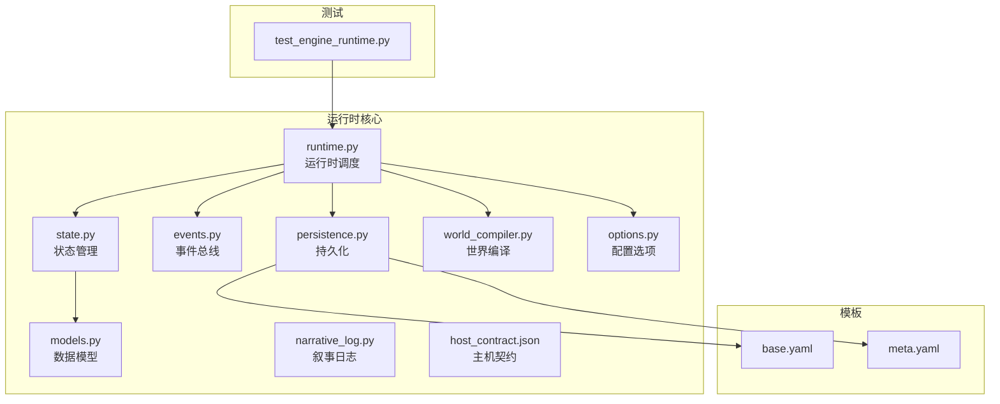
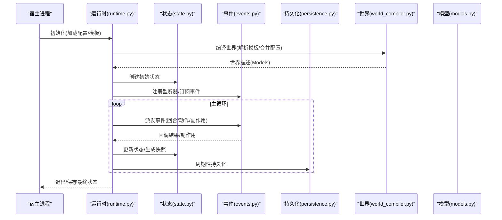
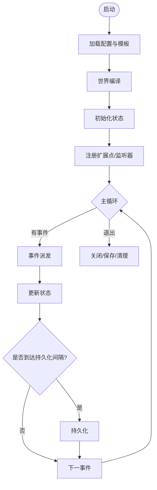
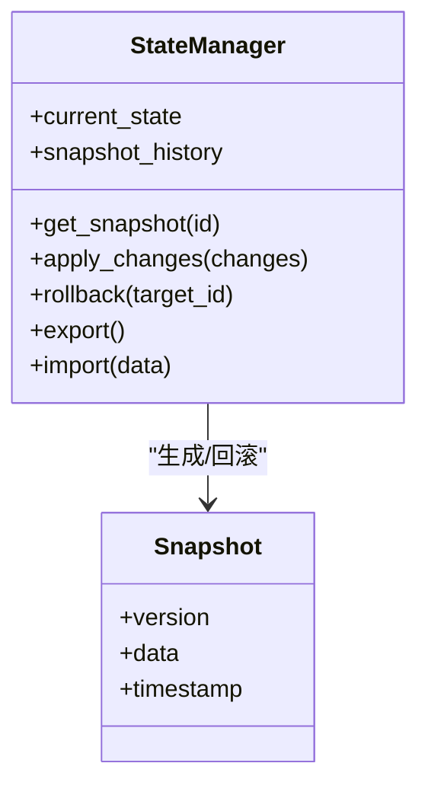
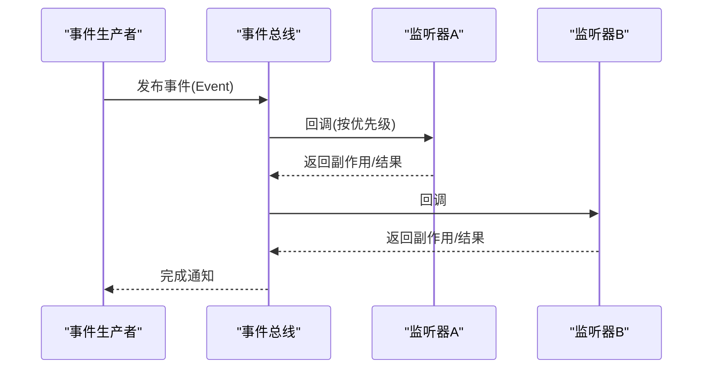
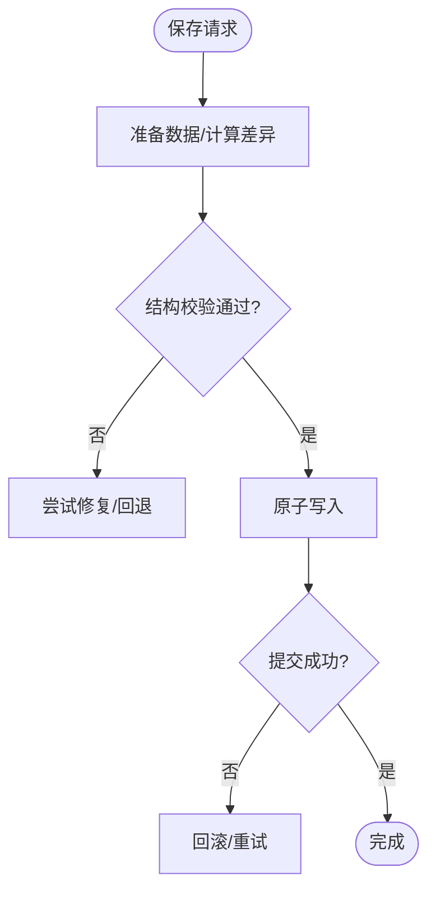
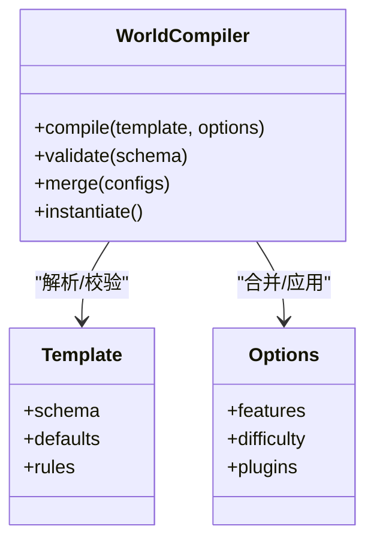
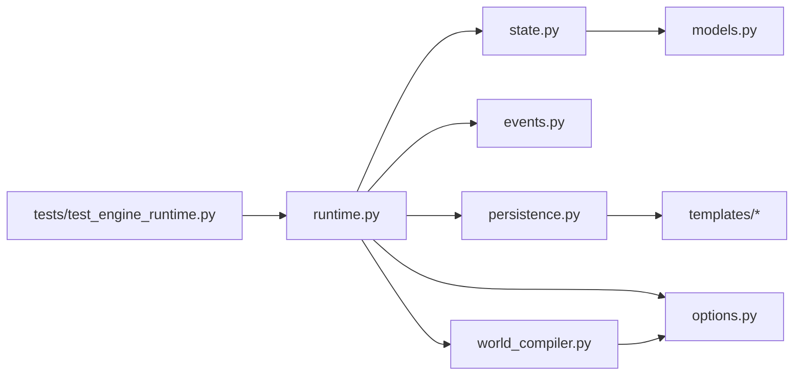

# 基础引擎框架

<cite>
**本文档引用的文件**   
- [engine_runtime/README.md](file://engine_runtime/README.md)
- [engine_runtime/__init__.py](file://engine_runtime/__init__.py)
- [engine_runtime/runtime.py](file://engine_runtime/runtime.py)
- [engine_runtime/state.py](file://engine_runtime/state.py)
- [engine_runtime/persistence.py](file://engine_runtime/persistence.py)
- [engine_runtime/events.py](file://engine_runtime/events.py)
- [engine_runtime/models.py](file://engine_runtime/models.py)
- [engine_runtime/options.py](file://engine_runtime/options.py)
- [engine_runtime/world_compiler.py](file://engine_runtime/world_compiler.py)
- [engine_runtime/narrative_log.py](file://engine_runtime/narrative_log.py)
- [engine_runtime/host_contract.json](file://engine_runtime/host_contract.json)
- [templates/save_template/base.yaml](file://templates/save_template/base.yaml)
- [templates/save_template/meta.yaml](file://templates/save_template/meta.yaml)
- [tests/test_engine_runtime.py](file://tests/test_engine_runtime.py)
</cite>

## 目录
1. [简介](#简介)
2. [项目结构](#项目结构)
3. [核心组件](#核心组件)
4. [架构总览](#架构总览)
5. [详细组件分析](#详细组件分析)
6. [依赖关系分析](#依赖关系分析)
7. [性能考量](#性能考量)
8. [故障排查指南](#故障排查指南)
9. [结论](#结论)
10. [附录](#附录)

## 简介
本文件面向希望理解与扩展“基础引擎框架”的开发者，系统阐述引擎的核心架构、模块通信机制、扩展点定义、生命周期管理、配置系统与插件机制。文档同时覆盖错误处理策略、日志记录与监控接口，并提供性能基准测试、内存管理与资源优化建议。内容从高层概览逐步深入到代码级实现，适合不同经验水平的读者按需阅读。

## 项目结构
仓库采用分层组织：
- engine_runtime：运行时核心，包含运行时调度、状态管理、事件总线、持久化、世界编译、模型定义、选项配置、审计与叙事日志等。
- templates：保存模板与世界模板，用于序列化/反序列化游戏状态与元数据。
- tests：单元测试与集成测试，验证运行时行为。
- tools：命令行工具，用于回合控制、回放、审计与校验等。
- engine：设计文档与领域说明（如事件溯源、知识、社交等）。

图表来源
- [engine_runtime/runtime.py](file://engine_runtime/runtime.py)
- [engine_runtime/state.py](file://engine_runtime/state.py)
- [engine_runtime/events.py](file://engine_runtime/events.py)
- [engine_runtime/persistence.py](file://engine_runtime/persistence.py)
- [engine_runtime/world_compiler.py](file://engine_runtime/world_compiler.py)
- [engine_runtime/models.py](file://engine_runtime/models.py)
- [engine_runtime/options.py](file://engine_runtime/options.py)
- [engine_runtime/narrative_log.py](file://engine_runtime/narrative_log.py)
- [engine_runtime/host_contract.json](file://engine_runtime/host_contract.json)
- [templates/save_template/base.yaml](file://templates/save_template/base.yaml)
- [templates/save_template/meta.yaml](file://templates/save_template/meta.yaml)
- [tests/test_engine_runtime.py](file://tests/test_engine_runtime.py)

章节来源
- [engine_runtime/README.md](file://engine_runtime/README.md)

## 核心组件
- 运行时调度器：负责启动、初始化、主循环、事件分发、回合推进与退出。
- 状态管理器：维护当前世界状态、快照与变更追踪。
- 事件总线：提供发布/订阅机制，解耦模块间通信。
- 持久化层：读写存档、世界配置与元数据，支持版本兼容。
- 世界编译器：将模板与配置编译为可执行的世界描述。
- 数据模型：定义实体、关系与约束。
- 配置选项：集中管理引擎与玩法参数。
- 叙事日志：记录关键决策与事件轨迹，便于审计与回放。

章节来源
- [engine_runtime/runtime.py](file://engine_runtime/runtime.py)
- [engine_runtime/state.py](file://engine_runtime/state.py)
- [engine_runtime/events.py](file://engine_runtime/events.py)
- [engine_runtime/persistence.py](file://engine_runtime/persistence.py)
- [engine_runtime/world_compiler.py](file://engine_runtime/world_compiler.py)
- [engine_runtime/models.py](file://engine_runtime/models.py)
- [engine_runtime/options.py](file://engine_runtime/options.py)
- [engine_runtime/narrative_log.py](file://engine_runtime/narrative_log.py)

## 架构总览
运行时以“事件驱动 + 状态机”为核心，通过事件总线协调各子系统；世界编译器在启动阶段将模板与配置转换为运行时可用的数据结构；持久化层负责状态落盘与恢复；叙事日志与审计贯穿生命周期，保障可观测性与可回溯性。

图表来源
- [engine_runtime/runtime.py](file://engine_runtime/runtime.py)
- [engine_runtime/state.py](file://engine_runtime/state.py)
- [engine_runtime/events.py](file://engine_runtime/events.py)
- [engine_runtime/persistence.py](file://engine_runtime/persistence.py)
- [engine_runtime/world_compiler.py](file://engine_runtime/world_compiler.py)
- [engine_runtime/models.py](file://engine_runtime/models.py)

## 详细组件分析

### 运行时调度器（runtime）
职责
- 生命周期管理：启动、初始化、主循环、优雅退出。
- 事件编排：按优先级或规则调度事件处理器。
- 资源协调：协调世界编译、状态初始化、持久化周期任务。
- 扩展点：提供插件注册入口与钩子函数。

关键流程
- 启动阶段：读取配置与模板，调用世界编译器构建世界模型，初始化状态与事件总线。
- 运行阶段：接收外部输入（玩家动作/系统事件），入队并依次派发，触发副作用与状态变更。
- 退出阶段：保存最终状态，释放资源，输出审计与日志摘要。

图表来源
- [engine_runtime/runtime.py](file://engine_runtime/runtime.py)

章节来源
- [engine_runtime/runtime.py](file://engine_runtime/runtime.py)

### 状态管理（state）
职责
- 维护当前世界状态对象，提供查询与变更方法。
- 支持快照与差异比较，便于回滚与审计。
- 暴露一致性视图给其他模块。

设计要点
- 不可变快照：每次重大变更后生成快照，避免并发修改问题。
- 增量更新：仅对受影响部分进行更新，降低开销。
- 版本兼容：状态结构升级时保留迁移路径。

图表来源
- [engine_runtime/state.py](file://engine_runtime/state.py)

章节来源
- [engine_runtime/state.py](file://engine_runtime/state.py)

### 事件总线（events）
职责
- 提供发布/订阅机制，解耦模块间通信。
- 支持事件过滤、优先级与重试策略。
- 统一事件格式与生命周期钩子。

设计要点
- 事件类型枚举：明确事件边界与语义。
- 监听器注册：支持一次性与长期监听。
- 错误隔离：单个监听器异常不影响其他监听器。

图表来源
- [engine_runtime/events.py](file://engine_runtime/events.py)

章节来源
- [engine_runtime/events.py](file://engine_runtime/events.py)

### 持久化层（persistence）
职责
- 读写存档文件（YAML/JSON），支持分片存储（角色、阵营、关系等）。
- 版本兼容与迁移：自动检测并应用迁移脚本。
- 事务性写入：保证一致性，失败回滚。

设计要点
- 模板驱动：基于模板生成默认结构，确保一致性。
- 增量保存：仅保存变更片段，提升性能。
- 校验与修复：加载时校验结构完整性，必要时修复。

图表来源
- [engine_runtime/persistence.py](file://engine_runtime/persistence.py)
- [templates/save_template/base.yaml](file://templates/save_template/base.yaml)
- [templates/save_template/meta.yaml](file://templates/save_template/meta.yaml)

章节来源
- [engine_runtime/persistence.py](file://engine_runtime/persistence.py)
- [templates/save_template/base.yaml](file://templates/save_template/base.yaml)
- [templates/save_template/meta.yaml](file://templates/save_template/meta.yaml)

### 世界编译器（world_compiler）
职责
- 解析世界模板与配置，生成运行时可用的世界描述。
- 合并多源配置，解决冲突与缺省值。
- 提供扩展点以注入自定义世界元素。

设计要点
- 声明式模板：使用 YAML 定义世界结构与规则。
- 编译管线：解析 -> 校验 -> 合并 -> 实例化。
- 错误定位：精确报告模板错误位置与建议。

图表来源
- [engine_runtime/world_compiler.py](file://engine_runtime/world_compiler.py)
- [engine_runtime/options.py](file://engine_runtime/options.py)

章节来源
- [engine_runtime/world_compiler.py](file://engine_runtime/world_compiler.py)
- [engine_runtime/options.py](file://engine_runtime/options.py)

### 数据模型（models）
职责
- 定义实体、关系与约束，作为状态与持久化的共同契约。
- 提供序列化/反序列化工具。
- 支持扩展字段与向后兼容。

设计要点
- 强类型约束：减少运行时错误。
- 版本化：字段增删需考虑迁移。
- 只读视图：对外暴露稳定接口。

章节来源
- [engine_runtime/models.py](file://engine_runtime/models.py)

### 配置选项（options）
职责
- 集中管理引擎与玩法参数，提供默认值与校验。
- 支持热重载与动态切换（受限制场景）。
- 与主机契约对齐，确保兼容性。

设计要点
- 分层配置：全局、会话、用户级别。
- 安全校验：防止非法值影响稳定性。
- 审计记录：记录配置变更历史。

章节来源
- [engine_runtime/options.py](file://engine_runtime/options.py)
- [engine_runtime/host_contract.json](file://engine_runtime/host_contract.json)

### 叙事日志（narrative_log）
职责
- 记录关键决策、事件轨迹与副作用，便于审计与回放。
- 支持结构化与非结构化日志混合。
- 提供查询与导出接口。

设计要点
- 低开销追加：避免阻塞主循环。
- 压缩与归档：定期归档旧日志。
- 隐私保护：敏感信息脱敏。

章节来源
- [engine_runtime/narrative_log.py](file://engine_runtime/narrative_log.py)

## 依赖关系分析
运行时依赖状态、事件、持久化、世界编译与模型；世界编译器依赖选项与模板；持久化依赖模板与模型；测试依赖运行时接口。

图表来源
- [engine_runtime/runtime.py](file://engine_runtime/runtime.py)
- [engine_runtime/state.py](file://engine_runtime/state.py)
- [engine_runtime/events.py](file://engine_runtime/events.py)
- [engine_runtime/persistence.py](file://engine_runtime/persistence.py)
- [engine_runtime/world_compiler.py](file://engine_runtime/world_compiler.py)
- [engine_runtime/models.py](file://engine_runtime/models.py)
- [engine_runtime/options.py](file://engine_runtime/options.py)
- [templates/save_template/base.yaml](file://templates/save_template/base.yaml)
- [tests/test_engine_runtime.py](file://tests/test_engine_runtime.py)

章节来源
- [engine_runtime/runtime.py](file://engine_runtime/runtime.py)
- [tests/test_engine_runtime.py](file://tests/test_engine_runtime.py)

## 性能考量
- 事件派发：批量处理与优先级队列，避免热点事件阻塞。
- 状态快照：仅在关键节点生成快照，结合差异保存减少 I/O。
- 持久化：异步写入与批量化，降低锁竞争。
- 内存管理：及时释放临时对象，避免大对象常驻。
- 缓存策略：对频繁访问的配置与模板进行缓存。
- 基准测试：使用单元测试与负载脚本评估吞吐与延迟。

[本节为通用指导，不直接分析具体文件]

## 故障排查指南
- 常见错误
  - 模板解析失败：检查 schema 与默认值，确认必填字段。
  - 事件丢失：确认监听器注册顺序与异常隔离。
  - 持久化不一致：检查事务提交与回滚逻辑。
- 诊断手段
  - 启用详细日志与叙事日志导出。
  - 使用快照对比定位状态漂移。
  - 通过主机契约校验兼容性。
- 恢复策略
  - 回滚到最近有效快照。
  - 重新编译世界并应用迁移。
  - 清理损坏的存档片段后重试。

章节来源
- [engine_runtime/narrative_log.py](file://engine_runtime/narrative_log.py)
- [engine_runtime/persistence.py](file://engine_runtime/persistence.py)
- [engine_runtime/host_contract.json](file://engine_runtime/host_contract.json)

## 结论
该基础引擎框架以事件驱动与状态管理为核心，通过清晰的模块边界与扩展点，实现了高内聚、低耦合的可扩展架构。配合模板驱动的世界编译与稳健的持久化机制，能够支撑复杂的游戏逻辑与长生命周期运行。遵循本文的性能与排障建议，可进一步提升稳定性与可维护性。

[本节为总结，不直接分析具体文件]

## 附录

### 如何创建自定义模块
- 定义模块接口：明确输入输出与事件类型。
- 注册扩展点：在运行时或世界编译器中注册。
- 依赖注入：通过容器或工厂注入所需服务。
- 示例参考路径
  - [engine_runtime/runtime.py](file://engine_runtime/runtime.py)
  - [engine_runtime/world_compiler.py](file://engine_runtime/world_compiler.py)
  - [engine_runtime/events.py](file://engine_runtime/events.py)

### 如何注册服务与使用依赖注入
- 在服务容器中注册服务实例或工厂。
- 在模块初始化时获取依赖。
- 示例参考路径
  - [engine_runtime/runtime.py](file://engine_runtime/runtime.py)
  - [engine_runtime/options.py](file://engine_runtime/options.py)

### 错误处理策略
- 统一异常类型与错误码。
- 在事件监听器中隔离异常，避免级联失败。
- 示例参考路径
  - [engine_runtime/events.py](file://engine_runtime/events.py)
  - [engine_runtime/persistence.py](file://engine_runtime/persistence.py)

### 日志记录与监控接口
- 结构化日志：记录事件、状态变更与性能指标。
- 监控接口：暴露健康检查与统计端点。
- 示例参考路径
  - [engine_runtime/narrative_log.py](file://engine_runtime/narrative_log.py)
  - [engine_runtime/runtime.py](file://engine_runtime/runtime.py)

### 性能基准测试
- 使用单元测试模拟高负载事件流。
- 测量事件派发延迟与吞吐量。
- 示例参考路径
  - [tests/test_engine_runtime.py](file://tests/test_engine_runtime.py)

### 内存管理与资源优化建议
- 避免大对象常驻内存，及时释放引用。
- 使用生成器与惰性求值处理大数据集。
- 定期清理未使用的缓存与临时文件。

[本节为通用指导，不直接分析具体文件]