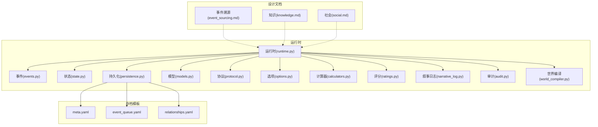
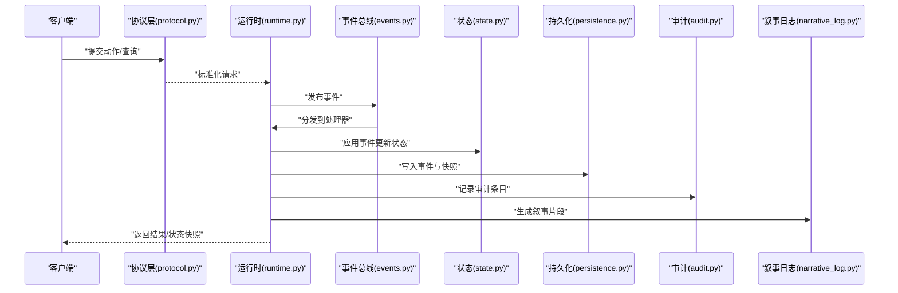
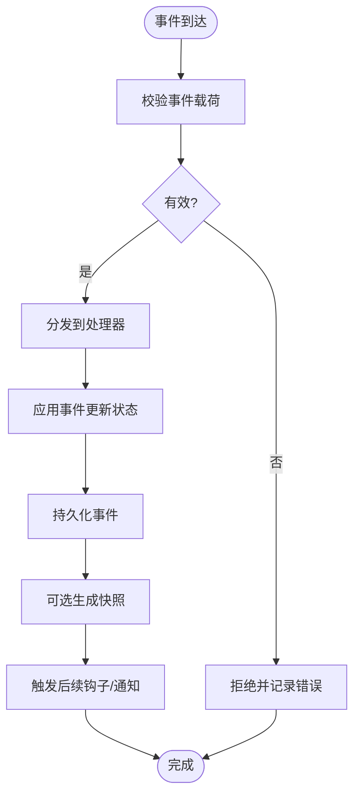
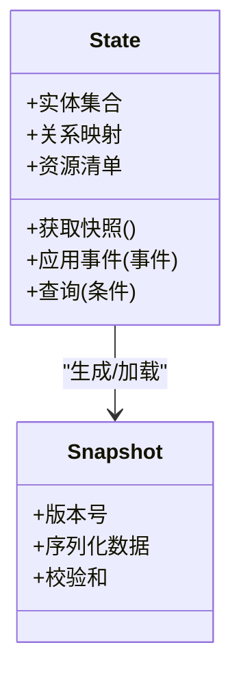
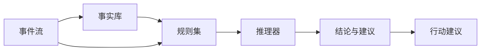
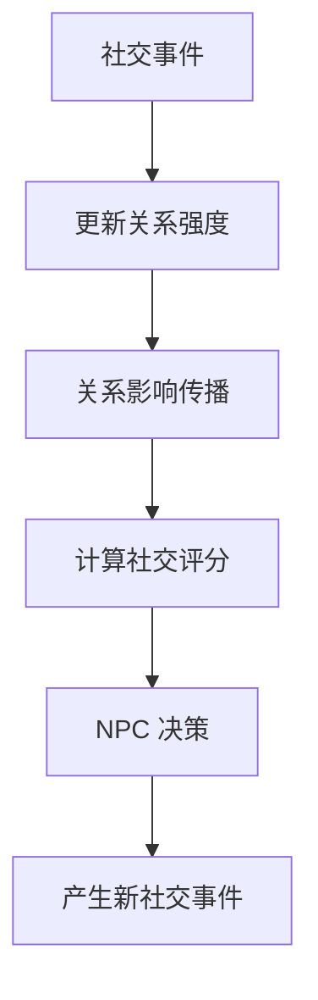
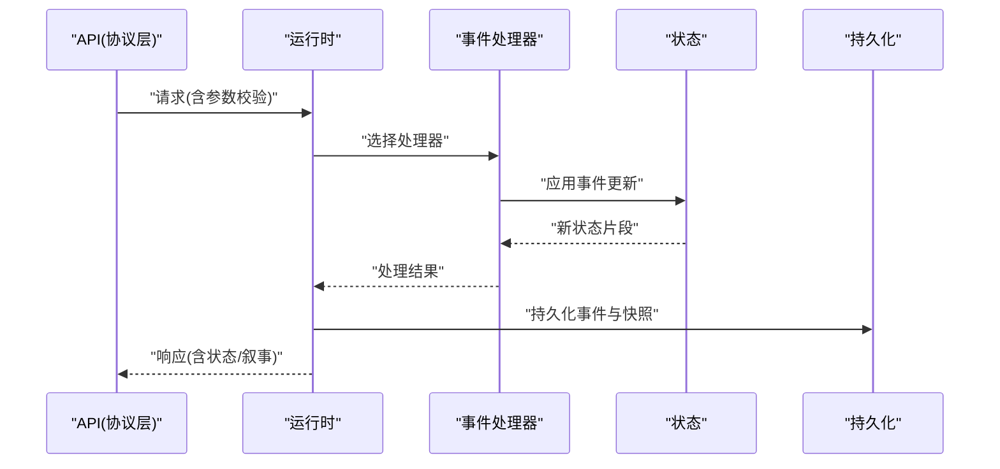
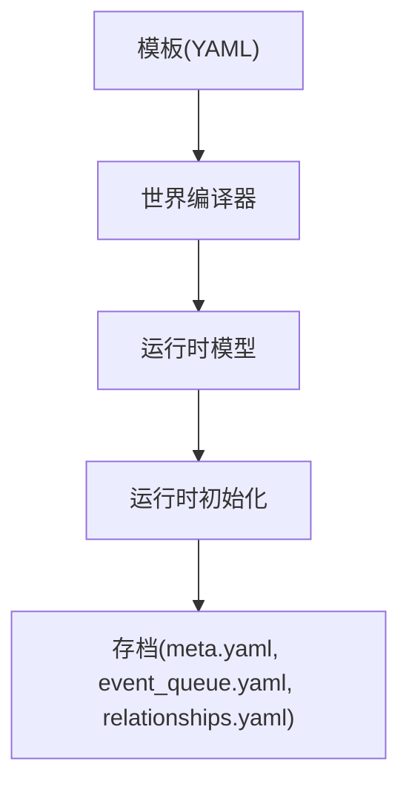
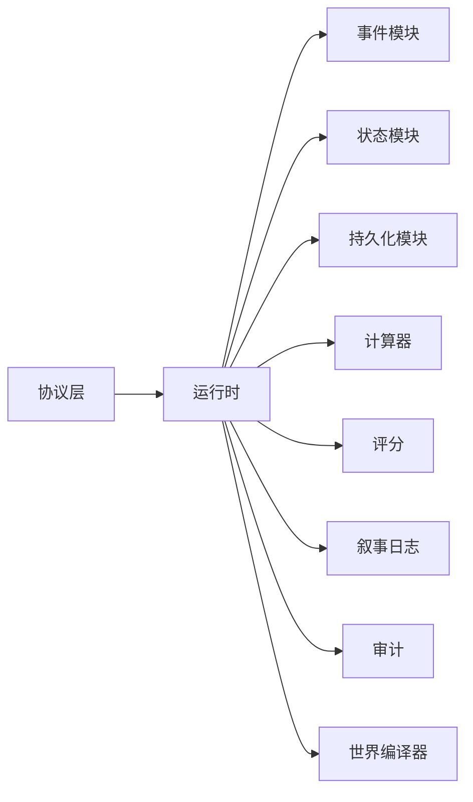

# 核心引擎

<cite>
**本文引用的文件**   
- [engine_runtime/runtime.py](file://engine_runtime/runtime.py)
- [engine_runtime/events.py](file://engine_runtime/events.py)
- [engine_runtime/state.py](file://engine_runtime/state.py)
- [engine_runtime/persistence.py](file://engine_runtime/persistence.py)
- [engine_runtime/models.py](file://engine_runtime/models.py)
- [engine_runtime/protocol.py](file://engine_runtime/protocol.py)
- [engine_runtime/options.py](file://engine_runtime/options.py)
- [engine_runtime/calculators.py](file://engine_runtime/calculators.py)
- [engine_runtime/ratings.py](file://engine_runtime/ratings.py)
- [engine_runtime/narrative_log.py](file://engine_runtime/narrative_log.py)
- [engine_runtime/audit.py](file://engine_runtime/audit.py)
- [engine_runtime/world_compiler.py](file://engine_runtime/world_compiler.py)
- [engine/event_sourcing.md](file://engine/event_sourcing.md)
- [engine/knowledge.md](file://engine/knowledge.md)
- [engine/social.md](file://engine/social.md)
- [templates/save_template/meta.yaml](file://templates/save_template/meta.yaml)
- [templates/save_template/event_queue.yaml](file://templates/save_template/event_queue.yaml)
- [templates/save_template/relationships.yaml](file://templates/save_template/relationships.yaml)
- [tests/test_engine_runtime.py](file://tests/test_engine_runtime.py)
</cite>

## 目录
1. [简介](#简介)
2. [项目结构](#项目结构)
3. [核心组件](#核心组件)
4. [架构总览](#架构总览)
5. [详细组件分析](#详细组件分析)
6. [依赖关系分析](#依赖关系分析)
7. [性能考虑](#性能考虑)
8. [故障排查指南](#故障排查指南)
9. [结论](#结论)
10. [附录](#附录)

## 简介
本文件面向 TheGreatNovel 核心引擎的开发者与使用者，系统性阐述事件溯源架构、知识管理系统与社会交互机制的实现原理与使用方式。文档围绕事件处理、状态管理、知识推理与社交关系计算等关键能力展开，提供清晰的架构图、数据流图与调用时序图，并给出配置项说明、扩展点指引、性能优化建议与最佳实践，帮助不同经验水平的开发者快速上手与深入定制。

## 项目结构
TheGreatNovel 核心引擎以 engine_runtime 为运行时实现，engine 目录存放设计文档，templates 提供存档模板，tools 提供工具链，tests 包含基础测试用例。整体采用“事件驱动 + 持久化投影”的分层架构：输入通过协议层进入，由运行时编排事件处理；事件写入事件日志并通过持久化模块落盘；状态通过投影从事件重建；知识与社交模块在运行时中协作完成推理与关系计算。

图表来源
- [engine_runtime/runtime.py](file://engine_runtime/runtime.py)
- [engine_runtime/events.py](file://engine_runtime/events.py)
- [engine_runtime/state.py](file://engine_runtime/state.py)
- [engine_runtime/persistence.py](file://engine_runtime/persistence.py)
- [engine_runtime/models.py](file://engine_runtime/models.py)
- [engine_runtime/protocol.py](file://engine_runtime/protocol.py)
- [engine_runtime/options.py](file://engine_runtime/options.py)
- [engine_runtime/calculators.py](file://engine_runtime/calculators.py)
- [engine_runtime/ratings.py](file://engine_runtime/ratings.py)
- [engine_runtime/narrative_log.py](file://engine_runtime/narrative_log.py)
- [engine_runtime/audit.py](file://engine_runtime/audit.py)
- [engine_runtime/world_compiler.py](file://engine_runtime/world_compiler.py)
- [engine/event_sourcing.md](file://engine/event_sourcing.md)
- [engine/knowledge.md](file://engine/knowledge.md)
- [engine/social.md](file://engine/social.md)
- [templates/save_template/meta.yaml](file://templates/save_template/meta.yaml)
- [templates/save_template/event_queue.yaml](file://templates/save_template/event_queue.yaml)
- [templates/save_template/relationships.yaml](file://templates/save_template/relationships.yaml)

章节来源
- [engine_runtime/runtime.py](file://engine_runtime/runtime.py)
- [engine_runtime/events.py](file://engine_runtime/events.py)
- [engine_runtime/state.py](file://engine_runtime/state.py)
- [engine_runtime/persistence.py](file://engine_runtime/persistence.py)
- [engine_runtime/models.py](file://engine_runtime/models.py)
- [engine_runtime/protocol.py](file://engine_runtime/protocol.py)
- [engine_runtime/options.py](file://engine_runtime/options.py)
- [engine_runtime/calculators.py](file://engine_runtime/calculators.py)
- [engine_runtime/ratings.py](file://engine_runtime/ratings.py)
- [engine_runtime/narrative_log.py](file://engine_runtime/narrative_log.py)
- [engine_runtime/audit.py](file://engine_runtime/audit.py)
- [engine_runtime/world_compiler.py](file://engine_runtime/world_compiler.py)
- [engine/event_sourcing.md](file://engine/event_sourcing.md)
- [engine/knowledge.md](file://engine/knowledge.md)
- [engine/social.md](file://engine/social.md)
- [templates/save_template/meta.yaml](file://templates/save_template/meta.yaml)
- [templates/save_template/event_queue.yaml](file://templates/save_template/event_queue.yaml)
- [templates/save_template/relationships.yaml](file://templates/save_template/relationships.yaml)

## 核心组件
- 运行时（runtime）：协调事件生命周期、调度处理器、维护会话上下文、触发持久化与审计。
- 事件（events）：定义事件类型、载荷结构与事件总线接口，支撑事件溯源。
- 状态（state）：承载当前世界快照、实体属性、关系与资源，供查询与渲染。
- 持久化（persistence）：负责事件日志、队列与存档元数据的读写，保证可恢复性。
- 模型（models）：领域对象定义，如角色、阵营、物品、关系等。
- 协议（protocol）：对外 API 契约，统一请求/响应格式与校验规则。
- 选项（options）：引擎运行参数与特性开关的配置入口。
- 计算器（calculators）：数值计算、概率判定与收益评估等通用算法。
- 评分（ratings）：对行为、决策或内容质量进行打分与排序。
- 叙事日志（narrative_log）：生成可读的叙事文本与回合摘要。
- 审计（audit）：记录关键操作轨迹，支持回放与合规检查。
- 世界编译（world_compiler）：将模板与配置编译为运行时可用的世界描述。

章节来源
- [engine_runtime/runtime.py](file://engine_runtime/runtime.py)
- [engine_runtime/events.py](file://engine_runtime/events.py)
- [engine_runtime/state.py](file://engine_runtime/state.py)
- [engine_runtime/persistence.py](file://engine_runtime/persistence.py)
- [engine_runtime/models.py](file://engine_runtime/models.py)
- [engine_runtime/protocol.py](file://engine_runtime/protocol.py)
- [engine_runtime/options.py](file://engine_runtime/options.py)
- [engine_runtime/calculators.py](file://engine_runtime/calculators.py)
- [engine_runtime/ratings.py](file://engine_runtime/ratings.py)
- [engine_runtime/narrative_log.py](file://engine_runtime/narrative_log.py)
- [engine_runtime/audit.py](file://engine_runtime/audit.py)
- [engine_runtime/world_compiler.py](file://engine_runtime/world_compiler.py)

## 架构总览
引擎遵循事件溯源原则：所有变更以不可变事件形式记录，状态由事件重放构建。运行时作为中枢，接收协议层请求，转换为内部事件，交由事件处理器更新状态，随后持久化事件与快照，并输出叙事与审计信息。

图表来源
- [engine_runtime/protocol.py](file://engine_runtime/protocol.py)
- [engine_runtime/runtime.py](file://engine_runtime/runtime.py)
- [engine_runtime/events.py](file://engine_runtime/events.py)
- [engine_runtime/state.py](file://engine_runtime/state.py)
- [engine_runtime/persistence.py](file://engine_runtime/persistence.py)
- [engine_runtime/audit.py](file://engine_runtime/audit.py)
- [engine_runtime/narrative_log.py](file://engine_runtime/narrative_log.py)

## 详细组件分析

### 事件溯源与事件处理
- 事件定义：集中声明事件类型与载荷，确保不可变性与版本兼容。
- 事件总线：订阅-发布模式，按事件类型路由至对应处理器。
- 处理器：纯函数式更新状态，避免副作用，便于重放与测试。
- 重放策略：从事件日志重建状态，支持增量与全量两种模式。

图表来源
- [engine_runtime/events.py](file://engine_runtime/events.py)
- [engine_runtime/runtime.py](file://engine_runtime/runtime.py)
- [engine_runtime/persistence.py](file://engine_runtime/persistence.py)
- [engine/event_sourcing.md](file://engine/event_sourcing.md)

章节来源
- [engine_runtime/events.py](file://engine_runtime/events.py)
- [engine_runtime/runtime.py](file://engine_runtime/runtime.py)
- [engine/event_sourcing.md](file://engine/event_sourcing.md)

### 状态管理与快照
- 状态结构：集中保存实体、关系、资源与全局配置，提供只读视图与变更方法。
- 快照机制：定期生成状态快照，缩短重放时间，降低冷启动成本。
- 一致性：事件幂等与顺序保证，避免重复应用导致的状态不一致。

图表来源
- [engine_runtime/state.py](file://engine_runtime/state.py)
- [engine_runtime/persistence.py](file://engine_runtime/persistence.py)

章节来源
- [engine_runtime/state.py](file://engine_runtime/state.py)
- [engine_runtime/persistence.py](file://engine_runtime/persistence.py)

### 知识管理系统
- 知识表示：以结构化事实与规则表达世界知识，支持继承与聚合。
- 推理引擎：基于规则匹配与约束求解，产出可解释的结论与建议。
- 更新策略：事件驱动的知识增量更新，保持与状态一致。

图表来源
- [engine/knowledge.md](file://engine/knowledge.md)
- [engine_runtime/calculators.py](file://engine_runtime/calculators.py)
- [engine_runtime/ratings.py](file://engine_runtime/ratings.py)

章节来源
- [engine/knowledge.md](file://engine/knowledge.md)
- [engine_runtime/calculators.py](file://engine_runtime/calculators.py)
- [engine_runtime/ratings.py](file://engine_runtime/ratings.py)

### 社会交互机制
- 关系模型：角色间关系强度、倾向与历史互动记录。
- 影响传播：事件对关系网络的影响扩散，形成群体动态。
- 社交计算：基于关系与声誉的决策权重，驱动 NPC 行为。

图表来源
- [engine/social.md](file://engine/social.md)
- [engine_runtime/calculators.py](file://engine_runtime/calculators.py)
- [engine_runtime/ratings.py](file://engine_runtime/ratings.py)
- [templates/save_template/relationships.yaml](file://templates/save_template/relationships.yaml)

章节来源
- [engine/social.md](file://engine/social.md)
- [engine_runtime/calculators.py](file://engine_runtime/calculators.py)
- [engine_runtime/ratings.py](file://engine_runtime/ratings.py)
- [templates/save_template/relationships.yaml](file://templates/save_template/relationships.yaml)

### 协议与运行时集成
- 协议层：定义统一的请求/响应结构，执行参数校验与权限检查。
- 运行时：编排事件处理流程，管理生命周期与异常处理。
- 扩展点：处理器注册、事件钩子、自定义计算器与评分策略。

图表来源
- [engine_runtime/protocol.py](file://engine_runtime/protocol.py)
- [engine_runtime/runtime.py](file://engine_runtime/runtime.py)
- [engine_runtime/state.py](file://engine_runtime/state.py)
- [engine_runtime/persistence.py](file://engine_runtime/persistence.py)

章节来源
- [engine_runtime/protocol.py](file://engine_runtime/protocol.py)
- [engine_runtime/runtime.py](file://engine_runtime/runtime.py)

### 世界编译与模板
- 模板系统：使用 YAML 定义世界初始状态、实体与关系。
- 编译器：将模板解析为运行时模型，注入默认值与校验。
- 存档模板：meta、event_queue、relationships 等文件构成存档骨架。

图表来源
- [engine_runtime/world_compiler.py](file://engine_runtime/world_compiler.py)
- [templates/save_template/meta.yaml](file://templates/save_template/meta.yaml)
- [templates/save_template/event_queue.yaml](file://templates/save_template/event_queue.yaml)
- [templates/save_template/relationships.yaml](file://templates/save_template/relationships.yaml)

章节来源
- [engine_runtime/world_compiler.py](file://engine_runtime/world_compiler.py)
- [templates/save_template/meta.yaml](file://templates/save_template/meta.yaml)
- [templates/save_template/event_queue.yaml](file://templates/save_template/event_queue.yaml)
- [templates/save_template/relationships.yaml](file://templates/save_template/relationships.yaml)

## 依赖关系分析
- 低耦合：事件处理器与状态更新解耦，便于替换与扩展。
- 明确边界：协议层与运行时分离，持久化独立于业务逻辑。
- 可扩展：计算器与评分策略可通过插件机制注入。

图表来源
- [engine_runtime/protocol.py](file://engine_runtime/protocol.py)
- [engine_runtime/runtime.py](file://engine_runtime/runtime.py)
- [engine_runtime/events.py](file://engine_runtime/events.py)
- [engine_runtime/state.py](file://engine_runtime/state.py)
- [engine_runtime/persistence.py](file://engine_runtime/persistence.py)
- [engine_runtime/calculators.py](file://engine_runtime/calculators.py)
- [engine_runtime/ratings.py](file://engine_runtime/ratings.py)
- [engine_runtime/narrative_log.py](file://engine_runtime/narrative_log.py)
- [engine_runtime/audit.py](file://engine_runtime/audit.py)
- [engine_runtime/world_compiler.py](file://engine_runtime/world_compiler.py)

章节来源
- [engine_runtime/runtime.py](file://engine_runtime/runtime.py)
- [engine_runtime/protocol.py](file://engine_runtime/protocol.py)
- [engine_runtime/events.py](file://engine_runtime/events.py)
- [engine_runtime/state.py](file://engine_runtime/state.py)
- [engine_runtime/persistence.py](file://engine_runtime/persistence.py)
- [engine_runtime/calculators.py](file://engine_runtime/calculators.py)
- [engine_runtime/ratings.py](file://engine_runtime/ratings.py)
- [engine_runtime/narrative_log.py](file://engine_runtime/narrative_log.py)
- [engine_runtime/audit.py](file://engine_runtime/audit.py)
- [engine_runtime/world_compiler.py](file://engine_runtime/world_compiler.py)

## 性能考虑
- 事件批处理：合并高频小事件，减少 I/O 与锁竞争。
- 快照策略：根据事件密度与内存占用动态调整快照频率。
- 索引优化：对常用查询字段建立索引，提升状态检索速度。
- 并行处理：无副作用的事件处理器可并行应用，注意顺序约束。
- 缓存热点：对频繁访问的关系与评分结果进行短期缓存。
- 资源回收：及时释放临时对象，避免内存泄漏。

[本节为通用性能指导，不直接分析具体文件]

## 故障排查指南
- 事件重放失败：检查事件版本与载荷兼容性，确认处理器幂等性。
- 状态不一致：核对事件顺序与去重逻辑，验证快照校验和。
- 社交计算异常：审查关系更新阈值与传播规则，检查评分权重。
- 模板编译错误：校验 YAML 语法与必填字段，查看编译器日志。
- 审计缺失：确认审计开关与写入路径权限，检查事件钩子注册。

章节来源
- [engine_runtime/audit.py](file://engine_runtime/audit.py)
- [engine_runtime/persistence.py](file://engine_runtime/persistence.py)
- [engine_runtime/world_compiler.py](file://engine_runtime/world_compiler.py)
- [engine_runtime/calculators.py](file://engine_runtime/calculators.py)
- [engine_runtime/ratings.py](file://engine_runtime/ratings.py)

## 结论
TheGreatNovel 核心引擎以事件溯源为基础，结合知识推理与社会交互，构建了可扩展、可审计、可重放的运行时体系。通过清晰的模块边界与扩展点，开发者可以按需定制处理器、计算器与评分策略，满足多样化叙事需求。遵循本文的性能优化建议与最佳实践，可在保证一致性的同时获得良好的运行时表现。

[本节为总结性内容，不直接分析具体文件]

## 附录
- 使用示例（参考测试）：通过测试用例了解如何初始化运行时、提交事件、读取状态与验证结果。
- 配置选项：在 options.py 中查看引擎参数与特性开关，按需调整快照频率、并发度与日志级别。
- 扩展点：
  - 自定义事件处理器：实现事件接口并在运行时注册。
  - 自定义计算器/评分：实现相应接口并注入到运行时。
  - 自定义持久化后端：实现持久化接口以适配不同存储。

章节来源
- [tests/test_engine_runtime.py](file://tests/test_engine_runtime.py)
- [engine_runtime/options.py](file://engine_runtime/options.py)
- [engine_runtime/runtime.py](file://engine_runtime/runtime.py)
- [engine_runtime/calculators.py](file://engine_runtime/calculators.py)
- [engine_runtime/ratings.py](file://engine_runtime/ratings.py)
- [engine_runtime/persistence.py](file://engine_runtime/persistence.py)