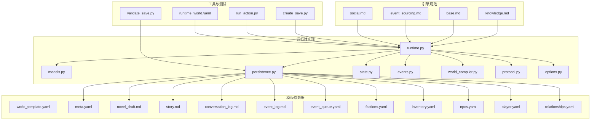
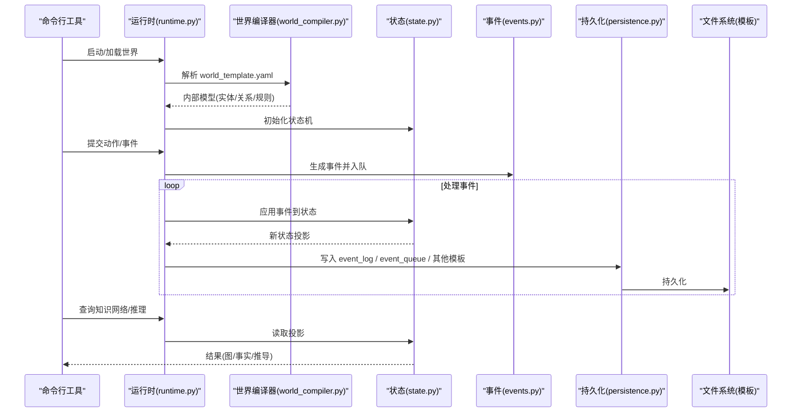
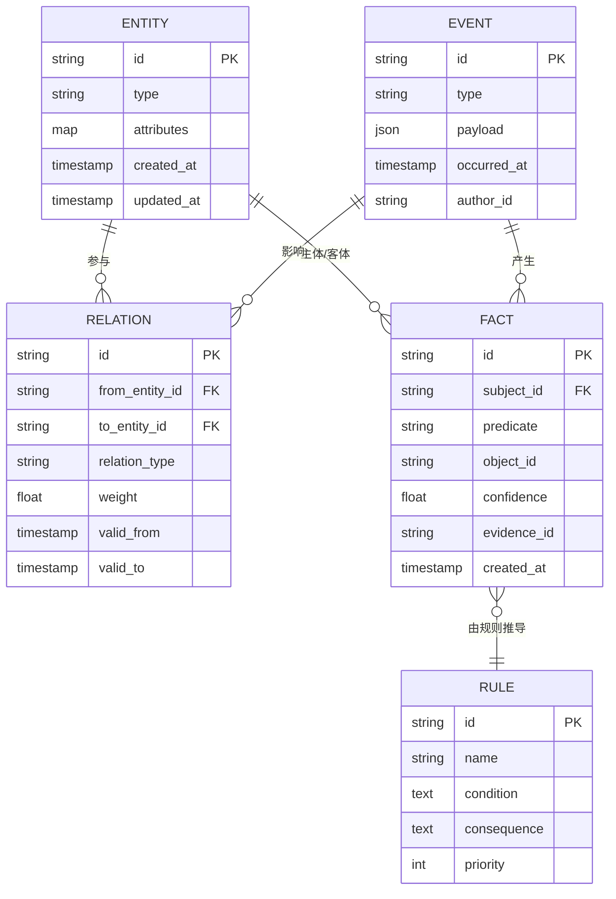
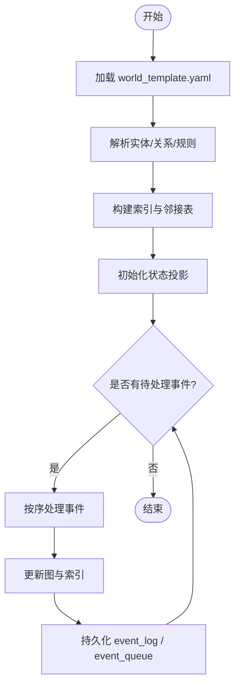
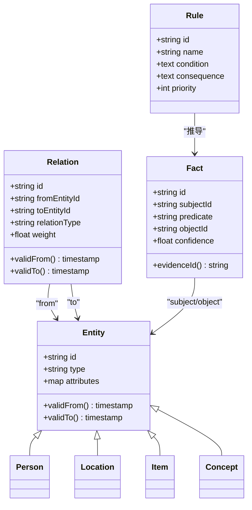
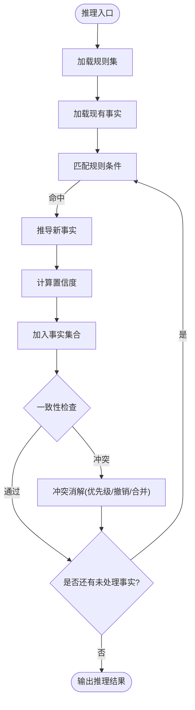
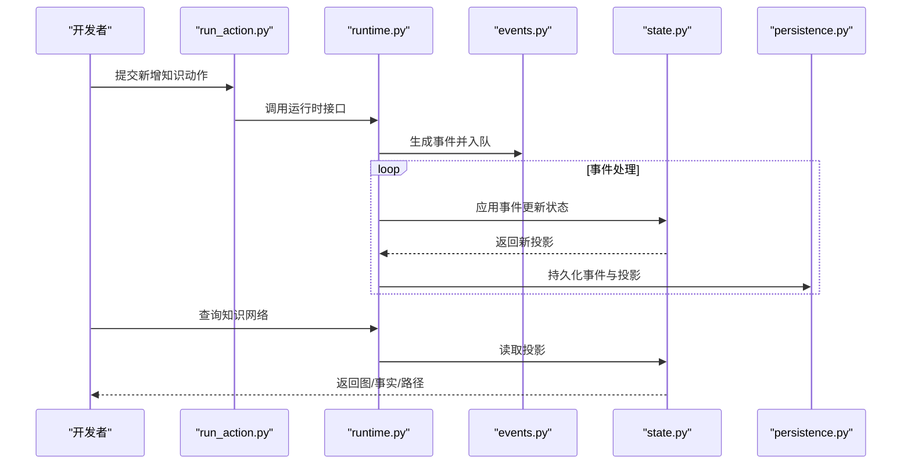
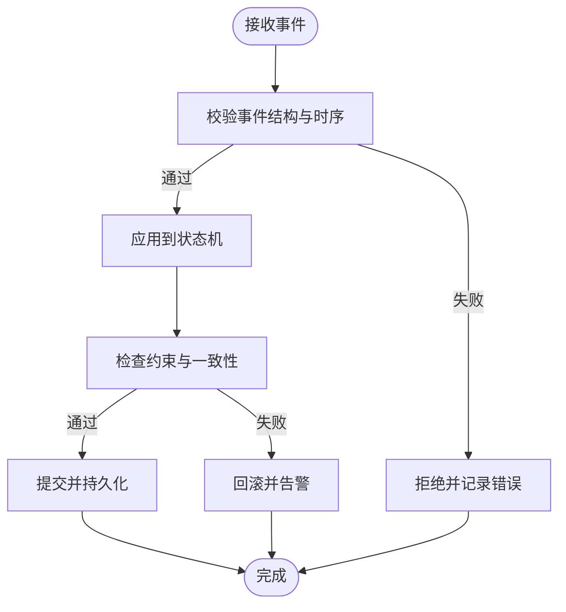
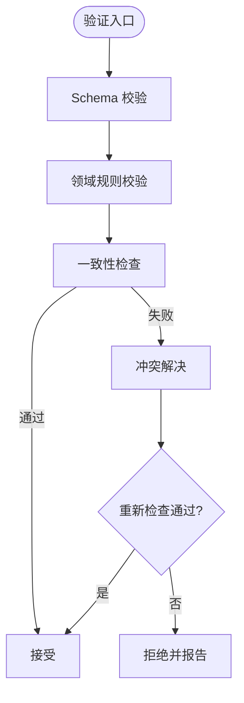
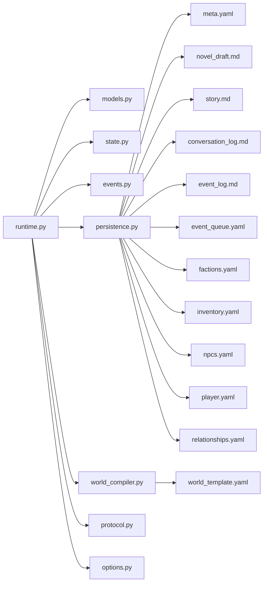

# 知识管理系统

<cite>
**本文引用的文件**   
- [engine/knowledge.md](file://engine/knowledge.md)
- [engine/base.md](file://engine/base.md)
- [engine/event_sourcing.md](file://engine/event_sourcing.md)
- [engine/social.md](file://engine/social.md)
- [engine_runtime/runtime.py](file://engine_runtime/runtime.py)
- [engine_runtime/models.py](file://engine_runtime/models.py)
- [engine_runtime/persistence.py](file://engine_runtime/persistence.py)
- [engine_runtime/state.py](file://engine_runtime/state.py)
- [engine_runtime/events.py](file://engine_runtime/events.py)
- [engine_runtime/world_compiler.py](file://engine_runtime/world_compiler.py)
- [engine_runtime/protocol.py](file://engine_runtime/protocol.py)
- [engine_runtime/options.py](file://engine_runtime/options.py)
- [templates/save_template/meta.yaml](file://templates/save_template/meta.yaml)
- [templates/save_template/novel_draft.md](file://templates/save_template/novel_draft.md)
- [templates/save_template/story.md](file://templates/save_template/story.md)
- [templates/save_template/conversation_log.md](file://templates/save_template/conversation_log.md)
- [templates/save_template/event_log.md](file://templates/save_template/event_log.md)
- [templates/save_template/event_queue.yaml](file://templates/save_template/event_queue.yaml)
- [templates/save_template/factions.yaml](file://templates/save_template/factions.yaml)
- [templates/save_template/inventory.yaml](file://templates/save_template/inventory.yaml)
- [templates/save_template/npcs.yaml](file://templates/save_template/npcs.yaml)
- [templates/save_template/player.yaml](file://templates/save_template/player.yaml)
- [templates/save_template/relationships.yaml](file://templates/save_template/relationships.yaml)
- [templates/world_template.yaml](file://templates/world_template.yaml)
- [tools/create_save.py](file://tools/create_save.py)
- [tools/validate_save.py](file://tools/validate_save.py)
- [tools/run_action.py](file://tools/run_action.py)
- [tests/fixtures/runtime_world.yaml](file://tests/fixtures/runtime_world.yaml)
</cite>

## 目录
1. [简介](#简介)
2. [项目结构](#项目结构)
3. [核心组件](#核心组件)
4. [架构总览](#架构总览)
5. [详细组件分析](#详细组件分析)
6. [依赖关系分析](#依赖关系分析)
7. [性能考虑](#性能考虑)
8. [故障排查指南](#故障排查指南)
9. [结论](#结论)
10. [附录](#附录)

## 简介
本文件系统性地梳理并文档化“知识管理系统”的设计与实现，重点覆盖：
- 知识的表示方法、存储结构与推理机制
- 知识图谱的构建过程、实体关系建模与语义推理算法
- 新增知识、查询知识网络与逻辑推理的具体实践路径
- 知识更新策略、版本控制与一致性保证
- 知识验证规则、冲突解决与性能优化建议

该文档面向不同经验水平的开发者，既提供高层概览，也给出代码级细节与图示，帮助读者快速上手并深入理解系统。

## 项目结构
仓库采用“引擎规范 + 运行时实现 + 模板与工具”的分层组织方式：
- engine：定义领域模型、事件溯源、社交与知识等核心规范（Markdown 描述）
- engine_runtime：Python 运行时实现，包含状态机、持久化、协议、世界编译器等
- templates：保存与世界的 YAML/Markdown 模板，用于序列化与校验
- tools：命令行工具，支持创建存档、运行动作、校验存档等
- tests：测试夹具与用例

图表来源
- [engine/knowledge.md](file://engine/knowledge.md)
- [engine/base.md](file://engine/base.md)
- [engine/event_sourcing.md](file://engine/event_sourcing.md)
- [engine/social.md](file://engine/social.md)
- [engine_runtime/runtime.py](file://engine_runtime/runtime.py)
- [engine_runtime/models.py](file://engine_runtime/models.py)
- [engine_runtime/persistence.py](file://engine_runtime/persistence.py)
- [engine_runtime/state.py](file://engine_runtime/state.py)
- [engine_runtime/events.py](file://engine_runtime/events.py)
- [engine_runtime/world_compiler.py](file://engine_runtime/world_compiler.py)
- [engine_runtime/protocol.py](file://engine_runtime/protocol.py)
- [engine_runtime/options.py](file://engine_runtime/options.py)
- [templates/save_template/meta.yaml](file://templates/save_template/meta.yaml)
- [templates/save_template/novel_draft.md](file://templates/save_template/novel_draft.md)
- [templates/save_template/story.md](file://templates/save_template/story.md)
- [templates/save_template/conversation_log.md](file://templates/save_template/conversation_log.md)
- [templates/save_template/event_log.md](file://templates/save_template/event_log.md)
- [templates/save_template/event_queue.yaml](file://templates/save_template/event_queue.yaml)
- [templates/save_template/factions.yaml](file://templates/save_template/factions.yaml)
- [templates/save_template/inventory.yaml](file://templates/save_template/inventory.yaml)
- [templates/save_template/npcs.yaml](file://templates/save_template/npcs.yaml)
- [templates/save_template/player.yaml](file://templates/save_template/player.yaml)
- [templates/save_template/relationships.yaml](file://templates/save_template/relationships.yaml)
- [templates/world_template.yaml](file://templates/world_template.yaml)
- [tools/create_save.py](file://tools/create_save.py)
- [tools/validate_save.py](file://tools/validate_save.py)
- [tools/run_action.py](file://tools/run_action.py)
- [tests/fixtures/runtime_world.yaml](file://tests/fixtures/runtime_world.yaml)

章节来源
- [engine/knowledge.md](file://engine/knowledge.md)
- [engine/base.md](file://engine/base.md)
- [engine/event_sourcing.md](file://engine/event_sourcing.md)
- [engine/social.md](file://engine/social.md)
- [engine_runtime/runtime.py](file://engine_runtime/runtime.py)
- [engine_runtime/models.py](file://engine_runtime/models.py)
- [engine_runtime/persistence.py](file://engine_runtime/persistence.py)
- [engine_runtime/state.py](file://engine_runtime/state.py)
- [engine_runtime/events.py](file://engine_runtime/events.py)
- [engine_runtime/world_compiler.py](file://engine_runtime/world_compiler.py)
- [engine_runtime/protocol.py](file://engine_runtime/protocol.py)
- [engine_runtime/options.py](file://engine_runtime/options.py)
- [templates/save_template/meta.yaml](file://templates/save_template/meta.yaml)
- [templates/save_template/novel_draft.md](file://templates/save_template/novel_draft.md)
- [templates/save_template/story.md](file://templates/save_template/story.md)
- [templates/save_template/conversation_log.md](file://templates/save_template/conversation_log.md)
- [templates/save_template/event_log.md](file://templates/save_template/event_log.md)
- [templates/save_template/event_queue.yaml](file://templates/save_template/event_queue.yaml)
- [templates/save_template/factions.yaml](file://templates/save_template/factions.yaml)
- [templates/save_template/inventory.yaml](file://templates/save_template/inventory.yaml)
- [templates/save_template/npcs.yaml](file://templates/save_template/npcs.yaml)
- [templates/save_template/player.yaml](file://templates/save_template/player.yaml)
- [templates/save_template/relationships.yaml](file://templates/save_template/relationships.yaml)
- [templates/world_template.yaml](file://templates/world_template.yaml)
- [tools/create_save.py](file://tools/create_save.py)
- [tools/validate_save.py](file://tools/validate_save.py)
- [tools/run_action.py](file://tools/run_action.py)
- [tests/fixtures/runtime_world.yaml](file://tests/fixtures/runtime_world.yaml)

## 核心组件
- 知识规范（engine/knowledge.md）：定义知识的表示、类型体系、关系建模与推理约束，是运行时实现的契约基础。
- 基类与通用能力（engine/base.md）：提供跨模块通用的数据结构与行为约定。
- 事件溯源（engine/event_sourcing.md）：以不可变事件驱动状态演进，确保可审计、可回放与一致性。
- 社交维度（engine/social.md）：刻画角色间关系、阵营与互动对知识的影响。
- 运行时（engine_runtime/*）：将上述规范落地为可执行的状态机、持久化、协议与世界编译器。
- 模板（templates/*）：定义存档与世界的结构化格式，便于序列化、校验与迁移。
- 工具（tools/*）：提供创建存档、运行动作、校验存档等实用能力。
- 测试（tests/*）：提供最小可用世界样例，支撑回归与集成测试。

章节来源
- [engine/knowledge.md](file://engine/knowledge.md)
- [engine/base.md](file://engine/base.md)
- [engine/event_sourcing.md](file://engine/event_sourcing.md)
- [engine/social.md](file://engine/social.md)
- [engine_runtime/runtime.py](file://engine_runtime/runtime.py)
- [engine_runtime/models.py](file://engine_runtime/models.py)
- [engine_runtime/persistence.py](file://engine_runtime/persistence.py)
- [engine_runtime/state.py](file://engine_runtime/state.py)
- [engine_runtime/events.py](file://engine_runtime/events.py)
- [engine_runtime/world_compiler.py](file://engine_runtime/world_compiler.py)
- [engine_runtime/protocol.py](file://engine_runtime/protocol.py)
- [engine_runtime/options.py](file://engine_runtime/options.py)
- [templates/save_template/meta.yaml](file://templates/save_template/meta.yaml)
- [templates/save_template/novel_draft.md](file://templates/save_template/novel_draft.md)
- [templates/save_template/story.md](file://templates/save_template/story.md)
- [templates/save_template/conversation_log.md](file://templates/save_template/conversation_log.md)
- [templates/save_template/event_log.md](file://templates/save_template/event_log.md)
- [templates/save_template/event_queue.yaml](file://templates/save_template/event_queue.yaml)
- [templates/save_template/factions.yaml](file://templates/save_template/factions.yaml)
- [templates/save_template/inventory.yaml](file://templates/save_template/inventory.yaml)
- [templates/save_template/npcs.yaml](file://templates/save_template/npcs.yaml)
- [templates/save_template/player.yaml](file://templates/save_template/player.yaml)
- [templates/save_template/relationships.yaml](file://templates/save_template/relationships.yaml)
- [templates/world_template.yaml](file://templates/world_template.yaml)
- [tools/create_save.py](file://tools/create_save.py)
- [tools/validate_save.py](file://tools/validate_save.py)
- [tools/run_action.py](file://tools/run_action.py)
- [tests/fixtures/runtime_world.yaml](file://tests/fixtures/runtime_world.yaml)

## 架构总览
系统采用“规范驱动 + 事件溯源 + 状态投影”的架构模式：
- 规范层（engine/*.md）：定义知识、事件、社交与通用能力的契约。
- 运行时层（engine_runtime/*）：基于协议与选项加载世界模板，编译为内部模型；通过事件队列驱动状态机，生成投影与日志；通过持久化模块读写模板文件。
- 模板层（templates/*）：作为持久化的稳定格式，承载世界配置、叙事草稿、对话与事件日志等。
- 工具层（tools/*）：封装常见操作（创建存档、运行动作、校验存档），便于开发与运维。

图表来源
- [engine_runtime/runtime.py](file://engine_runtime/runtime.py)
- [engine_runtime/world_compiler.py](file://engine_runtime/world_compiler.py)
- [engine_runtime/state.py](file://engine_runtime/state.py)
- [engine_runtime/events.py](file://engine_runtime/events.py)
- [engine_runtime/persistence.py](file://engine_runtime/persistence.py)
- [templates/world_template.yaml](file://templates/world_template.yaml)

## 详细组件分析

### 知识表示与存储
- 知识表示
  - 实体：人物、地点、物品、概念等，具备标识、属性与生命周期。
  - 关系：二元或多元关系，带权重、方向与时序信息。
  - 事实与规则：事实为当前已知断言；规则用于推导新事实或约束一致性。
  - 证据与置信度：每条事实可附带来源与置信度，支持不确定性推理。
- 存储结构
  - 内存投影：运行时维护高效查询的图结构与索引。
  - 模板文件：使用 YAML/Markdown 进行持久化，包括 meta、story、novel_draft、relationships、factions、inventory、npcs、player、event_log、event_queue 等。
  - 事件日志：所有变更以不可变事件追加，支持回放与审计。

图表来源
- [engine/knowledge.md](file://engine/knowledge.md)
- [engine_runtime/models.py](file://engine_runtime/models.py)
- [engine_runtime/events.py](file://engine_runtime/events.py)
- [engine_runtime/persistence.py](file://engine_runtime/persistence.py)
- [templates/save_template/meta.yaml](file://templates/save_template/meta.yaml)
- [templates/save_template/relationships.yaml](file://templates/save_template/relationships.yaml)
- [templates/save_template/event_log.md](file://templates/save_template/event_log.md)
- [templates/save_template/event_queue.yaml](file://templates/save_template/event_queue.yaml)

章节来源
- [engine/knowledge.md](file://engine/knowledge.md)
- [engine_runtime/models.py](file://engine_runtime/models.py)
- [engine_runtime/events.py](file://engine_runtime/events.py)
- [engine_runtime/persistence.py](file://engine_runtime/persistence.py)
- [templates/save_template/meta.yaml](file://templates/save_template/meta.yaml)
- [templates/save_template/relationships.yaml](file://templates/save_template/relationships.yaml)
- [templates/save_template/event_log.md](file://templates/save_template/event_log.md)
- [templates/save_template/event_queue.yaml](file://templates/save_template/event_queue.yaml)

### 知识图谱构建流程
- 世界模板解析：world_template.yaml 定义初始实体、关系与规则。
- 世界编译器：将模板转换为内部模型，建立实体与关系的索引。
- 初始投影：根据模板生成初始状态投影，供查询与推理使用。
- 增量构建：通过事件流持续扩展图谱，保持与事件日志一致。

图表来源
- [engine_runtime/world_compiler.py](file://engine_runtime/world_compiler.py)
- [engine_runtime/state.py](file://engine_runtime/state.py)
- [engine_runtime/events.py](file://engine_runtime/events.py)
- [engine_runtime/persistence.py](file://engine_runtime/persistence.py)
- [templates/world_template.yaml](file://templates/world_template.yaml)

章节来源
- [engine_runtime/world_compiler.py](file://engine_runtime/world_compiler.py)
- [engine_runtime/state.py](file://engine_runtime/state.py)
- [engine_runtime/events.py](file://engine_runtime/events.py)
- [engine_runtime/persistence.py](file://engine_runtime/persistence.py)
- [templates/world_template.yaml](file://templates/world_template.yaml)

### 实体关系建模
- 实体类型：人物、地点、物品、概念等，统一通过 ID 与类型区分。
- 关系类型：亲属、敌对、隶属、拥有、位于等，支持权重与时序。
- 多模态关联：同一实体可在多个上下文中被引用，需保持一致性约束。
- 关系生命周期：有效起止时间戳，支持历史回溯与快照。

图表来源
- [engine_runtime/models.py](file://engine_runtime/models.py)
- [engine/knowledge.md](file://engine/knowledge.md)

章节来源
- [engine_runtime/models.py](file://engine_runtime/models.py)
- [engine/knowledge.md](file://engine/knowledge.md)

### 语义推理算法
- 规则引擎：基于条件-后果的规则集，支持优先级与冲突消解。
- 置信度传播：结合证据与规则强度，计算新事实的置信度。
- 闭包计算：在有限步内推导可达事实，避免无限循环。
- 一致性检查：检测矛盾事实，触发修复或告警。

图表来源
- [engine/knowledge.md](file://engine/knowledge.md)
- [engine_runtime/state.py](file://engine_runtime/state.py)
- [engine_runtime/events.py](file://engine_runtime/events.py)

章节来源
- [engine/knowledge.md](file://engine/knowledge.md)
- [engine_runtime/state.py](file://engine_runtime/state.py)
- [engine_runtime/events.py](file://engine_runtime/events.py)

### 新增知识与查询知识网络
- 新增知识
  - 通过工具 run_action.py 提交动作，生成事件并进入队列。
  - 事件处理器根据动作类型创建/更新实体、关系与事实。
  - 世界编译器与状态机应用事件，更新投影。
- 查询知识网络
  - 通过运行时接口读取状态投影，支持按实体、关系、时间窗口过滤。
  - 支持图遍历、路径查找与子图导出。

图表来源
- [tools/run_action.py](file://tools/run_action.py)
- [engine_runtime/runtime.py](file://engine_runtime/runtime.py)
- [engine_runtime/events.py](file://engine_runtime/events.py)
- [engine_runtime/state.py](file://engine_runtime/state.py)
- [engine_runtime/persistence.py](file://engine_runtime/persistence.py)

章节来源
- [tools/run_action.py](file://tools/run_action.py)
- [engine_runtime/runtime.py](file://engine_runtime/runtime.py)
- [engine_runtime/events.py](file://engine_runtime/events.py)
- [engine_runtime/state.py](file://engine_runtime/state.py)
- [engine_runtime/persistence.py](file://engine_runtime/persistence.py)

### 知识更新策略、版本控制与一致性保证
- 更新策略
  - 事件溯源：所有变更以不可变事件追加，禁止就地修改。
  - 幂等处理：相同事件多次应用不改变最终状态。
  - 事务边界：批量事件在同一批次内原子应用。
- 版本控制
  - 模板版本：world_template.yaml 与存档 meta.yaml 记录版本信息。
  - 迁移脚本：通过工具 validate_save.py 与 create_save.py 进行校验与转换。
- 一致性保证
  - 约束检查：实体存在性、关系合法性、事实唯一性与时序正确性。
  - 冲突消解：基于规则优先级、置信度与时间优先策略。

图表来源
- [engine/event_sourcing.md](file://engine/event_sourcing.md)
- [engine_runtime/events.py](file://engine_runtime/events.py)
- [engine_runtime/state.py](file://engine_runtime/state.py)
- [engine_runtime/persistence.py](file://engine_runtime/persistence.py)
- [templates/save_template/meta.yaml](file://templates/save_template/meta.yaml)

章节来源
- [engine/event_sourcing.md](file://engine/event_sourcing.md)
- [engine_runtime/events.py](file://engine_runtime/events.py)
- [engine_runtime/state.py](file://engine_runtime/state.py)
- [engine_runtime/persistence.py](file://engine_runtime/persistence.py)
- [templates/save_template/meta.yaml](file://templates/save_template/meta.yaml)

### 知识验证规则、冲突解决与性能优化
- 验证规则
  - 必填字段校验、类型约束、枚举值限制。
  - 关系双向一致性、实体生命周期有效性。
  - 事实与证据链完整性。
- 冲突解决
  - 规则优先级排序、置信度阈值比较。
  - 撤销旧事实、合并相似事实、引入仲裁者。
- 性能优化
  - 索引加速：实体 ID、关系类型、时间戳索引。
  - 惰性计算：按需推导与缓存中间结果。
  - 批处理：批量事件合并与并行应用（无环依赖）。

图表来源
- [engine/knowledge.md](file://engine/knowledge.md)
- [engine_runtime/state.py](file://engine_runtime/state.py)
- [tools/validate_save.py](file://tools/validate_save.py)

章节来源
- [engine/knowledge.md](file://engine/knowledge.md)
- [engine_runtime/state.py](file://engine_runtime/state.py)
- [tools/validate_save.py](file://tools/validate_save.py)

## 依赖关系分析
- 模块耦合
  - runtime.py 依赖 models.py、state.py、events.py、persistence.py、world_compiler.py、protocol.py、options.py。
  - persistence.py 依赖模板文件（YAML/Markdown）进行序列化与反序列化。
  - world_compiler.py 依赖 world_template.yaml 构建内部模型。
- 外部依赖
  - 文件系统：模板与存档的读写。
  - 工具链：create_save.py、validate_save.py、run_action.py 提供常用操作。

图表来源
- [engine_runtime/runtime.py](file://engine_runtime/runtime.py)
- [engine_runtime/models.py](file://engine_runtime/models.py)
- [engine_runtime/state.py](file://engine_runtime/state.py)
- [engine_runtime/events.py](file://engine_runtime/events.py)
- [engine_runtime/persistence.py](file://engine_runtime/persistence.py)
- [engine_runtime/world_compiler.py](file://engine_runtime/world_compiler.py)
- [engine_runtime/protocol.py](file://engine_runtime/protocol.py)
- [engine_runtime/options.py](file://engine_runtime/options.py)
- [templates/save_template/meta.yaml](file://templates/save_template/meta.yaml)
- [templates/save_template/novel_draft.md](file://templates/save_template/novel_draft.md)
- [templates/save_template/story.md](file://templates/save_template/story.md)
- [templates/save_template/conversation_log.md](file://templates/save_template/conversation_log.md)
- [templates/save_template/event_log.md](file://templates/save_template/event_log.md)
- [templates/save_template/event_queue.yaml](file://templates/save_template/event_queue.yaml)
- [templates/save_template/factions.yaml](file://templates/save_template/factions.yaml)
- [templates/save_template/inventory.yaml](file://templates/save_template/inventory.yaml)
- [templates/save_template/npcs.yaml](file://templates/save_template/npcs.yaml)
- [templates/save_template/player.yaml](file://templates/save_template/player.yaml)
- [templates/save_template/relationships.yaml](file://templates/save_template/relationships.yaml)
- [templates/world_template.yaml](file://templates/world_template.yaml)

章节来源
- [engine_runtime/runtime.py](file://engine_runtime/runtime.py)
- [engine_runtime/models.py](file://engine_runtime/models.py)
- [engine_runtime/state.py](file://engine_runtime/state.py)
- [engine_runtime/events.py](file://engine_runtime/events.py)
- [engine_runtime/persistence.py](file://engine_runtime/persistence.py)
- [engine_runtime/world_compiler.py](file://engine_runtime/world_compiler.py)
- [engine_runtime/protocol.py](file://engine_runtime/protocol.py)
- [engine_runtime/options.py](file://engine_runtime/options.py)
- [templates/save_template/meta.yaml](file://templates/save_template/meta.yaml)
- [templates/save_template/novel_draft.md](file://templates/save_template/novel_draft.md)
- [templates/save_template/story.md](file://templates/save_template/story.md)
- [templates/save_template/conversation_log.md](file://templates/save_template/conversation_log.md)
- [templates/save_template/event_log.md](file://templates/save_template/event_log.md)
- [templates/save_template/event_queue.yaml](file://templates/save_template/event_queue.yaml)
- [templates/save_template/factions.yaml](file://templates/save_template/factions.yaml)
- [templates/save_template/inventory.yaml](file://templates/save_template/inventory.yaml)
- [templates/save_template/npcs.yaml](file://templates/save_template/npcs.yaml)
- [templates/save_template/player.yaml](file://templates/save_template/player.yaml)
- [templates/save_template/relationships.yaml](file://templates/save_template/relationships.yaml)
- [templates/world_template.yaml](file://templates/world_template.yaml)

## 性能考虑
- 事件批处理：合并相邻事件减少 I/O 与状态切换开销。
- 索引策略：为高频查询字段建立索引（实体 ID、关系类型、时间戳）。
- 惰性推导：仅在查询时触发必要推导，避免全量闭包计算。
- 缓存中间结果：对重复使用的子图与事实进行缓存与失效管理。
- 并行应用：在无依赖的事件集上并行应用，提升吞吐。

[本节为通用指导，无需特定文件来源]

## 故障排查指南
- 常见问题
  - 事件序列不一致：检查 event_log 与 event_queue 的顺序与完整性。
  - 模板格式错误：使用 validate_save.py 校验 YAML/Markdown 结构。
  - 推理死循环：检查规则条件是否存在自引用或循环依赖。
  - 冲突频繁：调整规则优先级与置信度阈值，引入仲裁策略。
- 调试步骤
  - 启用详细日志，定位事件处理失败点。
  - 导出子图与事实集，人工核对一致性。
  - 回放事件序列，复现问题并验证修复。

章节来源
- [engine/event_sourcing.md](file://engine/event_sourcing.md)
- [engine_runtime/events.py](file://engine_runtime/events.py)
- [engine_runtime/state.py](file://engine_runtime/state.py)
- [tools/validate_save.py](file://tools/validate_save.py)

## 结论
本知识管理系统以规范驱动与事件溯源为核心，结合模板化持久化与工具链，提供了可扩展、可审计、可回放的知识表示与推理能力。通过清晰的实体关系建模、严格的验证与冲突消解策略，以及性能优化手段，系统能够在复杂叙事与社交场景中稳定运行。建议在实际使用中遵循最佳实践，逐步完善规则集与索引策略，以获得更佳的准确性与效率。

[本节为总结性内容，无需特定文件来源]

## 附录
- 示例工作流
  - 创建存档：使用 create_save.py 基于 world_template.yaml 生成初始存档。
  - 运行动作：通过 run_action.py 提交动作，驱动事件处理与状态更新。
  - 校验存档：使用 validate_save.py 检查模板与存档的一致性。
- 参考夹具
  - tests/fixtures/runtime_world.yaml 提供最小可用世界样例，便于测试与演示。

章节来源
- [tools/create_save.py](file://tools/create_save.py)
- [tools/run_action.py](file://tools/run_action.py)
- [tools/validate_save.py](file://tools/validate_save.py)
- [tests/fixtures/runtime_world.yaml](file://tests/fixtures/runtime_world.yaml)