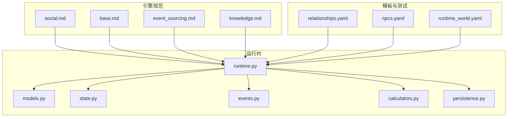
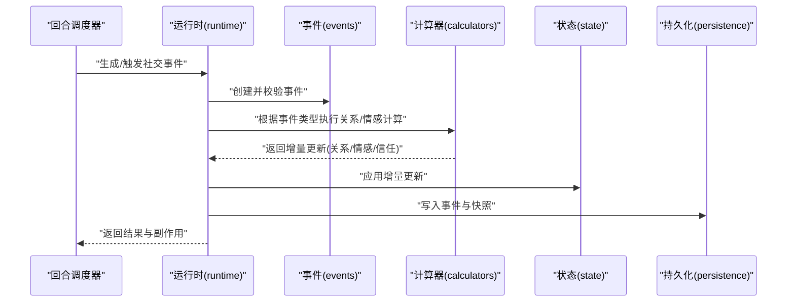
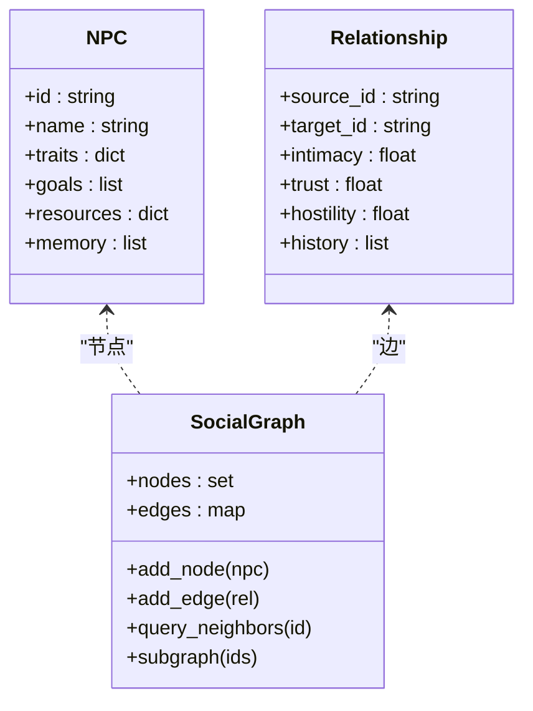
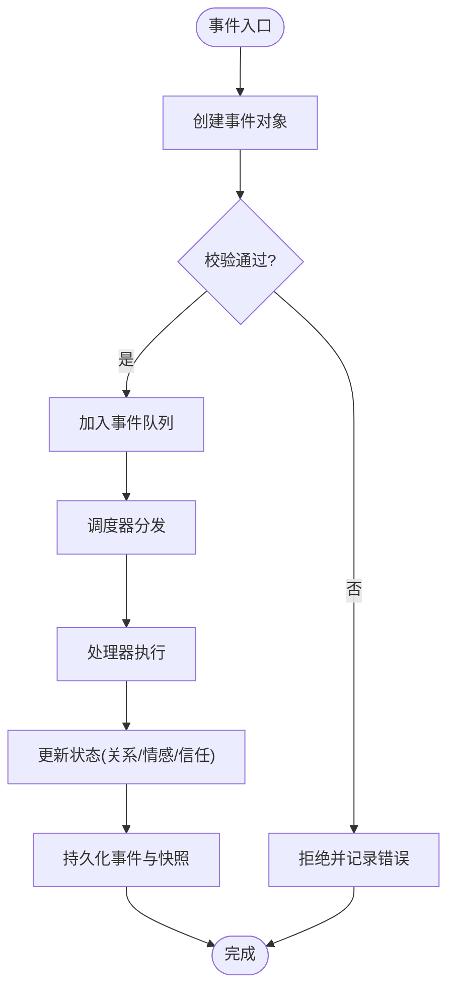
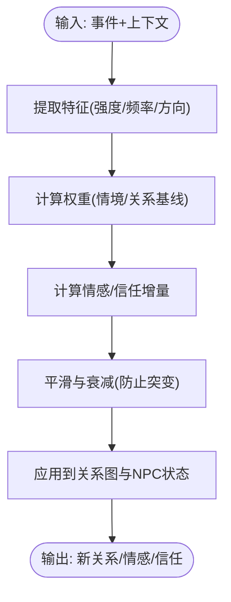
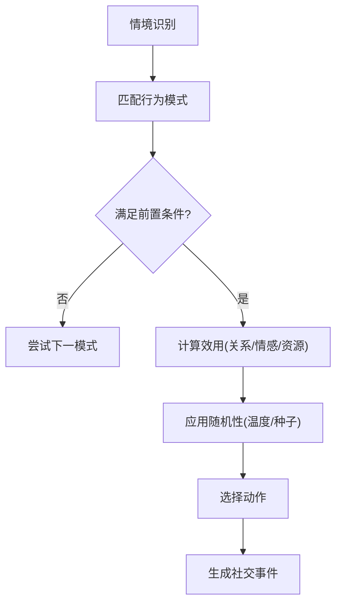
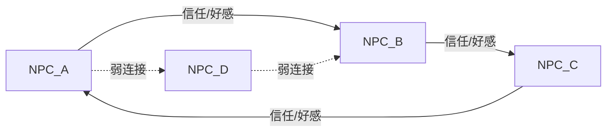
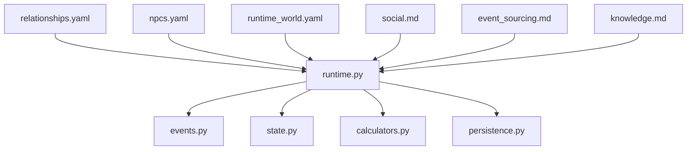

# 社会交互系统

<cite>
**本文引用的文件**   
- [engine/social.md](file://engine/social.md)
- [engine/base.md](file://engine/base.md)
- [engine/event_sourcing.md](file://engine/event_sourcing.md)
- [engine/knowledge.md](file://engine/knowledge.md)
- [engine_runtime/runtime.py](file://engine_runtime/runtime.py)
- [engine_runtime/models.py](file://engine_runtime/models.py)
- [engine_runtime/state.py](file://engine_runtime/state.py)
- [engine_runtime/events.py](file://engine_runtime/events.py)
- [engine_runtime/calculators.py](file://engine_runtime/calculators.py)
- [engine_runtime/persistence.py](file://engine_runtime/persistence.py)
- [templates/save_template/relationships.yaml](file://templates/save_template/relationships.yaml)
- [templates/save_template/npcs.yaml](file://templates/save_template/npcs.yaml)
- [tests/fixtures/runtime_world.yaml](file://tests/fixtures/runtime_world.yaml)
</cite>

## 目录
1. [引言](#引言)
2. [项目结构](#项目结构)
3. [核心组件](#核心组件)
4. [架构总览](#架构总览)
5. [详细组件分析](#详细组件分析)
6. [依赖关系分析](#依赖关系分析)
7. [性能考量](#性能考量)
8. [故障排查指南](#故障排查指南)
9. [结论](#结论)
10. [附录](#附录)

## 引言
本文件面向“社会交互系统”的设计与实现，聚焦NPC角色之间的社交关系建模、情感计算和行为决策机制。文档从系统架构出发，逐步深入到人际关系网络、信任度评估、群体动力学模拟、行为模式库、决策树算法与随机性控制，并提供配置示例路径与验证方法，帮助不同经验水平的开发者快速上手并深入定制。

## 项目结构
本项目采用“引擎规范 + 运行时实现 + 模板与测试”的分层组织：
- 引擎规范（engine）：定义社会交互、事件溯源、知识模型等核心概念与约束。
- 运行时（engine_runtime）：提供状态机、事件处理、计算模块、持久化与编译器等具体实现。
- 模板（templates）：保存世界与关系的初始数据结构，便于加载与回放。
- 测试（tests）：提供最小可运行世界样例，用于回归与效果验证。

**图表来源** 
- [engine/social.md](file://engine/social.md)
- [engine/base.md](file://engine/base.md)
- [engine/event_sourcing.md](file://engine/event_sourcing.md)
- [engine/knowledge.md](file://engine/knowledge.md)
- [engine_runtime/runtime.py](file://engine_runtime/runtime.py)
- [engine_runtime/models.py](file://engine_runtime/models.py)
- [engine_runtime/state.py](file://engine_runtime/state.py)
- [engine_runtime/events.py](file://engine_runtime/events.py)
- [engine_runtime/calculators.py](file://engine_runtime/calculators.py)
- [engine_runtime/persistence.py](file://engine_runtime/persistence.py)
- [templates/save_template/relationships.yaml](file://templates/save_template/relationships.yaml)
- [templates/save_template/npcs.yaml](file://templates/save_template/npcs.yaml)
- [tests/fixtures/runtime_world.yaml](file://tests/fixtures/runtime_world.yaml)

**章节来源**
- [engine/social.md](file://engine/social.md)
- [engine/base.md](file://engine/base.md)
- [engine/event_sourcing.md](file://engine/event_sourcing.md)
- [engine/knowledge.md](file://engine/knowledge.md)
- [engine_runtime/runtime.py](file://engine_runtime/runtime.py)
- [engine_runtime/models.py](file://engine_runtime/models.py)
- [engine_runtime/state.py](file://engine_runtime/state.py)
- [engine_runtime/events.py](file://engine_runtime/events.py)
- [engine_runtime/calculators.py](file://engine_runtime/calculators.py)
- [engine_runtime/persistence.py](file://engine_runtime/persistence.py)
- [templates/save_template/relationships.yaml](file://templates/save_template/relationships.yaml)
- [templates/save_template/npcs.yaml](file://templates/save_template/npcs.yaml)
- [tests/fixtures/runtime_world.yaml](file://tests/fixtures/runtime_world.yaml)

## 核心组件
- 社会交互规范：定义NPC社交关系、情感维度、信任度量与社交事件的语义约束。
- 运行时状态机：维护当前世界状态、NPC属性、关系图与事件队列。
- 事件溯源：以不可变事件记录驱动状态变更，支持回放与审计。
- 知识模型：为NPC提供背景知识与记忆，影响行为选择与情感演化。
- 计算器：封装关系变化、信任度更新、情感计算与群体动力学规则。
- 持久化：将世界状态与事件序列序列化到YAML/文本，便于存档与调试。

**章节来源**
- [engine/social.md](file://engine/social.md)
- [engine/event_sourcing.md](file://engine/event_sourcing.md)
- [engine/knowledge.md](file://engine/knowledge.md)
- [engine_runtime/runtime.py](file://engine_runtime/runtime.py)
- [engine_runtime/state.py](file://engine_runtime/state.py)
- [engine_runtime/events.py](file://engine_runtime/events.py)
- [engine_runtime/calculators.py](file://engine_runtime/calculators.py)
- [engine_runtime/persistence.py](file://engine_runtime/persistence.py)

## 架构总览
社会交互系统由“事件驱动的状态机”构成：外部输入或内部调度产生社交事件，事件经校验后进入处理器，处理器调用计算器更新关系与情感，最终落盘持久化并可回放。

**图表来源** 
- [engine_runtime/runtime.py](file://engine_runtime/runtime.py)
- [engine_runtime/events.py](file://engine_runtime/events.py)
- [engine_runtime/calculators.py](file://engine_runtime/calculators.py)
- [engine_runtime/state.py](file://engine_runtime/state.py)
- [engine_runtime/persistence.py](file://engine_runtime/persistence.py)

## 详细组件分析

### NPC与关系数据模型
- NPC实体：包含基础属性、性格倾向、目标与资源等，作为社交行为的主体。
- 关系边：描述两个NPC之间的关系强度、亲密度、信任度、敌意等维度。
- 关系图：全局有向图结构，支持查询邻居、子图与路径，支撑群体动力学分析。

**图表来源** 
- [engine_runtime/models.py](file://engine_runtime/models.py)
- [engine_runtime/state.py](file://engine_runtime/state.py)
- [templates/save_template/npcs.yaml](file://templates/save_template/npcs.yaml)
- [templates/save_template/relationships.yaml](file://templates/save_template/relationships.yaml)

**章节来源**
- [engine_runtime/models.py](file://engine_runtime/models.py)
- [engine_runtime/state.py](file://engine_runtime/state.py)
- [templates/save_template/npcs.yaml](file://templates/save_template/npcs.yaml)
- [templates/save_template/relationships.yaml](file://templates/save_template/relationships.yaml)

### 事件溯源与社交事件
- 事件类型：如“互动”、“冲突”、“合作”、“背叛”、“和解”等，每种事件携带参与者、上下文与权重。
- 事件生命周期：创建→校验→入队→处理→落盘；支持按时间戳回放与审计。
- 副作用：事件处理后可能触发关系变化、情感波动、行为策略切换等。

**图表来源** 
- [engine_runtime/events.py](file://engine_runtime/events.py)
- [engine_runtime/runtime.py](file://engine_runtime/runtime.py)
- [engine/event_sourcing.md](file://engine/event_sourcing.md)

**章节来源**
- [engine_runtime/events.py](file://engine_runtime/events.py)
- [engine_runtime/runtime.py](file://engine_runtime/runtime.py)
- [engine/event_sourcing.md](file://engine/event_sourcing.md)

### 情感计算与信任度评估
- 情感维度：好感、厌恶、焦虑、自豪等，受事件与历史交互影响。
- 信任度：基于一致性、可靠性与互惠性综合评估，随互动正负反馈动态调整。
- 计算公式：通常采用加权移动平均、阈值衰减与情境修正，避免剧烈震荡。

**图表来源** 
- [engine_runtime/calculators.py](file://engine_runtime/calculators.py)
- [engine/social.md](file://engine/social.md)

**章节来源**
- [engine_runtime/calculators.py](file://engine_runtime/calculators.py)
- [engine/social.md](file://engine/social.md)

### 行为模式库与决策树
- 行为模式库：定义NPC在特定情境下的可选动作集合（如“求助”、“威胁”、“结盟”），附带前置条件与概率权重。
- 决策树：依据当前关系、情感、资源与目标进行分支选择，支持随机性与探索策略。
- 随机性控制：使用种子与温度参数调节探索/利用平衡，保证可重复性与多样性。

**图表来源** 
- [engine_runtime/runtime.py](file://engine_runtime/runtime.py)
- [engine/knowledge.md](file://engine/knowledge.md)

**章节来源**
- [engine_runtime/runtime.py](file://engine_runtime/runtime.py)
- [engine/knowledge.md](file://engine/knowledge.md)

### 群体动力学模拟
- 局部规则：个体间互动遵循简单规则，涌现出联盟、派系、舆论扩散等现象。
- 传播模型：信息/情绪通过关系边传播，考虑距离、信任与注意力。
- 稳定性分析：检测循环依赖、极化与孤立节点，辅助调参与干预。

**图表来源** 
- [engine_runtime/state.py](file://engine_runtime/state.py)
- [engine/social.md](file://engine/social.md)

**章节来源**
- [engine_runtime/state.py](file://engine_runtime/state.py)
- [engine/social.md](file://engine/social.md)

### 社交场景配置与参数调优
- 场景配置：通过YAML定义NPC、初始关系、事件权重与行为模式，便于快速搭建实验。
- 关键参数：情感学习率、信任衰减系数、随机温度、事件阈值、传播半径等。
- 调优方法：A/B对比、指标监控（关系分布、事件速率）、可视化回溯。

**章节来源**
- [templates/save_template/relationships.yaml](file://templates/save_template/relationships.yaml)
- [templates/save_template/npcs.yaml](file://templates/save_template/npcs.yaml)
- [tests/fixtures/runtime_world.yaml](file://tests/fixtures/runtime_world.yaml)

### 代码级示例路径（不展示源码内容）
- 定义社交规则与事件类型：参考事件模块中的事件结构与校验逻辑。
- 计算关系变化与信任度：参考计算器模块中的增量计算与平滑函数。
- 触发社交事件：参考运行时中的事件调度与副作用应用流程。
- 行为模式库与决策树：参考运行时中行为匹配与选择逻辑。
- 随机性控制：参考运行时与计算器中的温度/种子参数使用位置。

**章节来源**
- [engine_runtime/events.py](file://engine_runtime/events.py)
- [engine_runtime/calculators.py](file://engine_runtime/calculators.py)
- [engine_runtime/runtime.py](file://engine_runtime/runtime.py)

## 依赖关系分析
社会交互系统的模块耦合清晰：运行时协调事件、状态、计算器与持久化；模板与测试提供数据与用例；引擎规范定义契约。

**图表来源** 
- [engine_runtime/runtime.py](file://engine_runtime/runtime.py)
- [engine_runtime/events.py](file://engine_runtime/events.py)
- [engine_runtime/state.py](file://engine_runtime/state.py)
- [engine_runtime/calculators.py](file://engine_runtime/calculators.py)
- [engine_runtime/persistence.py](file://engine_runtime/persistence.py)
- [templates/save_template/relationships.yaml](file://templates/save_template/relationships.yaml)
- [templates/save_template/npcs.yaml](file://templates/save_template/npcs.yaml)
- [tests/fixtures/runtime_world.yaml](file://tests/fixtures/runtime_world.yaml)
- [engine/social.md](file://engine/social.md)
- [engine/event_sourcing.md](file://engine/event_sourcing.md)
- [engine/knowledge.md](file://engine/knowledge.md)

**章节来源**
- [engine_runtime/runtime.py](file://engine_runtime/runtime.py)
- [engine_runtime/events.py](file://engine_runtime/events.py)
- [engine_runtime/state.py](file://engine_runtime/state.py)
- [engine_runtime/calculators.py](file://engine_runtime/calculators.py)
- [engine_runtime/persistence.py](file://engine_runtime/persistence.py)
- [templates/save_template/relationships.yaml](file://templates/save_template/relationships.yaml)
- [templates/save_template/npcs.yaml](file://templates/save_template/npcs.yaml)
- [tests/fixtures/runtime_world.yaml](file://tests/fixtures/runtime_world.yaml)
- [engine/social.md](file://engine/social.md)
- [engine/event_sourcing.md](file://engine/event_sourcing.md)
- [engine/knowledge.md](file://engine/knowledge.md)

## 性能考量
- 事件批处理：批量生成与处理事件，减少状态同步开销。
- 惰性计算：仅在需要时计算复杂关系指标（如中心性、连通分量）。
- 缓存策略：对高频查询的邻居与子图进行缓存，定期失效。
- 随机性优化：预生成随机数序列，避免重复采样。
- 持久化压缩：事件日志采用增量与压缩存储，降低I/O压力。

[本节为通用指导，无需引用具体文件]

## 故障排查指南
- 事件校验失败：检查事件字段完整性与类型，确认上下文参数有效。
- 关系震荡：调整情感学习率与信任衰减系数，增加平滑窗口。
- 行为死锁：检查决策树分支覆盖与前置条件，补充兜底动作。
- 随机不可复现：固定种子与温度，确保回放一致。
- 持久化异常：确认YAML格式与字段映射，回滚到最近快照。

**章节来源**
- [engine_runtime/events.py](file://engine_runtime/events.py)
- [engine_runtime/calculators.py](file://engine_runtime/calculators.py)
- [engine_runtime/persistence.py](file://engine_runtime/persistence.py)

## 结论
社会交互系统以事件驱动为核心，结合关系图、情感计算与行为决策，形成可配置、可回放、可扩展的NPC社交仿真框架。通过合理的参数调优与验证方法，可在不同规模与复杂度下稳定运行，并为叙事生成与策略模拟提供坚实基础。

[本节为总结，无需引用具体文件]

## 附录
- 术语表：NPC、关系图、事件溯源、情感维度、信任度、群体动力学、行为模式库、决策树、随机性控制。
- 推荐实践：先小范围验证规则与参数，再扩展至全量世界；保持事件不可变与状态快照分离；用可视化追踪关系演化。

[本节为附加说明，无需引用具体文件]