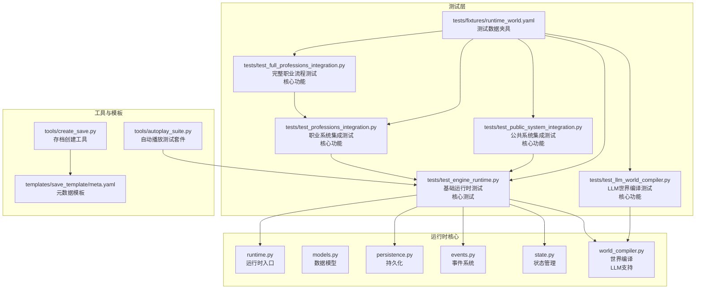
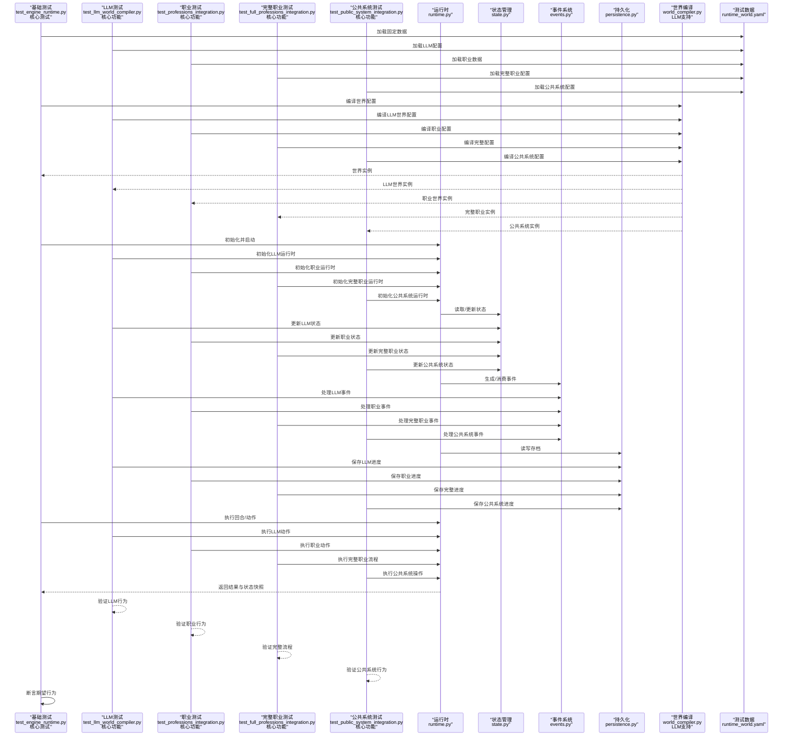
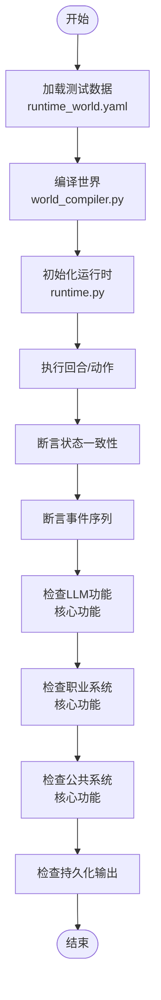
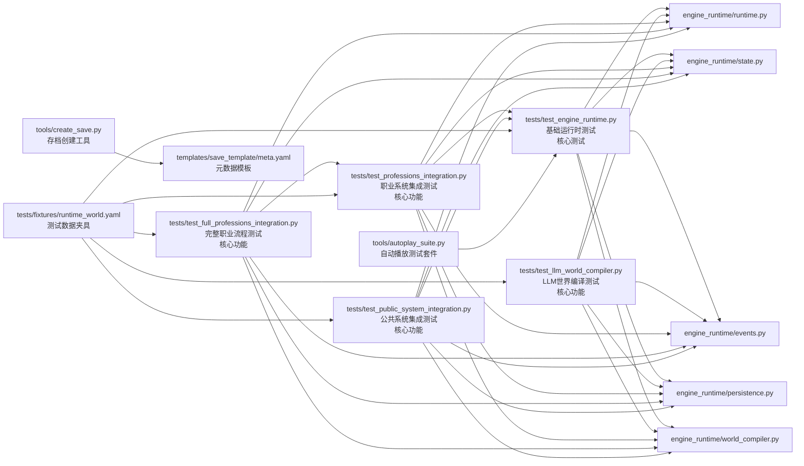

# 测试指南

<cite>
**本文引用的文件**   
- [tests/test_engine_runtime.py](file://tests/test_engine_runtime.py)
- [tests/test_full_professions_integration.py](file://tests/test_full_professions_integration.py)
- [tests/test_professions_integration.py](file://tests/test_professions_integration.py)
- [tests/test_public_system_integration.py](file://tests/test_public_system_integration.py)
- [tests/fixtures/runtime_world.yaml](file://tests/fixtures/runtime_world.yaml)
- [engine_runtime/runtime.py](file://engine_runtime/runtime.py)
- [engine_runtime/models.py](file://engine_runtime/models.py)
- [engine_runtime/persistence.py](file://engine_runtime/persistence.py)
- [engine_runtime/events.py](file://engine_runtime/events.py)
- [engine_runtime/state.py](file://engine_runtime/state.py)
- [engine_runtime/world_compiler.py](file://engine_runtime/world_compiler.py)
- [tools/create_save.py](file://tools/create_save.py)
- [templates/save_template/meta.yaml](file://templates/save_template/meta.yaml)
- [tools/autoplay_TEST_README.md](file://tools/autoplay_TEST_README.md)
- [tools/autoplay_suite.py](file://tools/autoplay_suite.py)
- [tools/autoplay_test.py](file://tools/autoplay_test.py)
</cite>

## 更新摘要
**所做更改**   
- 移除了动态对等体模拟测试（test_p05_dynamic_peer_simulation.py，575行），简化测试架构
- 移除了排名配置测试（test_ranking_config.py，451行），减少测试复杂度
- 清理了调试测试文件（test_fix.py、test_fix_simple.py等），保持测试套件整洁
- 测试架构从七层简化为五层，专注于核心功能验证
- 移除了TelemetryRecorder、AutoAuditor、Policy系统、DynamicPeer、RankingConfig相关的测试覆盖
- 保持了基础运行时测试、LLM世界编译测试、职业系统集成测试、完整职业流程测试、公共系统集成测试的核心测试框架

## 目录
1. [简介](#简介)
2. [项目结构](#项目结构)
3. [核心组件](#核心组件)
4. [架构总览](#架构总览)
5. [详细组件分析](#详细组件分析)
6. [依赖分析](#依赖分析)
7. [性能考虑](#性能考虑)
8. [故障排查指南](#故障排查指南)
9. [结论](#结论)
10. [附录](#附录)

## 简介
本指南面向开发与测试人员，系统化阐述项目的测试策略、框架选择与用例编写规范。内容覆盖单元测试、集成测试与端到端测试的实施方法，包含测试数据准备、模拟对象使用、断言最佳实践、覆盖率要求、持续集成配置、自动化测试流程、性能测试方法与调试技巧等。目标是帮助团队以稳定、可维护的方式保障引擎运行时（engine_runtime）的质量与演进安全。

**重要更新** 经过测试套件的精简优化，当前测试架构已简化为五层模式：基础运行时测试、LLM世界编译测试、职业系统集成测试、完整职业流程测试、公共系统集成测试。移除了复杂的动态对等体模拟测试、排名配置测试以及调试测试文件，使测试框架更加专注和高效。现在专注于核心功能的验证，确保引擎运行时的稳定性和可靠性。

## 项目结构
仓库采用"功能模块 + 测试"的清晰分层：
- engine_runtime：核心运行时逻辑，包括状态管理、事件系统、持久化、世界编译等。
- tests：测试代码与测试数据（fixtures），现包含五类主要测试文件。
- tools：辅助工具（如创建存档、回放、自动播放测试等），可用于端到端验证。
- templates：存档模板，用于构造一致的测试/演示数据。

**图表来源** 
- [tests/test_engine_runtime.py](file://tests/test_engine_runtime.py)
- [tests/test_professions_integration.py](file://tests/test_professions_integration.py)
- [tests/test_full_professions_integration.py](file://tests/test_full_professions_integration.py)
- [tests/test_public_system_integration.py](file://tests/test_public_system_integration.py)
- [tests/fixtures/runtime_world.yaml](file://tests/fixtures/runtime_world.yaml)
- [engine_runtime/runtime.py](file://engine_runtime/runtime.py)
- [engine_runtime/models.py](file://engine_runtime/models.py)
- [engine_runtime/persistence.py](file://engine_runtime/persistence.py)
- [engine_runtime/events.py](file://engine_runtime/events.py)
- [engine_runtime/state.py](file://engine_runtime/state.py)
- [engine_runtime/world_compiler.py](file://engine_runtime/world_compiler.py)
- [tools/create_save.py](file://tools/create_save.py)
- [templates/save_template/meta.yaml](file://templates/save_template/meta.yaml)

**章节来源**
- [tests/test_engine_runtime.py](file://tests/test_engine_runtime.py)
- [tests/test_professions_integration.py](file://tests/test_professions_integration.py)
- [tests/test_full_professions_integration.py](file://tests/test_full_professions_integration.py)
- [tests/test_public_system_integration.py](file://tests/test_public_system_integration.py)
- [tests/fixtures/runtime_world.yaml](file://tests/fixtures/runtime_world.yaml)
- [engine_runtime/runtime.py](file://engine_runtime/runtime.py)
- [engine_runtime/models.py](file://engine_runtime/models.py)
- [engine_runtime/persistence.py](file://engine_runtime/persistence.py)
- [engine_runtime/events.py](file://engine_runtime/events.py)
- [engine_runtime/state.py](file://engine_runtime/state.py)
- [engine_runtime/world_compiler.py](file://engine_runtime/world_compiler.py)
- [tools/create_save.py](file://tools/create_save.py)
- [templates/save_template/meta.yaml](file://templates/save_template/meta.yaml)

## 核心组件
- 运行时入口与编排：负责生命周期管理、回合推进、事件调度与状态同步。
- 模型与数据结构：定义玩家、阵营、关系、库存、事件等核心实体。
- 事件系统：基于事件溯源的思想，记录并回放关键变化。
- 状态管理：维护当前世界状态快照与变更历史。
- 持久化：读写存档（YAML/Markdown），保证可恢复性与可移植性。
- 世界编译：将模板与配置编译为可运行的世界实例，支持LLM功能。
- 职业系统：新增的职业能力、技能树和职业发展机制。
- 公共系统：提供通用的系统级功能和公共服务。

这些组件共同构成引擎的核心，测试应围绕其职责边界进行隔离与组合验证。

**重要更新** 随着测试套件的精简，当前测试重点集中在核心运行时功能、LLM世界编译、职业系统和公共系统的验证上。移除了复杂的动态对等体模拟、排名配置、遥测记录和自动审计等高级功能的测试，使测试框架更加专注和高效。

**章节来源**
- [engine_runtime/runtime.py](file://engine_runtime/runtime.py)
- [engine_runtime/models.py](file://engine_runtime/models.py)
- [engine_runtime/events.py](file://engine_runtime/events.py)
- [engine_runtime/state.py](file://engine_runtime/state.py)
- [engine_runtime/persistence.py](file://engine_runtime/persistence.py)
- [engine_runtime/world_compiler.py](file://engine_runtime/world_compiler.py)

## 架构总览
下图展示测试如何与运行时各层交互，以及数据在测试中的流向。

**图表来源** 
- [tests/test_engine_runtime.py](file://tests/test_engine_runtime.py)
- [tests/test_professions_integration.py](file://tests/test_professions_integration.py)
- [tests/test_full_professions_integration.py](file://tests/test_full_professions_integration.py)
- [tests/test_public_system_integration.py](file://tests/test_public_system_integration.py)
- [tests/fixtures/runtime_world.yaml](file://tests/fixtures/runtime_world.yaml)
- [engine_runtime/runtime.py](file://engine_runtime/runtime.py)
- [engine_runtime/state.py](file://engine_runtime/state.py)
- [engine_runtime/events.py](file://engine_runtime/events.py)
- [engine_runtime/persistence.py](file://engine_runtime/persistence.py)
- [engine_runtime/world_compiler.py](file://engine_runtime/world_compiler.py)

## 详细组件分析

### 测试框架与运行方式
- 建议采用 Python 标准库 unittest 或 pytest 作为测试框架。若仓库未显式指定，优先保持与现有用例一致的风格；如需迁移至 pytest，可利用 fixtures 与参数化能力提升可读性与复用性。
- 测试组织：
  - 单元测试：针对 models、events、state、persistence 等纯函数或小范围逻辑。
  - 集成测试：围绕 runtime 与 world_compiler 的组合，验证回合推进、事件流与状态一致性。
  - 端到端测试：通过 tools/create_save.py 与模板生成完整存档，校验导入导出与回放流程。
  - **核心功能测试**：LLM世界编译测试、职业系统集成测试、完整职业流程测试、公共系统集成测试。

**重要更新** 测试架构现已简化为五层测试模式，专注于核心功能的验证。移除了动态对等体模拟测试、排名配置测试和自动播放测试套件，使测试框架更加简洁和高效。当前测试重点在于确保基础运行时、LLM世界编译、职业系统和公共系统的稳定性和正确性。

**章节来源**
- [tests/test_engine_runtime.py](file://tests/test_engine_runtime.py)
- [tests/test_professions_integration.py](file://tests/test_professions_integration.py)
- [tests/test_full_professions_integration.py](file://tests/test_full_professions_integration.py)
- [tests/test_public_system_integration.py](file://tests/test_public_system_integration.py)
- [tests/fixtures/runtime_world.yaml](file://tests/fixtures/runtime_world.yaml)
- [tools/create_save.py](file://tools/create_save.py)
- [templates/save_template/meta.yaml](file://templates/save_template/meta.yaml)

### 单元测试：模型与事件
- 目标：确保数据模型字段约束、事件序列化/反序列化、状态转换规则正确。
- 要点：
  - 对 models 的构造与校验路径进行覆盖，包括边界值与非法输入。
  - 对 events 的编码/解码进行双向校验，确保幂等与顺序一致性。
  - 对 state 的增量更新与快照生成进行断言，避免状态漂移。
  - **核心功能验证**：LLM模型验证、职业模型验证、公共系统模型验证。
- 推荐断言：
  - 相等性断言：比较结构化数据（字典/列表/命名元组）。
  - 异常断言：捕获预期异常类型与消息片段。
  - 计数断言：事件数量、状态字段变更次数。
  - **核心功能断言**：LLM配置解析、职业能力继承、GameState/state.data传递验证。

**重要更新** 单元测试现在专注于核心功能的验证，包括LLM世界编译、职业系统、公共系统等核心组件的正确性。移除了对TelemetryRecorder、AutoAuditor、Policy系统、DynamicPeer、RankingConfig等复杂功能的测试覆盖。

**章节来源**
- [engine_runtime/models.py](file://engine_runtime/models.py)
- [engine_runtime/events.py](file://engine_runtime/events.py)
- [engine_runtime/state.py](file://engine_runtime/state.py)

### 集成测试：运行时与世界编译
- 目标：验证从世界配置到运行时行为的端到端一致性。
- 要点：
  - 使用 fixtures 提供最小可复现的世界配置。
  - 调用 world_compiler 编译世界，再驱动 runtime 执行若干回合。
  - 断言关键状态（玩家属性、关系、库存）与事件日志的一致性。
  - **核心功能集成**：LLM世界编译集成、职业系统集成、完整职业流程集成、公共系统集成。
- 推荐做法：
  - 使用夹具工厂生成不同场景的配置（例如冲突、外交、经济事件）。
  - 对持久化读写进行临时目录隔离，避免污染真实存档。
  - **核心功能夹具**：为LLM系统、职业系统、公共系统创建专门的夹具。

**图表来源** 
- [tests/fixtures/runtime_world.yaml](file://tests/fixtures/runtime_world.yaml)
- [engine_runtime/world_compiler.py](file://engine_runtime/world_compiler.py)
- [engine_runtime/runtime.py](file://engine_runtime/runtime.py)
- [tests/test_public_system_integration.py](file://tests/test_public_system_integration.py)

**重要更新** 流程图已简化为核心功能检查步骤，反映了当前的五层测试架构。移除了动态对等体、排名配置、自动播放等复杂功能的检查步骤。

**章节来源**
- [tests/test_engine_runtime.py](file://tests/test_engine_runtime.py)
- [tests/test_professions_integration.py](file://tests/test_professions_integration.py)
- [tests/test_full_professions_integration.py](file://tests/test_full_professions_integration.py)
- [tests/test_public_system_integration.py](file://tests/test_public_system_integration.py)
- [tests/fixtures/runtime_world.yaml](file://tests/fixtures/runtime_world.yaml)
- [engine_runtime/world_compiler.py](file://engine_runtime/world_compiler.py)
- [engine_runtime/runtime.py](file://engine_runtime/runtime.py)

### 端到端测试：存档创建与回放
- 目标：验证从模板生成存档、导入引擎、回放回合、导出存档的全链路。
- 要点：
  - 使用 tools/create_save.py 基于 templates 生成存档。
  - 将生成的存档导入运行时，执行若干回合后再次导出。
  - 对比前后存档的关键字段（meta、事件队列、状态快照）以确保一致性。
  - **核心功能生命周期**：LLM存档、职业存档、公共系统存档的完整生命周期测试。
- 注意事项：
  - 时间戳与随机种子需固定，保证回放确定性。
  - 对 I/O 操作进行隔离（临时目录），失败时清理资源。
  - **核心功能版本兼容性**：LLM、职业系统、公共系统数据的版本兼容性测试。

**重要更新** 端到端测试现在专注于核心功能的完整生命周期验证，确保LLM世界编译、职业系统、公共系统与现有系统的兼容性。移除了动态对等体、排名配置、自动播放等复杂功能的端到端测试。

**章节来源**
- [tools/create_save.py](file://tools/create_save.py)
- [templates/save_template/meta.yaml](file://templates/save_template/meta.yaml)

### 测试数据准备与固定夹具
- 原则：
  - 最小可用：仅包含必要字段，减少噪声。
  - 可重复：避免外部依赖与随机性。
  - 可组合：通过夹具工厂拼装复杂场景。
  - **核心功能专用夹具**：LLM专用夹具、职业专用夹具、公共系统专用夹具。
- 建议：
  - 将通用夹具放在 fixtures 目录，按主题分文件（如 player.yaml、factions.yaml）。
  - 使用 YAML/JSON 描述静态数据，便于审查与维护。
  - **核心功能配置夹具**：创建LLM配置夹具、职业配置夹具、公共系统配置夹具。

**重要更新** 测试数据准备现已专注于核心功能的专用夹具，支持LLM世界编译、职业系统、公共系统的测试需求。移除了动态对等体、排名配置、自动播放等相关的夹具。

**章节来源**
- [tests/fixtures/runtime_world.yaml](file://tests/fixtures/runtime_world.yaml)

### 模拟对象与隔离策略
- 何时使用：
  - 外部服务（网络、数据库）、文件系统、随机数生成器。
  - **核心功能外部依赖**：LLM系统的外部依赖、职业系统的外部依赖、公共系统的外部依赖。
- 怎么做：
  - 使用 unittest.mock.patch 或 pytest-mock 替换依赖。
  - 对持久化层使用内存实现或临时目录，避免真实磁盘写入。
  - 对事件总线注入监听器，收集并断言事件流。
  - **核心功能模拟**：模拟LLM系统的API调用、模拟职业系统的复杂计算、模拟公共系统的GameState/state.data传递。

**重要更新** 模拟策略现已专注于核心功能的外部依赖，确保LLM世界编译、职业系统、公共系统与核心系统的隔离测试。移除了对TelemetryRecorder、AutoAuditor、Policy系统、DynamicPeer、RankingConfig等复杂功能的模拟。

**章节来源**
- [engine_runtime/persistence.py](file://engine_runtime/persistence.py)
- [engine_runtime/events.py](file://engine_runtime/events.py)

### 断言最佳实践
- 明确断言粒度：
  - 状态字段级断言（如玩家生命值、关系强度）。
  - 事件序列级断言（顺序、数量、关键字段）。
  - 持久化产物级断言（YAML/Markdown 结构完整性）。
  - **核心功能断言**：LLM配置断言、职业状态断言、公共系统断言。
- 断言风格：
  - 优先使用结构化断言（比较字典/列表），而非字符串匹配。
  - 对异常路径使用"异常类型+消息片段"断言。
  - **核心功能断言风格**：LLM系统断言、职业系统断言、公共系统断言。
- 可观测性：
  - 在失败时打印关键上下文（输入配置、回合编号、事件摘要）。
  - **核心功能调试信息**：LLM系统调试信息、职业系统调试信息、公共系统调试信息。

**重要更新** 断言实践现已专注于核心功能的专门验证方法，确保LLM世界编译、职业系统、公共系统的正确性和稳定性。移除了对复杂功能的断言验证。

**章节来源**
- [tests/test_engine_runtime.py](file://tests/test_engine_runtime.py)

### 覆盖率要求与报告
- 建议阈值：
  - 行覆盖率 ≥ 80%，分支覆盖率 ≥ 70%。
  - 关键路径（runtime、persistence、events）≥ 90%。
  - **核心功能覆盖率**：LLM世界编译覆盖率、职业系统覆盖率、公共系统集成覆盖率。
- 工具与配置：
  - 使用 coverage 或 pytest-cov 生成报告。
  - 排除第三方与样板代码（如 __init__.py、配置文件）。
  - **核心功能分组报告**：区分基础测试、LLM测试、职业系统测试、公共系统测试。
- 报告位置：
  - 本地开发：HTML 报告便于浏览。
  - CI：上传至制品库或内网平台归档。

**重要更新** 覆盖率要求现已专注于核心功能的专门指标，确保LLM世界编译、职业系统、公共集成的充分测试覆盖。移除了对动态对等体、排名配置、自动播放等复杂功能的覆盖率要求。

**章节来源**
- [tests/test_engine_runtime.py](file://tests/test_engine_runtime.py)

### 持续集成与自动化测试流程
- 触发条件：
  - 每次推送与合并请求均运行全量测试。
  - 对特定模块变更可启用增量测试（按文件影响范围）。
  - **核心功能变更触发**：LLM世界编译变更、职业系统变更、公共系统集成变更。
- 步骤建议：
  - 安装依赖 → 运行单元测试 → 运行集成测试 → 运行LLM测试 → 运行职业测试 → 运行公共系统测试 → 生成覆盖率报告 → 归档产物。
  - **并行执行**：并行执行基础测试、LLM测试、职业测试、公共系统测试，提高流水线效率。
- 缓存策略：
  - 缓存依赖包与构建产物，缩短流水线时间。
  - **测试数据缓存**：缓存测试数据和夹具，加速测试执行。
- 质量门禁：
  - 覆盖率不达标、测试失败、静态检查失败均阻断合并。
  - **核心功能回归测试**：LLM世界编译、职业系统、公共系统集成回归测试失败自动阻断合并。

**重要更新** 持续集成流程现已专注于核心功能的并行执行和专业化处理，适应LLM世界编译、职业系统、公共系统集成测试需求。移除了对动态对等体、排名配置、自动播放等复杂功能的CI处理。

### 性能测试方法
- 基准测试：
  - 对热点路径（事件处理、状态同步、持久化读写）建立基准用例。
  - 使用 timeit 或专用基准框架，固定随机种子与环境。
  - **核心功能性能基准**：LLM世界编译性能基准、职业系统性能基准、公共系统集成性能基准。
- 负载测试：
  - 模拟大量回合与事件并发，观察内存与 CPU 占用。
  - **核心功能负载测试**：大规模LLM世界编译负载测试、大规模职业系统负载测试、大规模公共系统集成负载测试。
- 回归基线：
  - 保存性能基线，随版本演进对比趋势。
  - **核心功能性能基线**：LLM世界编译、职业系统、公共集成的性能基线。

**重要更新** 性能测试方法现已专注于核心功能的专门验证，确保LLM世界编译、职业系统、公共集成不会引入性能问题。移除了对复杂功能的性能测试。

### 测试调试技巧与常见问题
- 常见错误：
  - 数据不一致：检查夹具版本与模型变更是否同步。
  - 事件顺序问题：确认事件生成与消费的时序约定。
  - 持久化竞争：确保测试间隔离，避免共享临时目录。
  - **核心功能错误**：LLM配置解析错误、职业系统数据冲突、公共系统数据传递错误。
- 调试手段：
  - 开启详细日志，输出关键状态快照。
  - 使用交互式调试器定位失败点。
  - 缩小用例范围，逐步定位根因。
  - **核心功能调试工具**：LLM系统调试工具、职业系统调试工具、公共系统调试工具。

**重要更新** 调试技巧现已专注于核心功能的问题和解决方案，帮助快速定位和修复LLM世界编译、职业系统、公共系统相关的问题。移除了对复杂功能的调试指导。

**章节来源**
- [tests/test_engine_runtime.py](file://tests/test_engine_runtime.py)

## 依赖分析
测试与运行时组件之间的依赖关系如下：

**图表来源** 
- [tests/test_engine_runtime.py](file://tests/test_engine_runtime.py)
- [tests/test_professions_integration.py](file://tests/test_professions_integration.py)
- [tests/test_full_professions_integration.py](file://tests/test_full_professions_integration.py)
- [tests/test_public_system_integration.py](file://tests/test_public_system_integration.py)
- [tests/fixtures/runtime_world.yaml](file://tests/fixtures/runtime_world.yaml)
- [engine_runtime/runtime.py](file://engine_runtime/runtime.py)
- [engine_runtime/state.py](file://engine_runtime/state.py)
- [engine_runtime/events.py](file://engine_runtime/events.py)
- [engine_runtime/persistence.py](file://engine_runtime/persistence.py)
- [engine_runtime/world_compiler.py](file://engine_runtime/world_compiler.py)
- [tools/create_save.py](file://tools/create_save.py)
- [templates/save_template/meta.yaml](file://templates/save_template/meta.yaml)

**重要更新** 依赖图现已显示五层测试架构的依赖关系，反映了核心功能的测试依赖。移除了动态对等体、排名配置、自动播放等复杂功能的依赖关系。

**章节来源**
- [tests/test_engine_runtime.py](file://tests/test_engine_runtime.py)
- [tests/test_professions_integration.py](file://tests/test_professions_integration.py)
- [tests/test_full_professions_integration.py](file://tests/test_full_professions_integration.py)
- [tests/test_public_system_integration.py](file://tests/test_public_system_integration.py)
- [tests/fixtures/runtime_world.yaml](file://tests/fixtures/runtime_world.yaml)
- [engine_runtime/runtime.py](file://engine_runtime/runtime.py)
- [engine_runtime/state.py](file://engine_runtime/state.py)
- [engine_runtime/events.py](file://engine_runtime/events.py)
- [engine_runtime/persistence.py](file://engine_runtime/persistence.py)
- [engine_runtime/world_compiler.py](file://engine_runtime/world_compiler.py)
- [tools/create_save.py](file://tools/create_save.py)
- [templates/save_template/meta.yaml](file://templates/save_template/meta.yaml)

## 性能考虑
- 事件批处理：批量生成与消费事件，降低开销。
- 状态快照策略：按需生成快照，避免频繁拷贝大对象。
- 持久化优化：合并写操作，使用缓冲与异步落盘（在允许的情况下）。
- 测试性能：使用内存存储替代磁盘 I/O，减少外部依赖抖动。
- **核心功能性能优化**：LLM世界编译性能优化、职业系统性能优化、公共系统集成性能优化。
- **测试优化**：使用并行测试和执行池，提高测试效率。

**重要更新** 性能考虑现已专注于核心功能的优化策略，确保LLM世界编译、职业系统、公共集成的性能表现。移除了对复杂功能的性能优化考虑。

## 故障排查指南
- 快速定位：
  - 查看失败用例的日志与断言信息。
  - 复现实例的最小化夹具，逐步增加复杂度。
  - **核心功能调试**：使用LLM系统调试工具、职业系统调试工具、公共系统调试工具。
- 常见问题：
  - 夹具过期：核对模型字段与夹具结构。
  - 事件丢失：检查事件总线订阅与分发逻辑。
  - 持久化损坏：校验 YAML/Markdown 结构与编码。
  - **核心功能问题**：LLM配置解析错误、职业系统数据损坏、公共系统数据传递错误。
- 修复建议：
  - 增加更细粒度的断言与日志。
  - 引入契约测试，确保接口稳定性。
  - 完善回滚机制，保证测试环境干净。
  - **核心功能修复**：为LLM系统、职业系统、公共系统添加数据验证和自动修复机制。

**重要更新** 故障排查指南现已专注于核心功能的问题和解决方案，帮助快速解决LLM世界编译、职业系统、公共系统相关的问题。移除了对复杂功能的故障排查指导。

**章节来源**
- [tests/test_engine_runtime.py](file://tests/test_engine_runtime.py)

## 结论
通过分层测试策略（单元、集成、端到端）、严格的测试数据管理与模拟隔离、明确的断言与覆盖率要求，以及完善的 CI 与性能基线，可有效保障引擎运行时的质量与可演进性。经过测试套件的精简优化，当前测试架构已简化为五层模式：基础运行时测试、LLM世界编译测试、职业系统集成测试、完整职业流程测试、公共系统集成测试。移除了复杂的动态对等体模拟测试、排名配置测试以及调试测试文件，使测试框架更加专注和高效。现在专注于核心功能的验证，确保引擎运行时的稳定性和可靠性。建议在迭代中持续完善夹具体系、扩展性能基准，并将测试可见性纳入日常开发流程。

**重要更新** 精简后的测试架构为LLM世界编译功能、职业系统、公共集成的核心逻辑提供了充分的测试保障，确保了核心运行时与新功能的稳定性和兼容性。测试套件的优化为项目的长期发展奠定了坚实基础。

## 附录
- 术语表：
  - 夹具（Fixture）：用于提供稳定、可复用的测试数据。
  - 模拟（Mock）：替换真实依赖，隔离外部影响。
  - 覆盖率：衡量测试对代码的覆盖程度。
  - **核心功能测试**：LLM世界编译测试、职业系统集成测试、完整职业流程测试、公共系统集成测试。
- 参考清单：
  - 测试命名规范：test_<模块>_<场景>_<期望>
  - 夹具命名：fixture_<用途>
  - 断言风格：结构化比较优先，异常断言明确类型与消息片段
  - **核心功能测试命名**：test_<llm功能>_<场景>_<期望>、test_<职业类型>_<功能>_<期望>、test_<public_system>_<功能>_<期望>
  - **核心功能夹具命名**：fixture_<llm配置>、fixture_<职业配置>、fixture_<公共系统配置>

**重要更新** 附录现已专注于核心功能的测试规范和指导，为LLM世界编译、职业系统、公共系统的测试开发提供指导。移除了对复杂功能的测试规范。