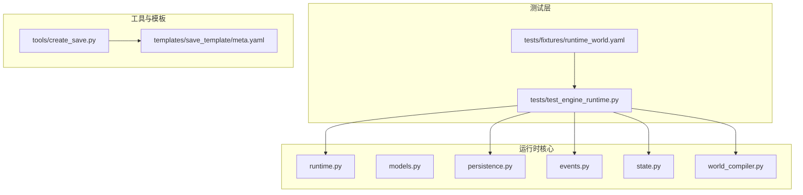
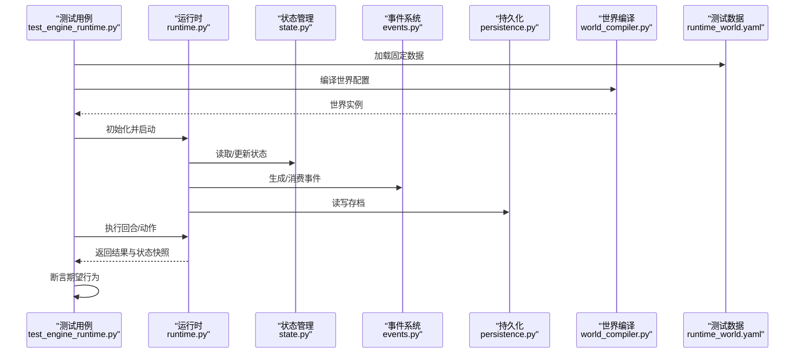
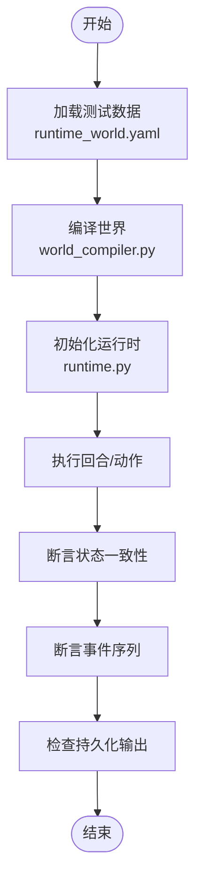
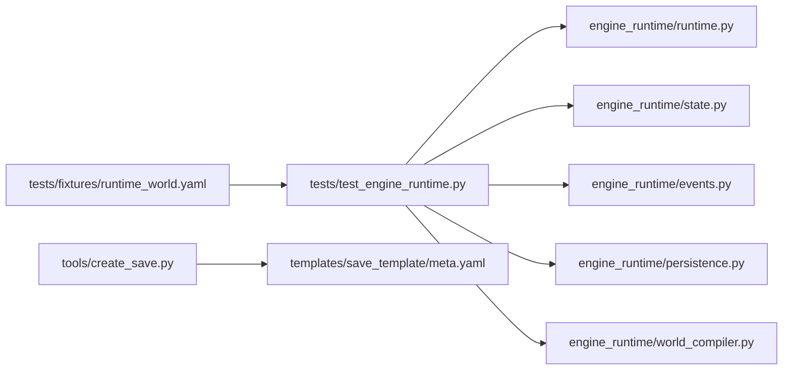

# 测试指南

<cite>
**本文引用的文件**   
- [tests/test_engine_runtime.py](file://tests/test_engine_runtime.py)
- [tests/fixtures/runtime_world.yaml](file://tests/fixtures/runtime_world.yaml)
- [engine_runtime/runtime.py](file://engine_runtime/runtime.py)
- [engine_runtime/models.py](file://engine_runtime/models.py)
- [engine_runtime/persistence.py](file://engine_runtime/persistence.py)
- [engine_runtime/events.py](file://engine_runtime/events.py)
- [engine_runtime/state.py](file://engine_runtime/state.py)
- [engine_runtime/world_compiler.py](file://engine_runtime/world_compiler.py)
- [tools/create_save.py](file://tools/create_save.py)
- [templates/save_template/meta.yaml](file://templates/save_template/meta.yaml)
</cite>

## 目录
1. [简介](#简介)
2. [项目结构](#项目结构)
3. [核心组件](#核心组件)
4. [架构总览](#架构总览)
5. [详细组件分析](#详细组件分析)
6. [依赖分析](#依赖分析)
7. [性能考虑](#性能考虑)
8. [故障排查指南](#故障排查指南)
9. [结论](#结论)
10. [附录](#附录)

## 简介
本指南面向开发与测试人员，系统化阐述项目的测试策略、框架选择与用例编写规范。内容覆盖单元测试、集成测试与端到端测试的实施方法，包含测试数据准备、模拟对象使用、断言最佳实践、覆盖率要求、持续集成配置、自动化测试流程、性能测试方法与调试技巧等。目标是帮助团队以稳定、可维护的方式保障引擎运行时（engine_runtime）的质量与演进安全。

## 项目结构
仓库采用“功能模块 + 测试”的清晰分层：
- engine_runtime：核心运行时逻辑，包括状态管理、事件系统、持久化、世界编译等。
- tests：测试代码与测试数据（fixtures）。
- tools：辅助工具（如创建存档、回放等），可用于端到端验证。
- templates：存档模板，用于构造一致的测试/演示数据。

**图表来源** 
- [tests/test_engine_runtime.py](file://tests/test_engine_runtime.py)
- [tests/fixtures/runtime_world.yaml](file://tests/fixtures/runtime_world.yaml)
- [engine_runtime/runtime.py](file://engine_runtime/runtime.py)
- [engine_runtime/models.py](file://engine_runtime/models.py)
- [engine_runtime/persistence.py](file://engine_runtime/persistence.py)
- [engine_runtime/events.py](file://engine_runtime/events.py)
- [engine_runtime/state.py](file://engine_runtime/state.py)
- [engine_runtime/world_compiler.py](file://engine_runtime/world_compiler.py)
- [tools/create_save.py](file://tools/create_save.py)
- [templates/save_template/meta.yaml](file://templates/save_template/meta.yaml)

**章节来源**
- [tests/test_engine_runtime.py](file://tests/test_engine_runtime.py)
- [tests/fixtures/runtime_world.yaml](file://tests/fixtures/runtime_world.yaml)
- [engine_runtime/runtime.py](file://engine_runtime/runtime.py)
- [engine_runtime/models.py](file://engine_runtime/models.py)
- [engine_runtime/persistence.py](file://engine_runtime/persistence.py)
- [engine_runtime/events.py](file://engine_runtime/events.py)
- [engine_runtime/state.py](file://engine_runtime/state.py)
- [engine_runtime/world_compiler.py](file://engine_runtime/world_compiler.py)
- [tools/create_save.py](file://tools/create_save.py)
- [templates/save_template/meta.yaml](file://templates/save_template/meta.yaml)

## 核心组件
- 运行时入口与编排：负责生命周期管理、回合推进、事件调度与状态同步。
- 模型与数据结构：定义玩家、阵营、关系、库存、事件等核心实体。
- 事件系统：基于事件溯源的思想，记录并回放关键变化。
- 状态管理：维护当前世界状态快照与变更历史。
- 持久化：读写存档（YAML/Markdown），保证可恢复性与可移植性。
- 世界编译：将模板与配置编译为可运行的世界实例。

这些组件共同构成引擎的核心，测试应围绕其职责边界进行隔离与组合验证。

**章节来源**
- [engine_runtime/runtime.py](file://engine_runtime/runtime.py)
- [engine_runtime/models.py](file://engine_runtime/models.py)
- [engine_runtime/events.py](file://engine_runtime/events.py)
- [engine_runtime/state.py](file://engine_runtime/state.py)
- [engine_runtime/persistence.py](file://engine_runtime/persistence.py)
- [engine_runtime/world_compiler.py](file://engine_runtime/world_compiler.py)

## 架构总览
下图展示测试如何与运行时各层交互，以及数据在测试中的流向。

**图表来源** 
- [tests/test_engine_runtime.py](file://tests/test_engine_runtime.py)
- [tests/fixtures/runtime_world.yaml](file://tests/fixtures/runtime_world.yaml)
- [engine_runtime/runtime.py](file://engine_runtime/runtime.py)
- [engine_runtime/state.py](file://engine_runtime/state.py)
- [engine_runtime/events.py](file://engine_runtime/events.py)
- [engine_runtime/persistence.py](file://engine_runtime/persistence.py)
- [engine_runtime/world_compiler.py](file://engine_runtime/world_compiler.py)

## 详细组件分析

### 测试框架与运行方式
- 建议采用 Python 标准库 unittest 或 pytest 作为测试框架。若仓库未显式指定，优先保持与现有用例一致的风格；如需迁移至 pytest，可利用 fixtures 与参数化能力提升可读性与复用性。
- 测试组织：
  - 单元测试：针对 models、events、state、persistence 等纯函数或小范围逻辑。
  - 集成测试：围绕 runtime 与 world_compiler 的组合，验证回合推进、事件流与状态一致性。
  - 端到端测试：通过 tools/create_save.py 与模板生成完整存档，校验导入导出与回放流程。

**章节来源**
- [tests/test_engine_runtime.py](file://tests/test_engine_runtime.py)
- [tests/fixtures/runtime_world.yaml](file://tests/fixtures/runtime_world.yaml)
- [tools/create_save.py](file://tools/create_save.py)
- [templates/save_template/meta.yaml](file://templates/save_template/meta.yaml)

### 单元测试：模型与事件
- 目标：确保数据模型字段约束、事件序列化/反序列化、状态转换规则正确。
- 要点：
  - 对 models 的构造与校验路径进行覆盖，包括边界值与非法输入。
  - 对 events 的编码/解码进行双向校验，确保幂等与顺序一致性。
  - 对 state 的增量更新与快照生成进行断言，避免状态漂移。
- 推荐断言：
  - 相等性断言：比较结构化数据（字典/列表/命名元组）。
  - 异常断言：捕获预期异常类型与消息片段。
  - 计数断言：事件数量、状态字段变更次数。

**章节来源**
- [engine_runtime/models.py](file://engine_runtime/models.py)
- [engine_runtime/events.py](file://engine_runtime/events.py)
- [engine_runtime/state.py](file://engine_runtime/state.py)

### 集成测试：运行时与世界编译
- 目标：验证从世界配置到运行时行为的端到端一致性。
- 要点：
  - 使用 fixtures 提供最小可复现的世界配置。
  - 调用 world_compiler 编译世界，再驱动 runtime 执行若干回合。
  - 断言关键状态（玩家属性、关系、库存）与事件日志的一致性。
- 推荐做法：
  - 使用夹具工厂生成不同场景的配置（例如冲突、外交、经济事件）。
  - 对持久化读写进行临时目录隔离，避免污染真实存档。

**图表来源** 
- [tests/fixtures/runtime_world.yaml](file://tests/fixtures/runtime_world.yaml)
- [engine_runtime/world_compiler.py](file://engine_runtime/world_compiler.py)
- [engine_runtime/runtime.py](file://engine_runtime/runtime.py)

**章节来源**
- [tests/test_engine_runtime.py](file://tests/test_engine_runtime.py)
- [tests/fixtures/runtime_world.yaml](file://tests/fixtures/runtime_world.yaml)
- [engine_runtime/world_compiler.py](file://engine_runtime/world_compiler.py)
- [engine_runtime/runtime.py](file://engine_runtime/runtime.py)

### 端到端测试：存档创建与回放
- 目标：验证从模板生成存档、导入引擎、回放回合、导出存档的全链路。
- 要点：
  - 使用 tools/create_save.py 基于 templates 生成存档。
  - 将生成的存档导入运行时，执行若干回合后再次导出。
  - 对比前后存档的关键字段（meta、事件队列、状态快照）以确保一致性。
- 注意事项：
  - 时间戳与随机种子需固定，保证回放确定性。
  - 对 I/O 操作进行隔离（临时目录），失败时清理资源。

**章节来源**
- [tools/create_save.py](file://tools/create_save.py)
- [templates/save_template/meta.yaml](file://templates/save_template/meta.yaml)

### 测试数据准备与固定夹具
- 原则：
  - 最小可用：仅包含必要字段，减少噪声。
  - 可重复：避免外部依赖与随机性。
  - 可组合：通过夹具工厂拼装复杂场景。
- 建议：
  - 将通用夹具放在 fixtures 目录，按主题分文件（如 player.yaml、factions.yaml）。
  - 使用 YAML/JSON 描述静态数据，便于审查与维护。

**章节来源**
- [tests/fixtures/runtime_world.yaml](file://tests/fixtures/runtime_world.yaml)

### 模拟对象与隔离策略
- 何时使用：
  - 外部服务（网络、数据库）、文件系统、随机数生成器。
- 怎么做：
  - 使用 unittest.mock.patch 或 pytest-mock 替换依赖。
  - 对持久化层使用内存实现或临时目录，避免真实磁盘写入。
  - 对事件总线注入监听器，收集并断言事件流。

**章节来源**
- [engine_runtime/persistence.py](file://engine_runtime/persistence.py)
- [engine_runtime/events.py](file://engine_runtime/events.py)

### 断言最佳实践
- 明确断言粒度：
  - 状态字段级断言（如玩家生命值、关系强度）。
  - 事件序列级断言（顺序、数量、关键字段）。
  - 持久化产物级断言（YAML/Markdown 结构完整性）。
- 断言风格：
  - 优先使用结构化断言（比较字典/列表），而非字符串匹配。
  - 对异常路径使用“异常类型+消息片段”断言。
- 可观测性：
  - 在失败时打印关键上下文（输入配置、回合编号、事件摘要）。

**章节来源**
- [tests/test_engine_runtime.py](file://tests/test_engine_runtime.py)

### 覆盖率要求与报告
- 建议阈值：
  - 行覆盖率 ≥ 80%，分支覆盖率 ≥ 70%。
  - 关键路径（runtime、persistence、events）≥ 90%。
- 工具与配置：
  - 使用 coverage 或 pytest-cov 生成报告。
  - 排除第三方与样板代码（如 __init__.py、配置文件）。
- 报告位置：
  - 本地开发：HTML 报告便于浏览。
  - CI：上传至制品库或内网平台归档。

**章节来源**
- [tests/test_engine_runtime.py](file://tests/test_engine_runtime.py)

### 持续集成与自动化测试流程
- 触发条件：
  - 每次推送与合并请求均运行全量测试。
  - 对特定模块变更可启用增量测试（按文件影响范围）。
- 步骤建议：
  - 安装依赖 → 运行单元测试 → 运行集成测试 → 生成覆盖率报告 → 归档产物。
- 缓存策略：
  - 缓存依赖包与构建产物，缩短流水线时间。
- 质量门禁：
  - 覆盖率不达标、测试失败、静态检查失败均阻断合并。

[本节为概念性说明，无需具体文件引用]

### 性能测试方法
- 基准测试：
  - 对热点路径（事件处理、状态同步、持久化读写）建立基准用例。
  - 使用 timeit 或专用基准框架，固定随机种子与环境。
- 负载测试：
  - 模拟大量回合与事件并发，观察内存与 CPU 占用。
- 回归基线：
  - 保存性能基线，随版本演进对比趋势。

[本节为概念性说明，无需具体文件引用]

### 测试调试技巧与常见问题
- 常见错误：
  - 数据不一致：检查夹具版本与模型变更是否同步。
  - 事件顺序问题：确认事件生成与消费的时序约定。
  - 持久化竞争：确保测试间隔离，避免共享临时目录。
- 调试手段：
  - 开启详细日志，输出关键状态快照。
  - 使用交互式调试器定位失败点。
  - 缩小用例范围，逐步定位根因。

**章节来源**
- [tests/test_engine_runtime.py](file://tests/test_engine_runtime.py)

## 依赖分析
测试与运行时组件之间的依赖关系如下：

**图表来源** 
- [tests/test_engine_runtime.py](file://tests/test_engine_runtime.py)
- [tests/fixtures/runtime_world.yaml](file://tests/fixtures/runtime_world.yaml)
- [engine_runtime/runtime.py](file://engine_runtime/runtime.py)
- [engine_runtime/state.py](file://engine_runtime/state.py)
- [engine_runtime/events.py](file://engine_runtime/events.py)
- [engine_runtime/persistence.py](file://engine_runtime/persistence.py)
- [engine_runtime/world_compiler.py](file://engine_runtime/world_compiler.py)
- [tools/create_save.py](file://tools/create_save.py)
- [templates/save_template/meta.yaml](file://templates/save_template/meta.yaml)

**章节来源**
- [tests/test_engine_runtime.py](file://tests/test_engine_runtime.py)
- [tests/fixtures/runtime_world.yaml](file://tests/fixtures/runtime_world.yaml)
- [engine_runtime/runtime.py](file://engine_runtime/runtime.py)
- [engine_runtime/state.py](file://engine_runtime/state.py)
- [engine_runtime/events.py](file://engine_runtime/events.py)
- [engine_runtime/persistence.py](file://engine_runtime/persistence.py)
- [engine_runtime/world_compiler.py](file://engine_runtime/world_compiler.py)
- [tools/create_save.py](file://tools/create_save.py)
- [templates/save_template/meta.yaml](file://templates/save_template/meta.yaml)

## 性能考虑
- 事件批处理：批量生成与消费事件，降低开销。
- 状态快照策略：按需生成快照，避免频繁拷贝大对象。
- 持久化优化：合并写操作，使用缓冲与异步落盘（在允许的情况下）。
- 测试性能：使用内存存储替代磁盘 I/O，减少外部依赖抖动。

[本节为概念性说明，无需具体文件引用]

## 故障排查指南
- 快速定位：
  - 查看失败用例的日志与断言信息。
  - 复现实例的最小化夹具，逐步增加复杂度。
- 常见问题：
  - 夹具过期：核对模型字段与夹具结构。
  - 事件丢失：检查事件总线订阅与分发逻辑。
  - 持久化损坏：校验 YAML/Markdown 结构与编码。
- 修复建议：
  - 增加更细粒度的断言与日志。
  - 引入契约测试，确保接口稳定性。
  - 完善回滚机制，保证测试环境干净。

**章节来源**
- [tests/test_engine_runtime.py](file://tests/test_engine_runtime.py)

## 结论
通过分层测试策略（单元、集成、端到端）、严格的测试数据管理与模拟隔离、明确的断言与覆盖率要求，以及完善的 CI 与性能基线，可有效保障引擎运行时的质量与可演进性。建议在迭代中持续完善夹具体系、扩展性能基准，并将测试可见性纳入日常开发流程。

[本节为总结性内容，无需具体文件引用]

## 附录
- 术语表：
  - 夹具（Fixture）：用于提供稳定、可复用的测试数据。
  - 模拟（Mock）：替换真实依赖，隔离外部影响。
  - 覆盖率：衡量测试对代码的覆盖程度。
- 参考清单：
  - 测试命名规范：test_<模块>_<场景>_<期望>
  - 夹具命名：fixture_<用途>
  - 断言风格：结构化比较优先，异常断言明确类型与消息片段

[本节为补充性内容，无需具体文件引用]