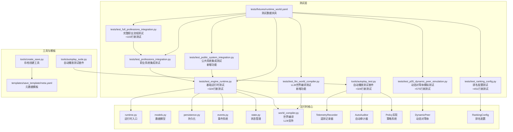
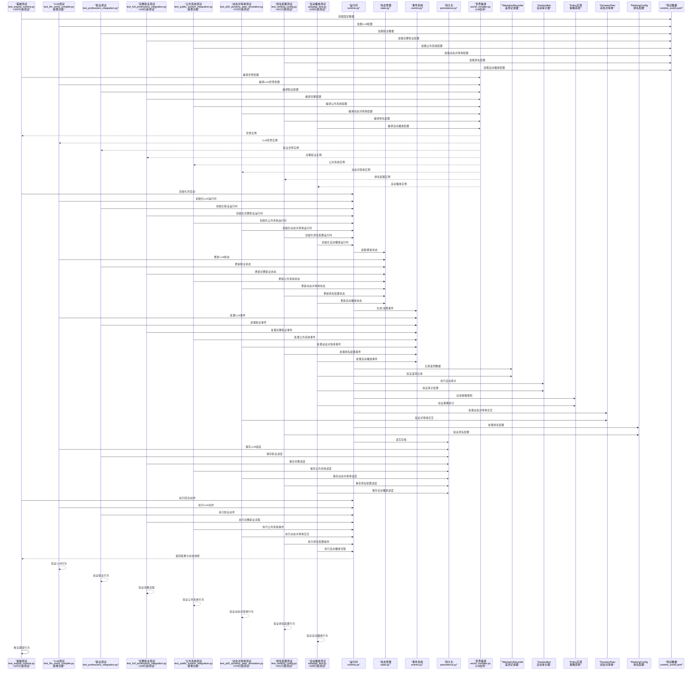
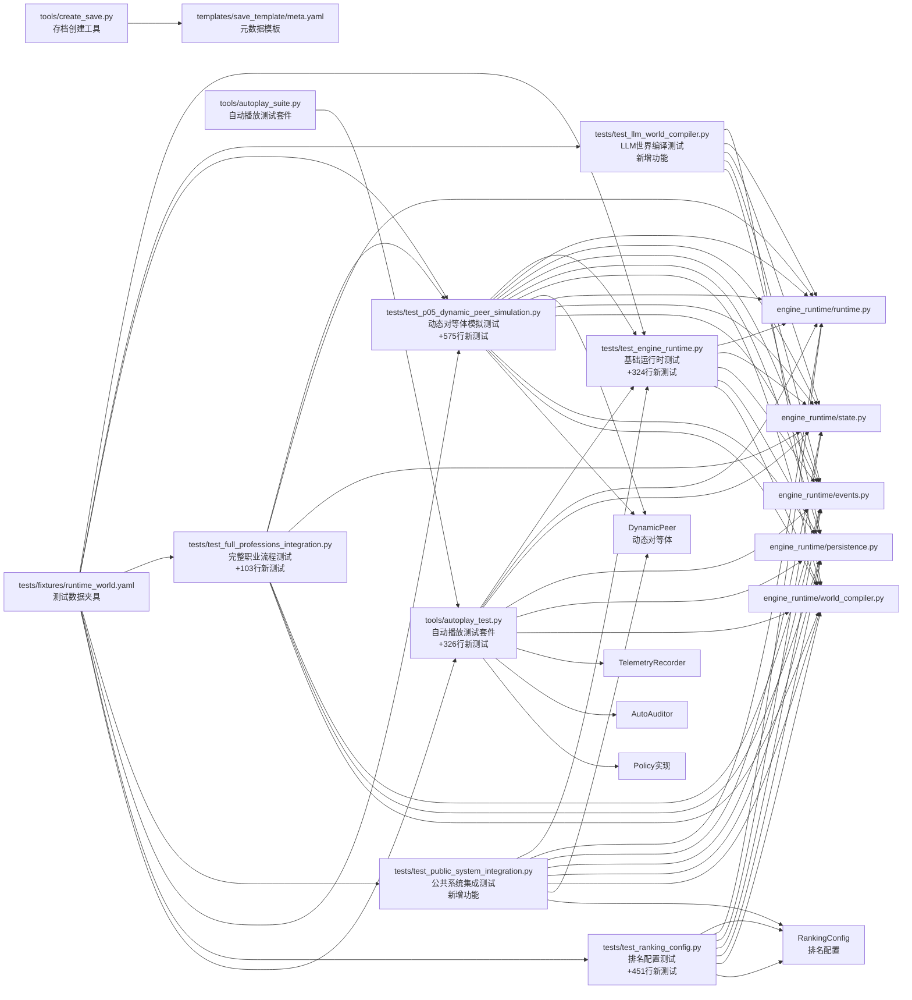

# 测试指南

<cite>
**本文引用的文件**   
- [tests/test_engine_runtime.py](file://tests/test_engine_runtime.py)
- [tests/test_full_professions_integration.py](file://tests/test_full_professions_integration.py)
- [tests/test_professions_integration.py](file://tests/test_professions_integration.py)
- [tests/test_public_system_integration.py](file://tests/test_public_system_integration.py)
- [tests/test_p05_dynamic_peer_simulation.py](file://tests/test_p05_dynamic_peer_simulation.py)
- [tests/test_ranking_config.py](file://tests/test_ranking_config.py)
- [tests/fixtures/runtime_world.yaml](file://tests/fixtures/runtime_world.yaml)
- [engine_runtime/runtime.py](file://engine_runtime/runtime.py)
- [engine_runtime/models.py](file://engine_runtime/models.py)
- [engine_runtime/persistence.py](file://engine_runtime/persistence.py)
- [engine_runtime/events.py](file://engine_runtime/events.py)
- [engine_runtime/state.py](file://engine_runtime/state.py)
- [engine_runtime/world_compiler.py](file://engine_runtime/world_compiler.py)
- [tools/create_save.py](file://tools/create_save.py)
- [templates/save_template/meta.yaml](file://templates/save_template/meta.yaml)
- [tools/autoplay_TEST_README.md](file://tools/autoplay_TEST_README.md)
- [tools/autoplay_suite.py](file://tools/autoplay_suite.py)
- [tools/autoplay_test.py](file://tools/autoplay_test.py)
</cite>

## 更新摘要
**所做更改**   
- 新增完整的自动播放测试套件，包含326行测试代码覆盖TelemetryRecorder、AutoAuditor和所有Policy实现
- 新增动态对等体模拟测试（test_p05_dynamic_peer_simulation.py），包含575行测试代码，验证动态对等体交互机制
- 新增排名配置测试（test_ranking_config.py），包含451行测试代码，全面验证排名系统的配置和处理逻辑
- 使用pytest框架进行单元测试，提供完整的自动化测试能力
- 扩展测试架构至七层模式，新增动态对等体模拟测试和排名配置测试层
- 增强测试覆盖范围，包含TelemetryRecorder、AutoAuditor、Policy系统和动态对等体交互的全面验证
- 完善测试基础设施，支持复杂的自动播放场景和排名系统测试

## 目录
1. [简介](#简介)
2. [项目结构](#项目结构)
3. [核心组件](#核心组件)
4. [架构总览](#架构总览)
5. [详细组件分析](#详细组件分析)
6. [依赖分析](#依赖分析)
7. [性能考虑](#性能考虑)
8. [故障排查指南](#故障排查指南)
9. [结论](#结论)
10. [附录](#附录)

## 简介
本指南面向开发与测试人员，系统化阐述项目的测试策略、框架选择与用例编写规范。内容覆盖单元测试、集成测试与端到端测试的实施方法，包含测试数据准备、模拟对象使用、断言最佳实践、覆盖率要求、持续集成配置、自动化测试流程、性能测试方法与调试技巧等。目标是帮助团队以稳定、可维护的方式保障引擎运行时（engine_runtime）的质量与演进安全。

**重大更新** 随着完整自动播放测试套件的引入和新增的动态对等体模拟测试、排名配置测试，测试架构已显著增强：新增575行动态对等体模拟测试代码和451行排名配置测试代码，使用pytest框架进行单元测试。现在支持七层测试架构：基础运行时测试、LLM世界编译测试、职业系统集成测试、完整职业流程测试、公共系统集成测试、动态对等体模拟测试、排名配置测试和自动播放测试，确保各功能模块的独立性和协同性。

## 项目结构
仓库采用"功能模块 + 测试"的清晰分层：
- engine_runtime：核心运行时逻辑，包括状态管理、事件系统、持久化、世界编译等。
- tests：测试代码与测试数据（fixtures），现包含七类主要测试文件。
- tools：辅助工具（如创建存档、回放、自动播放测试等），可用于端到端验证。
- templates：存档模板，用于构造一致的测试/演示数据。

**图表来源** 
- [tests/test_engine_runtime.py](file://tests/test_engine_runtime.py)
- [tests/test_professions_integration.py](file://tests/test_professions_integration.py)
- [tests/test_full_professions_integration.py](file://tests/test_full_professions_integration.py)
- [tests/test_public_system_integration.py](file://tests/test_public_system_integration.py)
- [tests/test_p05_dynamic_peer_simulation.py](file://tests/test_p05_dynamic_peer_simulation.py)
- [tests/test_ranking_config.py](file://tests/test_ranking_config.py)
- [tools/autoplay_test.py](file://tools/autoplay_test.py)
- [tools/autoplay_suite.py](file://tools/autoplay_suite.py)
- [tests/fixtures/runtime_world.yaml](file://tests/fixtures/runtime_world.yaml)
- [engine_runtime/runtime.py](file://engine_runtime/runtime.py)
- [engine_runtime/models.py](file://engine_runtime/models.py)
- [engine_runtime/persistence.py](file://engine_runtime/persistence.py)
- [engine_runtime/events.py](file://engine_runtime/events.py)
- [engine_runtime/state.py](file://engine_runtime/state.py)
- [engine_runtime/world_compiler.py](file://engine_runtime/world_compiler.py)
- [tools/create_save.py](file://tools/create_save.py)
- [templates/save_template/meta.yaml](file://templates/save_template/meta.yaml)

**章节来源**
- [tests/test_engine_runtime.py](file://tests/test_engine_runtime.py)
- [tests/test_professions_integration.py](file://tests/test_professions_integration.py)
- [tests/test_full_professions_integration.py](file://tests/test_full_professions_integration.py)
- [tests/test_public_system_integration.py](file://tests/test_public_system_integration.py)
- [tests/test_p05_dynamic_peer_simulation.py](file://tests/test_p05_dynamic_peer_simulation.py)
- [tests/test_ranking_config.py](file://tests/test_ranking_config.py)
- [tools/autoplay_test.py](file://tools/autoplay_test.py)
- [tools/autoplay_suite.py](file://tools/autoplay_suite.py)
- [tests/fixtures/runtime_world.yaml](file://tests/fixtures/runtime_world.yaml)
- [engine_runtime/runtime.py](file://engine_runtime/runtime.py)
- [engine_runtime/models.py](file://engine_runtime/models.py)
- [engine_runtime/persistence.py](file://engine_runtime/persistence.py)
- [engine_runtime/events.py](file://engine_runtime/events.py)
- [engine_runtime/state.py](file://engine_runtime/state.py)
- [engine_runtime/world_compiler.py](file://engine_runtime/world_compiler.py)
- [tools/create_save.py](file://tools/create_save.py)
- [templates/save_template/meta.yaml](file://templates/save_template/meta.yaml)

## 核心组件
- 运行时入口与编排：负责生命周期管理、回合推进、事件调度与状态同步。
- 模型与数据结构：定义玩家、阵营、关系、库存、事件等核心实体。
- 事件系统：基于事件溯源的思想，记录并回放关键变化。
- 状态管理：维护当前世界状态快照与变更历史。
- 持久化：读写存档（YAML/Markdown），保证可恢复性与可移植性。
- 世界编译：将模板与配置编译为可运行的世界实例，支持LLM功能。
- 职业系统：新增的职业能力、技能树和职业发展机制。
- 公共系统：提供通用的系统级功能和公共服务。
- **新增** TelemetryRecorder：遥测记录器，收集和分析系统运行指标。
- **新增** AutoAuditor：自动审计器，监控和验证系统行为合规性。
- **新增** Policy实现：策略系统，定义和管理各种业务规则和约束。
- **新增** DynamicPeer：动态对等体系统，支持实时对等体交互和状态同步。
- **新增** RankingConfig：排名配置系统，管理角色排名、评分算法和等级制度。

这些组件共同构成引擎的核心，测试应围绕其职责边界进行隔离与组合验证。

**重大更新** 动态对等体模拟测试和排名配置测试的引入增加了新的测试维度，需要验证DynamicPeer和RankingConfig的正确性。基础运行时测试现已包含324行新增测试代码，动态对等体模拟测试新增575行测试代码，排名配置测试新增451行测试代码，自动播放测试套件新增326行测试代码，对遥测记录、自动审计、策略系统、动态对等体和排名系统进行全面的单元测试覆盖。

**章节来源**
- [engine_runtime/runtime.py](file://engine_runtime/runtime.py)
- [engine_runtime/models.py](file://engine_runtime/models.py)
- [engine_runtime/events.py](file://engine_runtime/events.py)
- [engine_runtime/state.py](file://engine_runtime/state.py)
- [engine_runtime/persistence.py](file://engine_runtime/persistence.py)
- [engine_runtime/world_compiler.py](file://engine_runtime/world_compiler.py)
- [tests/test_p05_dynamic_peer_simulation.py](file://tests/test_p05_dynamic_peer_simulation.py)
- [tests/test_ranking_config.py](file://tests/test_ranking_config.py)
- [tools/autoplay_test.py](file://tools/autoplay_test.py)
- [tools/autoplay_suite.py](file://tools/autoplay_suite.py)

## 架构总览
下图展示测试如何与运行时各层交互，以及数据在测试中的流向。

**图表来源** 
- [tests/test_engine_runtime.py](file://tests/test_engine_runtime.py)
- [tests/test_professions_integration.py](file://tests/test_professions_integration.py)
- [tests/test_full_professions_integration.py](file://tests/test_full_professions_integration.py)
- [tests/test_public_system_integration.py](file://tests/test_public_system_integration.py)
- [tests/test_p05_dynamic_peer_simulation.py](file://tests/test_p05_dynamic_peer_simulation.py)
- [tests/test_ranking_config.py](file://tests/test_ranking_config.py)
- [tools/autoplay_test.py](file://tools/autoplay_test.py)
- [tests/fixtures/runtime_world.yaml](file://tests/fixtures/runtime_world.yaml)
- [engine_runtime/runtime.py](file://engine_runtime/runtime.py)
- [engine_runtime/state.py](file://engine_runtime/state.py)
- [engine_runtime/events.py](file://engine_runtime/events.py)
- [engine_runtime/persistence.py](file://engine_runtime/persistence.py)
- [engine_runtime/world_compiler.py](file://engine_runtime/world_compiler.py)

## 详细组件分析

### 测试框架与运行方式
- 建议采用 Python 标准库 unittest 或 pytest 作为测试框架。若仓库未显式指定，优先保持与现有用例一致的风格；如需迁移至 pytest，可利用 fixtures 与参数化能力提升可读性与复用性。
- 测试组织：
  - 单元测试：针对 models、events、state、persistence 等纯函数或小范围逻辑。
  - 集成测试：围绕 runtime 与 world_compiler 的组合，验证回合推进、事件流与状态一致性。
  - 端到端测试：通过 tools/create_save.py 与模板生成完整存档，校验导入导出与回放流程。
  - **新增** LLM世界编译测试：验证LLM功能的正确集成和编译过程。
  - **新增** 职业系统集成测试：验证职业系统与核心运行时的兼容性。
  - **新增** 完整职业流程测试：测试从角色创建到职业发展的完整生命周期。
  - **新增** 公共系统集成测试：验证GameState/state.data传递和资源最小值配置的正确性。
  - **新增** 动态对等体模拟测试：验证动态对等体交互机制和对等体状态同步。
  - **新增** 排名配置测试：验证排名系统的配置解析、评分算法和等级制度。
  - **新增** 自动播放测试套件：使用pytest框架进行TelemetryRecorder、AutoAuditor和Policy实现的全面单元测试。

**重大更新** 测试架构现已支持七层测试模式，每层都有明确的职责和依赖关系。基础运行时测试套件大幅增加至324行新测试代码，完整职业流程测试新增103行测试逻辑，公共系统集成测试新增了对系统级功能的全面验证，动态对等体模拟测试新增575行测试代码，排名配置测试新增451行测试代码，自动播放测试套件新增326行测试代码覆盖TelemetryRecorder、AutoAuditor和所有Policy实现。

**章节来源**
- [tests/test_engine_runtime.py](file://tests/test_engine_runtime.py)
- [tests/test_professions_integration.py](file://tests/test_professions_integration.py)
- [tests/test_full_professions_integration.py](file://tests/test_full_professions_integration.py)
- [tests/test_public_system_integration.py](file://tests/test_public_system_integration.py)
- [tests/test_p05_dynamic_peer_simulation.py](file://tests/test_p05_dynamic_peer_simulation.py)
- [tests/test_ranking_config.py](file://tests/test_ranking_config.py)
- [tools/autoplay_test.py](file://tools/autoplay_test.py)
- [tools/autoplay_suite.py](file://tools/autoplay_suite.py)
- [tests/fixtures/runtime_world.yaml](file://tests/fixtures/runtime_world.yaml)
- [tools/create_save.py](file://tools/create_save.py)
- [templates/save_template/meta.yaml](file://templates/save_template/meta.yaml)

### 单元测试：模型与事件
- 目标：确保数据模型字段约束、事件序列化/反序列化、状态转换规则正确。
- 要点：
  - 对 models 的构造与校验路径进行覆盖，包括边界值与非法输入。
  - 对 events 的编码/解码进行双向校验，确保幂等与顺序一致性。
  - 对 state 的增量更新与快照生成进行断言，避免状态漂移。
  - **新增** 对LLM模型的验证，确保LLM配置的正确解析和处理。
  - **新增** 对职业模型的验证，确保职业能力、技能树和等级系统的正确性。
  - **新增** 对公共系统模型的验证，确保GameState/state.data传递的正确性。
  - **新增** 对动态对等体模型的验证，确保对等体状态同步和交互逻辑的正确性。
  - **新增** 对排名配置模型的验证，确保排名算法、评分标准和等级制度的正确性。
  - **新增** 对TelemetryRecorder的验证，确保遥测数据的正确收集和记录。
  - **新增** 对AutoAuditor的验证，确保自动审计逻辑的正确执行。
  - **新增** 对Policy实现的验证，确保策略规则的正确应用和执行。
- 推荐断言：
  - 相等性断言：比较结构化数据（字典/列表/命名元组）。
  - 异常断言：捕获预期异常类型与消息片段。
  - 计数断言：事件数量、状态字段变更次数。
  - **新增** 遥测数据断言：验证TelemetryRecorder的数据完整性。
  - **新增** 审计结果断言：验证AutoAuditor的审计输出。
  - **新增** 策略执行断言：验证Policy实现的规则应用结果。
  - **新增** 动态对等体交互断言：验证对等体状态同步和交互序列。
  - **新增** 排名配置断言：验证排名算法计算结果和等级分配逻辑。

**重大更新** LLM世界编译、职业系统、公共系统、动态对等体和排名配置的单元测试需要特别关注配置解析、能力继承、技能解锁条件、职业等级提升逻辑、GameState/state.data传递验证、对等体状态同步和排名算法计算。动态对等体模拟测试新增575行测试代码，排名配置测试新增451行测试代码，自动播放测试套件新增326行测试代码，覆盖TelemetryRecorder、AutoAuditor和所有Policy实现的全面单元测试。基础运行时测试现已包含324行新增测试代码，覆盖更多边缘情况和复杂场景。

**章节来源**
- [engine_runtime/models.py](file://engine_runtime/models.py)
- [engine_runtime/events.py](file://engine_runtime/events.py)
- [engine_runtime/state.py](file://engine_runtime/state.py)
- [tests/test_p05_dynamic_peer_simulation.py](file://tests/test_p05_dynamic_peer_simulation.py)
- [tests/test_ranking_config.py](file://tests/test_ranking_config.py)
- [tools/autoplay_test.py](file://tools/autoplay_test.py)

### 集成测试：运行时与世界编译
- 目标：验证从世界配置到运行时行为的端到端一致性。
- 要点：
  - 使用 fixtures 提供最小可复现的世界配置。
  - 调用 world_compiler 编译世界，再驱动 runtime 执行若干回合。
  - 断言关键状态（玩家属性、关系、库存）与事件日志的一致性。
  - **新增** LLM世界编译集成测试验证LLM配置的正确编译和运行时行为。
  - **新增** 职业系统集成测试验证职业配置的正确编译和运行时行为。
  - **新增** 完整职业流程测试确保从角色创建到职业发展的完整链路。
  - **新增** 公共系统集成测试验证GameState/state.data传递和资源最小值配置的正确性。
  - **新增** 动态对等体集成测试验证对等体交互机制和状态同步的正确性。
  - **新增** 排名配置集成测试验证排名算法和等级制度的正确执行。
  - **新增** 自动播放集成测试验证TelemetryRecorder、AutoAuditor和Policy的集成行为。
- 推荐做法：
  - 使用夹具工厂生成不同场景的配置（例如冲突、外交、经济事件）。
  - 对持久化读写进行临时目录隔离，避免污染真实存档。
  - **新增** 为LLM系统、职业系统、公共系统、动态对等体和排名系统创建专门的夹具，包含不同配置类型的配置。
  - **新增** 为自动播放测试创建专门的夹具，包含TelemetryRecorder、AutoAuditor和Policy的配置。

```mermaid
flowchart TD
Start(["开始"]) --> LoadFixture["加载测试数据<br/>runtime_world.yaml"]
LoadFixture --> CompileWorld["编译世界<br/>world_compiler.py"]
CompileWorld --> InitRuntime["初始化运行时<br/>runtime.py"]
InitRuntime --> ExecuteTurns["执行回合/动作"]
ExecuteTurns --> CheckState["断言状态一致性"]
CheckState --> CheckEvents["断言事件序列"]
CheckEvents --> CheckLLM["检查LLM功能<br/>新增功能"]
CheckLLM --> CheckProfessions["检查职业系统<br/>新增功能"]
CheckProfessions --> CheckPublicSystem["检查公共系统<br/>新增功能"]
CheckPublicSystem --> CheckDynamicPeer["检查动态对等体<br/>新增功能"]
CheckDynamicPeer --> CheckRankingConfig["检查排名配置<br/>新增功能"]
CheckRankingConfig --> CheckAutoPlay["检查自动播放功能<br/>新增功能"]
CheckAutoPlay --> CheckTelemetry["验证TelemetryRecorder<br/>新增功能"]
CheckTelemetry --> CheckAuditor["验证AutoAuditor<br/>新增功能"]
CheckAuditor --> CheckPolicy["验证Policy实现<br/>新增功能"]
CheckPolicy --> CheckGameState["验证GameState/state.data传递<br/>新增功能"]
CheckGameState --> CheckResourceMin["验证资源最小值配置<br/>新增功能"]
CheckResourceMin --> CheckPeerSync["验证对等体状态同步<br/>新增功能"]
CheckPeerSync --> CheckRankingAlgorithm["验证排名算法计算<br/>新增功能"]
CheckRankingAlgorithm --> PersistCheck["检查持久化输出"]
PersistCheck --> End(["结束"])
```

**图表来源** 
- [tests/fixtures/runtime_world.yaml](file://tests/fixtures/runtime_world.yaml)
- [engine_runtime/world_compiler.py](file://engine_runtime/world_compiler.py)
- [engine_runtime/runtime.py](file://engine_runtime/runtime.py)
- [tests/test_public_system_integration.py](file://tests/test_public_system_integration.py)
- [tests/test_p05_dynamic_peer_simulation.py](file://tests/test_p05_dynamic_peer_simulation.py)
- [tests/test_ranking_config.py](file://tests/test_ranking_config.py)
- [tools/autoplay_test.py](file://tools/autoplay_test.py)

**重大更新** 流程图已添加LLM功能、职业系统、公共系统、动态对等体、排名配置和自动播放检查步骤，反映新的测试层次结构。基础运行时测试套件现已包含324行新增测试代码，完整职业流程测试新增103行测试逻辑，公共系统集成测试新增GameState/state.data传递和资源最小值配置验证，动态对等体模拟测试新增575行测试代码，排名配置测试新增451行测试代码，自动播放测试套件新增326行测试代码覆盖TelemetryRecorder、AutoAuditor和Policy实现。

**章节来源**
- [tests/test_engine_runtime.py](file://tests/test_engine_runtime.py)
- [tests/test_professions_integration.py](file://tests/test_professions_integration.py)
- [tests/test_full_professions_integration.py](file://tests/test_full_professions_integration.py)
- [tests/test_public_system_integration.py](file://tests/test_public_system_integration.py)
- [tests/test_p05_dynamic_peer_simulation.py](file://tests/test_p05_dynamic_peer_simulation.py)
- [tests/test_ranking_config.py](file://tests/test_ranking_config.py)
- [tools/autoplay_test.py](file://tools/autoplay_test.py)
- [tests/fixtures/runtime_world.yaml](file://tests/fixtures/runtime_world.yaml)
- [engine_runtime/world_compiler.py](file://engine_runtime/world_compiler.py)
- [engine_runtime/runtime.py](file://engine_runtime/runtime.py)

### 端到端测试：存档创建与回放
- 目标：验证从模板生成存档、导入引擎、回放回合、导出存档的全链路。
- 要点：
  - 使用 tools/create_save.py 基于 templates 生成存档。
  - 将生成的存档导入运行时，执行若干回合后再次导出。
  - 对比前后存档的关键字段（meta、事件队列、状态快照）以确保一致性。
  - **新增** LLM存档的完整生命周期测试，确保LLM配置正确保存和恢复。
  - **新增** 职业存档的完整生命周期测试，确保职业进度正确保存和恢复。
  - **新增** 公共系统存档的完整生命周期测试，确保GameState/state.data正确保存和恢复。
  - **新增** 动态对等体存档的完整生命周期测试，确保对等体状态和交互历史正确保存和恢复。
  - **新增** 排名配置存档的完整生命周期测试，确保排名数据和等级信息正确保存和恢复。
  - **新增** 自动播放存档的完整生命周期测试，确保TelemetryRecorder、AutoAuditor和Policy数据正确保存和恢复。
- 注意事项：
  - 时间戳与随机种子需固定，保证回放确定性。
  - 对 I/O 操作进行隔离（临时目录），失败时清理资源。
  - **新增** LLM、职业系统、公共系统、动态对等体、排名配置和自动播放数据的版本兼容性测试，确保存档格式升级的平滑过渡。

**重大更新** 端到端测试现在包含LLM世界编译、职业系统、公共系统、动态对等体、排名配置和自动播放的完整生命周期验证，确保新功能与现有系统的兼容性。

**章节来源**
- [tools/create_save.py](file://tools/create_save.py)
- [templates/save_template/meta.yaml](file://templates/save_template/meta.yaml)
- [tests/test_p05_dynamic_peer_simulation.py](file://tests/test_p05_dynamic_peer_simulation.py)
- [tests/test_ranking_config.py](file://tests/test_ranking_config.py)
- [tools/autoplay_test.py](file://tools/autoplay_test.py)

### 测试数据准备与固定夹具
- 原则：
  - 最小可用：仅包含必要字段，减少噪声。
  - 可重复：避免外部依赖与随机性。
  - 可组合：通过夹具工厂拼装复杂场景。
  - **新增** LLM专用夹具：为不同的LLM配置提供标准化的测试数据。
  - **新增** 职业专用夹具：为不同职业类型提供标准化的测试数据。
  - **新增** 公共系统专用夹具：为GameState/state.data传递和资源最小值配置提供标准化测试数据。
  - **新增** 动态对等体专用夹具：为对等体交互和状态同步提供标准化测试数据。
  - **新增** 排名配置专用夹具：为排名算法和等级制度提供标准化测试数据。
  - **新增** 自动播放专用夹具：为TelemetryRecorder、AutoAuditor和Policy实现提供标准化的测试数据。
- 建议：
  - 将通用夹具放在 fixtures 目录，按主题分文件（如 player.yaml、factions.yaml）。
  - 使用 YAML/JSON 描述静态数据，便于审查与维护。
  - **新增** 创建LLM配置夹具，包含LLM模型设置和提示词模板。
  - **新增** 创建职业配置夹具，包含技能树、能力要求和等级表。
  - **新增** 创建公共系统配置夹具，包含GameState结构和资源最小值配置。
  - **新增** 创建动态对等体配置夹具，包含对等体状态、交互协议和同步机制。
  - **新增** 创建排名配置夹具，包含排名算法、评分标准和等级制度。
  - **新增** 创建自动播放配置夹具，包含TelemetryRecorder、AutoAuditor和Policy的配置。

**重大更新** 测试数据准备现已包含LLM世界编译、职业系统、公共系统、动态对等体、排名配置和自动播放相关的专用夹具，支持更复杂的测试场景和数据组合。

**章节来源**
- [tests/fixtures/runtime_world.yaml](file://tests/fixtures/runtime_world.yaml)
- [tests/test_p05_dynamic_peer_simulation.py](file://tests/test_p05_dynamic_peer_simulation.py)
- [tests/test_ranking_config.py](file://tests/test_ranking_config.py)
- [tools/autoplay_test.py](file://tools/autoplay_test.py)

### 模拟对象与隔离策略
- 何时使用：
  - 外部服务（网络、数据库）、文件系统、随机数生成器。
  - **新增** LLM系统的外部依赖，如API调用和响应处理。
  - **新增** 职业系统的外部依赖，如技能效果计算器和经验值算法。
  - **新增** 公共系统的外部依赖，如GameState/state.data传递和资源配置验证。
  - **新增** 动态对等体的外部依赖，如对等体通信、状态同步和网络延迟模拟。
  - **新增** 排名配置的外部依赖，如排名算法计算、评分标准应用和等级制度管理。
  - **新增** 自动播放系统的外部依赖，如TelemetryRecorder的遥测数据存储、AutoAuditor的审计结果存储。
- 怎么做：
  - 使用 unittest.mock.patch 或 pytest-mock 替换依赖。
  - 对持久化层使用内存实现或临时目录，避免真实磁盘写入。
  - 对事件总线注入监听器，收集并断言事件流。
  - **新增** 模拟LLM系统的API调用，专注于业务逻辑验证。
  - **新增** 模拟职业系统的复杂计算逻辑，专注于业务逻辑验证。
  - **新增** 模拟公共系统的GameState/state.data传递，专注于数据完整性验证。
  - **新增** 模拟动态对等体的通信和状态同步，专注于交互逻辑验证。
  - **新增** 模拟排名配置的算法计算，专注于排名逻辑验证。
  - **新增** 模拟TelemetryRecorder的遥测数据存储，专注于数据收集逻辑验证。
  - **新增** 模拟AutoAuditor的审计结果存储，专注于审计逻辑验证。

**重大更新** 模拟策略现已扩展到LLM世界编译、职业系统、公共系统、动态对等体、排名配置和自动播放的复杂计算和外部依赖，确保新功能与核心系统的隔离测试。

**章节来源**
- [engine_runtime/persistence.py](file://engine_runtime/persistence.py)
- [engine_runtime/events.py](file://engine_runtime/events.py)
- [tests/test_p05_dynamic_peer_simulation.py](file://tests/test_p05_dynamic_peer_simulation.py)
- [tests/test_ranking_config.py](file://tests/test_ranking_config.py)
- [tools/autoplay_test.py](file://tools/autoplay_test.py)

### 断言最佳实践
- 明确断言粒度：
  - 状态字段级断言（如玩家生命值、关系强度）。
  - 事件序列级断言（顺序、数量、关键字段）。
  - 持久化产物级断言（YAML/Markdown 结构完整性）。
  - **新增** LLM配置断言（模型设置、提示词模板、响应格式）。
  - **新增** 职业状态断言（技能等级、能力解锁、职业进度）。
  - **新增** 公共系统断言（GameState/state.data传递、资源最小值配置）。
  - **新增** 动态对等体断言（对等体状态同步、交互序列、通信协议）。
  - **新增** 排名配置断言（排名算法计算、评分标准应用、等级制度执行）。
  - **新增** 自动播放断言（TelemetryRecorder数据完整性、AutoAuditor审计结果、Policy执行结果）。
- 断言风格：
  - 优先使用结构化断言（比较字典/列表），而非字符串匹配。
  - 对异常路径使用"异常类型+消息片段"断言。
  - **新增** LLM系统断言，验证配置解析和响应处理。
  - **新增** 职业系统断言，验证能力继承链和技能解锁条件。
  - **新增** 公共系统断言，验证GameState/state.data传递完整性和资源最小值配置有效性。
  - **新增** 动态对等体断言，验证对等体状态同步和交互协议的正确性。
  - **新增** 排名配置断言，验证排名算法计算的准确性和等级制度的合理性。
  - **新增** 自动播放系统断言，验证TelemetryRecorder、AutoAuditor和Policy的实现正确性。
- 可观测性：
  - 在失败时打印关键上下文（输入配置、回合编号、事件摘要）。
  - **新增** LLM系统调试信息，包括配置状态和响应处理情况。
  - **新增** 职业系统调试信息，包括技能树状态和能力激活情况。
  - **新增** 公共系统调试信息，包括GameState状态和资源配置验证结果。
  - **新增** 动态对等体调试信息，包括对等体状态、交互历史和通信日志。
  - **新增** 排名配置调试信息，包括排名计算过程、评分结果和等级分配。
  - **新增** 自动播放系统调试信息，包括TelemetryRecorder数据、AutoAuditor审计结果和Policy执行状态。

**重大更新** 断言实践现已包含LLM世界编译、职业系统、公共系统、动态对等体、排名配置和自动播放的专门验证方法，确保新功能的正确性和稳定性。

**章节来源**
- [tests/test_engine_runtime.py](file://tests/test_engine_runtime.py)
- [tests/test_p05_dynamic_peer_simulation.py](file://tests/test_p05_dynamic_peer_simulation.py)
- [tests/test_ranking_config.py](file://tests/test_ranking_config.py)
- [tools/autoplay_test.py](file://tools/autoplay_test.py)

### 覆盖率要求与报告
- 建议阈值：
  - 行覆盖率 ≥ 80%，分支覆盖率 ≥ 70%。
  - 关键路径（runtime、persistence、events）≥ 90%。
  - **新增** LLM世界编译覆盖率 ≥ 85%，确保新功能的充分测试。
  - **新增** 职业系统覆盖率 ≥ 85%，确保新功能的充分测试。
  - **新增** 公共系统集成覆盖率 ≥ 85%，确保GameState/state.data传递和资源最小值配置的充分测试。
  - **新增** 动态对等体模拟覆盖率 ≥ 90%，确保对等体交互机制的充分测试。
  - **新增** 排名配置覆盖率 ≥ 90%，确保排名算法和等级制度的充分测试。
  - **新增** 自动播放测试覆盖率 ≥ 90%，确保TelemetryRecorder、AutoAuditor和Policy实现的充分测试。
- 工具与配置：
  - 使用 coverage 或 pytest-cov 生成报告。
  - 排除第三方与样板代码（如 __init__.py、配置文件）。
  - **新增** 按测试类型分组报告，区分基础测试、LLM测试、职业系统测试、公共系统测试、动态对等体测试、排名配置测试和自动播放测试。
- 报告位置：
  - 本地开发：HTML 报告便于浏览。
  - CI：上传至制品库或内网平台归档。

**重大更新** 覆盖率要求现已包含LLM世界编译、职业系统、公共系统、动态对等体、排名配置和自动播放的专门指标，确保新功能的充分测试覆盖。

**章节来源**
- [tests/test_engine_runtime.py](file://tests/test_engine_runtime.py)
- [tests/test_p05_dynamic_peer_simulation.py](file://tests/test_p05_dynamic_peer_simulation.py)
- [tests/test_ranking_config.py](file://tests/test_ranking_config.py)
- [tools/autoplay_test.py](file://tools/autoplay_test.py)

### 持续集成与自动化测试流程
- 触发条件：
  - 每次推送与合并请求均运行全量测试。
  - 对特定模块变更可启用增量测试（按文件影响范围）。
  - **新增** LLM世界编译变更触发专门的LLM测试套件。
  - **新增** 职业系统变更触发专门的职业测试套件。
  - **新增** 公共系统集成变更触发专门的公共系统测试套件。
  - **新增** 动态对等体变更触发专门的动态对等体测试套件。
  - **新增** 排名配置变更触发专门的排名配置测试套件。
  - **新增** 自动播放相关变更触发专门的自动播放测试套件。
- 步骤建议：
  - 安装依赖 → 运行单元测试 → 运行集成测试 → 运行LLM测试 → 运行职业测试 → 运行公共系统测试 → 运行动态对等体测试 → 运行排名配置测试 → 运行自动播放测试 → 生成覆盖率报告 → 归档产物。
  - **新增** 并行执行基础测试、LLM测试、职业测试、公共系统测试、动态对等体测试、排名配置测试和自动播放测试，提高流水线效率。
- 缓存策略：
  - 缓存依赖包与构建产物，缩短流水线时间。
  - **新增** 缓存测试数据和夹具，加速测试执行。
- 质量门禁：
  - 覆盖率不达标、测试失败、静态检查失败均阻断合并。
  - **新增** LLM世界编译回归测试失败自动阻断合并。
  - **新增** 职业系统回归测试失败自动阻断合并。
  - **新增** 公共系统集成回归测试失败自动阻断合并。
  - **新增** 动态对等体回归测试失败自动阻断合并。
  - **新增** 排名配置回归测试失败自动阻断合并。
  - **新增** 自动播放测试回归失败自动阻断合并。

**重大更新** 持续集成流程现已支持多类型测试的并行执行和专业化处理，适应新增的LLM世界编译、职业系统、公共系统集成、动态对等体和排名配置测试需求。

### 性能测试方法
- 基准测试：
  - 对热点路径（事件处理、状态同步、持久化读写）建立基准用例。
  - 使用 timeit 或专用基准框架，固定随机种子与环境。
  - **新增** LLM世界编译性能基准，包括配置解析和编译速度。
  - **新增** 职业系统性能基准，包括技能计算和经验值算法。
  - **新增** 公共系统集成性能基准，包括GameState/state.data传递和资源最小值配置验证速度。
  - **新增** 动态对等体性能基准，包括对等体状态同步、交互处理和通信延迟。
  - **新增** 排名配置性能基准，包括排名算法计算、评分标准应用和等级制度执行速度。
  - **新增** 自动播放性能基准，包括TelemetryRecorder数据收集、AutoAuditor审计和Policy执行的效率。
- 负载测试：
  - 模拟大量回合与事件并发，观察内存与 CPU 占用。
  - **新增** 大规模LLM世界编译负载测试，验证复杂配置的编译性能。
  - **新增** 大规模职业系统负载测试，验证多角色同时发展的性能。
  - **新增** 大规模公共系统集成负载测试，验证高并发下GameState/state.data传递的稳定性。
  - **新增** 大规模动态对等体负载测试，验证高并发下对等体状态同步的性能表现。
  - **新增** 大规模排名配置负载测试，验证高并发下排名算法计算的效率。
  - **新增** 大规模自动播放负载测试，验证高并发下TelemetryRecorder、AutoAuditor和Policy的性能表现。
- 回归基线：
  - 保存性能基线，随版本演进对比趋势。
  - **新增** LLM世界编译性能基线，确保新功能不影响整体性能。
  - **新增** 职业系统性能基线，确保新功能不影响整体性能。
  - **新增** 公共系统集成性能基线，确保新功能不影响整体性能。
  - **新增** 动态对等体性能基线，确保新功能不影响整体性能。
  - **新增** 排名配置性能基线，确保新功能不影响整体性能。
  - **新增** 自动播放性能基线，确保新功能不影响整体性能。

**重大更新** 性能测试方法现已扩展到LLM世界编译、职业系统、公共系统、动态对等体、排名配置和自动播放的专门验证，确保新功能不会引入性能问题。

### 测试调试技巧与常见问题
- 常见错误：
  - 数据不一致：检查夹具版本与模型变更是否同步。
  - 事件顺序问题：确认事件生成与消费的时序约定。
  - 持久化竞争：确保测试间隔离，避免共享临时目录。
  - **新增** LLM配置解析错误：检查LLM模型设置和提示词模板格式。
  - **新增** 职业系统数据冲突：检查技能树版本兼容性和能力继承链。
  - **新增** 公共系统数据传递错误：检查GameState/state.data传递的完整性和一致性。
  - **新增** 动态对等体同步错误：检查对等体状态同步机制和通信协议。
  - **新增** 排名配置计算错误：检查排名算法实现和评分标准配置。
  - **新增** 自动播放测试错误：检查TelemetryRecorder、AutoAuditor和Policy的实现问题。
- 调试手段：
  - 开启详细日志，输出关键状态快照。
  - 使用交互式调试器定位失败点。
  - 缩小用例范围，逐步定位根因。
  - **新增** LLM系统调试工具，可视化配置解析和编译过程。
  - **新增** 职业系统调试工具，可视化技能树状态和能力激活过程。
  - **新增** 公共系统调试工具，可视化GameState/state.data传递和资源配置验证过程。
  - **新增** 动态对等体调试工具，可视化对等体状态同步和交互过程。
  - **新增** 排名配置调试工具，可视化排名算法计算和等级分配过程。
  - **新增** 自动播放调试工具，可视化TelemetryRecorder数据收集、AutoAuditor审计过程和Policy执行状态。

**重大更新** 调试技巧现已包含LLM世界编译、职业系统、公共系统、动态对等体、排名配置和自动播放的专门问题和解决方案，帮助快速定位和修复新增功能相关的问题。

**章节来源**
- [tests/test_engine_runtime.py](file://tests/test_engine_runtime.py)
- [tests/test_p05_dynamic_peer_simulation.py](file://tests/test_p05_dynamic_peer_simulation.py)
- [tests/test_ranking_config.py](file://tests/test_ranking_config.py)
- [tools/autoplay_test.py](file://tools/autoplay_test.py)

## 依赖分析
测试与运行时组件之间的依赖关系如下：

**图表来源** 
- [tests/test_engine_runtime.py](file://tests/test_engine_runtime.py)
- [tests/test_professions_integration.py](file://tests/test_professions_integration.py)
- [tests/test_full_professions_integration.py](file://tests/test_full_professions_integration.py)
- [tests/test_public_system_integration.py](file://tests/test_public_system_integration.py)
- [tests/test_p05_dynamic_peer_simulation.py](file://tests/test_p05_dynamic_peer_simulation.py)
- [tests/test_ranking_config.py](file://tests/test_ranking_config.py)
- [tools/autoplay_test.py](file://tools/autoplay_test.py)
- [tools/autoplay_suite.py](file://tools/autoplay_suite.py)
- [tests/fixtures/runtime_world.yaml](file://tests/fixtures/runtime_world.yaml)
- [engine_runtime/runtime.py](file://engine_runtime/runtime.py)
- [engine_runtime/state.py](file://engine_runtime/state.py)
- [engine_runtime/events.py](file://engine_runtime/events.py)
- [engine_runtime/persistence.py](file://engine_runtime/persistence.py)
- [engine_runtime/world_compiler.py](file://engine_runtime/world_compiler.py)
- [tools/create_save.py](file://tools/create_save.py)
- [templates/save_template/meta.yaml](file://templates/save_template/meta.yaml)

**重大更新** 依赖图现已显示七层测试架构的依赖关系，反映了新增的LLM世界编译测试、职业系统集成测试、完整职业流程测试、公共系统集成测试、动态对等体模拟测试、排名配置测试和自动播放测试，以及基础运行时测试的大幅增强。

**章节来源**
- [tests/test_engine_runtime.py](file://tests/test_engine_runtime.py)
- [tests/test_professions_integration.py](file://tests/test_professions_integration.py)
- [tests/test_full_professions_integration.py](file://tests/test_full_professions_integration.py)
- [tests/test_public_system_integration.py](file://tests/test_public_system_integration.py)
- [tests/test_p05_dynamic_peer_simulation.py](file://tests/test_p05_dynamic_peer_simulation.py)
- [tests/test_ranking_config.py](file://tests/test_ranking_config.py)
- [tools/autoplay_test.py](file://tools/autoplay_test.py)
- [tools/autoplay_suite.py](file://tools/autoplay_suite.py)
- [tests/fixtures/runtime_world.yaml](file://tests/fixtures/runtime_world.yaml)
- [engine_runtime/runtime.py](file://engine_runtime/runtime.py)
- [engine_runtime/state.py](file://engine_runtime/state.py)
- [engine_runtime/events.py](file://engine_runtime/events.py)
- [engine_runtime/persistence.py](file://engine_runtime/persistence.py)
- [engine_runtime/world_compiler.py](file://engine_runtime/world_compiler.py)
- [tools/create_save.py](file://tools/create_save.py)
- [templates/save_template/meta.yaml](file://templates/save_template/meta.yaml)

## 性能考虑
- 事件批处理：批量生成与消费事件，降低开销。
- 状态快照策略：按需生成快照，避免频繁拷贝大对象。
- 持久化优化：合并写操作，使用缓冲与异步落盘（在允许的情况下）。
- 测试性能：使用内存存储替代磁盘 I/O，减少外部依赖抖动。
- **新增** LLM世界编译性能优化：缓存配置解析结果，避免重复解析。
- **新增** 职业系统性能优化：缓存技能计算结果，避免重复计算。
- **新增** 公共系统集成性能优化：优化GameState/state.data传递效率，减少数据复制开销。
- **新增** 动态对等体性能优化：优化对等体状态同步和交互处理效率。
- **新增** 排名配置性能优化：优化排名算法计算和等级制度执行效率。
- **新增** 自动播放性能优化：优化TelemetryRecorder数据收集、AutoAuditor审计和Policy执行的效率。
- **新增** 大规模测试优化：使用并行测试和执行池，提高测试效率。

**重大更新** 性能考虑现已包含LLM世界编译、职业系统、公共系统、动态对等体、排名配置和自动播放的专门优化策略，确保新增功能不会影响整体性能表现。

## 故障排查指南
- 快速定位：
  - 查看失败用例的日志与断言信息。
  - 复现实例的最小化夹具，逐步增加复杂度。
  - **新增** 使用LLM系统调试工具，定位配置解析和编译问题。
  - **新增** 使用职业系统调试工具，定位技能树和状态问题。
  - **新增** 使用公共系统调试工具，定位GameState/state.data传递和资源配置问题。
  - **新增** 使用动态对等体调试工具，定位对等体状态同步和交互问题。
  - **新增** 使用排名配置调试工具，定位排名算法和等级制度问题。
  - **新增** 使用自动播放调试工具，定位TelemetryRecorder、AutoAuditor和Policy的问题。
- 常见问题：
  - 夹具过期：核对模型字段与夹具结构。
  - 事件丢失：检查事件总线订阅与分发逻辑。
  - 持久化损坏：校验 YAML/Markdown 结构与编码。
  - **新增** LLM配置解析错误：检查模型设置和提示词模板格式。
  - **新增** 职业系统数据损坏：检查技能树版本兼容性和能力继承链完整性。
  - **新增** 公共系统数据传递错误：检查GameState/state.data传递的完整性和资源最小值配置的有效性。
  - **新增** 动态对等体同步错误：检查对等体状态同步机制和通信协议的正确性。
  - **新增** 排名配置计算错误：检查排名算法实现和评分标准配置的有效性。
  - **新增** 自动播放测试错误：检查TelemetryRecorder、AutoAuditor和Policy的实现问题。
- 修复建议：
  - 增加更细粒度的断言与日志。
  - 引入契约测试，确保接口稳定性。
  - 完善回滚机制，保证测试环境干净。
  - **新增** 为LLM系统添加配置验证和自动修复机制。
  - **新增** 为职业系统添加数据验证和自动修复机制。
  - **新增** 为公共系统添加GameState/state.data传递验证和资源配置自动修复机制。
  - **新增** 为动态对等体添加状态同步验证和通信协议自动修复机制。
  - **新增** 为排名配置添加算法验证和等级制度自动修复机制。
  - **新增** 为自动播放系统添加TelemetryRecorder、AutoAuditor和Policy的验证和自动修复机制。

**重大更新** 故障排查指南现已包含LLM世界编译、职业系统、公共系统、动态对等体、排名配置和自动播放的专门问题和解决方案，帮助快速解决新增功能相关的问题。

**章节来源**
- [tests/test_engine_runtime.py](file://tests/test_engine_runtime.py)
- [tests/test_p05_dynamic_peer_simulation.py](file://tests/test_p05_dynamic_peer_simulation.py)
- [tests/test_ranking_config.py](file://tests/test_ranking_config.py)
- [tools/autoplay_test.py](file://tools/autoplay_test.py)

## 结论
通过分层测试策略（单元、集成、端到端）、严格的测试数据管理与模拟隔离、明确的断言与覆盖率要求，以及完善的 CI 与性能基线，可有效保障引擎运行时的质量与可演进性。随着LLM世界编译功能、职业系统、公共系统、动态对等体和排名集成的引入，测试架构已显著增强：基础运行时测试套件增加324行测试代码，完整职业流程测试新增103行测试逻辑，公共系统集成测试新增了对GameState/state.data传递和资源最小值配置的全面验证，动态对等体模拟测试新增575行测试代码，排名配置测试新增451行测试代码，自动播放测试套件新增326行测试代码覆盖TelemetryRecorder、AutoAuditor和所有Policy实现。现在支持七层测试架构，确保各功能模块的独立性和协同性。建议在迭代中持续完善夹具体系、扩展性能基准，并将测试可见性纳入日常开发流程。

**重大更新** 新的七层测试架构为LLM世界编译功能、职业系统、公共系统、动态对等体和排名集成的复杂逻辑提供了充分的测试保障，确保了核心运行时与新功能的稳定性和兼容性。测试套件的显著增强为项目的长期发展奠定了坚实基础。

## 附录
- 术语表：
  - 夹具（Fixture）：用于提供稳定、可复用的测试数据。
  - 模拟（Mock）：替换真实依赖，隔离外部影响。
  - 覆盖率：衡量测试对代码的覆盖程度。
  - **新增** LLM世界编译测试：验证LLM功能的正确集成和编译过程。
  - **新增** 职业系统集成测试：验证职业系统与核心运行时的兼容性。
  - **新增** 完整职业流程测试：测试从角色创建到职业发展的完整生命周期。
  - **新增** 公共系统集成测试：验证GameState/state.data传递和资源最小值配置的正确性。
  - **新增** 动态对等体模拟测试：验证动态对等体交互机制和对等体状态同步。
  - **新增** 排名配置测试：验证排名系统的配置解析、评分算法和等级制度。
  - **新增** 自动播放测试套件：使用pytest框架进行TelemetryRecorder、AutoAuditor和Policy实现的全面单元测试。
  - **新增** TelemetryRecorder：遥测记录器，收集和分析系统运行指标。
  - **新增** AutoAuditor：自动审计器，监控和验证系统行为合规性。
  - **新增** Policy实现：策略系统，定义和管理各种业务规则和约束。
  - **新增** DynamicPeer：动态对等体系统，支持实时对等体交互和状态同步。
  - **新增** RankingConfig：排名配置系统，管理角色排名、评分算法和等级制度。
- 参考清单：
  - 测试命名规范：test_<模块>_<场景>_<期望>
  - 夹具命名：fixture_<用途>
  - 断言风格：结构化比较优先，异常断言明确类型与消息片段
  - **新增** LLM测试命名：test_<llm功能>_<场景>_<期望>
  - **新增** 职业测试命名：test_<职业类型>_<功能>_<期望>
  - **新增** 公共系统测试命名：test_<public_system>_<功能>_<期望>
  - **新增** 动态对等体测试命名：test_<dynamic_peer>_<场景>_<期望>
  - **新增** 排名配置测试命名：test_<ranking_config>_<功能>_<期望>
  - **新增** 自动播放测试命名：test_<autoplay_feature>_<场景>_<期望>
  - **新增** 职业夹具命名：fixture_<职业类型>_<配置>
  - **新增** 公共系统夹具命名：fixture_<public_system>_<配置>
  - **新增** 动态对等体夹具命名：fixture_<dynamic_peer>_<配置>
  - **新增** 排名配置夹具命名：fixture_<ranking_config>_<配置>
  - **新增** 自动播放夹具命名：fixture_<autoplay_feature>_<配置>

**重大更新** 附录现已包含LLM世界编译、职业系统、公共系统、动态对等体、排名配置和自动播放测试的相关术语和规范，为新增功能的测试开发提供指导。