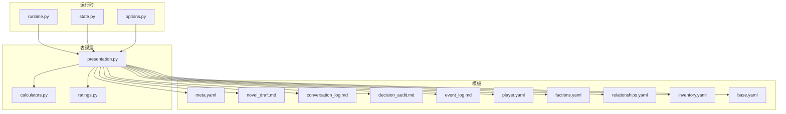
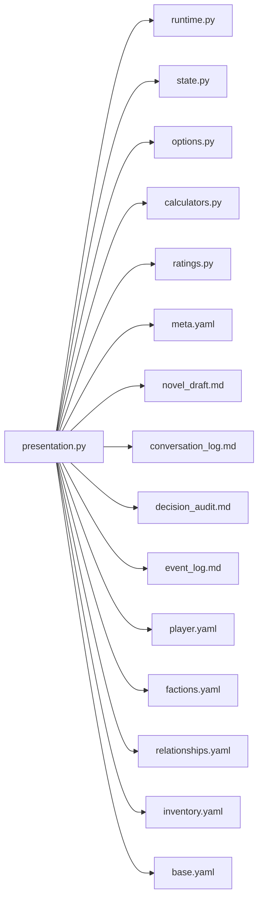

# 表现层

<cite>
**本文引用的文件**   
- [engine_runtime/presentation.py](file://engine_runtime/presentation.py)
- [engine_runtime/calculators.py](file://engine_runtime/calculators.py)
- [engine_runtime/ratings.py](file://engine_runtime/ratings.py)
- [engine_runtime/runtime.py](file://engine_runtime/runtime.py)
- [engine_runtime/state.py](file://engine_runtime/state.py)
- [engine_runtime/options.py](file://engine_runtime/options.py)
- [templates/save_template/meta.yaml](file://templates/save_template/meta.yaml)
- [templates/save_template/novel_draft.md](file://templates/save_template/novel_draft.md)
- [templates/save_template/conversation_log.md](file://templates/save_template/conversation_log.md)
- [templates/save_template/decision_audit.md](file://templates/save_template/decision_audit.md)
- [templates/save_template/event_log.md](file://templates/save_template/event_log.md)
- [templates/save_template/player.yaml](file://templates/save_template/player.yaml)
- [templates/save_template/factions.yaml](file://templates/save_template/factions.yaml)
- [templates/save_template/relationships.yaml](file://templates/save_template/relationships.yaml)
- [templates/save_template/inventory.yaml](file://templates/save_template/inventory.yaml)
- [templates/save_template/base.yaml](file://templates/save_template/base.yaml)
</cite>

## 目录
1. [简介](#简介)
2. [项目结构](#项目结构)
3. [核心组件](#核心组件)
4. [架构总览](#架构总览)
5. [详细组件分析](#详细组件分析)
6. [依赖关系分析](#依赖关系分析)
7. [性能考虑](#性能考虑)
8. [故障排查指南](#故障排查指南)
9. [结论](#结论)
10. [附录](#附录)

## 简介
本文件聚焦于“表现层”的设计与实现，涵盖用户界面组件、渲染逻辑与交互处理；同时详细说明“计算器模块”的功能（数值计算、评分算法与决策支持）、评级系统的工作原理与扩展方式。文档还提供UI组件使用示例与定制指南，并覆盖响应式设计、可访问性、跨平台兼容性、主题定制、样式管理、国际化支持、性能优化与用户反馈机制等关键议题。

## 项目结构
表现层相关能力主要分布在 engine_runtime 下的 presentation、calculators、ratings 以及 runtime/state/options 等模块中，模板目录 templates 提供保存与展示用的结构化模板。整体采用“引擎-运行时-表现层”的分层思路：运行时负责状态与流程编排，表现层负责数据到视图的转换与呈现，模板用于持久化与可读输出。



图表来源
- [engine_runtime/runtime.py](file://engine_runtime/runtime.py)
- [engine_runtime/state.py](file://engine_runtime/state.py)
- [engine_runtime/options.py](file://engine_runtime/options.py)
- [engine_runtime/presentation.py](file://engine_runtime/presentation.py)
- [engine_runtime/calculators.py](file://engine_runtime/calculators.py)
- [engine_runtime/ratings.py](file://engine_runtime/ratings.py)
- [templates/save_template/meta.yaml](file://templates/save_template/meta.yaml)
- [templates/save_template/novel_draft.md](file://templates/save_template/novel_draft.md)
- [templates/save_template/conversation_log.md](file://templates/save_template/conversation_log.md)
- [templates/save_template/decision_audit.md](file://templates/save_template/decision_audit.md)
- [templates/save_template/event_log.md](file://templates/save_template/event_log.md)
- [templates/save_template/player.yaml](file://templates/save_template/player.yaml)
- [templates/save_template/factions.yaml](file://templates/save_template/factions.yaml)
- [templates/save_template/relationships.yaml](file://templates/save_template/relationships.yaml)
- [templates/save_template/inventory.yaml](file://templates/save_template/inventory.yaml)
- [templates/save_template/base.yaml](file://templates/save_template/base.yaml)

章节来源
- [engine_runtime/presentation.py](file://engine_runtime/presentation.py)
- [engine_runtime/calculators.py](file://engine_runtime/calculators.py)
- [engine_runtime/ratings.py](file://engine_runtime/ratings.py)
- [engine_runtime/runtime.py](file://engine_runtime/runtime.py)
- [engine_runtime/state.py](file://engine_runtime/state.py)
- [engine_runtime/options.py](file://engine_runtime/options.py)
- [templates/save_template/meta.yaml](file://templates/save_template/meta.yaml)
- [templates/save_template/novel_draft.md](file://templates/save_template/novel_draft.md)
- [templates/save_template/conversation_log.md](file://templates/save_template/conversation_log.md)
- [templates/save_template/decision_audit.md](file://templates/save_template/decision_audit.md)
- [templates/save_template/event_log.md](file://templates/save_template/event_log.md)
- [templates/save_template/player.yaml](file://templates/save_template/player.yaml)
- [templates/save_template/factions.yaml](file://templates/save_template/factions.yaml)
- [templates/save_template/relationships.yaml](file://templates/save_template/relationships.yaml)
- [templates/save_template/inventory.yaml](file://templates/save_template/inventory.yaml)
- [templates/save_template/base.yaml](file://templates/save_template/base.yaml)

## 核心组件
- 表现层（presentation）：负责将运行时状态转换为可展示的格式（文本、结构化数据），驱动模板渲染，组织用户可见的信息流。
- 计算器（calculators）：提供数值计算、评分聚合与决策辅助函数，为表现层提供稳定的计算结果。
- 评级系统（ratings）：定义评级维度、权重与等级映射，支持自定义扩展以适配不同业务场景。
- 运行时与状态（runtime/state/options）：提供全局配置、状态快照与生命周期控制，是表现层的数据源。

章节来源
- [engine_runtime/presentation.py](file://engine_runtime/presentation.py)
- [engine_runtime/calculators.py](file://engine_runtime/calculators.py)
- [engine_runtime/ratings.py](file://engine_runtime/ratings.py)
- [engine_runtime/runtime.py](file://engine_runtime/runtime.py)
- [engine_runtime/state.py](file://engine_runtime/state.py)
- [engine_runtime/options.py](file://engine_runtime/options.py)

## 架构总览
表现层位于运行时之上，读取状态与选项，调用计算器与评级系统进行数据处理，最终通过模板生成用户可读的输出。该分层确保关注点分离：运行时专注状态与流程，表现层专注数据到视图的转换与呈现。

```mermaid
sequenceDiagram
participant UI as "用户界面"
participant PRE as "表现层(presentation)"
participant RT as "运行时(runtime)"
participant ST as "状态(state)"
participant OPT as "选项(options)"
participant CALC as "计算器(calculators)"
participant RAT as "评级(ratings)"
participant TPL as "模板(templates)"
UI->>PRE : "请求渲染/更新视图"
PRE->>RT : "获取当前运行上下文"
RT-->>PRE : "返回运行时信息"
PRE->>ST : "读取状态快照"
ST-->>PRE : "返回状态数据"
PRE->>OPT : "读取显示与行为选项"
OPT-->>PRE : "返回选项配置"
PRE->>CALC : "执行数值计算/评分聚合"
CALC-->>PRE : "返回计算结果"
PRE->>RAT : "应用评级规则与映射"
RAT-->>PRE : "返回评级结果"
PRE->>TPL : "基于模板渲染输出"
TPL-->>PRE : "返回渲染内容"
PRE-->>UI : "返回最终展示内容"
```

图表来源
- [engine_runtime/presentation.py](file://engine_runtime/presentation.py)
- [engine_runtime/runtime.py](file://engine_runtime/runtime.py)
- [engine_runtime/state.py](file://engine_runtime/state.py)
- [engine_runtime/options.py](file://engine_runtime/options.py)
- [engine_runtime/calculators.py](file://engine_runtime/calculators.py)
- [engine_runtime/ratings.py](file://engine_runtime/ratings.py)
- [templates/save_template/meta.yaml](file://templates/save_template/meta.yaml)
- [templates/save_template/novel_draft.md](file://templates/save_template/novel_draft.md)
- [templates/save_template/conversation_log.md](file://templates/save_template/conversation_log.md)
- [templates/save_template/decision_audit.md](file://templates/save_template/decision_audit.md)
- [templates/save_template/event_log.md](file://templates/save_template/event_log.md)
- [templates/save_template/player.yaml](file://templates/save_template/player.yaml)
- [templates/save_template/factions.yaml](file://templates/save_template/factions.yaml)
- [templates/save_template/relationships.yaml](file://templates/save_template/relationships.yaml)
- [templates/save_template/inventory.yaml](file://templates/save_template/inventory.yaml)
- [templates/save_template/base.yaml](file://templates/save_template/base.yaml)

## 详细组件分析

### 表现层（presentation）
- 职责
  - 从运行时与状态中抽取数据，结合选项进行格式化与过滤。
  - 调用计算器与评级系统生成展示所需的结果。
  - 根据模板类型选择渲染策略，输出结构化或自然语言内容。
- 设计要点
  - 数据到视图的单向流动，避免反向污染状态。
  - 模板与渲染逻辑解耦，便于扩展新的展示形式。
  - 错误边界与降级策略，保证在数据缺失或异常时仍可回退到安全展示。
- 交互处理
  - 接收来自UI的渲染请求，按优先级刷新关键区域。
  - 对高频更新进行节流/去抖，减少不必要的重渲染。
- 可访问性与国际化
  - 通过选项注入本地化标签与无障碍属性，确保多语言与屏幕阅读器友好。
- 主题与样式
  - 支持主题变量注入，统一颜色、字体与布局参数，便于切换风格。

章节来源
- [engine_runtime/presentation.py](file://engine_runtime/presentation.py)
- [engine_runtime/options.py](file://engine_runtime/options.py)
- [templates/save_template/meta.yaml](file://templates/save_template/meta.yaml)
- [templates/save_template/novel_draft.md](file://templates/save_template/novel_draft.md)
- [templates/save_template/conversation_log.md](file://templates/save_template/conversation_log.md)
- [templates/save_template/decision_audit.md](file://templates/save_template/decision_audit.md)
- [templates/save_template/event_log.md](file://templates/save_template/event_log.md)
- [templates/save_template/player.yaml](file://templates/save_template/player.yaml)
- [templates/save_template/factions.yaml](file://templates/save_template/factions.yaml)
- [templates/save_template/relationships.yaml](file://templates/save_template/relationships.yaml)
- [templates/save_template/inventory.yaml](file://templates/save_template/inventory.yaml)
- [templates/save_template/base.yaml](file://templates/save_template/base.yaml)

### 计算器模块（calculators）
- 功能范围
  - 数值计算：基础算术、统计聚合、归一化与加权求和。
  - 评分算法：多维度评分合成、阈值判定与等级映射。
  - 决策支持：基于评分与约束条件的推荐与排序。
- 复杂度与性能
  - 常用操作时间复杂度为O(n)或O(1)，注意批量计算时的内存占用。
  - 缓存中间结果以减少重复计算，尤其在高频刷新场景。
- 错误处理
  - 输入校验与边界保护，避免除零、越界与NaN传播。
  - 失败路径返回默认值或空结果，由表现层进行降级展示。
- 扩展点
  - 新增评分维度或决策规则时，保持接口稳定，便于替换实现。

章节来源
- [engine_runtime/calculators.py](file://engine_runtime/calculators.py)

### 评级系统（ratings）
- 工作原理
  - 定义评级维度、权重与等级区间，将原始分数映射为等级或标签。
  - 支持动态权重调整与条件分支，适应不同情境。
- 数据结构
  - 维度表、权重表、等级映射表，三者组合形成完整的评级策略。
- 自定义扩展
  - 通过注册新维度或覆盖映射表实现扩展，无需修改核心逻辑。
  - 提供测试夹具验证评级一致性。
- 与表现层的集成
  - 表现层调用评级API获取等级与解释文本，用于UI展示与导出。

章节来源
- [engine_runtime/ratings.py](file://engine_runtime/ratings.py)

### 运行时与状态（runtime/state/options）
- 运行时（runtime）
  - 管理生命周期、事件调度与模块协调，为表现层提供上下文。
- 状态（state）
  - 维护游戏世界与玩家状态的快照，支持增量更新与回滚。
- 选项（options）
  - 集中管理显示偏好、主题、语言与行为开关，供表现层读取。
- 与表现层的关系
  - 表现层只读状态与选项，不直接修改，确保数据一致性。

章节来源
- [engine_runtime/runtime.py](file://engine_runtime/runtime.py)
- [engine_runtime/state.py](file://engine_runtime/state.py)
- [engine_runtime/options.py](file://engine_runtime/options.py)

### 模板与渲染（templates）
- 模板类型
  - 元数据（meta.yaml）、小说草稿（novel_draft.md）、对话日志（conversation_log.md）、决策审计（decision_audit.md）、事件日志（event_log.md）、玩家（player.yaml）、阵营（factions.yaml）、关系（relationships.yaml）、物品（inventory.yaml）、基础（base.yaml）。
- 渲染策略
  - 结构化数据优先使用YAML，叙事内容使用Markdown，便于人类阅读与机器解析。
- 扩展方法
  - 新增模板类型或字段时，保持向后兼容，提供默认值与占位符。

章节来源
- [templates/save_template/meta.yaml](file://templates/save_template/meta.yaml)
- [templates/save_template/novel_draft.md](file://templates/save_template/novel_draft.md)
- [templates/save_template/conversation_log.md](file://templates/save_template/conversation_log.md)
- [templates/save_template/decision_audit.md](file://templates/save_template/decision_audit.md)
- [templates/save_template/event_log.md](file://templates/save_template/event_log.md)
- [templates/save_template/player.yaml](file://templates/save_template/player.yaml)
- [templates/save_template/factions.yaml](file://templates/save_template/factions.yaml)
- [templates/save_template/relationships.yaml](file://templates/save_template/relationships.yaml)
- [templates/save_template/inventory.yaml](file://templates/save_template/inventory.yaml)
- [templates/save_template/base.yaml](file://templates/save_template/base.yaml)

## 依赖关系分析
表现层依赖运行时、状态与选项作为数据源，依赖计算器与评级系统进行数据处理，依赖模板进行最终渲染。各模块之间通过明确接口耦合，降低循环依赖风险。



图表来源
- [engine_runtime/presentation.py](file://engine_runtime/presentation.py)
- [engine_runtime/runtime.py](file://engine_runtime/runtime.py)
- [engine_runtime/state.py](file://engine_runtime/state.py)
- [engine_runtime/options.py](file://engine_runtime/options.py)
- [engine_runtime/calculators.py](file://engine_runtime/calculators.py)
- [engine_runtime/ratings.py](file://engine_runtime/ratings.py)
- [templates/save_template/meta.yaml](file://templates/save_template/meta.yaml)
- [templates/save_template/novel_draft.md](file://templates/save_template/novel_draft.md)
- [templates/save_template/conversation_log.md](file://templates/save_template/conversation_log.md)
- [templates/save_template/decision_audit.md](file://templates/save_template/decision_audit.md)
- [templates/save_template/event_log.md](file://templates/save_template/event_log.md)
- [templates/save_template/player.yaml](file://templates/save_template/player.yaml)
- [templates/save_template/factions.yaml](file://templates/save_template/factions.yaml)
- [templates/save_template/relationships.yaml](file://templates/save_template/relationships.yaml)
- [templates/save_template/inventory.yaml](file://templates/save_template/inventory.yaml)
- [templates/save_template/base.yaml](file://templates/save_template/base.yaml)

章节来源
- [engine_runtime/presentation.py](file://engine_runtime/presentation.py)
- [engine_runtime/runtime.py](file://engine_runtime/runtime.py)
- [engine_runtime/state.py](file://engine_runtime/state.py)
- [engine_runtime/options.py](file://engine_runtime/options.py)
- [engine_runtime/calculators.py](file://engine_runtime/calculators.py)
- [engine_runtime/ratings.py](file://engine_runtime/ratings.py)
- [templates/save_template/meta.yaml](file://templates/save_template/meta.yaml)
- [templates/save_template/novel_draft.md](file://templates/save_template/novel_draft.md)
- [templates/save_template/conversation_log.md](file://templates/save_template/conversation_log.md)
- [templates/save_template/decision_audit.md](file://templates/save_template/decision_audit.md)
- [templates/save_template/event_log.md](file://templates/save_template/event_log.md)
- [templates/save_template/player.yaml](file://templates/save_template/player.yaml)
- [templates/save_template/factions.yaml](file://templates/save_template/factions.yaml)
- [templates/save_template/relationships.yaml](file://templates/save_template/relationships.yaml)
- [templates/save_template/inventory.yaml](file://templates/save_template/inventory.yaml)
- [templates/save_template/base.yaml](file://templates/save_template/base.yaml)

## 性能考虑
- 渲染优化
  - 按需渲染：仅更新变化区域，避免全量重绘。
  - 批处理：合并多次状态变更，减少渲染次数。
  - 懒加载：延迟非关键数据的加载与计算。
- 计算优化
  - 缓存中间结果，避免重复计算。
  - 使用增量更新与近似算法，平衡精度与性能。
- 内存管理
  - 及时释放临时对象，避免大对象常驻内存。
  - 限制历史快照数量，防止内存膨胀。
- I/O优化
  - 模板渲染结果缓存，减少磁盘读写。
  - 异步I/O提升响应速度。

[本节为通用指导，不直接分析具体文件]

## 故障排查指南
- 常见问题
  - 模板渲染失败：检查模板字段是否齐全、数据类型是否正确。
  - 评级结果异常：核对权重与等级映射，确认输入范围。
  - 计算结果为空或NaN：检查输入校验与边界条件。
- 调试建议
  - 启用详细日志，记录关键步骤与中间结果。
  - 使用最小复现用例定位问题。
  - 逐步禁用模块隔离问题范围。
- 恢复策略
  - 回退到上一版本状态或模板。
  - 使用默认配置与降级展示保证可用性。

章节来源
- [engine_runtime/presentation.py](file://engine_runtime/presentation.py)
- [engine_runtime/calculators.py](file://engine_runtime/calculators.py)
- [engine_runtime/ratings.py](file://engine_runtime/ratings.py)
- [engine_runtime/options.py](file://engine_runtime/options.py)

## 结论
表现层通过清晰的分层与模块化设计，实现了从运行时状态到用户界面的稳定转换。计算器与评级系统提供了可扩展的计算与决策能力，模板体系确保了输出的可读性与可维护性。遵循本文的性能优化与故障排查建议，可在复杂场景中保持高可用与良好体验。

[本节为总结性内容，不直接分析具体文件]

## 附录

### UI组件使用示例与定制指南
- 使用示例
  - 初始化表现层实例，传入运行时、状态与选项。
  - 调用渲染方法生成指定模板的输出。
  - 监听用户交互事件，触发局部刷新。
- 定制指南
  - 扩展模板字段：在对应模板中添加占位符并提供默认值。
  - 自定义评级维度：注册新维度与映射表，保持接口一致。
  - 主题定制：通过选项注入颜色、字体与布局变量。
  - 国际化：在选项中配置语言包，确保所有标签可翻译。

章节来源
- [engine_runtime/presentation.py](file://engine_runtime/presentation.py)
- [engine_runtime/options.py](file://engine_runtime/options.py)
- [engine_runtime/ratings.py](file://engine_runtime/ratings.py)
- [templates/save_template/meta.yaml](file://templates/save_template/meta.yaml)
- [templates/save_template/novel_draft.md](file://templates/save_template/novel_draft.md)
- [templates/save_template/conversation_log.md](file://templates/save_template/conversation_log.md)
- [templates/save_template/decision_audit.md](file://templates/save_template/decision_audit.md)
- [templates/save_template/event_log.md](file://templates/save_template/event_log.md)
- [templates/save_template/player.yaml](file://templates/save_template/player.yaml)
- [templates/save_template/factions.yaml](file://templates/save_template/factions.yaml)
- [templates/save_template/relationships.yaml](file://templates/save_template/relationships.yaml)
- [templates/save_template/inventory.yaml](file://templates/save_template/inventory.yaml)
- [templates/save_template/base.yaml](file://templates/save_template/base.yaml)

### 响应式设计、可访问性与跨平台兼容性
- 响应式设计
  - 根据屏幕尺寸动态调整布局与内容密度。
  - 使用弹性布局与媒体查询适配不同设备。
- 可访问性
  - 提供语义化结构与Aria属性，支持键盘导航与屏幕阅读器。
  - 确保色彩对比度与焦点可见性。
- 跨平台兼容性
  - 抽象平台差异，统一输入输出接口。
  - 针对移动端与桌面端分别优化交互与性能。

[本节为通用指导，不直接分析具体文件]

### 主题定制、样式管理与国际化支持
- 主题定制
  - 通过主题变量统一管理颜色、字体与间距。
  - 支持动态切换主题，实时预览效果。
- 样式管理
  - 分层样式：基础样式、组件样式与页面样式分离。
  - 使用CSS变量或主题引擎提高可维护性。
- 国际化支持
  - 集中管理翻译键与文案，支持多语言切换。
  - 日期、时间与数字格式本地化。

[本节为通用指导，不直接分析具体文件]

### 性能优化与用户反馈机制
- 性能优化
  - 渲染节流与防抖，减少频繁更新。
  - 虚拟列表与分页加载，提升大数据展示性能。
- 用户反馈
  - 进度指示与加载动画，提升感知性能。
  - 错误提示与帮助信息，改善用户体验。

[本节为通用指导，不直接分析具体文件]