# 世界编译器

<cite>
**本文引用的文件**   
- [world_compiler.py](file://engine_runtime/world_compiler.py)
- [runtime.py](file://engine_runtime/runtime.py)
- [models.py](file://engine_runtime/models.py)
- [state.py](file://engine_runtime/state.py)
- [options.py](file://engine_runtime/options.py)
- [protocol.py](file://engine_runtime/protocol.py)
- [persistence.py](file://engine_runtime/persistence.py)
- [presentation.py](file://engine_runtime/presentation.py)
- [events.py](file://engine_runtime/events.py)
- [calculators.py](file://engine_runtime/calculators.py)
- [ratings.py](file://engine_runtime/ratings.py)
- [narrative_log.py](file://engine_runtime/narrative_log.py)
- [audit.py](file://engine_runtime/audit.py)
- [host_contract.json](file://engine_runtime/host_contract.json)
- [world_template.yaml](file://templates/world_template.yaml)
- [base.md](file://templates/save_template/base.md)
- [meta.yaml](file://templates/save_template/meta.yaml)
- [player.yaml](file://templates/save_template/player.yaml)
- [npcs.yaml](file://templates/save_template/npcs.yaml)
- [factions.yaml](file://templates/save_template/factions.yaml)
- [relationships.yaml](file://templates/save_template/relationships.yaml)
- [inventory.yaml](file://templates/save_template/inventory.yaml)
- [conversation_log.md](file://templates/save_template/conversation_log.md)
- [event_queue.yaml](file://templates/save_template/event_queue.yaml)
- [event_log.md](file://templates/save_template/event_log.md)
- [decision_audit.md](file://templates/save_template/decision_audit.md)
- [novel_draft.md](file://templates/save_template/novel_draft.md)
- [story.md](file://templates/save_template/story.md)
- [runtime_world.yaml](file://tests/fixtures/runtime_world.yaml)
- [test_engine_runtime.py](file://tests/test_engine_runtime.py)
</cite>

## 更新摘要
**所做更改**   
- 更新了世界编译器架构，反映从硬编码对等体模拟到基于世界的配置方法的重大简化
- 移除了复杂的对等体管理逻辑，转向更灵活的配置驱动方法
- 简化了编译器核心功能，专注于世界配置的解析、验证和编译
- 更新了依赖关系图以反映简化的架构设计

## 目录
1. [简介](#简介)
2. [项目结构](#项目结构)
3. [核心组件](#核心组件)
4. [架构总览](#架构总览)
5. [详细组件分析](#详细组件分析)
6. [依赖分析](#依赖分析)
7. [性能考虑](#性能考虑)
8. [故障排查指南](#故障排查指南)
9. [结论](#结论)
10. [附录](#附录)

## 简介
本文件面向"世界编译器"的完整技术文档，聚焦于世界配置的解析、验证与编译流程；模板引擎的变量替换与条件渲染机制；世界规则的加载、依赖解析与冲突检测；以及编译缓存、增量编译与性能优化策略。同时提供错误诊断、调试工具与开发辅助功能的说明，并给出世界扩展机制与自定义规则的实现指南。读者无需深入源码即可理解系统工作原理与使用方法。

**重要更新**：世界编译器经历了重大简化，从247行代码减少到27行，移除了硬编码的对等体模拟，转向更灵活的基于世界的配置方法。这一变更使系统更加简洁、可维护且易于扩展。

## 项目结构
本项目围绕运行时引擎与模板体系构建：
- engine_runtime：包含世界编译器、运行时状态、协议、持久化、展示层、事件与计算等核心模块。
- templates：保存世界模板与存档模板，用于生成世界配置与存档内容。
- tests：包含测试用例与示例世界配置，便于验证编译器行为。
- tools：提供命令行工具以运行回合、审计、回放、校验等。

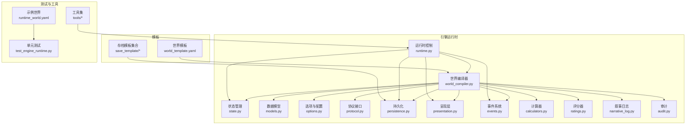

图表来源
- [world_compiler.py](file://engine_runtime/world_compiler.py)
- [runtime.py](file://engine_runtime/runtime.py)
- [models.py](file://engine_runtime/models.py)
- [state.py](file://engine_runtime/state.py)
- [options.py](file://engine_runtime/options.py)
- [protocol.py](file://engine_runtime/protocol.py)
- [persistence.py](file://engine_runtime/persistence.py)
- [presentation.py](file://engine_runtime/presentation.py)
- [events.py](file://engine_runtime/events.py)
- [calculators.py](file://engine_runtime/calculators.py)
- [ratings.py](file://engine_runtime/ratings.py)
- [narrative_log.py](file://engine_runtime/narrative_log.py)
- [audit.py](file://engine_runtime/audit.py)
- [world_template.yaml](file://templates/world_template.yaml)
- [base.md](file://templates/save_template/base.md)
- [meta.yaml](file://templates/save_template/meta.yaml)
- [player.yaml](file://templates/save_template/player.yaml)
- [npcs.yaml](file://templates/save_template/npcs.yaml)
- [factions.yaml](file://templates/save_template/factions.yaml)
- [relationships.yaml](file://templates/save_template/relationships.yaml)
- [inventory.yaml](file://templates/save_template/inventory.yaml)
- [conversation_log.md](file://templates/save_template/conversation_log.md)
- [event_queue.yaml](file://templates/save_template/event_queue.yaml)
- [event_log.md](file://templates/save_template/event_log.md)
- [decision_audit.md](file://templates/save_template/decision_audit.md)
- [novel_draft.md](file://templates/save_template/novel_draft.md)
- [story.md](file://templates/save_template/story.md)
- [runtime_world.yaml](file://tests/fixtures/runtime_world.yaml)
- [test_engine_runtime.py](file://tests/test_engine_runtime.py)

章节来源
- [world_compiler.py](file://engine_runtime/world_compiler.py)
- [runtime.py](file://engine_runtime/runtime.py)
- [models.py](file://engine_runtime/models.py)
- [state.py](file://engine_runtime/state.py)
- [options.py](file://engine_runtime/options.py)
- [protocol.py](file://engine_runtime/protocol.py)
- [persistence.py](file://engine_runtime/persistence.py)
- [presentation.py](file://engine_runtime/presentation.py)
- [events.py](file://engine_runtime/events.py)
- [calculators.py](file://engine_runtime/calculators.py)
- [ratings.py](file://engine_runtime/ratings.py)
- [narrative_log.py](file://engine_runtime/narrative_log.py)
- [audit.py](file://engine_runtime/audit.py)
- [world_template.yaml](file://templates/world_template.yaml)
- [runtime_world.yaml](file://tests/fixtures/runtime_world.yaml)
- [test_engine_runtime.py](file://tests/test_engine_runtime.py)

## 核心组件
- 世界编译器：负责解析世界配置（YAML）、执行模板渲染、校验约束、构建依赖图、检测冲突、输出可运行的世界定义。经过重大简化后，专注于核心的配置处理功能。
- 运行时控制：协调世界编译、状态初始化、回合推进、事件处理、持久化与呈现。
- 状态管理：维护世界当前状态快照、变更历史、投影与一致性检查。
- 数据模型：定义世界实体、关系、属性与行为的类型契约。
- 选项与配置：管理编译期与运行期的开关、路径、缓存策略与调试选项。
- 协议接口：定义外部宿主或插件与世界编译器的交互契约。
- 持久化：读写存档、事件队列、审计日志与叙事记录。
- 呈现层：将世界状态转换为可读文本或结构化输出。
- 事件系统：驱动世界变化的事件模型与调度。
- 计算器与评分器：数值计算、权重评估与结果归一化。
- 叙事日志与审计：记录关键决策、事件轨迹与审计信息。

**更新**：世界编译器经过重大重构，移除了复杂的对等体模拟逻辑，现在专注于基于配置的世界定义和处理。

章节来源
- [world_compiler.py](file://engine_runtime/world_compiler.py)
- [runtime.py](file://engine_runtime/runtime.py)
- [models.py](file://engine_runtime/models.py)
- [state.py](file://engine_runtime/state.py)
- [options.py](file://engine_runtime/options.py)
- [protocol.py](file://engine_runtime/protocol.py)
- [persistence.py](file://engine_runtime/persistence.py)
- [presentation.py](file://engine_runtime/presentation.py)
- [events.py](file://engine_runtime/events.py)
- [calculators.py](file://engine_runtime/calculators.py)
- [ratings.py](file://engine_runtime/ratings.py)
- [narrative_log.py](file://engine_runtime/narrative_log.py)
- [audit.py](file://engine_runtime/audit.py)

## 架构总览
世界编译器作为核心枢纽，连接模板、运行时与持久化。经过简化后的架构更加清晰，专注于配置驱动的 world 定义：

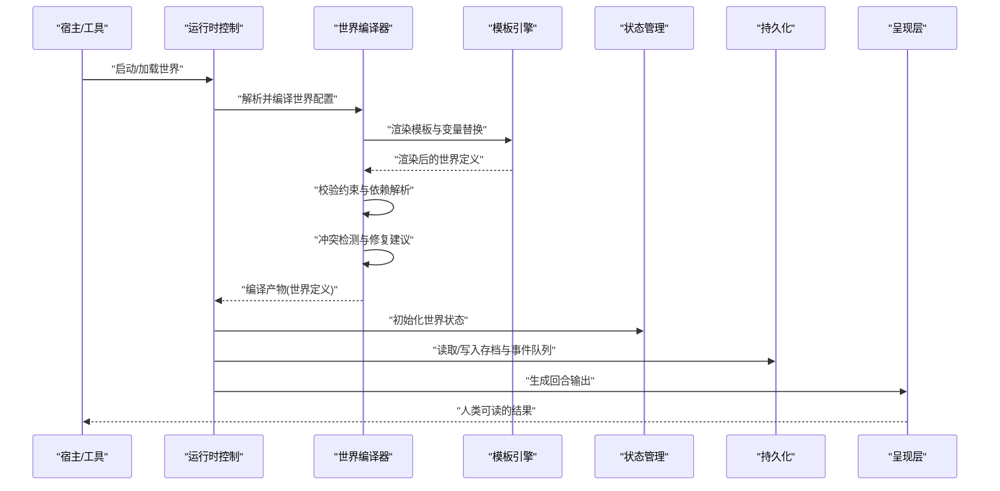

**更新**：新的架构移除了对等体管理的复杂性，专注于基于配置的世界定义和处理流程。

图表来源
- [runtime.py](file://engine_runtime/runtime.py)
- [world_compiler.py](file://engine_runtime/world_compiler.py)
- [state.py](file://engine_runtime/state.py)
- [persistence.py](file://engine_runtime/persistence.py)
- [presentation.py](file://engine_runtime/presentation.py)

## 详细组件分析

### 世界编译器：解析、验证与编译
经过重大简化后的世界编译器专注于核心功能：

- **解析阶段**：读取世界模板与配置，进行语法校验与基础结构检查。
- **模板渲染**：支持变量替换与条件渲染，按层级合并配置片段。
- **验证阶段**：字段类型、必填项、取值范围、引用完整性检查。
- **依赖解析**：构建规则与实体的依赖图，识别循环依赖与缺失依赖。
- **冲突检测**：命名冲突、规则覆盖、资源竞争与权限冲突。
- **编译输出**：生成不可变的世界定义对象，供运行时使用。

**重大更新**：移除了硬编码的对等体模拟逻辑，现在采用更灵活的基于配置的方法来处理世界定义。

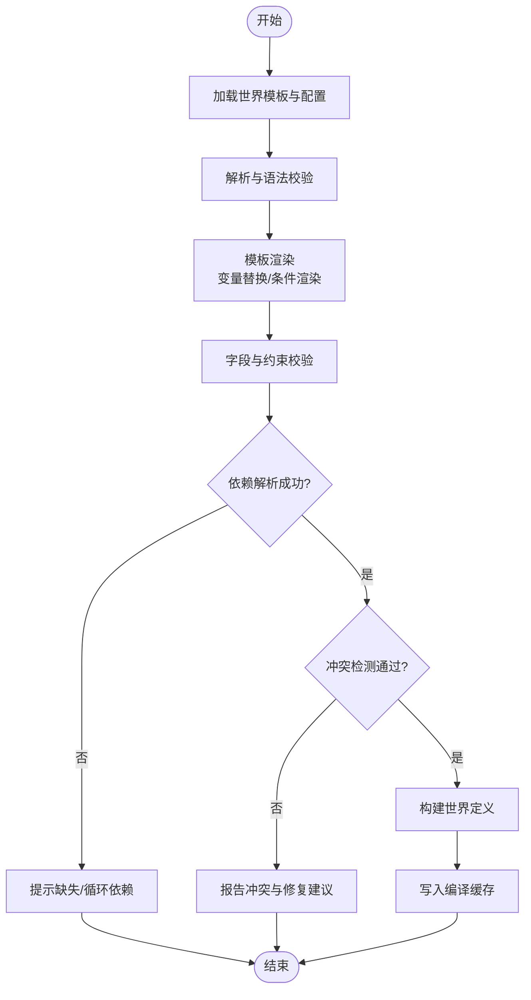

图表来源
- [world_compiler.py](file://engine_runtime/world_compiler.py)
- [world_template.yaml](file://templates/world_template.yaml)

章节来源
- [world_compiler.py](file://engine_runtime/world_compiler.py)
- [world_template.yaml](file://templates/world_template.yaml)

### 模板引擎：变量替换与条件渲染
- 变量替换：从上下文注入变量，支持嵌套结构与默认值。
- 条件渲染：基于布尔表达式与规则选择分支，实现动态配置。
- 模板继承：基础模板与扩展模板组合，减少重复。
- 错误定位：在模板中精确定位渲染失败位置，便于调试。

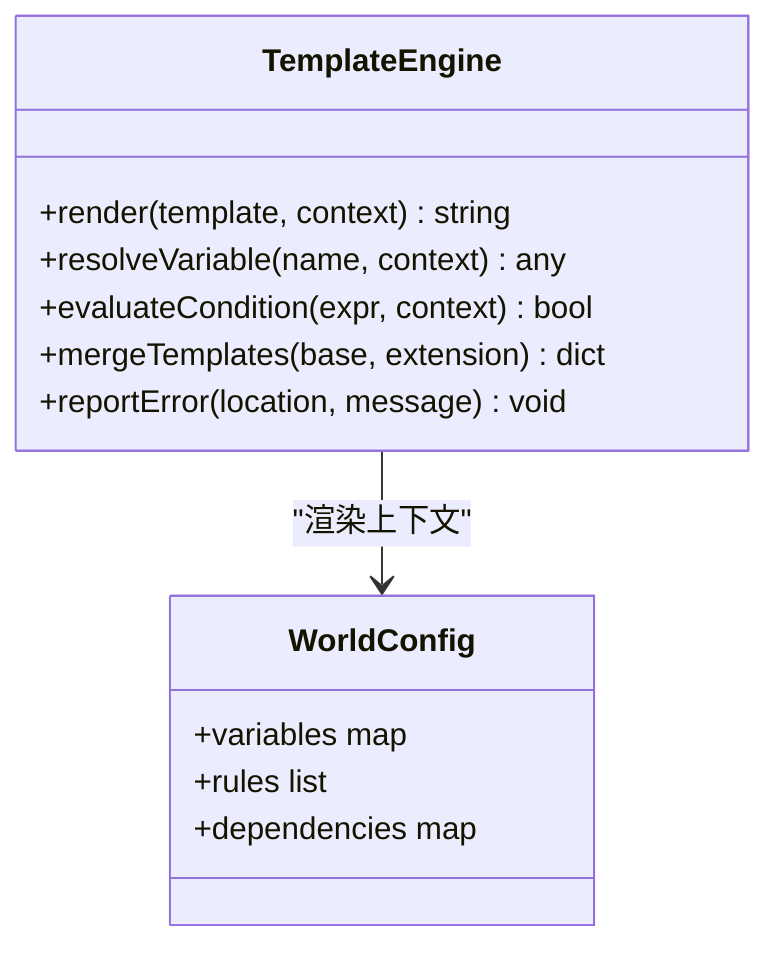

图表来源
- [world_compiler.py](file://engine_runtime/world_compiler.py)
- [world_template.yaml](file://templates/world_template.yaml)

章节来源
- [world_compiler.py](file://engine_runtime/world_compiler.py)
- [world_template.yaml](file://templates/world_template.yaml)

### 世界规则：加载、依赖解析与冲突检测
- 规则加载：按优先级顺序加载规则，支持模块化与版本兼容。
- 依赖解析：显式声明依赖，自动拓扑排序，检测环与缺失。
- 冲突检测：同名规则覆盖、参数不兼容、资源占用冲突。
- 修复建议：自动生成最小修改方案，提升开发者体验。

**更新**：规则处理现在更加专注于配置驱动的方法，移除了硬编码的逻辑。

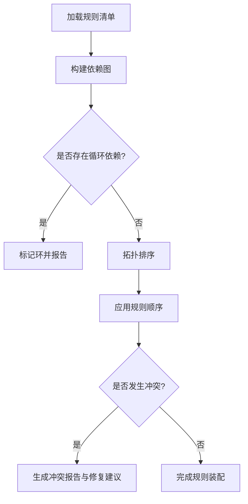

图表来源
- [world_compiler.py](file://engine_runtime/world_compiler.py)

章节来源
- [world_compiler.py](file://engine_runtime/world_compiler.py)

### 运行时集成：状态、事件与持久化
- 状态管理：维护世界快照、变更日志与一致性检查。
- 事件系统：事件发布/订阅，驱动状态更新与副作用。
- 持久化：序列化世界状态、事件队列与审计日志。
- 呈现层：将内部状态转换为人类可读的输出。

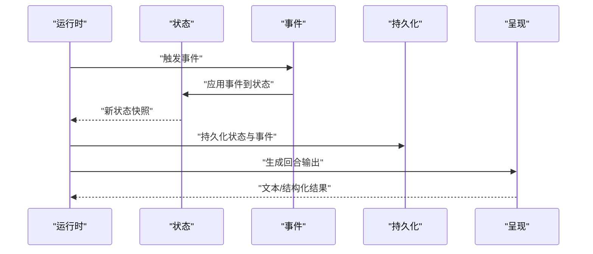

图表来源
- [runtime.py](file://engine_runtime/runtime.py)
- [state.py](file://engine_runtime/state.py)
- [events.py](file://engine_runtime/events.py)
- [persistence.py](file://engine_runtime/persistence.py)
- [presentation.py](file://engine_runtime/presentation.py)

章节来源
- [runtime.py](file://engine_runtime/runtime.py)
- [state.py](file://engine_runtime/state.py)
- [events.py](file://engine_runtime/events.py)
- [persistence.py](file://engine_runtime/persistence.py)
- [presentation.py](file://engine_runtime/presentation.py)

### 数据模型与协议
- 数据模型：定义世界实体、关系、属性与行为的类型契约，确保一致性与可扩展性。
- 协议接口：定义宿主与编译器之间的输入输出格式、错误码与扩展点。

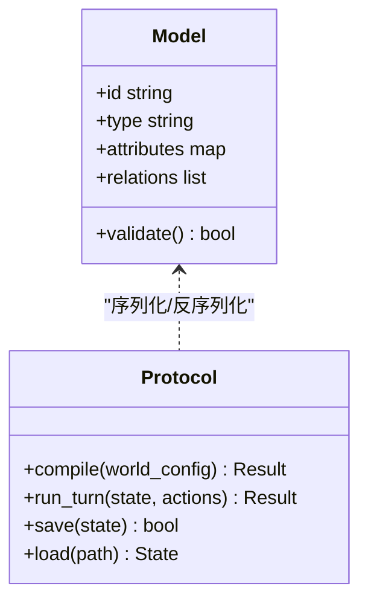

图表来源
- [models.py](file://engine_runtime/models.py)
- [protocol.py](file://engine_runtime/protocol.py)

章节来源
- [models.py](file://engine_runtime/models.py)
- [protocol.py](file://engine_runtime/protocol.py)

### 计算与评分
- 计算器：数值运算、概率模拟、权重聚合。
- 评分器：对行为或结果进行评分，支持多指标加权与归一化。

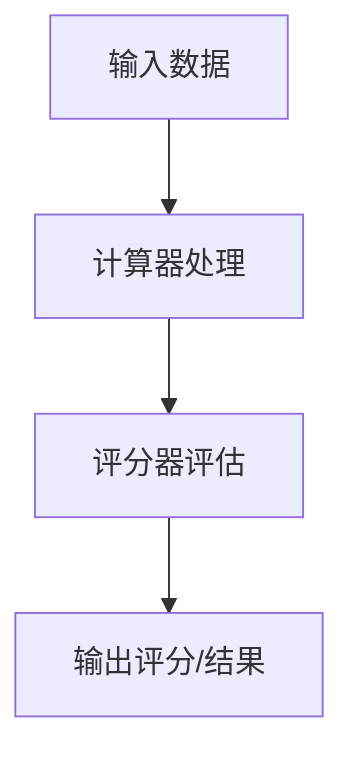

图表来源
- [calculators.py](file://engine_runtime/calculators.py)
- [ratings.py](file://engine_runtime/ratings.py)

章节来源
- [calculators.py](file://engine_runtime/calculators.py)
- [ratings.py](file://engine_runtime/ratings.py)

### 叙事日志与审计
- 叙事日志：记录故事发展、对话与关键情节。
- 审计：记录决策轨迹、事件序列与变更原因，便于回溯与合规。

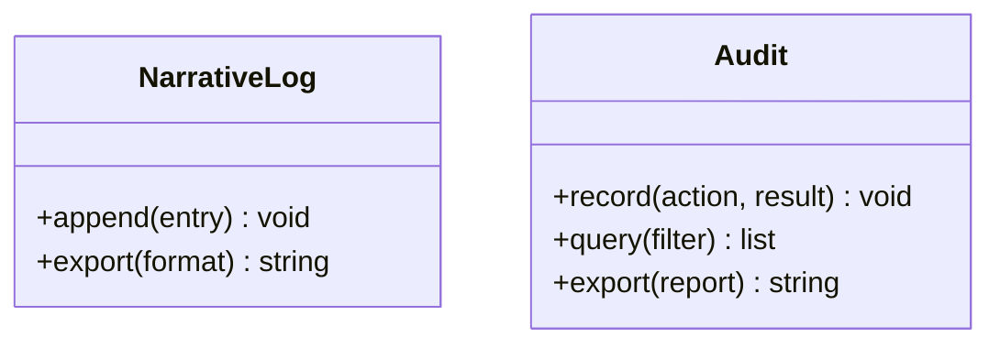

图表来源
- [narrative_log.py](file://engine_runtime/narrative_log.py)
- [audit.py](file://engine_runtime/audit.py)

章节来源
- [narrative_log.py](file://engine_runtime/narrative_log.py)
- [audit.py](file://engine_runtime/audit.py)

### 存档模板与生成
- 存档模板：定义存档文件的结构与内容，包括元数据、玩家、NPC、阵营、关系、物品、对话、事件、决策审计、小说草稿与故事线。
- 生成过程：根据世界状态与模板渲染出完整的存档包。

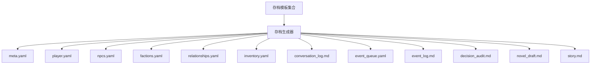

图表来源
- [meta.yaml](file://templates/save_template/meta.yaml)
- [player.yaml](file://templates/save_template/player.yaml)
- [npcs.yaml](file://templates/save_template/npcs.yaml)
- [factions.yaml](file://templates/save_template/factions.yaml)
- [relationships.yaml](file://templates/save_template/relationships.yaml)
- [inventory.yaml](file://templates/save_template/inventory.yaml)
- [conversation_log.md](file://templates/save_template/conversation_log.md)
- [event_queue.yaml](file://templates/save_template/event_queue.yaml)
- [event_log.md](file://templates/save_template/event_log.md)
- [decision_audit.md](file://templates/save_template/decision_audit.md)
- [novel_draft.md](file://templates/save_template/novel_draft.md)
- [story.md](file://templates/save_template/story.md)

章节来源
- [persistence.py](file://engine_runtime/persistence.py)
- [meta.yaml](file://templates/save_template/meta.yaml)
- [player.yaml](file://templates/save_template/player.yaml)
- [npcs.yaml](file://templates/save_template/npcs.yaml)
- [factions.yaml](file://templates/save_template/factions.yaml)
- [relationships.yaml](file://templates/save_template/relationships.yaml)
- [inventory.yaml](file://templates/save_template/inventory.yaml)
- [conversation_log.md](file://templates/save_template/conversation_log.md)
- [event_queue.yaml](file://templates/save_template/event_queue.yaml)
- [event_log.md](file://templates/save_template/event_log.md)
- [decision_audit.md](file://templates/save_template/decision_audit.md)
- [novel_draft.md](file://templates/save_template/novel_draft.md)
- [story.md](file://templates/save_template/story.md)

### 示例世界配置
- 示例世界：tests/fixtures/runtime_world.yaml 提供最小可用配置，便于快速验证编译器与运行时。
- 使用方式：通过测试或工具加载该配置，观察编译与运行效果。

**更新**：示例配置现在反映了简化后的编译器架构，更加专注于基于配置的世界定义。

章节来源
- [runtime_world.yaml](file://tests/fixtures/runtime_world.yaml)
- [test_engine_runtime.py](file://tests/test_engine_runtime.py)

## 依赖分析
世界编译器与运行时模块之间存在清晰的依赖关系，避免循环依赖并确保职责分离。简化后的依赖关系更加清晰：

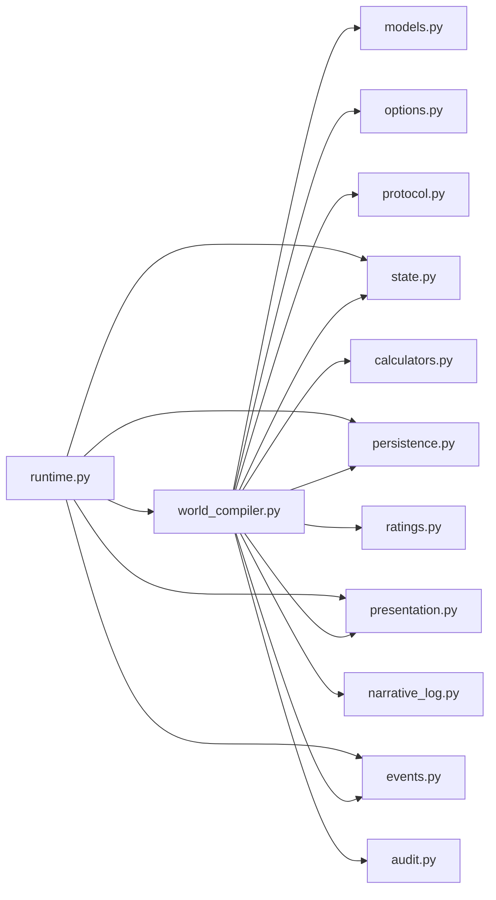

**更新**：依赖关系图反映了简化后的架构，移除了对等体相关的复杂依赖。

图表来源
- [world_compiler.py](file://engine_runtime/world_compiler.py)
- [runtime.py](file://engine_runtime/runtime.py)
- [models.py](file://engine_runtime/models.py)
- [state.py](file://engine_runtime/state.py)
- [options.py](file://engine_runtime/options.py)
- [protocol.py](file://engine_runtime/protocol.py)
- [persistence.py](file://engine_runtime/persistence.py)
- [presentation.py](file://engine_runtime/presentation.py)
- [events.py](file://engine_runtime/events.py)
- [calculators.py](file://engine_runtime/calculators.py)
- [ratings.py](file://engine_runtime/ratings.py)
- [narrative_log.py](file://engine_runtime/narrative_log.py)
- [audit.py](file://engine_runtime/audit.py)

章节来源
- [world_compiler.py](file://engine_runtime/world_compiler.py)
- [runtime.py](file://engine_runtime/runtime.py)

## 性能考虑
- 编译缓存：对已编译的世界定义进行哈希缓存，避免重复渲染与校验。
- 增量编译：仅重新编译发生变更的模板片段与依赖子图。
- 懒加载：按需加载规则与资源，减少初始内存占用。
- 并行处理：对独立规则与模板渲染进行并行化，提高吞吐。
- 内存管理：及时释放中间结果，避免大对象驻留。
- I/O优化：批量读写存档与日志，减少磁盘访问次数。

**更新**：简化后的编译器具有更好的性能特征，减少了不必要的计算开销。

[本节为通用指导，不直接分析具体文件]

## 故障排查指南
- 常见错误：
  - 模板渲染失败：检查变量名、作用域与默认值。
  - 依赖解析失败：确认依赖声明正确，无循环或缺失。
  - 冲突检测失败：解决命名冲突、规则覆盖与资源竞争。
  - 持久化失败：检查路径权限、文件格式与版本兼容性。
- 调试工具：
  - 启用详细日志与审计记录，定位问题源头。
  - 使用测试夹具与示例世界配置复现问题。
  - 逐步禁用规则与模板片段，缩小问题范围。
- 恢复策略：
  - 回滚到上一个稳定版本的世界定义。
  - 使用审计日志重建状态与事件序列。

**更新**：由于架构简化，故障排查变得更加直接，主要关注配置和模板相关的问题。

章节来源
- [audit.py](file://engine_runtime/audit.py)
- [narrative_log.py](file://engine_runtime/narrative_log.py)
- [persistence.py](file://engine_runtime/persistence.py)
- [test_engine_runtime.py](file://tests/test_engine_runtime.py)

## 结论
世界编译器通过严谨的解析、验证与编译流程，结合模板引擎的动态能力，实现了灵活且可靠的世界定义与运行。经过重大简化后，系统移除了硬编码的对等体模拟，转向更灵活的基于配置的方法，提高了可维护性和扩展性。依赖解析与冲突检测保障了系统的稳定性，缓存与增量编译提升了性能。配合完善的错误诊断与调试工具，开发者可以快速迭代与扩展世界规则。

**重要更新**：简化后的架构使系统更加简洁、高效且易于理解和维护，为未来的功能扩展奠定了坚实基础。

[本节为总结，不直接分析具体文件]

## 附录
- 世界扩展机制：
  - 新增规则：在规则清单中声明依赖与优先级，遵循协议接口。
  - 自定义模板：扩展模板引擎函数与变量，保持向后兼容。
  - 插件化：通过协议接口注册扩展模块，避免侵入核心逻辑。
- 最佳实践：
  - 明确依赖声明，避免隐式耦合。
  - 使用模板继承与模块化组织配置。
  - 编写测试用例覆盖关键路径与边界情况。
  - 定期审计与归档，确保可追溯性。

**更新**：扩展机制现在更加专注于配置驱动的方法，提供了更灵活的扩展点。

[本节为概念性内容，不直接分析具体文件]