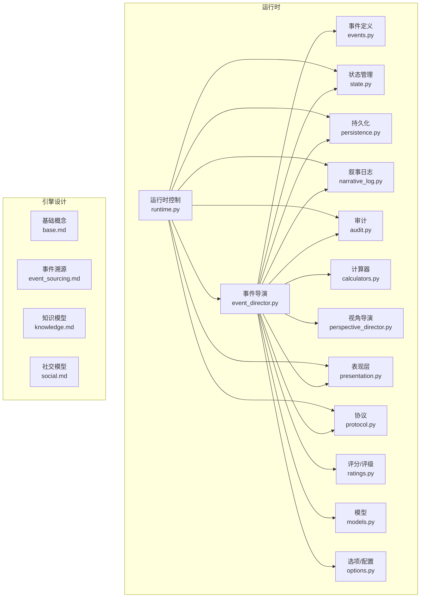
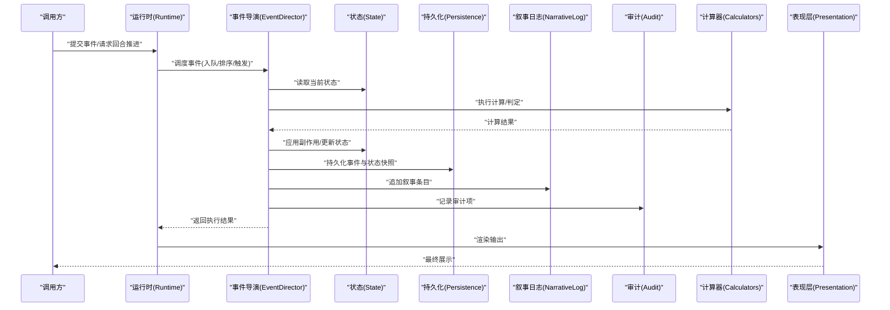
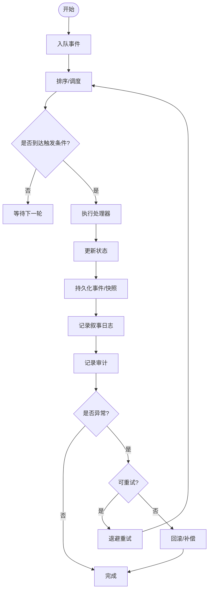
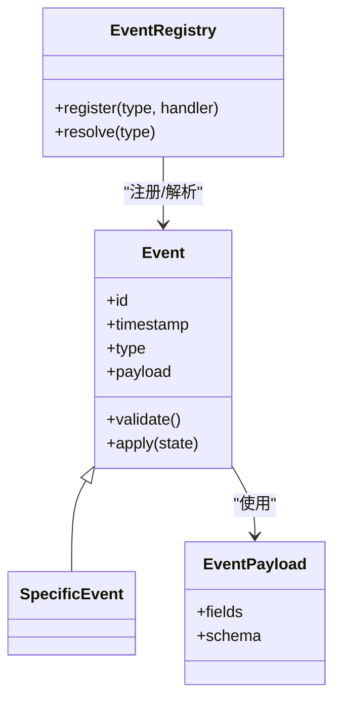
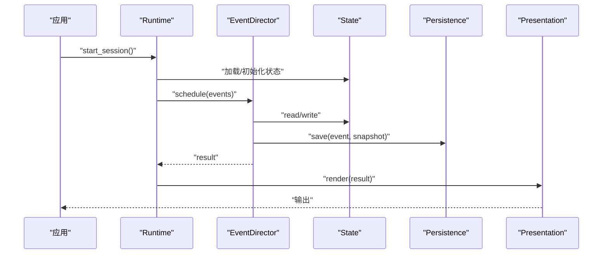
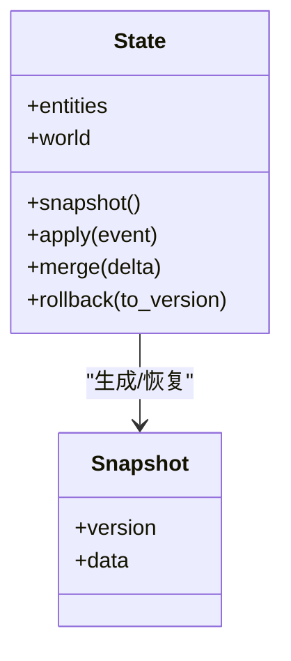
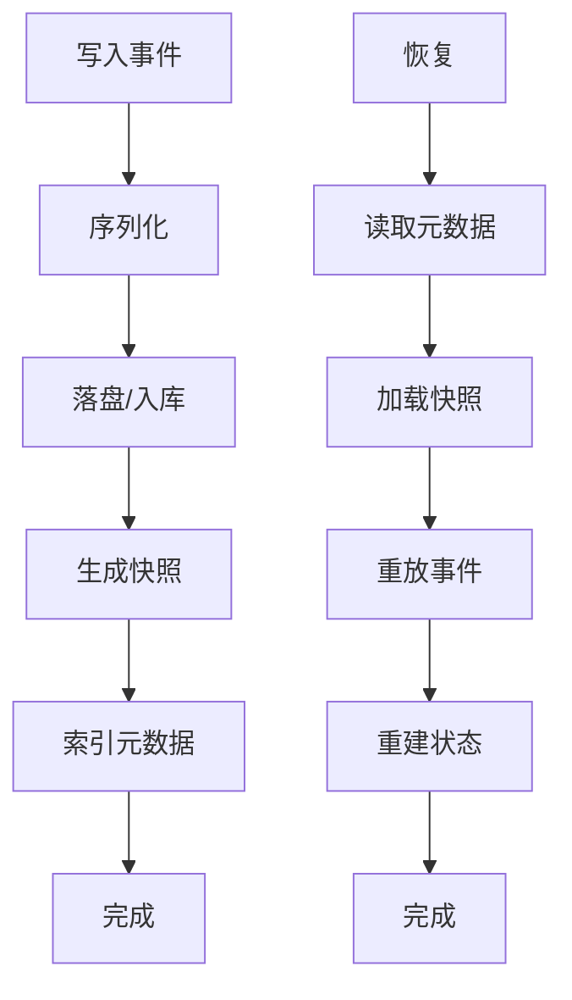
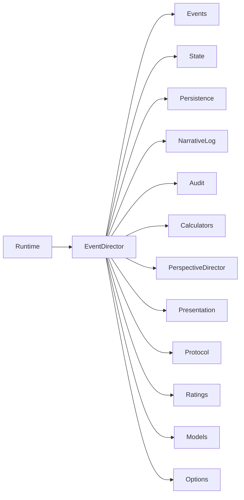

# 事件导演系统

<cite>
**本文引用的文件**   
- [event_director.py](file://engine_runtime/event_director.py)
- [events.py](file://engine_runtime/events.py)
- [runtime.py](file://engine_runtime/runtime.py)
- [state.py](file://engine_runtime/state.py)
- [persistence.py](file://engine_runtime/persistence.py)
- [narrative_log.py](file://engine_runtime/narrative_log.py)
- [audit.py](file://engine_runtime/audit.py)
- [calculators.py](file://engine_runtime/calculators.py)
- [perspective_director.py](file://engine_runtime/perspective_director.py)
- [models.py](file://engine_runtime/models.py)
- [options.py](file://engine_runtime/options.py)
- [presentation.py](file://engine_runtime/presentation.py)
- [protocol.py](file://engine_runtime/protocol.py)
- [ratings.py](file://engine_runtime/ratings.py)
- [base.md](file://engine/base.md)
- [event_sourcing.md](file://engine/event_sourcing.md)
- [knowledge.md](file://engine/knowledge.md)
- [social.md](file://engine/social.md)
- [README.md](file://engine_runtime/README.md)
</cite>

## 目录
1. [简介](#简介)
2. [项目结构](#项目结构)
3. [核心组件](#核心组件)
4. [架构总览](#架构总览)
5. [详细组件分析](#详细组件分析)
6. [依赖关系分析](#依赖关系分析)
7. [性能考量](#性能考量)
8. [故障排查指南](#故障排查指南)
9. [结论](#结论)
10. [附录](#附录)

## 简介
本文件面向“事件导演系统”的架构与实现，聚焦于事件驱动叙事引擎在运行时如何编排、调度与持久化事件，以及如何与状态管理、审计日志、视角导演、计算模块和表现层协作。文档以工程可读性为目标，既提供高层架构图，也给出代码级关系图与关键流程时序图，帮助读者快速理解系统的职责边界、数据流与控制流。

## 项目结构
- engine_runtime：运行时核心，包含事件导演、事件定义、运行时控制、状态管理、持久化、审计、计算、视角导演、表现与协议等模块。
- engine：引擎设计文档，涵盖基础概念、事件溯源、知识与社交模型等。
- templates：存档模板与初始世界配置。
- tools：命令行工具，用于回合控制、回放、校验与记录。
- tests：集成测试与用例。

**图表来源** 
- [event_director.py:1-200](file://engine_runtime/event_director.py#L1-L200)
- [events.py:1-200](file://engine_runtime/events.py#L1-L200)
- [runtime.py:1-200](file://engine_runtime/runtime.py#L1-L200)
- [state.py:1-200](file://engine_runtime/state.py#L1-L200)
- [persistence.py:1-200](file://engine_runtime/persistence.py#L1-L200)
- [narrative_log.py:1-200](file://engine_runtime/narrative_log.py#L1-L200)
- [audit.py:1-200](file://engine_runtime/audit.py#L1-L200)
- [calculators.py:1-200](file://engine_runtime/calculators.py#L1-L200)
- [perspective_director.py:1-200](file://engine_runtime/perspective_director.py#L1-L200)
- [presentation.py:1-200](file://engine_runtime/presentation.py#L1-L200)
- [protocol.py:1-200](file://engine_runtime/protocol.py#L1-L200)
- [ratings.py:1-200](file://engine_runtime/ratings.py#L1-L200)
- [models.py:1-200](file://engine_runtime/models.py#L1-L200)
- [options.py:1-200](file://engine_runtime/options.py#L1-L200)
- [base.md:1-200](file://engine/base.md#L1-L200)
- [event_sourcing.md:1-200](file://engine/event_sourcing.md#L1-L200)
- [knowledge.md:1-200](file://engine/knowledge.md#L1-L200)
- [social.md:1-200](file://engine/social.md#L1-L200)

**章节来源**
- [README.md:1-200](file://engine_runtime/README.md#L1-L200)

## 核心组件
- 事件导演（EventDirector）：负责事件生命周期编排，包括入队、排序、触发、副作用处理、失败回滚与重试策略。
- 事件定义（Events）：统一的事件类型、载荷结构与校验规则。
- 运行时（Runtime）：对外暴露会话/回合控制接口，协调导演、状态、持久化与表现层。
- 状态管理（State）：维护游戏世界与实体状态，支持快照与增量更新。
- 持久化（Persistence）：序列化/反序列化状态与事件，支持存档与恢复。
- 叙事日志（NarrativeLog）：按时间线记录事件与结果，便于回放与审查。
- 审计（Audit）：对关键操作进行不可变审计记录，保障可追溯性。
- 计算器（Calculators）：数值计算、概率判定、影响评估等通用算法。
- 视角导演（PerspectiveDirector）：根据上下文选择叙述视角与呈现粒度。
- 表现层（Presentation）：将内部状态与事件转换为可读输出（文本/结构化）。
- 协议（Protocol）：定义外部交互契约（输入/输出格式、错误码）。
- 评分/评级（Ratings）：对事件或行为进行质量/影响评分。
- 模型（Models）：领域对象与数据结构定义。
- 选项（Options）：运行时配置与开关。

**章节来源**
- [event_director.py:1-200](file://engine_runtime/event_director.py#L1-L200)
- [events.py:1-200](file://engine_runtime/events.py#L1-L200)
- [runtime.py:1-200](file://engine_runtime/runtime.py#L1-L200)
- [state.py:1-200](file://engine_runtime/state.py#L1-L200)
- [persistence.py:1-200](file://engine_runtime/persistence.py#L1-L200)
- [narrative_log.py:1-200](file://engine_runtime/narrative_log.py#L1-L200)
- [audit.py:1-200](file://engine_runtime/audit.py#L1-L200)
- [calculators.py:1-200](file://engine_runtime/calculators.py#L1-L200)
- [perspective_director.py:1-200](file://engine_runtime/perspective_director.py#L1-L200)
- [presentation.py:1-200](file://engine_runtime/presentation.py#L1-L200)
- [protocol.py:1-200](file://engine_runtime/protocol.py#L1-L200)
- [ratings.py:1-200](file://engine_runtime/ratings.py#L1-L200)
- [models.py:1-200](file://engine_runtime/models.py#L1-L200)
- [options.py:1-200](file://engine_runtime/options.py#L1-L200)

## 架构总览
事件导演系统采用“事件溯源 + 状态投影”的思路：事件作为不可变事实被持久化，状态由事件重放生成；导演负责事件调度与副作用执行，运行时提供会话/回合控制，表现层负责输出。

**图表来源** 
- [runtime.py:1-200](file://engine_runtime/runtime.py#L1-L200)
- [event_director.py:1-200](file://engine_runtime/event_director.py#L1-L200)
- [state.py:1-200](file://engine_runtime/state.py#L1-L200)
- [persistence.py:1-200](file://engine_runtime/persistence.py#L1-L200)
- [narrative_log.py:1-200](file://engine_runtime/narrative_log.py#L1-L200)
- [audit.py:1-200](file://engine_runtime/audit.py#L1-L200)
- [calculators.py:1-200](file://engine_runtime/calculators.py#L1-L200)
- [presentation.py:1-200](file://engine_runtime/presentation.py#L1-L200)

## 详细组件分析

### 事件导演（EventDirector）
- 职责：事件队列管理、优先级与时间线排序、触发器注册、副作用执行、异常捕获与回滚、重试与补偿。
- 关键流程：
  - 入队：接收事件并标准化载荷。
  - 排序：基于时间戳/优先级确定执行顺序。
  - 触发：按序执行事件处理器，更新状态并产出副作用。
  - 持久化：将事件与状态变更写入存储。
  - 日志与审计：记录叙事与审计条目。
  - 错误处理：捕获异常，决定是否重试或回滚。

**图表来源** 
- [event_director.py:1-200](file://engine_runtime/event_director.py#L1-L200)
- [state.py:1-200](file://engine_runtime/state.py#L1-L200)
- [persistence.py:1-200](file://engine_runtime/persistence.py#L1-L200)
- [narrative_log.py:1-200](file://engine_runtime/narrative_log.py#L1-L200)
- [audit.py:1-200](file://engine_runtime/audit.py#L1-L200)

**章节来源**
- [event_director.py:1-200](file://engine_runtime/event_director.py#L1-L200)

### 事件定义（Events）
- 职责：统一定义事件类型、载荷字段、校验规则与版本兼容。
- 关键点：
  - 事件基类/枚举：确保类型安全。
  - 载荷校验：必填字段、范围约束、引用完整性。
  - 版本演进：向后兼容的字段扩展策略。

**图表来源** 
- [events.py:1-200](file://engine_runtime/events.py#L1-L200)

**章节来源**
- [events.py:1-200](file://engine_runtime/events.py#L1-L200)

### 运行时（Runtime）
- 职责：对外暴露会话/回合接口，协调导演、状态、持久化与表现层。
- 关键点：
  - 会话生命周期：初始化、推进、暂停、恢复。
  - 回合推进：批量处理事件，保证一致性。
  - 错误传播：向上抛出结构化错误。

**图表来源** 
- [runtime.py:1-200](file://engine_runtime/runtime.py#L1-L200)
- [event_director.py:1-200](file://engine_runtime/event_director.py#L1-L200)
- [state.py:1-200](file://engine_runtime/state.py#L1-L200)
- [persistence.py:1-200](file://engine_runtime/persistence.py#L1-L200)
- [presentation.py:1-200](file://engine_runtime/presentation.py#L1-L200)

**章节来源**
- [runtime.py:1-200](file://engine_runtime/runtime.py#L1-L200)

### 状态管理（State）
- 职责：维护世界与实体状态，支持快照与增量更新。
- 关键点：
  - 快照机制：周期性保存完整状态。
  - 增量更新：基于事件的差异合并。
  - 并发安全：读写锁或不可变结构。

**图表来源** 
- [state.py:1-200](file://engine_runtime/state.py#L1-L200)

**章节来源**
- [state.py:1-200](file://engine_runtime/state.py#L1-L200)

### 持久化（Persistence）
- 职责：事件与状态的序列化/反序列化，存档与恢复。
- 关键点：
  - 多后端：文件/内存/数据库。
  - 事务性：保证事件与快照的一致性。
  - 压缩与分片：大存档优化。

**图表来源** 
- [persistence.py:1-200](file://engine_runtime/persistence.py#L1-L200)

**章节来源**
- [persistence.py:1-200](file://engine_runtime/persistence.py#L1-L200)

### 叙事日志（NarrativeLog）
- 职责：按时间线记录事件与结果，支持回放与审查。
- 关键点：
  - 追加写：避免覆盖历史。
  - 过滤与查询：按类型/实体/时间范围检索。
  - 导出：Markdown/JSON等格式。

**章节来源**
- [narrative_log.py:1-200](file://engine_runtime/narrative_log.py#L1-L200)

### 审计（Audit）
- 职责：对关键操作进行不可变审计记录，保障可追溯性。
- 关键点：
  - 审计条目：操作者、时间、前后状态摘要。
  - 防篡改：哈希链或签名。
  - 合规：保留策略与脱敏。

**章节来源**
- [audit.py:1-200](file://engine_runtime/audit.py#L1-L200)

### 计算器（Calculators）
- 职责：数值计算、概率判定、影响评估等通用算法。
- 关键点：
  - 确定性：相同输入产生相同输出。
  - 可插拔：支持不同策略替换。
  - 性能：缓存与批处理。

**章节来源**
- [calculators.py:1-200](file://engine_runtime/calculators.py#L1-L200)

### 视角导演（PerspectiveDirector）
- 职责：根据上下文选择叙述视角与呈现粒度。
- 关键点：
  - 策略模式：不同视角策略。
  - 上下文感知：角色/场景/玩家偏好。
  - 输出适配：文本/结构化。

**章节来源**
- [perspective_director.py:1-200](file://engine_runtime/perspective_director.py#L1-L200)

### 表现层（Presentation）
- 职责：将内部状态与事件转换为可读输出。
- 关键点：
  - 模板化：主题/语言切换。
  - 增量渲染：仅更新变化部分。
  - 多格式：文本、结构化、可视化。

**章节来源**
- [presentation.py:1-200](file://engine_runtime/presentation.py#L1-L200)

### 协议（Protocol）
- 职责：定义外部交互契约（输入/输出格式、错误码）。
- 关键点：
  - 版本化：向后兼容。
  - 校验：严格模式与宽松模式。
  - 错误映射：统一错误响应。

**章节来源**
- [protocol.py:1-200](file://engine_runtime/protocol.py#L1-L200)

### 评分/评级（Ratings）
- 职责：对事件或行为进行质量/影响评分。
- 关键点：
  - 指标体系：多维度评分。
  - 权重调整：动态权重。
  - 报告：趋势与对比。

**章节来源**
- [ratings.py:1-200](file://engine_runtime/ratings.py#L1-L200)

### 模型（Models）
- 职责：领域对象与数据结构定义。
- 关键点：
  - 强类型：字段约束。
  - 序列化：与持久化对齐。
  - 验证：运行时校验。

**章节来源**
- [models.py:1-200](file://engine_runtime/models.py#L1-L200)

### 选项（Options）
- 职责：运行时配置与开关。
- 关键点：
  - 分层配置：默认/环境/会话。
  - 热更新：运行时生效。
  - 校验：非法值拦截。

**章节来源**
- [options.py:1-200](file://engine_runtime/options.py#L1-L200)

## 依赖关系分析
- 低耦合高内聚：各模块通过明确接口协作，导演作为编排中心，不直接持有具体实现细节。
- 事件溯源贯穿：事件为唯一事实源，状态由事件重放生成，便于调试与回溯。
- 可扩展性：事件处理器、计算器、视角策略均可插拔替换。

**图表来源** 
- [runtime.py:1-200](file://engine_runtime/runtime.py#L1-L200)
- [event_director.py:1-200](file://engine_runtime/event_director.py#L1-L200)
- [events.py:1-200](file://engine_runtime/events.py#L1-L200)
- [state.py:1-200](file://engine_runtime/state.py#L1-L200)
- [persistence.py:1-200](file://engine_runtime/persistence.py#L1-L200)
- [narrative_log.py:1-200](file://engine_runtime/narrative_log.py#L1-L200)
- [audit.py:1-200](file://engine_runtime/audit.py#L1-L200)
- [calculators.py:1-200](file://engine_runtime/calculators.py#L1-L200)
- [perspective_director.py:1-200](file://engine_runtime/perspective_director.py#L1-L200)
- [presentation.py:1-200](file://engine_runtime/presentation.py#L1-L200)
- [protocol.py:1-200](file://engine_runtime/protocol.py#L1-L200)
- [ratings.py:1-200](file://engine_runtime/ratings.py#L1-L200)
- [models.py:1-200](file://engine_runtime/models.py#L1-L200)
- [options.py:1-200](file://engine_runtime/options.py#L1-L200)

**章节来源**
- [event_director.py:1-200](file://engine_runtime/event_director.py#L1-L200)
- [runtime.py:1-200](file://engine_runtime/runtime.py#L1-L200)

## 性能考量
- 事件批处理：批量入队与触发减少锁竞争与IO开销。
- 状态快照：定期快照降低重放成本。
- 计算缓存：常用结果缓存，避免重复计算。
- 异步处理：非关键路径异步化，提升吞吐。
- 序列化优化：二进制或压缩格式减小存储体积。

[本节为通用指导，无需特定文件来源]

## 故障排查指南
- 事件未触发：检查入队与排序逻辑、时间戳与优先级设置。
- 状态不一致：核对事件顺序与副作用幂等性，确认快照版本。
- 持久化失败：检查存储后端可用性、权限与磁盘空间。
- 日志缺失：确认叙事日志与审计写入路径与权限。
- 表现异常：检查模板与渲染管线，确认数据格式。

**章节来源**
- [event_director.py:1-200](file://engine_runtime/event_director.py#L1-L200)
- [persistence.py:1-200](file://engine_runtime/persistence.py#L1-L200)
- [narrative_log.py:1-200](file://engine_runtime/narrative_log.py#L1-L200)
- [audit.py:1-200](file://engine_runtime/audit.py#L1-L200)
- [presentation.py:1-200](file://engine_runtime/presentation.py#L1-L200)

## 结论
事件导演系统以事件为核心，结合状态投影与模块化设计，提供了高内聚、低耦合、可扩展的运行时框架。通过清晰的职责划分与严格的契约定义，系统在叙事编排、状态一致性与可观测性方面具备良好特性，适合复杂叙事与模拟场景的开发与维护。

[本节为总结，无需特定文件来源]

## 附录
- 引擎设计参考：
  - 基础概念：[base.md](file://engine/base.md)
  - 事件溯源：[event_sourcing.md](file://engine/event_sourcing.md)
  - 知识模型：[knowledge.md](file://engine/knowledge.md)
  - 社交模型：[social.md](file://engine/social.md)

**章节来源**
- [base.md:1-200](file://engine/base.md#L1-L200)
- [event_sourcing.md:1-200](file://engine/event_sourcing.md#L1-L200)
- [knowledge.md:1-200](file://engine/knowledge.md#L1-L200)
- [social.md:1-200](file://engine/social.md#L1-L200)