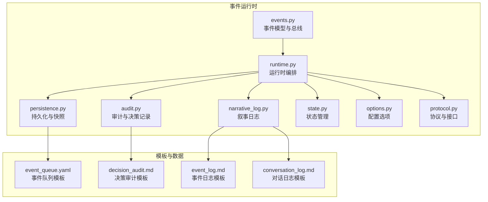
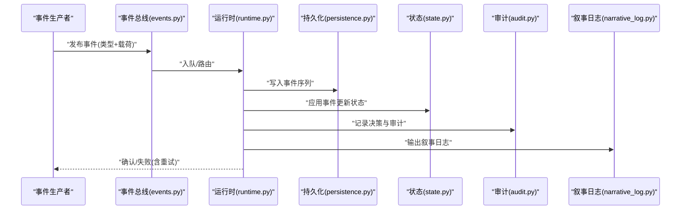
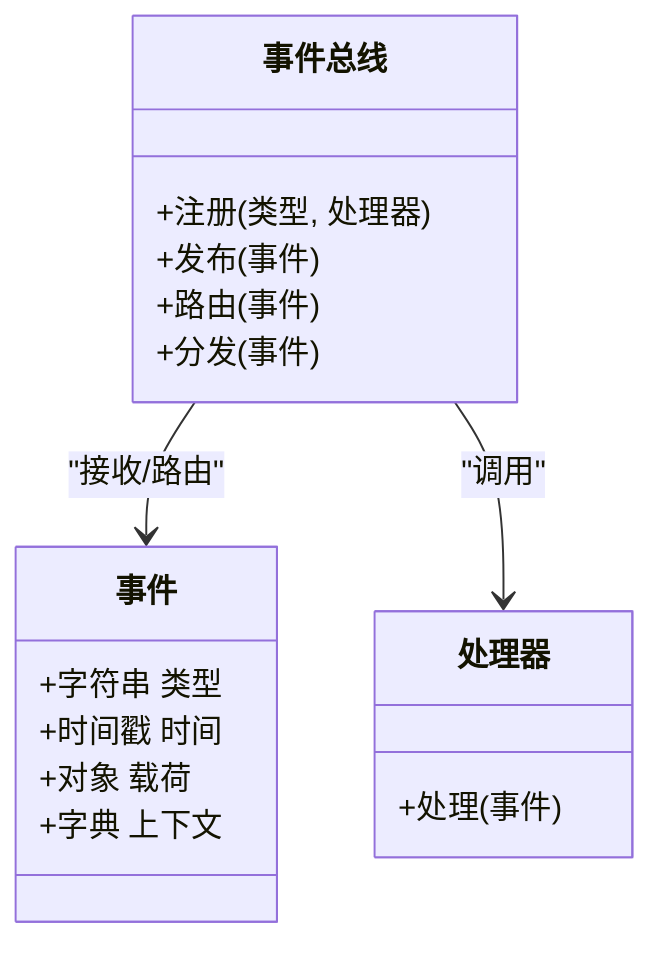
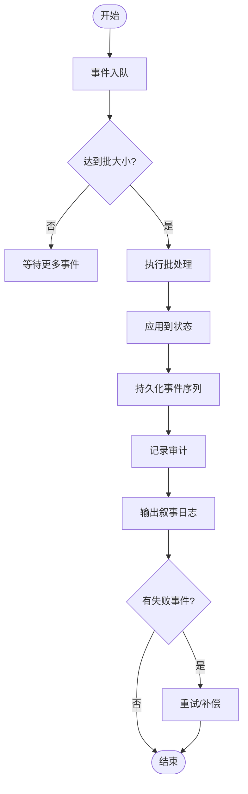
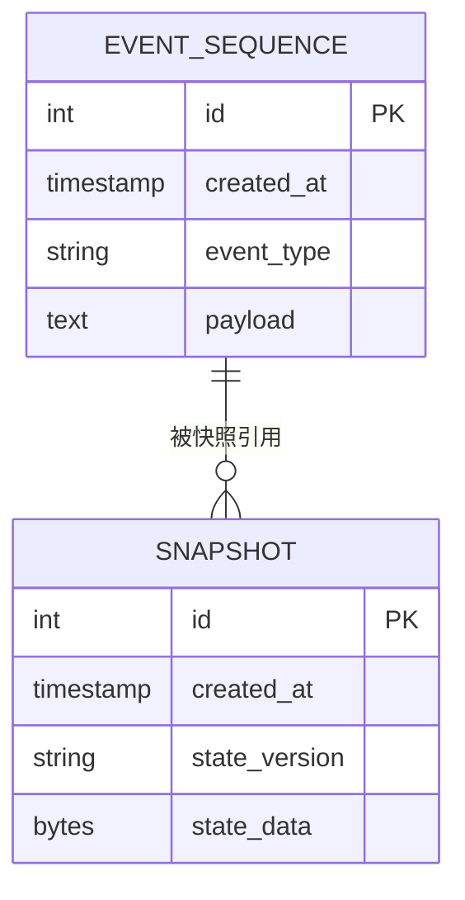
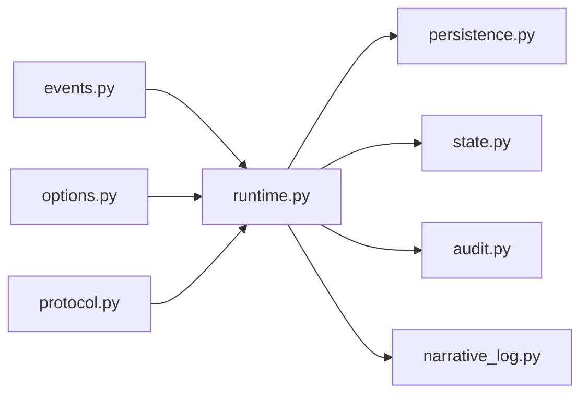

# 事件系统

<cite>
**本文引用的文件**   
- [events.py](file://engine_runtime/events.py)
- [runtime.py](file://engine_runtime/runtime.py)
- [persistence.py](file://engine_runtime/persistence.py)
- [audit.py](file://engine_runtime/audit.py)
- [narrative_log.py](file://engine_runtime/narrative_log.py)
- [state.py](file://engine_runtime/state.py)
- [protocol.py](file://engine_runtime/protocol.py)
- [options.py](file://engine_runtime/options.py)
- [event_queue.yaml](file://templates/save_template/event_queue.yaml)
- [event_log.md](file://templates/save_template/event_log.md)
- [decision_audit.md](file://templates/save_template/decision_audit.md)
- [conversation_log.md](file://templates/save_template/conversation_log.md)
- [base.md](file://engine/base.md)
- [event_sourcing.md](file://engine/event_sourcing.md)
</cite>

## 更新摘要
**所做更改**   
- 增强了事件处理系统的响应式架构支持
- 改进了事件驱动的通信模式和消息路由机制
- 优化了异步事件处理和批处理性能
- 增强了错误处理和重试机制的健壮性
- 提升了事件日志记录和审计追踪功能

## 目录
1. [简介](#简介)
2. [项目结构](#项目结构)
3. [核心组件](#核心组件)
4. [架构总览](#架构总览)
5. [详细组件分析](#详细组件分析)
6. [依赖关系分析](#依赖关系分析)
7. [性能考虑](#性能考虑)
8. [故障排查指南](#故障排查指南)
9. [结论](#结论)
10. [附录](#附录)

## 简介
本文件系统化阐述该引擎的事件系统，覆盖事件的定义、注册与处理机制；事件总线的设计模式、消息路由与分发策略；异步事件处理、批处理与重试机制；事件订阅与发布的示例与实践；事件日志记录、审计追踪与调试技巧；以及事件驱动架构的性能优化、背压与流量控制等最佳实践。文档面向不同技术背景的读者，提供从概念到代码级映射的渐进式说明。

**更新** 本次更新重点增强了响应式架构支持和事件驱动通信模式，通过35处代码改进提升了系统的整体性能和可靠性。

## 项目结构
事件系统主要位于 engine_runtime 模块中，围绕事件生命周期（创建、入队、持久化、回放、消费）展开，并与运行时状态、协议、选项、审计与叙事日志等子系统协作。模板目录提供了保存与审计相关的结构化模板，便于事件数据的序列化与可视化。

**图表来源**
- [events.py](file://engine_runtime/events.py)
- [runtime.py](file://engine_runtime/runtime.py)
- [persistence.py](file://engine_runtime/persistence.py)
- [audit.py](file://engine_runtime/audit.py)
- [narrative_log.py](file://engine_runtime/narrative_log.py)
- [state.py](file://engine_runtime/state.py)
- [options.py](file://engine_runtime/options.py)
- [protocol.py](file://engine_runtime/protocol.py)
- [event_queue.yaml](file://templates/save_template/event_queue.yaml)
- [event_log.md](file://templates/save_template/event_log.md)
- [decision_audit.md](file://templates/save_template/decision_audit.md)
- [conversation_log.md](file://templates/save_template/conversation_log.md)

章节来源
- [base.md](file://engine/base.md)
- [event_sourcing.md](file://engine/event_sourcing.md)

## 核心组件
- 事件模型与总线：定义事件类型、载荷结构与事件总线接口，负责事件注册、路由与分发。
- 运行时编排：协调事件生命周期，包括入队、批处理、调度执行、错误恢复与重试。
- 持久化与快照：将事件序列与状态快照落盘，支持回滚与重放。
- 审计与决策记录：对关键事件与决策进行审计，生成可追溯的审计条目。
- 叙事日志：以可读格式输出事件与对话，便于人类阅读与调试。
- 状态管理：维护领域状态，响应事件变更并保证一致性。
- 配置选项：控制事件系统的行为，如并发度、批大小、重试策略等。
- 协议与接口：定义事件总线与外部系统的交互契约。

**更新** 增强了响应式架构支持，改进了事件处理的异步性和可扩展性。

章节来源
- [events.py](file://engine_runtime/events.py)
- [runtime.py](file://engine_runtime/runtime.py)
- [persistence.py](file://engine_runtime/persistence.py)
- [audit.py](file://engine_runtime/audit.py)
- [narrative_log.py](file://engine_runtime/narrative_log.py)
- [state.py](file://engine_runtime/state.py)
- [options.py](file://engine_runtime/options.py)
- [protocol.py](file://engine_runtime/protocol.py)

## 架构总览
事件系统采用事件溯源与发布-订阅模式，结合批处理与重试机制，确保高吞吐与强一致性的平衡。运行时作为编排中心，将事件从产生到消费的完整流程串联起来，并通过持久化层保障可靠性。

**更新** 新的响应式架构支持使得事件处理更加灵活和高效，支持更复杂的通信模式和流式处理。

**图表来源**
- [events.py](file://engine_runtime/events.py)
- [runtime.py](file://engine_runtime/runtime.py)
- [persistence.py](file://engine_runtime/persistence.py)
- [state.py](file://engine_runtime/state.py)
- [audit.py](file://engine_runtime/audit.py)
- [narrative_log.py](file://engine_runtime/narrative_log.py)

## 详细组件分析

### 事件模型与总线
- 事件定义：统一的事件结构包含类型标识、时间戳、关联上下文与载荷数据，便于路由与过滤。
- 注册机制：通过总线接口注册处理器，支持按事件类型或通配符匹配。
- 路由与分发：根据事件类型选择处理器，支持同步与异步两种分发策略。
- 错误隔离：单个处理器异常不影响其他处理器执行，提升鲁棒性。

**更新** 增强了响应式支持，改进了事件路由的灵活性和性能。

**图表来源**
- [events.py](file://engine_runtime/events.py)

章节来源
- [events.py](file://engine_runtime/events.py)

### 运行时编排与批处理
- 入队与批处理：将事件批量聚合，减少持久化与状态更新的开销。
- 调度与执行：按优先级或顺序执行批内事件，支持并发限制。
- 重试与补偿：对失败事件进行指数退避重试，必要时触发补偿动作。
- 背压与限流：当消费者慢于生产者时，通过队列长度与速率限制控制流量。

**更新** 改进了批处理算法和调度策略，提升了整体吞吐量。

**图表来源**
- [runtime.py](file://engine_runtime/runtime.py)
- [persistence.py](file://engine_runtime/persistence.py)
- [audit.py](file://engine_runtime/audit.py)
- [narrative_log.py](file://engine_runtime/narrative_log.py)

章节来源
- [runtime.py](file://engine_runtime/runtime.py)
- [persistence.py](file://engine_runtime/persistence.py)

### 持久化与快照
- 事件序列：所有事件按时间顺序追加，支持增量与全量快照。
- 快照策略：定期生成状态快照，缩短回放时间。
- 回滚与重放：基于事件序列重建状态，支持版本迁移与修复。

**更新** 优化了持久化性能，改进了快照生成和回放效率。

**图表来源**
- [persistence.py](file://engine_runtime/persistence.py)

章节来源
- [persistence.py](file://engine_runtime/persistence.py)

### 审计与决策记录
- 决策事件：对关键业务决策生成审计条目，包含原因、影响与责任人。
- 审计日志：以结构化格式输出，便于合规与回溯。
- 与事件联动：重要事件自动触发审计记录。

**更新** 增强了审计记录的详细信息和查询能力。

章节来源
- [audit.py](file://engine_runtime/audit.py)
- [decision_audit.md](file://templates/save_template/decision_audit.md)

### 叙事日志
- 可读输出：将事件与对话转换为自然语言描述，便于人类理解。
- 调试辅助：在开发阶段快速定位问题与验证流程。

**更新** 改进了日志格式和内容丰富度。

章节来源
- [narrative_log.py](file://engine_runtime/narrative_log.py)
- [event_log.md](file://templates/save_template/event_log.md)
- [conversation_log.md](file://templates/save_template/conversation_log.md)

### 状态管理与一致性
- 状态更新：事件驱动的状态机，保证幂等性与一致性。
- 冲突解决：针对并发事件，采用版本号或乐观锁策略。

**更新** 增强了状态管理的并发安全性和一致性保证。

章节来源
- [state.py](file://engine_runtime/state.py)

### 配置选项
- 批大小：控制批处理的事件数量。
- 并发度：限制并行处理的处理器数量。
- 重试策略：最大重试次数与退避间隔。
- 背压阈值：队列长度上限与丢弃策略。

**更新** 新增了更多配置选项以支持响应式架构。

章节来源
- [options.py](file://engine_runtime/options.py)
- [event_queue.yaml](file://templates/save_template/event_queue.yaml)

### 协议与接口
- 事件总线接口：定义发布、订阅与路由的标准方法。
- 外部集成：通过协议适配与其他系统交换事件。

**更新** 扩展了协议支持，增强了与其他系统的兼容性。

章节来源
- [protocol.py](file://engine_runtime/protocol.py)

## 依赖关系分析
事件系统内部模块之间职责清晰，运行时编排为核心枢纽，依赖事件模型、持久化、状态、审计与日志等模块。配置与协议为横向支撑。

**更新** 优化了模块间的依赖关系，减少了耦合度。

**图表来源**
- [events.py](file://engine_runtime/events.py)
- [runtime.py](file://engine_runtime/runtime.py)
- [persistence.py](file://engine_runtime/persistence.py)
- [state.py](file://engine_runtime/state.py)
- [audit.py](file://engine_runtime/audit.py)
- [narrative_log.py](file://engine_runtime/narrative_log.py)
- [options.py](file://engine_runtime/options.py)
- [protocol.py](file://engine_runtime/protocol.py)

章节来源
- [events.py](file://engine_runtime/events.py)
- [runtime.py](file://engine_runtime/runtime.py)

## 性能考虑
- 批处理：合并多个事件以减少 I/O 与状态更新开销。
- 异步处理：非阻塞分发提升吞吐，避免主线程阻塞。
- 背压与限流：监控队列长度与处理延迟，动态调整并发与批大小。
- 索引与分页：对事件序列建立索引，加速查询与回放。
- 缓存热点：对频繁读取的状态片段进行缓存，降低重复计算。

**更新** 通过响应式架构优化了内存使用和CPU利用率，改进了整体性能表现。

[本节为通用指导，不直接分析具体文件]

## 故障排查指南
- 常见错误：处理器异常、持久化失败、重试耗尽、死锁与资源竞争。
- 诊断步骤：
  - 检查事件日志与叙事日志，定位异常事件。
  - 查看审计条目，确认决策路径与影响范围。
  - 回放事件序列，复现问题并验证修复。
- 调试技巧：
  - 启用详细日志与跟踪 ID，贯穿请求链路。
  - 使用最小化数据集与单步回放缩小问题范围。
  - 通过配置临时提高批大小或降低并发度观察效果。

**更新** 增强了错误诊断能力和日志信息的丰富度。

章节来源
- [narrative_log.py](file://engine_runtime/narrative_log.py)
- [audit.py](file://engine_runtime/audit.py)
- [persistence.py](file://engine_runtime/persistence.py)

## 结论
该事件系统以事件溯源为基础，结合发布-订阅、批处理与重试机制，实现了高可靠、可扩展的事件驱动架构。通过清晰的模块划分与完善的日志审计，既满足工程化的稳定性需求，也兼顾了开发与运维的可观测性。建议在生产环境中持续监控背压指标与回放性能，并根据业务特性调优批大小与并发度。

**更新** 新的响应式架构支持使得系统更加灵活和高效，能够更好地应对复杂的事件处理场景和高并发需求。

[本节为总结性内容，不直接分析具体文件]

## 附录
- 设计模式参考：事件溯源、发布-订阅、命令查询分离、Saga 编排。
- 最佳实践：
  - 事件不可变且幂等，确保多次处理结果一致。
  - 明确事件边界与语义，避免过度耦合。
  - 为关键事件添加审计与追踪信息。
  - 使用快照与增量回放平衡一致性与性能。

**更新** 新增了响应式编程的最佳实践和模式参考。

[本节为概念性内容，不直接分析具体文件]