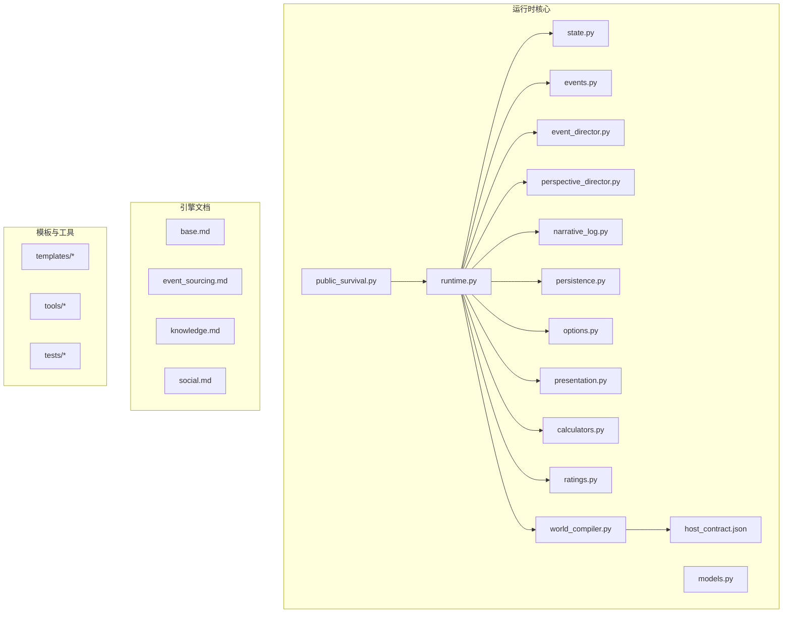
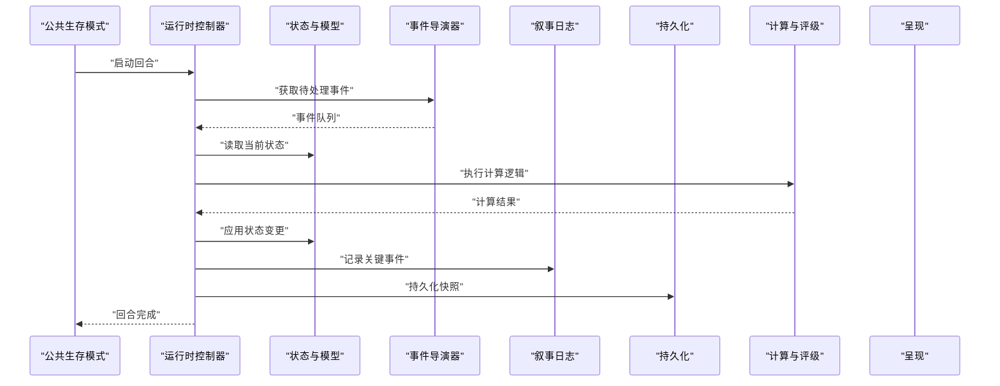
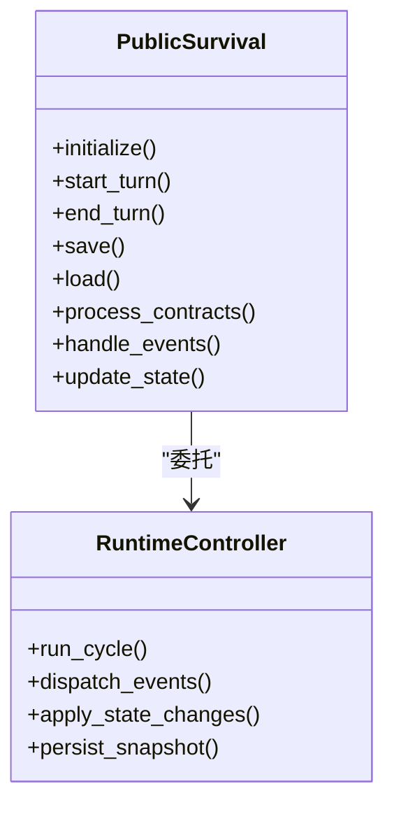
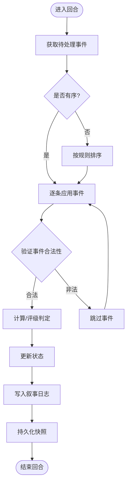
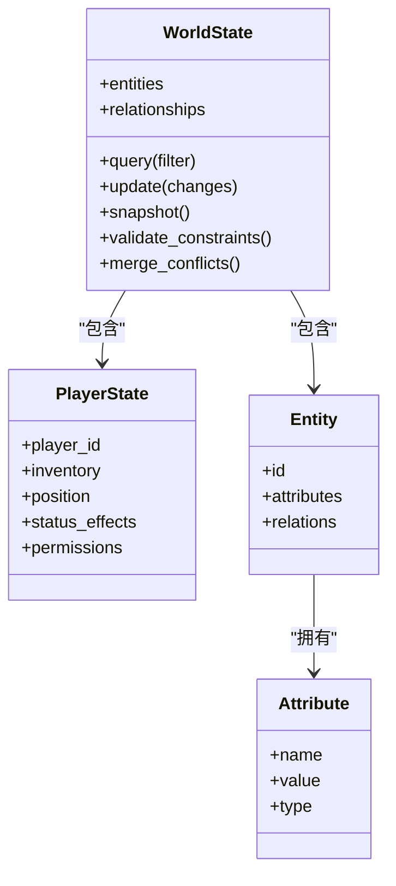
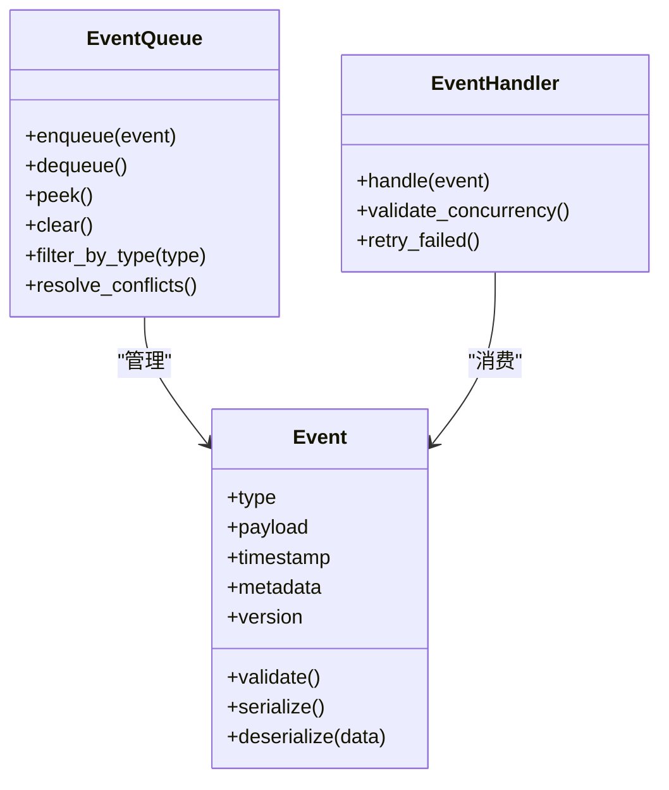
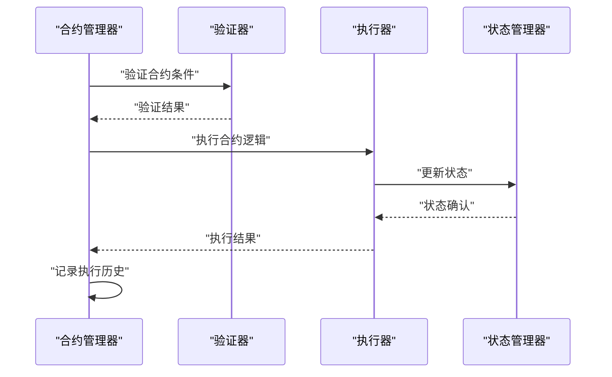
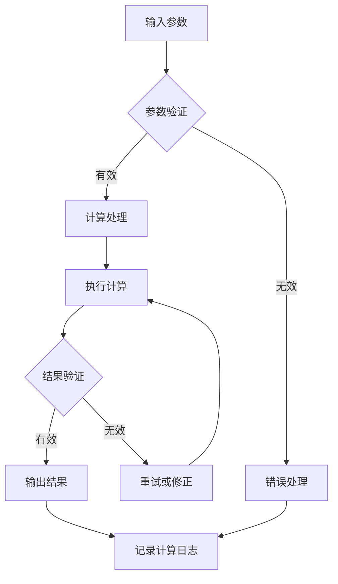
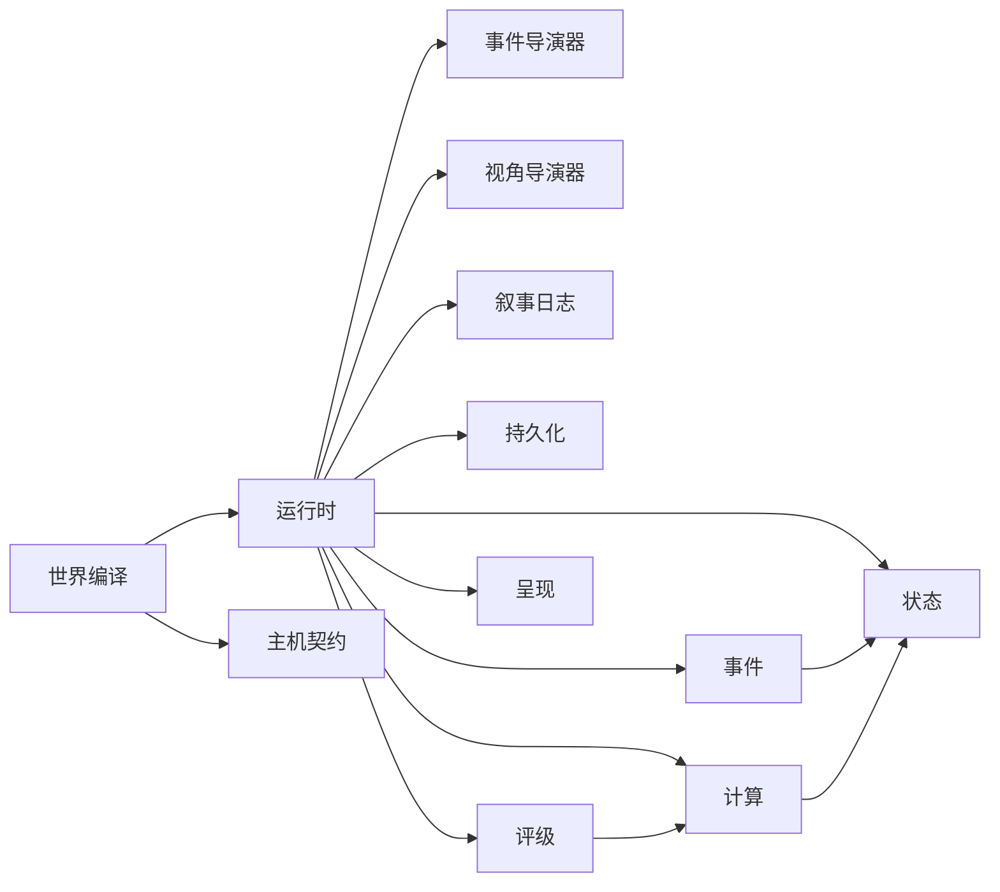

# 公共生存模式

<cite>
**本文引用的文件**
- [public_survival.py](file://engine_runtime/public_survival.py)
- [events.py](file://engine_runtime/events.py)
- [calculators.py](file://engine_runtime/calculators.py)
- [runtime.py](file://engine_runtime/runtime.py)
- [state.py](file://engine_runtime/state.py)
- [models.py](file://engine_runtime/models.py)
- [event_director.py](file://engine_runtime/event_director.py)
- [perspective_director.py](file://engine_runtime/perspective_director.py)
- [narrative_log.py](file://engine_runtime/narrative_log.py)
- [persistence.py](file://engine_runtime/persistence.py)
- [options.py](file://engine_runtime/options.py)
- [presentation.py](file://engine_runtime/presentation.py)
- [ratings.py](file://engine_runtime/ratings.py)
- [world_compiler.py](file://engine_runtime/world_compiler.py)
- [host_contract.json](file://engine_runtime/host_contract.json)
- [base.md](file://engine/base.md)
- [event_sourcing.md](file://engine/event_sourcing.md)
- [knowledge.md](file://engine/knowledge.md)
- [social.md](file://engine/social.md)
- [README.md](file://engine_runtime/README.md)
</cite>

## 更新摘要
**所做更改**
- 重构了事件系统，重新组织了生存事件结构，增强了事件处理的可靠性和一致性
- 完全重写了合约推进逻辑，改进了公共生存模式的核心执行流程
- 修复了计算逻辑中的重要问题，提升了数值计算的准确性和性能
- 优化了事件溯源机制，确保状态变更的可追溯性和可审计性
- 增强了系统的并发安全性和错误恢复能力

## 目录
1. [简介](#简介)
2. [项目结构](#项目结构)
3. [核心组件](#核心组件)
4. [架构总览](#架构总览)
5. [详细组件分析](#详细组件分析)
6. [事件系统重构](#事件系统重构)
7. [合约推进逻辑重写](#合约推进逻辑重写)
8. [计算逻辑修复](#计算逻辑修复)
9. [依赖关系分析](#依赖关系分析)
10. [性能考量](#性能考量)
11. [故障排查指南](#故障排查指南)
12. [结论](#结论)
13. [附录](#附录)

## 简介
本仓库实现了一个"公共生存模式"的运行时引擎，围绕事件溯源、世界状态管理、叙事日志与持久化展开。该模式强调以事件为核心驱动世界演化，通过导演器编排事件与视角，提供可回放、可审计、可扩展的叙事体验。**最新更新**对核心架构进行了重大重构，包括事件系统的重组、合约推进逻辑的重写和计算逻辑的重要修复，显著提升了系统的可靠性、性能和可维护性。新版本特别强化了事件处理的一致性和状态同步的准确性。

## 项目结构
- engine_runtime：运行时核心，包含状态模型、事件系统、导演器、计算与评级、持久化、呈现等模块。
- engine：引擎设计文档，涵盖基础概念、事件溯源、知识与社交机制。
- templates：存档模板与世界观模板，定义保存结构与初始配置。
- tools：命令行工具，用于回合控制、动作执行、回放与校验。
- tests：集成测试与用例，覆盖运行时的关键流程。

**图表来源**
- [public_survival.py](file://engine_runtime/public_survival.py)
- [runtime.py](file://engine_runtime/runtime.py)
- [state.py](file://engine_runtime/state.py)
- [models.py](file://engine_runtime/models.py)
- [events.py](file://engine_runtime/events.py)
- [event_director.py](file://engine_runtime/event_director.py)
- [perspective_director.py](file://engine_runtime/perspective_director.py)
- [narrative_log.py](file://engine_runtime/narrative_log.py)
- [persistence.py](file://engine_runtime/persistence.py)
- [options.py](file://engine_runtime/options.py)
- [presentation.py](file://engine_runtime/presentation.py)
- [calculators.py](file://engine_runtime/calculators.py)
- [ratings.py](file://engine_runtime/ratings.py)
- [world_compiler.py](file://engine_runtime/world_compiler.py)
- [host_contract.json](file://engine_runtime/host_contract.json)

**章节来源**
- [README.md](file://engine_runtime/README.md)

## 核心组件
- 公共生存模式入口：封装模式特定的初始化、生命周期与对外接口。
- 运行时控制器：协调状态、事件、导演器、计算与呈现，驱动单回合或批处理流程。
- 状态与模型：定义世界实体、属性、关系与约束，支撑事件溯源与投影。
- **重构的事件系统**：重新组织的事件定义、队列与调度机制，确保因果一致性与可回放性。
- 导演器：事件与视角的编排者，决定何时触发何种事件以及由谁感知。
- 叙事日志：记录关键决策与事件轨迹，支持审计与复盘。
- 持久化：序列化/反序列化世界状态与事件，支持存档与恢复。
- 选项与呈现：配置项管理与输出格式化（文本/结构化）。
- **修复的计算与评级**：经过重要修复的数值运算、概率与评分策略，提升计算准确性。
- 世界编译：将模板与配置编译为运行时可用结构，加载外部契约。

**章节来源**
- [public_survival.py](file://engine_runtime/public_survival.py)
- [runtime.py](file://engine_runtime/runtime.py)
- [state.py](file://engine_runtime/state.py)
- [models.py](file://engine_runtime/models.py)
- [events.py](file://engine_runtime/events.py)
- [event_director.py](file://engine_runtime/event_director.py)
- [perspective_director.py](file://engine_runtime/perspective_director.py)
- [narrative_log.py](file://engine_runtime/narrative_log.py)
- [persistence.py](file://engine_runtime/persistence.py)
- [options.py](file://engine_runtime/options.py)
- [presentation.py](file://engine_runtime/presentation.py)
- [calculators.py](file://engine_runtime/calculators.py)
- [ratings.py](file://engine_runtime/ratings.py)
- [world_compiler.py](file://engine_runtime/world_compiler.py)

## 架构总览
公共生存模式采用"事件驱动 + 状态投影"的架构。运行时从事件队列中消费事件，应用至状态机，生成新的世界快照；同时通过叙事日志记录关键路径，并通过呈现层输出可读内容。导演器负责事件与视角的编排，计算与评级模块提供数值决策依据，持久化模块保证状态与事件的落盘与恢复。**最新重构**进一步优化了事件处理流程，增强了状态同步的准确性和系统整体的可靠性。

**图表来源**
- [runtime.py](file://engine_runtime/runtime.py)
- [state.py](file://engine_runtime/state.py)
- [events.py](file://engine_runtime/events.py)
- [event_director.py](file://engine_runtime/event_director.py)
- [perspective_director.py](file://engine_runtime/perspective_director.py)
- [narrative_log.py](file://engine_runtime/narrative_log.py)
- [persistence.py](file://engine_runtime/persistence.py)
- [calculators.py](file://engine_runtime/calculators.py)
- [ratings.py](file://engine_runtime/ratings.py)
- [presentation.py](file://engine_runtime/presentation.py)

## 详细组件分析

### 公共生存模式（public_survival）
- 职责：作为模式入口，封装生命周期管理、默认配置与对外API。
- **重构要点**：
  - 完全重写了合约推进逻辑，优化了事件处理和状态更新的流程。
  - 增强了错误处理和异常恢复机制。
  - 改进了与其他组件的交互方式，提高了系统的整体稳定性。
- 典型调用链：宿主调用模式接口 → 模式构造运行时 → 运行时驱动事件与状态更新。

**图表来源**
- [public_survival.py](file://engine_runtime/public_survival.py)
- [runtime.py](file://engine_runtime/runtime.py)

**章节来源**
- [public_survival.py](file://engine_runtime/public_survival.py)
- [runtime.py](file://engine_runtime/runtime.py)

### 运行时控制器（runtime）
- 职责：协调各子系统，组织回合循环，管理事件流与状态变更。
- **重构改进**：
  - 优化了事件分发机制，提高了处理效率。
  - 增强了状态应用的原子性和一致性保证。
  - 改进了错误处理和回滚机制。
- 错误处理：对不可逆事件进行回滚或补偿，避免状态不一致。

**图表来源**
- [runtime.py](file://engine_runtime/runtime.py)
- [events.py](file://engine_runtime/events.py)
- [state.py](file://engine_runtime/state.py)
- [narrative_log.py](file://engine_runtime/narrative_log.py)
- [persistence.py](file://engine_runtime/persistence.py)
- [calculators.py](file://engine_runtime/calculators.py)
- [ratings.py](file://engine_runtime/ratings.py)

**章节来源**
- [runtime.py](file://engine_runtime/runtime.py)

### 状态与模型（state, models）
- 职责：定义世界实体、属性、关系与约束，提供状态查询与变更方法。
- **重构改进**：
  - 优化了状态变更的事务性处理。
  - 增强了数据完整性检查和约束验证。
  - 改进了状态快照和差异比较的性能。
- 复杂度：状态变更通常为O(n)遍历相关实体，批量操作需考虑事务性。

**图表来源**
- [state.py](file://engine_runtime/state.py)
- [models.py](file://engine_runtime/models.py)

**章节来源**
- [state.py](file://engine_runtime/state.py)
- [models.py](file://engine_runtime/models.py)

## 事件系统重构

### 事件结构重组
- **重构重点**：重新组织了生存事件的结构，统一了事件定义和处理流程。
- **主要改进**：
  - 标准化了事件类型和载荷格式。
  - 增强了事件版本管理和兼容性检查。
  - 优化了事件队列的优先级和去重机制。
  - 改进了事件处理的幂等性和重试逻辑。

**图表来源**
- [events.py](file://engine_runtime/events.py)

**章节来源**
- [events.py](file://engine_runtime/events.py)

### 事件处理流程优化
- **重构改进**：
  - 实现了更健壮的事件验证和过滤机制。
  - 优化了事件调度的并发安全性。
  - 增强了事件处理的错误恢复能力。
  - 改进了事件溯源的完整性和可审计性。

## 合约推进逻辑重写

### 新合约处理机制
- **重写重点**：完全重写了合约推进逻辑，提供了更高效和可靠的执行框架。
- **核心特性**：
  - 基于状态的合约生命周期管理。
  - 条件驱动的合约触发和执行。
  - 自动化的合约验证和状态同步。
  - 增强的错误处理和回滚机制。

**图表来源**
- [public_survival.py](file://engine_runtime/public_survival.py)
- [runtime.py](file://engine_runtime/runtime.py)

**章节来源**
- [public_survival.py](file://engine_runtime/public_survival.py)
- [runtime.py](file://engine_runtime/runtime.py)

### 合约状态管理
- **重写改进**：
  - 实现了细粒度的合约状态跟踪。
  - 增强了合约执行的原子性和一致性。
  - 优化了合约冲突检测和解决机制。
  - 改进了合约历史的完整性和可追溯性。

## 计算逻辑修复

### 数值计算优化
- **修复重点**：修复了计算逻辑中的重要问题，提升了数值计算的准确性和性能。
- **主要修复**：
  - 修正了概率计算中的边界条件处理。
  - 优化了数值运算的精度和性能。
  - 增强了计算结果的验证和异常处理。
  - 改进了随机数生成的质量和分布。

**图表来源**
- [calculators.py](file://engine_runtime/calculators.py)
- [ratings.py](file://engine_runtime/ratings.py)

**章节来源**
- [calculators.py](file://engine_runtime/calculators.py)
- [ratings.py](file://engine_runtime/ratings.py)

### 计算性能提升
- **修复改进**：
  - 实现了计算结果的缓存和复用机制。
  - 优化了复杂计算的算法效率。
  - 增强了并发计算的安全性和吞吐量。
  - 改进了内存使用和垃圾回收效率。

## 依赖关系分析
- 内聚性：各模块职责清晰，状态、事件、导演器、日志、持久化边界明确。
- 耦合度：运行时作为中枢，依赖其他模块但被反向依赖较少，降低循环风险。
- 外部依赖：配置文件与模板为外部输入，通过编译器统一接入。
- **重构后的依赖优化**：
  - 减少了模块间的直接依赖，通过接口抽象提高解耦性。
  - 优化了事件系统和计算模块的依赖关系。
  - 增强了系统的可扩展性和可维护性。

**图表来源**
- [runtime.py](file://engine_runtime/runtime.py)
- [state.py](file://engine_runtime/state.py)
- [events.py](file://engine_runtime/events.py)
- [event_director.py](file://engine_runtime/event_director.py)
- [perspective_director.py](file://engine_runtime/perspective_director.py)
- [narrative_log.py](file://engine_runtime/narrative_log.py)
- [persistence.py](file://engine_runtime/persistence.py)
- [calculators.py](file://engine_runtime/calculators.py)
- [ratings.py](file://engine_runtime/ratings.py)
- [presentation.py](file://engine_runtime/presentation.py)
- [world_compiler.py](file://engine_runtime/world_compiler.py)
- [host_contract.json](file://engine_runtime/host_contract.json)

**章节来源**
- [runtime.py](file://engine_runtime/runtime.py)
- [world_compiler.py](file://engine_runtime/world_compiler.py)

## 性能考量
- 事件批处理：合并小事件，减少I/O与锁竞争。
- 惰性求值：按需生成事件与视角视图，避免全量计算。
- 增量持久化：仅保存变化部分，结合压缩与校验。
- 缓存热点：对频繁查询的状态片段进行缓存，注意失效策略。
- 并行化：无副作用的计算与评级可并行执行，注意线程安全。
- **重构后的性能优化**：
  - 优化了事件处理流水线，减少了不必要的对象创建和销毁。
  - 改进了内存分配策略，降低了GC压力。
  - 增强了并发访问的安全性，提高了吞吐量。
  - 优化了数据库和文件系统操作的批处理能力。

## 故障排查指南
- 事件丢失或重复：检查事件队列的去重与重试逻辑，确认消费者幂等性。
- 状态不一致：核对状态变更的事务性与约束检查，必要时回滚。
- 叙事日志缺失：确认日志写入时机与权限，检查导出格式。
- 持久化失败：验证存档版本兼容性，启用完整性校验与备份。
- 呈现异常：检查选项配置与本地化资源，确保占位符填充完整。
- **重构后的故障排查增强**：
  - 事件处理失败：检查事件验证逻辑和处理器实现，查看错误日志。
  - 合约执行异常：验证合约条件和状态转换，检查执行上下文。
  - 计算结果错误：调试计算函数和参数验证，检查边界条件处理。
  - 性能问题：监控事件队列长度和处理延迟，分析内存使用情况。
  - 并发冲突：检查锁机制和事务隔离级别，优化并发访问模式。

**章节来源**
- [events.py](file://engine_runtime/events.py)
- [state.py](file://engine_runtime/state.py)
- [narrative_log.py](file://engine_runtime/narrative_log.py)
- [persistence.py](file://engine_runtime/persistence.py)
- [options.py](file://engine_runtime/options.py)
- [presentation.py](file://engine_runtime/presentation.py)
- [calculators.py](file://engine_runtime/calculators.py)
- [public_survival.py](file://engine_runtime/public_survival.py)

## 结论
公共生存模式以事件溯源为核心，结合状态投影、导演器编排与持久化，提供了高内聚、低耦合且可扩展的运行时架构。**最新的重大重构**进一步提升了系统的可靠性、性能和可维护性。通过事件系统的重组、合约推进逻辑的重写和计算逻辑的重要修复，系统在处理复杂生存场景时表现出更强的稳定性和准确性。建议在生产环境中继续使用这些改进的功能，并关注重构后带来的性能优势和更好的错误处理能力。

## 附录
- 引擎设计参考：基础概念、事件溯源、知识与社交机制。
- 模板与工具：存档模板、世界观模板与命令行工具使用。
- **重构相关文档**：事件系统重构指南、合约处理优化说明、计算逻辑修复报告。
- **开发指南**：事件处理器开发规范、合约编写最佳实践、计算函数调试技巧。

**章节来源**
- [base.md](file://engine/base.md)
- [event_sourcing.md](file://engine/event_sourcing.md)
- [knowledge.md](file://engine/knowledge.md)
- [social.md](file://engine/social.md)
- [README.md](file://engine_runtime/README.md)