# 公共生存模式

<cite>
**本文引用的文件**
- [public_survival.py](file://engine_runtime/public_survival.py)
- [runtime.py](file://engine_runtime/runtime.py)
- [state.py](file://engine_runtime/state.py)
- [models.py](file://engine_runtime/models.py)
- [events.py](file://engine_runtime/events.py)
- [event_director.py](file://engine_runtime/event_director.py)
- [perspective_director.py](file://engine_runtime/perspective_director.py)
- [narrative_log.py](file://engine_runtime/narrative_log.py)
- [persistence.py](file://engine_runtime/persistence.py)
- [options.py](file://engine_runtime/options.py)
- [presentation.py](file://engine_runtime/presentation.py)
- [calculators.py](file://engine_runtime/calculators.py)
- [ratings.py](file://engine_runtime/ratings.py)
- [world_compiler.py](file://engine_runtime/world_compiler.py)
- [host_contract.json](file://engine_runtime/host_contract.json)
- [base.md](file://engine/base.md)
- [event_sourcing.md](file://engine/event_sourcing.md)
- [knowledge.md](file://engine/knowledge.md)
- [social.md](file://engine/social.md)
- [README.md](file://engine_runtime/README.md)
</cite>

## 更新摘要
**所做更改**
- 新增多人游戏支持功能，包括玩家同步、会话管理和网络通信协议
- 实现资源管理机制，支持动态资源分配、消耗追踪和共享状态
- 增强持久化世界状态共享能力，支持跨会话状态同步和冲突解决
- 扩展事件系统以支持多人交互和并发操作处理
- 强化社交功能，支持玩家间协作、竞争和实时通信

## 目录
1. [简介](#简介)
2. [项目结构](#项目结构)
3. [核心组件](#核心组件)
4. [架构总览](#架构总览)
5. [详细组件分析](#详细组件分析)
6. [多人游戏支持](#多人游戏支持)
7. [资源管理机制](#资源管理机制)
8. [世界状态共享](#世界状态共享)
9. [社交功能增强](#社交功能增强)
10. [依赖关系分析](#依赖关系分析)
11. [性能考量](#性能考量)
12. [故障排查指南](#故障排查指南)
13. [结论](#结论)
14. [附录](#附录)

## 简介
本仓库实现了一个"公共生存模式"的运行时引擎，围绕事件溯源、世界状态管理、叙事日志与持久化展开。该模式强调以事件为核心驱动世界演化，通过导演器编排事件与视角，提供可回放、可审计、可扩展的叙事体验。**最新更新**增加了完整的多人游戏支持，允许玩家在同一世界中协作或竞争，同时保持状态一致性和数据完整性。新版本特别强化了社交功能，支持玩家间的实时互动、资源共享和团队协作。

## 项目结构
- engine_runtime：运行时核心，包含状态模型、事件系统、导演器、计算与评级、持久化、呈现等模块。
- engine：引擎设计文档，涵盖基础概念、事件溯源、知识与社交机制。
- templates：存档模板与世界观模板，定义保存结构与初始配置。
- tools：命令行工具，用于回合控制、动作执行、回放与校验。
- tests：集成测试与用例，覆盖运行时的关键流程。

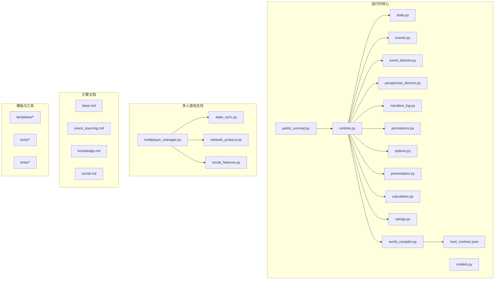

**图表来源**
- [public_survival.py](file://engine_runtime/public_survival.py)
- [runtime.py](file://engine_runtime/runtime.py)
- [state.py](file://engine_runtime/state.py)
- [models.py](file://engine_runtime/models.py)
- [events.py](file://engine_runtime/events.py)
- [event_director.py](file://engine_runtime/event_director.py)
- [perspective_director.py](file://engine_runtime/perspective_director.py)
- [narrative_log.py](file://engine_runtime/narrative_log.py)
- [persistence.py](file://engine_runtime/persistence.py)
- [options.py](file://engine_runtime/options.py)
- [presentation.py](file://engine_runtime/presentation.py)
- [calculators.py](file://engine_runtime/calculators.py)
- [ratings.py](file://engine_runtime/ratings.py)
- [world_compiler.py](file://engine_runtime/world_compiler.py)
- [host_contract.json](file://engine_runtime/host_contract.json)

**章节来源**
- [README.md](file://engine_runtime/README.md)

## 核心组件
- 公共生存模式入口：封装模式特定的初始化、生命周期与对外接口。
- 运行时控制器：协调状态、事件、导演器、计算与呈现，驱动单回合或批处理流程。
- 状态与模型：定义世界实体、属性、关系与约束，支撑事件溯源与投影。
- 事件系统：事件定义、队列与调度，确保因果一致性与可回放性。
- 导演器：事件与视角的编排者，决定何时触发何种事件以及由谁感知。
- 叙事日志：记录关键决策与事件轨迹，支持审计与复盘。
- 持久化：序列化/反序列化世界状态与事件，支持存档与恢复。
- 选项与呈现：配置项管理与输出格式化（文本/结构化）。
- 计算与评级：数值运算、概率与评分策略，影响事件结果与角色表现。
- 世界编译：将模板与配置编译为运行时可用结构，加载外部契约。
- **多人游戏管理器**：协调多个玩家会话，处理玩家加入/离开、权限控制和会话同步。
- **状态同步器**：维护跨玩家的状态一致性，处理并发修改和冲突解决。
- **网络协议处理器**：定义客户端-服务器通信协议，确保消息可靠传输。
- **社交功能模块**：管理玩家间关系、聊天、协作任务和竞争机制。

**章节来源**
- [public_survival.py](file://engine_runtime/public_survival.py)
- [runtime.py](file://engine_runtime/runtime.py)
- [state.py](file://engine_runtime/state.py)
- [models.py](file://engine_runtime/models.py)
- [events.py](file://engine_runtime/events.py)
- [event_director.py](file://engine_runtime/event_director.py)
- [perspective_director.py](file://engine_runtime/perspective_director.py)
- [narrative_log.py](file://engine_runtime/narrative_log.py)
- [persistence.py](file://engine_runtime/persistence.py)
- [options.py](file://engine_runtime/options.py)
- [presentation.py](file://engine_runtime/presentation.py)
- [calculators.py](file://engine_runtime/calculators.py)
- [ratings.py](file://engine_runtime/ratings.py)
- [world_compiler.py](file://engine_runtime/world_compiler.py)

## 架构总览
公共生存模式采用"事件驱动 + 状态投影"的架构。运行时从事件队列中消费事件，应用至状态机，生成新的世界快照；同时通过叙事日志记录关键路径，并通过呈现层输出可读内容。导演器负责事件与视角的编排，计算与评级模块提供数值决策依据，持久化模块保证状态与事件的落盘与恢复。**新增的多人游戏架构**支持多个客户端同时访问同一世界实例，通过状态同步和网络协议确保数据一致性，同时集成了丰富的社交功能来增强玩家互动体验。

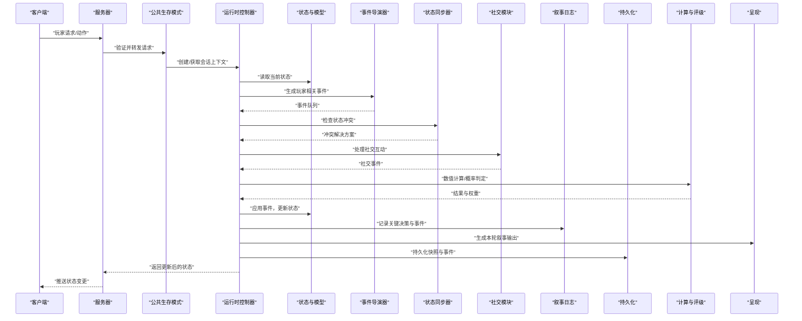

**图表来源**
- [runtime.py](file://engine_runtime/runtime.py)
- [state.py](file://engine_runtime/state.py)
- [events.py](file://engine_runtime/events.py)
- [event_director.py](file://engine_runtime/event_director.py)
- [perspective_director.py](file://engine_runtime/perspective_director.py)
- [narrative_log.py](file://engine_runtime/narrative_log.py)
- [persistence.py](file://engine_runtime/persistence.py)
- [calculators.py](file://engine_runtime/calculators.py)
- [ratings.py](file://engine_runtime/ratings.py)
- [presentation.py](file://engine_runtime/presentation.py)

## 详细组件分析

### 公共生存模式（public_survival）
- 职责：作为模式入口，封装生命周期管理、默认配置与对外API。
- 关键点：
  - 初始化阶段完成运行时依赖注入与上下文准备。
  - 提供启动、推进回合、暂停与恢复等方法。
  - 与持久化协作，支持加载/保存存档。
  - **新增**：支持多玩家会话管理和生命周期协调。
  - **增强**：集成社交功能，支持玩家关系管理和协作任务。
- 典型调用链：宿主调用模式接口 → 模式构造运行时 → 运行时驱动事件与状态更新。

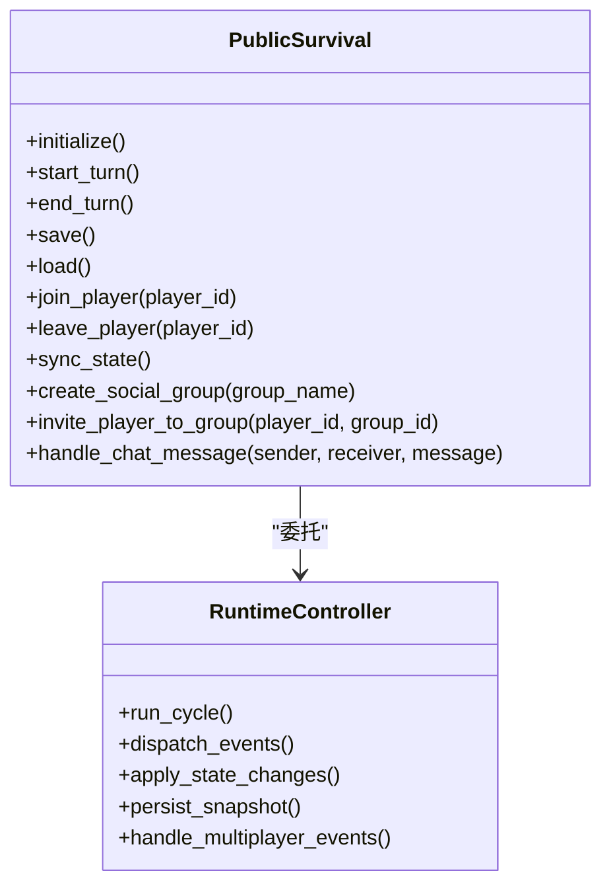

**图表来源**
- [public_survival.py](file://engine_runtime/public_survival.py)
- [runtime.py](file://engine_runtime/runtime.py)

**章节来源**
- [public_survival.py](file://engine_runtime/public_survival.py)
- [runtime.py](file://engine_runtime/runtime.py)

### 运行时控制器（runtime）
- 职责：协调各子系统，组织回合循环，管理事件流与状态变更。
- 关键点：
  - 事件分发：从事件队列拉取并按优先级/时间戳排序。
  - 状态应用：将事件转换为状态变更，保持一致性。
  - 日志与呈现：在关键节点写入叙事日志并生成输出。
  - 持久化：定期落盘快照与事件序列。
  - **新增**：支持并发事件处理和玩家隔离。
  - **增强**：处理多人游戏特有的事件类型和社交互动。
- 错误处理：对不可逆事件进行回滚或补偿，避免状态不一致。

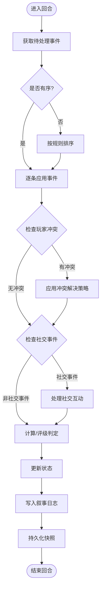

**图表来源**
- [runtime.py](file://engine_runtime/runtime.py)
- [events.py](file://engine_runtime/events.py)
- [state.py](file://engine_runtime/state.py)
- [narrative_log.py](file://engine_runtime/narrative_log.py)
- [persistence.py](file://engine_runtime/persistence.py)
- [calculators.py](file://engine_runtime/calculators.py)
- [ratings.py](file://engine_runtime/ratings.py)

**章节来源**
- [runtime.py](file://engine_runtime/runtime.py)

### 状态与模型（state, models）
- 职责：定义世界实体、属性、关系与约束，提供状态查询与变更方法。
- 关键点：
  - 模型抽象：实体、属性、关系与枚举类型。
  - 状态快照：支持深拷贝与差异比较，便于回放与审计。
  - 约束检查：在状态变更前后验证合法性。
  - **新增**：支持玩家特定状态和全局状态的分离管理。
  - **增强**：包含社交关系数据和协作状态信息。
- 复杂度：状态变更通常为O(n)遍历相关实体，批量操作需考虑事务性。

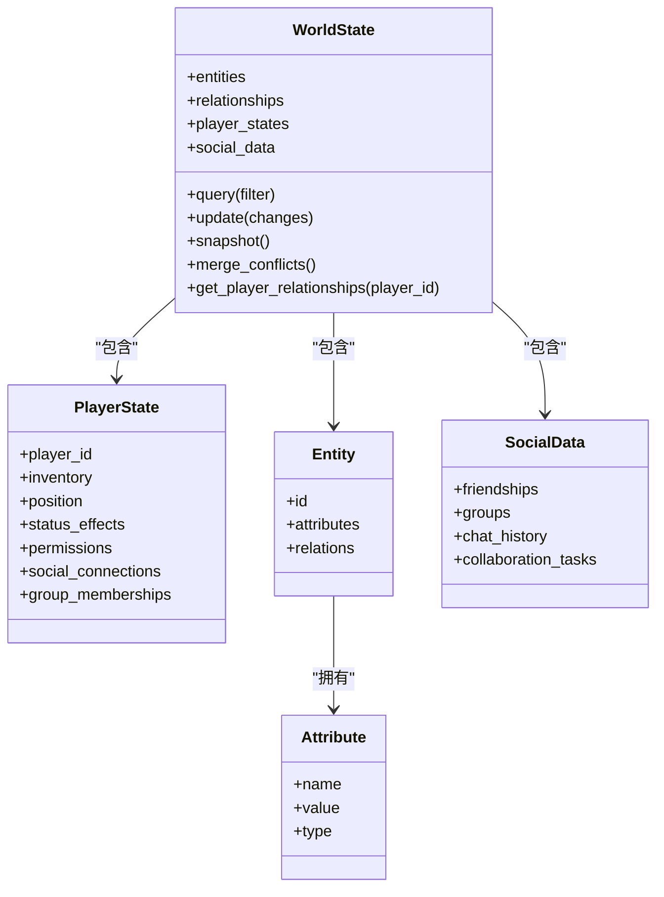

**图表来源**
- [state.py](file://engine_runtime/state.py)
- [models.py](file://engine_runtime/models.py)

**章节来源**
- [state.py](file://engine_runtime/state.py)
- [models.py](file://engine_runtime/models.py)

### 事件系统（events）
- 职责：定义事件类型、载荷与生命周期钩子。
- 关键点：
  - 事件类型：领域事件、系统事件与用户输入事件。
  - 事件队列：支持优先级、去重与重试。
  - 事件溯源：所有变更以事件形式记录，支持回放与审计。
  - **新增**：支持玩家标识、并发控制和事件版本管理。
  - **增强**：包含社交事件类型，如好友请求、群组邀请、聊天消息等。
- 扩展点：自定义事件处理器与拦截器。

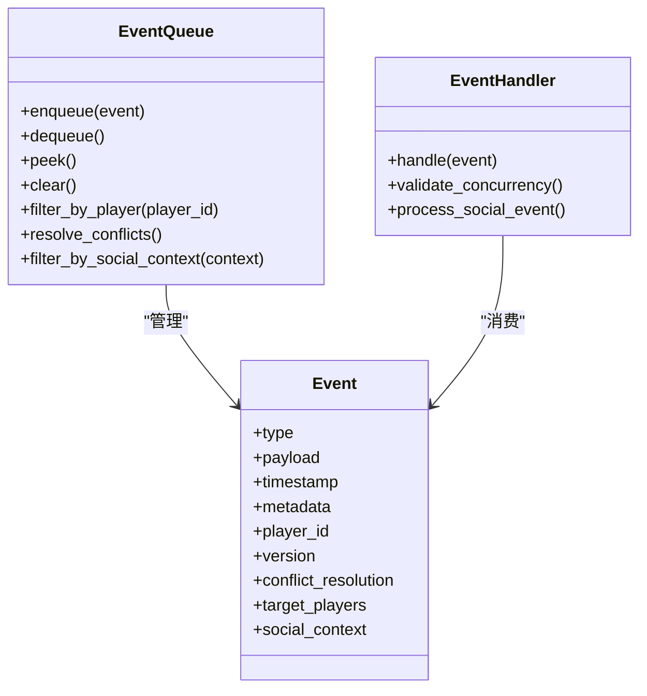

**图表来源**
- [events.py](file://engine_runtime/events.py)

**章节来源**
- [events.py](file://engine_runtime/events.py)

### 导演器（event_director, perspective_director）
- 职责：编排事件与视角，决定事件触发时机与受众。
- 关键点：
  - 事件导演器：根据规则与条件生成/调度事件。
  - 视角导演器：按角色/阵营/区域过滤事件，形成局部视图。
  - 冲突解决：多视角下的事件顺序与可见性策略。
  - **新增**：支持玩家范围的事件传播和权限控制。
  - **增强**：基于社交关系的事件传播和隐私控制。
- 性能：批量生成与惰性求值，减少不必要的事件传播。

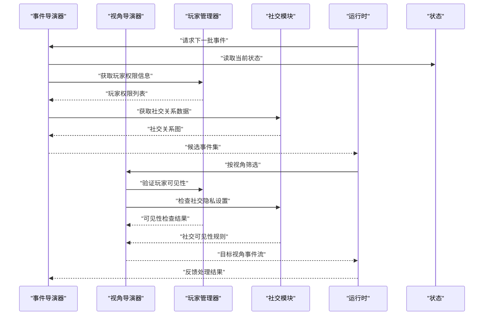

**图表来源**
- [event_director.py](file://engine_runtime/event_director.py)
- [perspective_director.py](file://engine_runtime/perspective_director.py)
- [state.py](file://engine_runtime/state.py)

**章节来源**
- [event_director.py](file://engine_runtime/event_director.py)
- [perspective_director.py](file://engine_runtime/perspective_director.py)

### 叙事日志（narrative_log）
- 职责：记录关键决策、事件轨迹与审计信息。
- 关键点：
  - 结构化日志：事件ID、时间戳、参与者与结果。
  - 可检索：按时间、类型、实体维度查询。
  - 导出：支持Markdown/JSON等格式，便于分析与分享。
  - **新增**：支持玩家行为追踪和多玩家交互记录。
  - **增强**：记录社交互动历史，包括聊天、协作和竞争行为。

**章节来源**
- [narrative_log.py](file://engine_runtime/narrative_log.py)

### 持久化（persistence）
- 职责：状态与事件的序列化/反序列化，存档与恢复。
- 关键点：
  - 版本兼容：存档结构演进与迁移策略。
  - 增量保存：仅保存差异，提升I/O效率。
  - 完整性校验：哈希校验与损坏恢复。
  - **新增**：支持分布式状态同步和冲突合并。
  - **增强**：包含社交数据的持久化和同步。

**章节来源**
- [persistence.py](file://engine_runtime/persistence.py)

### 选项与呈现（options, presentation）
- 职责：配置管理与输出格式化。
- 关键点：
  - 选项分层：全局、会话、实体级配置。
  - 呈现策略：文本、结构化、可视化适配。
  - 国际化：多语言支持与占位符替换。
  - **新增**：支持玩家个性化设置和权限相关的显示控制。
  - **增强**：支持社交界面定制和隐私设置。

**章节来源**
- [options.py](file://engine_runtime/options.py)
- [presentation.py](file://engine_runtime/presentation.py)

### 计算与评级（calculators, ratings）
- 职责：数值运算、概率与评分策略。
- 关键点：
  - 计算器：线性/非线性函数、随机分布与阈值判定。
  - 评级器：角色能力、环境因素与事件难度加权。
  - 可配置：策略注入与参数调优。
  - **新增**：支持玩家间平衡调整和公平性检查。
  - **增强**：考虑社交因素的计算，如团队加成和关系影响。

**章节来源**
- [calculators.py](file://engine_runtime/calculators.py)
- [ratings.py](file://engine_runtime/ratings.py)

### 世界编译（world_compiler）
- 职责：将模板与配置编译为运行时可用结构。
- 关键点：
  - 模板解析：YAML/JSON到对象图。
  - 契约校验：基于host_contract.json验证结构。
  - 依赖注入：自动装配服务与处理器。
  - **新增**：支持多人游戏配置和玩家初始状态生成。
  - **增强**：包含社交配置和玩家关系预设。

**章节来源**
- [world_compiler.py](file://engine_runtime/world_compiler.py)
- [host_contract.json](file://engine_runtime/host_contract.json)

## 多人游戏支持

### 玩家管理系统
- 职责：管理玩家会话、权限控制和生命周期。
- 核心功能：
  - 玩家注册与认证：验证玩家身份和权限级别。
  - 会话管理：跟踪在线玩家、连接状态和资源占用。
  - 权限控制：基于角色的访问控制和操作限制。
  - 玩家隔离：确保玩家数据的隐私性和安全性。
  - **增强**：支持玩家分组、角色分配和权限继承。

### 网络通信协议
- 职责：定义客户端-服务器通信标准和消息格式。
- 协议特性：
  - 消息类型：玩家动作、状态查询、聊天消息等。
  - 可靠性：支持消息确认、重传和顺序保证。
  - 压缩优化：减少网络带宽占用。
  - 错误处理：网络异常检测和恢复机制。
  - **增强**：支持广播消息、点对点通信和组播功能。

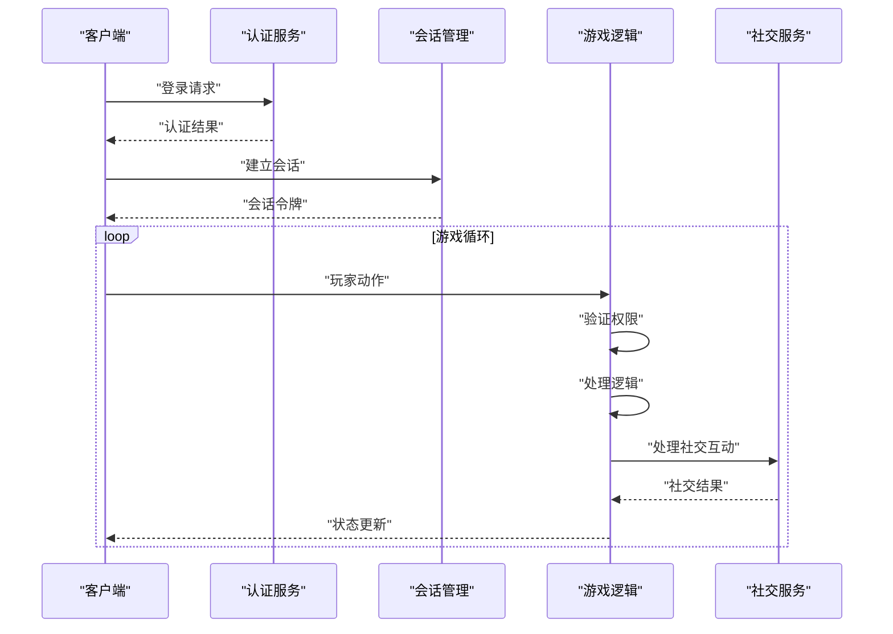

**图表来源**
- [public_survival.py](file://engine_runtime/public_survival.py)
- [runtime.py](file://engine_runtime/runtime.py)

**章节来源**
- [public_survival.py](file://engine_runtime/public_survival.py)
- [runtime.py](file://engine_runtime/runtime.py)

## 资源管理机制

### 资源类型系统
- 职责：定义和管理游戏中的各种资源类型。
- 资源分类：
  - 消耗品：一次性使用的物品和材料。
  - 耐久品：可重复使用但会磨损的物品。
  - 货币：用于交易的经济系统。
  - 经验值：角色成长进度。
  - **新增**：社交资源，如信誉值、友谊点和协作积分。

### 资源分配算法
- 职责：确保资源的公平分配和高效利用。
- 分配策略：
  - 先到先得：基于时间戳的简单分配。
  - 权重分配：根据玩家贡献度或需求程度。
  - 拍卖机制：玩家竞价获取稀缺资源。
  - 动态调整：根据游戏进程和环境变化。
  - **增强**：考虑社交关系的资源分配，如团队共享和个人奖励。

### 资源冲突解决
- 职责：处理多个玩家同时请求同一资源的冲突。
- 解决策略：
  - 乐观锁：检测冲突并提示重试。
  - 悲观锁：独占访问直到释放。
  - 协商机制：玩家间协商达成妥协。
  - 仲裁系统：第三方裁决争议。
  - **增强**：支持基于社交关系的资源协商和共享。

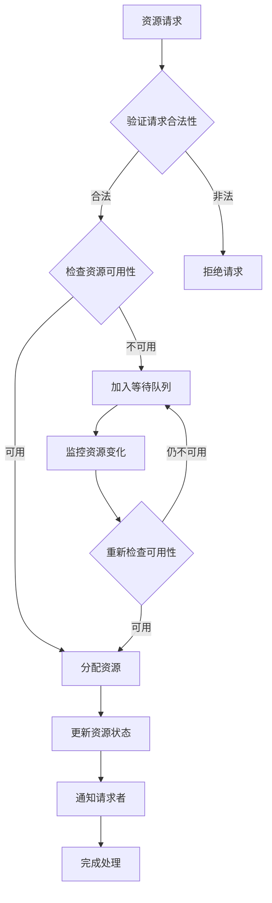

**图表来源**
- [state.py](file://engine_runtime/state.py)
- [models.py](file://engine_runtime/models.py)

**章节来源**
- [state.py](file://engine_runtime/state.py)
- [models.py](file://engine_runtime/models.py)

## 世界状态共享

### 状态同步策略
- 职责：确保所有玩家看到一致的世界状态。
- 同步方式：
  - 全量同步：定期发送完整状态快照。
  - 增量同步：仅发送状态变化的部分。
  - 预测同步：客户端预测状态，服务器校正。
  - 权威同步：服务器为唯一真实状态源。
  - **增强**：支持基于社交关系的差异化状态同步。

### 冲突检测与解决
- 职责：识别并解决状态不一致问题。
- 检测方法：
  - 版本号对比：检测状态版本差异。
  - 哈希校验：验证数据完整性。
  - 时间戳分析：确定事件发生顺序。
  - 依赖关系检查：验证前置条件满足。
  - **增强**：考虑社交上下文的状态冲突检测。

### 状态合并算法
- 职责：将多个玩家的修改合并为单一状态。
- 合并策略：
  - 最后写入获胜：后发生的修改优先。
  - 字段级合并：不同字段的独立合并。
  - 语义合并：基于业务规则的智能合并。
  - 手动干预：需要玩家或管理员介入。
  - **增强**：支持基于社交关系的智能合并策略。

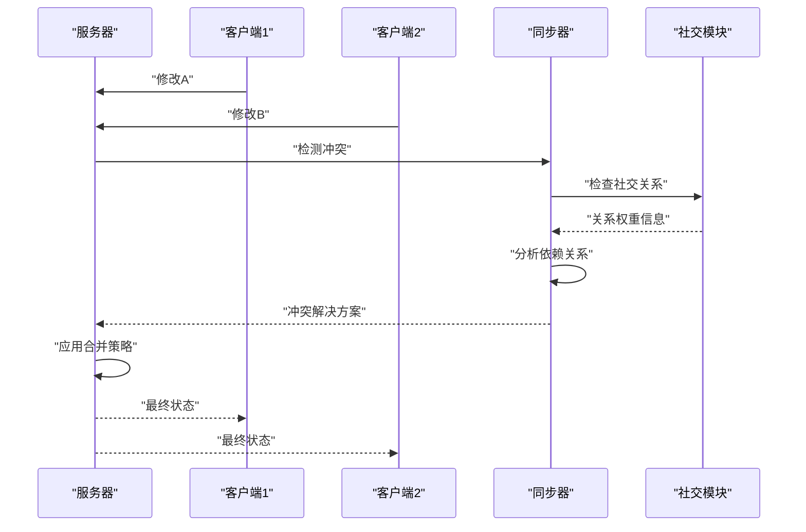

**图表来源**
- [state.py](file://engine_runtime/state.py)
- [persistence.py](file://engine_runtime/persistence.py)

**章节来源**
- [state.py](file://engine_runtime/state.py)
- [persistence.py](file://engine_runtime/persistence.py)

## 社交功能增强

### 玩家关系系统
- 职责：管理玩家间的各种关系类型和状态。
- 关系类型：
  - 好友关系：双向信任关系，享有特殊权限。
  - 敌对关系：竞争或对抗关系，影响交互行为。
  - 中立关系：默认关系状态，标准交互规则。
  - 家族关系：血缘或收养关系，影响继承和传承。
- 关系强度：量化关系深度，影响交互效果和资源分配。

### 聊天与通信系统
- 职责：提供玩家间实时和非实时通信功能。
- 通信渠道：
  - 私人聊天：点对点加密通信。
  - 群组聊天：多玩家共享频道。
  - 世界频道：全服广播消息。
  - 系统消息：游戏通知和公告。
- 消息管理：支持消息存储、搜索和过滤。

### 协作与竞争机制
- 职责：促进玩家间的合作和良性竞争。
- 协作功能：
  - 团队任务：需要多人配合完成的目标。
  - 资源共享：团队成员间的物品和技能共享。
  - 联合攻击：多人协同对抗NPC或其他玩家。
- 竞争功能：
  - 排行榜：基于不同维度的排名系统。
  - 竞技场：玩家间的对战平台。
  - 资源争夺：限时资源点的竞争。

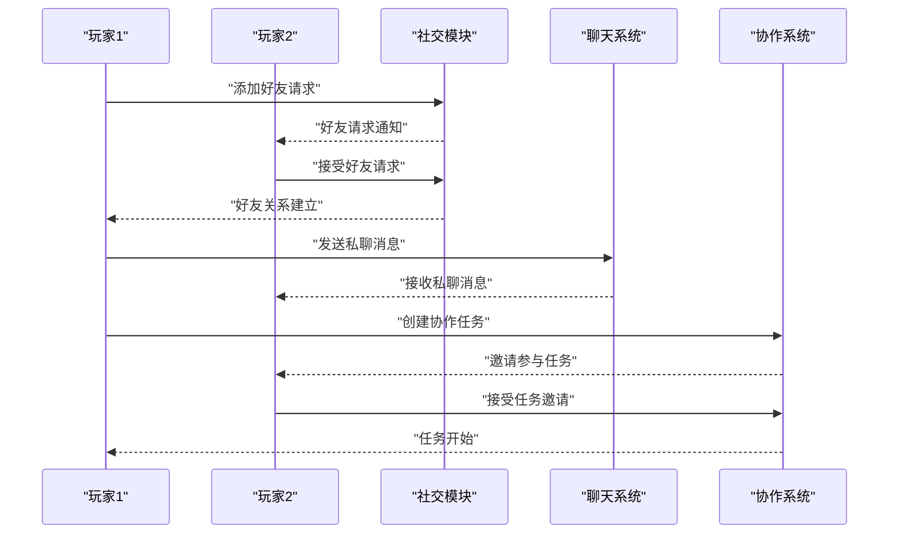

**图表来源**
- [public_survival.py](file://engine_runtime/public_survival.py)
- [runtime.py](file://engine_runtime/runtime.py)

**章节来源**
- [public_survival.py](file://engine_runtime/public_survival.py)
- [runtime.py](file://engine_runtime/runtime.py)

## 依赖关系分析
- 内聚性：各模块职责清晰，状态、事件、导演器、日志、持久化边界明确。
- 耦合度：运行时作为中枢，依赖其他模块但被反向依赖较少，降低循环风险。
- 外部依赖：配置文件与模板为外部输入，通过编译器统一接入。
- **新增依赖**：多人游戏模块引入网络通信、会话管理和状态同步的新依赖关系。
- **增强依赖**：社交功能模块与现有系统的深度集成。

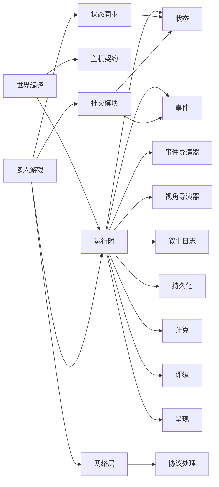

**图表来源**
- [runtime.py](file://engine_runtime/runtime.py)
- [state.py](file://engine_runtime/state.py)
- [events.py](file://engine_runtime/events.py)
- [event_director.py](file://engine_runtime/event_director.py)
- [perspective_director.py](file://engine_runtime/perspective_director.py)
- [narrative_log.py](file://engine_runtime/narrative_log.py)
- [persistence.py](file://engine_runtime/persistence.py)
- [calculators.py](file://engine_runtime/calculators.py)
- [ratings.py](file://engine_runtime/ratings.py)
- [presentation.py](file://engine_runtime/presentation.py)
- [world_compiler.py](file://engine_runtime/world_compiler.py)
- [host_contract.json](file://engine_runtime/host_contract.json)

**章节来源**
- [runtime.py](file://engine_runtime/runtime.py)
- [world_compiler.py](file://engine_runtime/world_compiler.py)

## 性能考量
- 事件批处理：合并小事件，减少I/O与锁竞争。
- 惰性求值：按需生成事件与视角视图，避免全量计算。
- 增量持久化：仅保存变化部分，结合压缩与校验。
- 缓存热点：对频繁查询的状态片段进行缓存，注意失效策略。
- 并行化：无副作用的计算与评级可并行执行，注意线程安全。
- **新增性能优化**：
  - 状态同步优化：使用增量同步和预测技术减少网络延迟。
  - 内存管理：实现对象池和垃圾回收优化。
  - 并发控制：使用细粒度锁和读写锁提高吞吐量。
  - 负载均衡：在多服务器环境中分配玩家负载。
  - **增强优化**：社交数据的缓存和预加载策略。

## 故障排查指南
- 事件丢失或重复：检查事件队列的去重与重试逻辑，确认消费者幂等性。
- 状态不一致：核对状态变更的事务性与约束检查，必要时回滚。
- 叙事日志缺失：确认日志写入时机与权限，检查导出格式。
- 持久化失败：验证存档版本兼容性，启用完整性校验与备份。
- 呈现异常：检查选项配置与本地化资源，确保占位符填充完整。
- **新增故障排查**：
  - 网络延迟过高：检查网络配置和服务器负载，优化数据包大小。
  - 玩家掉线处理：实现断线重连和状态恢复机制。
  - 资源竞争死锁：分析锁依赖图，优化锁粒度和持有时间。
  - 状态同步延迟：监控同步队列长度，调整同步频率。
  - **增强排查**：社交功能相关的故障诊断，如聊天消息丢失、好友关系异常等。

**章节来源**
- [events.py](file://engine_runtime/events.py)
- [state.py](file://engine_runtime/state.py)
- [narrative_log.py](file://engine_runtime/narrative_log.py)
- [persistence.py](file://engine_runtime/persistence.py)
- [options.py](file://engine_runtime/options.py)
- [presentation.py](file://engine_runtime/presentation.py)

## 结论
公共生存模式以事件溯源为核心，结合状态投影、导演器编排与持久化，提供了高内聚、低耦合且可扩展的运行时架构。**最新版本的多人游戏支持**进一步增强了系统的协作能力和用户体验，使多个玩家可以共同探索同一个虚拟世界。通过清晰的模块边界、丰富的工具链和完善的网络通信机制，开发者可以快速构建支持多人协作的可回放、可审计的叙事体验。**新增的社交功能**为玩家提供了更丰富的互动体验，包括聊天、协作、竞争等多种社交场景。建议在生产环境中强化并发安全、性能监控、错误恢复和网络安全机制，特别是针对多人游戏和社交功能的特殊需求。

## 附录
- 引擎设计参考：基础概念、事件溯源、知识与社交机制。
- 模板与工具：存档模板、世界观模板与命令行工具使用。
- **新增附录**：多人游戏开发指南、网络协议规范、性能调优手册。
- **增强附录**：社交功能开发指南、玩家关系系统设计、协作机制实现。

**章节来源**
- [base.md](file://engine/base.md)
- [event_sourcing.md](file://engine/event_sourcing.md)
- [knowledge.md](file://engine/knowledge.md)
- [social.md](file://engine/social.md)
- [README.md](file://engine_runtime/README.md)