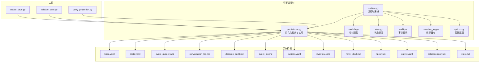
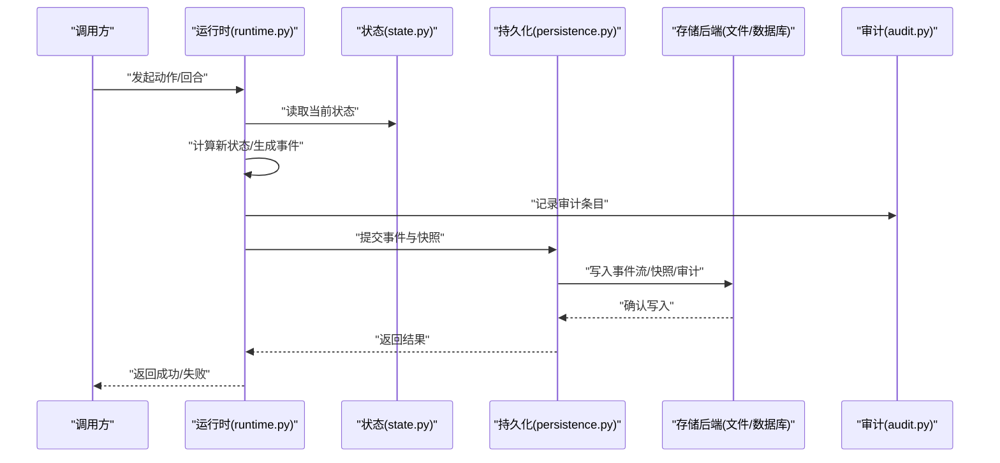
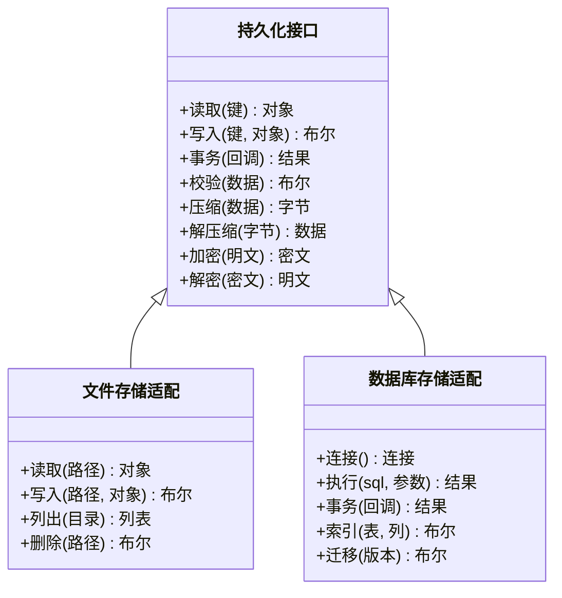
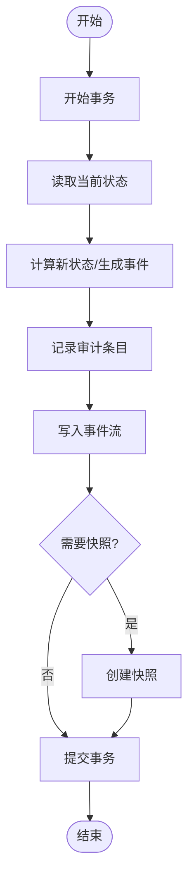
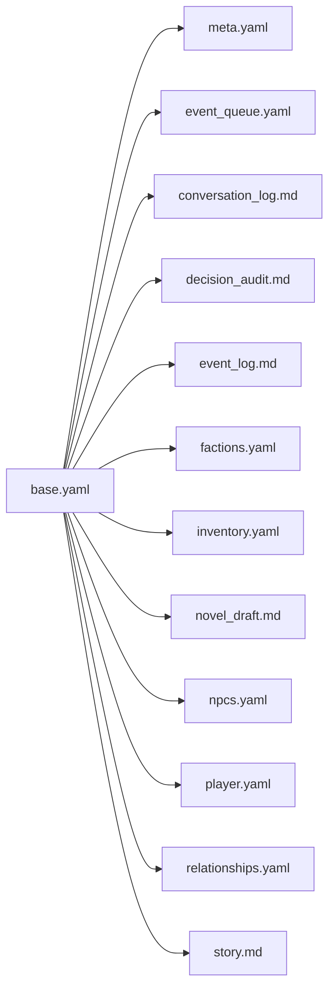
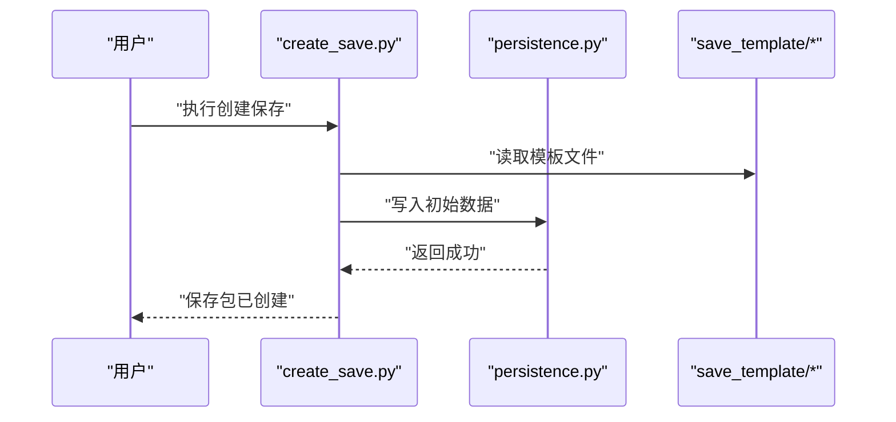
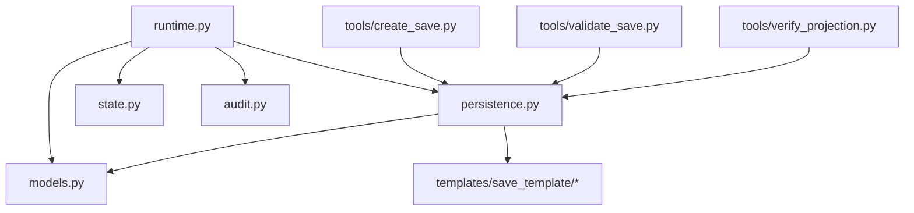

# 持久化层

<cite>
**本文引用的文件**   
- [persistence.py](file://engine_runtime/persistence.py)
- [runtime.py](file://engine_runtime/runtime.py)
- [models.py](file://engine_runtime/models.py)
- [narrative_log.py](file://engine_runtime/narrative_log.py)
- [audit.py](file://engine_runtime/audit.py)
- [state.py](file://engine_runtime/state.py)
- [options.py](file://engine_runtime/options.py)
- [create_save.py](file://tools/create_save.py)
- [validate_save.py](file://tools/validate_save.py)
- [verify_projection.py](file://tools/verify_projection.py)
- [base.yaml](file://templates/save_template/base.yaml)
- [meta.yaml](file://templates/save_template/meta.yaml)
- [event_queue.yaml](file://templates/save_template/event_queue.yaml)
- [conversation_log.md](file://templates/save_template/conversation_log.md)
- [decision_audit.md](file://templates/save_template/decision_audit.md)
- [event_log.md](file://templates/save_template/event_log.md)
- [factions.yaml](file://templates/save_template/factions.yaml)
- [inventory.yaml](file://templates/save_template/inventory.yaml)
- [novel_draft.md](file://templates/save_template/novel_draft.md)
- [npcs.yaml](file://templates/save_template/npcs.yaml)
- [player.yaml](file://templates/save_template/player.yaml)
- [relationships.yaml](file://templates/save_template/relationships.yaml)
- [story.md](file://templates/save_template/story.md)
</cite>

## 目录
1. [简介](#简介)
2. [项目结构](#项目结构)
3. [核心组件](#核心组件)
4. [架构总览](#架构总览)
5. [详细组件分析](#详细组件分析)
6. [依赖关系分析](#依赖关系分析)
7. [性能考虑](#性能考虑)
8. [故障排查指南](#故障排查指南)
9. [结论](#结论)
10. [附录](#附录)

## 简介
本文件围绕项目的“持久化层”展开，系统阐述数据存储策略、备份与恢复机制、数据完整性保证、事务处理、并发控制、数据同步、多后端适配（文件存储、数据库存储等）、CRUD 操作示例、数据迁移与版本兼容、清理机制、性能调优、索引优化、查询加速、灾难备份与安全最佳实践。文档以仓库中的 engine_runtime 模块为核心，结合模板与工具脚本，形成从设计到落地的完整说明。

## 项目结构
持久化相关代码主要位于 engine_runtime 目录，配合 templates/save_template 下的保存模板与 tools 目录的辅助脚本，构成完整的“事件溯源 + 状态快照 + 审计日志”的持久化体系。

**图示来源** 
- [runtime.py](file://engine_runtime/runtime.py)
- [persistence.py](file://engine_runtime/persistence.py)
- [models.py](file://engine_runtime/models.py)
- [state.py](file://engine_runtime/state.py)
- [audit.py](file://engine_runtime/audit.py)
- [narrative_log.py](file://engine_runtime/narrative_log.py)
- [options.py](file://engine_runtime/options.py)
- [base.yaml](file://templates/save_template/base.yaml)
- [meta.yaml](file://templates/save_template/meta.yaml)
- [event_queue.yaml](file://templates/save_template/event_queue.yaml)
- [conversation_log.md](file://templates/save_template/conversation_log.md)
- [decision_audit.md](file://templates/save_template/decision_audit.md)
- [event_log.md](file://templates/save_template/event_log.md)
- [factions.yaml](file://templates/save_template/factions.yaml)
- [inventory.yaml](file://templates/save_template/inventory.yaml)
- [novel_draft.md](file://templates/save_template/novel_draft.md)
- [npcs.yaml](file://templates/save_template/npcs.yaml)
- [player.yaml](file://templates/save_template/player.yaml)
- [relationships.yaml](file://templates/save_template/relationships.yaml)
- [story.md](file://templates/save_template/story.md)

**章节来源**
- [persistence.py](file://engine_runtime/persistence.py)
- [runtime.py](file://engine_runtime/runtime.py)
- [models.py](file://engine_runtime/models.py)
- [state.py](file://engine_runtime/state.py)
- [audit.py](file://engine_runtime/audit.py)
- [narrative_log.py](file://engine_runtime/narrative_log.py)
- [options.py](file://engine_runtime/options.py)
- [create_save.py](file://tools/create_save.py)
- [validate_save.py](file://tools/validate_save.py)
- [verify_projection.py](file://tools/verify_projection.py)
- [base.yaml](file://templates/save_template/base.yaml)
- [meta.yaml](file://templates/save_template/meta.yaml)
- [event_queue.yaml](file://templates/save_template/event_queue.yaml)
- [conversation_log.md](file://templates/save_template/conversation_log.md)
- [decision_audit.md](file://templates/save_template/decision_audit.md)
- [event_log.md](file://templates/save_template/event_log.md)
- [factions.yaml](file://templates/save_template/factions.yaml)
- [inventory.yaml](file://templates/save_template/inventory.yaml)
- [novel_draft.md](file://templates/save_template/novel_draft.md)
- [npcs.yaml](file://templates/save_template/npcs.yaml)
- [player.yaml](file://templates/save_template/player.yaml)
- [relationships.yaml](file://templates/save_template/relationships.yaml)
- [story.md](file://templates/save_template/story.md)

## 核心组件
- 持久化抽象与实现：定义统一的存储接口与多种后端适配（文件、数据库），封装序列化/反序列化、校验、压缩、加密等能力。
- 运行时编排：协调事件生成、状态更新、持久化写入与回滚，确保一致性。
- 领域模型：定义实体、值对象与聚合根，提供序列化工具与约束。
- 状态管理：维护当前世界状态、增量变更与快照点。
- 审计与叙事日志：记录决策轨迹与关键事件，支持可追溯性与回放。
- 配置选项：控制持久化行为（如是否启用压缩、校验、加密、事务模式）。

**章节来源**
- [persistence.py](file://engine_runtime/persistence.py)
- [runtime.py](file://engine_runtime/runtime.py)
- [models.py](file://engine_runtime/models.py)
- [state.py](file://engine_runtime/state.py)
- [audit.py](file://engine_runtime/audit.py)
- [narrative_log.py](file://engine_runtime/narrative_log.py)
- [options.py](file://engine_runtime/options.py)

## 架构总览
持久化层采用“事件溯源 + 快照 + 审计”的组合策略：
- 事件流：所有变更以不可变事件追加写入，保证可重放与审计。
- 快照：定期或按需生成状态快照，缩短恢复时间并降低回放成本。
- 审计：记录关键决策与外部交互，便于问题定位与合规审查。
- 多后端：通过统一接口适配文件存储与数据库存储，屏蔽底层差异。

**图示来源** 
- [runtime.py](file://engine_runtime/runtime.py)
- [state.py](file://engine_runtime/state.py)
- [persistence.py](file://engine_runtime/persistence.py)
- [audit.py](file://engine_runtime/audit.py)

## 详细组件分析

### 持久化抽象与多后端适配
- 统一接口：定义读/写/事务/校验/压缩/加密等方法，屏蔽后端差异。
- 文件存储适配：基于 YAML/Markdown 模板组织保存内容，支持结构化与非结构化数据混合存储。
- 数据库存储适配：将事件、快照、审计映射为表结构，利用事务与索引提升一致性与查询性能。
- 校验与完整性：在读写时进行数据校验，必要时引入哈希校验与签名，防止篡改。
- 压缩与加密：可选开启压缩减少体积，敏感数据加密存储。

**图示来源** 
- [persistence.py](file://engine_runtime/persistence.py)

**章节来源**
- [persistence.py](file://engine_runtime/persistence.py)

### 运行时编排与事务处理
- 事务边界：将状态更新、事件生成、审计记录与持久化写入纳入同一事务，失败则整体回滚。
- 幂等性：事件携带唯一标识，避免重复写入导致状态不一致。
- 重试与补偿：对网络或 I/O 异常进行有限次重试，必要时触发补偿逻辑。
- 快照策略：按固定间隔或事件数量阈值生成快照，减少回放成本。

**图示来源** 
- [runtime.py](file://engine_runtime/runtime.py)
- [state.py](file://engine_runtime/state.py)
- [audit.py](file://engine_runtime/audit.py)
- [persistence.py](file://engine_runtime/persistence.py)

**章节来源**
- [runtime.py](file://engine_runtime/runtime.py)
- [state.py](file://engine_runtime/state.py)
- [audit.py](file://engine_runtime/audit.py)
- [persistence.py](file://engine_runtime/persistence.py)

### 数据模型与序列化
- 领域模型：定义玩家、阵营、物品、关系、NPC 等实体，以及事件与快照的结构。
- 序列化格式：YAML 用于结构化数据，Markdown 用于叙事与审计文本，保持可读性与可编辑性。
- 版本兼容：模型字段演进通过版本标记与迁移脚本处理，向后兼容旧格式。

```mermaid
erDiagram
PLAYER {
uuid id PK
string name
int level
timestamp created_at
}
FACTION {
uuid id PK
string name
enum status
}
INVENTORY {
uuid id PK
uuid player_id FK
string item_name
int quantity
}
RELATIONSHIP {
uuid id PK
uuid from_player_id FK
uuid to_player_id FK
int strength
}
NPC {
uuid id PK
string name
string role
}
EVENT {
uuid id PK
string type
json payload
timestamp occurred_at
}
SNAPSHOT {
uuid id PK
string version
json state
timestamp created_at
}
AUDIT {
uuid id PK
string action
json context
timestamp created_at
}
PLAYER ||--o{ INVENTORY : "拥有"
PLAYER ||--o{ RELATIONSHIP : "建立关系"
FACTION ||--o{ PLAYER : "成员"
EVENT ||--|| SNAPSHOT : "触发"
AUDIT ||--|| EVENT : "关联"
```

**图示来源** 
- [models.py](file://engine_runtime/models.py)
- [narrative_log.py](file://engine_runtime/narrative_log.py)
- [audit.py](file://engine_runtime/audit.py)
- [state.py](file://engine_runtime/state.py)

**章节来源**
- [models.py](file://engine_runtime/models.py)
- [narrative_log.py](file://engine_runtime/narrative_log.py)
- [audit.py](file://engine_runtime/audit.py)
- [state.py](file://engine_runtime/state.py)

### 保存模板与数据结构
- 基础模板：base.yaml 定义通用结构与元信息。
- 元数据：meta.yaml 包含版本、作者、时间戳等。
- 事件队列：event_queue.yaml 描述待处理事件顺序。
- 叙事与审计：conversation_log.md、decision_audit.md、event_log.md 记录对话、决策与事件。
- 业务数据：factions.yaml、inventory.yaml、npcs.yaml、player.yaml、relationships.yaml、story.md、novel_draft.md 承载具体游戏内容。

**图示来源** 
- [base.yaml](file://templates/save_template/base.yaml)
- [meta.yaml](file://templates/save_template/meta.yaml)
- [event_queue.yaml](file://templates/save_template/event_queue.yaml)
- [conversation_log.md](file://templates/save_template/conversation_log.md)
- [decision_audit.md](file://templates/save_template/decision_audit.md)
- [event_log.md](file://templates/save_template/event_log.md)
- [factions.yaml](file://templates/save_template/factions.yaml)
- [inventory.yaml](file://templates/save_template/inventory.yaml)
- [novel_draft.md](file://templates/save_template/novel_draft.md)
- [npcs.yaml](file://templates/save_template/npcs.yaml)
- [player.yaml](file://templates/save_template/player.yaml)
- [relationships.yaml](file://templates/save_template/relationships.yaml)
- [story.md](file://templates/save_template/story.md)

**章节来源**
- [base.yaml](file://templates/save_template/base.yaml)
- [meta.yaml](file://templates/save_template/meta.yaml)
- [event_queue.yaml](file://templates/save_template/event_queue.yaml)
- [conversation_log.md](file://templates/save_template/conversation_log.md)
- [decision_audit.md](file://templates/save_template/decision_audit.md)
- [event_log.md](file://templates/save_template/event_log.md)
- [factions.yaml](file://templates/save_template/factions.yaml)
- [inventory.yaml](file://templates/save_template/inventory.yaml)
- [novel_draft.md](file://templates/save_template/novel_draft.md)
- [npcs.yaml](file://templates/save_template/npcs.yaml)
- [player.yaml](file://templates/save_template/player.yaml)
- [relationships.yaml](file://templates/save_template/relationships.yaml)
- [story.md](file://templates/save_template/story.md)

### 工具与流程示例（CRUD）
- 创建保存：create_save.py 根据模板生成初始保存包，填充默认数据与元信息。
- 验证保存：validate_save.py 检查保存包的完整性、版本兼容与必填字段。
- 投影校验：verify_projection.py 对比事件流与快照，确保投影一致性。

**图示来源** 
- [create_save.py](file://tools/create_save.py)
- [persistence.py](file://engine_runtime/persistence.py)
- [base.yaml](file://templates/save_template/base.yaml)
- [meta.yaml](file://templates/save_template/meta.yaml)

**章节来源**
- [create_save.py](file://tools/create_save.py)
- [validate_save.py](file://tools/validate_save.py)
- [verify_projection.py](file://tools/verify_projection.py)
- [persistence.py](file://engine_runtime/persistence.py)

## 依赖关系分析
- 运行时依赖持久化接口、状态管理与审计模块，确保一致的写入顺序与可回溯性。
- 持久化模块依赖模板与模型，负责序列化、校验与后端适配。
- 工具脚本依赖持久化接口与模板，提供便捷的数据操作入口。

**图示来源** 
- [runtime.py](file://engine_runtime/runtime.py)
- [persistence.py](file://engine_runtime/persistence.py)
- [state.py](file://engine_runtime/state.py)
- [audit.py](file://engine_runtime/audit.py)
- [models.py](file://engine_runtime/models.py)
- [create_save.py](file://tools/create_save.py)
- [validate_save.py](file://tools/validate_save.py)
- [verify_projection.py](file://tools/verify_projection.py)

**章节来源**
- [runtime.py](file://engine_runtime/runtime.py)
- [persistence.py](file://engine_runtime/persistence.py)
- [state.py](file://engine_runtime/state.py)
- [audit.py](file://engine_runtime/audit.py)
- [models.py](file://engine_runtime/models.py)
- [create_save.py](file://tools/create_save.py)
- [validate_save.py](file://tools/validate_save.py)
- [verify_projection.py](file://tools/verify_projection.py)

## 性能考虑
- 事件批处理：合并小事件为批次写入，减少 I/O 次数。
- 快照频率：根据事件增长速率调整快照间隔，平衡恢复时间与回放成本。
- 索引优化：为常用查询字段建立索引（数据库后端），提高检索速度。
- 压缩与分片：大文件压缩存储，按时间或类型分片，降低单文件体积。
- 缓存热点：对频繁读取的状态片段进行内存缓存，减少磁盘访问。
- 异步写入：非关键路径使用异步写入，提升主流程吞吐。

[本节为通用指导，不直接分析具体文件]

## 故障排查指南
- 保存包损坏：使用 validate_save.py 校验完整性与版本兼容性，定位缺失或错误字段。
- 投影不一致：运行 verify_projection.py 对比事件流与快照，修复不一致项。
- 事务失败：检查事务边界与回滚逻辑，确认幂等性与重试策略。
- 性能瓶颈：监控 I/O 与 CPU 使用率，调整快照频率与批大小。
- 安全审计：查看 decision_audit.md 与 event_log.md，追踪异常操作来源。

**章节来源**
- [validate_save.py](file://tools/validate_save.py)
- [verify_projection.py](file://tools/verify_projection.py)
- [audit.py](file://engine_runtime/audit.py)
- [narrative_log.py](file://engine_runtime/narrative_log.py)

## 结论
本项目持久化层以事件溯源为核心，结合快照与审计，提供了高一致性、可回溯与可扩展的存储方案。通过统一接口与多后端适配，既满足文件存储的可读性与灵活性，也支持数据库存储的高性能与强一致性。配合完善的工具链与模板体系，实现了从创建、校验到恢复的全生命周期管理。建议在生产环境中启用压缩、加密与索引优化，并结合监控与告警保障数据安全与可用性。

[本节为总结性内容，不直接分析具体文件]

## 附录
- 数据迁移策略：通过版本标记与迁移脚本逐步演进模型，保持向后兼容。
- 数据清理机制：定期归档历史事件与审计日志，保留必要的时间窗口。
- 灾难备份：全量快照 + 增量事件流，支持跨地域复制与快速恢复。
- 数据安全：敏感字段加密、传输加密、访问控制与审计留痕。

[本节为补充说明，不直接分析具体文件]