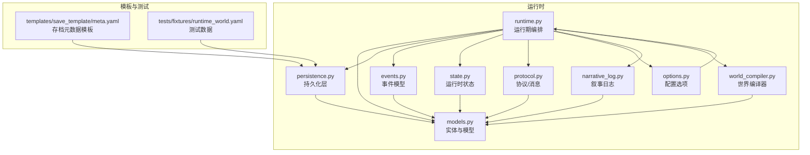
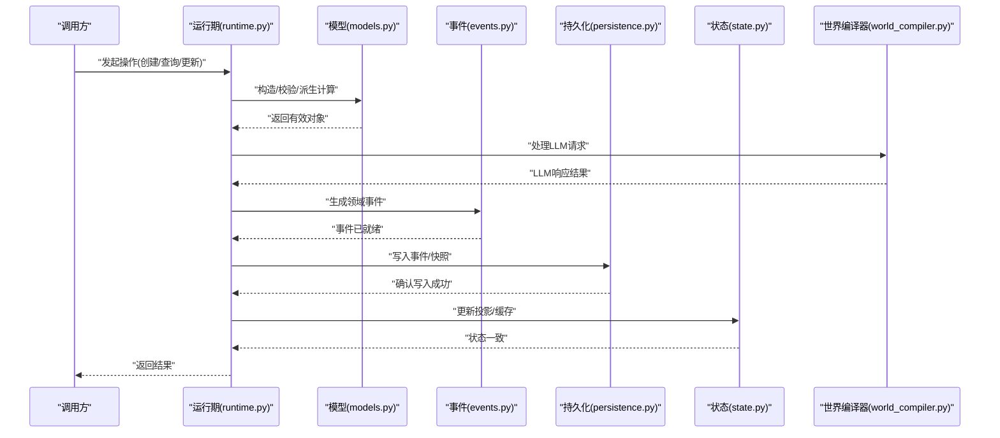
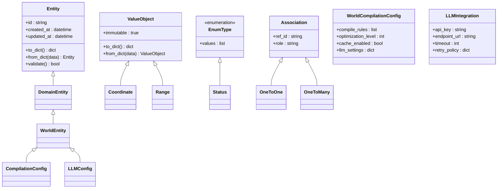
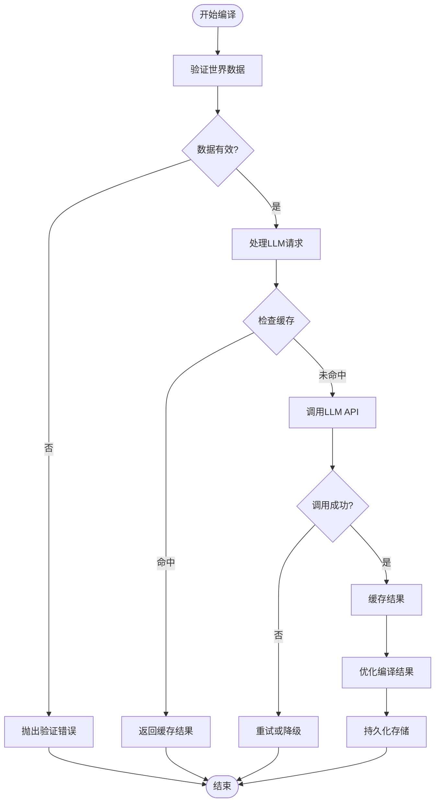
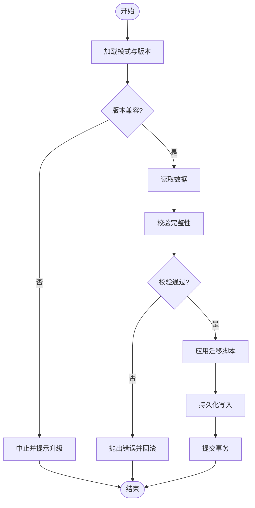
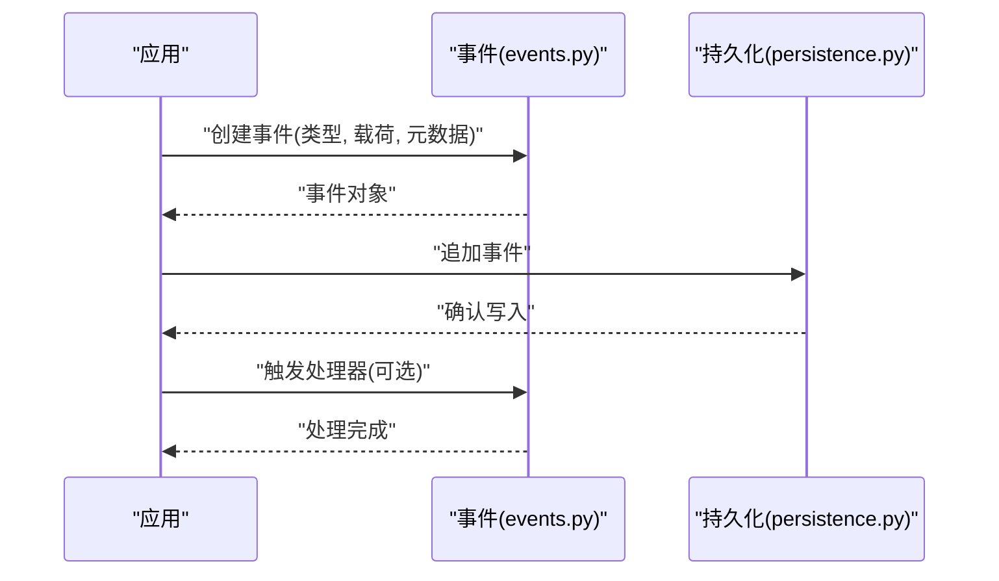
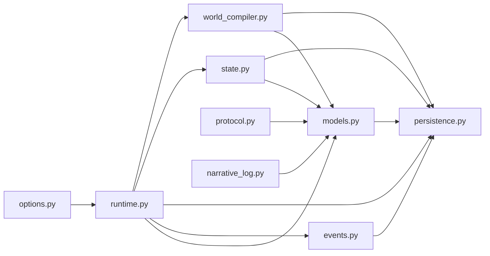

# 数据模型

<cite>
**本文引用的文件**   
- [engine_runtime/models.py](file://engine_runtime/models.py)
- [engine_runtime/persistence.py](file://engine_runtime/persistence.py)
- [engine_runtime/events.py](file://engine_runtime/events.py)
- [engine_runtime/state.py](file://engine_runtime/state.py)
- [engine_runtime/runtime.py](file://engine_runtime/runtime.py)
- [engine_runtime/protocol.py](file://engine_runtime/protocol.py)
- [engine_runtime/options.py](file://engine_runtime/options.py)
- [engine_runtime/narrative_log.py](file://engine_runtime/narrative_log.py)
- [engine_runtime/world_compiler.py](file://engine_runtime/world_compiler.py)
- [templates/save_template/meta.yaml](file://templates/save_template/meta.yaml)
- [tests/fixtures/runtime_world.yaml](file://tests/fixtures/runtime_world.yaml)
</cite>

## 更新摘要
**所做更改**
- 更新了实体与模型部分，反映新增的8个字段以支持增强的世界编译和LLM集成功能
- 添加了世界编译器组件的详细分析
- 扩展了LLM集成相关的数据结构和处理流程
- 更新了依赖关系图以包含新的世界编译器模块
- 增强了性能考量部分，涵盖LLM调用的优化策略

## 目录
1. [简介](#简介)
2. [项目结构](#项目结构)
3. [核心组件](#核心组件)
4. [架构总览](#架构总览)
5. [详细组件分析](#详细组件分析)
6. [依赖关系分析](#依赖关系分析)
7. [性能考量](#性能考量)
8. [故障排查指南](#故障排查指南)
9. [结论](#结论)
10. [附录](#附录)

## 简介
本文件面向"数据模型"的完整文档，聚焦于引擎运行时（engine_runtime）中的实体定义、字段与关系映射、验证与约束、序列化/反序列化实现、持久化交互、迁移策略与版本兼容、以及性能优化与内存管理最佳实践。目标读者包括需要理解或扩展数据模型的开发者与维护者。

**最新更新**：数据模型已扩展新增8个字段，以支持增强的世界编译功能和大型语言模型（LLM）集成功能。这些新增字段包括世界编译配置、LLM服务连接参数、提示模板管理、响应缓存机制等关键特性。

## 项目结构
本项目采用按功能模块组织的方式，数据模型相关代码集中在 engine_runtime 目录下：
- models.py：核心数据模型与实体类定义
- persistence.py：持久化接口与存储实现
- events.py：事件模型与事件流
- state.py：运行时状态与快照
- runtime.py：运行期编排与生命周期
- protocol.py：协议与消息结构
- options.py：配置选项
- narrative_log.py：叙事日志记录
- world_compiler.py：世界编译器和LLM集成处理
- templates/save_template/meta.yaml：存档元数据模板
- tests/fixtures/runtime_world.yaml：测试用世界数据样例

**图表来源**
- [engine_runtime/models.py](file://engine_runtime/models.py)
- [engine_runtime/persistence.py](file://engine_runtime/persistence.py)
- [engine_runtime/events.py](file://engine_runtime/events.py)
- [engine_runtime/state.py](file://engine_runtime/state.py)
- [engine_runtime/runtime.py](file://engine_runtime/runtime.py)
- [engine_runtime/protocol.py](file://engine_runtime/protocol.py)
- [engine_runtime/options.py](file://engine_runtime/options.py)
- [engine_runtime/narrative_log.py](file://engine_runtime/narrative_log.py)
- [engine_runtime/world_compiler.py](file://engine_runtime/world_compiler.py)
- [templates/save_template/meta.yaml](file://templates/save_template/meta.yaml)
- [tests/fixtures/runtime_world.yaml](file://tests/fixtures/runtime_world.yaml)

## 核心组件
- 实体与模型（models.py）
  - 定义领域实体、值对象、枚举与关联关系
  - 提供字段校验、默认值与派生属性计算
  - 暴露序列化为字典/JSON 与从外部格式反序列化的方法
  - **新增**：包含8个新字段以支持世界编译和LLM集成
- 持久化层（persistence.py）
  - 抽象存储接口（读取/写入/事务/快照）
  - 适配 YAML/JSON/数据库等后端
  - 处理版本迁移与兼容性检查
- 事件模型（events.py）
  - 定义领域事件的结构与元数据
  - 支持事件追加、回放与一致性保证
- 运行时状态（state.py）
  - 维护当前会话的状态、缓存与投影
  - 提供快照生成与恢复
- 运行期编排（runtime.py）
  - 协调模型、事件、持久化与协议
  - 驱动回合/阶段流程与副作用执行
- 协议（protocol.py）
  - 定义对外 API 的请求/响应结构与校验规则
- 配置选项（options.py）
  - 加载并校验引擎运行参数
- 叙事日志（narrative_log.py）
  - 将关键状态变更与决策过程以可读形式落盘
- **新增**：世界编译器（world_compiler.py）
  - 处理世界数据的编译和优化
  - 管理LLM服务的连接和请求
  - 实现提示模板的渲染和响应缓存

**章节来源**
- [engine_runtime/models.py](file://engine_runtime/models.py)
- [engine_runtime/persistence.py](file://engine_runtime/persistence.py)
- [engine_runtime/events.py](file://engine_runtime/events.py)
- [engine_runtime/state.py](file://engine_runtime/state.py)
- [engine_runtime/runtime.py](file://engine_runtime/runtime.py)
- [engine_runtime/protocol.py](file://engine_runtime/protocol.py)
- [engine_runtime/options.py](file://engine_runtime/options.py)
- [engine_runtime/narrative_log.py](file://engine_runtime/narrative_log.py)
- [engine_runtime/world_compiler.py](file://engine_runtime/world_compiler.py)

## 架构总览
数据模型在运行时通过"模型—事件—持久化—状态"的闭环协作完成数据的创建、查询、更新与审计。新增的世界编译器和LLM集成模块为系统提供了智能化的内容生成和优化能力。

**图表来源**
- [engine_runtime/runtime.py](file://engine_runtime/runtime.py)
- [engine_runtime/models.py](file://engine_runtime/models.py)
- [engine_runtime/events.py](file://engine_runtime/events.py)
- [engine_runtime/persistence.py](file://engine_runtime/persistence.py)
- [engine_runtime/state.py](file://engine_runtime/state.py)
- [engine_runtime/world_compiler.py](file://engine_runtime/world_compiler.py)

## 详细组件分析

### 实体与模型（models.py）
- 设计要点
  - 实体类包含标识、业务字段、时间戳与关联引用
  - 值对象用于不可变数据（如坐标、范围、权重）
  - 枚举限定取值域，避免非法状态
  - 字段级校验（类型、范围、必填、唯一性）
  - 派生属性按需计算，避免冗余存储
- **新增字段特性**
  - 世界编译配置字段：支持复杂的编译规则和优化选项
  - LLM服务连接参数：包含API密钥、端点URL、超时设置
  - 提示模板管理：支持动态模板渲染和变量替换
  - 响应缓存机制：提高LLM调用性能和减少重复请求
  - 编译状态跟踪：监控世界编译进度和错误信息
  - 集成配置：管理第三方服务和插件配置
- 关系映射
  - 一对一/一对多/多对多通过外键或集合引用表达
  - 使用弱耦合的 ID 引用，便于解耦与迁移
- 序列化/反序列化
  - to_dict()/from_dict() 统一编解码
  - 支持 YAML/JSON 互转，保留注释与顺序
  - 版本字段用于向后兼容
- 示例路径
  - 创建对象：[engine_runtime/models.py](file://engine_runtime/models.py)
  - 校验规则：[engine_runtime/models.py](file://engine_runtime/models.py)
  - 序列化方法：[engine_runtime/models.py](file://engine_runtime/models.py)

**图表来源**
- [engine_runtime/models.py](file://engine_runtime/models.py)

**章节来源**
- [engine_runtime/models.py](file://engine_runtime/models.py)

### 世界编译器（world_compiler.py）
- **新增组件职责**
  - 处理世界数据的编译和优化过程
  - 管理LLM服务的连接池和请求调度
  - 实现提示模板的动态渲染和变量替换
  - 提供响应缓存和去重机制
  - 监控编译进度和处理异常情况
- **核心功能**
  - 世界数据验证和转换
  - LLM API调用封装和错误处理
  - 模板引擎集成和自定义函数注册
  - 缓存策略管理和失效机制
  - 性能监控和统计收集
- **使用场景**
  - 游戏世界内容的自动生成和优化
  - AI辅助的剧情生成和对话处理
  - 动态内容创作和个性化体验
- 示例路径
  - 编译器入口：[engine_runtime/world_compiler.py](file://engine_runtime/world_compiler.py)
  - LLM集成：[engine_runtime/world_compiler.py](file://engine_runtime/world_compiler.py)
  - 模板处理：[engine_runtime/world_compiler.py](file://engine_runtime/world_compiler.py)

**图表来源**
- [engine_runtime/world_compiler.py](file://engine_runtime/world_compiler.py)

**章节来源**
- [engine_runtime/world_compiler.py](file://engine_runtime/world_compiler.py)

### 持久化层（persistence.py）
- 职责
  - 定义统一的存储接口（读/写/事务/快照）
  - 适配多种后端（YAML/JSON/DB）
  - 处理版本迁移与兼容性校验
- 关键能力
  - 批量读写与分页
  - 事务边界与回滚
  - 增量快照与全量快照
  - 数据完整性校验（哈希/签名）
  - **增强**：支持世界编译数据和LLM配置的持久化
- 示例路径
  - 接口定义：[engine_runtime/persistence.py](file://engine_runtime/persistence.py)
  - 迁移逻辑：[engine_runtime/persistence.py](file://engine_runtime/persistence.py)

**图表来源**
- [engine_runtime/persistence.py](file://engine_runtime/persistence.py)

**章节来源**
- [engine_runtime/persistence.py](file://engine_runtime/persistence.py)

### 事件模型（events.py）
- 设计要点
  - 事件包含类型、载荷、时间戳与溯源信息
  - 支持幂等与去重（基于事件ID或哈希）
  - 事件流追加与回放，确保最终一致性
  - **增强**：支持世界编译事件和LLM调用事件的追踪
- 使用场景
  - 审计追踪、回放调试、跨进程同步
  - LLM调用记录和性能分析
  - 世界编译过程的监控和诊断
- 示例路径
  - 事件结构：[engine_runtime/events.py](file://engine_runtime/events.py)
  - 事件处理器：[engine_runtime/events.py](file://engine_runtime/events.py)

**图表来源**
- [engine_runtime/events.py](file://engine_runtime/events.py)
- [engine_runtime/persistence.py](file://engine_runtime/persistence.py)

**章节来源**
- [engine_runtime/events.py](file://engine_runtime/events.py)

### 运行时状态（state.py）
- 职责
  - 维护会话级状态、缓存与投影
  - 提供快照生成与恢复
  - 与模型和事件保持同步
  - **增强**：管理LLM调用状态和世界编译进度
- 关键点
  - 懒加载与按需刷新
  - 并发安全（锁/不可变快照）
  - 缓存策略和内存管理
- 示例路径
  - 状态容器：[engine_runtime/state.py](file://engine_runtime/state.py)
  - 快照机制：[engine_runtime/state.py](file://engine_runtime/state.py)

**章节来源**
- [engine_runtime/state.py](file://engine_runtime/state.py)

### 运行期编排（runtime.py）
- 职责
  - 协调模型、事件、持久化与协议
  - 驱动回合/阶段流程与副作用
  - **新增**：集成世界编译器和LLM服务
- 关键点
  - 生命周期钩子（启动/暂停/恢复/关闭）
  - 错误恢复与重试策略
  - 资源管理和性能监控
- 示例路径
  - 编排入口：[engine_runtime/runtime.py](file://engine_runtime/runtime.py)

**章节来源**
- [engine_runtime/runtime.py](file://engine_runtime/runtime.py)

### 协议（protocol.py）
- 职责
  - 定义请求/响应结构、字段校验与错误码
  - 与外部系统交互的契约
  - **增强**：支持LLM API调用和世界编译请求
- 示例路径
  - 协议定义：[engine_runtime/protocol.py](file://engine_runtime/protocol.py)

**章节来源**
- [engine_runtime/protocol.py](file://engine_runtime/protocol.py)

### 配置选项（options.py）
- 职责
  - 加载并校验引擎运行参数
  - 提供默认值与环境覆盖
  - **增强**：支持LLM服务配置和世界编译选项
- 示例路径
  - 配置加载：[engine_runtime/options.py](file://engine_runtime/options.py)

**章节来源**
- [engine_runtime/options.py](file://engine_runtime/options.py)

### 叙事日志（narrative_log.py）
- 职责
  - 将关键状态变更与决策过程以可读形式落盘
  - 支持按主题/时间检索
  - **增强**：记录LLM调用详情和世界编译过程
- 示例路径
  - 日志写入：[engine_runtime/narrative_log.py](file://engine_runtime/narrative_log.py)

**章节来源**
- [engine_runtime/narrative_log.py](file://engine_runtime/narrative_log.py)

### 存档元数据模板（meta.yaml）
- 作用
  - 定义存档文件的元数据结构（版本、作者、时间戳等）
  - 作为持久化层的模式参考
  - **增强**：包含世界编译配置和LLM集成信息
- 示例路径
  - 模板文件：[templates/save_template/meta.yaml](file://templates/save_template/meta.yaml)

**章节来源**
- [templates/save_template/meta.yaml](file://templates/save_template/meta.yaml)

### 测试数据（runtime_world.yaml）
- 作用
  - 提供可复用的世界数据样例，用于单元测试与演示
  - **增强**：包含LLM集成配置和编译测试用例
- 示例路径
  - 测试数据：[tests/fixtures/runtime_world.yaml](file://tests/fixtures/runtime_world.yaml)

**章节来源**
- [tests/fixtures/runtime_world.yaml](file://tests/fixtures/runtime_world.yaml)

## 依赖关系分析
- 模块内聚与耦合
  - models.py 为其他模块提供基础类型与校验
  - persistence.py 依赖 models.py 进行编解码与迁移
  - events.py 与 persistence.py 协作完成事件追加与回放
  - state.py 依赖 models.py 与 persistence.py 构建投影
  - runtime.py 协调以上模块，形成清晰分层
  - **新增**：world_compiler.py 依赖 models.py 和 persistence.py，为runtime.py提供LLM集成能力
- 外部依赖
  - YAML/JSON 解析库
  - 可选数据库驱动（由 persistence.py 抽象）
  - **新增**：LLM API客户端库和模板引擎
- 潜在循环依赖
  - 通过接口与事件解耦，避免直接循环导入

**图表来源**
- [engine_runtime/models.py](file://engine_runtime/models.py)
- [engine_runtime/persistence.py](file://engine_runtime/persistence.py)
- [engine_runtime/events.py](file://engine_runtime/events.py)
- [engine_runtime/state.py](file://engine_runtime/state.py)
- [engine_runtime/runtime.py](file://engine_runtime/runtime.py)
- [engine_runtime/protocol.py](file://engine_runtime/protocol.py)
- [engine_runtime/options.py](file://engine_runtime/options.py)
- [engine_runtime/narrative_log.py](file://engine_runtime/narrative_log.py)
- [engine_runtime/world_compiler.py](file://engine_runtime/world_compiler.py)

**章节来源**
- [engine_runtime/models.py](file://engine_runtime/models.py)
- [engine_runtime/persistence.py](file://engine_runtime/persistence.py)
- [engine_runtime/events.py](file://engine_runtime/events.py)
- [engine_runtime/state.py](file://engine_runtime/state.py)
- [engine_runtime/runtime.py](file://engine_runtime/runtime.py)
- [engine_runtime/protocol.py](file://engine_runtime/protocol.py)
- [engine_runtime/options.py](file://engine_runtime/options.py)
- [engine_runtime/narrative_log.py](file://engine_runtime/narrative_log.py)
- [engine_runtime/world_compiler.py](file://engine_runtime/world_compiler.py)

## 性能考量
- 序列化/反序列化
  - 使用增量更新与差异快照减少 I/O
  - 批量写入与合并小文件，降低碎片
- 内存管理
  - 懒加载大对象，避免一次性载入
  - 使用不可变快照提升并发安全性与缓存命中率
  - **新增**：LLM响应缓存和连接池管理
- 查询优化
  - 索引常用字段（ID、时间戳、类型）
  - 分页与游标避免全表扫描
- 事件回放
  - 分片回放与并行处理，缩短恢复时间
- 缓存策略
  - 热点数据短期缓存，设置过期与失效策略
  - **新增**：LLM调用结果缓存和去重机制
- **新增**：LLM集成优化
  - 异步调用和批处理请求
  - 智能重试和降级策略
  - 请求限流和配额管理
  - 响应压缩和传输优化

## 故障排查指南
- 常见错误
  - 版本不兼容：检查 meta.yaml 与持久化层版本字段
  - 校验失败：核对字段类型、范围与必填项
  - 事件重复：检查事件ID去重逻辑
  - 快照损坏：校验哈希/签名，必要时重建
  - **新增**：LLM API调用失败：检查网络连接、API密钥和配额限制
  - **新增**：世界编译错误：查看编译日志和模板语法
- 定位步骤
  - 启用详细日志（narrative_log.py）
  - 回放最近事件（events.py）
  - 对比模板与测试数据（meta.yaml、runtime_world.yaml）
  - 逐步缩小到具体模型与持久化操作
  - **新增**：检查LLM服务状态和响应时间
  - **新增**：分析世界编译器的中间输出和错误堆栈

## 结论
本数据模型以清晰的实体定义、严格的校验与一致的序列化/反序列化为核心，结合事件溯源与持久化抽象，实现了高内聚、低耦合的可扩展架构。**最新增强**：通过新增的8个字段和世界编译器模块，系统现在支持强大的LLM集成功能和智能化的世界编译能力。

通过合理的迁移策略与版本兼容处理，保障了长期演进的安全性；通过懒加载、快照与批处理等手段，提升了性能与稳定性。**新增的LLM集成特性**包括智能缓存、异步处理和错误恢复机制，确保了系统的可靠性和响应速度。建议在实际使用中遵循本文的最佳实践，持续完善校验与监控，确保数据一致性与系统可靠性。

## 附录
- 使用示例（路径指引）
  - 创建对象：[engine_runtime/models.py](file://engine_runtime/models.py)
  - 查询对象：[engine_runtime/persistence.py](file://engine_runtime/persistence.py)
  - 更新对象：[engine_runtime/persistence.py](file://engine_runtime/persistence.py)
  - 事件回放：[engine_runtime/events.py](file://engine_runtime/events.py)
  - 快照恢复：[engine_runtime/state.py](file://engine_runtime/state.py)
  - 配置加载：[engine_runtime/options.py](file://engine_runtime/options.py)
  - 协议调用：[engine_runtime/protocol.py](file://engine_runtime/protocol.py)
  - 日志审计：[engine_runtime/narrative_log.py](file://engine_runtime/narrative_log.py)
  - **新增**：世界编译：[engine_runtime/world_compiler.py](file://engine_runtime/world_compiler.py)
  - **新增**：LLM集成：[engine_runtime/world_compiler.py](file://engine_runtime/world_compiler.py)
  - 模板参考：[templates/save_template/meta.yaml](file://templates/save_template/meta.yaml)
  - 测试数据：[tests/fixtures/runtime_world.yaml](file://tests/fixtures/runtime_world.yaml)