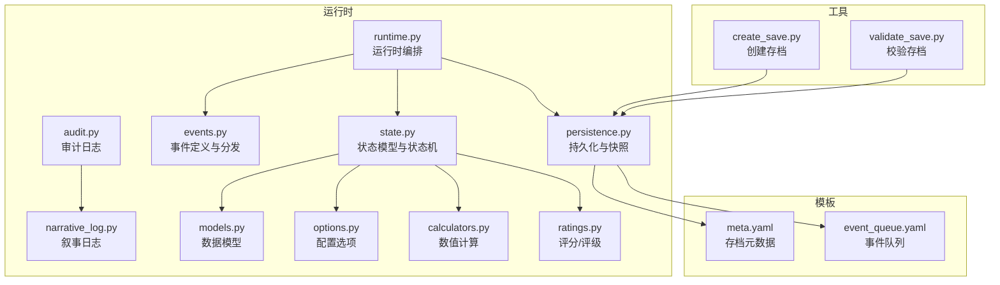
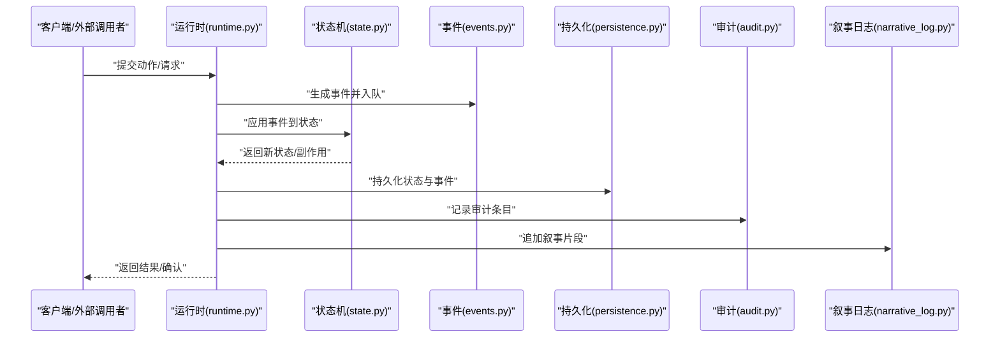
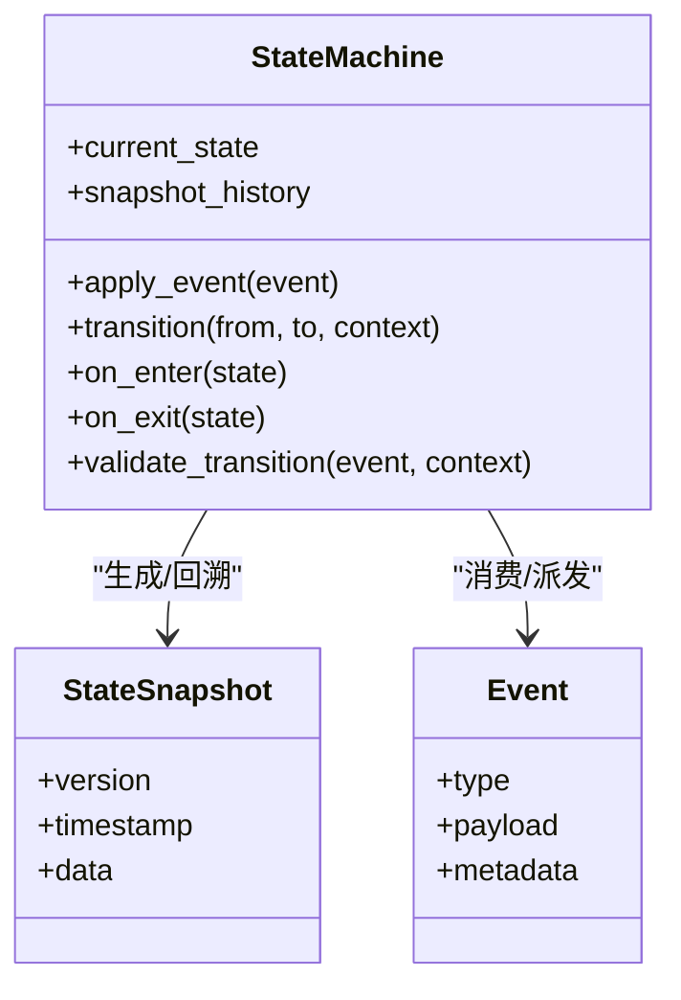
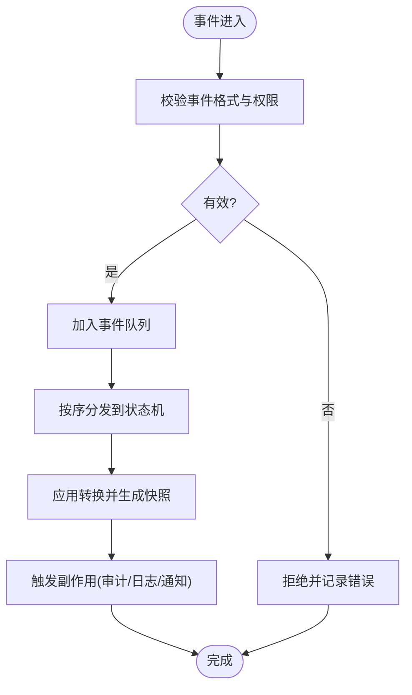
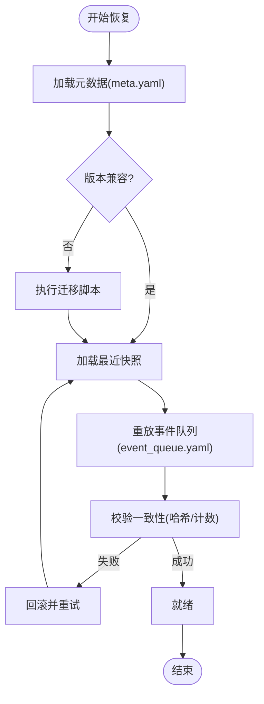
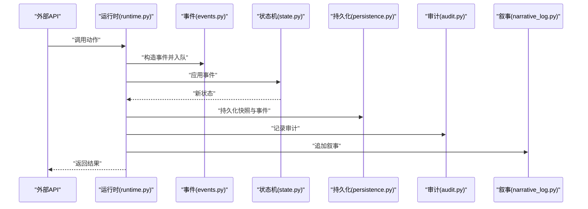
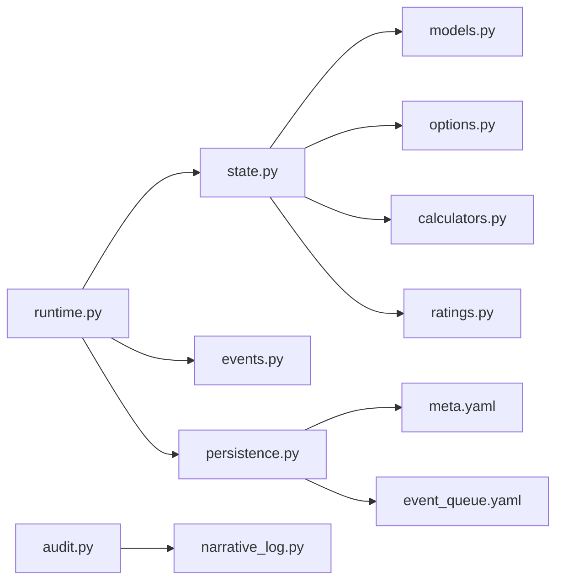

# 状态管理

<cite>
**本文引用的文件**   
- [engine_runtime/state.py](file://engine_runtime/state.py)
- [engine_runtime/persistence.py](file://engine_runtime/persistence.py)
- [engine_runtime/runtime.py](file://engine_runtime/runtime.py)
- [engine_runtime/events.py](file://engine_runtime/events.py)
- [engine_runtime/models.py](file://engine_runtime/models.py)
- [engine_runtime/audit.py](file://engine_runtime/audit.py)
- [engine_runtime/narrative_log.py](file://engine_runtime/narrative_log.py)
- [engine_runtime/options.py](file://engine_runtime/options.py)
- [engine_runtime/calculators.py](file://engine_runtime/calculators.py)
- [engine_runtime/ratings.py](file://engine_runtime/ratings.py)
- [templates/save_template/meta.yaml](file://templates/save_template/meta.yaml)
- [templates/save_template/event_queue.yaml](file://templates/save_template/event_queue.yaml)
- [tools/create_save.py](file://tools/create_save.py)
- [tools/validate_save.py](file://tools/validate_save.py)
</cite>

## 目录
1. [简介](#简介)
2. [项目结构](#项目结构)
3. [核心组件](#核心组件)
4. [架构总览](#架构总览)
5. [详细组件分析](#详细组件分析)
6. [依赖关系分析](#依赖关系分析)
7. [性能考虑](#性能考虑)
8. [故障排查指南](#故障排查指南)
9. [结论](#结论)
10. [附录](#附录)

## 简介
本文件围绕“状态管理”展开，聚焦于引擎运行时中的状态机设计、状态转换规则与生命周期管理；阐述状态的持久化策略、快照机制与恢复流程；说明并发访问控制、锁机制与一致性保证；提供状态转换示例与错误处理模式；解释状态监听器与事件通知机制；并给出状态调试工具、监控指标与性能分析方法，以及状态迁移与版本升级的最佳实践。

## 项目结构
本项目采用分层组织：
- engine_runtime：运行时核心，包含状态、事件、持久化、审计、计算器等模块
- templates：保存模板，定义存档结构与元数据
- tools：辅助工具，用于创建、验证、回放等

**图表来源** 
- [engine_runtime/state.py](file://engine_runtime/state.py)
- [engine_runtime/runtime.py](file://engine_runtime/runtime.py)
- [engine_runtime/events.py](file://engine_runtime/events.py)
- [engine_runtime/persistence.py](file://engine_runtime/persistence.py)
- [engine_runtime/models.py](file://engine_runtime/models.py)
- [engine_runtime/audit.py](file://engine_runtime/audit.py)
- [engine_runtime/narrative_log.py](file://engine_runtime/narrative_log.py)
- [engine_runtime/options.py](file://engine_runtime/options.py)
- [engine_runtime/calculators.py](file://engine_runtime/calculators.py)
- [engine_runtime/ratings.py](file://engine_runtime/ratings.py)
- [templates/save_template/meta.yaml](file://templates/save_template/meta.yaml)
- [templates/save_template/event_queue.yaml](file://templates/save_template/event_queue.yaml)
- [tools/create_save.py](file://tools/create_save.py)
- [tools/validate_save.py](file://tools/validate_save.py)

**章节来源**
- [engine_runtime/state.py](file://engine_runtime/state.py)
- [engine_runtime/persistence.py](file://engine_runtime/persistence.py)
- [engine_runtime/runtime.py](file://engine_runtime/runtime.py)
- [engine_runtime/events.py](file://engine_runtime/events.py)
- [engine_runtime/models.py](file://engine_runtime/models.py)
- [engine_runtime/audit.py](file://engine_runtime/audit.py)
- [engine_runtime/narrative_log.py](file://engine_runtime/narrative_log.py)
- [engine_runtime/options.py](file://engine_runtime/options.py)
- [engine_runtime/calculators.py](file://engine_runtime/calculators.py)
- [engine_runtime/ratings.py](file://engine_runtime/ratings.py)
- [templates/save_template/meta.yaml](file://templates/save_template/meta.yaml)
- [templates/save_template/event_queue.yaml](file://templates/save_template/event_queue.yaml)
- [tools/create_save.py](file://tools/create_save.py)
- [tools/validate_save.py](file://tools/validate_save.py)

## 核心组件
- 状态机与状态模型：集中定义状态结构、状态枚举、转换规则与生命周期钩子
- 事件系统：定义领域事件、事件队列与分发机制，驱动状态变更
- 持久化与快照：序列化/反序列化状态、增量/全量快照、事务性写入
- 审计与叙事日志：记录状态变更轨迹与可读的叙事输出
- 运行时编排：协调事件消费、状态更新、持久化与回调
- 配置与计算：加载运行选项、执行数值计算与评分

**章节来源**
- [engine_runtime/state.py](file://engine_runtime/state.py)
- [engine_runtime/events.py](file://engine_runtime/events.py)
- [engine_runtime/persistence.py](file://engine_runtime/persistence.py)
- [engine_runtime/audit.py](file://engine_runtime/audit.py)
- [engine_runtime/narrative_log.py](file://engine_runtime/narrative_log.py)
- [engine_runtime/runtime.py](file://engine_runtime/runtime.py)
- [engine_runtime/options.py](file://engine_runtime/options.py)
- [engine_runtime/calculators.py](file://engine_runtime/calculators.py)
- [engine_runtime/ratings.py](file://engine_runtime/ratings.py)

## 架构总览
下图展示了状态管理的整体交互：运行时从事件源消费事件，调用状态机进行转换，随后通过持久化层落盘，并通过审计与叙事日志输出可观测信息。

**图表来源** 
- [engine_runtime/runtime.py](file://engine_runtime/runtime.py)
- [engine_runtime/state.py](file://engine_runtime/state.py)
- [engine_runtime/events.py](file://engine_runtime/events.py)
- [engine_runtime/persistence.py](file://engine_runtime/persistence.py)
- [engine_runtime/audit.py](file://engine_runtime/audit.py)
- [engine_runtime/narrative_log.py](file://engine_runtime/narrative_log.py)

## 详细组件分析

### 状态机与状态模型（state.py）
- 职责
  - 定义状态数据结构与状态枚举
  - 实现状态转换函数与前置条件校验
  - 暴露生命周期钩子（如 on_enter/on_exit）
  - 维护当前状态与历史快照
- 关键设计
  - 不可变快照：每次转换生成新的状态快照，便于回滚与审计
  - 转换表：以事件类型映射到转换函数，确保规则清晰可维护
  - 校验器：在转换前对输入参数与上下文进行合法性检查
  - 副作用隔离：将副作用（如事件派发、日志）与纯状态更新解耦
- 并发与一致性
  - 建议采用写时复制（Copy-on-Write）策略，避免共享可变状态
  - 对外暴露只读视图，内部使用不可变快照
  - 若需多线程访问，应在上层加细粒度锁或基于消息传递

**图表来源** 
- [engine_runtime/state.py](file://engine_runtime/state.py)

**章节来源**
- [engine_runtime/state.py](file://engine_runtime/state.py)

### 事件系统（events.py）
- 职责
  - 定义事件类型与载荷结构
  - 维护事件队列与顺序保证
  - 提供事件订阅/发布接口
- 关键设计
  - 事件溯源：所有状态变更由事件驱动，支持重放与审计
  - 幂等性：同一事件多次消费不改变最终状态
  - 有序性：按时间戳或序列号排序，保证线性一致
- 与状态机协作
  - 状态机根据事件类型选择对应转换函数
  - 转换成功后触发后续事件（副作用）

**图表来源** 
- [engine_runtime/events.py](file://engine_runtime/events.py)

**章节来源**
- [engine_runtime/events.py](file://engine_runtime/events.py)

### 持久化与快照（persistence.py）
- 职责
  - 状态与事件的序列化/反序列化
  - 全量快照与增量日志
  - 事务性写入与一致性保障
- 关键设计
  - 原子落盘：先写临时文件再原子替换，避免损坏
  - 校验和：写入前后校验完整性
  - 版本兼容：元数据中包含版本信息，支持向前/向后兼容
- 恢复流程
  - 读取最新快照
  - 重放增量事件至目标时间点
  - 重建内存状态并校验一致性

**图表来源** 
- [engine_runtime/persistence.py](file://engine_runtime/persistence.py)
- [templates/save_template/meta.yaml](file://templates/save_template/meta.yaml)
- [templates/save_template/event_queue.yaml](file://templates/save_template/event_queue.yaml)

**章节来源**
- [engine_runtime/persistence.py](file://engine_runtime/persistence.py)
- [templates/save_template/meta.yaml](file://templates/save_template/meta.yaml)
- [templates/save_template/event_queue.yaml](file://templates/save_template/event_queue.yaml)

### 审计与叙事日志（audit.py, narrative_log.py）
- 职责
  - 记录状态变更轨迹（审计）
  - 生成面向用户的叙事文本
- 关键设计
  - 审计条目包含时间戳、操作者、事件ID、旧/新值摘要
  - 叙事日志按章节/回合组织，便于回放与分享
- 与持久化协作
  - 审计与叙事作为状态变更的副产物，随快照一起落盘

**章节来源**
- [engine_runtime/audit.py](file://engine_runtime/audit.py)
- [engine_runtime/narrative_log.py](file://engine_runtime/narrative_log.py)

### 运行时编排（runtime.py）
- 职责
  - 协调事件消费、状态更新、持久化与回调
  - 管理生命周期（启动、运行、停止）
  - 暴露统一的API供外部调用
- 关键设计
  - 单线程事件循环或带背压的队列
  - 重试与退避策略
  - 健康检查与指标上报

**图表来源** 
- [engine_runtime/runtime.py](file://engine_runtime/runtime.py)
- [engine_runtime/events.py](file://engine_runtime/events.py)
- [engine_runtime/state.py](file://engine_runtime/state.py)
- [engine_runtime/persistence.py](file://engine_runtime/persistence.py)
- [engine_runtime/audit.py](file://engine_runtime/audit.py)
- [engine_runtime/narrative_log.py](file://engine_runtime/narrative_log.py)

**章节来源**
- [engine_runtime/runtime.py](file://engine_runtime/runtime.py)

### 数据模型与配置（models.py, options.py）
- models.py：定义领域实体与约束，供状态机与持久化使用
- options.py：加载运行选项（如最大事件数、快照间隔、重试次数）

**章节来源**
- [engine_runtime/models.py](file://engine_runtime/models.py)
- [engine_runtime/options.py](file://engine_runtime/options.py)

### 数值计算与评分（calculators.py, ratings.py）
- calculators.py：提供确定性计算函数，避免随机性影响状态一致性
- ratings.py：评分/评级逻辑，常用于状态分支或事件权重

**章节来源**
- [engine_runtime/calculators.py](file://engine_runtime/calculators.py)
- [engine_runtime/ratings.py](file://engine_runtime/ratings.py)

## 依赖关系分析
- 低耦合高内聚：状态机仅依赖事件与模型，持久化独立于业务逻辑
- 明确边界：运行时负责编排，状态机专注转换，事件系统负责解耦
- 潜在循环依赖：应避免状态机直接依赖持久化，通过运行时注入

**图表来源** 
- [engine_runtime/runtime.py](file://engine_runtime/runtime.py)
- [engine_runtime/state.py](file://engine_runtime/state.py)
- [engine_runtime/events.py](file://engine_runtime/events.py)
- [engine_runtime/persistence.py](file://engine_runtime/persistence.py)
- [engine_runtime/models.py](file://engine_runtime/models.py)
- [engine_runtime/options.py](file://engine_runtime/options.py)
- [engine_runtime/calculators.py](file://engine_runtime/calculators.py)
- [engine_runtime/ratings.py](file://engine_runtime/ratings.py)
- [engine_runtime/audit.py](file://engine_runtime/audit.py)
- [engine_runtime/narrative_log.py](file://engine_runtime/narrative_log.py)
- [templates/save_template/meta.yaml](file://templates/save_template/meta.yaml)
- [templates/save_template/event_queue.yaml](file://templates/save_template/event_queue.yaml)

**章节来源**
- [engine_runtime/runtime.py](file://engine_runtime/runtime.py)
- [engine_runtime/state.py](file://engine_runtime/state.py)
- [engine_runtime/events.py](file://engine_runtime/events.py)
- [engine_runtime/persistence.py](file://engine_runtime/persistence.py)
- [engine_runtime/models.py](file://engine_runtime/models.py)
- [engine_runtime/options.py](file://engine_runtime/options.py)
- [engine_runtime/calculators.py](file://engine_runtime/calculators.py)
- [engine_runtime/ratings.py](file://engine_runtime/ratings.py)
- [engine_runtime/audit.py](file://engine_runtime/audit.py)
- [engine_runtime/narrative_log.py](file://engine_runtime/narrative_log.py)
- [templates/save_template/meta.yaml](file://templates/save_template/meta.yaml)
- [templates/save_template/event_queue.yaml](file://templates/save_template/event_queue.yaml)

## 性能考虑
- 事件批处理：合并高频小事件，减少序列化与I/O开销
- 快照策略：定期全量快照+增量事件，平衡恢复时间与存储成本
- 异步持久化：非关键路径落盘，避免阻塞主循环
- 内存管理：使用不可变快照与对象池，降低GC压力
- 计算优化：缓存中间结果，避免重复计算

[本节为通用指导，无需特定文件引用]

## 故障排查指南
- 常见错误
  - 事件顺序错乱：检查事件时间戳与队列顺序
  - 快照不一致：校验和失败，重新重放事件
  - 版本不兼容：升级元数据或执行迁移脚本
- 诊断工具
  - create_save.py：快速生成测试存档
  - validate_save.py：校验存档完整性与一致性
- 监控指标
  - 事件吞吐、延迟分布
  - 快照大小与频率
  - 状态转换成功率与失败原因分类

**章节来源**
- [tools/create_save.py](file://tools/create_save.py)
- [tools/validate_save.py](file://tools/validate_save.py)

## 结论
本状态管理体系以事件驱动为核心，结合不可变快照与事务性持久化，实现了高可靠、可追溯的状态管理。通过清晰的职责划分与严格的转换规则，系统在并发与一致性方面具备良好基础。配合审计、叙事日志与工具链，可有效支撑调试、监控与版本升级。

[本节为总结性内容，无需特定文件引用]

## 附录

### 状态转换示例与错误处理模式
- 示例流程
  - 玩家发起“购买物品”动作
  - 运行时构造“购买事件”并入队
  - 状态机校验余额与库存后执行转换
  - 生成“交易完成事件”，更新库存与背包
  - 持久化快照与事件，记录审计与叙事
- 错误处理
  - 参数非法：拒绝事件并记录错误审计
  - 资源不足：返回可重试错误，提示用户
  - 持久化失败：重试与降级策略，必要时回滚

[本节为概念性说明，无需特定文件引用]

### 状态监听器与事件通知机制
- 监听器注册：订阅感兴趣的事件类型
- 通知时机：状态转换完成后触发
- 去抖与限流：防止风暴式通知
- 失败隔离：单个监听器失败不影响主流程

[本节为概念性说明，无需特定文件引用]

### 状态调试工具、监控指标与性能分析方法
- 调试工具
  - 事件回放：重放指定时间段事件，定位问题
  - 快照对比：比较两个版本的差异
- 监控指标
  - 事件队列长度、消费速率
  - 状态转换耗时分布
  - 持久化写入延迟
- 性能分析
  - 热点函数剖析
  - I/O瓶颈定位
  - 内存泄漏检测

[本节为概念性说明，无需特定文件引用]

### 状态迁移与版本升级最佳实践
- 元数据版本：每个存档包含版本号与兼容性矩阵
- 迁移脚本：按版本顺序执行，保证幂等
- 灰度发布：逐步切换新版本，观察指标
- 回滚策略：保留旧版快照与迁移日志，支持快速回滚

[本节为概念性说明，无需特定文件引用]