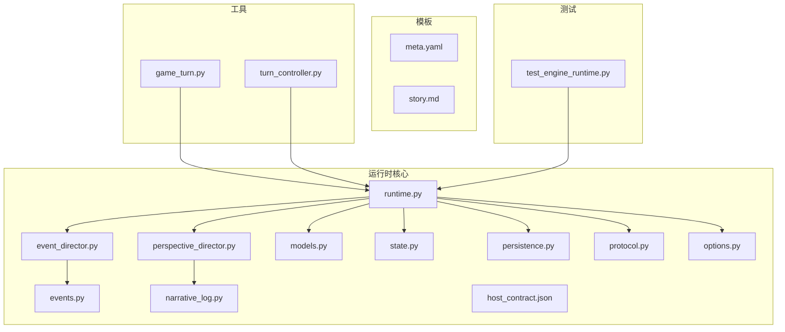
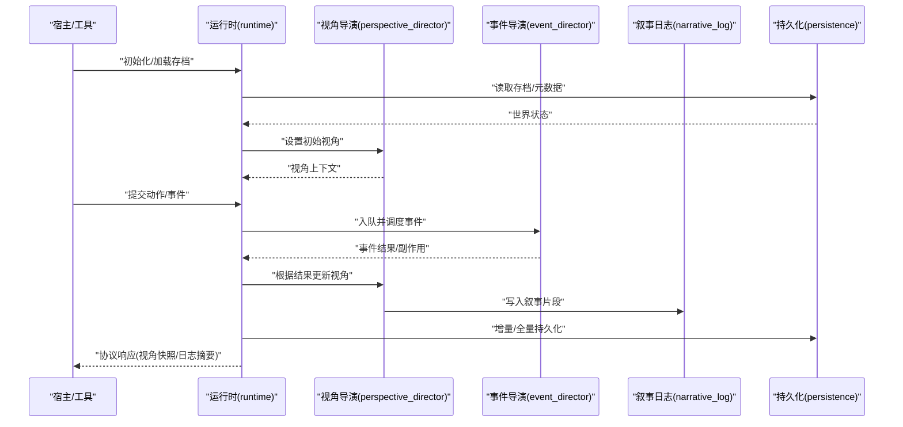
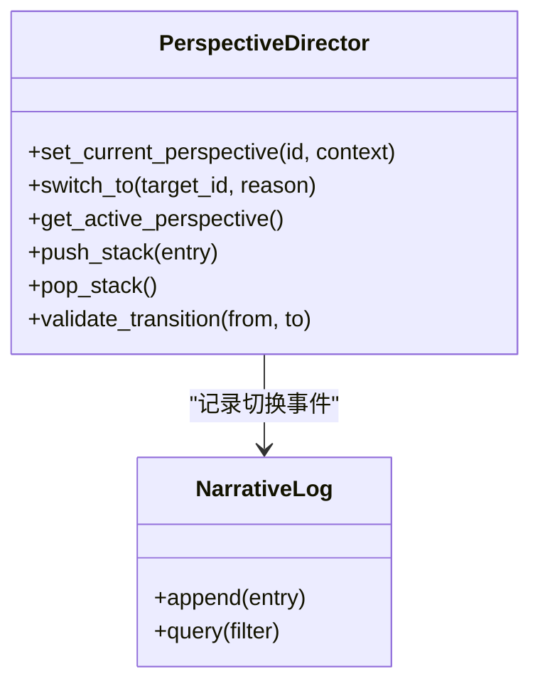
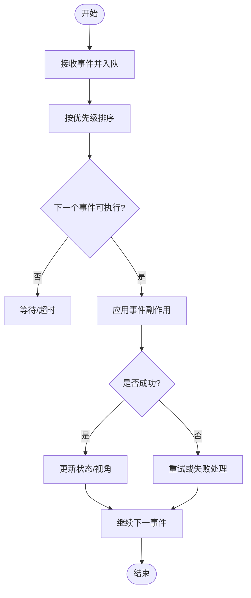
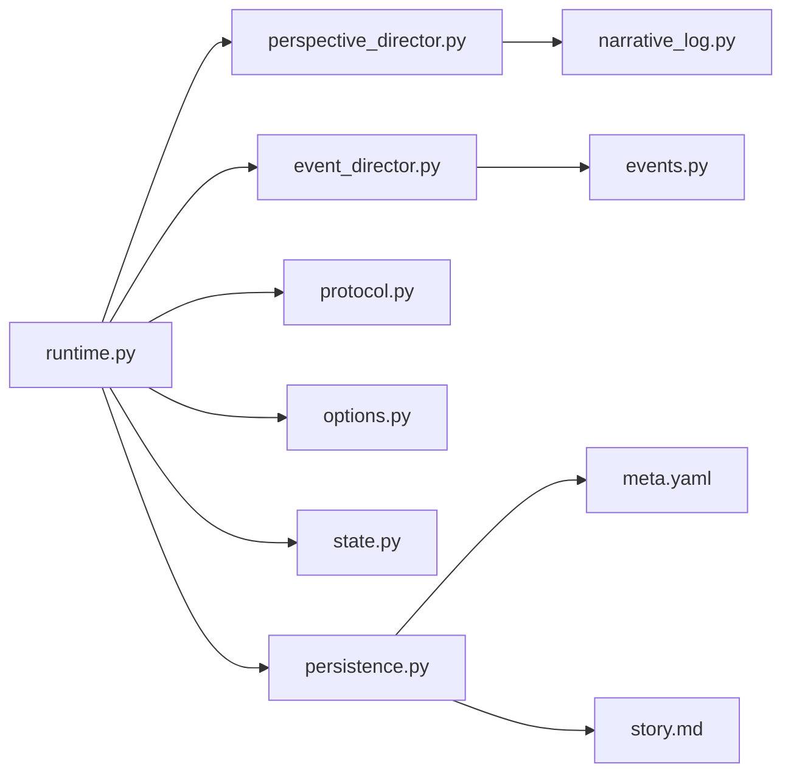

# 视角管理系统

<cite>
**本文档引用的文件**   
- [engine_runtime/runtime.py](file://engine_runtime/runtime.py)
- [engine_runtime/perspective_director.py](file://engine_runtime/perspective_director.py)
- [engine_runtime/event_director.py](file://engine_runtime/event_director.py)
- [engine_runtime/events.py](file://engine_runtime/events.py)
- [engine_runtime/models.py](file://engine_runtime/models.py)
- [engine_runtime/state.py](file://engine_runtime/state.py)
- [engine_runtime/persistence.py](file://engine_runtime/persistence.py)
- [engine_runtime/narrative_log.py](file://engine_runtime/narrative_log.py)
- [engine_runtime/protocol.py](file://engine_runtime/protocol.py)
- [engine_runtime/options.py](file://engine_runtime/options.py)
- [engine_runtime/host_contract.json](file://engine_runtime/host_contract.json)
- [templates/save_template/meta.yaml](file://templates/save_template/meta.yaml)
- [templates/save_template/story.md](file://templates/save_template/story.md)
- [tools/game_turn.py](file://tools/game_turn.py)
- [tools/turn_controller.py](file://tools/turn_controller.py)
- [tests/test_engine_runtime.py](file://tests/test_engine_runtime.py)
</cite>

## 目录
1. [简介](#简介)
2. [项目结构](#项目结构)
3. [核心组件](#核心组件)
4. [架构总览](#架构总览)
5. [详细组件分析](#详细组件分析)
6. [依赖关系分析](#依赖关系分析)
7. [性能考量](#性能考量)
8. [故障排查指南](#故障排查指南)
9. [结论](#结论)
10. [附录](#附录)

## 简介
本文件面向“视角管理系统”的文档化说明，聚焦于引擎运行时中围绕“视角（Perspective）”的组织、调度与呈现。系统以事件驱动为核心，通过导演类协调视角切换、叙事日志记录与持久化，为上层宿主或工具提供稳定的协议接口。整体设计强调可测试性、可扩展性与清晰的职责边界。

## 项目结构
- engine_runtime：运行时核心模块，包含视角导演、事件导演、模型、状态、协议、选项、持久化与叙事日志等。
- templates：存档模板与元数据定义，用于保存/恢复世界状态与叙事内容。
- tools：命令行工具，封装回合控制、回放与审计等能力。
- tests：单元测试与集成测试，覆盖运行时关键路径。

图表来源
- [engine_runtime/runtime.py](file://engine_runtime/runtime.py)
- [engine_runtime/perspective_director.py](file://engine_runtime/perspective_director.py)
- [engine_runtime/event_director.py](file://engine_runtime/event_director.py)
- [engine_runtime/events.py](file://engine_runtime/events.py)
- [engine_runtime/models.py](file://engine_runtime/models.py)
- [engine_runtime/state.py](file://engine_runtime/state.py)
- [engine_runtime/persistence.py](file://engine_runtime/persistence.py)
- [engine_runtime/narrative_log.py](file://engine_runtime/narrative_log.py)
- [engine_runtime/protocol.py](file://engine_runtime/protocol.py)
- [engine_runtime/options.py](file://engine_runtime/options.py)
- [engine_runtime/host_contract.json](file://engine_runtime/host_contract.json)
- [templates/save_template/meta.yaml](file://templates/save_template/meta.yaml)
- [templates/save_template/story.md](file://templates/save_template/story.md)
- [tools/game_turn.py](file://tools/game_turn.py)
- [tools/turn_controller.py](file://tools/turn_controller.py)
- [tests/test_engine_runtime.py](file://tests/test_engine_runtime.py)

章节来源
- [engine_runtime/runtime.py](file://engine_runtime/runtime.py)
- [engine_runtime/perspective_director.py](file://engine_runtime/perspective_director.py)
- [engine_runtime/event_director.py](file://engine_runtime/event_director.py)
- [engine_runtime/events.py](file://engine_runtime/events.py)
- [engine_runtime/models.py](file://engine_runtime/models.py)
- [engine_runtime/state.py](file://engine_runtime/state.py)
- [engine_runtime/persistence.py](file://engine_runtime/persistence.py)
- [engine_runtime/narrative_log.py](file://engine_runtime/narrative_log.py)
- [engine_runtime/protocol.py](file://engine_runtime/protocol.py)
- [engine_runtime/options.py](file://engine_runtime/options.py)
- [engine_runtime/host_contract.json](file://engine_runtime/host_contract.json)
- [templates/save_template/meta.yaml](file://templates/save_template/meta.yaml)
- [templates/save_template/story.md](file://templates/save_template/story.md)
- [tools/game_turn.py](file://tools/game_turn.py)
- [tools/turn_controller.py](file://tools/turn_controller.py)
- [tests/test_engine_runtime.py](file://tests/test_engine_runtime.py)

## 核心组件
- 运行时入口 runtime：组装并暴露统一接口，协调视角与事件生命周期。
- 视角导演 perspective_director：管理当前视角、视角切换策略与视角上下文。
- 事件导演 event_director：编排事件队列、执行顺序与副作用处理。
- 事件模型 events：事件类型、载荷与校验契约。
- 数据模型 models：领域实体与值对象。
- 状态 state：全局/会话状态容器，保证一致性。
- 持久化 persistence：序列化/反序列化与存档读写。
- 叙事日志 narrative_log：按时间线记录视角相关的叙事片段。
- 协议 protocol：对外暴露的调用约定与返回格式。
- 选项 options：配置项与运行时开关。
- 主机契约 host_contract.json：宿主与引擎之间的能力契约。

章节来源
- [engine_runtime/runtime.py](file://engine_runtime/runtime.py)
- [engine_runtime/perspective_director.py](file://engine_runtime/perspective_director.py)
- [engine_runtime/event_director.py](file://engine_runtime/event_director.py)
- [engine_runtime/events.py](file://engine_runtime/events.py)
- [engine_runtime/models.py](file://engine_runtime/models.py)
- [engine_runtime/state.py](file://engine_runtime/state.py)
- [engine_runtime/persistence.py](file://engine_runtime/persistence.py)
- [engine_runtime/narrative_log.py](file://engine_runtime/narrative_log.py)
- [engine_runtime/protocol.py](file://engine_runtime/protocol.py)
- [engine_runtime/options.py](file://engine_runtime/options.py)
- [engine_runtime/host_contract.json](file://engine_runtime/host_contract.json)

## 架构总览
视角管理系统采用“运行时 + 双导演（视角/事件）+ 协议”的分层架构。运行时负责装配与生命周期管理；视角导演维护当前视角与切换逻辑；事件导演驱动事件流；协议层屏蔽内部实现细节，向宿主或工具暴露稳定接口。

图表来源
- [engine_runtime/runtime.py](file://engine_runtime/runtime.py)
- [engine_runtime/perspective_director.py](file://engine_runtime/perspective_director.py)
- [engine_runtime/event_director.py](file://engine_runtime/event_director.py)
- [engine_runtime/narrative_log.py](file://engine_runtime/narrative_log.py)
- [engine_runtime/persistence.py](file://engine_runtime/persistence.py)

## 详细组件分析

### 运行时 runtime
- 职责：装配各子系统、暴露统一API、管理生命周期、协调视角与事件。
- 关键点：
  - 初始化阶段加载配置与存档，构建状态容器。
  - 对外提供视角切换、事件提交、查询与持久化方法。
  - 错误隔离与回滚策略，确保视角与事件的一致性。

章节来源
- [engine_runtime/runtime.py](file://engine_runtime/runtime.py)

### 视角导演 perspective_director
- 职责：维护当前视角、视角栈、切换规则与上下文。
- 关键点：
  - 视角切换前进行合法性校验与前置条件检查。
  - 支持多视角并行与优先级策略。
  - 与叙事日志联动，记录视角切换轨迹。

图表来源
- [engine_runtime/perspective_director.py](file://engine_runtime/perspective_director.py)
- [engine_runtime/narrative_log.py](file://engine_runtime/narrative_log.py)

章节来源
- [engine_runtime/perspective_director.py](file://engine_runtime/perspective_director.py)
- [engine_runtime/narrative_log.py](file://engine_runtime/narrative_log.py)

### 事件导演 event_director
- 职责：事件队列管理、执行顺序、副作用派发与重试。
- 关键点：
  - 支持批量入队与优先级排序。
  - 失败事件的可观测性与重试策略。
  - 与视角导演的协作：事件结果可能触发视角切换。

图表来源
- [engine_runtime/event_director.py](file://engine_runtime/event_director.py)
- [engine_runtime/events.py](file://engine_runtime/events.py)

章节来源
- [engine_runtime/event_director.py](file://engine_runtime/event_director.py)
- [engine_runtime/events.py](file://engine_runtime/events.py)

### 协议 protocol
- 职责：定义对外API的请求/响应结构、错误码与版本兼容。
- 关键点：
  - 统一的输入校验与输出序列化。
  - 向后兼容的字段扩展策略。
  - 与宿主契约 host_contract.json 对齐。

章节来源
- [engine_runtime/protocol.py](file://engine_runtime/protocol.py)
- [engine_runtime/host_contract.json](file://engine_runtime/host_contract.json)

### 选项 options 与状态 state
- 选项：运行时开关、调试标志、性能参数。
- 状态：全局/会话级状态容器，保证跨组件一致性。

章节来源
- [engine_runtime/options.py](file://engine_runtime/options.py)
- [engine_runtime/state.py](file://engine_runtime/state.py)

### 数据模型 models
- 职责：领域实体与值对象的定义，约束与校验。
- 关键点：
  - 与事件载荷、视角上下文的数据契约一致。
  - 支持序列化/反序列化的字段映射。

章节来源
- [engine_runtime/models.py](file://engine_runtime/models.py)

### 持久化 persistence
- 职责：存档读写、增量同步、校验与恢复。
- 关键点：
  - 基于模板 meta.yaml 与 story.md 的结构化存储。
  - 事务性写入与损坏检测。

章节来源
- [engine_runtime/persistence.py](file://engine_runtime/persistence.py)
- [templates/save_template/meta.yaml](file://templates/save_template/meta.yaml)
- [templates/save_template/story.md](file://templates/save_template/story.md)

### 叙事日志 narrative_log
- 职责：按时间线记录视角相关事件、切换与摘要。
- 关键点：
  - 支持过滤与分页查询。
  - 与视角导演的事件流紧密耦合。

章节来源
- [engine_runtime/narrative_log.py](file://engine_runtime/narrative_log.py)

## 依赖关系分析
- 运行时依赖视角导演与事件导演，二者分别依赖叙事日志与事件模型。
- 协议层作为对外边界，依赖选项与状态，确保输入输出稳定。
- 持久化依赖模板结构与状态快照，保障存档一致性。

图表来源
- [engine_runtime/runtime.py](file://engine_runtime/runtime.py)
- [engine_runtime/perspective_director.py](file://engine_runtime/perspective_director.py)
- [engine_runtime/event_director.py](file://engine_runtime/event_director.py)
- [engine_runtime/narrative_log.py](file://engine_runtime/narrative_log.py)
- [engine_runtime/events.py](file://engine_runtime/events.py)
- [engine_runtime/protocol.py](file://engine_runtime/protocol.py)
- [engine_runtime/options.py](file://engine_runtime/options.py)
- [engine_runtime/state.py](file://engine_runtime/state.py)
- [engine_runtime/persistence.py](file://engine_runtime/persistence.py)
- [templates/save_template/meta.yaml](file://templates/save_template/meta.yaml)
- [templates/save_template/story.md](file://templates/save_template/story.md)

章节来源
- [engine_runtime/runtime.py](file://engine_runtime/runtime.py)
- [engine_runtime/perspective_director.py](file://engine_runtime/perspective_director.py)
- [engine_runtime/event_director.py](file://engine_runtime/event_director.py)
- [engine_runtime/narrative_log.py](file://engine_runtime/narrative_log.py)
- [engine_runtime/events.py](file://engine_runtime/events.py)
- [engine_runtime/protocol.py](file://engine_runtime/protocol.py)
- [engine_runtime/options.py](file://engine_runtime/options.py)
- [engine_runtime/state.py](file://engine_runtime/state.py)
- [engine_runtime/persistence.py](file://engine_runtime/persistence.py)
- [templates/save_template/meta.yaml](file://templates/save_template/meta.yaml)
- [templates/save_template/story.md](file://templates/save_template/story.md)

## 性能考量
- 事件批处理与优先级队列可降低频繁上下文切换开销。
- 视角切换应尽量避免深拷贝大对象，使用引用与懒加载。
- 持久化采用增量写入与校验合并，减少I/O压力。
- 日志写入异步化，避免阻塞主流程。

[本节为通用指导，不直接分析具体文件]

## 故障排查指南
- 视角切换失败：检查视角合法性、前置条件与冲突策略。
- 事件执行异常：查看事件队列、重试计数与副作用日志。
- 存档不一致：对比元数据与故事文本，运行校验工具。
- 协议不兼容：核对 host_contract.json 与协议版本。

章节来源
- [engine_runtime/perspective_director.py](file://engine_runtime/perspective_director.py)
- [engine_runtime/event_director.py](file://engine_runtime/event_director.py)
- [engine_runtime/persistence.py](file://engine_runtime/persistence.py)
- [engine_runtime/protocol.py](file://engine_runtime/protocol.py)
- [engine_runtime/host_contract.json](file://engine_runtime/host_contract.json)

## 结论
视角管理系统以运行时为中心，通过视角与事件双导演协同工作，结合协议与持久化，形成高内聚、低耦合的架构。其设计兼顾了可扩展性与稳定性，适合在复杂叙事与多视角场景中持续演进。

[本节为总结性内容，不直接分析具体文件]

## 附录
- 工具使用示例：通过 game_turn 与 turn_controller 驱动回合与回放。
- 测试要点：覆盖视角切换、事件调度与持久化一致性。

章节来源
- [tools/game_turn.py](file://tools/game_turn.py)
- [tools/turn_controller.py](file://tools/turn_controller.py)
- [tests/test_engine_runtime.py](file://tests/test_engine_runtime.py)