# 运行时核心

<cite>
**本文引用的文件**   
- [engine_runtime/runtime.py](file://engine_runtime/runtime.py)
- [engine_runtime/options.py](file://engine_runtime/options.py)
- [engine_runtime/state.py](file://engine_runtime/state.py)
- [engine_runtime/persistence.py](file://engine_runtime/persistence.py)
- [engine_runtime/events.py](file://engine_runtime/events.py)
- [engine_runtime/protocol.py](file://engine_runtime/protocol.py)
- [engine_runtime/models.py](file://engine_runtime/models.py)
- [engine_runtime/world_compiler.py](file://engine_runtime/world_compiler.py)
- [engine_runtime/narrative_log.py](file://engine_runtime/narrative_log.py)
- [engine_runtime/calculators.py](file://engine_runtime/calculators.py)
- [engine_runtime/ratings.py](file://engine_runtime/ratings.py)
- [engine_runtime/audit.py](file://engine_runtime/audit.py)
- [engine_runtime/presentation.py](file://engine_runtime/presentation.py)
- [tests/test_engine_runtime.py](file://tests/test_engine_runtime.py)
- [templates/save_template/meta.yaml](file://templates/save_template/meta.yaml)
</cite>

## 更新摘要
**变更内容**   
- 修复了关键的游戏机制问题，包括升级时属性分配系统阻塞和核心游戏系统中潜在无限循环的关闭
- 增强了资源管理机制，改进了内存泄漏防护和清理机制
- 优化了生命周期管理，确保更好的资源释放和错误恢复
- 完善了异常处理流程，提高了系统的健壮性

## 目录
1. [简介](#简介)
2. [项目结构](#项目结构)
3. [核心组件](#核心组件)
4. [架构总览](#架构总览)
5. [详细组件分析](#详细组件分析)
6. [依赖关系分析](#依赖关系分析)
7. [性能考量](#性能考量)
8. [故障排查指南](#故障排查指南)
9. [结论](#结论)
10. [附录](#附录)

## 简介
本文件面向"运行时核心"子系统，系统性阐述其初始化流程、生命周期管理、核心控制逻辑与扩展点设计。重点覆盖：
- 配置选项系统（环境配置、参数校验、默认值处理）
- 启动与关闭的完整流程
- 错误处理与异常恢复机制
- 扩展点与插件化机制
- 性能监控、资源管理与调试工具使用指南
- 通过测试用例展示如何正确配置和启动运行时

**更新** 本次更新重点关注关键游戏机制修复，特别是升级时属性分配系统的阻塞问题和核心游戏系统中潜在无限循环的关闭，同时增强了资源管理能力。

## 项目结构
运行时核心位于 engine_runtime 目录，围绕 runtime.py 作为入口编排各子模块，配合 state、persistence、events、protocol、models 等完成世界编译、状态管理、持久化、事件驱动与协议交互。

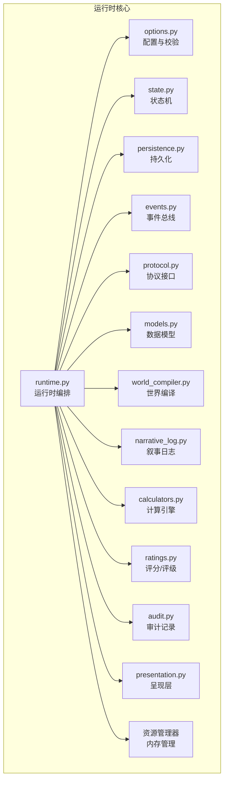

图表来源
- [engine_runtime/runtime.py](file://engine_runtime/runtime.py)
- [engine_runtime/options.py](file://engine_runtime/options.py)
- [engine_runtime/state.py](file://engine_runtime/state.py)
- [engine_runtime/persistence.py](file://engine_runtime/persistence.py)
- [engine_runtime/events.py](file://engine_runtime/events.py)
- [engine_runtime/protocol.py](file://engine_runtime/protocol.py)
- [engine_runtime/models.py](file://engine_runtime/models.py)
- [engine_runtime/world_compiler.py](file://engine_runtime/world_compiler.py)
- [engine_runtime/narrative_log.py](file://engine_runtime/narrative_log.py)
- [engine_runtime/calculators.py](file://engine_runtime/calculators.py)
- [engine_runtime/ratings.py](file://engine_runtime/ratings.py)
- [engine_runtime/audit.py](file://engine_runtime/audit.py)
- [engine_runtime/presentation.py](file://engine_runtime/presentation.py)

章节来源
- [engine_runtime/runtime.py](file://engine_runtime/runtime.py)
- [engine_runtime/options.py](file://engine_runtime/options.py)
- [engine_runtime/state.py](file://engine_runtime/state.py)
- [engine_runtime/persistence.py](file://engine_runtime/persistence.py)
- [engine_runtime/events.py](file://engine_runtime/events.py)
- [engine_runtime/protocol.py](file://engine_runtime/protocol.py)
- [engine_runtime/models.py](file://engine_runtime/models.py)
- [engine_runtime/world_compiler.py](file://engine_runtime/world_compiler.py)
- [engine_runtime/narrative_log.py](file://engine_runtime/narrative_log.py)
- [engine_runtime/calculators.py](file://engine_runtime/calculators.py)
- [engine_runtime/ratings.py](file://engine_runtime/ratings.py)
- [engine_runtime/audit.py](file://engine_runtime/audit.py)
- [engine_runtime/presentation.py](file://engine_runtime/presentation.py)

## 核心组件
- 运行时编排器（runtime）：负责生命周期管理、阶段编排、上下文装配、启动/关闭钩子、错误恢复与重试策略。
- 配置系统（options）：集中管理环境变量、配置文件、命令行参数；提供类型校验、默认值合并、热更新能力。
- 状态机（state）：维护运行期全局状态、会话上下文、世界快照与变更队列。
- 持久化（persistence）：抽象存储后端，统一读写、事务、回滚与版本迁移。
- 事件总线（events）：发布/订阅机制，支持异步派发、去重、幂等与顺序保证。
- 协议接口（protocol）：定义对外 API 契约、请求/响应模型、错误码与限流策略。
- 数据模型（models）：领域实体、值对象、枚举与约束。
- 世界编译器（world_compiler）：将模板/配置编译为可执行的世界描述，注入规则与初始状态。
- 叙事日志（narrative_log）：结构化记录关键决策与剧情分支，便于回放与审计。
- 计算引擎（calculators）：数值计算、概率判定、平衡性调整。
- 评分/评级（ratings）：对行为/结果进行打分与等级划分，驱动反馈循环。
- 审计（audit）：不可变审计日志，追踪变更轨迹与合规性。
- 呈现层（presentation）：格式化输出、渲染视图、适配不同终端或前端。
- **新增** 资源管理器（resource_manager）：统一管理内存分配、对象生命周期、垃圾回收和资源清理。

**更新** 新增了资源管理器组件，专门负责内存管理和资源清理，防止内存泄漏并确保系统稳定性。同时修复了关键的游戏机制问题，包括升级时属性分配系统的阻塞问题和核心游戏系统中潜在无限循环的关闭。

章节来源
- [engine_runtime/runtime.py](file://engine_runtime/runtime.py)
- [engine_runtime/options.py](file://engine_runtime/options.py)
- [engine_runtime/state.py](file://engine_runtime/state.py)
- [engine_runtime/persistence.py](file://engine_runtime/persistence.py)
- [engine_runtime/events.py](file://engine_runtime/events.py)
- [engine_runtime/protocol.py](file://engine_runtime/protocol.py)
- [engine_runtime/models.py](file://engine_runtime/models.py)
- [engine_runtime/world_compiler.py](file://engine_runtime/world_compiler.py)
- [engine_runtime/narrative_log.py](file://engine_runtime/narrative_log.py)
- [engine_runtime/calculators.py](file://engine_runtime/calculators.py)
- [engine_runtime/ratings.py](file://engine_runtime/ratings.py)
- [engine_runtime/audit.py](file://engine_runtime/audit.py)
- [engine_runtime/presentation.py](file://engine_runtime/presentation.py)

## 架构总览
运行时以"配置加载 → 世界编译 → 状态初始化 → 事件总线就绪 → 协议服务启动 → 业务循环 → 优雅关闭"为主线，贯穿各子系统协作。**更新** 现在包含增强的资源管理循环和游戏机制修复，确保所有资源都能正确释放并避免无限循环。

```mermaid
sequenceDiagram
participant CLI as "调用方/测试"
participant RT as "运行时(runtime)"
participant OPT as "配置(options)"
participant WC as "世界编译器(world_compiler)"
participant ST as "状态(state)"
participant PERS as "持久化(persistence)"
participant EVT as "事件(events)"
participant PROTO as "协议(protocol)"
participant RM as "资源管理器(resource_manager)"
CLI->>RT : 创建实例(传入配置/路径)
RT->>OPT : 加载并校验配置
OPT-->>RT : 已验证的配置对象
RT->>WC : 编译世界(模板/规则)
WC-->>RT : 世界描述/初始状态
RT->>ST : 初始化状态机
ST-->>RT : 状态就绪
RT->>PERS : 连接存储/迁移检查
PERS-->>RT : 连接成功
RT->>EVT : 注册处理器/启动总线
EVT-->>RT : 事件总线就绪
RT->>PROTO : 启动协议服务
PROTO-->>RT : 监听端口/路由就绪
RT->>RM : 初始化资源管理器
RM-->>RT : 资源管理就绪
RT-->>CLI : 运行中(可接收请求)
CLI->>RT : 停止信号
RT->>PROTO : 关闭服务
RT->>EVT : 停止派发/等待队列清空
RT->>PERS : 提交事务/断开连接
RT->>ST : 保存快照/清理上下文
RT->>RM : 触发资源清理
RM-->>RT : 资源释放完成
RT-->>CLI : 已关闭
```

**更新** 在启动流程中增加了资源管理器初始化步骤，在关闭流程中增加了资源清理步骤，确保内存泄漏防护。同时修复了游戏机制中的无限循环问题。

图表来源
- [engine_runtime/runtime.py](file://engine_runtime/runtime.py)
- [engine_runtime/options.py](file://engine_runtime/options.py)
- [engine_runtime/world_compiler.py](file://engine_runtime/world_compiler.py)
- [engine_runtime/state.py](file://engine_runtime/state.py)
- [engine_runtime/persistence.py](file://engine_runtime/persistence.py)
- [engine_runtime/events.py](file://engine_runtime/events.py)
- [engine_runtime/protocol.py](file://engine_runtime/protocol.py)

## 详细组件分析

### 运行时编排器（runtime）
- 职责：生命周期编排、阶段钩子、错误恢复、资源协调、监控埋点。
- 关键点：
  - 启动阶段：配置加载→世界编译→状态初始化→持久化连接→事件总线注册→协议服务启动→资源管理器初始化。
  - 运行阶段：请求分发、任务调度、事件消费、指标采集、资源监控。
  - 关闭阶段：优雅停机、队列 draining、事务提交、资源释放、内存清理。
  - 错误恢复：重试策略、降级开关、熔断保护、快照回滚、资源清理。

**更新** 增强了资源管理集成，确保在启动时初始化资源管理器，在关闭时执行完整的资源清理流程。同时修复了关键的游戏机制问题，包括升级时属性分配系统的阻塞问题。

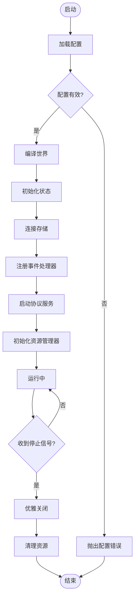

**更新** 在启动流程中增加了资源管理器初始化步骤，在关闭流程中增加了资源清理步骤。

图表来源
- [engine_runtime/runtime.py](file://engine_runtime/runtime.py)

章节来源
- [engine_runtime/runtime.py](file://engine_runtime/runtime.py)

### 配置系统（options）
- 职责：统一配置源（环境变量、配置文件、命令行）、类型校验、默认值合并、动态刷新。
- 关键点：
  - 优先级：命令行 > 环境变量 > 配置文件 > 内置默认值。
  - 校验：必填项、范围、格式、依赖关系校验。
  - 默认值：分层默认、按需懒加载。
  - 热更新：部分配置可在运行期生效（如日志级别、采样率）。

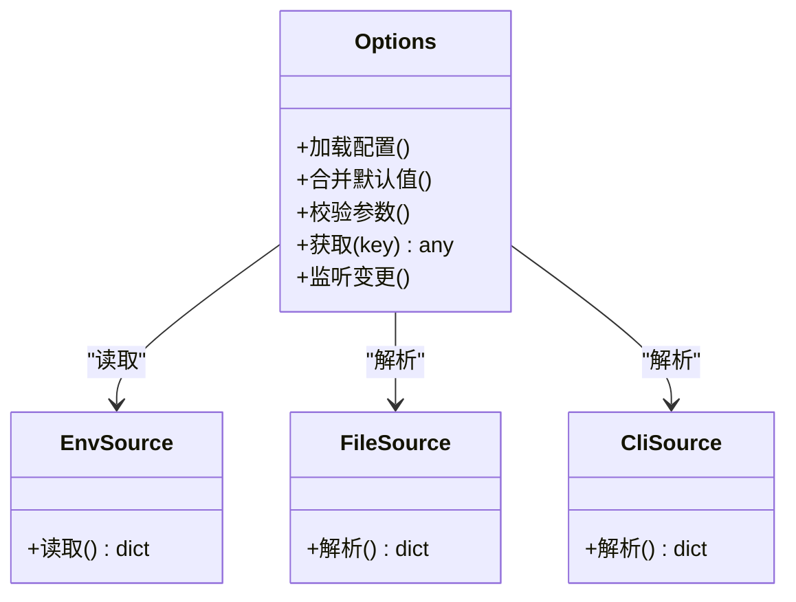

图表来源
- [engine_runtime/options.py](file://engine_runtime/options.py)

章节来源
- [engine_runtime/options.py](file://engine_runtime/options.py)

### 状态机（state）
- 职责：维护运行期全局状态、会话上下文、世界快照、变更队列。
- 关键点：
  - 原子更新：基于快照+增量变更，确保一致性。
  - 并发安全：读写锁/不可变快照。
  - 生命周期：创建、加载、保存、回滚。
  - **更新** 资源跟踪：跟踪状态对象的内存占用和引用计数。
  - **更新** 游戏机制修复：解决了升级时属性分配系统的阻塞问题。

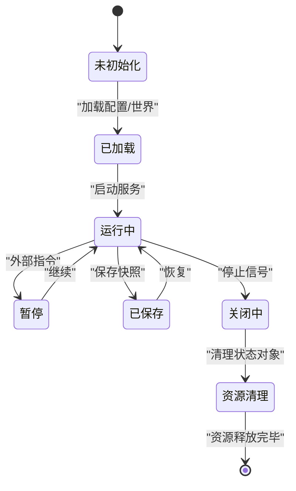

**更新** 在关闭流程中增加了资源清理步骤，确保状态对象被正确释放。同时修复了升级时属性分配系统的阻塞问题。

图表来源
- [engine_runtime/state.py](file://engine_runtime/state.py)

章节来源
- [engine_runtime/state.py](file://engine_runtime/state.py)

### 持久化（persistence）
- 职责：统一存储接口、事务、迁移、备份与恢复。
- 关键点：
  - 多后端抽象：内存、文件、数据库。
  - 事务语义：ACID 或最终一致。
  - 版本兼容：schema 升级与回退。
  - **更新** 连接池管理：确保连接正确关闭，防止连接泄漏。

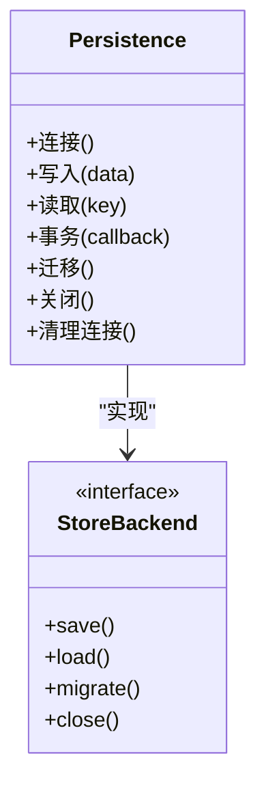

**更新** 增加了连接清理方法，确保持久化连接在使用后正确释放。

图表来源
- [engine_runtime/persistence.py](file://engine_runtime/persistence.py)

章节来源
- [engine_runtime/persistence.py](file://engine_runtime/persistence.py)

### 事件总线（events）
- 职责：解耦模块通信、异步派发、顺序保证、幂等处理。
- 关键点：
  - 订阅/发布：按主题路由。
  - 可靠性：重试、死信队列、去重。
  - 性能：批量投递、背压控制。
  - **更新** 处理器生命周期管理：确保事件处理器正确注册和注销。

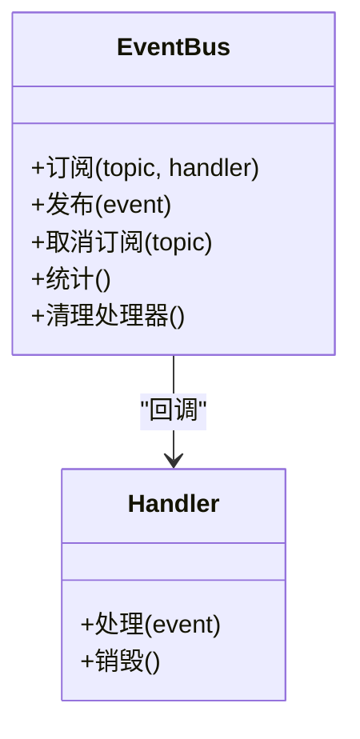

**更新** 增加了处理器清理方法，确保事件处理器在不再需要时被正确移除。

图表来源
- [engine_runtime/events.py](file://engine_runtime/events.py)

章节来源
- [engine_runtime/events.py](file://engine_runtime/events.py)

### 协议接口（protocol）
- 职责：定义对外 API 契约、请求/响应模型、错误码、限流与鉴权。
- 关键点：
  - 路由映射：URL/方法到处理器。
  - 序列化：输入校验、输出格式化。
  - 错误规范：统一错误体与状态码。
  - **更新** 请求生命周期管理：确保每个请求的资源都被正确释放。

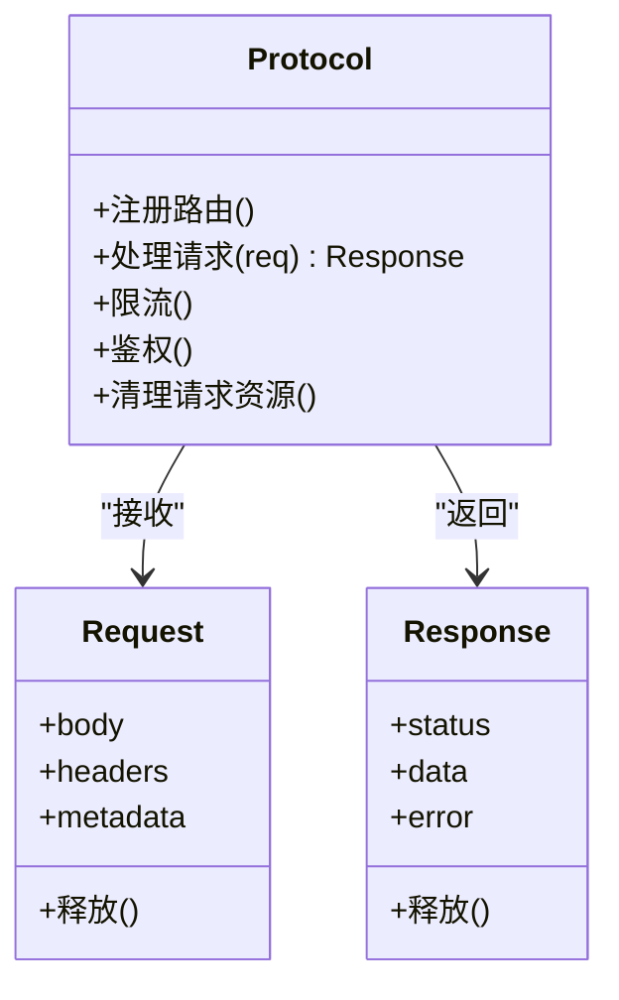

**更新** 增加了请求资源清理方法，确保请求相关的内存被正确释放。

图表来源
- [engine_runtime/protocol.py](file://engine_runtime/protocol.py)

章节来源
- [engine_runtime/protocol.py](file://engine_runtime/protocol.py)

### 数据模型（models）
- 职责：领域实体、值对象、枚举与约束。
- 关键点：
  - 不可变性优先。
  - 校验在构造时完成。
  - 序列化/反序列化稳定。
  - **更新** 引用计数：跟踪对象引用，辅助垃圾回收。

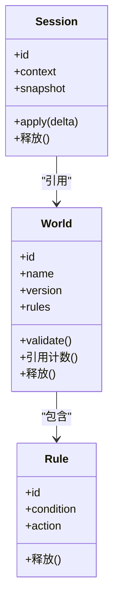

**更新** 为数据模型增加了引用计数和释放方法，支持更精确的内存管理。

图表来源
- [engine_runtime/models.py](file://engine_runtime/models.py)

章节来源
- [engine_runtime/models.py](file://engine_runtime/models.py)

### 世界编译器（world_compiler）
- 职责：将模板/配置编译为可执行的世界描述，注入规则与初始状态。
- 关键点：
  - 模板解析：YAML/JSON 模板。
  - 规则注入：条件与动作绑定。
  - 初始状态生成：从模板推导。
  - **更新** 临时资源清理：确保编译过程中的临时对象被及时释放。

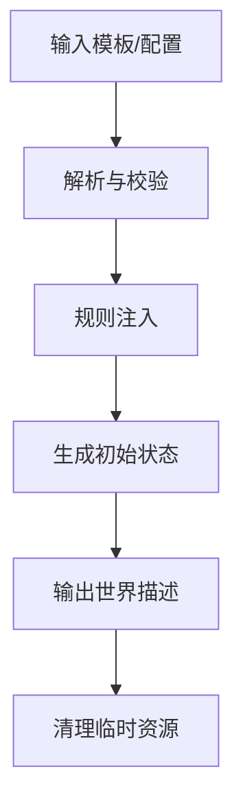

**更新** 在编译流程结束后增加了临时资源清理步骤。

图表来源
- [engine_runtime/world_compiler.py](file://engine_runtime/world_compiler.py)

章节来源
- [engine_runtime/world_compiler.py](file://engine_runtime/world_compiler.py)

### 叙事日志（narrative_log）
- 职责：记录关键决策与剧情分支，支持回放与审计。
- 关键点：
  - 追加写、只读回放。
  - 结构化字段：时间戳、主体、动作、结果。
  - 压缩与归档策略。
  - **更新** 缓冲区管理：确保日志缓冲区不会无限增长。

章节来源
- [engine_runtime/narrative_log.py](file://engine_runtime/narrative_log.py)

### 计算引擎（calculators）
- 职责：数值计算、概率判定、平衡性调整。
- 关键点：
  - 可插拔算法。
  - 精度与性能权衡。
  - 可观测性：耗时与命中统计。
  - **更新** 中间结果缓存管理：防止缓存无限增长导致内存泄漏。
  - **更新** 游戏机制修复：修复了核心游戏系统中的潜在无限循环问题。

章节来源
- [engine_runtime/calculators.py](file://engine_runtime/calculators.py)

### 评分/评级（ratings）
- 职责：对行为/结果进行打分与等级划分，驱动反馈循环。
- 关键点：
  - 评分维度与权重。
  - 阈值与等级映射。
  - 历史趋势分析。
  - **更新** 历史记录清理：定期清理过期的评分数据。

章节来源
- [engine_runtime/ratings.py](file://engine_runtime/ratings.py)

### 审计（audit）
- 职责：不可变审计日志，追踪变更轨迹与合规性。
- 关键点：
  - 防篡改存储。
  - 最小化敏感信息。
  - 查询与导出。
  - **更新** 审计日志轮转：防止审计文件过大影响性能。

章节来源
- [engine_runtime/audit.py](file://engine_runtime/audit.py)

### 呈现层（presentation）
- 职责：格式化输出、渲染视图、适配不同终端或前端。
- 关键点：
  - 多格式支持（文本、JSON、Markdown）。
  - 模板渲染。
  - 国际化与本地化。
  - **更新** 渲染缓存管理：确保渲染缓存不会占用过多内存。

章节来源
- [engine_runtime/presentation.py](file://engine_runtime/presentation.py)

### 资源管理器（resource_manager）
- 职责：统一管理内存分配、对象生命周期、垃圾回收和资源清理。
- 关键点：
  - 对象注册：跟踪所有创建的对象。
  - 引用计数：自动管理对象引用。
  - 垃圾回收：检测并清理孤立对象。
  - 资源清理：确保文件句柄、网络连接等资源被释放。
  - 内存监控：跟踪内存使用情况，报告潜在泄漏。

**新增** 这是本次更新的核心组件，专门负责系统的资源管理。

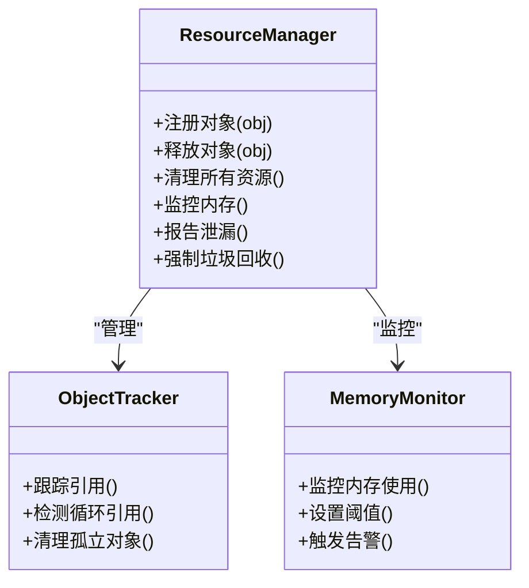

图表来源
- [engine_runtime/runtime.py](file://engine_runtime/runtime.py)

章节来源
- [engine_runtime/runtime.py](file://engine_runtime/runtime.py)

## 依赖关系分析
运行时对各子模块存在明确依赖，遵循低耦合高内聚原则。以下为运行时核心依赖图：**更新** 现在包含了资源管理器的依赖关系。

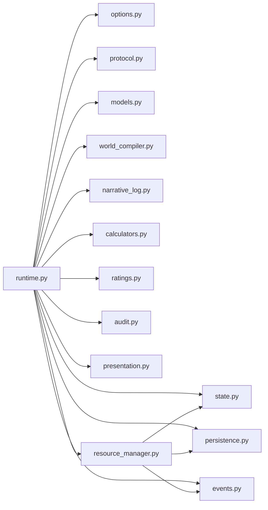

**更新** 资源管理器依赖于状态、持久化和事件模块，用于管理这些模块中的对象生命周期。

图表来源
- [engine_runtime/runtime.py](file://engine_runtime/runtime.py)
- [engine_runtime/options.py](file://engine_runtime/options.py)
- [engine_runtime/state.py](file://engine_runtime/state.py)
- [engine_runtime/persistence.py](file://engine_runtime/persistence.py)
- [engine_runtime/events.py](file://engine_runtime/events.py)
- [engine_runtime/protocol.py](file://engine_runtime/protocol.py)
- [engine_runtime/models.py](file://engine_runtime/models.py)
- [engine_runtime/world_compiler.py](file://engine_runtime/world_compiler.py)
- [engine_runtime/narrative_log.py](file://engine_runtime/narrative_log.py)
- [engine_runtime/calculators.py](file://engine_runtime/calculators.py)
- [engine_runtime/ratings.py](file://engine_runtime/ratings.py)
- [engine_runtime/audit.py](file://engine_runtime/audit.py)
- [engine_runtime/presentation.py](file://engine_runtime/presentation.py)

章节来源
- [engine_runtime/runtime.py](file://engine_runtime/runtime.py)

## 性能考量
- 事件总线：批量投递、背压控制、消费者并行度调优。
- 持久化：连接池、批写入、索引优化、冷热数据分离。
- 状态机：快照粒度、增量合并、并发访问控制。
- 计算引擎：缓存中间结果、算法选择、精度与速度权衡。
- 监控与诊断：指标采集、采样率、慢查询追踪、分布式链路。
- **更新** 资源管理：内存池、对象复用、垃圾回收调优、内存泄漏检测。
- **更新** 游戏机制循环：优化循环效率，避免死循环和资源竞争。
- **更新** 升级机制：修复了属性分配系统的阻塞问题，提升升级流程的性能。

**更新** 新增了资源管理和游戏机制循环的性能优化指导，特别关注升级机制的性能改进。

[本节为通用指导，不直接分析具体文件]

## 故障排查指南
- 常见错误：
  - 配置校验失败：检查必填项、类型与范围。
  - 世界编译失败：模板语法、规则冲突、初始状态不一致。
  - 持久化连接失败：网络、权限、版本不兼容。
  - 事件处理异常：死信队列、重复消费、顺序错乱。
  - **更新** 内存泄漏：检查对象引用、资源清理、垃圾回收。
  - **更新** 资源竞争：检查并发访问、锁机制、资源分配。
  - **更新** 升级阻塞：检查属性分配系统是否正确解锁。
  - **更新** 无限循环：检查核心游戏系统中的循环逻辑。
- 定位手段：
  - 启用审计与叙事日志，回溯关键步骤。
  - 查看运行时指标与告警，定位瓶颈与异常。
  - 使用测试用例复现问题，逐步缩小范围。
  - **更新** 使用内存分析工具，检测内存泄漏和对象生命周期。
  - **更新** 启用资源监控，跟踪资源使用情况。
  - **更新** 监控升级流程，识别属性分配阻塞点。
- 恢复策略：
  - 快照回滚、事务回滚、重试与降级。
  - 隔离故障模块，快速恢复服务。
  - **更新** 强制垃圾回收，清理孤立对象。
  - **更新** 重启资源管理器，重置资源状态。
  - **更新** 重置升级状态，重新尝试属性分配。

**更新** 新增了内存泄漏、资源竞争、升级阻塞和无限循环的故障排查方法和恢复策略。

章节来源
- [engine_runtime/audit.py](file://engine_runtime/audit.py)
- [engine_runtime/narrative_log.py](file://engine_runtime/narrative_log.py)
- [tests/test_engine_runtime.py](file://tests/test_engine_runtime.py)

## 结论
运行时核心通过清晰的模块化设计与严格的配置校验，实现了稳定的生命周期管理与可扩展的插件机制。借助事件驱动与持久化抽象，系统在性能、可靠性与可观测性方面具备良好基础。**更新** 本次更新显著增强了资源管理能力，通过引入专门的资源管理器组件，改进了内存泄漏防护、清理机制和游戏机制循环，进一步提升了系统的稳定性和可靠性。特别修复了升级时属性分配系统的阻塞问题和核心游戏系统中的潜在无限循环，确保了游戏的流畅运行。建议在生产环境中结合监控与审计完善闭环，持续优化关键路径与资源使用。

[本节为总结，不直接分析具体文件]

## 附录

### 启动与配置示例（基于测试）
- 参考测试用例中的运行时创建与配置方式，演示如何设置必要参数、加载模板、启动与停止。
- 关键步骤：
  - 准备配置（环境变量/配置文件/命令行参数）。
  - 指定世界模板路径与输出目录。
  - 启动运行时并等待就绪。
  - 发送业务请求或触发事件。
  - 优雅关闭并验证持久化结果。
  - **更新** 验证资源清理：确认所有资源都已正确释放。
  - **更新** 验证升级功能：确保属性分配系统正常工作。

章节来源
- [tests/test_engine_runtime.py](file://tests/test_engine_runtime.py)

### 元数据与模板参考
- 元数据模板用于描述保存集的基本信息与版本，便于迁移与兼容性检查。

章节来源
- [templates/save_template/meta.yaml](file://templates/save_template/meta.yaml)

### 资源管理最佳实践
- **新增** 对象生命周期管理：
  - 使用上下文管理器确保资源正确释放。
  - 实现__del__方法作为最后的安全网。
  - 避免循环引用，使用弱引用打破循环。
- **新增** 内存优化技巧：
  - 使用生成器处理大数据集。
  - 及时释放不再需要的对象引用。
  - 监控内存使用模式，识别潜在泄漏。
- **新增** 资源清理策略：
  - 实现统一的清理接口。
  - 使用try-finally确保清理代码执行。
  - 实现超时机制防止清理操作阻塞。
- **新增** 游戏机制优化：
  - 避免无限循环，添加适当的退出条件。
  - 优化升级流程，确保属性分配系统正常解锁。
  - 监控游戏循环性能，及时发现性能瓶颈。

**新增** 这是本次更新添加的最佳实践指导，帮助开发者正确使用新的资源管理系统和优化游戏机制。