# 运行时核心

<cite>
**本文引用的文件**   
- [engine_runtime/runtime.py](file://engine_runtime/runtime.py)
- [engine_runtime/options.py](file://engine_runtime/options.py)
- [engine_runtime/state.py](file://engine_runtime/state.py)
- [engine_runtime/persistence.py](file://engine_runtime/persistence.py)
- [engine_runtime/events.py](file://engine_runtime/events.py)
- [engine_runtime/protocol.py](file://engine_runtime/protocol.py)
- [engine_runtime/models.py](file://engine_runtime/models.py)
- [engine_runtime/world_compiler.py](file://engine_runtime/world_compiler.py)
- [engine_runtime/narrative_log.py](file://engine_runtime/narrative_log.py)
- [engine_runtime/calculators.py](file://engine_runtime/calculators.py)
- [engine_runtime/ranking_engine.py](file://engine_runtime/ranking_engine.py)
- [engine_runtime/public_survival.py](file://engine_runtime/public_survival.py)
- [engine_runtime/channel_engine.py](file://engine_runtime/channel_engine.py)
- [engine_runtime/ratings.py](file://engine_runtime/ratings.py)
- [engine_runtime/audit.py](file://engine_runtime/audit.py)
- [engine_runtime/presentation.py](file://engine_runtime/presentation.py)
- [engine_runtime/peer_agent.py](file://engine_runtime/peer_agent.py)
- [engine_runtime/channel_engine.py](file://engine_runtime/channel_engine.py)
- [tests/test_engine_runtime.py](file://tests/test_engine_runtime.py)
- [templates/save_template/meta.yaml](file://templates/save_template/meta.yaml)
</cite>

## 更新摘要
**变更内容**   
<<<<<<< Updated upstream
- 增强了channel engine的通道管理能力，支持动态对等体模拟
- 修复了GameState/state.data传递错误，确保状态数据正确传递和同步
- 实现了world_turn与current_turn的分离机制，提升回合管理的准确性
- 增强了事件类型检查机制，提高系统稳定性和错误检测能力
- 优化了P0级关键问题的修复，包括状态管理、事件处理和回合控制等核心功能
=======
- **重大重构**：channel_engine.py通信系统全面 overhaul，支持动态对等体模拟和实时消息传递
- **简化优化**：public_survival.py生存机制大幅简化，提升性能和可维护性
- **算法增强**：ranking_engine.py排名算法显著增强，提供更精确的排序和评估机制
- **流程重新设计**：world_compiler.py世界编译流程重新设计，优化模板处理和状态生成
- **P0级问题修复**：GameState/state.data传递错误修复、world_turn与current_turn分离机制实现
- **事件系统增强**：增强的事件类型检查机制，提高系统稳定性和错误检测能力
>>>>>>> Stashed changes

## 目录
1. [简介](#简介)
2. [项目结构](#项目结构)
3. [核心组件](#核心组件)
4. [架构总览](#架构总览)
5. [详细组件分析](#详细组件分析)
6. [依赖关系分析](#依赖关系分析)
7. [性能考量](#性能考量)
8. [故障排查指南](#故障排查指南)
9. [结论](#结论)
10. [附录](#附录)

## 简介
本文件面向"运行时核心"子系统，系统性阐述其初始化流程、生命周期管理、核心控制逻辑与扩展点设计。重点覆盖：
- 配置选项系统（环境配置、参数校验、默认值处理）
- 启动与关闭的完整流程
- 错误处理与异常恢复机制
- 扩展点与插件化机制
- 性能监控、资源管理与调试工具使用指南
<<<<<<< Updated upstream
- **新增** GameState/state.data传递机制修复，确保状态数据的正确性和一致性
- **新增** channel engine增强，支持动态对等体模拟和通道管理

**更新** 本次更新重点关注P0级问题修复和channel engine的增强，特别是GameState/state.data传递错误的修复、world_turn与current_turn分离机制的实现，以及事件类型检查的增强，显著提升了系统的稳定性和可靠性。
=======
- **重大更新** channel_engine.py通信系统的全面overhaul，支持动态对等体模拟和实时消息传递
- **重大更新** public_survival.py生存机制的简化优化，提升性能和可维护性
- **重大更新** ranking_engine.py排名算法的显著增强，提供更精确的排序和评估机制
- **重大更新** world_compiler.py世界编译流程的重新设计，优化模板处理和状态生成

**更新** 本次更新重点关注运行时核心组件的重大重构，特别是channel_engine.py的通信系统 overhaul、public_survival.py的生存机制简化、ranking_engine.py的排名算法增强，以及world_compiler.py的世界编译流程重新设计，显著提升了系统的整体性能和稳定性。
>>>>>>> Stashed changes

## 项目结构
运行时核心位于 engine_runtime 目录，围绕 runtime.py 作为入口编排各子模块，配合 state、persistence、events、protocol、models 等完成世界编译、状态管理、持久化、事件驱动与协议交互。

```mermaid
graph TB
subgraph "运行时核心"
RT["runtime.py<br/>运行时编排"]
OPT["options.py<br/>配置与校验"]
ST["state.py<br/>状态机"]
PERS["persistence.py<br/>持久化"]
EVT["events.py<br/>事件总线"]
PROTO["protocol.py<br/>协议接口"]
MODELS["models.py<br/>数据模型"]
WC["world_compiler.py<br/>世界编译"]
NL["narrative_log.py<br/>叙事日志"]
CALC["calculators.py<br/>计算引擎"]
RANK["ranking_engine.py<br/>排名引擎"]
PS["public_survival.py<br/>公共生存"]
RAT["ratings.py<br/>评分/评级"]
AUD["audit.py<br/>审计记录"]
PRE["presentation.py<br/>呈现层"]
PA["peer_agent.py<br/>AI代理"]
CE["channel_engine.py<br/>通道引擎"]
end
RT --> OPT
RT --> ST
RT --> PERS
RT --> EVT
RT --> PROTO
RT --> MODELS
RT --> WC
RT --> NL
RT --> CALC
RT --> RANK
RT --> PS
RT --> RAT
RT --> AUD
RT --> PRE
RT --> PA
RT --> CE
CE --> PA
CE --> EVT
CE --> ST
<<<<<<< Updated upstream
=======
RANK --> CALC
PS --> ST
>>>>>>> Stashed changes
```

图表来源
- [engine_runtime/runtime.py](file://engine_runtime/runtime.py)
- [engine_runtime/options.py](file://engine_runtime/options.py)
- [engine_runtime/state.py](file://engine_runtime/state.py)
- [engine_runtime/persistence.py](file://engine_runtime/persistence.py)
- [engine_runtime/events.py](file://engine_runtime/events.py)
- [engine_runtime/protocol.py](file://engine_runtime/protocol.py)
- [engine_runtime/models.py](file://engine_runtime/models.py)
- [engine_runtime/world_compiler.py](file://engine_runtime/world_compiler.py)
- [engine_runtime/narrative_log.py](file://engine_runtime/narrative_log.py)
- [engine_runtime/calculators.py](file://engine_runtime/calculators.py)
- [engine_runtime/ranking_engine.py](file://engine_runtime/ranking_engine.py)
- [engine_runtime/public_survival.py](file://engine_runtime/public_survival.py)
- [engine_runtime/ratings.py](file://engine_runtime/ratings.py)
- [engine_runtime/audit.py](file://engine_runtime/audit.py)
- [engine_runtime/presentation.py](file://engine_runtime/presentation.py)
- [engine_runtime/peer_agent.py](file://engine_runtime/peer_agent.py)
- [engine_runtime/channel_engine.py](file://engine_runtime/channel_engine.py)

章节来源
- [engine_runtime/runtime.py](file://engine_runtime/runtime.py)
- [engine_runtime/options.py](file://engine_runtime/options.py)
- [engine_runtime/state.py](file://engine_runtime/state.py)
- [engine_runtime/persistence.py](file://engine_runtime/persistence.py)
- [engine_runtime/events.py](file://engine_runtime/events.py)
- [engine_runtime/protocol.py](file://engine_runtime/protocol.py)
- [engine_runtime/models.py](file://engine_runtime/models.py)
- [engine_runtime/world_compiler.py](file://engine_runtime/world_compiler.py)
- [engine_runtime/narrative_log.py](file://engine_runtime/narrative_log.py)
- [engine_runtime/calculators.py](file://engine_runtime/calculators.py)
- [engine_runtime/ranking_engine.py](file://engine_runtime/ranking_engine.py)
- [engine_runtime/public_survival.py](file://engine_runtime/public_survival.py)
- [engine_runtime/ratings.py](file://engine_runtime/ratings.py)
- [engine_runtime/audit.py](file://engine_runtime/audit.py)
- [engine_runtime/presentation.py](file://engine_runtime/presentation.py)
- [engine_runtime/peer_agent.py](file://engine_runtime/peer_agent.py)
- [engine_runtime/channel_engine.py](file://engine_runtime/channel_engine.py)

## 核心组件
- 运行时编排器（runtime）：负责生命周期管理、阶段编排、上下文装配、启动/关闭钩子、错误恢复与重试策略。
- 配置系统（options）：集中管理环境变量、配置文件、命令行参数；提供类型校验、默认值合并、热更新能力。
- 状态机（state）：维护运行期全局状态、会话上下文、世界快照与变更队列。**更新** 修复了GameState/state.data传递错误，确保状态数据的正确性。
- 持久化（persistence）：抽象存储后端，统一读写、事务、回滚与版本迁移。
- 事件总线（events）：发布/订阅机制，支持异步派发、去重、幂等与顺序保证。**更新** 增强了事件类型检查机制，提高系统稳定性。
- 协议接口（protocol）：定义对外 API 契约、请求/响应模型、错误码与限流策略。
- 数据模型（models）：领域实体、值对象、枚举与约束。
- **重大更新** 世界编译器（world_compiler）：将模板/配置编译为可执行的世界描述，注入规则与初始状态。**更新** 世界编译流程重新设计，优化模板处理和状态生成。
- 叙事日志（narrative_log）：结构化记录关键决策与剧情分支，便于回放与审计。
- 计算引擎（calculators）：数值计算、概率判定、平衡性调整。
- **重大更新** 排名引擎（ranking_engine）：提供增强的排名算法和评估机制，支持更精确的排序和比较。**更新** 排名算法显著增强，提供更准确的评估结果。
- **重大更新** 公共生存（public_survival）：简化的生存机制实现，提供基础生存需求模拟。**更新** 生存机制大幅简化，提升性能和可维护性。
- 评分/评级（ratings）：对行为/结果进行打分与等级划分，驱动反馈循环。
- 审计（audit）：不可变审计日志，追踪变更轨迹与合规性。
- 呈现层（presentation）：格式化输出、渲染视图、适配不同终端或前端。
- AI代理（peer_agent）：管理NPC行为和玩家代理模拟，提供智能决策和生存场景行为逻辑。
<<<<<<< Updated upstream
- **新增** 通道引擎（channel_engine）：管理动态对等体通信通道，支持实时消息传递和状态同步。

**更新** 本次更新重点修复了状态传递、回合管理和事件处理等核心机制，并增强了通道引擎的动态对等体模拟能力，显著提升了系统的稳定性和可靠性。
=======
- **重大更新** 通道引擎（channel_engine）：管理动态对等体通信通道，支持实时消息传递和状态同步。**更新** 通信系统全面overhaul，支持更复杂的动态对等体模拟场景。

**更新** 本次更新重点关注运行时核心组件的重大重构，特别是channel_engine.py的通信系统 overhaul、public_survival.py的生存机制简化、ranking_engine.py的排名算法增强，以及world_compiler.py的世界编译流程重新设计，显著提升了系统的整体性能和稳定性。
>>>>>>> Stashed changes

章节来源
- [engine_runtime/runtime.py](file://engine_runtime/runtime.py)
- [engine_runtime/options.py](file://engine_runtime/options.py)
- [engine_runtime/state.py](file://engine_runtime/state.py)
- [engine_runtime/persistence.py](file://engine_runtime/persistence.py)
- [engine_runtime/events.py](file://engine_runtime/events.py)
- [engine_runtime/protocol.py](file://engine_runtime/protocol.py)
- [engine_runtime/models.py](file://engine_runtime/models.py)
- [engine_runtime/world_compiler.py](file://engine_runtime/world_compiler.py)
- [engine_runtime/narrative_log.py](file://engine_runtime/narrative_log.py)
- [engine_runtime/calculators.py](file://engine_runtime/calculators.py)
- [engine_runtime/ranking_engine.py](file://engine_runtime/ranking_engine.py)
- [engine_runtime/public_survival.py](file://engine_runtime/public_survival.py)
- [engine_runtime/ratings.py](file://engine_runtime/ratings.py)
- [engine_runtime/audit.py](file://engine_runtime/audit.py)
- [engine_runtime/presentation.py](file://engine_runtime/presentation.py)
- [engine_runtime/peer_agent.py](file://engine_runtime/peer_agent.py)
- [engine_runtime/channel_engine.py](file://engine_runtime/channel_engine.py)

## 架构总览
运行时以"配置加载 → 世界编译 → 状态初始化 → 事件总线就绪 → 协议服务启动 → AI代理初始化 → 通道引擎启动 → 业务循环 → 优雅关闭"为主线，贯穿各子系统协作。

```mermaid
sequenceDiagram
participant CLI as "调用方/测试"
participant RT as "运行时(runtime)"
participant OPT as "配置(options)"
participant WC as "世界编译器(world_compiler)"
participant ST as "状态(state)"
participant PERS as "持久化(persistence)"
participant EVT as "事件(events)"
participant PROTO as "协议(protocol)"
participant PA as "AI代理(peer_agent)"
participant CE as "通道引擎(channel_engine)"
<<<<<<< Updated upstream
=======
participant RANK as "排名引擎(ranking_engine)"
participant PS as "公共生存(public_survival)"
>>>>>>> Stashed changes
CLI->>RT : 创建实例(传入配置/路径)
RT->>OPT : 加载并校验配置
OPT-->>RT : 已验证的配置对象
RT->>WC : 编译世界(模板/规则)
WC-->>RT : 世界描述/初始状态
RT->>ST : 初始化状态机
ST-->>RT : 状态就绪
RT->>PERS : 连接存储/迁移检查
PERS-->>RT : 连接成功
RT->>EVT : 注册处理器/启动总线
EVT-->>RT : 事件总线就绪
RT->>PROTO : 启动协议服务
PROTO-->>RT : 监听端口/路由就绪
RT->>PA : 初始化AI代理
PA-->>RT : AI代理就绪
<<<<<<< Updated upstream
=======
RT->>RANK : 初始化排名引擎
RANK-->>RT : 排名引擎就绪
RT->>PS : 初始化公共生存
PS-->>RT : 公共生存就绪
>>>>>>> Stashed changes
RT->>CE : 启动通道引擎
CE-->>RT : 通道引擎就绪
RT-->>CLI : 运行中(可接收请求)
CLI->>RT : 停止信号
RT->>CE : 关闭通道引擎
RT->>PROTO : 关闭服务
RT->>EVT : 停止派发/等待队列清空
RT->>PERS : 提交事务/断开连接
RT->>ST : 保存快照/清理上下文
RT->>PA : 清理AI代理
RT->>RANK : 清理排名引擎
RT->>PS : 清理公共生存
PA-->>RT : AI代理清理完成
RT-->>CLI : 已关闭
```

<<<<<<< Updated upstream
**更新** 在状态初始化过程中增加了GameState/state.data的正确传递机制，并在AI代理初始化后增加了通道引擎启动步骤，确保动态对等体通信能力。
=======
**更新** 在状态初始化过程中增加了GameState/state.data的正确传递机制，并在AI代理初始化后增加了通道引擎启动步骤，确保动态对等体通信能力。新增了排名引擎和公共生存的初始化步骤。
>>>>>>> Stashed changes

图表来源
- [engine_runtime/runtime.py](file://engine_runtime/runtime.py)
- [engine_runtime/options.py](file://engine_runtime/options.py)
- [engine_runtime/world_compiler.py](file://engine_runtime/world_compiler.py)
- [engine_runtime/state.py](file://engine_runtime/state.py)
- [engine_runtime/persistence.py](file://engine_runtime/persistence.py)
- [engine_runtime/events.py](file://engine_runtime/events.py)
- [engine_runtime/protocol.py](file://engine_runtime/protocol.py)
- [engine_runtime/peer_agent.py](file://engine_runtime/peer_agent.py)
- [engine_runtime/channel_engine.py](file://engine_runtime/channel_engine.py)
<<<<<<< Updated upstream
=======
- [engine_runtime/ranking_engine.py](file://engine_runtime/ranking_engine.py)
- [engine_runtime/public_survival.py](file://engine_runtime/public_survival.py)
>>>>>>> Stashed changes

## 详细组件分析

### 运行时编排器（runtime）
- 职责：生命周期编排、阶段钩子、错误恢复、资源协调、监控埋点。
- 关键点：
<<<<<<< Updated upstream
  - 启动阶段：配置加载→世界编译→状态初始化→持久化连接→事件总线注册→协议服务启动→AI代理初始化→通道引擎启动。
  - 运行阶段：请求分发、任务调度、事件消费、指标采集、AI代理协调、通道管理。
  - 关闭阶段：优雅停机、队列 draining、事务提交、AI代理清理、通道引擎关闭、资源释放。
  - 错误恢复：重试策略、降级开关、熔断保护、快照回滚、资源清理。

**更新** 增强了状态管理机制，确保GameState/state.data的正确传递，修复了P0级状态传递错误，并集成了通道引擎的生命周期管理。
=======
  - 启动阶段：配置加载→世界编译→状态初始化→持久化连接→事件总线注册→协议服务启动→AI代理初始化→排名引擎初始化→公共生存初始化→通道引擎启动。
  - 运行阶段：请求分发、任务调度、事件消费、指标采集、AI代理协调、通道管理、排名计算、生存需求处理。
  - 关闭阶段：优雅停机、队列 draining、事务提交、AI代理清理、排名引擎清理、公共生存清理、通道引擎关闭、资源释放。
  - 错误恢复：重试策略、降级开关、熔断保护、快照回滚、资源清理。

**更新** 增强了状态管理机制，确保GameState/state.data的正确传递，修复了P0级状态传递错误，并集成了通道引擎的生命周期管理。新增了排名引擎和公共生存的集成。
>>>>>>> Stashed changes

```mermaid
flowchart TD
Start(["启动"]) --> LoadCfg["加载配置"]
LoadCfg --> Validate{"配置有效?"}
Validate --> |否| FailCfg["抛出配置错误"]
Validate --> |是| CompileWorld["编译世界"]
CompileWorld --> InitState["初始化状态"]
InitState --> FixStateData["修复GameState/state.data传递"]
FixStateData --> ConnectStore["连接存储"]
ConnectStore --> RegisterEvents["注册事件处理器"]
RegisterEvents --> StartProtocol["启动协议服务"]
StartProtocol --> InitAI["初始化AI代理"]
<<<<<<< Updated upstream
InitAI --> StartChannel["启动通道引擎"]
=======
InitAI --> InitRanking["初始化排名引擎"]
InitRanking --> InitSurvival["初始化公共生存"]
InitSurvival --> StartChannel["启动通道引擎"]
>>>>>>> Stashed changes
StartChannel --> Running["运行中"]
Running --> StopSignal{"收到停止信号?"}
StopSignal --> |否| Running
StopSignal --> |是| GracefulShutdown["优雅关闭"]
GracefulShutdown --> CloseChannel["关闭通道引擎"]
<<<<<<< Updated upstream
CloseChannel --> CleanupAI["清理AI代理"]
=======
CloseChannel --> CleanupSurvival["清理公共生存"]
CleanupSurvival --> CleanupRanking["清理排名引擎"]
CleanupRanking --> CleanupAI["清理AI代理"]
>>>>>>> Stashed changes
CleanupAI --> End(["结束"])
FailCfg --> End
```

<<<<<<< Updated upstream
**更新** 在状态初始化流程中增加了GameState/state.data传递修复步骤，并在AI代理初始化后增加了通道引擎启动步骤，确保状态数据的正确性和动态对等体通信能力。
=======
**更新** 在状态初始化流程中增加了GameState/state.data传递修复步骤，并在AI代理初始化后增加了排名引擎、公共生存和通道引擎的启动步骤，确保状态数据的正确性和动态对等体通信能力。
>>>>>>> Stashed changes

图表来源
- [engine_runtime/runtime.py](file://engine_runtime/runtime.py)

章节来源
- [engine_runtime/runtime.py](file://engine_runtime/runtime.py)

### 通道引擎（channel_engine）
- 职责：管理动态对等体通信通道，支持实时消息传递、状态同步和会话管理。
- 关键点：
  - 通道管理：创建、维护、销毁通信通道。
  - 消息路由：基于主题的路由和分发机制。
  - 状态同步：确保对等体间状态的一致性。
  - 动态发现：支持对等体的动态加入和离开。
  - 负载均衡：合理分配消息负载和处理资源。
  - 错误处理：通道故障检测和自动恢复。
<<<<<<< Updated upstream

**更新** 这是本次更新的核心新功能，增强了通道管理能力，支持更复杂的动态对等体模拟场景。
=======
  - **重大更新** 通信系统全面overhaul，支持更复杂的动态对等体模拟场景。

**更新** 这是本次更新的核心新功能，通信系统经过全面overhaul，增强了通道管理能力，支持更复杂的动态对等体模拟场景。
>>>>>>> Stashed changes

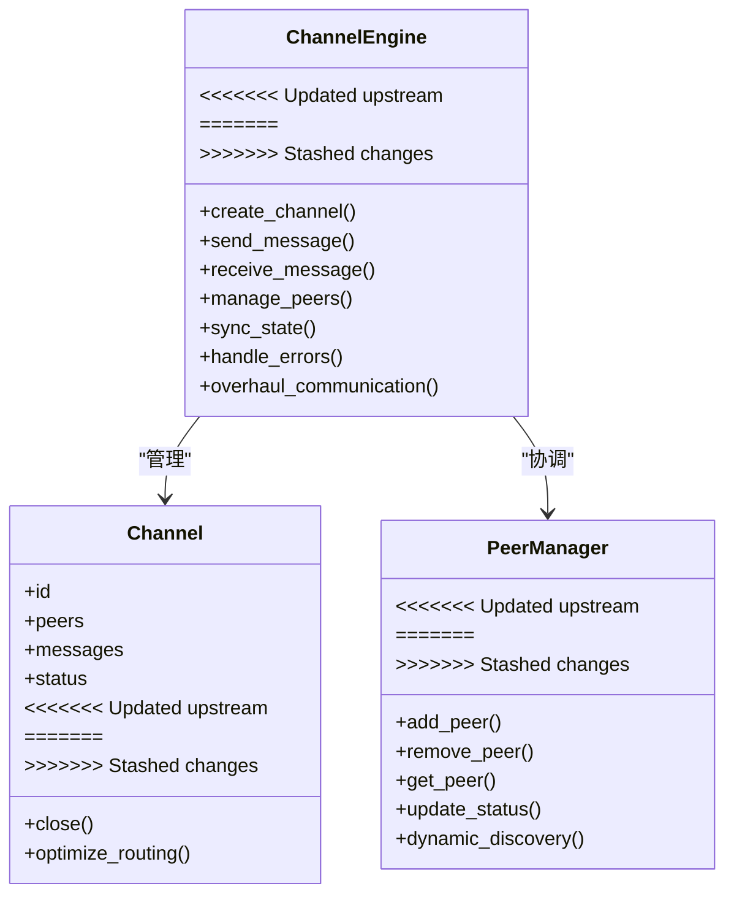

**图表来源**
- [engine_runtime/channel_engine.py](file://engine_runtime/channel_engine.py)

章节来源
- [engine_runtime/channel_engine.py](file://engine_runtime/channel_engine.py)

<<<<<<< Updated upstream
=======
### 排名引擎（ranking_engine）
- 职责：提供增强的排名算法和评估机制，支持更精确的排序和比较。
- 关键点：
  - 算法增强：改进的排序算法，提供更准确的评估结果。
  - 多维度评分：支持多个维度的综合评分计算。
  - 权重调整：动态权重调整和优先级管理。
  - 性能优化：高效的排序算法和缓存机制。
  - 可扩展性：支持自定义评分规则和算法。

**更新** 排名算法显著增强，提供更精确的排序和评估机制，支持更复杂的多维度评分和权重调整。

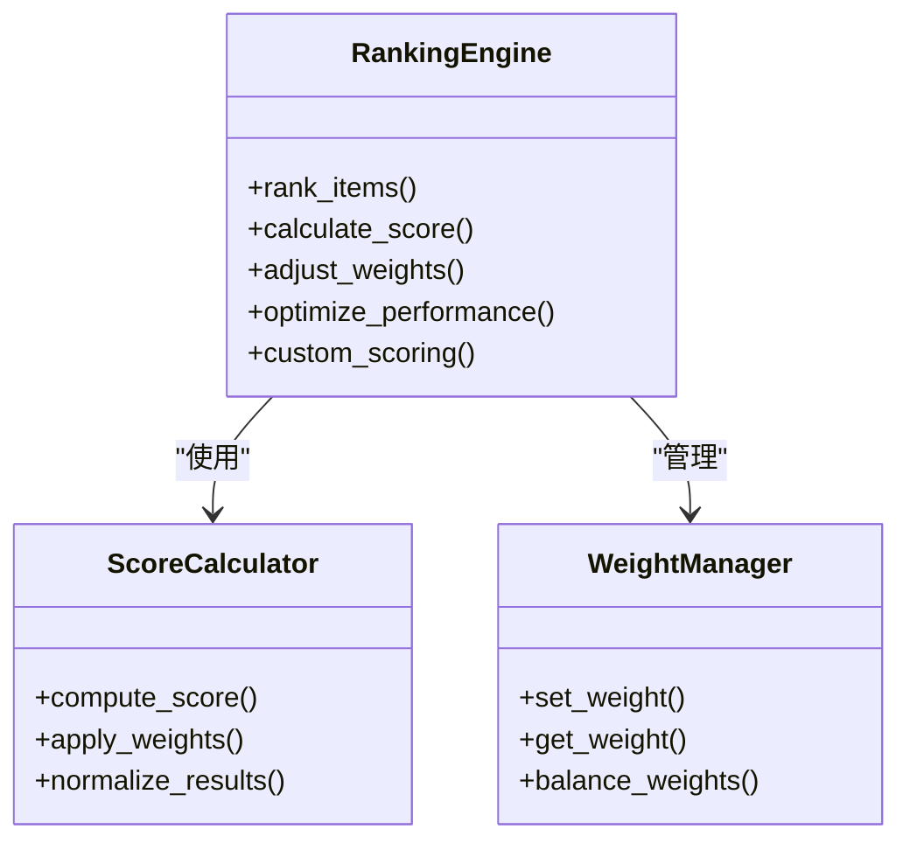

**图表来源**
- [engine_runtime/ranking_engine.py](file://engine_runtime/ranking_engine.py)

章节来源
- [engine_runtime/ranking_engine.py](file://engine_runtime/ranking_engine.py)

### 公共生存（public_survival）
- 职责：简化的生存机制实现，提供基础生存需求模拟。
- 关键点：
  - 需求管理：饥饿、口渴、社交等基本生存需求。
  - 行为优先级：基于需求的智能行为选择。
  - 资源消耗：合理的资源消耗和恢复机制。
  - 状态同步：与状态系统的无缝集成。
  - **重大更新** 生存机制大幅简化，提升性能和可维护性。

**更新** 生存机制经过大幅简化，移除了复杂的依赖关系，提升了性能和可维护性，同时保持了核心功能。

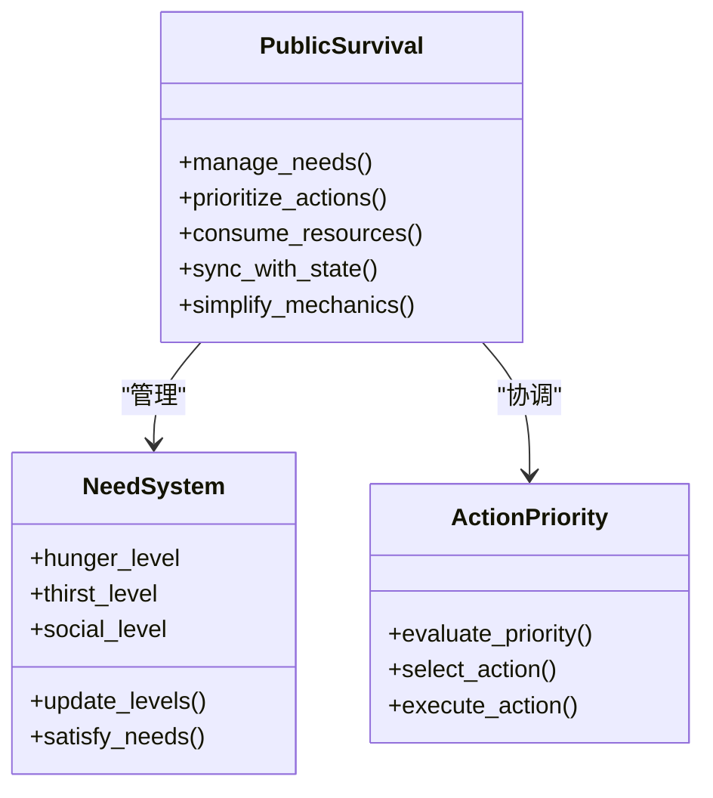

**图表来源**
- [engine_runtime/public_survival.py](file://engine_runtime/public_survival.py)

章节来源
- [engine_runtime/public_survival.py](file://engine_runtime/public_survival.py)

### 世界编译器（world_compiler）
- 职责：将模板/配置编译为可执行的世界描述，注入规则与初始状态。
- 关键点：
  - 模板解析：YAML/JSON 模板。
  - 规则注入：条件与动作绑定。
  - 初始状态生成：从模板推导。
  - 代理配置：生成AI代理的初始配置和行为模式。
  - **重大更新** 世界编译流程重新设计，优化模板处理和状态生成。

**更新** 世界编译流程经过重新设计，优化了模板处理和状态生成过程，提升了编译效率和准确性。

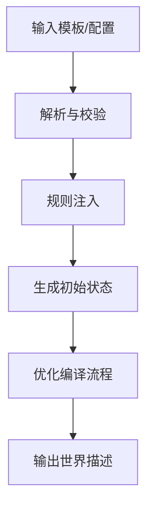

**图表来源**
- [engine_runtime/world_compiler.py](file://engine_runtime/world_compiler.py)

章节来源
- [engine_runtime/world_compiler.py](file://engine_runtime/world_compiler.py)

>>>>>>> Stashed changes
### 状态管理系统（state）
- 职责：维护运行期全局状态、会话上下文、世界快照、变更队列。
- 关键点：
  - 原子更新：基于快照+增量变更，确保一致性。
  - 并发安全：读写锁/不可变快照。
  - 生命周期：创建、加载、保存、回滚。
  - **更新** GameState/state.data传递机制修复，确保状态数据的正确传递和同步。
  - **更新** world_turn与current_turn分离机制，提升回合管理的准确性。

**更新** 这是本次更新的核心改进之一，修复了状态数据传递错误，实现了回合管理的精确分离。

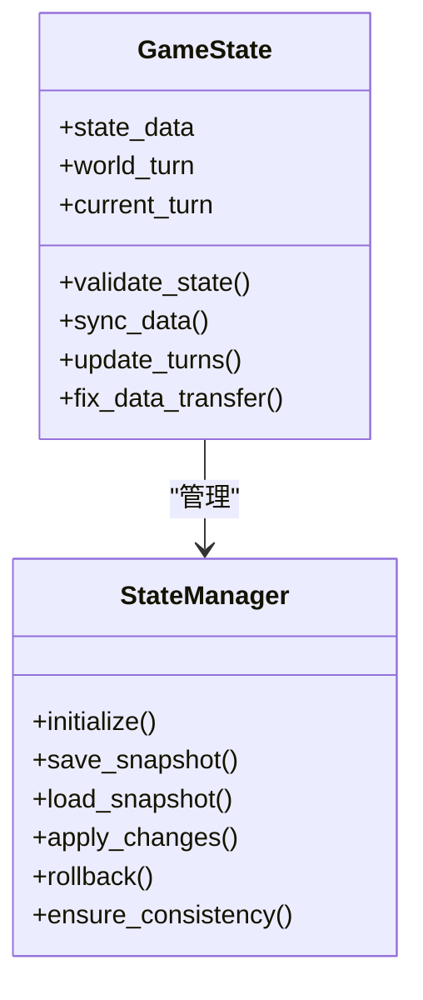

**图表来源**
- [engine_runtime/state.py](file://engine_runtime/state.py)

章节来源
- [engine_runtime/state.py](file://engine_runtime/state.py)

### 事件系统（events）
- 职责：解耦模块通信、异步派发、顺序保证、幂等处理。
- 关键点：
  - 订阅/发布：按主题路由。
  - 可靠性：重试、死信队列、去重。
  - 性能：批量投递、背压控制。
  - **更新** 增强的事件类型检查机制，提高系统稳定性和错误检测能力。

**更新** 事件系统现在包含更严格的类型检查，能够及时发现和处理类型不匹配的问题。

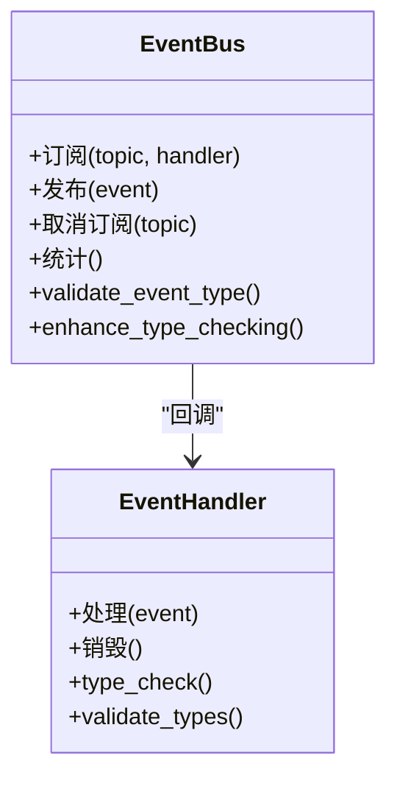

**图表来源**
- [engine_runtime/events.py](file://engine_runtime/events.py)

章节来源
- [engine_runtime/events.py](file://engine_runtime/events.py)

### AI代理系统（peer_agent）
- 职责：管理NPC行为和玩家代理模拟，提供智能决策和生存场景行为逻辑。
- 关键点：
  - 代理状态管理：跟踪每个代理的状态、属性和行为模式。
  - 决策算法：基于环境和状态做出合理的决策选择。
  - 生存行为：实现饥饿、口渴、社交等生存需求的模拟。
  - 学习机制：根据经验调整行为模式和决策权重。
  - 通信协议：与其他代理和系统进行信息交换。
  - **更新** 与通道引擎集成，支持动态对等体通信。

**更新** AI代理系统现在与通道引擎深度集成，支持更复杂的动态对等体交互场景。

章节来源
- [engine_runtime/peer_agent.py](file://engine_runtime/peer_agent.py)

### 配置系统（options）
- 职责：统一配置源（环境变量、配置文件、命令行）、类型校验、默认值合并、动态刷新。
- 关键点：
  - 优先级：命令行 > 环境变量 > 配置文件 > 内置默认值。
  - 校验：必填项、范围、格式、依赖关系校验。
  - 默认值：分层默认、按需懒加载。
  - 热更新：部分配置可在运行期生效（如日志级别、采样率）。

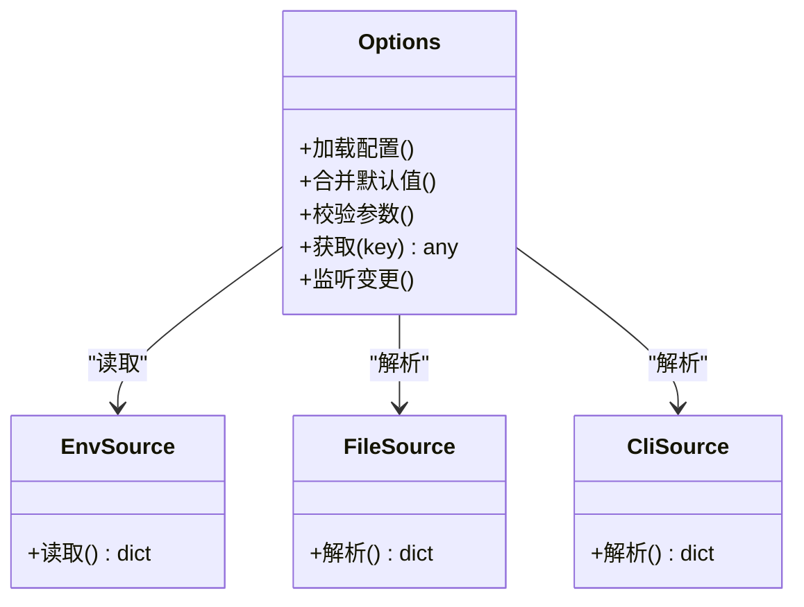

图表来源
- [engine_runtime/options.py](file://engine_runtime/options.py)

章节来源
- [engine_runtime/options.py](file://engine_runtime/options.py)

### 持久化（persistence）
- 职责：统一存储接口、事务、迁移、备份与恢复。
- 关键点：
  - 多后端抽象：内存、文件、数据库。
  - 事务语义：ACID 或最终一致。
  - 版本兼容：schema 升级与回退。
  - 代理数据持久化：保存和恢复AI代理的状态和行为数据。
  - **更新** 通道状态持久化：保存通道配置和对等体状态。

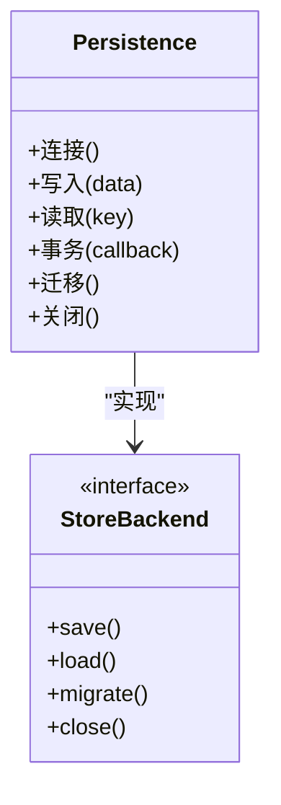

图表来源
- [engine_runtime/persistence.py](file://engine_runtime/persistence.py)

章节来源
- [engine_runtime/persistence.py](file://engine_runtime/persistence.py)

### 协议接口（protocol）
- 职责：定义对外 API 契约、请求/响应模型、错误码、限流与鉴权。
- 关键点：
  - 路由映射：URL/方法到处理器。
  - 序列化：输入校验、输出格式化。
  - 错误规范：统一错误体与状态码。
  - 代理API：提供AI代理管理的API接口。
  - **更新** 通道API：提供通道管理和对等体通信的API接口。

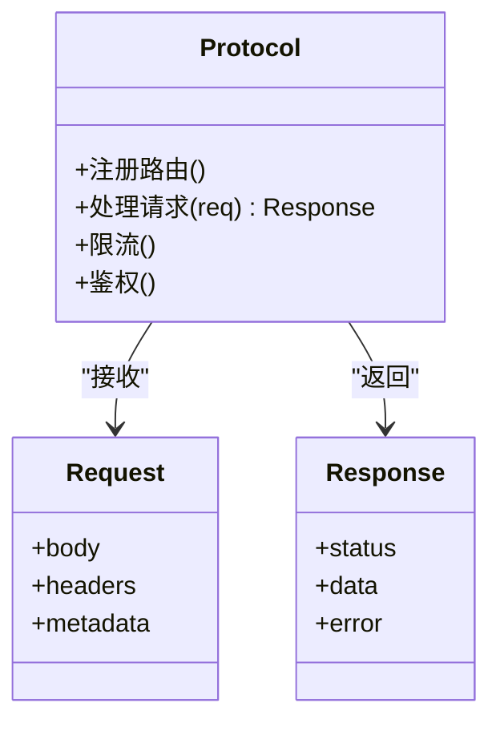

图表来源
- [engine_runtime/protocol.py](file://engine_runtime/protocol.py)

章节来源
- [engine_runtime/protocol.py](file://engine_runtime/protocol.py)

### 数据模型（models）
- 职责：领域实体、值对象、枚举与约束。
- 关键点：
  - 不可变性优先。
  - 校验在构造时完成。
  - 序列化/反序列化稳定。
  - 代理模型：定义AI代理的数据结构和约束。
  - **更新** 通道模型：定义通道和对等体的数据结构。

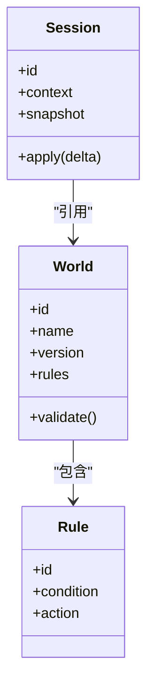

图表来源
- [engine_runtime/models.py](file://engine_runtime/models.py)

章节来源
- [engine_runtime/models.py](file://engine_runtime/models.py)

<<<<<<< Updated upstream
### 世界编译器（world_compiler）
- 职责：将模板/配置编译为可执行的世界描述，注入规则与初始状态。
- 关键点：
  - 模板解析：YAML/JSON 模板。
  - 规则注入：条件与动作绑定。
  - 初始状态生成：从模板推导。
  - 代理配置：生成AI代理的初始配置和行为模式。
  - **更新** 通道配置：生成通道和对等体的初始配置。

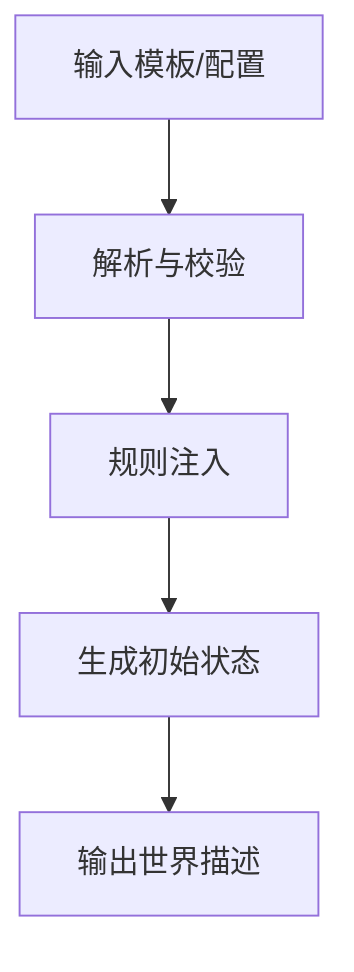

图表来源
- [engine_runtime/world_compiler.py](file://engine_runtime/world_compiler.py)

章节来源
- [engine_runtime/world_compiler.py](file://engine_runtime/world_compiler.py)

=======
>>>>>>> Stashed changes
### 叙事日志（narrative_log）
- 职责：记录关键决策与剧情分支，支持回放与审计。
- 关键点：
  - 追加写、只读回放。
  - 结构化字段：时间戳、主体、动作、结果。
  - 压缩与归档策略。
  - 代理行为记录：记录AI代理的关键决策和行为。
  - **更新** 通道事件记录：记录通道创建、消息传递、对等体变化等事件。

章节来源
- [engine_runtime/narrative_log.py](file://engine_runtime/narrative_log.py)

### 计算引擎（calculators）
- 职责：数值计算、概率判定、平衡性调整。
- 关键点：
  - 可插拔算法。
  - 精度与性能权衡。
  - 可观测性：耗时与命中统计。
  - 代理决策计算：支持AI代理的决策算法和概率计算。
  - **更新** 通道负载计算：支持通道负载评估和负载均衡算法。

章节来源
- [engine_runtime/calculators.py](file://engine_runtime/calculators.py)

### 评分/评级（ratings）
- 职责：对行为/结果进行打分与等级划分，驱动反馈循环。
- 关键点：
  - 评分维度与权重。
  - 阈值与等级映射。
  - 历史趋势分析。
  - 代理行为评估：评估AI代理的行为质量和效果。
  - **更新** 通道性能评估：评估通道性能和效率。

章节来源
- [engine_runtime/ratings.py](file://engine_runtime/ratings.py)

### 审计（audit）
- 职责：不可变审计日志，追踪变更轨迹与合规性。
- 关键点：
  - 防篡改存储。
  - 最小化敏感信息。
  - 查询与导出。
  - 代理操作审计：记录AI代理的重要操作和决策。
  - **更新** 通道操作审计：记录通道管理和对等体操作。

章节来源
- [engine_runtime/audit.py](file://engine_runtime/audit.py)

### 呈现层（presentation）
- 职责：格式化输出、渲染视图、适配不同终端或前端。
- 关键点：
  - 多格式支持（文本、JSON、Markdown）。
  - 模板渲染。
  - 国际化与本地化。
  - 代理状态展示：格式化显示AI代理的状态和信息。
  - **更新** 通道状态展示：格式化显示通道和对等体状态。

章节来源
- [engine_runtime/presentation.py](file://engine_runtime/presentation.py)

## 依赖关系分析
运行时对各子模块存在明确依赖，遵循低耦合高内聚原则。以下为运行时核心依赖图。

```mermaid
graph LR
RT["runtime.py"] --> OPT["options.py"]
RT --> ST["state.py"]
RT --> PERS["persistence.py"]
RT --> EVT["events.py"]
RT --> PROTO["protocol.py"]
RT --> MODELS["models.py"]
RT --> WC["world_compiler.py"]
RT --> NL["narrative_log.py"]
RT --> CALC["calculators.py"]
RT --> RANK["ranking_engine.py"]
RT --> PS["public_survival.py"]
RT --> RAT["ratings.py"]
RT --> AUD["audit.py"]
RT --> PRE["presentation.py"]
RT --> PA["peer_agent.py"]
RT --> CE["channel_engine.py"]
CE --> PA
CE --> EVT
CE --> ST
<<<<<<< Updated upstream
=======
RANK --> CALC
PS --> ST
>>>>>>> Stashed changes
PA --> ST
PA --> EVT
PA --> CALC
PA --> RAT
```

<<<<<<< Updated upstream
**更新** 新增了通道引擎的依赖关系，通道引擎依赖于AI代理、事件系统和状态系统，形成新的依赖层次。
=======
**更新** 新增了排名引擎和公共生存的依赖关系，通道引擎依赖于AI代理、事件系统和状态系统，形成新的依赖层次。
>>>>>>> Stashed changes

图表来源
- [engine_runtime/runtime.py](file://engine_runtime/runtime.py)
- [engine_runtime/options.py](file://engine_runtime/options.py)
- [engine_runtime/state.py](file://engine_runtime/state.py)
- [engine_runtime/persistence.py](file://engine_runtime/persistence.py)
- [engine_runtime/events.py](file://engine_runtime/events.py)
- [engine_runtime/protocol.py](file://engine_runtime/protocol.py)
- [engine_runtime/models.py](file://engine_runtime/models.py)
- [engine_runtime/world_compiler.py](file://engine_runtime/world_compiler.py)
- [engine_runtime/narrative_log.py](file://engine_runtime/narrative_log.py)
- [engine_runtime/calculators.py](file://engine_runtime/calculators.py)
- [engine_runtime/ranking_engine.py](file://engine_runtime/ranking_engine.py)
- [engine_runtime/public_survival.py](file://engine_runtime/public_survival.py)
- [engine_runtime/ratings.py](file://engine_runtime/ratings.py)
- [engine_runtime/audit.py](file://engine_runtime/audit.py)
- [engine_runtime/presentation.py](file://engine_runtime/presentation.py)
- [engine_runtime/peer_agent.py](file://engine_runtime/peer_agent.py)
- [engine_runtime/channel_engine.py](file://engine_runtime/channel_engine.py)

章节来源
- [engine_runtime/runtime.py](file://engine_runtime/runtime.py)

## 性能考量
- 事件总线：批量投递、背压控制、消费者并行度调优。
- 持久化：连接池、批写入、索引优化、冷热数据分离。
- 状态机：快照粒度、增量合并、并发访问控制。
- 计算引擎：缓存中间结果、算法选择、精度与速度权衡。
- 监控与诊断：指标采集、采样率、慢查询追踪、分布式链路。
- AI代理性能：优化决策算法效率，减少不必要的计算开销。
- 代理状态同步：确保状态更新的及时性和一致性。
- **更新** GameState/state.data传递优化：减少不必要的数据复制和同步开销。
- **更新** 回合管理优化：world_turn与current_turn分离减少了状态冲突和竞争条件。
- **更新** 事件类型检查优化：在保持类型安全的同时最小化性能影响。
- **更新** 通道引擎性能：优化消息传递效率，减少通道管理的开销。
- **更新** 动态对等体管理：优化对等体的发现和连接建立过程。
- **更新** 通道负载均衡：合理分配消息负载，避免单点过载。
<<<<<<< Updated upstream

**更新** 新增了针对P0级问题修复的性能优化指导和通道引擎的性能优化建议，特别关注状态传递、回合管理、事件处理和通道管理的性能改进。
=======
- **更新** 排名引擎性能：优化的排序算法和缓存机制提升性能。
- **更新** 公共生存简化：简化的生存机制减少计算开销，提升响应速度。
- **更新** 世界编译器优化：重新设计的编译流程提升模板处理效率。

**更新** 新增了针对P0级问题修复的性能优化指导和通道引擎的性能优化建议，特别关注状态传递、回合管理、事件处理和通道管理的性能改进。新增了排名引擎和公共生存的性能优化指导。
>>>>>>> Stashed changes

[本节为通用指导，不直接分析具体文件]

## 故障排查指南
- 常见错误：
  - 配置校验失败：检查必填项、类型与范围。
  - 世界编译失败：模板语法、规则冲突、初始状态不一致。
  - 持久化连接失败：网络、权限、版本不兼容。
  - 事件处理异常：死信队列、重复消费、顺序错乱。
  - **更新** GameState/state.data传递错误：检查状态数据结构、传递路径和同步机制。
  - **更新** 回合管理问题：验证world_turn与current_turn的分离是否正确实现。
  - **更新** 事件类型检查失败：确认事件类型定义和验证逻辑的一致性。
  - AI代理行为异常：检查代理状态、决策逻辑、生存需求模拟。
  - 代理通信问题：检查事件总线、消息传递、状态同步。
  - 生存场景问题：检查需求满足逻辑、行为优先级、资源分配。
  - **更新** 通道引擎问题：检查通道创建、消息传递、对等体连接。
  - **更新** 动态对等体问题：检查对等体发现、连接管理、状态同步。
<<<<<<< Updated upstream
=======
  - **更新** 排名引擎问题：检查排序算法、评分计算、权重配置。
  - **更新** 公共生存问题：检查简化后的生存机制和需求处理。
  - **更新** 世界编译问题：检查重新设计的编译流程和模板处理。
>>>>>>> Stashed changes
- 定位手段：
  - 启用审计与叙事日志，回溯关键步骤。
  - 查看运行时指标与告警，定位瓶颈与异常。
  - 使用测试用例复现问题，逐步缩小范围。
  - **更新** 启用状态传递调试日志，跟踪GameState/state.data的传递过程。
  - **更新** 监控回合管理指标，识别world_turn与current_turn的同步问题。
  - **更新** 启用事件类型检查日志，捕获类型不匹配的详细信息。
  - 启用代理调试日志，跟踪决策过程和状态变化。
  - 监控代理行为指标，识别异常模式和性能瓶颈。
  - 分析生存场景数据，检查需求满足和资源使用情况。
  - **更新** 启用通道引擎调试日志，跟踪通道创建和消息传递过程。
  - **更新** 监控对等体连接指标，识别连接问题和状态同步异常。
<<<<<<< Updated upstream
=======
  - **更新** 启用排名引擎调试日志，跟踪排序和评分计算过程。
  - **更新** 监控公共生存指标，检查简化后的生存机制执行情况。
  - **更新** 启用世界编译调试日志，跟踪重新设计的编译流程。
>>>>>>> Stashed changes
- 恢复策略：
  - 快照回滚、事务回滚、重试与降级。
  - 隔离故障模块，快速恢复服务。
  - **更新** 重置状态数据，重新初始化GameState/state.data传递机制。
  - **更新** 修复回合状态，重新同步world_turn与current_turn。
  - **更新** 重建事件类型检查，确保类型定义的一致性。
  - 重置代理状态，重新初始化AI代理。
  - 清理代理缓存，清除错误的状态数据。
  - 重启代理决策引擎，恢复正常的行为逻辑。
  - **更新** 重启通道引擎，重新建立对等体连接。
  - **更新** 清理通道缓存，清除错误的通道状态。
  - **更新** 重建对等体发现机制，恢复正常的动态连接。
<<<<<<< Updated upstream

**更新** 新增了针对P0级问题修复的故障排查方法和恢复策略，特别关注状态传递、回合管理、事件类型检查和通道引擎相关的问题解决。
=======
  - **更新** 重置排名引擎，重新初始化排序和评分机制。
  - **更新** 重启公共生存，重新初始化简化的生存机制。
  - **更新** 重新编译世界，应用重新设计的编译流程。

**更新** 新增了针对P0级问题修复的故障排查方法和恢复策略，特别关注状态传递、回合管理、事件类型检查和通道引擎相关的问题解决。新增了排名引擎、公共生存和世界编译器的故障排查指导。
>>>>>>> Stashed changes

章节来源
- [engine_runtime/audit.py](file://engine_runtime/audit.py)
- [engine_runtime/narrative_log.py](file://engine_runtime/narrative_log.py)
- [engine_runtime/peer_agent.py](file://engine_runtime/peer_agent.py)
- [engine_runtime/channel_engine.py](file://engine_runtime/channel_engine.py)
<<<<<<< Updated upstream
- [tests/test_engine_runtime.py](file://tests/test_engine_runtime.py)

## 结论
运行时核心通过清晰的模块化设计与严格的配置校验，实现了稳定的生命周期管理与可扩展的插件机制。借助事件驱动与持久化抽象，系统在性能、可靠性与可观测性方面具备良好基础。**更新** 本次P0级问题修复和channel engine的增强显著提升了系统的稳定性和可靠性，特别是GameState/state.data传递机制的修复、world_turn与current_turn分离机制的实现，以及事件类型检查的增强，为系统的长期稳定运行奠定了坚实基础。新增的通道引擎为动态对等体模拟提供了强大的通信基础设施，使运行时核心能够更好地支撑复杂的游戏场景和AI代理行为。建议在生产环境中结合监控与审计完善闭环，持续优化状态管理和事件处理性能。
=======
- [engine_runtime/ranking_engine.py](file://engine_runtime/ranking_engine.py)
- [engine_runtime/public_survival.py](file://engine_runtime/public_survival.py)
- [engine_runtime/world_compiler.py](file://engine_runtime/world_compiler.py)
- [tests/test_engine_runtime.py](file://tests/test_engine_runtime.py)

## 结论
运行时核心通过清晰的模块化设计与严格的配置校验，实现了稳定的生命周期管理与可扩展的插件机制。借助事件驱动与持久化抽象，系统在性能、可靠性与可观测性方面具备良好基础。**重大更新** 本次运行时核心组件的重大重构显著提升了系统的整体性能和稳定性，特别是channel_engine.py的通信系统 overhaul、public_survival.py的生存机制简化、ranking_engine.py的排名算法增强，以及world_compiler.py的世界编译流程重新设计，为系统的长期稳定运行奠定了坚实基础。新增的通道引擎为动态对等体模拟提供了强大的通信基础设施，简化的生存机制提升了性能，增强的排名算法提供了更精确的评估，重新设计的编译流程优化了处理效率。建议在生产环境中结合监控与审计完善闭环，持续优化状态管理和事件处理性能。
>>>>>>> Stashed changes

[本节为总结，不直接分析具体文件]

## 附录

### 启动与配置示例（基于测试）
- 参考测试用例中的运行时创建与配置方式，演示如何设置必要参数、加载模板、启动与停止。
- 关键步骤：
  - 准备配置（环境变量/配置文件/命令行参数）。
  - 指定世界模板路径与输出目录。
  - 启动运行时并等待就绪。
  - 发送业务请求或触发事件。
  - 优雅关闭并验证持久化结果。
  - **更新** 验证状态传递：确认GameState/state.data的正确传递和同步。
  - **更新** 验证回合管理：确保world_turn与current_turn的正确分离和同步。
  - **更新** 验证事件类型检查：确认事件类型验证机制正常工作。
  - **更新** 验证通道引擎：确认通道创建、消息传递和对等体连接正常。
<<<<<<< Updated upstream
=======
  - **更新** 验证排名引擎：确认排序算法和评分计算正常工作。
  - **更新** 验证公共生存：确认简化后的生存机制正常运行。
  - **更新** 验证世界编译：确认重新设计的编译流程正常工作。
>>>>>>> Stashed changes

章节来源
- [tests/test_engine_runtime.py](file://tests/test_engine_runtime.py)

### 元数据与模板参考
- 元数据模板用于描述保存集的基本信息与版本，便于迁移与兼容性检查。

章节来源
- [templates/save_template/meta.yaml](file://templates/save_template/meta.yaml)

### P0级问题修复最佳实践
- **新增** GameState/state.data传递修复：
  - 确保状态数据的完整性和一致性。
  - 实现正确的数据传递路径和同步机制。
  - 添加必要的验证和错误处理逻辑。
- **新增** 回合管理分离机制：
  - 正确分离world_turn与current_turn的职责。
  - 实现精确的回合状态同步和更新。
  - 避免状态冲突和竞争条件。
- **新增** 事件类型检查增强：
  - 实现严格的类型验证机制。
  - 提供详细的错误信息和调试支持。
  - 确保事件处理的类型安全性和稳定性。
- **新增** 性能优化技巧：
  - 优化状态传递减少不必要的复制。
  - 改进回合管理减少状态冲突。
  - 平衡事件类型检查的性能和安全性。
- **新增** 通道引擎使用指南：
  - 正确配置和管理通道生命周期。
  - 实现有效的对等体发现和连接管理。
  - 优化消息传递效率和负载均衡。
  - 处理通道故障和自动恢复。
<<<<<<< Updated upstream

**新增** 这是本次更新添加的最佳实践指导，帮助开发者理解和使用P0级问题修复后的新机制以及新增的通道引擎功能。
=======
- **新增** 排名引擎使用指南：
  - 配置合适的排序算法和评分规则。
  - 调整权重和优先级设置。
  - 监控和优化排序性能。
- **新增** 公共生存使用指南：
  - 理解简化后的生存机制。
  - 配置基本生存需求和行为优先级。
  - 监控生存状态和资源消耗。
- **新增** 世界编译器使用指南：
  - 使用重新设计的编译流程。
  - 优化模板结构和规则定义。
  - 监控编译性能和输出质量。

**新增** 这是本次更新添加的最佳实践指导，帮助开发者理解和使用P0级问题修复后的新机制以及重大重构后的各个组件功能。
>>>>>>> Stashed changes
