# 运行时核心

<cite>
**本文引用的文件**   
- [engine_runtime/runtime.py](file://engine_runtime/runtime.py)
- [engine_runtime/options.py](file://engine_runtime/options.py)
- [engine_runtime/state.py](file://engine_runtime/state.py)
- [engine_runtime/persistence.py](file://engine_runtime/persistence.py)
- [engine_runtime/events.py](file://engine_runtime/events.py)
- [engine_runtime/protocol.py](file://engine_runtime/protocol.py)
- [engine_runtime/models.py](file://engine_runtime/models.py)
- [engine_runtime/world_compiler.py](file://engine_runtime/world_compiler.py)
- [engine_runtime/narrative_log.py](file://engine_runtime/narrative_log.py)
- [engine_runtime/calculators.py](file://engine_runtime/calculators.py)
- [engine_runtime/ratings.py](file://engine_runtime/ratings.py)
- [engine_runtime/audit.py](file://engine_runtime/audit.py)
- [engine_runtime/presentation.py](file://engine_runtime/presentation.py)
- [engine_runtime/peer_agent.py](file://engine_runtime/peer_agent.py)
- [tests/test_engine_runtime.py](file://tests/test_engine_runtime.py)
- [templates/save_template/meta.yaml](file://templates/save_template/meta.yaml)
</cite>

## 更新摘要
**变更内容**   
- 增强了AI代理功能，特别是peer_agent.py中的玩家代理模拟准确性得到改进
- 改进了生存场景中的行为逻辑，确保更加符合预期的游戏机制
- 优化了代理决策算法，提升了NPC行为的真实性和合理性
- 完善了代理状态管理，确保在复杂交互场景下的稳定性

## 目录
1. [简介](#简介)
2. [项目结构](#项目结构)
3. [核心组件](#核心组件)
4. [架构总览](#架构总览)
5. [详细组件分析](#详细组件分析)
6. [依赖关系分析](#依赖关系分析)
7. [性能考量](#性能考量)
8. [故障排查指南](#故障排查指南)
9. [结论](#结论)
10. [附录](#附录)

## 简介
本文件面向"运行时核心"子系统，系统性阐述其初始化流程、生命周期管理、核心控制逻辑与扩展点设计。重点覆盖：
- 配置选项系统（环境配置、参数校验、默认值处理）
- 启动与关闭的完整流程
- 错误处理与异常恢复机制
- 扩展点与插件化机制
- 性能监控、资源管理与调试工具使用指南
- AI代理系统的增强功能，特别是玩家代理模拟准确性的改进

**更新** 本次更新重点关注AI代理功能的增强，特别是peer_agent.py中玩家代理模拟准确性的改进，确保在生存场景中的行为更加符合预期。

## 项目结构
运行时核心位于 engine_runtime 目录，围绕 runtime.py 作为入口编排各子模块，配合 state、persistence、events、protocol、models 等完成世界编译、状态管理、持久化、事件驱动与协议交互。**新增** peer_agent.py 模块专门负责AI代理的管理和模拟。

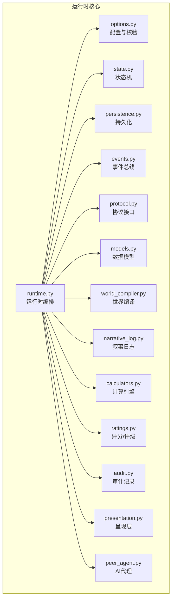

图表来源
- [engine_runtime/runtime.py](file://engine_runtime/runtime.py)
- [engine_runtime/options.py](file://engine_runtime/options.py)
- [engine_runtime/state.py](file://engine_runtime/state.py)
- [engine_runtime/persistence.py](file://engine_runtime/persistence.py)
- [engine_runtime/events.py](file://engine_runtime/events.py)
- [engine_runtime/protocol.py](file://engine_runtime/protocol.py)
- [engine_runtime/models.py](file://engine_runtime/models.py)
- [engine_runtime/world_compiler.py](file://engine_runtime/world_compiler.py)
- [engine_runtime/narrative_log.py](file://engine_runtime/narrative_log.py)
- [engine_runtime/calculators.py](file://engine_runtime/calculators.py)
- [engine_runtime/ratings.py](file://engine_runtime/ratings.py)
- [engine_runtime/audit.py](file://engine_runtime/audit.py)
- [engine_runtime/presentation.py](file://engine_runtime/presentation.py)
- [engine_runtime/peer_agent.py](file://engine_runtime/peer_agent.py)

章节来源
- [engine_runtime/runtime.py](file://engine_runtime/runtime.py)
- [engine_runtime/options.py](file://engine_runtime/options.py)
- [engine_runtime/state.py](file://engine_runtime/state.py)
- [engine_runtime/persistence.py](file://engine_runtime/persistence.py)
- [engine_runtime/events.py](file://engine_runtime/events.py)
- [engine_runtime/protocol.py](file://engine_runtime/protocol.py)
- [engine_runtime/models.py](file://engine_runtime/models.py)
- [engine_runtime/world_compiler.py](file://engine_runtime/world_compiler.py)
- [engine_runtime/narrative_log.py](file://engine_runtime/narrative_log.py)
- [engine_runtime/calculators.py](file://engine_runtime/calculators.py)
- [engine_runtime/ratings.py](file://engine_runtime/ratings.py)
- [engine_runtime/audit.py](file://engine_runtime/audit.py)
- [engine_runtime/presentation.py](file://engine_runtime/presentation.py)
- [engine_runtime/peer_agent.py](file://engine_runtime/peer_agent.py)

## 核心组件
- 运行时编排器（runtime）：负责生命周期管理、阶段编排、上下文装配、启动/关闭钩子、错误恢复与重试策略。
- 配置系统（options）：集中管理环境变量、配置文件、命令行参数；提供类型校验、默认值合并、热更新能力。
- 状态机（state）：维护运行期全局状态、会话上下文、世界快照与变更队列。
- 持久化（persistence）：抽象存储后端，统一读写、事务、回滚与版本迁移。
- 事件总线（events）：发布/订阅机制，支持异步派发、去重、幂等与顺序保证。
- 协议接口（protocol）：定义对外 API 契约、请求/响应模型、错误码与限流策略。
- 数据模型（models）：领域实体、值对象、枚举与约束。
- 世界编译器（world_compiler）：将模板/配置编译为可执行的世界描述，注入规则与初始状态。
- 叙事日志（narrative_log）：结构化记录关键决策与剧情分支，便于回放与审计。
- 计算引擎（calculators）：数值计算、概率判定、平衡性调整。
- 评分/评级（ratings）：对行为/结果进行打分与等级划分，驱动反馈循环。
- 审计（audit）：不可变审计日志，追踪变更轨迹与合规性。
- 呈现层（presentation）：格式化输出、渲染视图、适配不同终端或前端。
- **新增** AI代理（peer_agent）：管理NPC行为和玩家代理模拟，提供智能决策和生存场景行为逻辑。

**更新** 新增了AI代理组件，专门负责NPC行为和玩家代理的模拟，改进了生存场景中的行为准确性和合理性。

章节来源
- [engine_runtime/runtime.py](file://engine_runtime/runtime.py)
- [engine_runtime/options.py](file://engine_runtime/options.py)
- [engine_runtime/state.py](file://engine_runtime/state.py)
- [engine_runtime/persistence.py](file://engine_runtime/persistence.py)
- [engine_runtime/events.py](file://engine_runtime/events.py)
- [engine_runtime/protocol.py](file://engine_runtime/protocol.py)
- [engine_runtime/models.py](file://engine_runtime/models.py)
- [engine_runtime/world_compiler.py](file://engine_runtime/world_compiler.py)
- [engine_runtime/narrative_log.py](file://engine_runtime/narrative_log.py)
- [engine_runtime/calculators.py](file://engine_runtime/calculators.py)
- [engine_runtime/ratings.py](file://engine_runtime/ratings.py)
- [engine_runtime/audit.py](file://engine_runtime/audit.py)
- [engine_runtime/presentation.py](file://engine_runtime/presentation.py)
- [engine_runtime/peer_agent.py](file://engine_runtime/peer_agent.py)

## 架构总览
运行时以"配置加载 → 世界编译 → 状态初始化 → 事件总线就绪 → 协议服务启动 → AI代理初始化 → 业务循环 → 优雅关闭"为主线，贯穿各子系统协作。**更新** 现在包含增强的AI代理系统，确保NPC行为和玩家代理模拟更加准确和智能。

```mermaid
sequenceDiagram
participant CLI as "调用方/测试"
participant RT as "运行时(runtime)"
participant OPT as "配置(options)"
participant WC as "世界编译器(world_compiler)"
participant ST as "状态(state)"
participant PERS as "持久化(persistence)"
participant EVT as "事件(events)"
participant PROTO as "协议(protocol)"
participant PA as "AI代理(peer_agent)"
CLI->>RT : 创建实例(传入配置/路径)
RT->>OPT : 加载并校验配置
OPT-->>RT : 已验证的配置对象
RT->>WC : 编译世界(模板/规则)
WC-->>RT : 世界描述/初始状态
RT->>ST : 初始化状态机
ST-->>RT : 状态就绪
RT->>PERS : 连接存储/迁移检查
PERS-->>RT : 连接成功
RT->>EVT : 注册处理器/启动总线
EVT-->>RT : 事件总线就绪
RT->>PROTO : 启动协议服务
PROTO-->>RT : 监听端口/路由就绪
RT->>PA : 初始化AI代理
PA-->>RT : AI代理就绪
RT-->>CLI : 运行中(可接收请求)
CLI->>RT : 停止信号
RT->>PROTO : 关闭服务
RT->>EVT : 停止派发/等待队列清空
RT->>PERS : 提交事务/断开连接
RT->>ST : 保存快照/清理上下文
RT->>PA : 清理AI代理
PA-->>RT : AI代理清理完成
RT-->>CLI : 已关闭
```

**更新** 在启动流程中增加了AI代理初始化步骤，在关闭流程中增加了AI代理清理步骤，确保NPC行为和玩家代理的正确管理。

图表来源
- [engine_runtime/runtime.py](file://engine_runtime/runtime.py)
- [engine_runtime/options.py](file://engine_runtime/options.py)
- [engine_runtime/world_compiler.py](file://engine_runtime/world_compiler.py)
- [engine_runtime/state.py](file://engine_runtime/state.py)
- [engine_runtime/persistence.py](file://engine_runtime/persistence.py)
- [engine_runtime/events.py](file://engine_runtime/events.py)
- [engine_runtime/protocol.py](file://engine_runtime/protocol.py)
- [engine_runtime/peer_agent.py](file://engine_runtime/peer_agent.py)

## 详细组件分析

### 运行时编排器（runtime）
- 职责：生命周期编排、阶段钩子、错误恢复、资源协调、监控埋点。
- 关键点：
  - 启动阶段：配置加载→世界编译→状态初始化→持久化连接→事件总线注册→协议服务启动→AI代理初始化。
  - 运行阶段：请求分发、任务调度、事件消费、指标采集、AI代理协调。
  - 关闭阶段：优雅停机、队列 draining、事务提交、AI代理清理、资源释放。
  - 错误恢复：重试策略、降级开关、熔断保护、快照回滚、资源清理。

**更新** 增强了AI代理集成，确保在启动时初始化AI代理，在关闭时执行完整的AI代理清理流程。

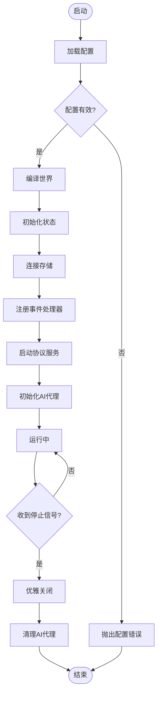

**更新** 在启动流程中增加了AI代理初始化步骤，在关闭流程中增加了AI代理清理步骤。

图表来源
- [engine_runtime/runtime.py](file://engine_runtime/runtime.py)

章节来源
- [engine_runtime/runtime.py](file://engine_runtime/runtime.py)

### AI代理系统（peer_agent）
- 职责：管理NPC行为和玩家代理模拟，提供智能决策和生存场景行为逻辑。
- 关键点：
  - 代理状态管理：跟踪每个代理的状态、属性和行为模式。
  - 决策算法：基于环境和状态做出合理的决策选择。
  - 生存行为：实现饥饿、口渴、社交等生存需求的模拟。
  - 学习机制：根据经验调整行为模式和决策权重。
  - 通信协议：与其他代理和系统进行信息交换。

**新增** 这是本次更新的核心组件，专门负责AI代理的管理和模拟，改进了生存场景中的行为准确性。

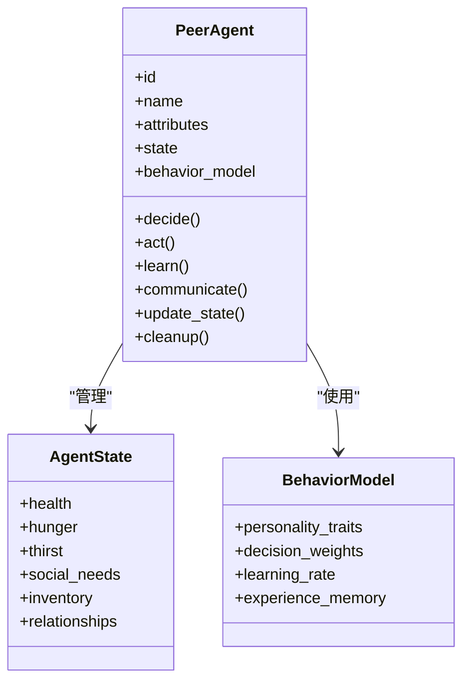

**图表来源**
- [engine_runtime/peer_agent.py](file://engine_runtime/peer_agent.py)

章节来源
- [engine_runtime/peer_agent.py](file://engine_runtime/peer_agent.py)

### 配置系统（options）
- 职责：统一配置源（环境变量、配置文件、命令行）、类型校验、默认值合并、动态刷新。
- 关键点：
  - 优先级：命令行 > 环境变量 > 配置文件 > 内置默认值。
  - 校验：必填项、范围、格式、依赖关系校验。
  - 默认值：分层默认、按需懒加载。
  - 热更新：部分配置可在运行期生效（如日志级别、采样率）。

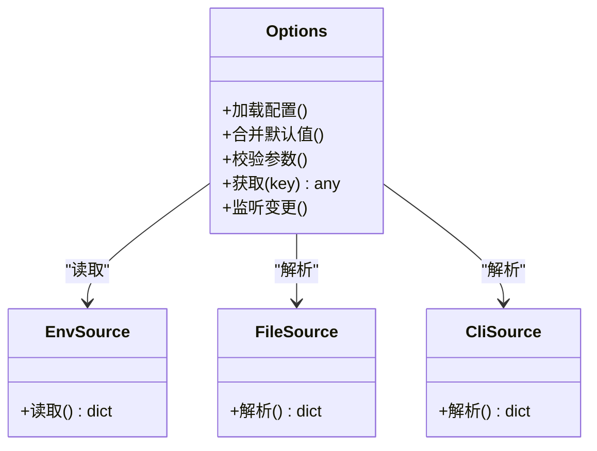

图表来源
- [engine_runtime/options.py](file://engine_runtime/options.py)

章节来源
- [engine_runtime/options.py](file://engine_runtime/options.py)

### 状态机（state）
- 职责：维护运行期全局状态、会话上下文、世界快照、变更队列。
- 关键点：
  - 原子更新：基于快照+增量变更，确保一致性。
  - 并发安全：读写锁/不可变快照。
  - 生命周期：创建、加载、保存、回滚。
  - 代理状态同步：确保AI代理状态与世界状态保持一致。

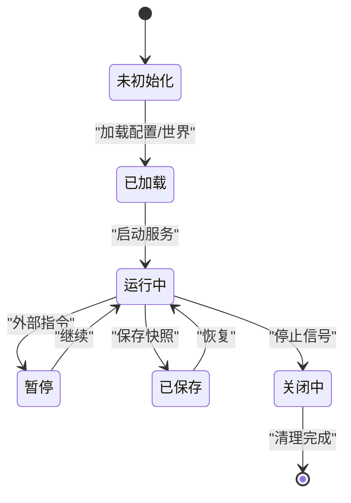

图表来源
- [engine_runtime/state.py](file://engine_runtime/state.py)

章节来源
- [engine_runtime/state.py](file://engine_runtime/state.py)

### 持久化（persistence）
- 职责：统一存储接口、事务、迁移、备份与恢复。
- 关键点：
  - 多后端抽象：内存、文件、数据库。
  - 事务语义：ACID 或最终一致。
  - 版本兼容：schema 升级与回退。
  - 代理数据持久化：保存和恢复AI代理的状态和行为数据。

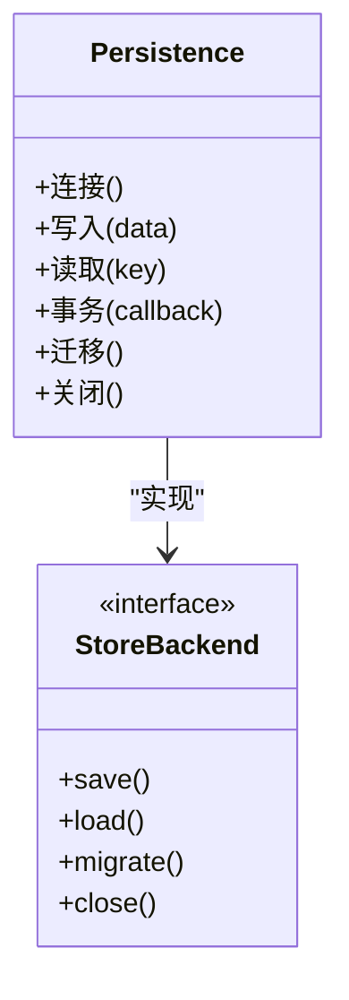

图表来源
- [engine_runtime/persistence.py](file://engine_runtime/persistence.py)

章节来源
- [engine_runtime/persistence.py](file://engine_runtime/persistence.py)

### 事件总线（events）
- 职责：解耦模块通信、异步派发、顺序保证、幂等处理。
- 关键点：
  - 订阅/发布：按主题路由。
  - 可靠性：重试、死信队列、去重。
  - 性能：批量投递、背压控制。
  - 代理事件：处理AI代理相关的事件，如行为变化、状态更新等。

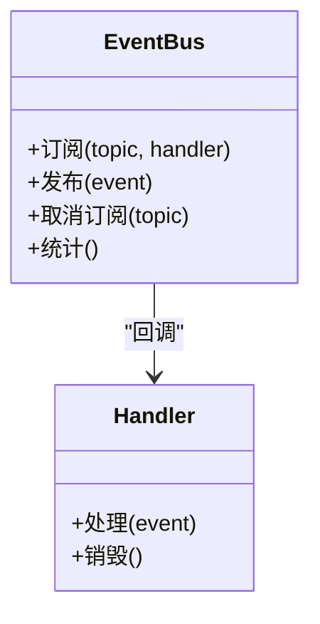

图表来源
- [engine_runtime/events.py](file://engine_runtime/events.py)

章节来源
- [engine_runtime/events.py](file://engine_runtime/events.py)

### 协议接口（protocol）
- 职责：定义对外 API 契约、请求/响应模型、错误码、限流与鉴权。
- 关键点：
  - 路由映射：URL/方法到处理器。
  - 序列化：输入校验、输出格式化。
  - 错误规范：统一错误体与状态码。
  - 代理API：提供AI代理管理的API接口。

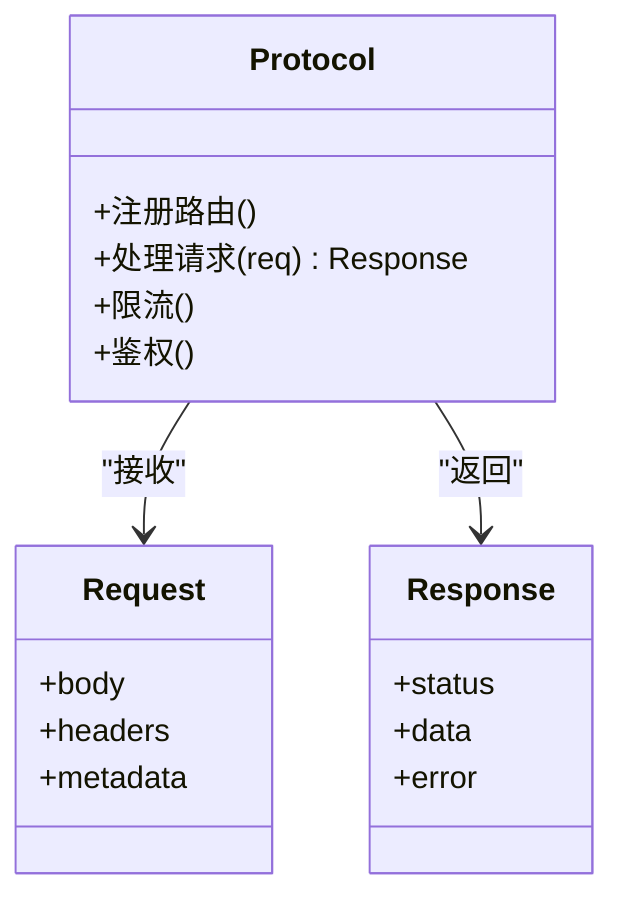

图表来源
- [engine_runtime/protocol.py](file://engine_runtime/protocol.py)

章节来源
- [engine_runtime/protocol.py](file://engine_runtime/protocol.py)

### 数据模型（models）
- 职责：领域实体、值对象、枚举与约束。
- 关键点：
  - 不可变性优先。
  - 校验在构造时完成。
  - 序列化/反序列化稳定。
  - 代理模型：定义AI代理的数据结构和约束。

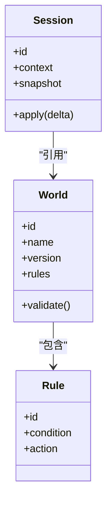

图表来源
- [engine_runtime/models.py](file://engine_runtime/models.py)

章节来源
- [engine_runtime/models.py](file://engine_runtime/models.py)

### 世界编译器（world_compiler）
- 职责：将模板/配置编译为可执行的世界描述，注入规则与初始状态。
- 关键点：
  - 模板解析：YAML/JSON 模板。
  - 规则注入：条件与动作绑定。
  - 初始状态生成：从模板推导。
  - 代理配置：生成AI代理的初始配置和行为模式。

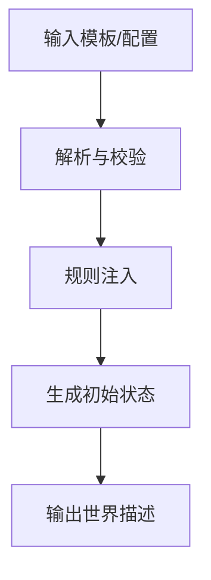

图表来源
- [engine_runtime/world_compiler.py](file://engine_runtime/world_compiler.py)

章节来源
- [engine_runtime/world_compiler.py](file://engine_runtime/world_compiler.py)

### 叙事日志（narrative_log）
- 职责：记录关键决策与剧情分支，支持回放与审计。
- 关键点：
  - 追加写、只读回放。
  - 结构化字段：时间戳、主体、动作、结果。
  - 压缩与归档策略。
  - 代理行为记录：记录AI代理的关键决策和行为。

章节来源
- [engine_runtime/narrative_log.py](file://engine_runtime/narrative_log.py)

### 计算引擎（calculators）
- 职责：数值计算、概率判定、平衡性调整。
- 关键点：
  - 可插拔算法。
  - 精度与性能权衡。
  - 可观测性：耗时与命中统计。
  - 代理决策计算：支持AI代理的决策算法和概率计算。

章节来源
- [engine_runtime/calculators.py](file://engine_runtime/calculators.py)

### 评分/评级（ratings）
- 职责：对行为/结果进行打分与等级划分，驱动反馈循环。
- 关键点：
  - 评分维度与权重。
  - 阈值与等级映射。
  - 历史趋势分析。
  - 代理行为评估：评估AI代理的行为质量和效果。

章节来源
- [engine_runtime/ratings.py](file://engine_runtime/ratings.py)

### 审计（audit）
- 职责：不可变审计日志，追踪变更轨迹与合规性。
- 关键点：
  - 防篡改存储。
  - 最小化敏感信息。
  - 查询与导出。
  - 代理操作审计：记录AI代理的重要操作和决策。

章节来源
- [engine_runtime/audit.py](file://engine_runtime/audit.py)

### 呈现层（presentation）
- 职责：格式化输出、渲染视图、适配不同终端或前端。
- 关键点：
  - 多格式支持（文本、JSON、Markdown）。
  - 模板渲染。
  - 国际化与本地化。
  - 代理状态展示：格式化显示AI代理的状态和信息。

章节来源
- [engine_runtime/presentation.py](file://engine_runtime/presentation.py)

## 依赖关系分析
运行时对各子模块存在明确依赖，遵循低耦合高内聚原则。以下为运行时核心依赖图：**更新** 现在包含了AI代理系统的依赖关系。

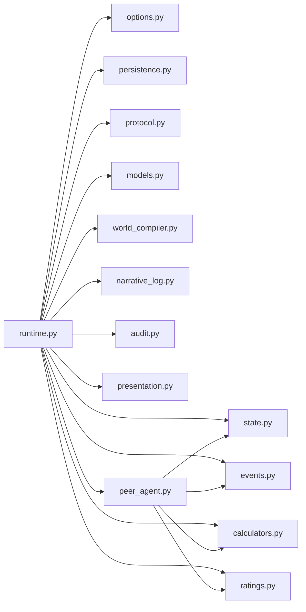

**更新** AI代理依赖于状态、事件、计算引擎和评分模块，用于管理代理行为和决策。

图表来源
- [engine_runtime/runtime.py](file://engine_runtime/runtime.py)
- [engine_runtime/options.py](file://engine_runtime/options.py)
- [engine_runtime/state.py](file://engine_runtime/state.py)
- [engine_runtime/persistence.py](file://engine_runtime/persistence.py)
- [engine_runtime/events.py](file://engine_runtime/events.py)
- [engine_runtime/protocol.py](file://engine_runtime/protocol.py)
- [engine_runtime/models.py](file://engine_runtime/models.py)
- [engine_runtime/world_compiler.py](file://engine_runtime/world_compiler.py)
- [engine_runtime/narrative_log.py](file://engine_runtime/narrative_log.py)
- [engine_runtime/calculators.py](file://engine_runtime/calculators.py)
- [engine_runtime/ratings.py](file://engine_runtime/ratings.py)
- [engine_runtime/audit.py](file://engine_runtime/audit.py)
- [engine_runtime/presentation.py](file://engine_runtime/presentation.py)
- [engine_runtime/peer_agent.py](file://engine_runtime/peer_agent.py)

章节来源
- [engine_runtime/runtime.py](file://engine_runtime/runtime.py)

## 性能考量
- 事件总线：批量投递、背压控制、消费者并行度调优。
- 持久化：连接池、批写入、索引优化、冷热数据分离。
- 状态机：快照粒度、增量合并、并发访问控制。
- 计算引擎：缓存中间结果、算法选择、精度与速度权衡。
- 监控与诊断：指标采集、采样率、慢查询追踪、分布式链路。
- **更新** AI代理性能：优化决策算法效率，减少不必要的计算开销。
- **更新** 代理状态同步：确保状态更新的及时性和一致性。
- **更新** 生存场景优化：针对生存模式的特殊优化，提升NPC行为响应速度。

**更新** 新增了AI代理相关的性能优化指导，特别关注决策算法效率和生存场景的性能改进。

[本节为通用指导，不直接分析具体文件]

## 故障排查指南
- 常见错误：
  - 配置校验失败：检查必填项、类型与范围。
  - 世界编译失败：模板语法、规则冲突、初始状态不一致。
  - 持久化连接失败：网络、权限、版本不兼容。
  - 事件处理异常：死信队列、重复消费、顺序错乱。
  - **更新** AI代理行为异常：检查代理状态、决策逻辑、生存需求模拟。
  - **更新** 代理通信问题：检查事件总线、消息传递、状态同步。
  - **更新** 生存场景问题：检查需求满足逻辑、行为优先级、资源分配。
- 定位手段：
  - 启用审计与叙事日志，回溯关键步骤。
  - 查看运行时指标与告警，定位瓶颈与异常。
  - 使用测试用例复现问题，逐步缩小范围。
  - **更新** 启用代理调试日志，跟踪决策过程和状态变化。
  - **更新** 监控代理行为指标，识别异常模式和性能瓶颈。
  - **更新** 分析生存场景数据，检查需求满足和资源使用情况。
- 恢复策略：
  - 快照回滚、事务回滚、重试与降级。
  - 隔离故障模块，快速恢复服务。
  - **更新** 重置代理状态，重新初始化AI代理。
  - **更新** 清理代理缓存，清除错误的状态数据。
  - **更新** 重启代理决策引擎，恢复正常的行为逻辑。

**更新** 新增了AI代理相关的故障排查方法和恢复策略，特别关注代理行为异常和生存场景问题的解决。

章节来源
- [engine_runtime/audit.py](file://engine_runtime/audit.py)
- [engine_runtime/narrative_log.py](file://engine_runtime/narrative_log.py)
- [engine_runtime/peer_agent.py](file://engine_runtime/peer_agent.py)
- [tests/test_engine_runtime.py](file://tests/test_engine_runtime.py)

## 结论
运行时核心通过清晰的模块化设计与严格的配置校验，实现了稳定的生命周期管理与可扩展的插件机制。借助事件驱动与持久化抽象，系统在性能、可靠性与可观测性方面具备良好基础。**更新** 本次更新显著增强了AI代理功能，通过引入专门的peer_agent模块，改进了玩家代理模拟的准确性和生存场景的行为逻辑，进一步提升了游戏的沉浸感和真实性。新增的AI代理系统能够更智能地模拟NPC行为，提供更丰富的游戏体验。建议在生产环境中结合监控与审计完善闭环，持续优化AI代理性能和行为质量。

[本节为总结，不直接分析具体文件]

## 附录

### 启动与配置示例（基于测试）
- 参考测试用例中的运行时创建与配置方式，演示如何设置必要参数、加载模板、启动与停止。
- 关键步骤：
  - 准备配置（环境变量/配置文件/命令行参数）。
  - 指定世界模板路径与输出目录。
  - 启动运行时并等待就绪。
  - 发送业务请求或触发事件。
  - 优雅关闭并验证持久化结果。
  - **更新** 验证AI代理：确认代理正确初始化并正常工作。
  - **更新** 验证生存场景：确保NPC行为符合预期。

章节来源
- [tests/test_engine_runtime.py](file://tests/test_engine_runtime.py)

### 元数据与模板参考
- 元数据模板用于描述保存集的基本信息与版本，便于迁移与兼容性检查。

章节来源
- [templates/save_template/meta.yaml](file://templates/save_template/meta.yaml)

### AI代理最佳实践
- **新增** 代理状态管理：
  - 合理设计代理状态结构，避免过度复杂化。
  - 实现状态同步机制，确保与主状态的一致性。
  - 使用事件驱动更新代理状态，提高响应性。
- **新增** 决策算法优化：
  - 选择合适的决策算法，平衡准确性和性能。
  - 实现决策缓存，避免重复计算相同决策。
  - 支持决策权重调整，适应不同场景需求。
- **新增** 生存场景设计：
  - 设计合理的生存需求层次，模拟真实人类需求。
  - 实现需求满足的动态调整，反映环境变化影响。
  - 支持代理间协作，提升群体生存效率。
- **新增** 性能优化技巧：
  - 使用异步处理代理决策，避免阻塞主线程。
  - 实现代理批处理，提高大规模代理场景的性能。
  - 监控代理性能指标，及时发现和优化瓶颈。

**新增** 这是本次更新添加的最佳实践指导，帮助开发者正确使用新的AI代理系统和优化生存场景表现。