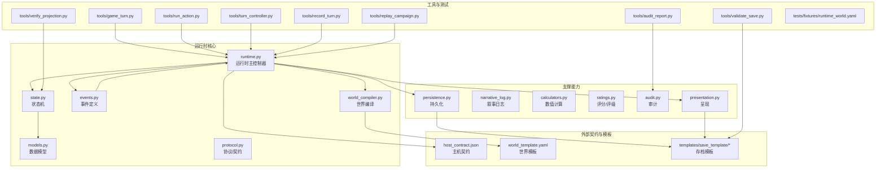
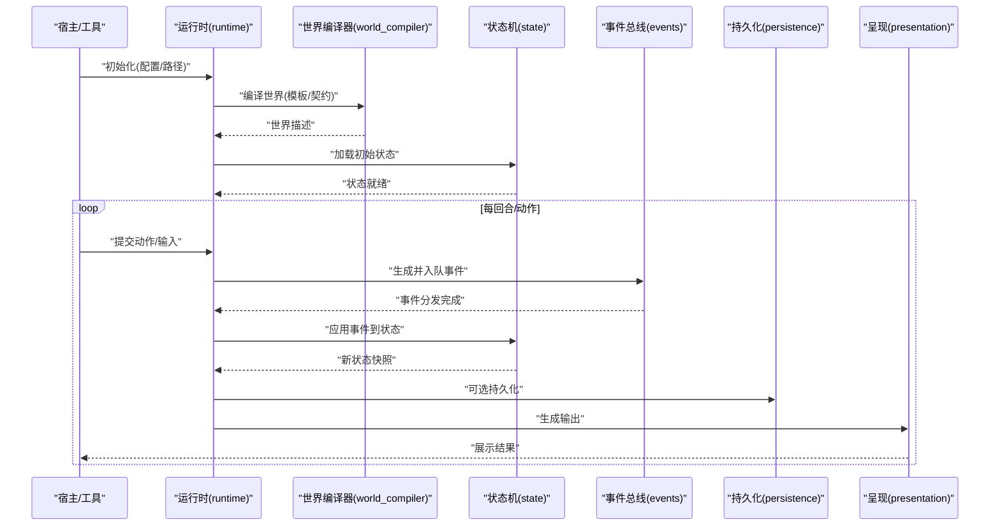
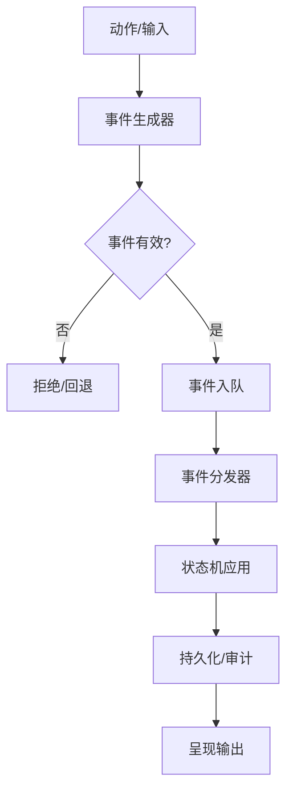
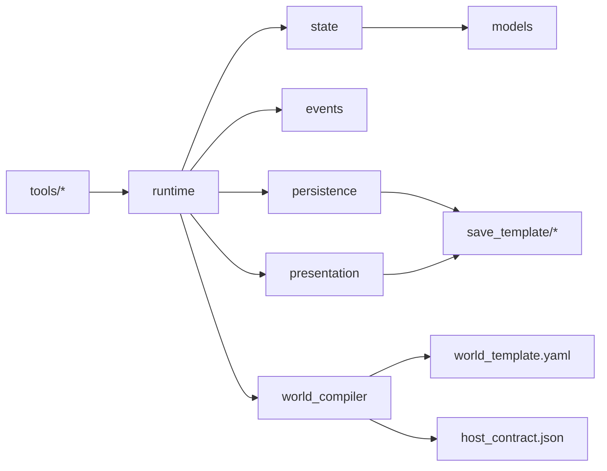

# 运行时系统

<cite>
**本文档引用的文件**   
- [engine_runtime/runtime.py](file://engine_runtime/runtime.py)
- [engine_runtime/state.py](file://engine_runtime/state.py)
- [engine_runtime/models.py](file://engine_runtime/models.py)
- [engine_runtime/events.py](file://engine_runtime/events.py)
- [engine_runtime/persistence.py](file://engine_runtime/persistence.py)
- [engine_runtime/options.py](file://engine_runtime/options.py)
- [engine_runtime/protocol.py](file://engine_runtime/protocol.py)
- [engine_runtime/world_compiler.py](file://engine_runtime/world_compiler.py)
- [engine_runtime/narrative_log.py](file://engine_runtime/narrative_log.py)
- [engine_runtime/calculators.py](file://engine_runtime/calculators.py)
- [engine_runtime/ratings.py](file://engine_runtime/ratings.py)
- [engine_runtime/audit.py](file://engine_runtime/audit.py)
- [engine_runtime/presentation.py](file://engine_runtime/presentation.py)
- [engine_runtime/host_contract.json](file://engine_runtime/host_contract.json)
- [templates/save_template/meta.yaml](file://templates/save_template/meta.yaml)
- [templates/save_template/event_queue.yaml](file://templates/save_template/event_queue.yaml)
- [templates/save_template/player.yaml](file://templates/save_template/player.yaml)
- [templates/save_template/factions.yaml](file://templates/save_template/factions.yaml)
- [templates/save_template/inventory.yaml](file://templates/save_template/inventory.yaml)
- [templates/save_template/relationships.yaml](file://templates/save_template/relationships.yaml)
- [templates/save_template/npcs.yaml](file://templates/save_template/npcs.yaml)
- [templates/save_template/conversation_log.md](file://templates/save_template/conversation_log.md)
- [templates/save_template/decision_audit.md](file://templates/save_template/decision_audit.md)
- [templates/save_template/event_log.md](file://templates/save_template/event_log.md)
- [templates/save_template/novel_draft.md](file://templates/save_template/novel_draft.md)
- [templates/save_template/story.md](file://templates/save_template/story.md)
- [templates/world_template.yaml](file://templates/world_template.yaml)
- [tests/fixtures/runtime_world.yaml](file://tests/fixtures/runtime_world.yaml)
- [tools/game_turn.py](file://tools/game_turn.py)
- [tools/run_action.py](file://tools/run_action.py)
- [tools/turn_controller.py](file://tools/turn_controller.py)
- [tools/record_turn.py](file://tools/record_turn.py)
- [tools/replay_campaign.py](file://tools/replay_campaign.py)
- [tools/validate_save.py](file://tools/validate_save.py)
- [tools/verify_projection.py](file://tools/verify_projection.py)
- [tools/audit_report.py](file://tools/audit_report.py)
</cite>

## 目录
1. [简介](#简介)
2. [项目结构](#项目结构)
3. [核心组件](#核心组件)
4. [架构总览](#架构总览)
5. [详细组件分析](#详细组件分析)
6. [依赖关系分析](#依赖关系分析)
7. [性能考虑](#性能考虑)
8. [故障排查指南](#故障排查指南)
9. [结论](#结论)
10. [附录](#附录)

## 简介
本文件为“运行时系统”的全面技术文档，面向希望集成、扩展与运维该系统的工程师与策划。内容涵盖：
- 运行时的核心职责、生命周期管理与状态管理
- 数据模型设计、事件处理流程与持久化策略
- 配置选项、扩展接口与自定义开发指南
- 使用示例与集成路径
- 错误处理、日志记录与调试技巧
- 性能监控与资源管理最佳实践

该系统以事件驱动为核心，采用世界编译与投影机制，提供可插拔的持久化与呈现层，支持存档/回放与审计追踪，便于构建叙事驱动的交互式引擎。

## 项目结构
运行时模块位于 engine_runtime，围绕运行时主控制器、状态机、事件总线、持久化、计算与评级、审计与呈现等子模块组织。模板与工具分别用于存档结构与命令行集成。

图表来源
- [engine_runtime/runtime.py](file://engine_runtime/runtime.py)
- [engine_runtime/state.py](file://engine_runtime/state.py)
- [engine_runtime/models.py](file://engine_runtime/models.py)
- [engine_runtime/events.py](file://engine_runtime/events.py)
- [engine_runtime/persistence.py](file://engine_runtime/persistence.py)
- [engine_runtime/presentation.py](file://engine_runtime/presentation.py)
- [engine_runtime/world_compiler.py](file://engine_runtime/world_compiler.py)
- [engine_runtime/host_contract.json](file://engine_runtime/host_contract.json)
- [templates/world_template.yaml](file://templates/world_template.yaml)
- [templates/save_template/meta.yaml](file://templates/save_template/meta.yaml)

章节来源
- [engine_runtime/runtime.py](file://engine_runtime/runtime.py)
- [engine_runtime/state.py](file://engine_runtime/state.py)
- [engine_runtime/models.py](file://engine_runtime/models.py)
- [engine_runtime/events.py](file://engine_runtime/events.py)
- [engine_runtime/persistence.py](file://engine_runtime/persistence.py)
- [engine_runtime/presentation.py](file://engine_runtime/presentation.py)
- [engine_runtime/world_compiler.py](file://engine_runtime/world_compiler.py)
- [engine_runtime/host_contract.json](file://engine_runtime/host_contract.json)
- [templates/world_template.yaml](file://templates/world_template.yaml)

## 核心组件
- 运行时主控制器：负责生命周期编排（初始化、加载世界、回合推进、保存/恢复）、事件调度、与持久化和呈现层的协调。
- 状态机：维护当前游戏状态快照与变更历史，提供一致性检查与回滚能力。
- 数据模型：定义玩家、阵营、物品、关系、NPC 等实体及其约束。
- 事件系统：定义领域事件、事件队列与分发机制，驱动状态转换。
- 世界编译器：将模板与配置编译为运行时可用的世界描述。
- 持久化：统一存档读写，基于 YAML/Markdown 模板序列化/反序列化。
- 呈现：将内部状态转换为可读输出（文本/结构化）。
- 计算与评级：数值运算、概率判定与评分体系。
- 审计与日志：记录决策与事件轨迹，支持回放与验证。

章节来源
- [engine_runtime/runtime.py](file://engine_runtime/runtime.py)
- [engine_runtime/state.py](file://engine_runtime/state.py)
- [engine_runtime/models.py](file://engine_runtime/models.py)
- [engine_runtime/events.py](file://engine_runtime/events.py)
- [engine_runtime/world_compiler.py](file://engine_runtime/world_compiler.py)
- [engine_runtime/persistence.py](file://engine_runtime/persistence.py)
- [engine_runtime/presentation.py](file://engine_runtime/presentation.py)
- [engine_runtime/calculators.py](file://engine_runtime/calculators.py)
- [engine_runtime/ratings.py](file://engine_runtime/ratings.py)
- [engine_runtime/audit.py](file://engine_runtime/audit.py)
- [engine_runtime/narrative_log.py](file://engine_runtime/narrative_log.py)

## 架构总览
运行时采用“控制流+事件流”的双轨架构：
- 控制流由运行时主控制器驱动，按回合或动作推进；
- 事件流通过事件队列解耦业务逻辑，确保可追溯与可回放；
- 世界编译阶段将模板转化为运行时对象；
- 持久化与呈现作为横切关注点，被运行时按需调用。

图表来源
- [engine_runtime/runtime.py](file://engine_runtime/runtime.py)
- [engine_runtime/world_compiler.py](file://engine_runtime/world_compiler.py)
- [engine_runtime/state.py](file://engine_runtime/state.py)
- [engine_runtime/events.py](file://engine_runtime/events.py)
- [engine_runtime/persistence.py](file://engine_runtime/persistence.py)
- [engine_runtime/presentation.py](file://engine_runtime/presentation.py)

## 详细组件分析

### 运行时主控制器（runtime）
- 职责
  - 生命周期：启动、加载世界、进入主循环、退出清理
  - 回合推进：接收输入、触发事件、更新状态、持久化与呈现
  - 配置注入：读取 options 与 host_contract 契约
- 关键交互
  - 与世界编译器协作生成世界
  - 与状态机同步一致视图
  - 与持久化/呈现层解耦
- 扩展点
  - 自定义事件处理器
  - 自定义持久化后端
  - 自定义呈现格式

章节来源
- [engine_runtime/runtime.py](file://engine_runtime/runtime.py)
- [engine_runtime/options.py](file://engine_runtime/options.py)
- [engine_runtime/host_contract.json](file://engine_runtime/host_contract.json)

### 状态机（state）
- 职责
  - 维护全局状态快照与版本
  - 提供状态校验、增量更新与回滚
  - 暴露只读视图供呈现与审计
- 设计要点
  - 不可变快照 + 差异合并
  - 事件幂等性保障
  - 并发安全（如适用）

章节来源
- [engine_runtime/state.py](file://engine_runtime/state.py)

### 数据模型（models）
- 实体
  - 玩家、阵营、物品、关系、NPC、故事片段等
- 约束
  - 必填字段、枚举值、关联完整性
- 序列化
  - 与存档模板一一对应，支持 YAML/Markdown

章节来源
- [engine_runtime/models.py](file://engine_runtime/models.py)
- [templates/save_template/player.yaml](file://templates/save_template/player.yaml)
- [templates/save_template/factions.yaml](file://templates/save_template/factions.yaml)
- [templates/save_template/inventory.yaml](file://templates/save_template/inventory.yaml)
- [templates/save_template/relationships.yaml](file://templates/save_template/relationships.yaml)
- [templates/save_template/npcs.yaml](file://templates/save_template/npcs.yaml)

### 事件系统（events）
- 职责
  - 定义事件类型与载荷
  - 事件队列与分发
  - 事件溯源与回放
- 流程
  - 动作 -> 事件生成 -> 入队 -> 分发 -> 状态变更 -> 审计

图表来源
- [engine_runtime/events.py](file://engine_runtime/events.py)
- [engine_runtime/state.py](file://engine_runtime/state.py)
- [engine_runtime/persistence.py](file://engine_runtime/persistence.py)
- [engine_runtime/audit.py](file://engine_runtime/audit.py)

章节来源
- [engine_runtime/events.py](file://engine_runtime/events.py)
- [templates/save_template/event_queue.yaml](file://templates/save_template/event_queue.yaml)

### 世界编译器（world_compiler）
- 职责
  - 解析 world_template.yaml
  - 校验 host_contract.json 契约
  - 生成运行时世界描述对象
- 关键点
  - 模板变量替换
  - 默认值与覆盖策略
  - 错误定位与诊断

章节来源
- [engine_runtime/world_compiler.py](file://engine_runtime/world_compiler.py)
- [templates/world_template.yaml](file://templates/world_template.yaml)
- [engine_runtime/host_contract.json](file://engine_runtime/host_contract.json)

### 持久化（persistence）
- 职责
  - 统一存档读写
  - 多格式支持（YAML/Markdown）
  - 增量与全量策略
- 设计要点
  - 原子写入与校验
  - 版本兼容与迁移
  - 备份与恢复

章节来源
- [engine_runtime/persistence.py](file://engine_runtime/persistence.py)
- [templates/save_template/meta.yaml](file://templates/save_template/meta.yaml)

### 呈现（presentation）
- 职责
  - 将状态与事件序列渲染为用户可读的输出
  - 支持多种格式（文本、结构化）
- 扩展点
  - 自定义渲染器

章节来源
- [engine_runtime/presentation.py](file://engine_runtime/presentation.py)

### 计算与评级（calculators, ratings）
- 职责
  - 数值计算、概率判定、权重选择
  - 评分/评级规则与聚合
- 用途
  - 战斗/社交/经济等系统数值化

章节来源
- [engine_runtime/calculators.py](file://engine_runtime/calculators.py)
- [engine_runtime/ratings.py](file://engine_runtime/ratings.py)

### 审计与叙事日志（audit, narrative_log）
- 职责
  - 决策与事件轨迹记录
  - 对话与剧情片段归档
- 用途
  - 回放、取证、复盘

章节来源
- [engine_runtime/audit.py](file://engine_runtime/audit.py)
- [engine_runtime/narrative_log.py](file://engine_runtime/narrative_log.py)
- [templates/save_template/decision_audit.md](file://templates/save_template/decision_audit.md)
- [templates/save_template/event_log.md](file://templates/save_template/event_log.md)
- [templates/save_template/conversation_log.md](file://templates/save_template/conversation_log.md)

### 协议与契约（protocol, host_contract）
- 职责
  - 定义运行时对外接口与约束
  - 规范宿主与运行时的交互边界
- 用途
  - 插件/扩展接入、跨进程通信

章节来源
- [engine_runtime/protocol.py](file://engine_runtime/protocol.py)
- [engine_runtime/host_contract.json](file://engine_runtime/host_contract.json)

## 依赖关系分析
运行时对状态、事件、持久化、呈现、计算与审计存在强耦合；世界编译器依赖模板与契约；工具层通过运行时 API 驱动。

图表来源
- [engine_runtime/runtime.py](file://engine_runtime/runtime.py)
- [engine_runtime/state.py](file://engine_runtime/state.py)
- [engine_runtime/events.py](file://engine_runtime/events.py)
- [engine_runtime/persistence.py](file://engine_runtime/persistence.py)
- [engine_runtime/presentation.py](file://engine_runtime/presentation.py)
- [engine_runtime/world_compiler.py](file://engine_runtime/world_compiler.py)
- [templates/world_template.yaml](file://templates/world_template.yaml)
- [engine_runtime/host_contract.json](file://engine_runtime/host_contract.json)

章节来源
- [engine_runtime/runtime.py](file://engine_runtime/runtime.py)
- [engine_runtime/world_compiler.py](file://engine_runtime/world_compiler.py)
- [engine_runtime/persistence.py](file://engine_runtime/persistence.py)

## 性能考虑
- 事件批处理：批量入队与分发，减少锁竞争与上下文切换
- 状态快照策略：仅存储差异，定期全量快照
- 持久化优化：异步落盘、压缩与分片
- 计算缓存：热点数值结果缓存与失效策略
- 呈现延迟：按需渲染与分页输出
- 资源回收：及时释放文件句柄与内存占用

[本节为通用指导，不直接分析具体文件]

## 故障排查指南
- 常见问题
  - 世界编译失败：检查模板语法与契约约束
  - 事件无效：核对事件载荷与状态前置条件
  - 持久化异常：确认路径权限与模板一致性
  - 回放不一致：检查事件顺序与幂等性
- 诊断手段
  - 启用审计与叙事日志
  - 使用 validate_save 校验存档
  - 使用 verify_projection 验证投影一致性
  - 使用 replay_campaign 重放问题回合

章节来源
- [tools/validate_save.py](file://tools/validate_save.py)
- [tools/verify_projection.py](file://tools/verify_projection.py)
- [tools/replay_campaign.py](file://tools/replay_campaign.py)
- [engine_runtime/audit.py](file://engine_runtime/audit.py)
- [engine_runtime/narrative_log.py](file://engine_runtime/narrative_log.py)

## 结论
运行时系统以事件驱动为核心，结合世界编译与投影机制，提供了可扩展、可审计、可回放的叙事引擎基础。通过清晰的模块划分与契约约束，既保证了稳定性，也为二次开发与集成预留了充足空间。建议在生产环境中配合完善的审计、监控与备份策略，以获得最佳的可观测性与可靠性。

[本节为总结性内容，不直接分析具体文件]

## 附录

### 配置选项（options）
- 常见项
  - 世界模板路径、存档目录、日志级别
  - 事件队列大小、持久化策略开关
  - 呈现格式与输出目标
- 优先级
  - 默认值 < 配置文件 < 运行时参数

章节来源
- [engine_runtime/options.py](file://engine_runtime/options.py)

### 使用示例与集成
- 最小可用流程
  - 准备 world_template.yaml 与 save_template
  - 初始化运行时并传入配置
  - 加载世界、进入主循环、提交动作
  - 保存/恢复与回放
- 常用工具
  - game_turn：推进一个回合
  - run_action：执行单个动作
  - record_turn：录制回合
  - turn_controller：回合控制

章节来源
- [tools/game_turn.py](file://tools/game_turn.py)
- [tools/run_action.py](file://tools/run_action.py)
- [tools/record_turn.py](file://tools/record_turn.py)
- [tools/turn_controller.py](file://tools/turn_controller.py)
- [tests/fixtures/runtime_world.yaml](file://tests/fixtures/runtime_world.yaml)

### 扩展接口与自定义开发
- 自定义事件处理器：实现事件分发钩子
- 自定义持久化后端：实现读写接口适配
- 自定义呈现器：注册渲染器并选择输出格式
- 扩展世界模板：在契约范围内新增字段与规则

章节来源
- [engine_runtime/events.py](file://engine_runtime/events.py)
- [engine_runtime/persistence.py](file://engine_runtime/persistence.py)
- [engine_runtime/presentation.py](file://engine_runtime/presentation.py)
- [engine_runtime/host_contract.json](file://engine_runtime/host_contract.json)

### 数据模型与存档模板映射
- 玩家、阵营、物品、关系、NPC 等实体与对应 YAML/Markdown 模板
- 元数据与版本信息
- 事件日志与决策审计

章节来源
- [engine_runtime/models.py](file://engine_runtime/models.py)
- [templates/save_template/player.yaml](file://templates/save_template/player.yaml)
- [templates/save_template/factions.yaml](file://templates/save_template/factions.yaml)
- [templates/save_template/inventory.yaml](file://templates/save_template/inventory.yaml)
- [templates/save_template/relationships.yaml](file://templates/save_template/relationships.yaml)
- [templates/save_template/npcs.yaml](file://templates/save_template/npcs.yaml)
- [templates/save_template/meta.yaml](file://templates/save_template/meta.yaml)
- [templates/save_template/event_log.md](file://templates/save_template/event_log.md)
- [templates/save_template/decision_audit.md](file://templates/save_template/decision_audit.md)