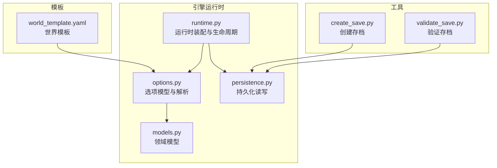
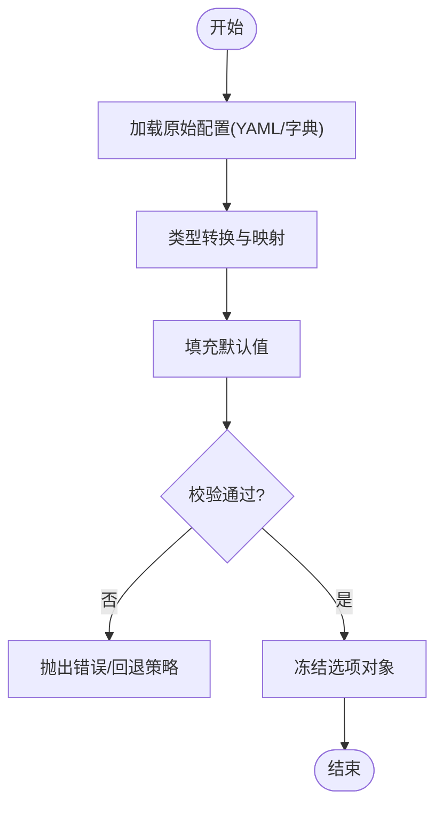
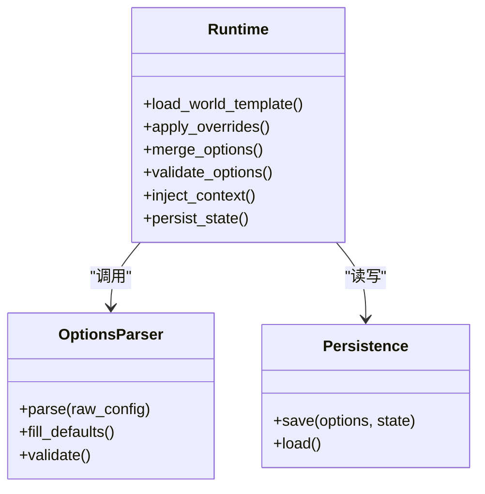
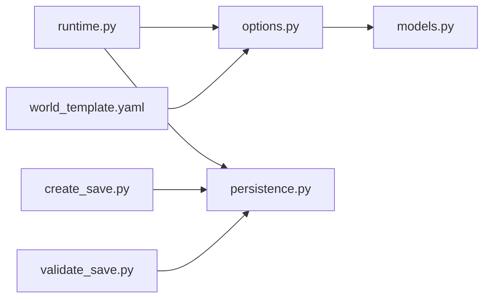

# 选项配置系统

<cite>
**本文档引用的文件**   
- [engine_runtime/options.py](file://engine_runtime/options.py)
- [engine_runtime/runtime.py](file://engine_runtime/runtime.py)
- [engine_runtime/models.py](file://engine_runtime/models.py)
- [engine_runtime/persistence.py](file://engine_runtime/persistence.py)
- [templates/world_template.yaml](file://templates/world_template.yaml)
- [tools/create_save.py](file://tools/create_save.py)
- [tools/validate_save.py](file://tools/validate_save.py)
</cite>

## 目录
1. [简介](#简介)
2. [项目结构](#项目结构)
3. [核心组件](#核心组件)
4. [架构总览](#架构总览)
5. [详细组件分析](#详细组件分析)
6. [依赖关系分析](#依赖关系分析)
7. [性能考量](#性能考量)
8. [故障排查指南](#故障排查指南)
9. [结论](#结论)
10. [附录](#附录)

## 简介
本文件围绕“选项配置系统”展开，聚焦于运行时如何加载、校验、合并与持久化世界与游戏相关的选项配置。该系统的目标是：
- 提供统一的世界级与玩家级选项模型
- 支持从模板与保存数据中加载并合并配置
- 在运行期对选项进行校验与默认值填充
- 将最终生效的配置写入持久化存储，供后续回合或回放使用

## 项目结构
与选项配置直接相关的代码主要位于 engine_runtime 模块，以及 templates 中的世界模板与 tools 中的辅助脚本。整体组织方式如下：
- 引擎运行时（engine_runtime）：定义选项模型、运行时装配、持久化读写等
- 模板（templates）：提供世界模板与存档模板，作为配置的来源
- 工具（tools）：提供创建存档、验证存档等实用脚本，间接体现选项的加载与校验流程



图表来源
- [engine_runtime/options.py](file://engine_runtime/options.py)
- [engine_runtime/runtime.py](file://engine_runtime/runtime.py)
- [engine_runtime/models.py](file://engine_runtime/models.py)
- [engine_runtime/persistence.py](file://engine_runtime/persistence.py)
- [templates/world_template.yaml](file://templates/world_template.yaml)
- [tools/create_save.py](file://tools/create_save.py)
- [tools/validate_save.py](file://tools/validate_save.py)

章节来源
- [engine_runtime/options.py](file://engine_runtime/options.py)
- [engine_runtime/runtime.py](file://engine_runtime/runtime.py)
- [engine_runtime/models.py](file://engine_runtime/models.py)
- [engine_runtime/persistence.py](file://engine_runtime/persistence.py)
- [templates/world_template.yaml](file://templates/world_template.yaml)
- [tools/create_save.py](file://tools/create_save.py)
- [tools/validate_save.py](file://tools/validate_save.py)

## 核心组件
- 选项模型与解析器（options.py）
  - 定义世界选项、玩家选项等数据结构
  - 提供从 YAML/字典到模型的转换、默认值填充与字段校验
- 运行时装配（runtime.py）
  - 负责在启动时加载模板与用户配置，合并为最终生效配置
  - 将配置注入到各子系统，并在需要时触发重算或刷新
- 领域模型（models.py）
  - 承载选项所影响的核心实体（如角色、阵营、事件等）
- 持久化（persistence.py）
  - 负责将选项与状态序列化到磁盘，以及从存档恢复

章节来源
- [engine_runtime/options.py](file://engine_runtime/options.py)
- [engine_runtime/runtime.py](file://engine_runtime/runtime.py)
- [engine_runtime/models.py](file://engine_runtime/models.py)
- [engine_runtime/persistence.py](file://engine_runtime/persistence.py)

## 架构总览
选项配置系统在运行期的典型调用链如下：
- 启动阶段：读取世界模板与可选覆盖配置，生成基础选项集
- 校验阶段：对必填项、取值范围、依赖关系进行检查
- 合并阶段：按优先级合并多来源配置（模板 > 用户覆盖 > 默认值）
- 注入阶段：将最终选项注入到运行时上下文
- 持久化：将生效配置与当前状态写入存档

```mermaid
sequenceDiagram
participant CLI as "命令行/入口"
participant RT as "运行时(runtime.py)"
participant OPT as "选项解析(options.py)"
participant PERS as "持久化(persistence.py)"
participant TPL as "模板(world_template.yaml)"
CLI->>RT : 启动应用
RT->>TPL : 读取世界模板
RT->>OPT : 解析并构建基础选项
OPT-->>RT : 返回已填充默认值的选项对象
RT->>OPT : 校验选项合法性
OPT-->>RT : 校验通过/失败
RT->>PERS : 加载已有存档(可选)
PERS-->>RT : 返回历史选项与状态
RT->>OPT : 合并模板/覆盖/存档选项
OPT-->>RT : 返回最终生效选项
RT->>PERS : 写入最终选项与状态
RT-->>CLI : 运行完成
```

图表来源
- [engine_runtime/runtime.py](file://engine_runtime/runtime.py)
- [engine_runtime/options.py](file://engine_runtime/options.py)
- [engine_runtime/persistence.py](file://engine_runtime/persistence.py)
- [templates/world_template.yaml](file://templates/world_template.yaml)

## 详细组件分析

### 选项模型与解析（options.py）
- 职责
  - 定义世界与玩家相关选项的数据结构
  - 实现从原始配置到强类型对象的转换
  - 提供默认值填充与字段校验逻辑
- 关键流程
  - 输入：YAML/字典形式的配置
  - 处理：类型转换、缺失字段补全、约束检查
  - 输出：不可变或受保护的选项对象，供运行时只读访问
- 复杂度与优化
  - 解析过程通常为 O(n) 规模，n 为配置项数量
  - 可通过懒加载与增量校验减少冷启动开销



图表来源
- [engine_runtime/options.py](file://engine_runtime/options.py)

章节来源
- [engine_runtime/options.py](file://engine_runtime/options.py)

### 运行时装配（runtime.py）
- 职责
  - 协调模板、覆盖与存档数据的加载顺序
  - 调用选项解析器完成合并与校验
  - 将最终选项注入到各子系统，必要时触发重计算
- 关键流程
  - 初始化：读取模板与覆盖配置
  - 合并：按优先级合并多来源选项
  - 校验：确保一致性、无冲突
  - 注入：更新运行时上下文
  - 持久化：落盘存档



图表来源
- [engine_runtime/runtime.py](file://engine_runtime/runtime.py)
- [engine_runtime/options.py](file://engine_runtime/options.py)
- [engine_runtime/persistence.py](file://engine_runtime/persistence.py)

章节来源
- [engine_runtime/runtime.py](file://engine_runtime/runtime.py)

### 领域模型（models.py）
- 职责
  - 定义被选项影响的实体（如角色属性、阵营规则、事件参数等）
  - 为选项解析与校验提供目标结构
- 设计要点
  - 与选项一一对应或存在明确映射关系
  - 避免在模型中混入业务逻辑，保持纯数据结构

章节来源
- [engine_runtime/models.py](file://engine_runtime/models.py)

### 持久化（persistence.py）
- 职责
  - 将选项与状态序列化为可存储格式（如 YAML/JSON）
  - 从存档恢复选项与状态，保证版本兼容
- 关键点
  - 版本迁移：当选项结构变更时需向前兼容
  - 幂等写入：重复保存不破坏状态

章节来源
- [engine_runtime/persistence.py](file://engine_runtime/persistence.py)

### 模板与工具（world_template.yaml / create_save.py / validate_save.py）
- 世界模板（world_template.yaml）
  - 提供默认选项集合，作为所有实例的基础
- 创建存档（create_save.py）
  - 演示如何基于模板生成初始存档，包含默认选项
- 验证存档（validate_save.py）
  - 演示如何加载存档并校验选项完整性与合法性

章节来源
- [templates/world_template.yaml](file://templates/world_template.yaml)
- [tools/create_save.py](file://tools/create_save.py)
- [tools/validate_save.py](file://tools/validate_save.py)

## 依赖关系分析
- 组件耦合
  - runtime 依赖 options 与 persistence，形成装配中心
  - options 依赖 models 以完成类型映射
  - tools 依赖 persistence 以读写存档
- 外部依赖
  - YAML/JSON 解析库用于模板与存档
  - 文件系统用于持久化



图表来源
- [engine_runtime/runtime.py](file://engine_runtime/runtime.py)
- [engine_runtime/options.py](file://engine_runtime/options.py)
- [engine_runtime/persistence.py](file://engine_runtime/persistence.py)
- [engine_runtime/models.py](file://engine_runtime/models.py)
- [templates/world_template.yaml](file://templates/world_template.yaml)
- [tools/create_save.py](file://tools/create_save.py)
- [tools/validate_save.py](file://tools/validate_save.py)

章节来源
- [engine_runtime/runtime.py](file://engine_runtime/runtime.py)
- [engine_runtime/options.py](file://engine_runtime/options.py)
- [engine_runtime/persistence.py](file://engine_runtime/persistence.py)
- [engine_runtime/models.py](file://engine_runtime/models.py)
- [templates/world_template.yaml](file://templates/world_template.yaml)
- [tools/create_save.py](file://tools/create_save.py)
- [tools/validate_save.py](file://tools/validate_save.py)

## 性能考量
- 启动优化
  - 缓存模板解析结果，避免重复 I/O
  - 延迟校验：仅在首次访问或变更时执行完整校验
- 内存占用
  - 冻结选项对象以减少拷贝与意外修改
  - 按需加载大型配置片段
- 并发安全
  - 选项对象应为只读，避免竞态条件
  - 持久化写入采用原子操作，防止部分写入

[本节为通用指导，无需特定文件引用]

## 故障排查指南
- 常见错误
  - 模板缺失必填字段：检查 world_template.yaml 是否完整
  - 覆盖配置类型不匹配：确认覆盖键的类型与模板一致
  - 存档版本不兼容：升级或降级存档至当前期望版本
- 定位步骤
  - 启用详细日志，观察加载与合并顺序
  - 使用 validate_save.py 快速定位非法选项
  - 对比模板与覆盖差异，逐步缩小问题范围

章节来源
- [tools/validate_save.py](file://tools/validate_save.py)
- [templates/world_template.yaml](file://templates/world_template.yaml)

## 结论
选项配置系统通过清晰的模型定义、严格的校验与合并策略，确保了运行时配置的一致性与可维护性。结合模板与存档机制，系统既支持开箱即用的默认行为，也允许灵活的覆盖与演进。建议在生产环境中引入版本迁移与灰度发布策略，进一步提升稳定性与兼容性。

[本节为总结性内容，无需特定文件引用]

## 附录
- 术语
  - 世界选项：影响全局规则的参数集合
  - 玩家选项：针对单个实体的个性化设置
  - 覆盖配置：用户提供的自定义选项，优先级高于模板
  - 存档：包含选项与状态的持久化快照

[本节为概念说明，无需特定文件引用]