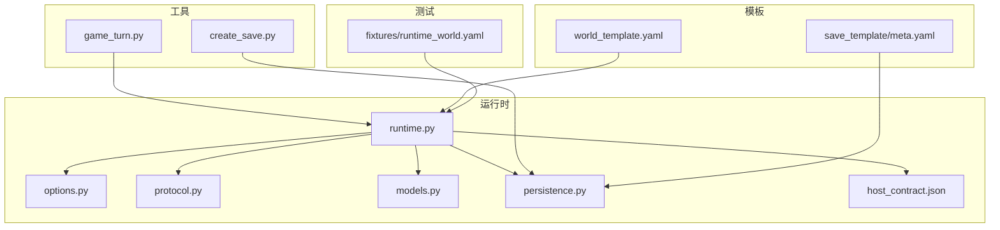
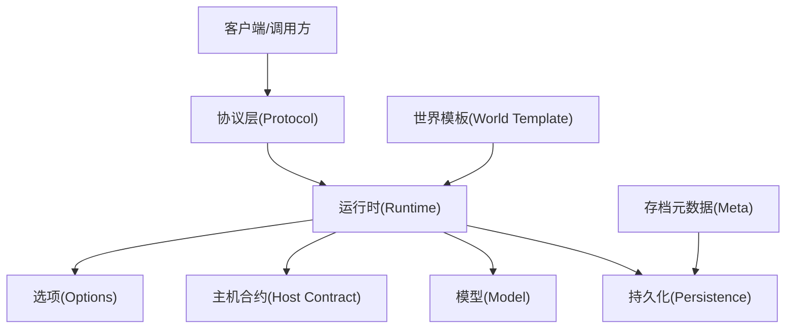

# 部署指南

<cite>
**本文引用的文件**   
- [engine_runtime/README.md](file://engine_runtime/README.md)
- [engine_runtime/host_contract.json](file://engine_runtime/host_contract.json)
- [engine_runtime/runtime.py](file://engine_runtime/runtime.py)
- [engine_runtime/options.py](file://engine_runtime/options.py)
- [engine_runtime/persistence.py](file://engine_runtime/persistence.py)
- [engine_runtime/models.py](file://engine_runtime/models.py)
- [engine_runtime/protocol.py](file://engine_runtime/protocol.py)
- [templates/world_template.yaml](file://templates/world_template.yaml)
- [templates/save_template/meta.yaml](file://templates/save_template/meta.yaml)
- [tools/game_turn.py](file://tools/game_turn.py)
- [tools/create_save.py](file://tools/create_save.py)
- [tests/fixtures/runtime_world.yaml](file://tests/fixtures/runtime_world.yaml)
</cite>

## 目录
1. [简介](#简介)
2. [项目结构](#项目结构)
3. [核心组件](#核心组件)
4. [架构总览](#架构总览)
5. [详细组件分析](#详细组件分析)
6. [依赖与配置](#依赖与配置)
7. [容器化部署](#容器化部署)
8. [云服务集成与负载均衡](#云服务集成与负载均衡)
9. [生产环境优化](#生产环境优化)
10. [安全配置](#安全配置)
11. [监控与告警](#监控与告警)
12. [备份恢复与灾难恢复](#备份恢复与灾难恢复)
13. [版本升级流程](#版本升级流程)
14. [性能调优与资源监控](#性能调优与资源监控)
15. [故障排查](#故障排查)
16. [自动化与CI/CD流水线](#自动化与cicd流水线)
17. [结论](#结论)

## 简介
本部署指南面向将 engine_runtime 作为“主机合约”驱动的游戏引擎进行生产化部署。内容覆盖环境要求、依赖安装、主机合约配置、容器化部署、云服务集成、负载均衡、生产优化、安全、监控告警、备份恢复、灾难恢复、版本升级、性能调优、资源监控、故障排查以及自动化与CI/CD流水线配置。读者无需深入源码即可按步骤完成从开发到生产的完整部署。

## 项目结构
仓库采用分层组织：
- engine_runtime：运行时核心，包含主机合约、协议、模型、持久化、选项与入口逻辑等。
- templates：世界模板与存档模板，用于初始化世界与保存状态。
- tools：命令行工具，提供回合控制、存档创建、回放等功能。
- tests：测试夹具与用例，包含示例世界配置。

图表来源
- [engine_runtime/runtime.py](file://engine_runtime/runtime.py)
- [engine_runtime/options.py](file://engine_runtime/options.py)
- [engine_runtime/protocol.py](file://engine_runtime/protocol.py)
- [engine_runtime/models.py](file://engine_runtime/models.py)
- [engine_runtime/persistence.py](file://engine_runtime/persistence.py)
- [engine_runtime/host_contract.json](file://engine_runtime/host_contract.json)
- [templates/world_template.yaml](file://templates/world_template.yaml)
- [templates/save_template/meta.yaml](file://templates/save_template/meta.yaml)
- [tools/game_turn.py](file://tools/game_turn.py)
- [tools/create_save.py](file://tools/create_save.py)
- [tests/fixtures/runtime_world.yaml](file://tests/fixtures/runtime_world.yaml)

章节来源
- [engine_runtime/README.md](file://engine_runtime/README.md)

## 核心组件
- 主机合约（Host Contract）：定义运行时的能力边界、输入输出契约与约束，是部署与集成的关键。
- 运行时（Runtime）：加载世界模板、解析选项、执行协议、管理生命周期。
- 选项（Options）：集中管理运行时配置项，如日志级别、超时、并发度等。
- 协议（Protocol）：定义对外接口与消息格式，便于服务化与网关集成。
- 模型（Models）：领域数据结构的定义与校验。
- 持久化（Persistence）：存档读写、快照与一致性策略。

章节来源
- [engine_runtime/host_contract.json](file://engine_runtime/host_contract.json)
- [engine_runtime/runtime.py](file://engine_runtime/runtime.py)
- [engine_runtime/options.py](file://engine_runtime/options.py)
- [engine_runtime/protocol.py](file://engine_runtime/protocol.py)
- [engine_runtime/models.py](file://engine_runtime/models.py)
- [engine_runtime/persistence.py](file://engine_runtime/persistence.py)

## 架构总览
运行时以“主机合约”为契约中心，通过协议暴露能力，使用选项进行行为控制，借助持久化实现状态管理，并以模板驱动世界初始化。

图表来源
- [engine_runtime/protocol.py](file://engine_runtime/protocol.py)
- [engine_runtime/runtime.py](file://engine_runtime/runtime.py)
- [engine_runtime/options.py](file://engine_runtime/options.py)
- [engine_runtime/host_contract.json](file://engine_runtime/host_contract.json)
- [engine_runtime/models.py](file://engine_runtime/models.py)
- [engine_runtime/persistence.py](file://engine_runtime/persistence.py)
- [templates/world_template.yaml](file://templates/world_template.yaml)
- [templates/save_template/meta.yaml](file://templates/save_template/meta.yaml)

## 详细组件分析

### 主机合约（Host Contract）
- 作用：声明运行时可提供的能力、参数约束、返回结构与错误码，确保跨进程/跨语言集成的一致性。
- 配置要点：
  - 明确输入字段类型与必填项。
  - 定义输出字段与枚举值。
  - 指定错误码与重试策略。
  - 设置超时与限流阈值。
- 部署建议：将 host_contract.json 纳入配置中心或镜像构建阶段，保证多环境一致。

章节来源
- [engine_runtime/host_contract.json](file://engine_runtime/host_contract.json)

### 运行时（Runtime）
- 职责：加载模板、解析选项、执行协议、协调持久化、维护会话与状态。
- 启动流程：读取配置 -> 初始化模型 -> 加载世界模板 -> 绑定协议 -> 进入事件循环。
- 扩展点：可通过协议层新增能力，通过选项调整行为，通过持久化替换存储后端。

章节来源
- [engine_runtime/runtime.py](file://engine_runtime/runtime.py)

### 选项（Options）
- 职责：集中管理运行时开关与参数，如日志级别、并发度、超时、缓存开关等。
- 最佳实践：区分默认值与环境变量覆盖；对敏感信息使用密钥管理服务注入。

章节来源
- [engine_runtime/options.py](file://engine_runtime/options.py)

### 协议（Protocol）
- 职责：定义请求/响应结构、序列化格式、鉴权与幂等性处理。
- 集成方式：可封装为HTTP/gRPC服务，配合API网关统一接入。

章节来源
- [engine_runtime/protocol.py](file://engine_runtime/protocol.py)

### 模型（Models）
- 职责：定义领域对象、校验规则与转换方法。
- 设计建议：保持不可变性与强类型，避免在运行时随意变更结构。

章节来源
- [engine_runtime/models.py](file://engine_runtime/models.py)

### 持久化（Persistence）
- 职责：存档读写、增量更新、快照与回滚、一致性保障。
- 存储选型：本地文件系统、对象存储或数据库，需满足幂等写入与事务语义。

章节来源
- [engine_runtime/persistence.py](file://engine_runtime/persistence.py)

## 依赖与配置
- 运行时依赖：Python 运行时及必要库（由工程依赖管理）。
- 配置文件：
  - 世界模板 world_template.yaml：定义初始世界结构与规则。
  - 存档元数据 meta.yaml：定义存档版本、兼容性与迁移策略。
- 环境变量：用于覆盖选项中的非敏感配置，如日志级别、超时、端口等。
- 密钥管理：敏感配置（如数据库凭据、签名密钥）应通过密钥管理服务注入。

章节来源
- [templates/world_template.yaml](file://templates/world_template.yaml)
- [templates/save_template/meta.yaml](file://templates/save_template/meta.yaml)
- [engine_runtime/options.py](file://engine_runtime/options.py)

## 容器化部署
- 基础镜像：选择轻量且稳定的 Python 镜像，固定版本号。
- 构建步骤：
  - 复制源代码与模板。
  - 安装依赖并验证健康检查端点。
  - 最小化镜像体积，移除调试符号。
- 运行参数：
  - 通过环境变量注入选项。
  - 挂载只读的世界模板与存档卷。
  - 限制CPU与内存资源。
- 健康检查：
  - 提供就绪探针（加载模板与合约成功）。
  - 提供存活探针（心跳或简单协议调用）。

章节来源
- [engine_runtime/runtime.py](file://engine_runtime/runtime.py)
- [engine_runtime/options.py](file://engine_runtime/options.py)
- [engine_runtime/host_contract.json](file://engine_runtime/host_contract.json)

## 云服务集成与负载均衡
- 服务编排：使用容器编排平台（如 Kubernetes）管理副本、滚动更新与自愈。
- 负载均衡：
  - 入站流量经网关/负载均衡器分发至多个运行时实例。
  - 基于会话粘性的场景需在协议层实现幂等与分布式锁。
- 服务发现：通过内部DNS或服务网格注册运行时实例。
- 扩缩容：根据QPS与延迟指标自动扩容，结合队列削峰填谷。

章节来源
- [engine_runtime/protocol.py](file://engine_runtime/protocol.py)
- [engine_runtime/runtime.py](file://engine_runtime/runtime.py)

## 生产环境优化
- 并发与线程池：根据CPU核数与I/O特性调整并发度，避免阻塞。
- 缓存策略：热点数据缓存，注意失效与一致性。
- I/O优化：批量写入、异步持久化、预分配与合并。
- 资源隔离：容器级CPU/Memory限制，避免相互影响。
- 日志与追踪：结构化日志、采样与链路追踪，降低开销。

章节来源
- [engine_runtime/options.py](file://engine_runtime/options.py)
- [engine_runtime/persistence.py](file://engine_runtime/persistence.py)

## 安全配置
- 传输加密：启用TLS，证书由密钥管理服务管理。
- 身份认证与授权：JWT/OAuth2，细粒度权限控制。
- 输入校验：严格遵循主机合约的字段校验与白名单。
- 最小权限：容器与进程以非root运行，仅开放必要端口。
- 审计与合规：记录关键操作与访问日志，满足审计要求。

章节来源
- [engine_runtime/protocol.py](file://engine_runtime/protocol.py)
- [engine_runtime/host_contract.json](file://engine_runtime/host_contract.json)

## 监控与告警
- 指标采集：QPS、延迟、错误率、资源使用率、持久化吞吐。
- 日志聚合：集中式日志收集与检索，关联请求ID。
- 告警策略：阈值告警、异常模式检测、容量预警。
- 可视化：仪表盘展示关键业务与系统指标。

章节来源
- [engine_runtime/runtime.py](file://engine_runtime/runtime.py)
- [engine_runtime/options.py](file://engine_runtime/options.py)

## 备份恢复与灾难恢复
- 备份策略：
  - 定期全量快照与增量归档。
  - 异地多副本与对象存储冗余。
- 恢复流程：
  - 按时间线回滚到最近一致点。
  - 应用元数据迁移与兼容性校验。
- 灾难恢复：
  - 多可用区部署与自动切换。
  - RTO/RPO目标与演练计划。

章节来源
- [engine_runtime/persistence.py](file://engine_runtime/persistence.py)
- [templates/save_template/meta.yaml](file://templates/save_template/meta.yaml)

## 版本升级流程
- 灰度发布：逐步放量，观察指标与错误率。
- 滚动更新：零停机升级，保持向后兼容。
- 数据迁移：在升级前执行元数据迁移脚本，失败回滚。
- 回滚策略：保留旧版本镜像与数据快照，快速回退。

章节来源
- [engine_runtime/runtime.py](file://engine_runtime/runtime.py)
- [engine_runtime/options.py](file://engine_runtime/options.py)

## 性能调优与资源监控
- 基准测试：压测关键路径，识别瓶颈。
- 参数调优：调整并发、超时、批大小与缓存命中率。
- 资源监控：CPU、内存、磁盘IO、网络带宽与连接数。
- 容量规划：根据峰值与增长趋势预留余量。

章节来源
- [engine_runtime/options.py](file://engine_runtime/options.py)
- [engine_runtime/persistence.py](file://engine_runtime/persistence.py)

## 故障排查
- 常见问题：
  - 模板加载失败：检查模板语法与路径权限。
  - 合约不匹配：核对输入输出字段与版本。
  - 持久化冲突：检查幂等键与锁机制。
- 诊断工具：
  - 启用详细日志与追踪。
  - 使用工具命令进行回放与验证。

章节来源
- [tools/game_turn.py](file://tools/game_turn.py)
- [tools/create_save.py](file://tools/create_save.py)
- [tests/fixtures/runtime_world.yaml](file://tests/fixtures/runtime_world.yaml)

## 自动化与CI/CD流水线
- 代码质量：静态检查、单元测试与覆盖率门禁。
- 构建与打包：镜像构建、依赖扫描与安全漏洞检查。
- 部署流水线：自动化测试、灰度发布与回滚。
- 配置管理：模板与合约纳入版本控制，变更审批与审计。

章节来源
- [engine_runtime/host_contract.json](file://engine_runtime/host_contract.json)
- [templates/world_template.yaml](file://templates/world_template.yaml)

## 结论
通过以主机契约为核心的运行时架构，结合严格的选项管理、协议抽象与持久化策略，可实现高可靠、可扩展的生产化部署。配合容器化、云服务与CI/CD，能够达成快速迭代、稳定运行与高效运维的目标。