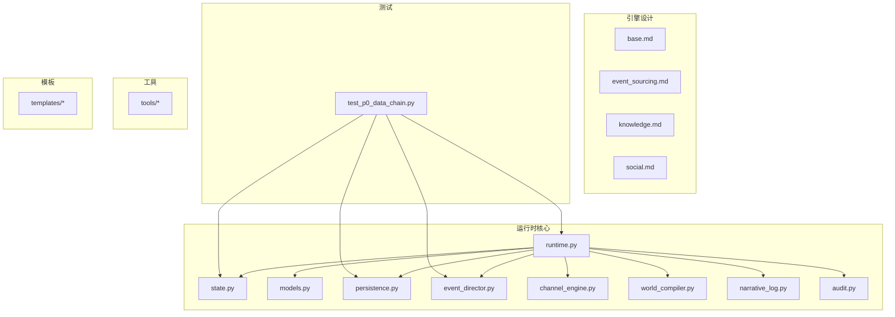
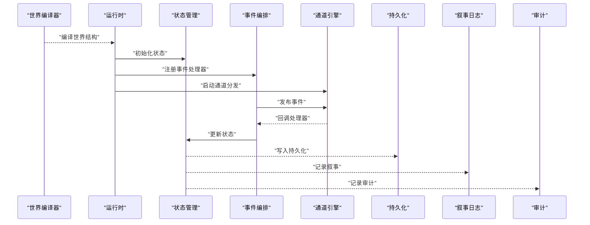
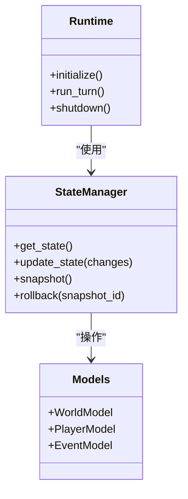
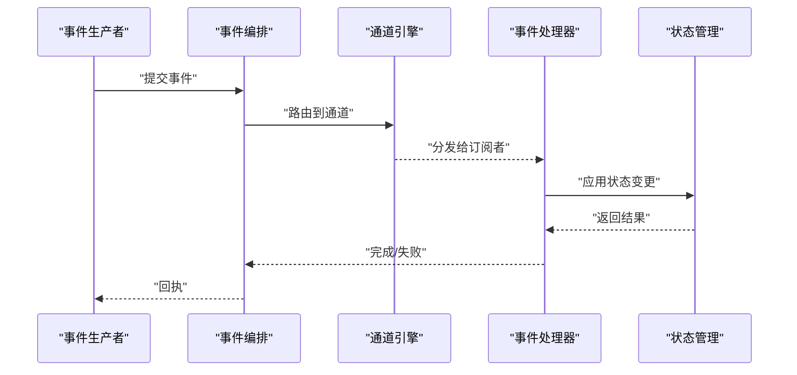
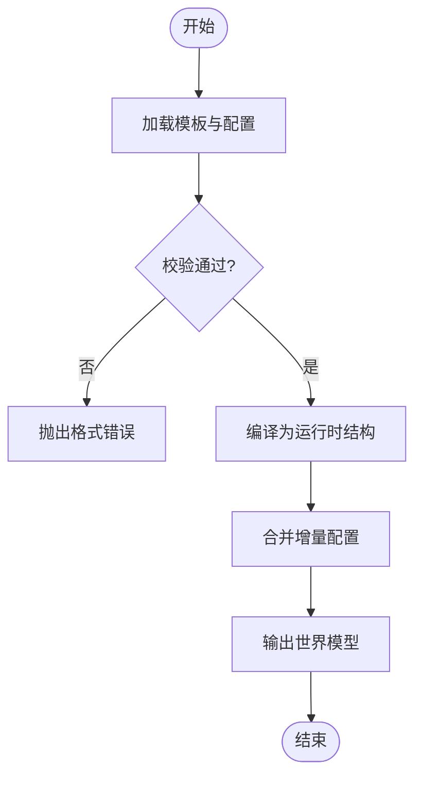
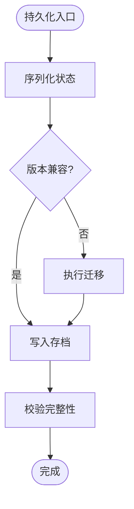
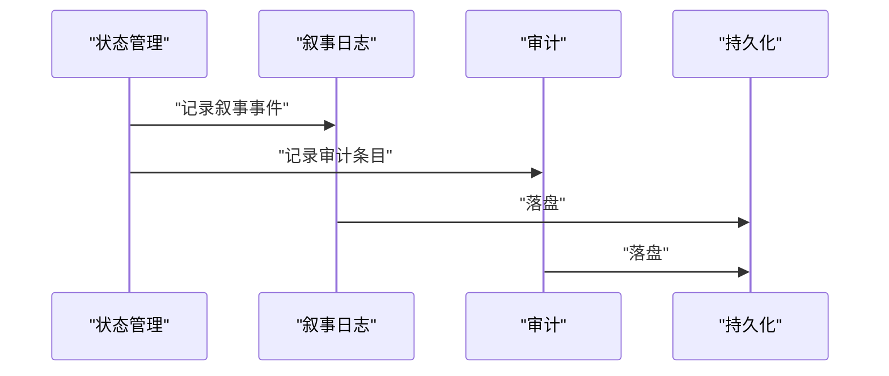
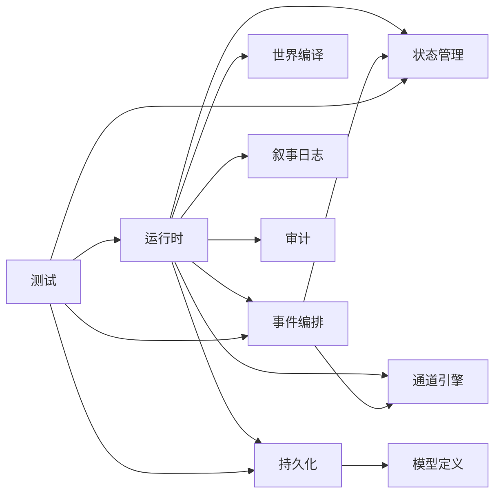

# P0机制重构完成文档

<cite>
**本文档引用的文件**   
- [P0_MECHANIC_REFACTORING_COMPLETE.md](file://temps/P0_MECHANIC_REFACTORING_COMPLETE.md)
- [test_p0_data_chain.py](file://tests/test_p0_data_chain.py)
- [runtime.py](file://engine_runtime/runtime.py)
- [state.py](file://engine_runtime/state.py)
- [models.py](file://engine_runtime/models.py)
- [persistence.py](file://engine_runtime/persistence.py)
- [event_director.py](file://engine_runtime/event_director.py)
- [channel_engine.py](file://engine_runtime/channel_engine.py)
- [world_compiler.py](file://engine_runtime/world_compiler.py)
- [narrative_log.py](file://engine_runtime/narrative_log.py)
- [audit.py](file://engine_runtime/audit.py)
- [base.md](file://engine/base.md)
- [event_sourcing.md](file://engine/event_sourcing.md)
- [knowledge.md](file://engine/knowledge.md)
- [social.md](file://engine/social.md)
</cite>

## 目录
1. [简介](#简介)
2. [项目结构](#项目结构)
3. [核心组件](#核心组件)
4. [架构总览](#架构总览)
5. [详细组件分析](#详细组件分析)
6. [依赖关系分析](#依赖关系分析)
7. [性能考量](#性能考量)
8. [故障排查指南](#故障排查指南)
9. [结论](#结论)
10. [附录](#附录)

## 简介
本文件为“P0机制重构”的完成文档，面向读者包括工程与非工程背景人员。内容涵盖：
- 重构目标与范围：围绕P0数据链、事件驱动、持久化与叙事日志等关键路径进行解耦与增强。
- 系统架构与数据流：从世界编译到运行时状态管理、事件编排、通道分发与审计落盘的端到端流程。
- 关键实现要点：数据结构设计、错误处理策略、扩展点与集成方式。
- 测试与验证：以自动化测试覆盖P0数据链路的关键断言。
- 排障建议：常见问题定位方法与修复思路。

## 项目结构
本项目采用分层与按职责划分相结合的组织方式：
- engine_runtime：运行时核心，包含状态机、事件编排、通道引擎、世界编译、持久化与审计等。
- engine：引擎设计与理念说明（事件溯源、知识、社交等）。
- tests：单元测试与集成测试，重点覆盖P0数据链与公共系统。
- tools：工具集，用于回放、校验、生成存档等。
- templates：存档模板与世界观模板，定义保存结构与默认配置。
- temps：临时脚本与重构完成记录。

图表来源
- [runtime.py](file://engine_runtime/runtime.py)
- [state.py](file://engine_runtime/state.py)
- [models.py](file://engine_runtime/models.py)
- [persistence.py](file://engine_runtime/persistence.py)
- [event_director.py](file://engine_runtime/event_director.py)
- [channel_engine.py](file://engine_runtime/channel_engine.py)
- [world_compiler.py](file://engine_runtime/world_compiler.py)
- [narrative_log.py](file://engine_runtime/narrative_log.py)
- [audit.py](file://engine_runtime/audit.py)
- [test_p0_data_chain.py](file://tests/test_p0_data_chain.py)

章节来源
- [P0_MECHANIC_REFACTORING_COMPLETE.md](file://temps/P0_MECHANIC_REFACTORING_COMPLETE.md)
- [base.md](file://engine/base.md)
- [event_sourcing.md](file://engine/event_sourcing.md)
- [knowledge.md](file://engine/knowledge.md)
- [social.md](file://engine/social.md)

## 核心组件
- 运行时入口与协调器：负责生命周期管理、模块装配、调度与对外接口。
- 状态管理：集中维护游戏世界状态，提供一致性读写与快照能力。
- 模型定义：领域对象与数据契约，确保跨模块数据结构一致。
- 事件编排：事件的生产、消费、顺序与重试策略。
- 通道引擎：基于通道的消息路由与订阅分发。
- 世界编译：将模板与配置编译为运行时可用结构。
- 持久化：状态序列化、存档加载与版本兼容。
- 叙事日志与审计：记录关键决策与事件轨迹，支持回放与可观测性。

章节来源
- [runtime.py](file://engine_runtime/runtime.py)
- [state.py](file://engine_runtime/state.py)
- [models.py](file://engine_runtime/models.py)
- [event_director.py](file://engine_runtime/event_director.py)
- [channel_engine.py](file://engine_runtime/channel_engine.py)
- [world_compiler.py](file://engine_runtime/world_compiler.py)
- [persistence.py](file://engine_runtime/persistence.py)
- [narrative_log.py](file://engine_runtime/narrative_log.py)
- [audit.py](file://engine_runtime/audit.py)

## 架构总览
下图展示P0机制重构后的核心数据与控制流：世界编译产出初始状态，运行时初始化并注册事件处理器；事件编排通过通道引擎分发至消费者；状态变更经持久化落盘，并由叙事日志与审计模块记录。

图表来源
- [world_compiler.py](file://engine_runtime/world_compiler.py)
- [runtime.py](file://engine_runtime/runtime.py)
- [state.py](file://engine_runtime/state.py)
- [event_director.py](file://engine_runtime/event_director.py)
- [channel_engine.py](file://engine_runtime/channel_engine.py)
- [persistence.py](file://engine_runtime/persistence.py)
- [narrative_log.py](file://engine_runtime/narrative_log.py)
- [audit.py](file://engine_runtime/audit.py)

## 详细组件分析

### 运行时与状态管理
- 运行时负责模块装配、生命周期管理与对外API暴露。
- 状态管理提供原子更新、快照与回滚能力，保证P0数据链的一致性。
- 模型定义约束字段类型与必填项，避免脏数据进入系统。

图表来源
- [runtime.py](file://engine_runtime/runtime.py)
- [state.py](file://engine_runtime/state.py)
- [models.py](file://engine_runtime/models.py)

章节来源
- [runtime.py](file://engine_runtime/runtime.py)
- [state.py](file://engine_runtime/state.py)
- [models.py](file://engine_runtime/models.py)

### 事件编排与通道分发
- 事件编排负责事件生命周期：生产、排序、重试、失败处理。
- 通道引擎实现订阅-发布模式，支持多消费者与优先级。
- 与状态管理协作，确保事件驱动的副作用正确落地。

图表来源
- [event_director.py](file://engine_runtime/event_director.py)
- [channel_engine.py](file://engine_runtime/channel_engine.py)
- [state.py](file://engine_runtime/state.py)

章节来源
- [event_director.py](file://engine_runtime/event_director.py)
- [channel_engine.py](file://engine_runtime/channel_engine.py)

### 世界编译与模板
- 世界编译器读取模板与配置，生成运行时可用的结构化数据。
- 支持版本迁移与兼容性检查，确保存档升级平滑。

图表来源
- [world_compiler.py](file://engine_runtime/world_compiler.py)

章节来源
- [world_compiler.py](file://engine_runtime/world_compiler.py)

### 持久化与存档
- 持久化模块负责状态序列化、存档加载与版本兼容。
- 支持增量保存与差异合并，减少IO开销。

图表来源
- [persistence.py](file://engine_runtime/persistence.py)

章节来源
- [persistence.py](file://engine_runtime/persistence.py)

### 叙事日志与审计
- 叙事日志记录关键剧情节点与玩家决策，便于回放与复盘。
- 审计模块记录状态变更轨迹，支持问题定位与合规审查。

图表来源
- [narrative_log.py](file://engine_runtime/narrative_log.py)
- [audit.py](file://engine_runtime/audit.py)
- [persistence.py](file://engine_runtime/persistence.py)

章节来源
- [narrative_log.py](file://engine_runtime/narrative_log.py)
- [audit.py](file://engine_runtime/audit.py)

### P0数据链测试
- 测试用例覆盖P0数据链的关键路径：状态初始化、事件处理、持久化落盘与回放一致性。
- 断言确保数据在多次运行后保持确定性。

章节来源
- [test_p0_data_chain.py](file://tests/test_p0_data_chain.py)

## 依赖关系分析
- 运行时依赖状态管理、事件编排、通道引擎、世界编译、持久化、叙事日志与审计。
- 事件编排依赖通道引擎与状态管理。
- 持久化依赖模型定义以确保序列化一致性。
- 测试依赖运行时与状态管理以验证端到端行为。

图表来源
- [runtime.py](file://engine_runtime/runtime.py)
- [state.py](file://engine_runtime/state.py)
- [event_director.py](file://engine_runtime/event_director.py)
- [channel_engine.py](file://engine_runtime/channel_engine.py)
- [world_compiler.py](file://engine_runtime/world_compiler.py)
- [persistence.py](file://engine_runtime/persistence.py)
- [narrative_log.py](file://engine_runtime/narrative_log.py)
- [audit.py](file://engine_runtime/audit.py)
- [models.py](file://engine_runtime/models.py)
- [test_p0_data_chain.py](file://tests/test_p0_data_chain.py)

章节来源
- [runtime.py](file://engine_runtime/runtime.py)
- [state.py](file://engine_runtime/state.py)
- [event_director.py](file://engine_runtime/event_director.py)
- [channel_engine.py](file://engine_runtime/channel_engine.py)
- [world_compiler.py](file://engine_runtime/world_compiler.py)
- [persistence.py](file://engine_runtime/persistence.py)
- [narrative_log.py](file://engine_runtime/narrative_log.py)
- [audit.py](file://engine_runtime/audit.py)
- [models.py](file://engine_runtime/models.py)
- [test_p0_data_chain.py](file://tests/test_p0_data_chain.py)

## 性能考量
- 事件批处理：合并高频小事件，降低通道分发与状态更新开销。
- 惰性加载：按需加载世界片段，减少内存占用。
- 增量持久化：仅保存差异部分，缩短存档时间。
- 缓存热点状态：对频繁读写的状态建立本地缓存，提升响应速度。
- 异步I/O：将持久化与日志落盘改为异步，避免阻塞主循环。

[本节为通用指导，不直接分析具体文件]

## 故障排查指南
- 事件丢失或重复：检查事件编排的重试与幂等策略，确认通道分发顺序。
- 状态不一致：核对快照与回滚逻辑，确保状态变更原子性。
- 存档损坏：校验持久化的完整性与版本迁移是否成功。
- 性能瓶颈：监控事件队列长度与通道消费速率，识别热点路径。
- 日志缺失：确认叙事日志与审计模块的落盘路径与权限。

章节来源
- [event_director.py](file://engine_runtime/event_director.py)
- [channel_engine.py](file://engine_runtime/channel_engine.py)
- [state.py](file://engine_runtime/state.py)
- [persistence.py](file://engine_runtime/persistence.py)
- [narrative_log.py](file://engine_runtime/narrative_log.py)
- [audit.py](file://engine_runtime/audit.py)

## 结论
本次P0机制重构围绕事件驱动与状态一致性展开，提升了系统的可扩展性与可观测性。通过清晰的模块边界与严格的模型契约，降低了耦合度并增强了稳定性。后续可在性能优化与异步化方面继续深化，进一步提升吞吐与响应能力。

[本节为总结性内容，不直接分析具体文件]

## 附录
- 设计理念参考：事件溯源、知识系统与社交机制的设计说明。
- 模板与存档结构：参考模板目录中的YAML定义，了解默认配置与字段含义。
- 工具使用：回放、校验与存档生成工具的用法与示例。

章节来源
- [base.md](file://engine/base.md)
- [event_sourcing.md](file://engine/event_sourcing.md)
- [knowledge.md](file://engine/knowledge.md)
- [social.md](file://engine/social.md)