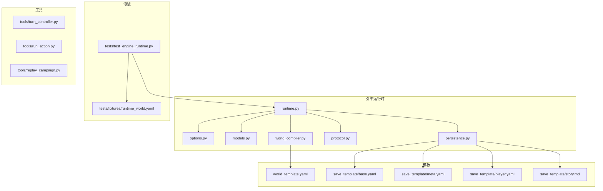
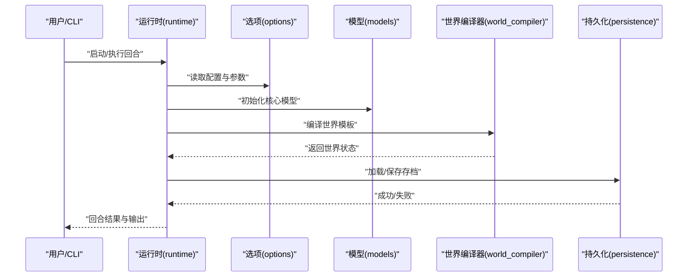
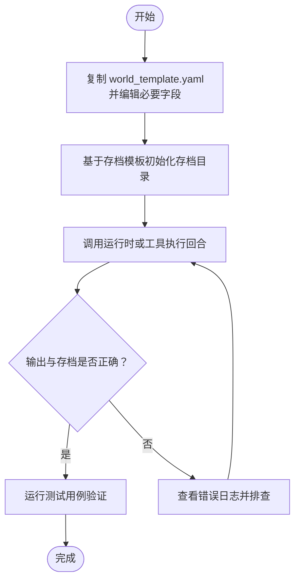
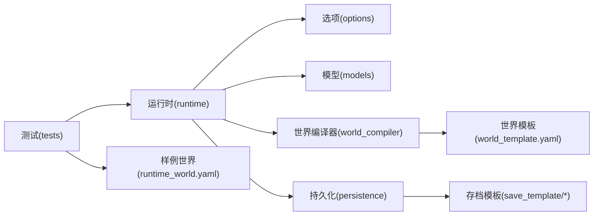

# 快速开始

<cite>
**本文引用的文件**   
- [README.md](file://engine_runtime/README.md)
- [runtime.py](file://engine_runtime/runtime.py)
- [options.py](file://engine_runtime/options.py)
- [models.py](file://engine_runtime/models.py)
- [world_template.yaml](file://templates/world_template.yaml)
- [base.yaml](file://templates/save_template/base.yaml)
- [meta.yaml](file://templates/save_template/meta.yaml)
- [player.yaml](file://templates/save_template/player.yaml)
- [story.md](file://templates/save_template/story.md)
- [test_engine_runtime.py](file://tests/test_engine_runtime.py)
- [runtime_world.yaml](file://tests/fixtures/runtime_world.yaml)
- [AGENTS.md](file://AGENTS.md)
</cite>

## 目录
1. [简介](#简介)
2. [项目结构](#项目结构)
3. [核心组件](#核心组件)
4. [架构总览](#架构总览)
5. [详细组件分析](#详细组件分析)
6. [依赖关系分析](#依赖关系分析)
7. [性能注意事项](#性能注意事项)
8. [故障排除指南](#故障排除指南)
9. [结论](#结论)
10. [附录](#附录)

## 简介
本快速开始指南帮助你在最短时间内完成 TheGreatNovel 的安装、环境准备与首次运行，并带你从零创建一个互动小说示例。内容涵盖：
- 环境与依赖要求
- 安装步骤
- 基本配置说明（世界模板与存档模板）
- 创建第一个互动小说的完整流程（从模板选择到运行测试）
- 常见问题与排错建议

目标是让新手在最少时间内跑通一个可运行的示例项目。

## 项目结构
TheGreatNovel 采用“引擎运行时 + 模板 + 工具 + 测试”的分层组织方式：
- engine_runtime：引擎运行时核心，包含模型、选项、协议、持久化、世界编译等
- templates：世界模板与存档模板，用于初始化游戏世界和保存状态
- tests：单元测试与样例数据，便于验证安装与运行
- tools：命令行工具，支持回合控制、审计、回放等
- AGENTS.md：项目级说明文档

图表来源
- [runtime.py](file://engine_runtime/runtime.py)
- [options.py](file://engine_runtime/options.py)
- [models.py](file://engine_runtime/models.py)
- [world_template.yaml](file://templates/world_template.yaml)
- [base.yaml](file://templates/save_template/base.yaml)
- [meta.yaml](file://templates/save_template/meta.yaml)
- [player.yaml](file://templates/save_template/player.yaml)
- [story.md](file://templates/save_template/story.md)
- [test_engine_runtime.py](file://tests/test_engine_runtime.py)
- [runtime_world.yaml](file://tests/fixtures/runtime_world.yaml)

章节来源
- [README.md](file://engine_runtime/README.md)
- [AGENTS.md](file://AGENTS.md)

## 核心组件
- 运行时入口与生命周期管理：负责加载配置、初始化世界、执行回合与事件处理
- 选项与配置：提供运行时参数与环境变量映射
- 数据模型：定义玩家、世界、事件、叙事日志等核心实体
- 世界编译器：将 YAML 世界模板编译为运行时可用的数据结构
- 持久化：读写存档模板，实现保存/恢复能力
- 协议与呈现：定义与宿主交互的接口及输出格式

章节来源
- [runtime.py](file://engine_runtime/runtime.py)
- [options.py](file://engine_runtime/options.py)
- [models.py](file://engine_runtime/models.py)
- [world_compiler.py](file://engine_runtime/world_compiler.py)
- [persistence.py](file://engine_runtime/persistence.py)
- [protocol.py](file://engine_runtime/protocol.py)

## 架构总览
下图展示了从用户调用到世界渲染的核心流程：用户通过 CLI 或 API 触发回合，运行时解析选项与模型，编译世界模板，更新状态并持久化存档。

图表来源
- [runtime.py](file://engine_runtime/runtime.py)
- [options.py](file://engine_runtime/options.py)
- [models.py](file://engine_runtime/models.py)
- [world_compiler.py](file://engine_runtime/world_compiler.py)
- [persistence.py](file://engine_runtime/persistence.py)

## 详细组件分析

### 安装与环境要求
- Python 版本：建议使用较新的稳定版（参考 README 中的最低版本要求）
- 依赖库：按 README 中 requirements 或包管理器声明安装
- 工作目录：建议在仓库根目录下操作，确保模板路径正确

安装步骤（循序渐进）
1. 克隆或下载项目源码到本地
2. 进入项目根目录
3. 使用包管理器安装依赖（如 pip install -r requirements.txt 或根据 README 指示）
4. 验证安装：运行测试用例以确认环境正确

章节来源
- [README.md](file://engine_runtime/README.md)

### 基本配置说明
- 世界模板 world_template.yaml：定义初始世界结构、区域、势力、物品等
- 存档模板 save_template/*：定义存档的文件结构与字段，包括基础信息、元数据、玩家、故事等

常用配置项
- 世界名称、语言、难度
- 初始玩家属性与背包
- 故事开场文本与关键事件

章节来源
- [world_template.yaml](file://templates/world_template.yaml)
- [base.yaml](file://templates/save_template/base.yaml)
- [meta.yaml](file://templates/save_template/meta.yaml)
- [player.yaml](file://templates/save_template/player.yaml)
- [story.md](file://templates/save_template/story.md)

### 创建第一个互动小说（从模板到运行）
步骤概览
1. 复制世界模板到项目目录，并根据需要修改
2. 使用存档模板初始化一个存档目录
3. 通过运行时或工具执行第一回合
4. 检查输出与存档文件是否生成
5. 运行测试用例验证集成

章节来源
- [test_engine_runtime.py](file://tests/test_engine_runtime.py)
- [runtime_world.yaml](file://tests/fixtures/runtime_world.yaml)

### 运行测试
- 使用测试套件验证引擎运行时与样例世界
- 若测试失败，优先检查 Python 版本、依赖安装、模板路径与权限

章节来源
- [test_engine_runtime.py](file://tests/test_engine_runtime.py)
- [runtime_world.yaml](file://tests/fixtures/runtime_world.yaml)

## 依赖关系分析
- 运行时依赖选项与模型，世界编译器依赖世界模板，持久化依赖存档模板
- 测试依赖样例世界与运行时接口
- 工具依赖运行时与持久化模块

图表来源
- [runtime.py](file://engine_runtime/runtime.py)
- [options.py](file://engine_runtime/options.py)
- [models.py](file://engine_runtime/models.py)
- [world_compiler.py](file://engine_runtime/world_compiler.py)
- [persistence.py](file://engine_runtime/persistence.py)
- [world_template.yaml](file://templates/world_template.yaml)
- [base.yaml](file://templates/save_template/base.yaml)
- [meta.yaml](file://templates/save_template/meta.yaml)
- [player.yaml](file://templates/save_template/player.yaml)
- [story.md](file://templates/save_template/story.md)
- [test_engine_runtime.py](file://tests/test_engine_runtime.py)
- [runtime_world.yaml](file://tests/fixtures/runtime_world.yaml)

章节来源
- [runtime.py](file://engine_runtime/runtime.py)
- [test_engine_runtime.py](file://tests/test_engine_runtime.py)

## 性能注意事项
- 世界编译与持久化 IO：避免频繁小文件写入，批量保存可减少 I/O 开销
- 内存占用：大型世界模板可能导致内存峰值上升，建议分块加载或按需编译
- 并发与锁：多回合并发时需关注状态一致性，必要时加锁或串行化处理
- 日志与审计：生产环境建议关闭冗余日志以提升吞吐

[本节为通用指导，不直接分析具体文件]

## 故障排除指南
常见问题与解决思路
- 依赖缺失或版本不兼容：检查 Python 版本与依赖列表，重新安装
- 模板路径错误：确认工作目录与模板相对路径一致
- 权限问题：确保对存档目录有读写权限
- 测试失败：查看测试输出与样例世界配置，定位差异

排查步骤
1. 运行最小化测试用例，确认运行时可用
2. 逐步替换模板与配置，缩小问题范围
3. 启用详细日志，观察关键节点输出
4. 对比样例世界与自定义世界的差异

章节来源
- [test_engine_runtime.py](file://tests/test_engine_runtime.py)
- [runtime_world.yaml](file://tests/fixtures/runtime_world.yaml)

## 结论
通过以上步骤，你已能在本地快速搭建 TheGreatNovel 的运行环境，并使用模板创建第一个互动小说示例。建议后续深入阅读引擎运行时与模板规范，逐步扩展世界内容与玩法机制。

[本节为总结性内容，不直接分析具体文件]

## 附录
- 项目说明与背景：参见 AGENTS.md
- 引擎运行时说明：参见 engine_runtime/README.md

章节来源
- [AGENTS.md](file://AGENTS.md)
- [README.md](file://engine_runtime/README.md)