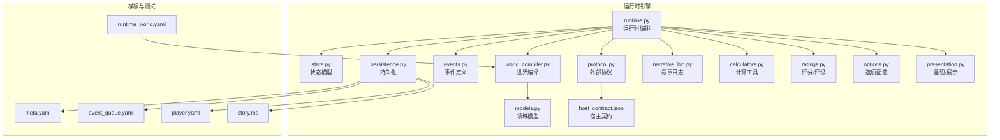
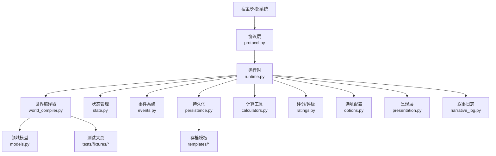
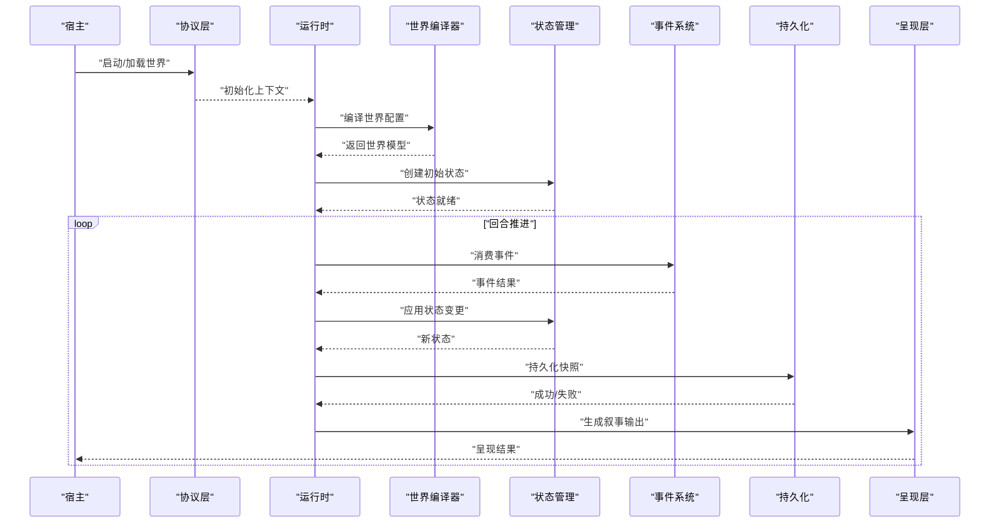
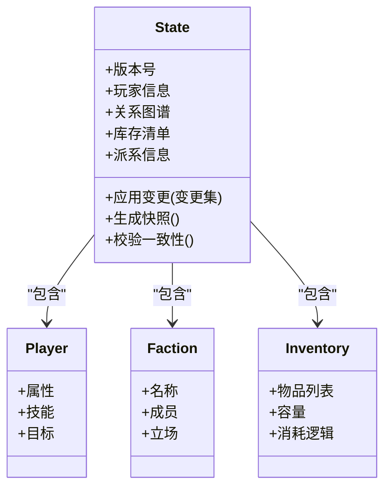
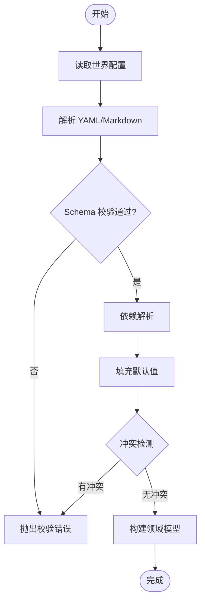
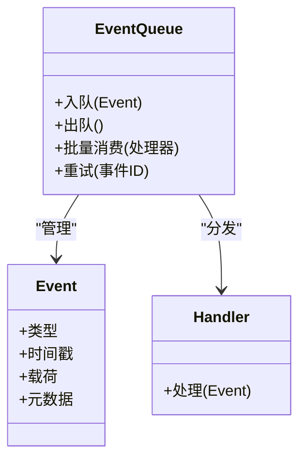
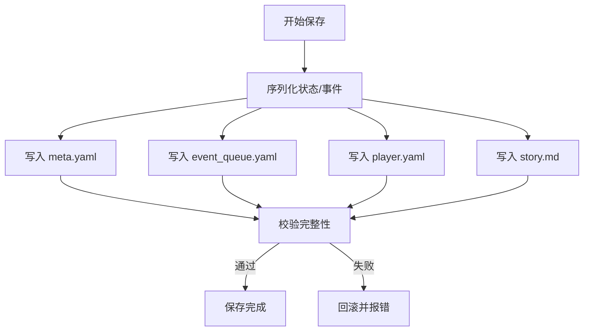
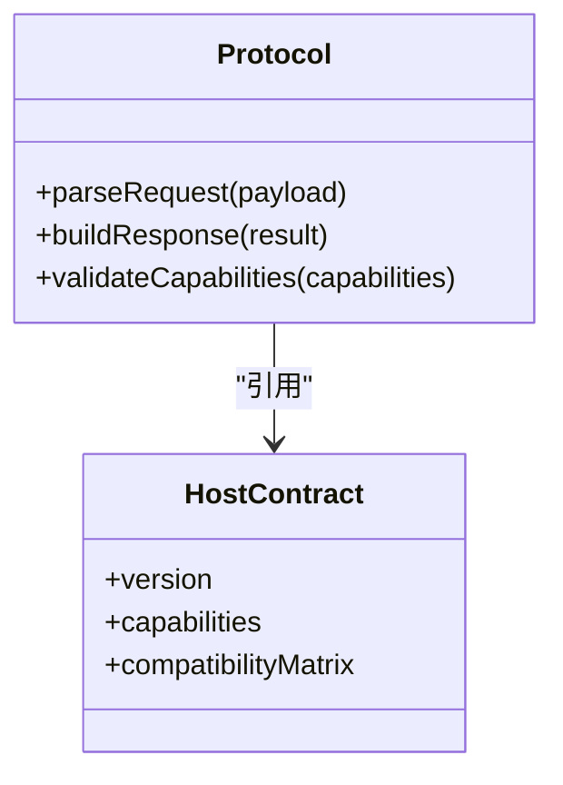
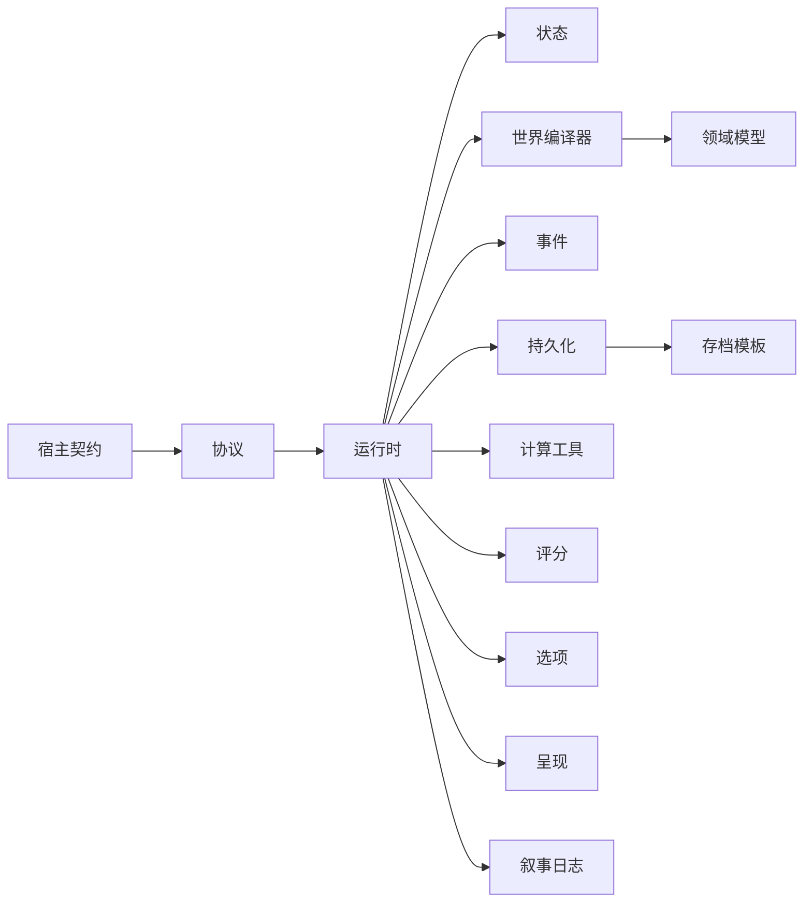

# 架构概览

<cite>
**本文引用的文件**   
- [engine_runtime/runtime.py](file://engine_runtime/runtime.py)
- [engine_runtime/state.py](file://engine_runtime/state.py)
- [engine_runtime/world_compiler.py](file://engine_runtime/world_compiler.py)
- [engine_runtime/events.py](file://engine_runtime/events.py)
- [engine_runtime/persistence.py](file://engine_runtime/persistence.py)
- [engine_runtime/models.py](file://engine_runtime/models.py)
- [engine_runtime/protocol.py](file://engine_runtime/protocol.py)
- [engine_runtime/host_contract.json](file://engine_runtime/host_contract.json)
- [engine_runtime/narrative_log.py](file://engine_runtime/narrative_log.py)
- [engine_runtime/calculators.py](file://engine_runtime/calculators.py)
- [engine_runtime/ratings.py](file://engine_runtime/ratings.py)
- [engine_runtime/options.py](file://engine_runtime/options.py)
- [engine_runtime/presentation.py](file://engine_runtime/presentation.py)
- [templates/save_template/meta.yaml](file://templates/save_template/meta.yaml)
- [templates/save_template/event_queue.yaml](file://templates/save_template/event_queue.yaml)
- [templates/save_template/player.yaml](file://templates/save_template/player.yaml)
- [templates/save_template/story.md](file://templates/save_template/story.md)
- [tests/fixtures/runtime_world.yaml](file://tests/fixtures/runtime_world.yaml)
</cite>

## 目录
1. [简介](#简介)
2. [项目结构](#项目结构)
3. [核心组件](#核心组件)
4. [架构总览](#架构总览)
5. [详细组件分析](#详细组件分析)
6. [依赖关系分析](#依赖关系分析)
7. [性能考量](#性能考量)
8. [故障排查指南](#故障排查指南)
9. [结论](#结论)
10. [附录：扩展与自定义指南](#附录扩展与自定义指南)

## 简介
本架构概览面向 TheGreatNovel 项目的运行时系统、状态管理与世界编译器，目标是帮助开发者快速理解高层设计、组件分层与数据流向。文档涵盖：
- 运行时系统的职责边界与控制流
- 状态管理模型与事件溯源机制
- 世界编译器的输入输出与校验流程
- 持久化与叙事日志的交互
- 对外协议与宿主契约
- 设计模式选择与技术权衡
- 扩展点与二次开发建议

## 项目结构
TheGreatNovel 的核心运行时代码集中在 engine_runtime 目录，配合 templates 中的保存模板与测试夹具，形成“运行时 + 配置/模板 + 测试”的分层组织方式。

图表来源
- [engine_runtime/runtime.py](file://engine_runtime/runtime.py)
- [engine_runtime/state.py](file://engine_runtime/state.py)
- [engine_runtime/world_compiler.py](file://engine_runtime/world_compiler.py)
- [engine_runtime/events.py](file://engine_runtime/events.py)
- [engine_runtime/persistence.py](file://engine_runtime/persistence.py)
- [engine_runtime/models.py](file://engine_runtime/models.py)
- [engine_runtime/protocol.py](file://engine_runtime/protocol.py)
- [engine_runtime/host_contract.json](file://engine_runtime/host_contract.json)
- [engine_runtime/narrative_log.py](file://engine_runtime/narrative_log.py)
- [engine_runtime/calculators.py](file://engine_runtime/calculators.py)
- [engine_runtime/ratings.py](file://engine_runtime/ratings.py)
- [engine_runtime/options.py](file://engine_runtime/options.py)
- [engine_runtime/presentation.py](file://engine_runtime/presentation.py)
- [templates/save_template/meta.yaml](file://templates/save_template/meta.yaml)
- [templates/save_template/event_queue.yaml](file://templates/save_template/event_queue.yaml)
- [templates/save_template/player.yaml](file://templates/save_template/player.yaml)
- [templates/save_template/story.md](file://templates/save_template/story.md)
- [tests/fixtures/runtime_world.yaml](file://tests/fixtures/runtime_world.yaml)

章节来源
- [engine_runtime/runtime.py](file://engine_runtime/runtime.py)
- [engine_runtime/state.py](file://engine_runtime/state.py)
- [engine_runtime/world_compiler.py](file://engine_runtime/world_compiler.py)
- [engine_runtime/persistence.py](file://engine_runtime/persistence.py)
- [engine_runtime/models.py](file://engine_runtime/models.py)
- [engine_runtime/protocol.py](file://engine_runtime/protocol.py)
- [engine_runtime/host_contract.json](file://engine_runtime/host_contract.json)
- [engine_runtime/narrative_log.py](file://engine_runtime/narrative_log.py)
- [engine_runtime/calculators.py](file://engine_runtime/calculators.py)
- [engine_runtime/ratings.py](file://engine_runtime/ratings.py)
- [engine_runtime/options.py](file://engine_runtime/options.py)
- [engine_runtime/presentation.py](file://engine_runtime/presentation.py)
- [templates/save_template/meta.yaml](file://templates/save_template/meta.yaml)
- [templates/save_template/event_queue.yaml](file://templates/save_template/event_queue.yaml)
- [templates/save_template/player.yaml](file://templates/save_template/player.yaml)
- [templates/save_template/story.md](file://templates/save_template/story.md)
- [tests/fixtures/runtime_world.yaml](file://tests/fixtures/runtime_world.yaml)

## 核心组件
- 运行时（Runtime）
  - 职责：协调世界编译、状态初始化、事件调度、回合推进、结果呈现与持久化。
  - 关键能力：生命周期管理、错误恢复、可观测性（日志/审计）。
- 状态管理（State）
  - 职责：维护游戏世界状态、玩家信息、关系、库存、派系等；提供快照与变更追踪。
  - 关键能力：不可变更新、版本化、一致性校验。
- 世界编译器（World Compiler）
  - 职责：将描述性世界配置（YAML/Markdown）编译为运行时可用模型；执行规则校验与默认值填充。
  - 关键能力：Schema 校验、依赖解析、冲突检测。
- 事件系统（Events）
  - 职责：定义事件类型、事件队列、事件处理管线；支持事件溯源与回放。
  - 关键能力：幂等处理、顺序保证、回滚策略。
- 持久化（Persistence）
  - 职责：读写存档（YAML/Markdown），序列化/反序列化状态与事件。
  - 关键能力：迁移兼容、增量写入、备份与校验。
- 领域模型（Models）
  - 职责：抽象世界实体（玩家、NPC、派系、物品等）及其行为。
  - 关键能力：数据验证、行为封装、可扩展字段。
- 协议与契约（Protocol & Host Contract）
  - 职责：定义与宿主/外部系统的接口规范（请求/响应格式、错误码、能力协商）。
  - 关键能力：版本兼容、向后兼容、能力探测。
- 辅助模块
  - 计算工具（Calculators）：数值运算、概率、伤害/收益评估等。
  - 评分/评级（Ratings）：角色/剧情质量评估、推荐排序。
  - 选项（Options）：运行时开关、难度、表现偏好。
  - 呈现（Presentation）：文本渲染、UI 适配、多语言。
  - 叙事日志（Narrative Log）：故事线记录、时间线回溯、审计。

章节来源
- [engine_runtime/runtime.py](file://engine_runtime/runtime.py)
- [engine_runtime/state.py](file://engine_runtime/state.py)
- [engine_runtime/world_compiler.py](file://engine_runtime/world_compiler.py)
- [engine_runtime/events.py](file://engine_runtime/events.py)
- [engine_runtime/persistence.py](file://engine_runtime/persistence.py)
- [engine_runtime/models.py](file://engine_runtime/models.py)
- [engine_runtime/protocol.py](file://engine_runtime/protocol.py)
- [engine_runtime/host_contract.json](file://engine_runtime/host_contract.json)
- [engine_runtime/calculators.py](file://engine_runtime/calculators.py)
- [engine_runtime/ratings.py](file://engine_runtime/ratings.py)
- [engine_runtime/options.py](file://engine_runtime/options.py)
- [engine_runtime/presentation.py](file://engine_runtime/presentation.py)
- [engine_runtime/narrative_log.py](file://engine_runtime/narrative_log.py)

## 架构总览
下图展示了运行时、状态、世界编译器、事件、持久化、协议与宿主之间的交互关系。

图表来源
- [engine_runtime/protocol.py](file://engine_runtime/protocol.py)
- [engine_runtime/runtime.py](file://engine_runtime/runtime.py)
- [engine_runtime/world_compiler.py](file://engine_runtime/world_compiler.py)
- [engine_runtime/state.py](file://engine_runtime/state.py)
- [engine_runtime/events.py](file://engine_runtime/events.py)
- [engine_runtime/persistence.py](file://engine_runtime/persistence.py)
- [engine_runtime/models.py](file://engine_runtime/models.py)
- [engine_runtime/calculators.py](file://engine_runtime/calculators.py)
- [engine_runtime/ratings.py](file://engine_runtime/ratings.py)
- [engine_runtime/options.py](file://engine_runtime/options.py)
- [engine_runtime/presentation.py](file://engine_runtime/presentation.py)
- [engine_runtime/narrative_log.py](file://engine_runtime/narrative_log.py)
- [templates/save_template/meta.yaml](file://templates/save_template/meta.yaml)
- [tests/fixtures/runtime_world.yaml](file://tests/fixtures/runtime_world.yaml)

## 详细组件分析

### 运行时（Runtime）
- 职责与流程
  - 启动阶段：加载选项、初始化状态、编译世界、建立事件队列。
  - 回合推进：消费事件、调用计算工具、更新状态、生成叙事片段。
  - 结束阶段：持久化存档、输出呈现、审计日志。
- 控制流要点
  - 通过协议层接收外部指令，进行参数校验与权限检查。
  - 使用事件驱动确保可追溯性与可回放性。
  - 在关键节点触发审计与日志记录，便于问题定位。

图表来源
- [engine_runtime/runtime.py](file://engine_runtime/runtime.py)
- [engine_runtime/world_compiler.py](file://engine_runtime/world_compiler.py)
- [engine_runtime/state.py](file://engine_runtime/state.py)
- [engine_runtime/events.py](file://engine_runtime/events.py)
- [engine_runtime/persistence.py](file://engine_runtime/persistence.py)
- [engine_runtime/presentation.py](file://engine_runtime/presentation.py)

章节来源
- [engine_runtime/runtime.py](file://engine_runtime/runtime.py)

### 状态管理（State）
- 数据结构与复杂度
  - 采用不可变更新模式，避免并发竞争与副作用扩散。
  - 状态快照用于回滚与审计，空间复杂度随快照数量线性增长。
- 一致性保障
  - 变更前校验、变更后一致性断言。
  - 版本号与哈希校验防止篡改与不一致。

图表来源
- [engine_runtime/state.py](file://engine_runtime/state.py)
- [engine_runtime/models.py](file://engine_runtime/models.py)

章节来源
- [engine_runtime/state.py](file://engine_runtime/state.py)
- [engine_runtime/models.py](file://engine_runtime/models.py)

### 世界编译器（World Compiler）
- 输入与输出
  - 输入：世界描述文件（YAML/Markdown）、测试夹具。
  - 输出：运行时可用的领域模型与规则表。
- 编译流程
  - 读取并解析配置 -> Schema 校验 -> 依赖解析 -> 默认值填充 -> 冲突检测 -> 生成模型。

图表来源
- [engine_runtime/world_compiler.py](file://engine_runtime/world_compiler.py)
- [tests/fixtures/runtime_world.yaml](file://tests/fixtures/runtime_world.yaml)

章节来源
- [engine_runtime/world_compiler.py](file://engine_runtime/world_compiler.py)
- [tests/fixtures/runtime_world.yaml](file://tests/fixtures/runtime_world.yaml)

### 事件系统（Events）
- 事件类型与队列
  - 定义事件结构、优先级、顺序约束。
  - 队列支持批量消费、重试与死信处理。
- 溯源与回放
  - 事件不可变追加，支持按时间线回放与重放。

图表来源
- [engine_runtime/events.py](file://engine_runtime/events.py)

章节来源
- [engine_runtime/events.py](file://engine_runtime/events.py)

### 持久化（Persistence）
- 存档结构
  - meta.yaml：元数据（版本、作者、时间戳）。
  - event_queue.yaml：事件队列快照。
  - player.yaml：玩家状态。
  - story.md：叙事文本。
- 读写策略
  - 增量写入、原子替换、校验和验证。

图表来源
- [engine_runtime/persistence.py](file://engine_runtime/persistence.py)
- [templates/save_template/meta.yaml](file://templates/save_template/meta.yaml)
- [templates/save_template/event_queue.yaml](file://templates/save_template/event_queue.yaml)
- [templates/save_template/player.yaml](file://templates/save_template/player.yaml)
- [templates/save_template/story.md](file://templates/save_template/story.md)

章节来源
- [engine_runtime/persistence.py](file://engine_runtime/persistence.py)
- [templates/save_template/meta.yaml](file://templates/save_template/meta.yaml)
- [templates/save_template/event_queue.yaml](file://templates/save_template/event_queue.yaml)
- [templates/save_template/player.yaml](file://templates/save_template/player.yaml)
- [templates/save_template/story.md](file://templates/save_template/story.md)

### 协议与宿主契约（Protocol & Host Contract）
- 协议层
  - 定义请求/响应结构、错误码、能力协商。
- 宿主契约
  - JSON 描述宿主与引擎的能力边界与兼容性矩阵。

图表来源
- [engine_runtime/protocol.py](file://engine_runtime/protocol.py)
- [engine_runtime/host_contract.json](file://engine_runtime/host_contract.json)

章节来源
- [engine_runtime/protocol.py](file://engine_runtime/protocol.py)
- [engine_runtime/host_contract.json](file://engine_runtime/host_contract.json)

### 辅助模块（Calculators, Ratings, Options, Presentation, Narrative Log）
- 计算工具：数值计算、概率分布、伤害/收益评估。
- 评分/评级：内容质量评估、推荐排序。
- 选项：运行时开关、难度、表现偏好。
- 呈现：文本渲染、UI 适配、多语言。
- 叙事日志：故事线记录、时间线回溯、审计。

章节来源
- [engine_runtime/calculators.py](file://engine_runtime/calculators.py)
- [engine_runtime/ratings.py](file://engine_runtime/ratings.py)
- [engine_runtime/options.py](file://engine_runtime/options.py)
- [engine_runtime/presentation.py](file://engine_runtime/presentation.py)
- [engine_runtime/narrative_log.py](file://engine_runtime/narrative_log.py)

## 依赖关系分析
- 耦合与内聚
  - 运行时高内聚：集中编排各子系统，降低外部耦合。
  - 世界编译器与领域模型强相关：模型变更需同步编译器规则。
  - 事件系统与持久化解耦：通过快照与增量写入降低写放大。
- 外部依赖
  - 协议层与宿主契约决定集成边界，需保持向后兼容。
- 潜在循环依赖
  - 通过接口与消息传递避免直接循环导入。

图表来源
- [engine_runtime/runtime.py](file://engine_runtime/runtime.py)
- [engine_runtime/state.py](file://engine_runtime/state.py)
- [engine_runtime/world_compiler.py](file://engine_runtime/world_compiler.py)
- [engine_runtime/events.py](file://engine_runtime/events.py)
- [engine_runtime/persistence.py](file://engine_runtime/persistence.py)
- [engine_runtime/models.py](file://engine_runtime/models.py)
- [engine_runtime/calculators.py](file://engine_runtime/calculators.py)
- [engine_runtime/ratings.py](file://engine_runtime/ratings.py)
- [engine_runtime/options.py](file://engine_runtime/options.py)
- [engine_runtime/presentation.py](file://engine_runtime/presentation.py)
- [engine_runtime/narrative_log.py](file://engine_runtime/narrative_log.py)
- [engine_runtime/protocol.py](file://engine_runtime/protocol.py)
- [engine_runtime/host_contract.json](file://engine_runtime/host_contract.json)
- [templates/save_template/meta.yaml](file://templates/save_template/meta.yaml)

章节来源
- [engine_runtime/runtime.py](file://engine_runtime/runtime.py)
- [engine_runtime/protocol.py](file://engine_runtime/protocol.py)
- [engine_runtime/host_contract.json](file://engine_runtime/host_contract.json)

## 性能考量
- 事件批处理：批量消费与合并减少 I/O 与锁竞争。
- 状态快照策略：按需快照与压缩存储，平衡回滚需求与内存占用。
- 世界编译缓存：对静态配置启用缓存，避免重复解析。
- 计算优化：预计算热点路径、惰性求值与并行化。
- 持久化优化：增量写入、事务提交与校验并行化。

[本节为通用指导，不直接分析具体文件]

## 故障排查指南
- 常见问题定位
  - 世界编译失败：检查 Schema 校验与依赖解析日志。
  - 事件丢失或乱序：确认事件队列顺序约束与重试策略。
  - 存档损坏：校验元数据与完整性校验和。
  - 协议不兼容：核对宿主契约版本与能力矩阵。
- 调试建议
  - 开启详细日志与审计，捕获关键节点状态。
  - 使用测试夹具复现问题，逐步缩小范围。
  - 利用叙事日志与事件回放定位时序问题。

章节来源
- [engine_runtime/world_compiler.py](file://engine_runtime/world_compiler.py)
- [engine_runtime/events.py](file://engine_runtime/events.py)
- [engine_runtime/persistence.py](file://engine_runtime/persistence.py)
- [engine_runtime/protocol.py](file://engine_runtime/protocol.py)
- [engine_runtime/host_contract.json](file://engine_runtime/host_contract.json)
- [engine_runtime/narrative_log.py](file://engine_runtime/narrative_log.py)
- [tests/fixtures/runtime_world.yaml](file://tests/fixtures/runtime_world.yaml)

## 结论
TheGreatNovel 的运行时以事件驱动为核心，结合不可变状态与世界编译器，实现了高内聚、低耦合的可扩展架构。通过协议与宿主契约明确集成边界，借助持久化与叙事日志保障可追溯性。该设计在可维护性、可测试性与可扩展性之间取得良好平衡，适合复杂叙事与策略混合的游戏场景。

[本节为总结性内容，不直接分析具体文件]

## 附录：扩展与自定义指南
- 新增事件类型
  - 在事件系统中定义新事件结构与处理器，确保幂等与顺序。
  - 在运行时注册处理器并纳入事件队列。
- 扩展状态模型
  - 在领域模型中增加字段或实体，并在状态管理中实现变更应用与校验。
  - 更新世界编译器规则以支持新字段的默认值与约束。
- 自定义计算与评分
  - 在计算工具与评分模块中实现新算法，并通过运行时注入。
- 呈现与多语言
  - 在呈现层扩展渲染器与本地化资源，保持与叙事日志一致。
- 持久化迁移
  - 在持久化模块中实现版本迁移脚本，确保存档兼容。
- 协议扩展
  - 在协议层定义新的请求/响应结构，更新宿主契约以保持兼容。

章节来源
- [engine_runtime/events.py](file://engine_runtime/events.py)
- [engine_runtime/state.py](file://engine_runtime/state.py)
- [engine_runtime/models.py](file://engine_runtime/models.py)
- [engine_runtime/world_compiler.py](file://engine_runtime/world_compiler.py)
- [engine_runtime/calculators.py](file://engine_runtime/calculators.py)
- [engine_runtime/ratings.py](file://engine_runtime/ratings.py)
- [engine_runtime/presentation.py](file://engine_runtime/presentation.py)
- [engine_runtime/persistence.py](file://engine_runtime/persistence.py)
- [engine_runtime/protocol.py](file://engine_runtime/protocol.py)
- [engine_runtime/host_contract.json](file://engine_runtime/host_contract.json)