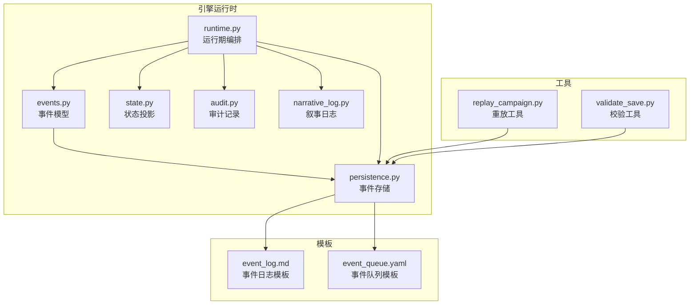
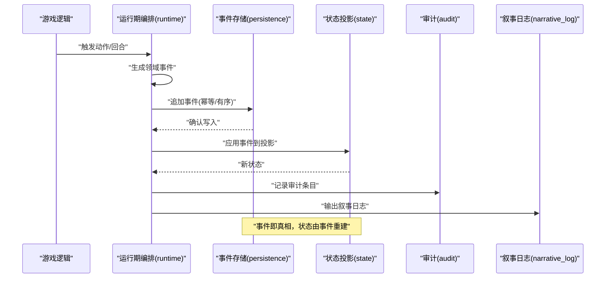
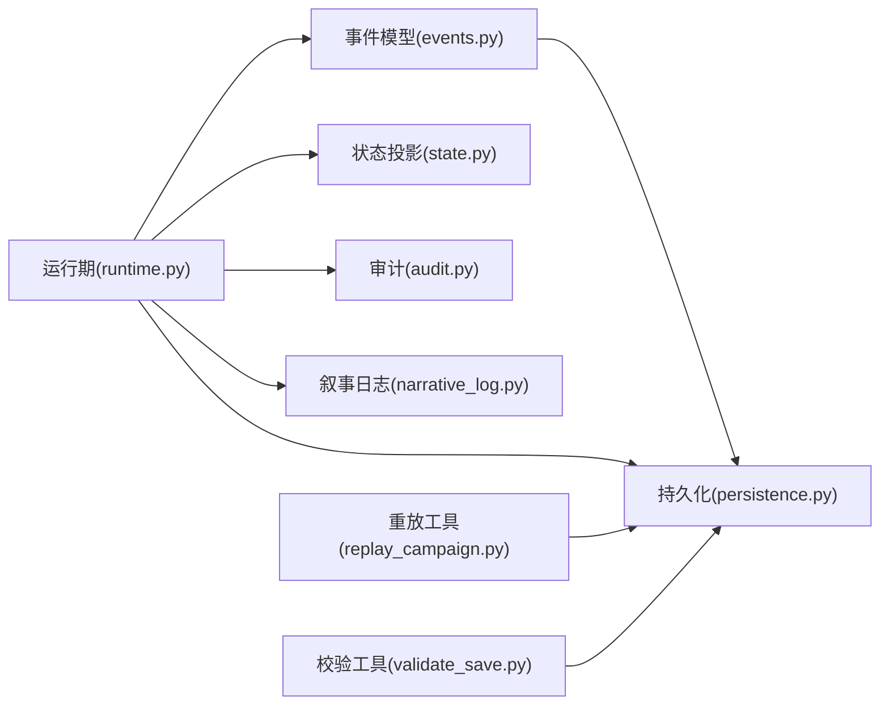

# 事件溯源机制

<cite>
**本文引用的文件**   
- [engine/event_sourcing.md](file://engine/event_sourcing.md)
- [engine_runtime/events.py](file://engine_runtime/events.py)
- [engine_runtime/persistence.py](file://engine_runtime/persistence.py)
- [engine_runtime/runtime.py](file://engine_runtime/runtime.py)
- [engine_runtime/state.py](file://engine_runtime/state.py)
- [engine_runtime/audit.py](file://engine_runtime/audit.py)
- [engine_runtime/narrative_log.py](file://engine_runtime/narrative_log.py)
- [templates/save_template/event_log.md](file://templates/save_template/event_log.md)
- [templates/save_template/event_queue.yaml](file://templates/save_template/event_queue.yaml)
- [tools/replay_campaign.py](file://tools/replay_campaign.py)
- [tools/validate_save.py](file://tools/validate_save.py)
</cite>

## 目录
1. [简介](#简介)
2. [项目结构](#项目结构)
3. [核心组件](#核心组件)
4. [架构总览](#架构总览)
5. [详细组件分析](#详细组件分析)
6. [依赖关系分析](#依赖关系分析)
7. [性能考虑](#性能考虑)
8. [故障排查指南](#故障排查指南)
9. [结论](#结论)
10. [附录](#附录)

## 简介
本文件为 TheGreatNovel 项目的“事件溯源（Event Sourcing）”机制提供系统化文档。内容涵盖：
- 事件溯源的核心概念与设计原理
- 事件类型定义、生命周期管理、存储策略与重放机制
- 事件序列化格式规范、版本控制与向后兼容性
- 代码级示例路径，展示如何创建、存储与重放事件
- 事件溯源在游戏状态恢复、调试分析与审计中的价值
- 性能优化建议与最佳实践

## 项目结构
TheGreatNovel 的事件溯源相关能力分布在引擎运行时与模板中：
- 引擎运行时负责事件模型、持久化、重放与审计
- 模板定义了保存快照的默认结构与事件日志格式
- 工具集提供重放与校验等实用功能

图表来源
- [engine_runtime/events.py](file://engine_runtime/events.py)
- [engine_runtime/persistence.py](file://engine_runtime/persistence.py)
- [engine_runtime/runtime.py](file://engine_runtime/runtime.py)
- [engine_runtime/state.py](file://engine_runtime/state.py)
- [engine_runtime/audit.py](file://engine_runtime/audit.py)
- [engine_runtime/narrative_log.py](file://engine_runtime/narrative_log.py)
- [templates/save_template/event_log.md](file://templates/save_template/event_log.md)
- [templates/save_template/event_queue.yaml](file://templates/save_template/event_queue.yaml)
- [tools/replay_campaign.py](file://tools/replay_campaign.py)
- [tools/validate_save.py](file://tools/validate_save.py)

章节来源
- [engine/event_sourcing.md](file://engine/event_sourcing.md)

## 核心组件
- 事件模型与类型：集中定义事件的结构、字段与约束，确保事件不可变与可序列化
- 事件存储：将事件追加到持久化存储，保证顺序性与幂等性
- 运行期编排：在回合或动作执行过程中产生事件、落盘并更新投影
- 状态投影：从事件流重建当前游戏状态，支持断点续玩与一致性校验
- 审计与日志：记录关键操作与事件轨迹，便于回溯与合规
- 重放工具：基于事件流重放历史，用于调试、测试与回放

章节来源
- [engine_runtime/events.py](file://engine_runtime/events.py)
- [engine_runtime/persistence.py](file://engine_runtime/persistence.py)
- [engine_runtime/runtime.py](file://engine_runtime/runtime.py)
- [engine_runtime/state.py](file://engine_runtime/state.py)
- [engine_runtime/audit.py](file://engine_runtime/audit.py)
- [engine_runtime/narrative_log.py](file://engine_runtime/narrative_log.py)

## 架构总览
事件溯源的整体流程如下：
- 业务逻辑生成领域事件
- 运行期编排器将事件写入事件存储
- 投影器消费事件流，重建状态
- 审计模块记录关键轨迹
- 重放工具从事件流恢复状态以进行调试与分析

图表来源
- [engine_runtime/runtime.py](file://engine_runtime/runtime.py)
- [engine_runtime/persistence.py](file://engine_runtime/persistence.py)
- [engine_runtime/state.py](file://engine_runtime/state.py)
- [engine_runtime/audit.py](file://engine_runtime/audit.py)
- [engine_runtime/narrative_log.py](file://engine_runtime/narrative_log.py)

## 详细组件分析

### 事件模型与类型
- 设计要点
  - 事件不可变：事件一旦创建不应修改
  - 强类型：通过统一基类/接口约束事件结构
  - 可序列化：JSON/YAML 友好，便于跨进程/跨语言处理
  - 版本化：包含版本号，支持演进与兼容
- 关键字段建议
  - 事件ID、时间戳、版本、类型标识、载荷数据、关联上下文
- 扩展性
  - 新增事件类型需保持旧事件可读
  - 载荷字段增量添加，避免破坏性变更

章节来源
- [engine_runtime/events.py](file://engine_runtime/events.py)

### 事件存储策略
- 存储目标
  - 追加式事件日志，保证顺序与完整性
  - 支持按会话/世界/玩家维度隔离
- 写入语义
  - 幂等写入：重复写入不改变结果
  - 事务边界：一个业务单元产生的多个事件原子提交
- 读取语义
  - 按时间顺序读取，支持分页与游标
  - 支持按类型过滤与范围查询

章节来源
- [engine_runtime/persistence.py](file://engine_runtime/persistence.py)
- [templates/save_template/event_log.md](file://templates/save_template/event_log.md)
- [templates/save_template/event_queue.yaml](file://templates/save_template/event_queue.yaml)

### 运行期编排与事件生命周期
- 生命周期阶段
  - 产生：业务逻辑决定何时产生事件
  - 验证：校验事件载荷与前置条件
  - 持久化：写入事件存储
  - 投影：应用到状态投影
  - 审计：记录审计条目与叙事日志
- 错误处理
  - 写入失败回滚投影
  - 重试与死信队列（可选）

章节来源
- [engine_runtime/runtime.py](file://engine_runtime/runtime.py)
- [engine_runtime/audit.py](file://engine_runtime/audit.py)
- [engine_runtime/narrative_log.py](file://engine_runtime/narrative_log.py)

### 状态投影与事件重放
- 投影原则
  - 纯函数：相同事件序列必得到相同状态
  - 幂等：重复应用同一事件不改变结果
- 重放机制
  - 全量重放：从头构建状态
  - 增量重放：从检查点继续
- 一致性校验
  - 校验哈希/签名，防止篡改
  - 对比快照与重放结果

章节来源
- [engine_runtime/state.py](file://engine_runtime/state.py)
- [tools/replay_campaign.py](file://tools/replay_campaign.py)
- [tools/validate_save.py](file://tools/validate_save.py)

### 事件序列化与版本控制
- 序列化格式
  - 推荐 JSON/YAML，便于人类可读与工具链集成
  - 固定字段顺序，减少差异
- 版本控制
  - 事件类型版本字段
  - 载荷字段迁移规则
- 向后兼容
  - 新增字段默认值
  - 弃用字段保留但忽略

章节来源
- [engine_runtime/events.py](file://engine_runtime/events.py)
- [engine_runtime/persistence.py](file://engine_runtime/persistence.py)

### 审计与叙事日志
- 审计
  - 记录关键决策、事件批次、用户/系统行为
  - 支持导出与报表
- 叙事日志
  - 面向玩家的文本化叙述
  - 与事件一一对应，便于对照

章节来源
- [engine_runtime/audit.py](file://engine_runtime/audit.py)
- [engine_runtime/narrative_log.py](file://engine_runtime/narrative_log.py)

### 代码示例路径（创建、存储与重放）
- 创建事件
  - 参考事件模型定义与构造方式
  - 参考运行期编排中事件生成位置
- 存储事件
  - 参考持久化模块的写入接口
  - 参考模板中的事件日志与队列结构
- 重放事件
  - 参考重放工具的调用入口
  - 参考状态投影的应用逻辑

章节来源
- [engine_runtime/events.py](file://engine_runtime/events.py)
- [engine_runtime/runtime.py](file://engine_runtime/runtime.py)
- [engine_runtime/persistence.py](file://engine_runtime/persistence.py)
- [engine_runtime/state.py](file://engine_runtime/state.py)
- [tools/replay_campaign.py](file://tools/replay_campaign.py)
- [templates/save_template/event_log.md](file://templates/save_template/event_log.md)
- [templates/save_template/event_queue.yaml](file://templates/save_template/event_queue.yaml)

## 依赖关系分析
- 低耦合高内聚
  - 事件模型独立于存储实现
  - 运行期编排仅依赖抽象接口
- 外部依赖
  - 文件系统/对象存储作为事件日志后端
  - 可选的消息队列用于异步消费（未来扩展）

图表来源
- [engine_runtime/events.py](file://engine_runtime/events.py)
- [engine_runtime/persistence.py](file://engine_runtime/persistence.py)
- [engine_runtime/runtime.py](file://engine_runtime/runtime.py)
- [engine_runtime/state.py](file://engine_runtime/state.py)
- [engine_runtime/audit.py](file://engine_runtime/audit.py)
- [engine_runtime/narrative_log.py](file://engine_runtime/narrative_log.py)
- [tools/replay_campaign.py](file://tools/replay_campaign.py)
- [tools/validate_save.py](file://tools/validate_save.py)

## 性能考虑
- 批量写入
  - 合并小事件为批，降低IO开销
- 索引与分区
  - 按时间或实体ID分区，提升查询效率
- 压缩与归档
  - 冷数据压缩，热数据保留内存缓存
- 投影计算
  - 懒加载与增量更新，避免全量重建
- 并发控制
  - 写串行化，读无锁；必要时使用乐观锁

[本节为通用指导，无需特定文件引用]

## 故障排查指南
- 常见问题
  - 事件丢失或乱序：检查写入幂等与顺序约束
  - 投影不一致：核对事件版本与载荷迁移
  - 重放失败：定位首个异常事件，检查字段缺失或类型变更
- 诊断手段
  - 启用详细审计与叙事日志
  - 使用校验工具比对快照与重放结果
  - 分段重放缩小问题范围

章节来源
- [engine_runtime/audit.py](file://engine_runtime/audit.py)
- [engine_runtime/narrative_log.py](file://engine_runtime/narrative_log.py)
- [tools/validate_save.py](file://tools/validate_save.py)

## 结论
事件溯源为 TheGreatNovel 提供了强大的可追溯性与可重现性基础。通过明确的事件模型、可靠的存储策略与稳健的重放机制，系统能够支持状态恢复、调试分析与审计合规。遵循本文的最佳实践与性能建议，可在保证一致性的同时获得良好的可扩展性与维护性。

## 附录
- 术语表
  - 事件：对系统中已发生事实的不可变记录
  - 投影：从事件流派生的状态视图
  - 重放：基于事件流重建状态的过程
  - 审计：记录关键操作与事件轨迹以供审查
- 参考模板
  - 事件日志模板：用于人类可读的事件记录
  - 事件队列模板：用于结构化存储与传输

[本节为概念性说明，无需特定文件引用]