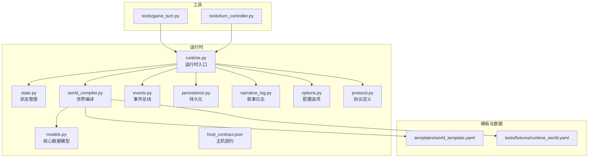
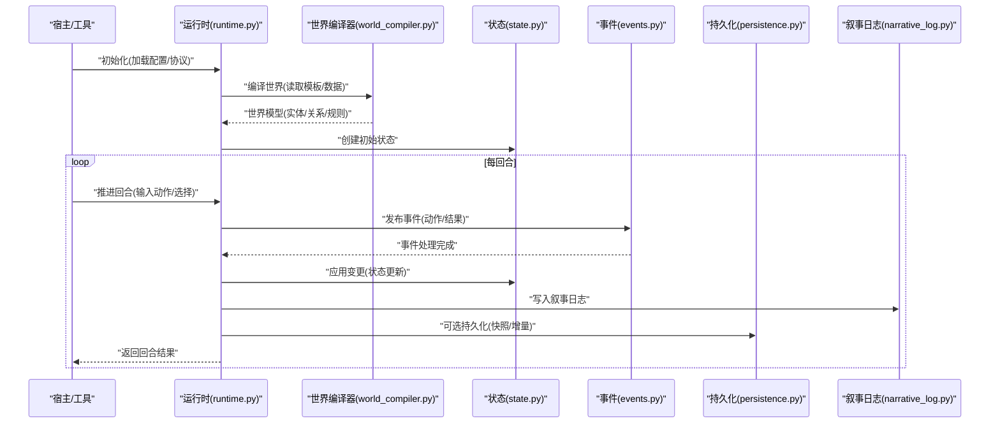
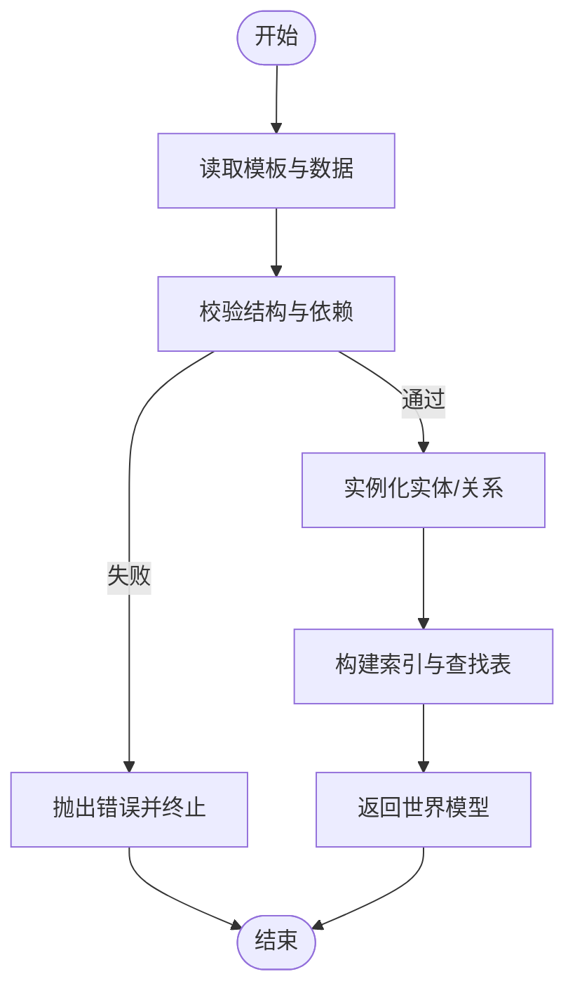
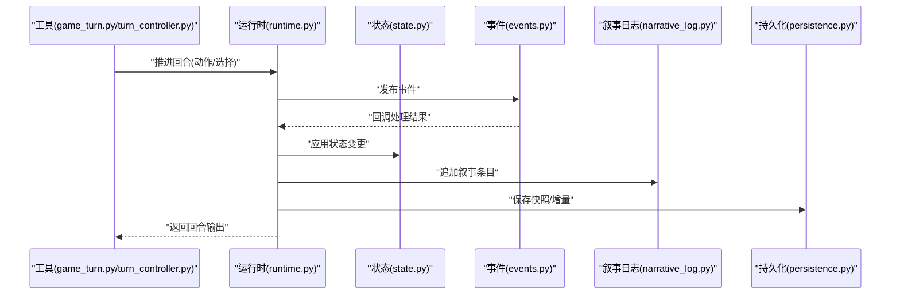
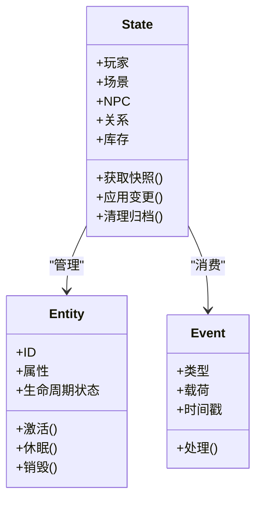
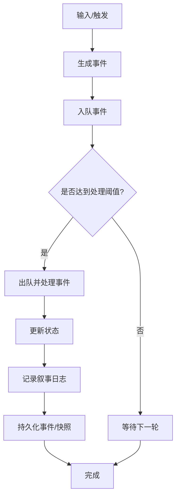
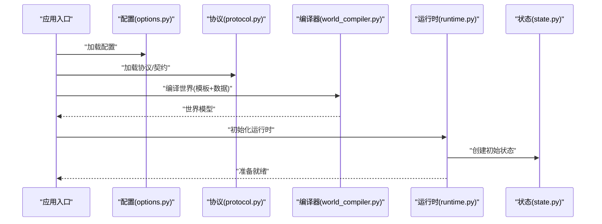
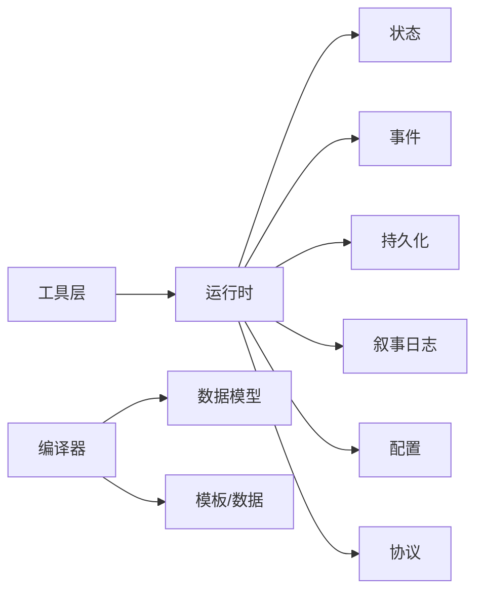

# 基础概念

<cite>
**本文引用的文件**   
- [engine_runtime/runtime.py](file://engine_runtime/runtime.py)
- [engine_runtime/state.py](file://engine_runtime/state.py)
- [engine_runtime/world_compiler.py](file://engine_runtime/world_compiler.py)
- [engine_runtime/models.py](file://engine_runtime/models.py)
- [engine_runtime/events.py](file://engine_runtime/events.py)
- [engine_runtime/persistence.py](file://engine_runtime/persistence.py)
- [engine_runtime/narrative_log.py](file://engine_runtime/narrative_log.py)
- [engine_runtime/options.py](file://engine_runtime/options.py)
- [engine_runtime/protocol.py](file://engine_runtime/protocol.py)
- [engine_runtime/host_contract.json](file://engine_runtime/host_contract.json)
- [templates/world_template.yaml](file://templates/world_template.yaml)
- [tests/fixtures/runtime_world.yaml](file://tests/fixtures/runtime_world.yaml)
- [tools/game_turn.py](file://tools/game_turn.py)
- [tools/turn_controller.py](file://tools/turn_controller.py)
</cite>

## 目录
1. [简介](#简介)
2. [项目结构](#项目结构)
3. [核心组件](#核心组件)
4. [架构总览](#架构总览)
5. [详细组件分析](#详细组件分析)
6. [依赖关系分析](#依赖关系分析)
7. [性能考虑](#性能考虑)
8. [故障排查指南](#故障排查指南)
9. [结论](#结论)
10. [附录](#附录)

## 简介
本章节面向希望理解 TheGreatNovel 互动小说引擎的开发者，系统阐述其基础概念与架构思想。文档围绕以下主题展开：世界模型、运行时环境、游戏循环与状态管理；世界的编译过程、资源加载机制与初始化流程；核心数据结构、对象生命周期与内存优化策略；以及如何扩展基础概念、自定义组件和集成第三方服务。通过分层说明与可视化图示，帮助读者建立正确的系统设计思维，并在实践中兼顾性能与可扩展性。

## 项目结构
TheGreatNovel 的核心运行时位于 engine_runtime 目录，提供世界编译、状态管理、事件驱动、持久化、叙事日志、协议与主机契约等能力。模板与测试数据分别位于 templates 与 tests/fixtures。工具集 tools 提供回合控制、存档生成与回放等辅助能力。

图表来源
- [engine_runtime/runtime.py](file://engine_runtime/runtime.py)
- [engine_runtime/state.py](file://engine_runtime/state.py)
- [engine_runtime/world_compiler.py](file://engine_runtime/world_compiler.py)
- [engine_runtime/models.py](file://engine_runtime/models.py)
- [engine_runtime/events.py](file://engine_runtime/events.py)
- [engine_runtime/persistence.py](file://engine_runtime/persistence.py)
- [engine_runtime/narrative_log.py](file://engine_runtime/narrative_log.py)
- [engine_runtime/options.py](file://engine_runtime/options.py)
- [engine_runtime/protocol.py](file://engine_runtime/protocol.py)
- [engine_runtime/host_contract.json](file://engine_runtime/host_contract.json)
- [templates/world_template.yaml](file://templates/world_template.yaml)
- [tests/fixtures/runtime_world.yaml](file://tests/fixtures/runtime_world.yaml)
- [tools/game_turn.py](file://tools/game_turn.py)
- [tools/turn_controller.py](file://tools/turn_controller.py)

章节来源
- [engine_runtime/runtime.py](file://engine_runtime/runtime.py)
- [engine_runtime/world_compiler.py](file://engine_runtime/world_compiler.py)
- [engine_runtime/models.py](file://engine_runtime/models.py)
- [engine_runtime/events.py](file://engine_runtime/events.py)
- [engine_runtime/persistence.py](file://engine_runtime/persistence.py)
- [engine_runtime/narrative_log.py](file://engine_runtime/narrative_log.py)
- [engine_runtime/options.py](file://engine_runtime/options.py)
- [engine_runtime/protocol.py](file://engine_runtime/protocol.py)
- [engine_runtime/host_contract.json](file://engine_runtime/host_contract.json)
- [templates/world_template.yaml](file://templates/world_template.yaml)
- [tests/fixtures/runtime_world.yaml](file://tests/fixtures/runtime_world.yaml)
- [tools/game_turn.py](file://tools/game_turn.py)
- [tools/turn_controller.py](file://tools/turn_controller.py)

## 核心组件
- 运行时（Runtime）：协调世界编译、状态机、事件总线、持久化与叙事日志，对外暴露统一的启动、回合推进与保存接口。
- 世界编译器（World Compiler）：将 YAML 模板或测试数据编译为运行时可用的世界模型，负责资源解析、依赖校验与实例化。
- 状态管理（State）：维护玩家、场景、NPC、关系、库存等核心实体及其属性，提供快照与变更追踪。
- 事件系统（Events）：基于事件源模式，记录并分发世界变化，支持审计与回放。
- 持久化（Persistence）：序列化/反序列化状态与日志，支持存档与恢复。
- 叙事日志（Narrative Log）：以可读格式记录关键事件与决策，便于调试与复盘。
- 配置与协议（Options & Protocol）：统一配置项与对外协议定义，确保与宿主环境的稳定契约。

章节来源
- [engine_runtime/runtime.py](file://engine_runtime/runtime.py)
- [engine_runtime/world_compiler.py](file://engine_runtime/world_compiler.py)
- [engine_runtime/state.py](file://engine_runtime/state.py)
- [engine_runtime/events.py](file://engine_runtime/events.py)
- [engine_runtime/persistence.py](file://engine_runtime/persistence.py)
- [engine_runtime/narrative_log.py](file://engine_runtime/narrative_log.py)
- [engine_runtime/options.py](file://engine_runtime/options.py)
- [engine_runtime/protocol.py](file://engine_runtime/protocol.py)

## 架构总览
下图展示了运行时各模块之间的交互关系与数据流向。世界编译器在启动阶段构建世界模型；运行时在每回合中调度事件、更新状态、记录日志并持久化；协议与主机契约定义了外部集成边界。

图表来源
- [engine_runtime/runtime.py](file://engine_runtime/runtime.py)
- [engine_runtime/world_compiler.py](file://engine_runtime/world_compiler.py)
- [engine_runtime/state.py](file://engine_runtime/state.py)
- [engine_runtime/events.py](file://engine_runtime/events.py)
- [engine_runtime/persistence.py](file://engine_runtime/persistence.py)
- [engine_runtime/narrative_log.py](file://engine_runtime/narrative_log.py)

## 详细组件分析

### 世界模型与编译器
- 世界模型由实体、关系、规则与资源组成，通常来源于 YAML 模板或测试数据。
- 编译器负责：
  - 解析模板与数据文件
  - 校验引用与依赖
  - 实例化运行时对象
  - 构建索引与查找表
- 典型流程包括：读取模板、合并测试覆盖、生成可查询的世界视图。

图表来源
- [engine_runtime/world_compiler.py](file://engine_runtime/world_compiler.py)
- [templates/world_template.yaml](file://templates/world_template.yaml)
- [tests/fixtures/runtime_world.yaml](file://tests/fixtures/runtime_world.yaml)

章节来源
- [engine_runtime/world_compiler.py](file://engine_runtime/world_compiler.py)
- [templates/world_template.yaml](file://templates/world_template.yaml)
- [tests/fixtures/runtime_world.yaml](file://tests/fixtures/runtime_world.yaml)

### 运行时环境与游戏循环
- 运行时负责：
  - 启动时加载配置与协议
  - 调用编译器构建世界
  - 维护状态机与事件总线
  - 每回合接收输入、调度事件、更新状态、记录日志、持久化
- 游戏循环的关键步骤：
  - 输入验证与归一化
  - 事件发布与处理
  - 状态变更与应用
  - 叙事日志追加
  - 可选持久化（快照/增量）

图表来源
- [engine_runtime/runtime.py](file://engine_runtime/runtime.py)
- [engine_runtime/state.py](file://engine_runtime/state.py)
- [engine_runtime/events.py](file://engine_runtime/events.py)
- [engine_runtime/narrative_log.py](file://engine_runtime/narrative_log.py)
- [engine_runtime/persistence.py](file://engine_runtime/persistence.py)
- [tools/game_turn.py](file://tools/game_turn.py)
- [tools/turn_controller.py](file://tools/turn_controller.py)

章节来源
- [engine_runtime/runtime.py](file://engine_runtime/runtime.py)
- [tools/game_turn.py](file://tools/game_turn.py)
- [tools/turn_controller.py](file://tools/turn_controller.py)

### 状态管理与对象生命周期
- 状态管理维护玩家、场景、NPC、关系、库存等实体的当前值与历史。
- 对象生命周期：
  - 创建：由编译器或运行时根据事件创建
  - 活跃：参与事件处理与状态更新
  - 归档：不再活跃时进入归档或缓存
  - 销毁：释放资源并清理引用
- 内存优化策略：
  - 使用弱引用避免循环引用
  - 按需加载与懒初始化
  - 增量快照与差异持久化
  - 对象池复用高频对象

图表来源
- [engine_runtime/state.py](file://engine_runtime/state.py)
- [engine_runtime/events.py](file://engine_runtime/events.py)
- [engine_runtime/models.py](file://engine_runtime/models.py)

章节来源
- [engine_runtime/state.py](file://engine_runtime/state.py)
- [engine_runtime/events.py](file://engine_runtime/events.py)
- [engine_runtime/models.py](file://engine_runtime/models.py)

### 事件系统与审计
- 事件系统采用事件源模式，所有世界变化以不可变事件记录。
- 优势：
  - 可审计与回放
  - 解耦业务逻辑
  - 支持分布式同步
- 典型流程：
  - 捕获用户输入或系统触发
  - 生成事件并写入事件队列
  - 按序处理事件并更新状态
  - 持久化事件与状态快照

图表来源
- [engine_runtime/events.py](file://engine_runtime/events.py)
- [engine_runtime/narrative_log.py](file://engine_runtime/narrative_log.py)
- [engine_runtime/persistence.py](file://engine_runtime/persistence.py)

章节来源
- [engine_runtime/events.py](file://engine_runtime/events.py)
- [engine_runtime/narrative_log.py](file://engine_runtime/narrative_log.py)
- [engine_runtime/persistence.py](file://engine_runtime/persistence.py)

### 资源加载与初始化流程
- 资源来源：
  - 模板 world_template.yaml
  - 测试数据 runtime_world.yaml
- 初始化流程：
  - 读取配置与协议
  - 加载模板与数据
  - 编译世界模型
  - 创建初始状态
  - 注册事件处理器与钩子
  - 启动运行循环

图表来源
- [engine_runtime/options.py](file://engine_runtime/options.py)
- [engine_runtime/protocol.py](file://engine_runtime/protocol.py)
- [engine_runtime/world_compiler.py](file://engine_runtime/world_compiler.py)
- [engine_runtime/runtime.py](file://engine_runtime/runtime.py)
- [engine_runtime/state.py](file://engine_runtime/state.py)
- [templates/world_template.yaml](file://templates/world_template.yaml)
- [tests/fixtures/runtime_world.yaml](file://tests/fixtures/runtime_world.yaml)

章节来源
- [engine_runtime/options.py](file://engine_runtime/options.py)
- [engine_runtime/protocol.py](file://engine_runtime/protocol.py)
- [engine_runtime/world_compiler.py](file://engine_runtime/world_compiler.py)
- [engine_runtime/runtime.py](file://engine_runtime/runtime.py)
- [engine_runtime/state.py](file://engine_runtime/state.py)
- [templates/world_template.yaml](file://templates/world_template.yaml)
- [tests/fixtures/runtime_world.yaml](file://tests/fixtures/runtime_world.yaml)

### 核心数据结构与模型
- 数据模型集中在 models.py，定义实体、关系、事件与状态的结构。
- 设计要点：
  - 明确字段类型与约束
  - 提供序列化/反序列化方法
  - 支持扩展点与插件接口
- 建议：
  - 使用不可变数据结构提升并发安全
  - 引入版本化字段以兼容演进

章节来源
- [engine_runtime/models.py](file://engine_runtime/models.py)

### 协议与主机契约
- protocol.py 定义运行时对外暴露的接口与消息格式。
- host_contract.json 描述宿主与引擎之间的契约，包括能力声明、生命周期回调与错误码。
- 集成建议：
  - 严格遵循契约进行请求/响应封装
  - 实现超时与重试策略
  - 对未知字段保持前向兼容

章节来源
- [engine_runtime/protocol.py](file://engine_runtime/protocol.py)
- [engine_runtime/host_contract.json](file://engine_runtime/host_contract.json)

## 依赖关系分析
运行时模块之间存在清晰的层次与职责划分：
- 运行时作为协调层，依赖状态、事件、持久化、日志、选项与协议。
- 世界编译器依赖数据模型与模板/测试数据。
- 工具层通过运行时接口驱动游戏循环。

图表来源
- [engine_runtime/runtime.py](file://engine_runtime/runtime.py)
- [engine_runtime/state.py](file://engine_runtime/state.py)
- [engine_runtime/events.py](file://engine_runtime/events.py)
- [engine_runtime/persistence.py](file://engine_runtime/persistence.py)
- [engine_runtime/narrative_log.py](file://engine_runtime/narrative_log.py)
- [engine_runtime/options.py](file://engine_runtime/options.py)
- [engine_runtime/protocol.py](file://engine_runtime/protocol.py)
- [engine_runtime/world_compiler.py](file://engine_runtime/world_compiler.py)
- [engine_runtime/models.py](file://engine_runtime/models.py)
- [templates/world_template.yaml](file://templates/world_template.yaml)
- [tests/fixtures/runtime_world.yaml](file://tests/fixtures/runtime_world.yaml)

章节来源
- [engine_runtime/runtime.py](file://engine_runtime/runtime.py)
- [engine_runtime/world_compiler.py](file://engine_runtime/world_compiler.py)
- [engine_runtime/models.py](file://engine_runtime/models.py)

## 性能考虑
- 事件批处理：批量处理事件减少锁竞争与上下文切换。
- 增量快照：仅持久化差异，降低 IO 压力。
- 懒加载与缓存：按需加载资源，热点数据缓存。
- 对象池：复用频繁创建的对象，减少 GC 压力。
- 异步处理：非阻塞事件处理与持久化，提高吞吐。
- 内存监控：定期采样与泄漏检测，及时回收归档对象。

[本节为通用指导，不直接分析具体文件]

## 故障排查指南
- 常见问题定位：
  - 世界编译失败：检查模板结构与依赖引用
  - 事件丢失或顺序错乱：确认事件队列与处理幂等性
  - 状态不一致：对比快照与事件回放
  - 持久化失败：检查文件格式与权限
- 诊断手段：
  - 启用详细日志与审计
  - 导出事件序列进行回放
  - 使用工具 validate_save 与 verify_projection 校验存档与投影一致性

章节来源
- [engine_runtime/narrative_log.py](file://engine_runtime/narrative_log.py)
- [engine_runtime/persistence.py](file://engine_runtime/persistence.py)
- [engine_runtime/events.py](file://engine_runtime/events.py)

## 结论
TheGreatNovel 的互动小说引擎以世界模型为核心，通过运行时协调状态、事件、持久化与日志，形成清晰的分层架构。世界编译器将模板与数据转化为运行时可用模型，事件系统保障可审计与回放，状态管理确保一致性与高效更新。遵循协议与主机契约可实现稳定的外部集成。在实践中，应关注性能优化与可扩展性设计，结合最佳实践构建健壮的游戏体验。

[本节为总结性内容，不直接分析具体文件]

## 附录
- 扩展基础概念：
  - 新增实体类型：在 models.py 中定义结构，并在 state.py 中增加管理逻辑
  - 自定义事件处理器：在 events.py 中注册处理器，处理特定事件类型
  - 集成第三方服务：通过 protocol.py 定义接口，在运行时中调用外部 API
- 示例路径（不含代码片段）：
  - 扩展实体与关系：参考 [engine_runtime/models.py](file://engine_runtime/models.py)
  - 事件处理器注册：参考 [engine_runtime/events.py](file://engine_runtime/events.py)
  - 第三方服务集成：参考 [engine_runtime/protocol.py](file://engine_runtime/protocol.py) 与 [engine_runtime/host_contract.json](file://engine_runtime/host_contract.json)

章节来源
- [engine_runtime/models.py](file://engine_runtime/models.py)
- [engine_runtime/events.py](file://engine_runtime/events.py)
- [engine_runtime/protocol.py](file://engine_runtime/protocol.py)
- [engine_runtime/host_contract.json](file://engine_runtime/host_contract.json)