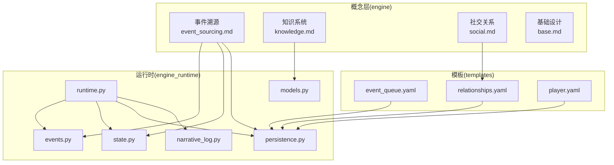
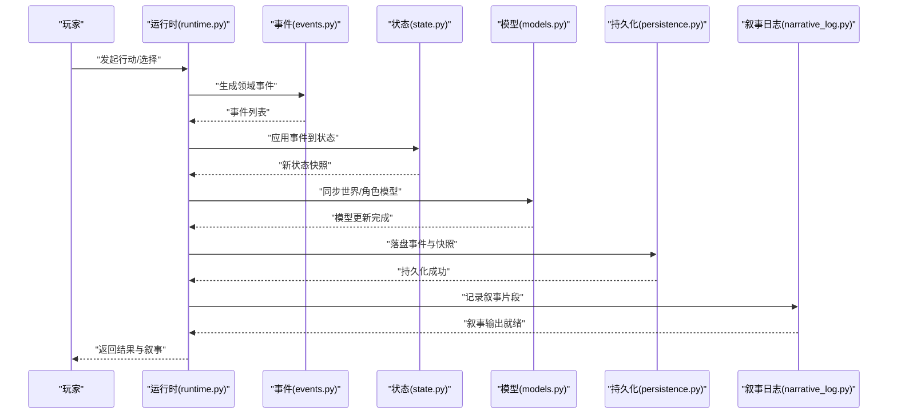
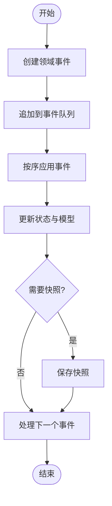
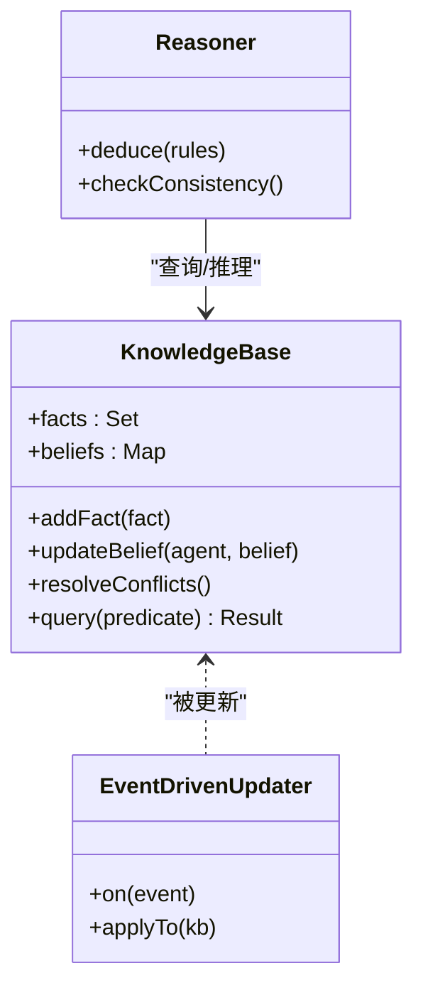
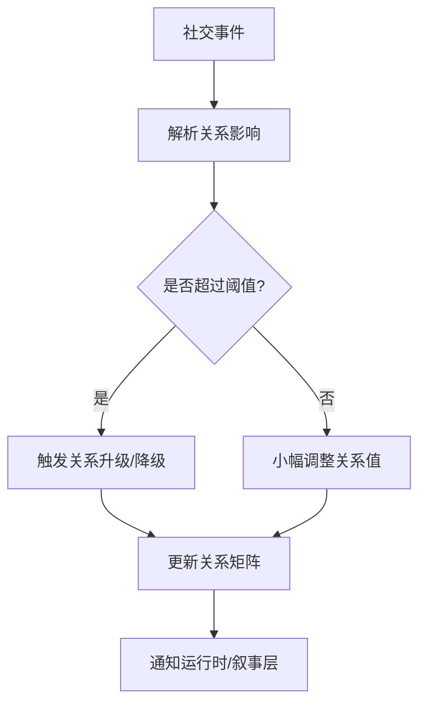
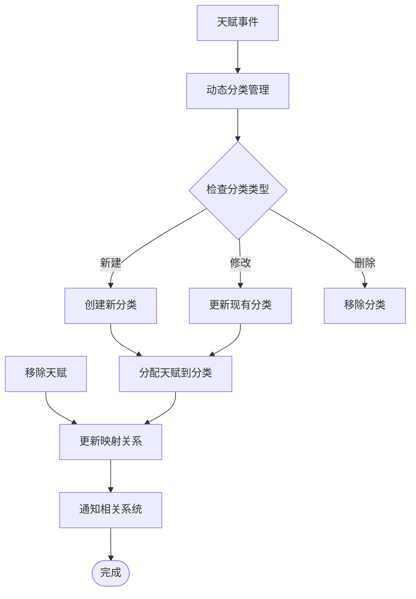
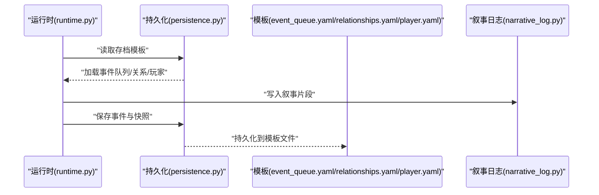
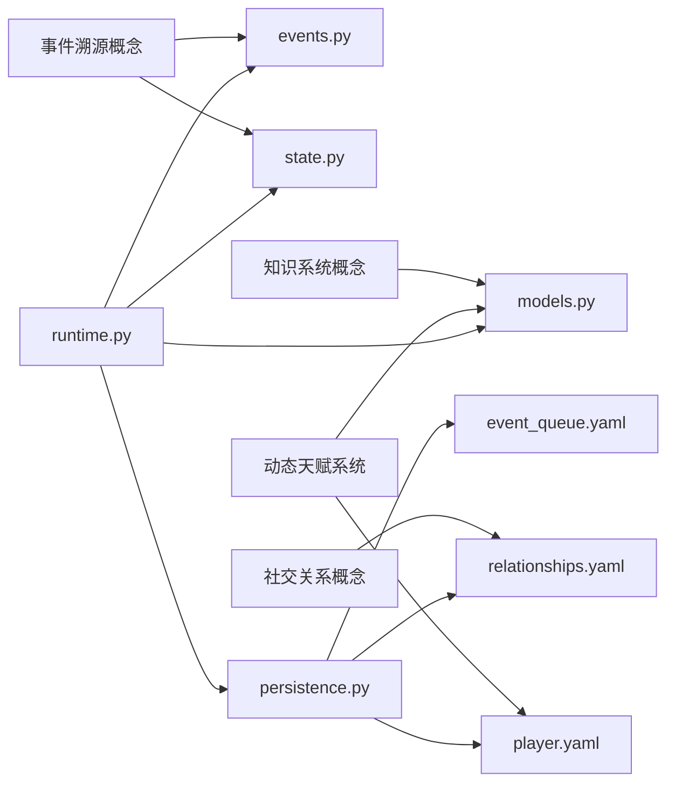

# 核心概念

<cite>
**本文档引用的文件**   
- [engine/event_sourcing.md](file://engine/event_sourcing.md)
- [engine/knowledge.md](file://engine/knowledge.md)
- [engine/social.md](file://engine/social.md)
- [engine/base.md](file://engine/base.md)
- [engine_runtime/events.py](file://engine_runtime/events.py)
- [engine_runtime/state.py](file://engine_runtime/state.py)
- [engine_runtime/runtime.py](file://engine_runtime/runtime.py)
- [engine_runtime/persistence.py](file://engine_runtime/persistence.py)
- [engine_runtime/models.py](file://engine_runtime/models.py)
- [engine_runtime/narrative_log.py](file://engine_runtime/narrative_log.py)
- [templates/save_template/event_queue.yaml](file://templates/save_template/event_queue.yaml)
- [templates/save_template/relationships.yaml](file://templates/save_template/relationships.yaml)
- [templates/save_template/player.yaml](file://templates/save_template/player.yaml)
</cite>

## 更新摘要
**所做更改**   
- 更新了天赋系统章节，反映固定天赋分类的移除和动态分类支持
- 新增了角色发展路径的动态化说明
- 更新了相关架构图表以体现新的分类机制
- 增强了玩家模型部分关于天赋系统的描述

## 目录
1. [简介](#简介)
2. [项目结构](#项目结构)
3. [核心组件](#核心组件)
4. [架构总览](#架构总览)
5. [详细组件分析](#详细组件分析)
6. [依赖关系分析](#依赖关系分析)
7. [性能考量](#性能考量)
8. [故障排查指南](#故障排查指南)
9. [结论](#结论)
10. [附录](#附录)

## 简介
本章节面向开发者与策划，系统阐述 TheGreatNovel 的核心概念：事件溯源（Event Sourcing）、知识系统（Knowledge System）与社交关系（Social System）。这些概念共同支撑互动小说的"可回放、可推理、可演化"的体验：
- 事件溯源：以不可变事件为唯一事实来源，驱动状态重建与审计。
- 知识系统：维护世界与角色的知识与信念，支持推理与一致性检查。
- 社交关系：刻画角色间关系强度与倾向，影响对话、任务与剧情分支。
- **新增**：动态天赋系统：支持灵活的分类机制，允许角色发展路径的动态调整。

通过这四者的协作，系统能够在保持叙事一致性的同时，提供丰富的玩家选择与动态世界反馈。

## 项目结构
TheGreatNovel 将"概念文档"与"运行时实现"分层组织：
- engine：概念与设计文档，定义三大核心概念及其交互原则。
- engine_runtime：运行时实现，包含事件模型、状态管理、持久化、叙事日志等。
- templates：存档模板，定义事件队列、关系、玩家等关键结构的序列化格式。

图表来源
- [engine/event_sourcing.md](file://engine/event_sourcing.md)
- [engine/knowledge.md](file://engine/knowledge.md)
- [engine/social.md](file://engine/social.md)
- [engine/base.md](file://engine/base.md)
- [engine_runtime/events.py](file://engine_runtime/events.py)
- [engine_runtime/state.py](file://engine_runtime/state.py)
- [engine_runtime/runtime.py](file://engine_runtime/runtime.py)
- [engine_runtime/persistence.py](file://engine_runtime/persistence.py)
- [engine_runtime/models.py](file://engine_runtime/models.py)
- [engine_runtime/narrative_log.py](file://engine_runtime/narrative_log.py)
- [templates/save_template/event_queue.yaml](file://templates/save_template/event_queue.yaml)
- [templates/save_template/relationships.yaml](file://templates/save_template/relationships.yaml)
- [templates/save_template/player.yaml](file://templates/save_template/player.yaml)

章节来源
- [engine/event_sourcing.md](file://engine/event_sourcing.md)
- [engine/knowledge.md](file://engine/knowledge.md)
- [engine/social.md](file://engine/social.md)
- [engine/base.md](file://engine/base.md)

## 核心组件
- 事件溯源（Event Sourcing）
  - 以不可变事件序列作为唯一真实来源；状态由事件重放得到。
  - 支持审计、回放、时间旅行与一致性校验。
- 知识系统（Knowledge System）
  - 维护世界事实、角色知识与信念；支持推理与冲突检测。
  - 与事件溯源结合，确保知识变更可追溯、可解释。
- 社交关系（Social System）
  - 描述角色间的关系强度、倾向与历史事件；驱动对话与行为。
  - 与事件和知识联动，形成"事件→知识更新→关系变化→行为决策"的闭环。
- **新增**：动态天赋系统（Dynamic Talent System）
  - 移除了固定的天赋分类，支持运行时动态创建和管理天赋类别。
  - 允许角色发展路径根据游戏进程和玩家选择灵活调整。
  - 与事件系统和知识系统深度集成，确保天赋变化的可追溯性。

章节来源
- [engine/event_sourcing.md](file://engine/event_sourcing.md)
- [engine/knowledge.md](file://engine/knowledge.md)
- [engine/social.md](file://engine/social.md)

## 架构总览
下图展示四大概念在运行时的协作方式：事件驱动状态更新，知识系统维护事实与信念，社交关系影响行为与叙事输出，动态天赋系统提供角色发展的灵活性。

图表来源
- [engine_runtime/runtime.py](file://engine_runtime/runtime.py)
- [engine_runtime/events.py](file://engine_runtime/events.py)
- [engine_runtime/state.py](file://engine_runtime/state.py)
- [engine_runtime/models.py](file://engine_runtime/models.py)
- [engine_runtime/persistence.py](file://engine_runtime/persistence.py)
- [engine_runtime/narrative_log.py](file://engine_runtime/narrative_log.py)

## 详细组件分析

### 事件溯源（Event Sourcing）
- 概念要点
  - 所有变更以事件形式记录，事件不可变且有序。
  - 状态由事件流重放构建，保证可审计与可回放。
  - 支持增量计算与投影（Projection），按需生成视图。
- 工作原理
  - 运行时接收玩家输入，生成领域事件并追加到事件队列。
  - 状态管理器按序应用事件，更新内存状态与模型。
  - 持久化模块将事件与快照写入存档模板。
- 使用场景
  - 剧情回溯与多结局验证。
  - 调试与平衡性调整（基于事件统计）。
  - 多人协作与版本对比（事件差异）。

图表来源
- [engine_runtime/events.py](file://engine_runtime/events.py)
- [engine_runtime/state.py](file://engine_runtime/state.py)
- [engine_runtime/persistence.py](file://engine_runtime/persistence.py)
- [templates/save_template/event_queue.yaml](file://templates/save_template/event_queue.yaml)

章节来源
- [engine/event_sourcing.md](file://engine/event_sourcing.md)
- [engine_runtime/events.py](file://engine_runtime/events.py)
- [engine_runtime/state.py](file://engine_runtime/state.py)
- [engine_runtime/persistence.py](file://engine_runtime/persistence.py)
- [templates/save_template/event_queue.yaml](file://templates/save_template/event_queue.yaml)

### 知识系统（Knowledge System）
- 概念要点
  - 世界事实与角色信念分离，支持不一致与修正。
  - 知识变更由事件驱动，具备因果链与证据来源。
  - 提供推理接口，用于判定剧情条件与行为策略。
- 工作原理
  - 事件触发知识更新器，修改事实或信念集合。
  - 一致性检查器发现冲突并生成修复建议或新事件。
  - 模型层暴露查询接口供运行时与叙事引擎使用。
- 使用场景
  - 角色记忆与学习：根据经历更新对世界的认知。
  - 剧情分支判断：基于当前知识决定可用选项。
  - 叙事解释：向玩家说明"为什么发生"。

图表来源
- [engine/knowledge.md](file://engine/knowledge.md)
- [engine_runtime/models.py](file://engine_runtime/models.py)
- [engine_runtime/events.py](file://engine_runtime/events.py)

章节来源
- [engine/knowledge.md](file://engine/knowledge.md)
- [engine_runtime/models.py](file://engine_runtime/models.py)
- [engine_runtime/events.py](file://engine_runtime/events.py)

### 社交关系（Social System）
- 概念要点
  - 关系维度包括亲密度、信任度、敌意等，随事件累积而变化。
  - 关系影响对话风格、任务分配与阵营立场。
  - 与知识系统联动：角色对彼此的知识与信念影响关系演化。
- 工作原理
  - 事件携带社交语义（如帮助、背叛），关系管理器据此更新关系矩阵。
  - 运行时根据关系阈值触发剧情事件或NPC行为。
  - 存档模板中持久化关系数据，便于回放与调优。
- 使用场景
  - 多角色群像剧：关系网络推动复杂剧情。
  - 玩家社交选择：影响盟友与敌人数量及质量。
  - 动态阵营：关系变化导致势力重组。

图表来源
- [engine/social.md](file://engine/social.md)
- [engine_runtime/models.py](file://engine_runtime/models.py)
- [templates/save_template/relationships.yaml](file://templates/save_template/relationships.yaml)

章节来源
- [engine/social.md](file://engine/social.md)
- [engine_runtime/models.py](file://engine_runtime/models.py)
- [templates/save_template/relationships.yaml](file://templates/save_template/relationships.yaml)

### 动态天赋系统（Dynamic Talent System）
- **更新** 概念要点
  - 移除了固定的天赋分类限制，支持运行时动态创建和管理天赋类别。
  - 天赋分类可以根据游戏进程、玩家选择和剧情发展灵活调整。
  - 与事件系统深度集成，确保天赋变化的完整可追溯性。
- **更新** 工作原理
  - 事件驱动的天赋更新器支持动态分类的创建、修改和删除。
  - 运行时根据玩家选择和剧情事件动态调整角色发展路径。
  - 存档模板中的玩家数据支持动态天赋结构的持久化。
- **更新** 使用场景
  - 个性化角色发展：每个玩家的路径都是独一无二的。
  - 剧情驱动的天赋解锁：特定剧情节点解锁专属天赋类别。
  - 动态难度调整：根据玩家表现动态调整天赋获取速率。

**图表来源**
- [engine_runtime/models.py](file://engine_runtime/models.py)
- [engine_runtime/events.py](file://engine_runtime/events.py)
- [templates/save_template/player.yaml](file://templates/save_template/player.yaml)

**章节来源**
- [engine/base.md](file://engine/base.md)
- [engine_runtime/models.py](file://engine_runtime/models.py)
- [engine_runtime/events.py](file://engine_runtime/events.py)
- [templates/save_template/player.yaml](file://templates/save_template/player.yaml)

### 运行时与持久化协作
- 运行时（runtime.py）协调事件、状态、模型与叙事输出。
- 持久化（persistence.py）负责事件队列、关系、玩家等模板的读写。
- 叙事日志（narrative_log.py）记录关键事件与决策，辅助回放与审计。

图表来源
- [engine_runtime/runtime.py](file://engine_runtime/runtime.py)
- [engine_runtime/persistence.py](file://engine_runtime/persistence.py)
- [engine_runtime/narrative_log.py](file://engine_runtime/narrative_log.py)
- [templates/save_template/event_queue.yaml](file://templates/save_template/event_queue.yaml)
- [templates/save_template/relationships.yaml](file://templates/save_template/relationships.yaml)
- [templates/save_template/player.yaml](file://templates/save_template/player.yaml)

章节来源
- [engine_runtime/runtime.py](file://engine_runtime/runtime.py)
- [engine_runtime/persistence.py](file://engine_runtime/persistence.py)
- [engine_runtime/narrative_log.py](file://engine_runtime/narrative_log.py)
- [templates/save_template/event_queue.yaml](file://templates/save_template/event_queue.yaml)
- [templates/save_template/relationships.yaml](file://templates/save_template/relationships.yaml)
- [templates/save_template/player.yaml](file://templates/save_template/player.yaml)

## 依赖关系分析
- 概念层依赖运行时实现进行落地，运行时通过事件、状态与模型解耦各子系统。
- 模板层提供统一的序列化契约，降低耦合与迁移成本。
- 潜在循环依赖：运行时不应直接依赖叙事细节，应通过接口抽象。
- **新增**：动态天赋系统与事件系统、模型系统的紧密集成。

图表来源
- [engine/event_sourcing.md](file://engine/event_sourcing.md)
- [engine/knowledge.md](file://engine/knowledge.md)
- [engine/social.md](file://engine/social.md)
- [engine/base.md](file://engine/base.md)
- [engine_runtime/events.py](file://engine_runtime/events.py)
- [engine_runtime/state.py](file://engine_runtime/state.py)
- [engine_runtime/models.py](file://engine_runtime/models.py)
- [engine_runtime/runtime.py](file://engine_runtime/runtime.py)
- [engine_runtime/persistence.py](file://engine_runtime/persistence.py)
- [templates/save_template/event_queue.yaml](file://templates/save_template/event_queue.yaml)
- [templates/save_template/relationships.yaml](file://templates/save_template/relationships.yaml)
- [templates/save_template/player.yaml](file://templates/save_template/player.yaml)

章节来源
- [engine/event_sourcing.md](file://engine/event_sourcing.md)
- [engine/knowledge.md](file://engine/knowledge.md)
- [engine/social.md](file://engine/social.md)
- [engine/base.md](file://engine/base.md)
- [engine_runtime/runtime.py](file://engine_runtime/runtime.py)
- [engine_runtime/persistence.py](file://engine_runtime/persistence.py)

## 性能考量
- 事件重放开销：采用快照+增量事件策略，减少全量重放成本。
- 知识推理复杂度：限制规则规模与查询范围，必要时引入索引。
- 关系矩阵更新：批量合并小步更新，避免频繁IO。
- 持久化吞吐：异步落盘与批处理，提升存档读写效率。
- **新增**：动态分类缓存：对常用的天赋分类进行内存缓存，减少重复计算。
- **新增**：懒加载机制：按需加载复杂的角色发展树，避免初始加载开销。

[本节为通用指导，不直接分析具体文件]

## 故障排查指南
- 事件不一致
  - 检查事件队列顺序与幂等性，确认应用逻辑无副作用。
  - 参考事件模型与状态应用路径定位问题。
- 知识冲突
  - 使用一致性检查器输出冲突报告，定位事件源。
  - 核对知识更新器的触发条件与优先级。
- 关系异常
  - 审查社交事件的权重与阈值配置，检查关系矩阵更新逻辑。
  - 对照存档模板中的关系数据与运行时状态。
- **新增**：天赋分类问题
  - 检查动态分类的创建和销毁逻辑，确保没有内存泄漏。
  - 验证天赋映射关系的完整性，防止悬空引用。
  - 监控分类数量增长，设置合理的上限保护。

章节来源
- [engine_runtime/events.py](file://engine_runtime/events.py)
- [engine_runtime/state.py](file://engine_runtime/state.py)
- [engine_runtime/models.py](file://engine_runtime/models.py)
- [engine_runtime/persistence.py](file://engine_runtime/persistence.py)
- [templates/save_template/event_queue.yaml](file://templates/save_template/event_queue.yaml)
- [templates/save_template/relationships.yaml](file://templates/save_template/relationships.yaml)

## 结论
事件溯源、知识系统与社交关系构成 TheGreatNovel 的叙事基石。**新增的动态天赋系统**进一步增强了角色发展的灵活性和个性化程度。三者协同实现了"可回放、可推理、可演化"的互动体验，而动态天赋系统则为这一体验提供了更深层次的定制化能力。通过清晰的职责划分与模板化持久化，系统在扩展性与可维护性上具备良好基础。建议在开发中坚持事件优先、知识可证、关系可衡量、天赋可定制的原则，持续优化性能与一致性。

[本节为总结性内容，不直接分析具体文件]

## 附录
- 概念文档位置
  - 事件溯源：[engine/event_sourcing.md](file://engine/event_sourcing.md)
  - 知识系统：[engine/knowledge.md](file://engine/knowledge.md)
  - 社交关系：[engine/social.md](file://engine/social.md)
  - 基础设计：[engine/base.md](file://engine/base.md)
- 运行时关键文件
  - 事件模型：[engine_runtime/events.py](file://engine_runtime/events.py)
  - 状态管理：[engine_runtime/state.py](file://engine_runtime/state.py)
  - 运行时协调：[engine_runtime/runtime.py](file://engine_runtime/runtime.py)
  - 持久化：[engine_runtime/persistence.py](file://engine_runtime/persistence.py)
  - 模型定义：[engine_runtime/models.py](file://engine_runtime/models.py)
  - 叙事日志：[engine_runtime/narrative_log.py](file://engine_runtime/narrative_log.py)
- 存档模板
  - 事件队列：[templates/save_template/event_queue.yaml](file://templates/save_template/event_queue.yaml)
  - 关系数据：[templates/save_template/relationships.yaml](file://templates/save_template/relationships.yaml)
  - 玩家数据：[templates/save_template/player.yaml](file://templates/save_template/player.yaml)