# 知识系统

<cite>
**本文引用的文件**   
- [engine/knowledge.md](file://engine/knowledge.md)
- [engine/base.md](file://engine/base.md)
- [engine/event_sourcing.md](file://engine/event_sourcing.md)
- [engine/social.md](file://engine/social.md)
- [engine_runtime/models.py](file://engine_runtime/models.py)
- [engine_runtime/state.py](file://engine_runtime/state.py)
- [engine_runtime/events.py](file://engine_runtime/events.py)
- [engine_runtime/runtime.py](file://engine_runtime/runtime.py)
- [engine_runtime/world_compiler.py](file://engine_runtime/world_compiler.py)
- [engine_runtime/persistence.py](file://engine_runtime/persistence.py)
- [templates/save_template/npcs.yaml](file://templates/save_template/npcs.yaml)
- [templates/save_template/player.yaml](file://templates/save_template/player.yaml)
- [templates/save_template/relationships.yaml](file://templates/save_template/relationships.yaml)
- [templates/save_template/factions.yaml](file://templates/save_template/factions.yaml)
- [templates/save_template/meta.yaml](file://templates/save_template/meta.yaml)
- [tests/fixtures/runtime_world.yaml](file://tests/fixtures/runtime_world.yaml)
</cite>

## 目录
1. [简介](#简介)
2. [项目结构](#项目结构)
3. [核心组件](#核心组件)
4. [架构总览](#架构总览)
5. [详细组件分析](#详细组件分析)
6. [依赖关系分析](#依赖关系分析)
7. [性能考量](#性能考量)
8. [故障排查指南](#故障排查指南)
9. [结论](#结论)
10. [附录](#附录)

## 简介
本文件为 TheGreatNovel 项目的“知识系统”提供系统化、可操作的文档。内容涵盖：
- 知识在互动小说中的作用与价值
- 知识的表示方法、存储结构与生命周期管理
- NPC 角色如何拥有、使用与传播知识
- 玩家通过对话与行动获取新知识的机制
- 知识分类体系、更新规则与传播机制
- 配置示例（定义知识实体、设置关系、编写推理逻辑）
- 与对话生成、剧情分支的集成方式
- 知识验证、冲突解决与一致性保证方案

## 项目结构
知识系统贯穿引擎规范与运行时实现，并在模板中提供持久化形态。关键位置如下：
- 引擎规范：knowledge.md、base.md、event_sourcing.md、social.md
- 运行时模型与状态：models.py、state.py、events.py、runtime.py、world_compiler.py、persistence.py
- 保存模板：npcs.yaml、player.yaml、relationships.yaml、factions.yaml、meta.yaml
- 测试数据：runtime_world.yaml

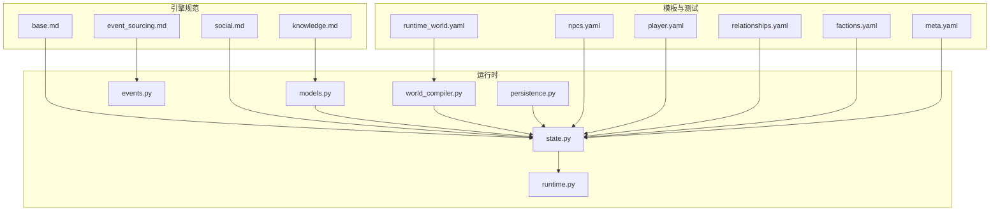

图表来源
- [engine/knowledge.md](file://engine/knowledge.md)
- [engine/base.md](file://engine/base.md)
- [engine/event_sourcing.md](file://engine/event_sourcing.md)
- [engine/social.md](file://engine/social.md)
- [engine_runtime/models.py](file://engine_runtime/models.py)
- [engine_runtime/state.py](file://engine_runtime/state.py)
- [engine_runtime/events.py](file://engine_runtime/events.py)
- [engine_runtime/runtime.py](file://engine_runtime/runtime.py)
- [engine_runtime/world_compiler.py](file://engine_runtime/world_compiler.py)
- [engine_runtime/persistence.py](file://engine_runtime/persistence.py)
- [templates/save_template/npcs.yaml](file://templates/save_template/npcs.yaml)
- [templates/save_template/player.yaml](file://templates/save_template/player.yaml)
- [templates/save_template/relationships.yaml](file://templates/save_template/relationships.yaml)
- [templates/save_template/factions.yaml](file://templates/save_template/factions.yaml)
- [templates/save_template/meta.yaml](file://templates/save_template/meta.yaml)
- [tests/fixtures/runtime_world.yaml](file://tests/fixtures/runtime_world.yaml)

章节来源
- [engine/knowledge.md](file://engine/knowledge.md)
- [engine/base.md](file://engine/base.md)
- [engine/event_sourcing.md](file://engine/event_sourcing.md)
- [engine/social.md](file://engine/social.md)
- [engine_runtime/models.py](file://engine_runtime/models.py)
- [engine_runtime/state.py](file://engine_runtime/state.py)
- [engine_runtime/events.py](file://engine_runtime/events.py)
- [engine_runtime/runtime.py](file://engine_runtime/runtime.py)
- [engine_runtime/world_compiler.py](file://engine_runtime/world_compiler.py)
- [engine_runtime/persistence.py](file://engine_runtime/persistence.py)
- [templates/save_template/npcs.yaml](file://templates/save_template/npcs.yaml)
- [templates/save_template/player.yaml](file://templates/save_template/player.yaml)
- [templates/save_template/relationships.yaml](file://templates/save_template/relationships.yaml)
- [templates/save_template/factions.yaml](file://templates/save_template/factions.yaml)
- [templates/save_template/meta.yaml](file://templates/save_template/meta.yaml)
- [tests/fixtures/runtime_world.yaml](file://tests/fixtures/runtime_world.yaml)

## 核心组件
- 知识模型与类型
  - 知识实体：以“命题/事实”为核心，支持属性、权重、可信度、时效性、来源等元信息
  - 知识分类：事件类、概念类、关系类、技能类、信念类、目标类、策略类等
  - 知识关系：蕴含、等价、互斥、因果、时序、隶属、关联等
- 主体与知识持有
  - 主体包括玩家与NPC；每个主体维护私有知识集合与共享知识库视图
  - 主体对知识的可见性、置信度、记忆衰减、遗忘阈值等
- 知识更新与传播
  - 更新来源：世界事件、对话交互、观察行为、学习规则、社会传播
  - 传播路径：直接告知、间接听闻、群体共识、媒体/公告
- 推理与决策
  - 基于规则的推理、概率推断、约束满足、冲突消解
  - 与对话生成、剧情分支、任务规划联动
- 一致性与审计
  - 事件溯源驱动的状态变更，确保可回放、可审计、可回滚
  - 版本化、校验器、冲突检测与合并策略

章节来源
- [engine/knowledge.md](file://engine/knowledge.md)
- [engine/base.md](file://engine/base.md)
- [engine/event_sourcing.md](file://engine/event_sourcing.md)
- [engine/social.md](file://engine/social.md)
- [engine_runtime/models.py](file://engine_runtime/models.py)
- [engine_runtime/state.py](file://engine_runtime/state.py)
- [engine_runtime/events.py](file://engine_runtime/events.py)

## 架构总览
知识系统在运行时由“模型—状态—事件—编译器—持久化”五层协作完成：
- 模型层：定义知识、主体、关系、事件等数据结构
- 状态层：维护当前世界与主体的知识快照
- 事件层：以不可变事件记录一切变更，驱动状态演进
- 编译器层：将世界配置编译为运行时对象并注入初始知识
- 持久化层：序列化/反序列化状态与事件，支持存档与回放

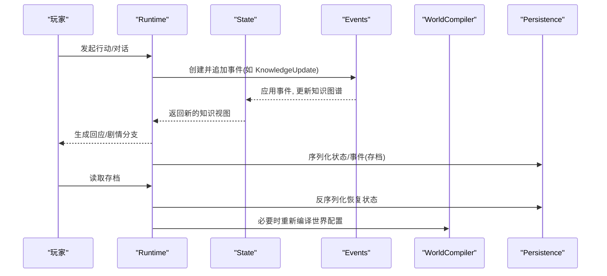

图表来源
- [engine_runtime/runtime.py](file://engine_runtime/runtime.py)
- [engine_runtime/state.py](file://engine_runtime/state.py)
- [engine_runtime/events.py](file://engine_runtime/events.py)
- [engine_runtime/world_compiler.py](file://engine_runtime/world_compiler.py)
- [engine_runtime/persistence.py](file://engine_runtime/persistence.py)

章节来源
- [engine_runtime/runtime.py](file://engine_runtime/runtime.py)
- [engine_runtime/state.py](file://engine_runtime/state.py)
- [engine_runtime/events.py](file://engine_runtime/events.py)
- [engine_runtime/world_compiler.py](file://engine_runtime/world_compiler.py)
- [engine_runtime/persistence.py](file://engine_runtime/persistence.py)

## 详细组件分析

### 知识模型与数据结构
- 知识实体
  - 标识、类型、内容、权重、可信度、来源、时间戳、失效条件
  - 标签与分类，便于检索与推理
- 主体与知识持有
  - 主体ID、名称、阵营、关系网络
  - 私有知识索引、共享知识视图、注意力与记忆衰减参数
- 关系与约束
  - 二元/多元关系，包含方向、强度、生效范围
  - 约束：互斥、蕴含、等价、因果、时序等

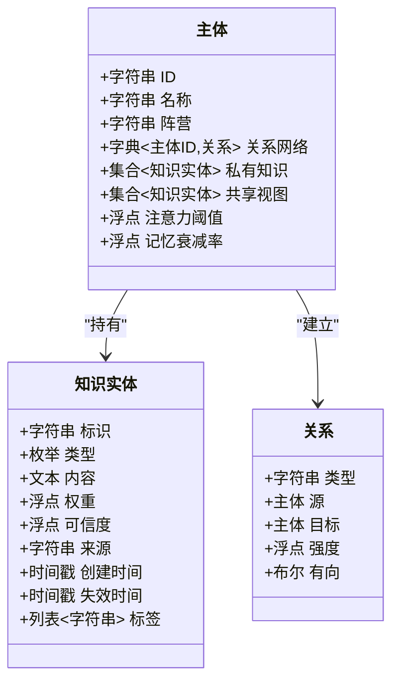

图表来源
- [engine_runtime/models.py](file://engine_runtime/models.py)
- [engine_runtime/state.py](file://engine_runtime/state.py)

章节来源
- [engine_runtime/models.py](file://engine_runtime/models.py)
- [engine_runtime/state.py](file://engine_runtime/state.py)

### 事件溯源与知识更新
- 事件类型
  - KnowledgeAdd/KnowledgeRemove/KnowledgeUpdate
  - SocialBroadcast/Whisper/Lesson
  - Observation/Inference/ConflictResolution
- 事件处理流程
  - 事件不可变，按序追加
  - 状态机根据事件重放或增量更新
  - 支持事务性批处理与回滚

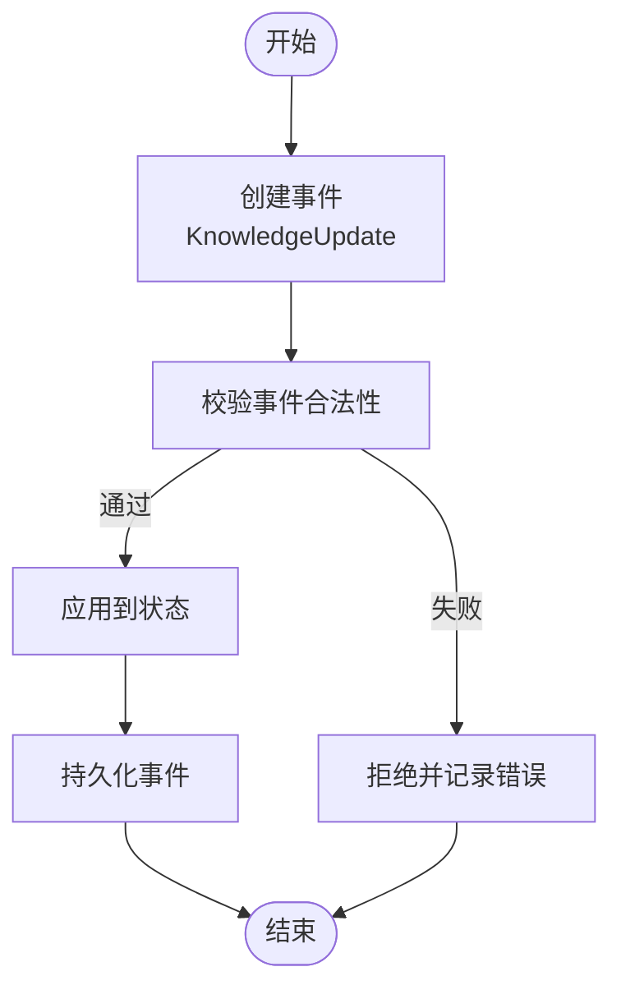

图表来源
- [engine_runtime/events.py](file://engine_runtime/events.py)
- [engine_runtime/state.py](file://engine_runtime/state.py)
- [engine/event_sourcing.md](file://engine/event_sourcing.md)

章节来源
- [engine_runtime/events.py](file://engine_runtime/events.py)
- [engine_runtime/state.py](file://engine_runtime/state.py)
- [engine/event_sourcing.md](file://engine/event_sourcing.md)

### 世界编译与初始知识注入
- 编译器职责
  - 解析 world_template.yaml 与 runtime_world.yaml
  - 构建主体、关系、阵营、初始知识与规则
  - 生成运行时对象并注入到 State
- 配置要点
  - 主体定义、初始知识清单、关系矩阵、阵营归属
  - 全局知识规则、传播策略、衰减参数

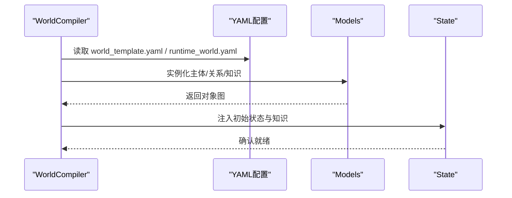

图表来源
- [engine_runtime/world_compiler.py](file://engine_runtime/world_compiler.py)
- [tests/fixtures/runtime_world.yaml](file://tests/fixtures/runtime_world.yaml)
- [templates/world_template.yaml](file://templates/world_template.yaml)

章节来源
- [engine_runtime/world_compiler.py](file://engine_runtime/world_compiler.py)
- [tests/fixtures/runtime_world.yaml](file://tests/fixtures/runtime_world.yaml)
- [templates/world_template.yaml](file://templates/world_template.yaml)

### 持久化与存档结构
- 存档文件
  - npcs.yaml：NPC主体、初始/当前知识、关系
  - player.yaml：玩家主体、知识、偏好
  - relationships.yaml：关系图谱
  - factions.yaml：阵营与成员
  - meta.yaml：元数据、版本、时间线
- 读写流程
  - 启动时加载存档，重建状态
  - 运行中定期快照，支持断点续玩

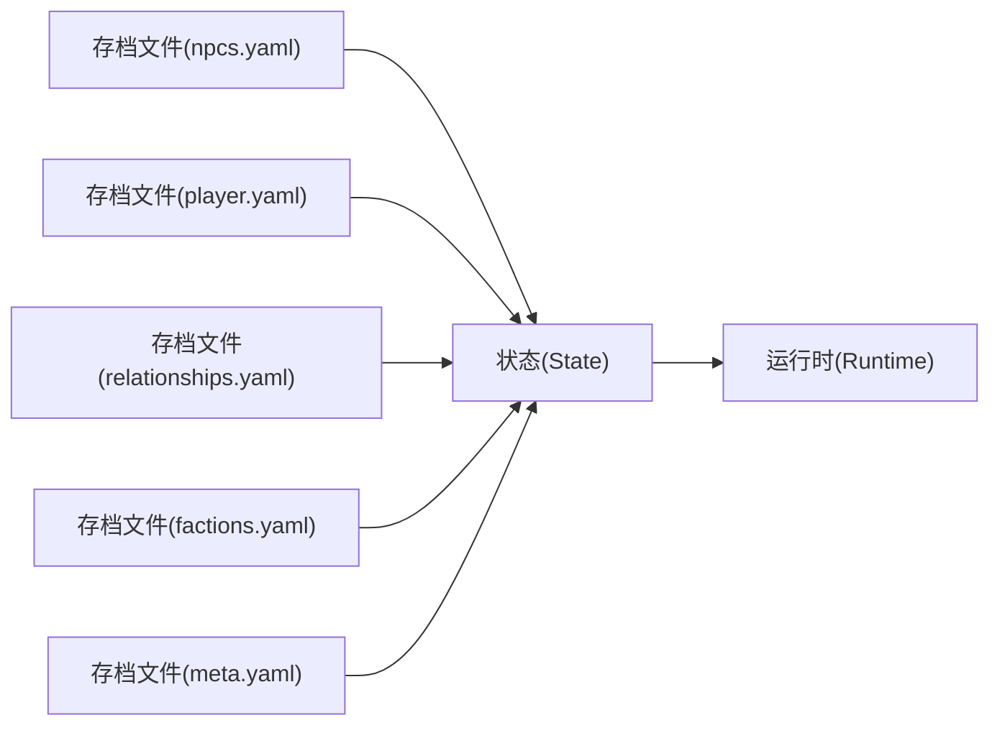

图表来源
- [engine_runtime/persistence.py](file://engine_runtime/persistence.py)
- [templates/save_template/npcs.yaml](file://templates/save_template/npcs.yaml)
- [templates/save_template/player.yaml](file://templates/save_template/player.yaml)
- [templates/save_template/relationships.yaml](file://templates/save_template/relationships.yaml)
- [templates/save_template/factions.yaml](file://templates/save_template/factions.yaml)
- [templates/save_template/meta.yaml](file://templates/save_template/meta.yaml)

章节来源
- [engine_runtime/persistence.py](file://engine_runtime/persistence.py)
- [templates/save_template/npcs.yaml](file://templates/save_template/npcs.yaml)
- [templates/save_template/player.yaml](file://templates/save_template/player.yaml)
- [templates/save_template/relationships.yaml](file://templates/save_template/relationships.yaml)
- [templates/save_template/factions.yaml](file://templates/save_template/factions.yaml)
- [templates/save_template/meta.yaml](file://templates/save_template/meta.yaml)

### NPC 知识与社交传播
- NPC 知识持有
  - 私有知识、共享视图、注意力过滤、遗忘曲线
- 社交传播
  - 广播、耳语、教学、群体共识
  - 传播强度受关系、信任、距离影响
- 与对话生成
  - 基于知识选择话题、立场、情绪
  - 动态调整回答可信度与倾向

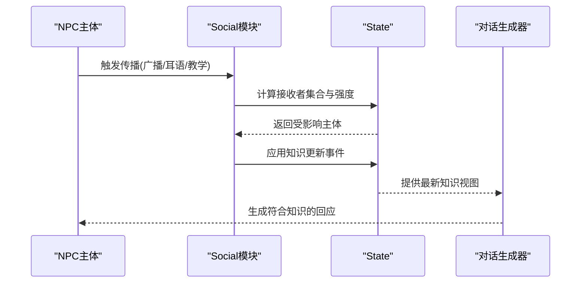

图表来源
- [engine/social.md](file://engine/social.md)
- [engine_runtime/state.py](file://engine_runtime/state.py)
- [engine_runtime/events.py](file://engine_runtime/events.py)

章节来源
- [engine/social.md](file://engine/social.md)
- [engine_runtime/state.py](file://engine_runtime/state.py)
- [engine_runtime/events.py](file://engine_runtime/events.py)

### 玩家获取新知识的路径
- 对话交互
  - 提问、倾听、辩论、学习指令
- 观察与探索
  - 环境线索、物品描述、事件目击
- 行动结果
  - 成功/失败反馈、奖励/惩罚、经验积累
- 知识内化
  - 从短期记忆到长期记忆的转化
  - 置信度提升与偏差校正

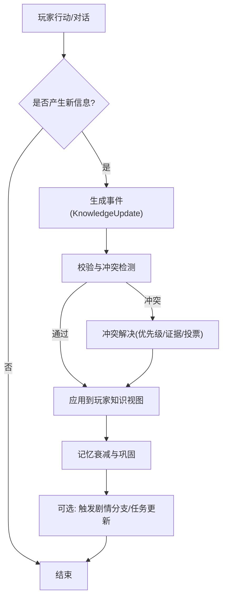

图表来源
- [engine_runtime/events.py](file://engine_runtime/events.py)
- [engine_runtime/state.py](file://engine_runtime/state.py)
- [engine/knowledge.md](file://engine/knowledge.md)

章节来源
- [engine_runtime/events.py](file://engine_runtime/events.py)
- [engine_runtime/state.py](file://engine_runtime/state.py)
- [engine/knowledge.md](file://engine/knowledge.md)

### 知识分类体系与关系建模
- 分类维度
  - 事实/概念/关系/技能/信念/目标/策略
  - 领域：地理、人物、组织、历史、魔法、科技等
- 关系建模
  - 蕴含(A→B)、等价(A↔B)、互斥(A⊕B)
  - 因果(A⇒B)、时序(A先于B)、隶属(A∈B)
- 查询与推理
  - 模式匹配、闭包计算、约束求解

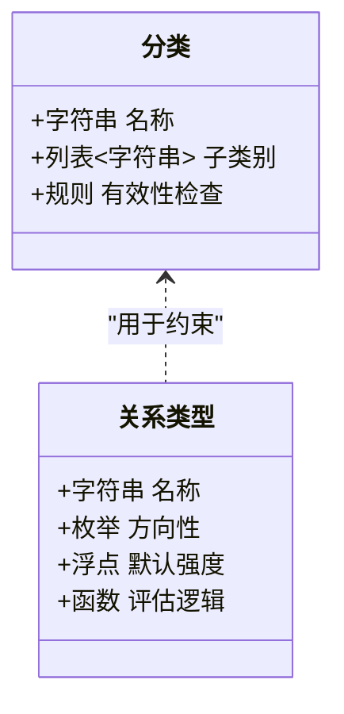

图表来源
- [engine/knowledge.md](file://engine/knowledge.md)
- [engine/base.md](file://engine/base.md)

章节来源
- [engine/knowledge.md](file://engine/knowledge.md)
- [engine/base.md](file://engine/base.md)

### 知识更新规则与传播机制
- 更新规则
  - 来源可信度加权、证据累积、时间衰减、上下文修正
  - 批量更新的事务性与原子性
- 传播机制
  - 近邻传播、层级扩散、兴趣过滤
  - 社交网络拓扑影响传播速度与广度

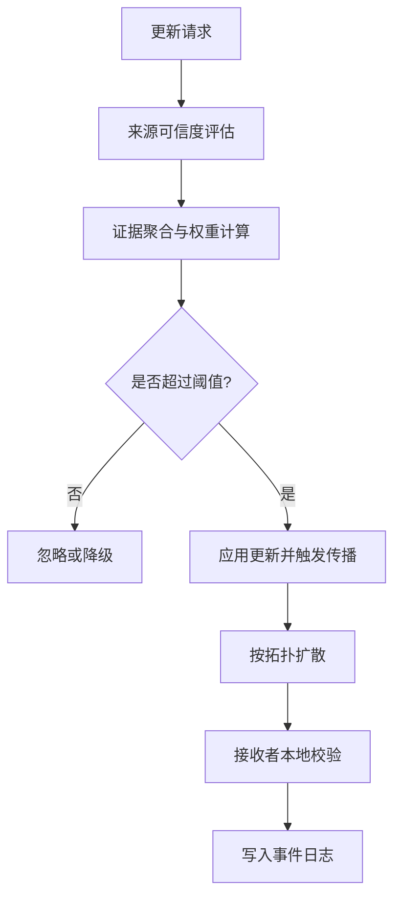

图表来源
- [engine/knowledge.md](file://engine/knowledge.md)
- [engine/social.md](file://engine/social.md)
- [engine/event_sourcing.md](file://engine/event_sourcing.md)

章节来源
- [engine/knowledge.md](file://engine/knowledge.md)
- [engine/social.md](file://engine/social.md)
- [engine/event_sourcing.md](file://engine/event_sourcing.md)

### 与对话生成和剧情分支的集成
- 对话生成
  - 基于知识选择话题、立场、语气
  - 动态生成问题与澄清，避免重复与矛盾
- 剧情分支
  - 知识状态作为分支条件
  - 事件驱动的剧情推进与回溯
- 一致性保障
  - 对话与知识同步校验
  - 分支收敛与状态归一化

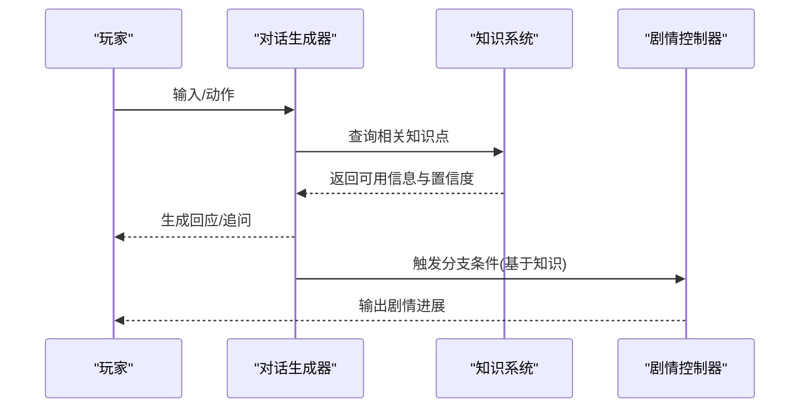

图表来源
- [engine/knowledge.md](file://engine/knowledge.md)
- [engine/base.md](file://engine/base.md)
- [engine_runtime/runtime.py](file://engine_runtime/runtime.py)

章节来源
- [engine/knowledge.md](file://engine/knowledge.md)
- [engine/base.md](file://engine/base.md)
- [engine_runtime/runtime.py](file://engine_runtime/runtime.py)

### 知识验证、冲突解决与一致性保证
- 验证
  - 类型校验、约束检查、来源可信度阈值
  - 跨主体一致性校验
- 冲突解决
  - 证据优先、权威来源、多数共识、时间优先
  - 可解释的冲突报告与人工干预接口
- 一致性
  - 事件溯源保证顺序与可回放
  - 快照+增量事件的双保险

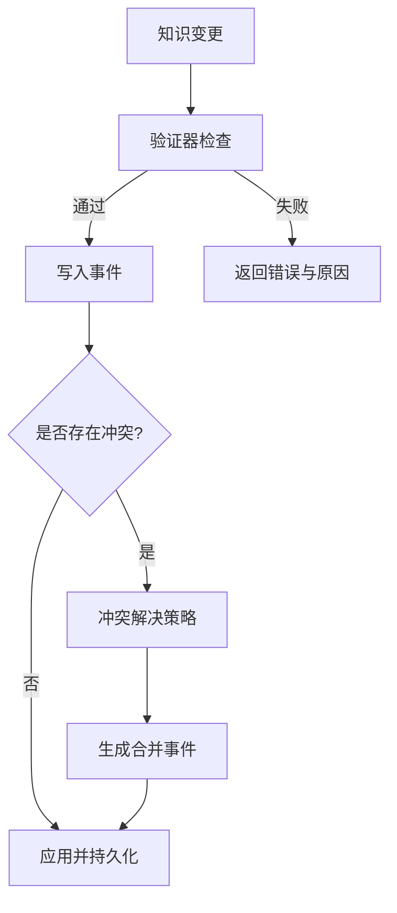

图表来源
- [engine/event_sourcing.md](file://engine/event_sourcing.md)
- [engine/knowledge.md](file://engine/knowledge.md)
- [engine_runtime/events.py](file://engine_runtime/events.py)

章节来源
- [engine/event_sourcing.md](file://engine/event_sourcing.md)
- [engine/knowledge.md](file://engine/knowledge.md)
- [engine_runtime/events.py](file://engine_runtime/events.py)

## 依赖关系分析
- 模块耦合
  - models.py 被 state.py、runtime.py、world_compiler.py 引用
  - events.py 驱动 state.py 的状态演进
  - persistence.py 负责与 YAML 存档双向映射
- 外部依赖
  - YAML 配置与模板
  - 事件日志与审计工具链

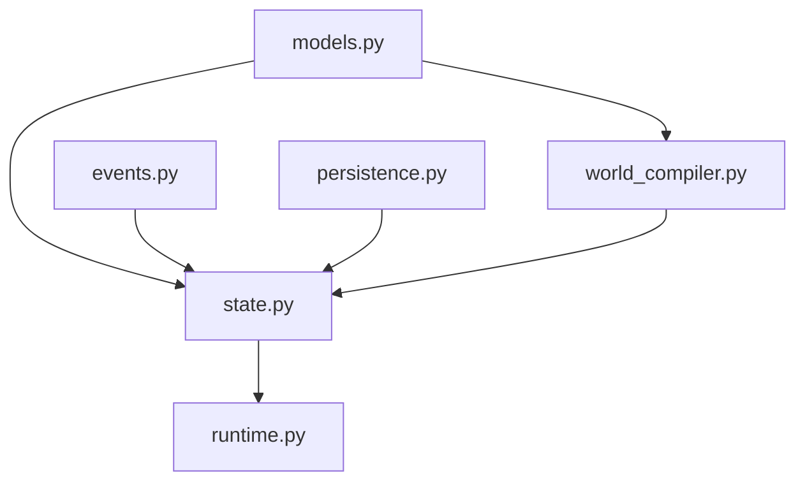

图表来源
- [engine_runtime/models.py](file://engine_runtime/models.py)
- [engine_runtime/state.py](file://engine_runtime/state.py)
- [engine_runtime/events.py](file://engine_runtime/events.py)
- [engine_runtime/runtime.py](file://engine_runtime/runtime.py)
- [engine_runtime/world_compiler.py](file://engine_runtime/world_compiler.py)
- [engine_runtime/persistence.py](file://engine_runtime/persistence.py)

章节来源
- [engine_runtime/models.py](file://engine_runtime/models.py)
- [engine_runtime/state.py](file://engine_runtime/state.py)
- [engine_runtime/events.py](file://engine_runtime/events.py)
- [engine_runtime/runtime.py](file://engine_runtime/runtime.py)
- [engine_runtime/world_compiler.py](file://engine_runtime/world_compiler.py)
- [engine_runtime/persistence.py](file://engine_runtime/persistence.py)

## 性能考量
- 事件批处理与惰性计算
  - 批量应用事件减少状态抖动
  - 按需计算知识闭包与传播边界
- 内存与I/O优化
  - 热点知识缓存、冷数据落盘
  - 增量快照与差异归档
- 推理加速
  - 索引与预计算、规则短路、并行校验

[本节为通用指导，不直接分析具体文件]

## 故障排查指南
- 常见问题
  - 事件序列不一致导致状态异常
  - 知识冲突未正确解决造成对话矛盾
  - 存档加载失败或字段缺失
- 诊断步骤
  - 检查事件日志与审计记录
  - 对比存档与运行时状态差异
  - 启用更严格的验证器与调试日志
- 修复建议
  - 重放事件至冲突点，定位根因
  - 调整冲突解决策略与可信度阈值
  - 补充缺失字段与默认值

章节来源
- [engine/event_sourcing.md](file://engine/event_sourcing.md)
- [engine_runtime/events.py](file://engine_runtime/events.py)
- [engine_runtime/persistence.py](file://engine_runtime/persistence.py)

## 结论
TheGreatNovel 的知识系统以“事件溯源+模型驱动”为核心，结合社交传播与推理机制，支撑NPC智能与玩家体验的动态演化。通过清晰的分类体系、严谨的更新与传播规则、以及完善的验证与一致性保障，系统能够在复杂叙事环境中保持连贯性与可解释性。配合模板与存档机制，开发者可快速扩展知识内容与剧情分支，打造更具沉浸感的互动小说体验。

[本节为总结性内容，不直接分析具体文件]

## 附录

### 配置示例：定义知识实体、设置关系与推理逻辑
- 定义知识实体
  - 在 world_template.yaml 或 runtime_world.yaml 中声明主体、初始知识清单、关系矩阵与阵营
  - 使用标签与分类标注知识类型，便于检索与推理
- 设置关系
  - 在 relationships.yaml 中定义主体间关系类型、强度与方向
  - 通过 factions.yaml 管理群体归属与影响力
- 编写推理逻辑
  - 在 engine/knowledge.md 与 engine/base.md 中约定规则语法与约束
  - 在运行时通过事件与状态机执行规则，产出新的知识或触发剧情

章节来源
- [engine/knowledge.md](file://engine/knowledge.md)
- [engine/base.md](file://engine/base.md)
- [engine_social.md](file://engine/social.md)
- [engine_runtime/world_compiler.py](file://engine_runtime/world_compiler.py)
- [tests/fixtures/runtime_world.yaml](file://tests/fixtures/runtime_world.yaml)
- [templates/save_template/relationships.yaml](file://templates/save_template/relationships.yaml)
- [templates/save_template/factions.yaml](file://templates/save_template/factions.yaml)