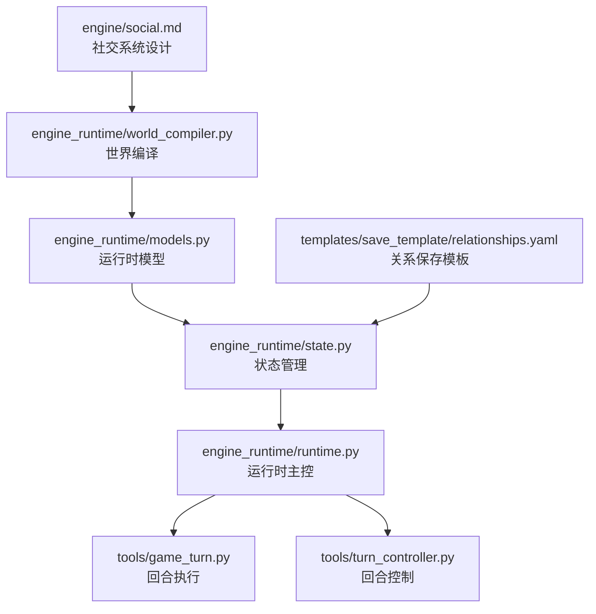
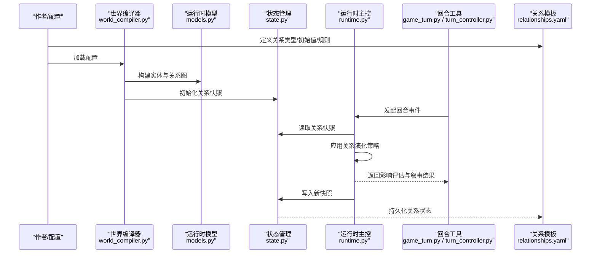
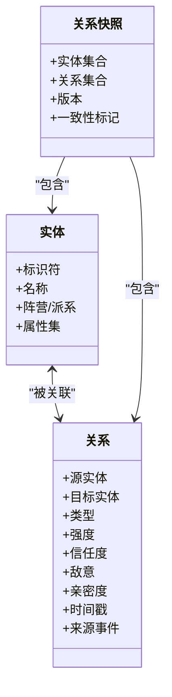
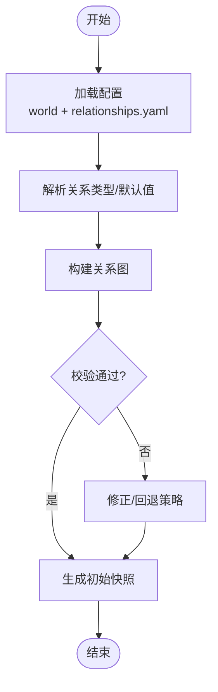
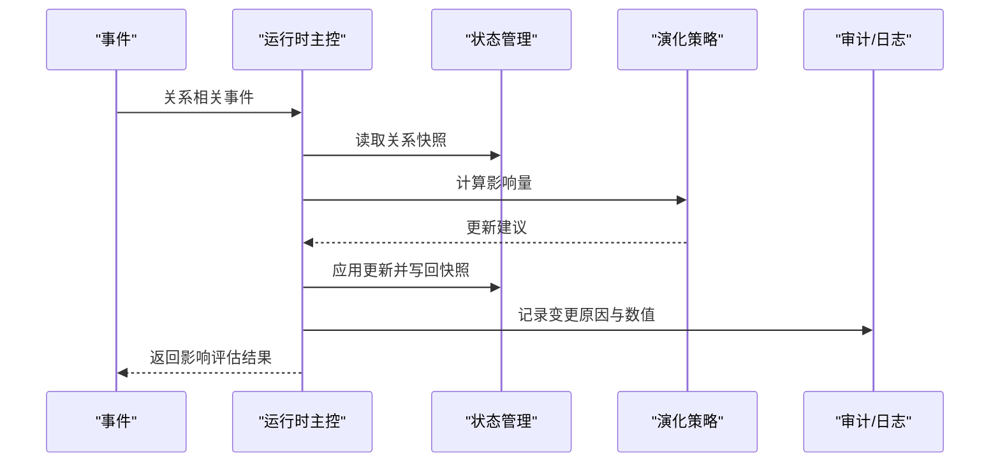
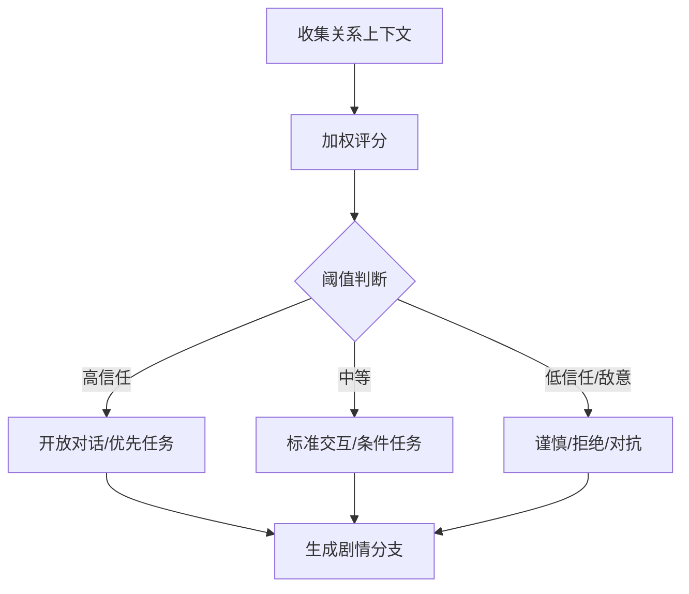
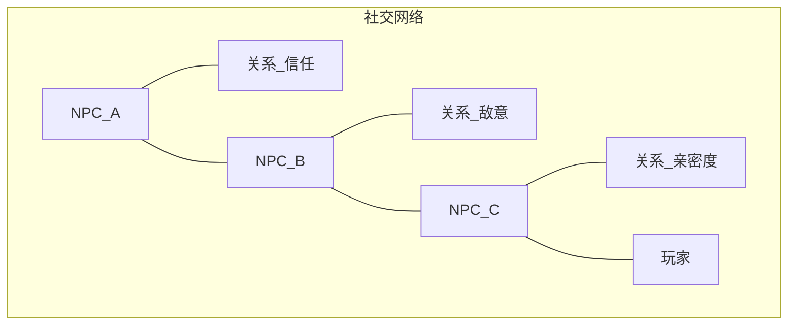
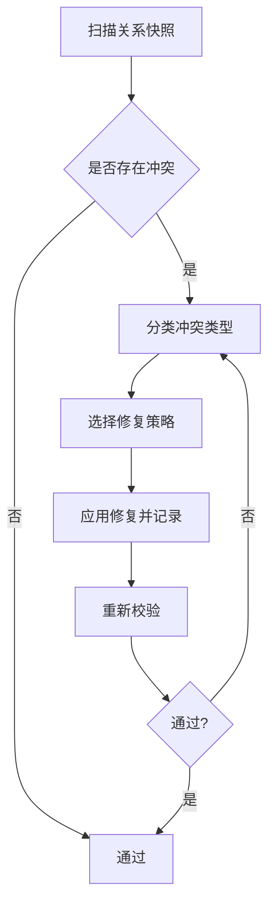
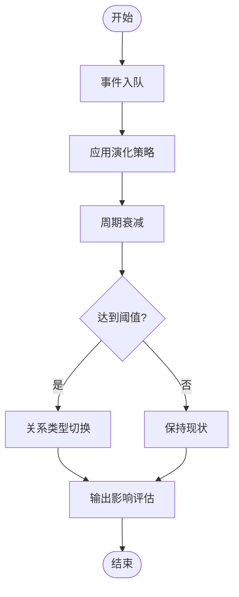
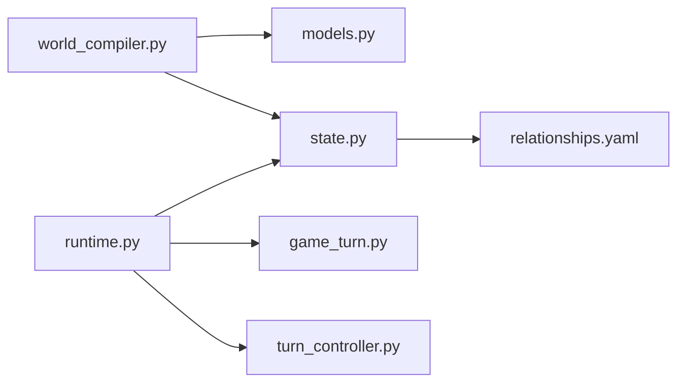

# 社交关系系统

<cite>
**本文引用的文件**   
- [engine/social.md](file://engine/social.md)
- [templates/save_template/relationships.yaml](file://templates/save_template/relationships.yaml)
- [engine_runtime/models.py](file://engine_runtime/models.py)
- [engine_runtime/runtime.py](file://engine_runtime/runtime.py)
- [engine_runtime/state.py](file://engine_runtime/state.py)
- [engine_runtime/world_compiler.py](file://engine_runtime/world_compiler.py)
- [tools/game_turn.py](file://tools/game_turn.py)
- [tools/turn_controller.py](file://tools/turn_controller.py)
</cite>

## 目录
1. [简介](#简介)
2. [项目结构](#项目结构)
3. [核心组件](#核心组件)
4. [架构总览](#架构总览)
5. [详细组件分析](#详细组件分析)
6. [依赖分析](#依赖分析)
7. [性能考虑](#性能考虑)
8. [故障排查指南](#故障排查指南)
9. [结论](#结论)
10. [附录](#附录)

## 简介
本文件为 TheGreatNovel 项目的“社交关系系统”提供系统化、可操作的文档。内容涵盖：
- 社交关系在互动小说中的重要性及设计目标
- 关系类型定义、强度计算与动态演化机制
- NPC 社交网络构建、关系影响评估与基于关系的决策
- 关系数据模型、更新算法与可视化方法
- 配置示例（关系类型、初始值、演化规则）
- 关系对对话、剧情与任务分配的影响
- 冲突检测、修复机制与社交动力学模拟实现要点

## 项目结构
与社交关系系统直接相关的工程位置与职责如下：
- engine/social.md：社交系统的概念设计与规则说明
- templates/save_template/relationships.yaml：关系数据的保存模板，用于序列化/反序列化关系状态
- engine_runtime/models.py：运行时数据模型（实体、关系等）
- engine_runtime/runtime.py：运行时主控制器，协调事件、状态与渲染
- engine_runtime/state.py：世界状态管理（含实体与关系快照）
- engine_runtime/world_compiler.py：世界编译期处理（将配置转换为运行时模型）
- tools/game_turn.py、tools/turn_controller.py：回合工具链，驱动关系演化的触发点

**图表来源** 
- [engine/social.md](file://engine/social.md)
- [engine_runtime/world_compiler.py](file://engine_runtime/world_compiler.py)
- [engine_runtime/models.py](file://engine_runtime/models.py)
- [engine_runtime/state.py](file://engine_runtime/state.py)
- [engine_runtime/runtime.py](file://engine_runtime/runtime.py)
- [tools/game_turn.py](file://tools/game_turn.py)
- [tools/turn_controller.py](file://tools/turn_controller.py)
- [templates/save_template/relationships.yaml](file://templates/save_template/relationships.yaml)

**章节来源**
- [engine/social.md](file://engine/social.md)
- [engine_runtime/world_compiler.py](file://engine_runtime/world_compiler.py)
- [engine_runtime/models.py](file://engine_runtime/models.py)
- [engine_runtime/state.py](file://engine_runtime/state.py)
- [engine_runtime/runtime.py](file://engine_runtime/runtime.py)
- [tools/game_turn.py](file://tools/game_turn.py)
- [tools/turn_controller.py](file://tools/turn_controller.py)
- [templates/save_template/relationships.yaml](file://templates/save_template/relationships.yaml)

## 核心组件
- 关系数据模型：以实体（NPC/玩家）为节点、以关系类型为边，承载强度、方向性与时间戳等属性，支持持久化与回放。
- 世界编译：将 YAML 配置（如 relationships.yaml）编译为运行时模型，建立初始社交网络。
- 状态管理：维护当前关系快照，支持增量更新与一致性校验。
- 运行时主控：编排事件、调用关系更新策略、驱动对话与剧情分支。
- 回合工具：在每回合中触发关系演化、评估影响并生成叙事输出。

**章节来源**
- [engine_runtime/models.py](file://engine_runtime/models.py)
- [engine_runtime/world_compiler.py](file://engine_runtime/world_compiler.py)
- [engine_runtime/state.py](file://engine_runtime/state.py)
- [engine_runtime/runtime.py](file://engine_runtime/runtime.py)
- [tools/game_turn.py](file://tools/game_turn.py)
- [tools/turn_controller.py](file://tools/turn_controller.py)
- [templates/save_template/relationships.yaml](file://templates/save_template/relationships.yaml)

## 架构总览
下图展示从配置到运行时的关系系统数据流与控制流：

**图表来源** 
- [engine_runtime/world_compiler.py](file://engine_runtime/world_compiler.py)
- [engine_runtime/models.py](file://engine_runtime/models.py)
- [engine_runtime/state.py](file://engine_runtime/state.py)
- [engine_runtime/runtime.py](file://engine_runtime/runtime.py)
- [tools/game_turn.py](file://tools/game_turn.py)
- [tools/turn_controller.py](file://tools/turn_controller.py)
- [templates/save_template/relationships.yaml](file://templates/save_template/relationships.yaml)

## 详细组件分析

### 关系数据模型与持久化
- 模型要素
  - 实体：NPC、玩家等角色
  - 关系：有向边，包含类型、强度、信任度、敌意、亲密度等维度
  - 元数据：创建/更新时间、来源事件、权重系数
- 持久化
  - 使用 relationships.yaml 作为保存模板，确保关系状态可回溯、可重放
  - 支持批量导出/导入，便于调试与平衡性调整

**图表来源** 
- [engine_runtime/models.py](file://engine_runtime/models.py)
- [engine_runtime/state.py](file://engine_runtime/state.py)
- [templates/save_template/relationships.yaml](file://templates/save_template/relationships.yaml)

**章节来源**
- [engine_runtime/models.py](file://engine_runtime/models.py)
- [engine_runtime/state.py](file://engine_runtime/state.py)
- [templates/save_template/relationships.yaml](file://templates/save_template/relationships.yaml)

### 世界编译与初始关系构建
- 输入：world 配置与 relationships.yaml
- 过程：
  - 解析关系类型与默认参数
  - 根据配置生成初始关系图
  - 校验约束（自环、重复边、非法类型）
- 输出：运行时模型与初始快照

**图表来源** 
- [engine_runtime/world_compiler.py](file://engine_runtime/world_compiler.py)
- [templates/save_template/relationships.yaml](file://templates/save_template/relationships.yaml)

**章节来源**
- [engine_runtime/world_compiler.py](file://engine_runtime/world_compiler.py)
- [templates/save_template/relationships.yaml](file://templates/save_template/relationships.yaml)

### 运行时关系更新与演化
- 触发点：事件系统（对话、行动、任务完成/失败、阵营变动等）
- 更新策略：
  - 增量调整强度/信任/敌意/亲密度
  - 阈值判定触发关系类型转换（如中立→友好/敌对）
  - 衰减与记忆效应（随时间弱化或强化）
- 一致性：快照版本化，支持回滚与审计

**图表来源** 
- [engine_runtime/runtime.py](file://engine_runtime/runtime.py)
- [engine_runtime/state.py](file://engine_runtime/state.py)

**章节来源**
- [engine_runtime/runtime.py](file://engine_runtime/runtime.py)
- [engine_runtime/state.py](file://engine_runtime/state.py)

### 基于关系的决策系统与剧情影响
- 决策依据：关系强度、信任度、历史交互、阵营一致性
- 影响范围：
  - 对话内容：语气、信息开放度、是否透露关键线索
  - 剧情分支：联盟、背叛、合作任务解锁
  - 任务分配：可信度决定任务优先级与成功率
- 评估流程：
  - 收集关系上下文
  - 加权评分
  - 阈值映射到行为策略

**图表来源** 
- [engine_runtime/runtime.py](file://engine_runtime/runtime.py)
- [tools/game_turn.py](file://tools/game_turn.py)
- [tools/turn_controller.py](file://tools/turn_controller.py)

**章节来源**
- [engine_runtime/runtime.py](file://engine_runtime/runtime.py)
- [tools/game_turn.py](file://tools/game_turn.py)
- [tools/turn_controller.py](file://tools/turn_controller.py)

### 社交网络构建与可视化
- 网络构建：以实体为节点、关系为边，支持多关系类型叠加
- 可视化方法：
  - 邻接表/矩阵表示，便于计算连通性与中心性
  - 力导向布局展示群体结构与聚类
  - 颜色/粗细编码关系强度与类型
- 用途：发现孤立角色、识别关键枢纽、辅助平衡性调优

**图表来源** 
- [engine_runtime/models.py](file://engine_runtime/models.py)
- [engine_runtime/state.py](file://engine_runtime/state.py)

**章节来源**
- [engine_runtime/models.py](file://engine_runtime/models.py)
- [engine_runtime/state.py](file://engine_runtime/state.py)

### 冲突检测与修复机制
- 冲突类型：
  - 逻辑冲突：同一对实体存在互斥关系类型
  - 数值冲突：强度超出合理区间或突变过大
  - 时序冲突：事件顺序导致不一致的快照
- 修复策略：
  - 自动归一化（裁剪、平滑、衰减）
  - 人工干预接口（编辑器/脚本）
  - 回滚到上一稳定快照

**图表来源** 
- [engine_runtime/state.py](file://engine_runtime/state.py)
- [engine_runtime/runtime.py](file://engine_runtime/runtime.py)

**章节来源**
- [engine_runtime/state.py](file://engine_runtime/state.py)
- [engine_runtime/runtime.py](file://engine_runtime/runtime.py)

### 社交动力学模拟
- 核心思想：关系变化遵循“刺激—反应—记忆—衰减”的动态过程
- 关键参数：
  - 刺激强度（事件影响力）
  - 记忆系数（历史累积）
  - 衰减率（随时间回归基线）
  - 阈值函数（关系类型切换）
- 模拟步骤：
  - 事件入队
  - 按序应用策略
  - 周期性衰减与再平衡
  - 输出影响评估与叙事文本

**图表来源** 
- [engine_runtime/runtime.py](file://engine_runtime/runtime.py)
- [tools/game_turn.py](file://tools/game_turn.py)

**章节来源**
- [engine_runtime/runtime.py](file://engine_runtime/runtime.py)
- [tools/game_turn.py](file://tools/game_turn.py)

## 依赖分析
- 模块耦合
  - world_compiler 依赖 models 与 state，负责构建与初始化
  - runtime 依赖 state 与策略，负责事件驱动的关系更新
  - game_turn/turn_controller 作为入口，驱动 runtime 执行回合
  - relationships.yaml 作为数据契约，贯穿编译与持久化
- 外部依赖
  - 事件系统（由运行时编排）
  - 审计/日志（用于追踪关系变更）

**图表来源** 
- [engine_runtime/world_compiler.py](file://engine_runtime/world_compiler.py)
- [engine_runtime/models.py](file://engine_runtime/models.py)
- [engine_runtime/state.py](file://engine_runtime/state.py)
- [engine_runtime/runtime.py](file://engine_runtime/runtime.py)
- [tools/game_turn.py](file://tools/game_turn.py)
- [tools/turn_controller.py](file://tools/turn_controller.py)
- [templates/save_template/relationships.yaml](file://templates/save_template/relationships.yaml)

**章节来源**
- [engine_runtime/world_compiler.py](file://engine_runtime/world_compiler.py)
- [engine_runtime/models.py](file://engine_runtime/models.py)
- [engine_runtime/state.py](file://engine_runtime/state.py)
- [engine_runtime/runtime.py](file://engine_runtime/runtime.py)
- [tools/game_turn.py](file://tools/game_turn.py)
- [tools/turn_controller.py](file://tools/turn_controller.py)
- [templates/save_template/relationships.yaml](file://templates/save_template/relationships.yaml)

## 性能考虑
- 复杂度控制
  - 关系更新采用增量计算，避免全量重算
  - 使用邻接表提升遍历效率，限制每回合最大更新边数
- 内存与持久化
  - 快照差分存储，减少 I/O 压力
  - 定期压缩历史快照，保留关键节点
- 并发与线程安全
  - 状态读写加锁或不可变快照，保证一致性
- 可观测性
  - 审计日志与指标采集，定位热点关系与瓶颈

[本节为通用指导，不直接分析具体文件]

## 故障排查指南
- 常见问题
  - 关系数值异常：检查阈值与衰减参数、事件权重
  - 关系类型未切换：确认阈值函数与记忆系数
  - 快照不一致：核对版本与回滚策略
- 诊断步骤
  - 查看关系审计日志，定位最近一次变更
  - 对比前后快照，确认差异是否符合预期
  - 复现最小用例，逐步缩小问题范围
- 修复手段
  - 调整策略参数并重跑
  - 使用编辑器修正关系数据
  - 回滚至稳定快照后重试

**章节来源**
- [engine_runtime/state.py](file://engine_runtime/state.py)
- [engine_runtime/runtime.py](file://engine_runtime/runtime.py)

## 结论
TheGreatNovel 的社交关系系统以清晰的数据模型与稳健的运行时编排为核心，结合世界编译与持久化模板，实现了从配置到叙事的完整闭环。通过增量更新、阈值切换、衰减记忆与冲突修复，系统在保持性能的同时提供了丰富的社交动力学表现，能够有效驱动对话、剧情与任务分配，增强互动小说的可玩性与沉浸感。

[本节为总结性内容，不直接分析具体文件]

## 附录

### 配置示例（关系类型、初始值、演化规则）
- 关系类型定义
  - 字段建议：类型名、默认强度、信任基线、敌意基线、亲密度基线、切换阈值、衰减率
  - 参考位置：[engine/social.md](file://engine/social.md)、[templates/save_template/relationships.yaml](file://templates/save_template/relationships.yaml)
- 初始关系值
  - 字段建议：源实体、目标实体、关系类型、强度、信任、敌意、亲密度、来源事件
  - 参考位置：[templates/save_template/relationships.yaml](file://templates/save_template/relationships.yaml)
- 演化规则
  - 字段建议：触发事件、影响权重、记忆系数、衰减率、阈值函数、副作用
  - 参考位置：[engine/social.md](file://engine/social.md)、[engine_runtime/runtime.py](file://engine_runtime/runtime.py)

**章节来源**
- [engine/social.md](file://engine/social.md)
- [templates/save_template/relationships.yaml](file://templates/save_template/relationships.yaml)
- [engine_runtime/runtime.py](file://engine_runtime/runtime.py)