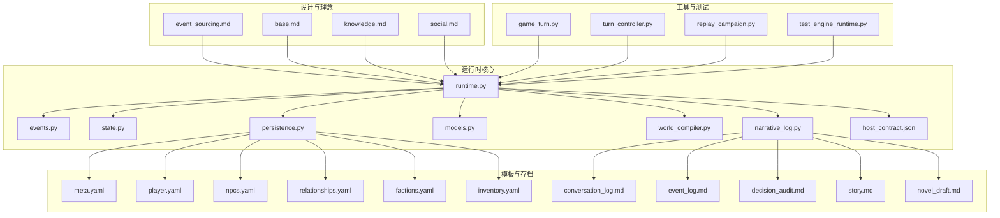
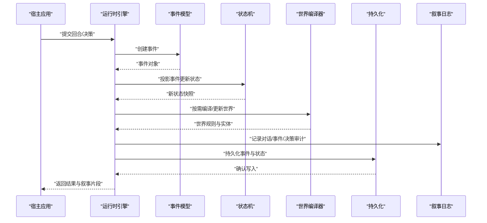
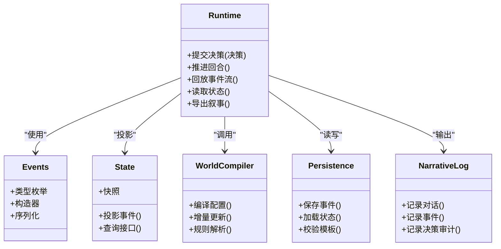
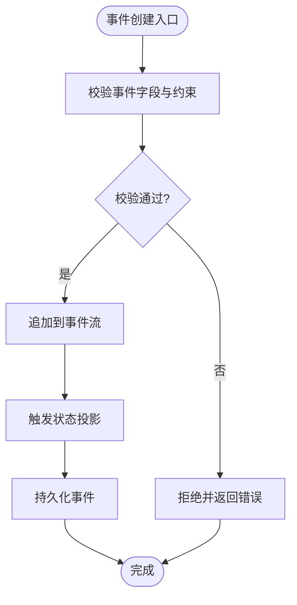
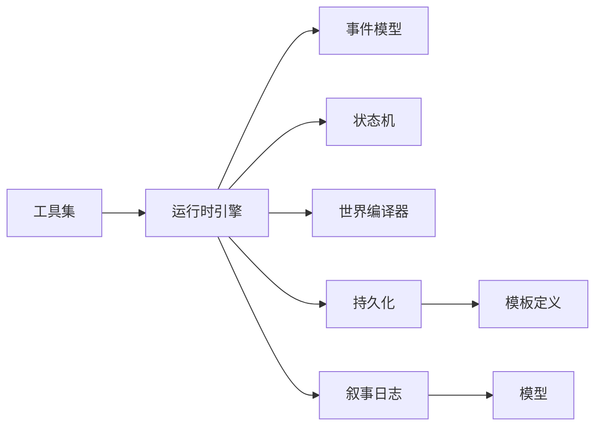

# 项目介绍

<cite>
**本文引用的文件**   
- [engine/event_sourcing.md](file://engine/event_sourcing.md)
- [engine/base.md](file://engine/base.md)
- [engine/knowledge.md](file://engine/knowledge.md)
- [engine/social.md](file://engine/social.md)
- [engine_runtime/README.md](file://engine_runtime/README.md)
- [engine_runtime/runtime.py](file://engine_runtime/runtime.py)
- [engine_runtime/events.py](file://engine_runtime/events.py)
- [engine_runtime/state.py](file://engine_runtime/state.py)
- [engine_runtime/persistence.py](file://engine_runtime/persistence.py)
- [engine_runtime/models.py](file://engine_runtime/models.py)
- [engine_runtime/world_compiler.py](file://engine_runtime/world_compiler.py)
- [engine_runtime/narrative_log.py](file://engine_runtime/narrative_log.py)
- [engine_runtime/host_contract.json](file://engine_runtime/host_contract.json)
- [templates/save_template/meta.yaml](file://templates/save_template/meta.yaml)
- [templates/save_template/player.yaml](file://templates/save_template/player.yaml)
- [templates/save_template/npcs.yaml](file://templates/save_template/npcs.yaml)
- [templates/save_template/relationships.yaml](file://templates/save_template/relationships.yaml)
- [templates/save_template/factions.yaml](file://templates/save_template/factions.yaml)
- [templates/save_template/inventory.yaml](file://templates/save_template/inventory.yaml)
- [templates/save_template/conversation_log.md](file://templates/save_template/conversation_log.md)
- [templates/save_template/event_log.md](file://templates/save_template/event_log.md)
- [templates/save_template/decision_audit.md](file://templates/save_template/decision_audit.md)
- [templates/save_template/story.md](file://templates/save_template/story.md)
- [templates/save_template/novel_draft.md](file://templates/save_template/novel_draft.md)
- [tools/game_turn.py](file://tools/game_turn.py)
- [tools/turn_controller.py](file://tools/turn_controller.py)
- [tools/replay_campaign.py](file://tools/replay_campaign.py)
- [tests/test_engine_runtime.py](file://tests/test_engine_runtime.py)
</cite>

## 目录
1. [引言](#引言)
2. [项目结构](#项目结构)
3. [核心组件](#核心组件)
4. [架构总览](#架构总览)
5. [详细组件分析](#详细组件分析)
6. [依赖关系分析](#依赖关系分析)
7. [性能考量](#性能考量)
8. [故障排查指南](#故障排查指南)
9. [结论](#结论)
10. [附录](#附录)

## 引言
TheGreatNovel 是一个基于事件溯源的互动小说引擎，旨在为“玩家决策影响剧情发展、NPC智能交互、关系系统管理与叙事内容生成”提供统一的技术底座。其核心价值在于：
- 以不可变事件作为唯一事实来源，确保故事演进可审计、可回放、可调试；
- 将世界状态与叙事表达解耦，支持多端呈现（文本、图形、语音等）；
- 通过结构化模板与运行时模型，降低创作门槛并提升内容一致性；
- 提供工具链与测试能力，支撑从开发到运维的全生命周期管理。

目标用户包括：
- 互动叙事创作者与游戏设计师：快速构建分支剧情与角色行为；
- 平台开发者：集成事件驱动的故事引擎，实现跨平台发布；
- 研究者与教育者：利用事件日志进行叙事分析与教学演示。

设计理念与创新点：
- 事件溯源优先：所有变更以事件形式持久化，便于回溯与重放；
- 世界编译与状态投影：世界配置经编译器产出高效状态，投影层负责渲染叙事；
- 关系与派系建模：内置关系系统与派系机制，增强社会性叙事复杂度；
- 强契约与可验证性：主机契约与保存模板保证数据一致性与可移植性。

## 项目结构
项目采用分层与职责分离的组织方式：
- engine：概念与设计文档，阐述事件溯源、知识体系与社会关系等设计思想；
- engine_runtime：运行时核心，包含事件模型、状态机、持久化、世界编译、叙事日志与协议契约；
- templates：保存与世界的模板定义，规范存档结构与元数据；
- tools：命令行工具，用于回合控制、回放、审计与校验；
- tests：单元测试与夹具，保障运行时稳定性。

图表来源
- [engine/event_sourcing.md](file://engine/event_sourcing.md)
- [engine/base.md](file://engine/base.md)
- [engine/knowledge.md](file://engine/knowledge.md)
- [engine/social.md](file://engine/social.md)
- [engine_runtime/runtime.py](file://engine_runtime/runtime.py)
- [engine_runtime/events.py](file://engine_runtime/events.py)
- [engine_runtime/state.py](file://engine_runtime/state.py)
- [engine_runtime/persistence.py](file://engine_runtime/persistence.py)
- [engine_runtime/models.py](file://engine_runtime/models.py)
- [engine_runtime/world_compiler.py](file://engine_runtime/world_compiler.py)
- [engine_runtime/narrative_log.py](file://engine_runtime/narrative_log.py)
- [engine_runtime/host_contract.json](file://engine_runtime/host_contract.json)
- [templates/save_template/meta.yaml](file://templates/save_template/meta.yaml)
- [templates/save_template/player.yaml](file://templates/save_template/player.yaml)
- [templates/save_template/npcs.yaml](file://templates/save_template/npcs.yaml)
- [templates/save_template/relationships.yaml](file://templates/save_template/relationships.yaml)
- [templates/save_template/factions.yaml](file://templates/save_template/factions.yaml)
- [templates/save_template/inventory.yaml](file://templates/save_template/inventory.yaml)
- [templates/save_template/conversation_log.md](file://templates/save_template/conversation_log.md)
- [templates/save_template/event_log.md](file://templates/save_template/event_log.md)
- [templates/save_template/decision_audit.md](file://templates/save_template/decision_audit.md)
- [templates/save_template/story.md](file://templates/save_template/story.md)
- [templates/save_template/novel_draft.md](file://templates/save_template/novel_draft.md)
- [tools/game_turn.py](file://tools/game_turn.py)
- [tools/turn_controller.py](file://tools/turn_controller.py)
- [tools/replay_campaign.py](file://tools/replay_campaign.py)
- [tests/test_engine_runtime.py](file://tests/test_engine_runtime.py)

章节来源
- [engine_runtime/README.md](file://engine_runtime/README.md)

## 核心组件
- 运行时引擎（Runtime）：协调事件处理、状态更新、世界编译与叙事输出，是系统的中枢控制器。
- 事件模型（Events）：定义不可变事件类型与语义，承载一切状态变更的事实。
- 状态机（State）：维护当前世界快照，由事件流投影生成，供查询与呈现。
- 持久化（Persistence）：负责事件与状态的序列化、存储与恢复，遵循模板约定。
- 模型（Models）：描述实体、关系、派系、库存等数据结构，贯穿运行期与存档。
- 世界编译（World Compiler）：将模板化的世界配置编译为运行时可用的状态与规则。
- 叙事日志（Narrative Log）：记录对话、事件与决策审计，形成可读的叙事轨迹。
- 主机契约（Host Contract）：定义引擎对外暴露的能力边界与数据格式，确保宿主环境兼容。

章节来源
- [engine_runtime/runtime.py](file://engine_runtime/runtime.py)
- [engine_runtime/events.py](file://engine_runtime/events.py)
- [engine_runtime/state.py](file://engine_runtime/state.py)
- [engine_runtime/persistence.py](file://engine_runtime/persistence.py)
- [engine_runtime/models.py](file://engine_runtime/models.py)
- [engine_runtime/world_compiler.py](file://engine_runtime/world_compiler.py)
- [engine_runtime/narrative_log.py](file://engine_runtime/narrative_log.py)
- [engine_runtime/host_contract.json](file://engine_runtime/host_contract.json)

## 架构总览
系统采用“事件溯源 + 状态投影 + 世界编译 + 叙事输出”的分层架构。运行时接收输入（玩家决策、外部事件），产生事件并追加到事件流；状态机消费事件流生成当前快照；世界编译器根据模板与规则生成或更新世界配置；叙事日志将关键过程转化为可读文本；持久化层将事件与状态落盘，遵循模板约定；主机契约约束接口，使引擎可嵌入不同宿主。

图表来源
- [engine_runtime/runtime.py](file://engine_runtime/runtime.py)
- [engine_runtime/events.py](file://engine_runtime/events.py)
- [engine_runtime/state.py](file://engine_runtime/state.py)
- [engine_runtime/world_compiler.py](file://engine_runtime/world_compiler.py)
- [engine_runtime/persistence.py](file://engine_runtime/persistence.py)
- [engine_runtime/narrative_log.py](file://engine_runtime/narrative_log.py)

## 详细组件分析

### 运行时引擎（Runtime）
- 职责：编排事件生产、状态投影、世界编译与叙事输出；提供回合推进与回放能力；对接主机契约。
- 关键点：事件不可变性、状态幂等投影、世界配置的增量更新、日志的可读性与可审计性。

图表来源
- [engine_runtime/runtime.py](file://engine_runtime/runtime.py)
- [engine_runtime/events.py](file://engine_runtime/events.py)
- [engine_runtime/state.py](file://engine_runtime/state.py)
- [engine_runtime/world_compiler.py](file://engine_runtime/world_compiler.py)
- [engine_runtime/persistence.py](file://engine_runtime/persistence.py)
- [engine_runtime/narrative_log.py](file://engine_runtime/narrative_log.py)

章节来源
- [engine_runtime/runtime.py](file://engine_runtime/runtime.py)
- [engine_runtime/host_contract.json](file://engine_runtime/host_contract.json)

### 事件模型（Events）
- 职责：定义不可变事件类型、字段与语义；提供序列化与反序列化工具；确保事件追加顺序与一致性。
- 关键点：事件即事实，禁止修改；事件版本与兼容性策略；事件去重与幂等处理。

图表来源
- [engine_runtime/events.py](file://engine_runtime/events.py)
- [engine_runtime/persistence.py](file://engine_runtime/persistence.py)
- [engine_runtime/state.py](file://engine_runtime/state.py)

章节来源
- [engine_runtime/events.py](file://engine_runtime/events.py)

### 状态机（State）
- 职责：维护世界快照，提供查询接口；通过事件流投影生成最新状态；支持快照与增量更新。
- 关键点：投影函数幂等；状态一致性检查；快照压缩与回滚策略。

章节来源
- [engine_runtime/state.py](file://engine_runtime/state.py)

### 持久化（Persistence）
- 职责：事件与状态的序列化、存储与恢复；遵循模板约定进行校验与迁移。
- 关键点：模板驱动的存档结构；事件追加写与状态快照分离；完整性校验与容错恢复。

章节来源
- [engine_runtime/persistence.py](file://engine_runtime/persistence.py)
- [templates/save_template/meta.yaml](file://templates/save_template/meta.yaml)
- [templates/save_template/player.yaml](file://templates/save_template/player.yaml)
- [templates/save_template/npcs.yaml](file://templates/save_template/npcs.yaml)
- [templates/save_template/relationships.yaml](file://templates/save_template/relationships.yaml)
- [templates/save_template/factions.yaml](file://templates/save_template/factions.yaml)
- [templates/save_template/inventory.yaml](file://templates/save_template/inventory.yaml)

### 模型（Models）
- 职责：定义实体、关系、派系、库存等数据结构；贯穿运行期与存档；提供校验与转换工具。
- 关键点：模型与模板映射；版本兼容与迁移路径；数据完整性约束。

章节来源
- [engine_runtime/models.py](file://engine_runtime/models.py)

### 世界编译器（World Compiler）
- 职责：将模板化的世界配置编译为运行时可用规则与实体；支持增量更新与冲突解决。
- 关键点：模板解析与验证；规则优先级与合并策略；编译产物缓存。

章节来源
- [engine_runtime/world_compiler.py](file://engine_runtime/world_compiler.py)

### 叙事日志（Narrative Log）
- 职责：记录对话、事件与决策审计；生成可读的叙事轨迹；支持回放与审计。
- 关键点：日志条目标准化；时间戳与上下文关联；可读性与可检索性。

章节来源
- [engine_runtime/narrative_log.py](file://engine_runtime/narrative_log.py)
- [templates/save_template/conversation_log.md](file://templates/save_template/conversation_log.md)
- [templates/save_template/event_log.md](file://templates/save_template/event_log.md)
- [templates/save_template/decision_audit.md](file://templates/save_template/decision_audit.md)
- [templates/save_template/story.md](file://templates/save_template/story.md)
- [templates/save_template/novel_draft.md](file://templates/save_template/novel_draft.md)

## 依赖关系分析
运行时核心模块之间的耦合度较低，职责清晰：
- Runtime 依赖 Events、State、WorldCompiler、Persistence、NarrativeLog；
- Persistence 依赖模板与 Models；
- NarrativeLog 依赖 Models 与模板；
- Tools 依赖 Runtime 提供的高阶接口。

图表来源
- [engine_runtime/runtime.py](file://engine_runtime/runtime.py)
- [engine_runtime/events.py](file://engine_runtime/events.py)
- [engine_runtime/state.py](file://engine_runtime/state.py)
- [engine_runtime/world_compiler.py](file://engine_runtime/world_compiler.py)
- [engine_runtime/persistence.py](file://engine_runtime/persistence.py)
- [engine_runtime/narrative_log.py](file://engine_runtime/narrative_log.py)
- [engine_runtime/models.py](file://engine_runtime/models.py)
- [tools/game_turn.py](file://tools/game_turn.py)
- [tools/turn_controller.py](file://tools/turn_controller.py)
- [tools/replay_campaign.py](file://tools/replay_campaign.py)

章节来源
- [tests/test_engine_runtime.py](file://tests/test_engine_runtime.py)

## 性能考量
- 事件追加写：事件流采用追加模式，避免随机写开销，适合高吞吐场景；
- 状态投影优化：投影函数应幂等且尽量无副作用，必要时引入快照与增量合并；
- 世界编译缓存：编译产物缓存可减少重复计算，提高回合推进速度；
- 日志批处理：叙事日志批量写入，减少IO抖动；
- 内存管理：大事件流可采用分段存储与懒加载，避免一次性载入全部历史。

[本节为通用指导，不直接分析具体文件]

## 故障排查指南
常见问题与定位方法：
- 事件不一致：检查事件追加顺序与版本兼容性，核对持久化完整性；
- 状态投影异常：确认投影函数的幂等性与约束校验，查看状态快照差异；
- 世界编译失败：检查模板语法与规则冲突，查看编译日志与错误堆栈；
- 叙事日志缺失：确认日志记录路径与权限，核对模板字段映射；
- 回放失败：验证事件流完整性与回放器的兼容性，检查时间戳与上下文。

章节来源
- [engine_runtime/persistence.py](file://engine_runtime/persistence.py)
- [engine_runtime/state.py](file://engine_runtime/state.py)
- [engine_runtime/world_compiler.py](file://engine_runtime/world_compiler.py)
- [engine_runtime/narrative_log.py](file://engine_runtime/narrative_log.py)
- [tools/validate_save.py](file://tools/validate_save.py)
- [tools/verify_projection.py](file://tools/verify_projection.py)

## 结论
TheGreatNovel 以事件溯源为核心，结合世界编译与叙事日志，构建了可扩展、可审计、可回放的互动小说引擎。其设计哲学强调“事实不可变、状态可投影、叙事可表达”，为创作者与平台开发者提供了强大的技术基础。通过模板化与工具链，项目降低了内容创作与工程集成的门槛，适用于分支剧情、NPC智能交互、关系管理与叙事生成的多种应用场景。

[本节为总结，不直接分析具体文件]

## 附录
- 设计文档：事件溯源、基础知识、社会关系等理念详见 engine 目录；
- 运行时说明：engine_runtime 提供完整实现与接口契约；
- 模板规范：templates 定义存档与世界结构的标准化格式；
- 工具链：tools 提供回合控制、回放、审计与校验能力；
- 测试用例：tests 保障运行时稳定性与兼容性。

章节来源
- [engine/event_sourcing.md](file://engine/event_sourcing.md)
- [engine/base.md](file://engine/base.md)
- [engine/knowledge.md](file://engine/knowledge.md)
- [engine/social.md](file://engine/social.md)
- [engine_runtime/README.md](file://engine_runtime/README.md)
- [tools/game_turn.py](file://tools/game_turn.py)
- [tools/turn_controller.py](file://tools/turn_controller.py)
- [tools/replay_campaign.py](file://tools/replay_campaign.py)
- [tests/test_engine_runtime.py](file://tests/test_engine_runtime.py)