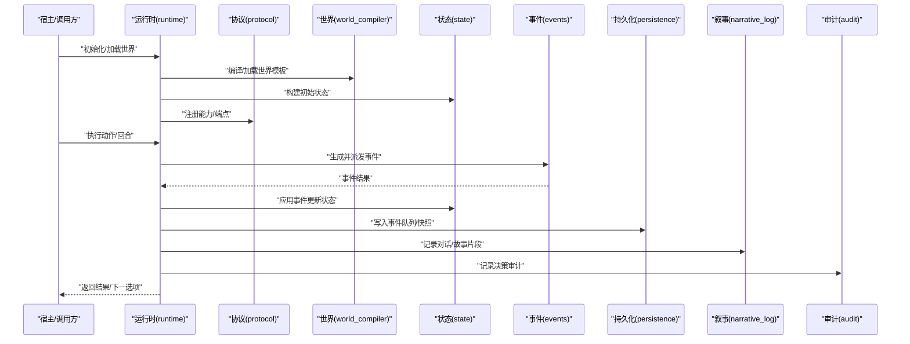
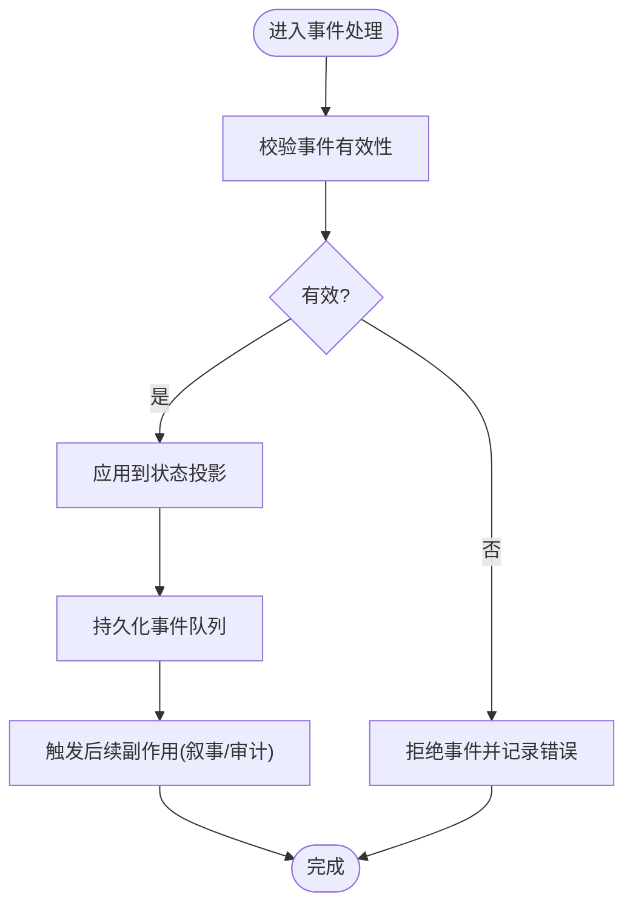
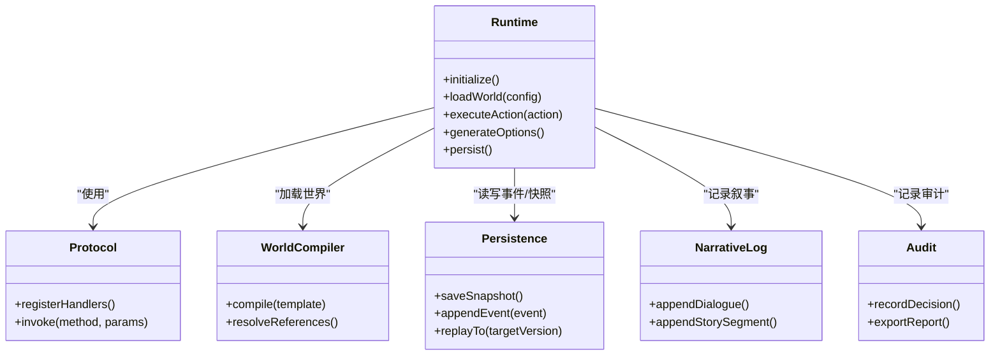
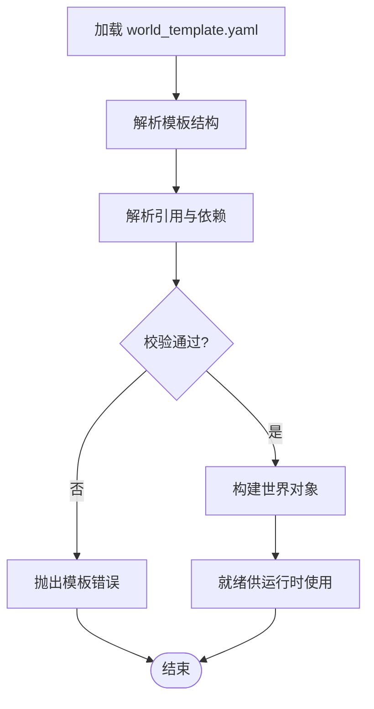
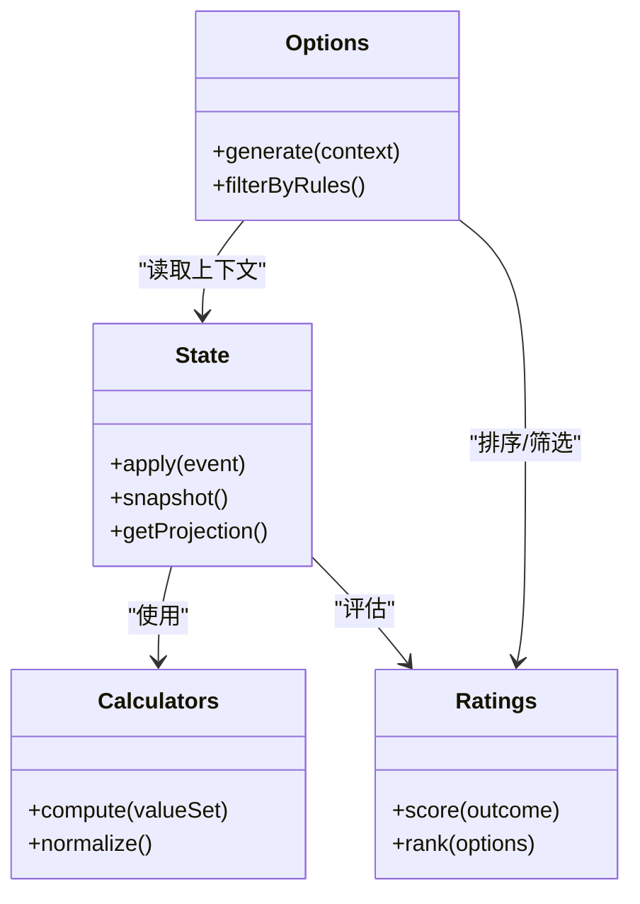
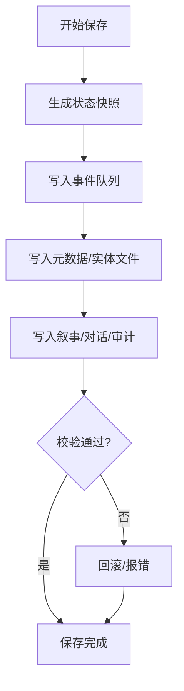
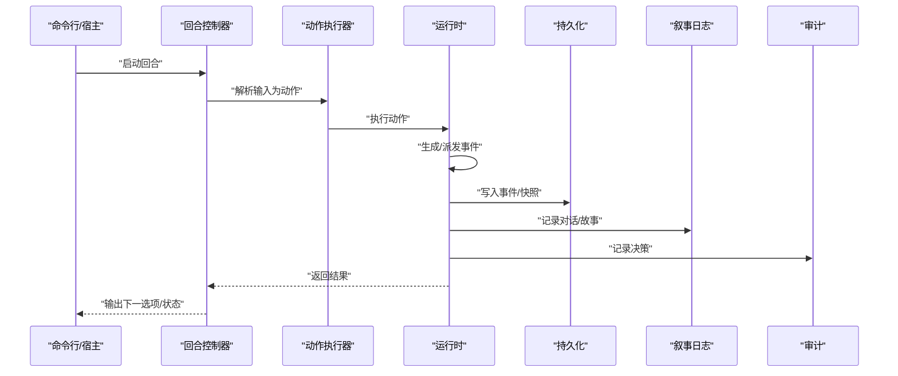
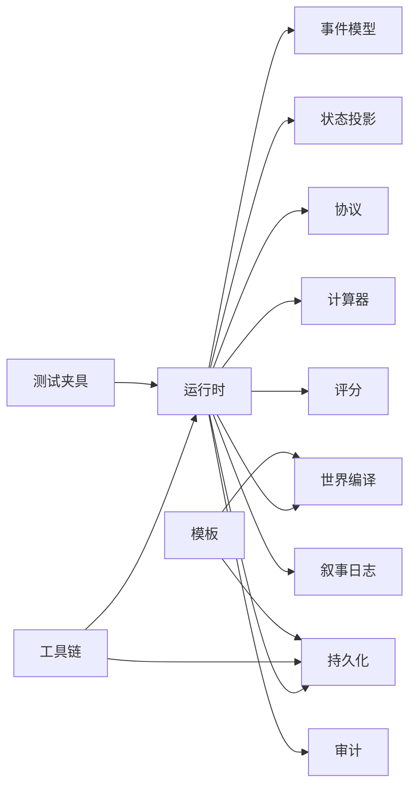

# 项目概览

<cite>
**本文引用的文件**   
- [engine_runtime/runtime.py](file://engine_runtime/runtime.py)
- [engine_runtime/events.py](file://engine_runtime/events.py)
- [engine_runtime/state.py](file://engine_runtime/state.py)
- [engine_runtime/persistence.py](file://engine_runtime/persistence.py)
- [engine_runtime/models.py](file://engine_runtime/models.py)
- [engine_runtime/world_compiler.py](file://engine_runtime/world_compiler.py)
- [engine_runtime/protocol.py](file://engine_runtime/protocol.py)
- [engine_runtime/host_contract.json](file://engine_runtime/host_contract.json)
- [engine_runtime/narrative_log.py](file://engine_runtime/narrative_log.py)
- [engine_runtime/calculators.py](file://engine_runtime/calculators.py)
- [engine_runtime/ratings.py](file://engine_runtime/ratings.py)
- [engine_runtime/options.py](file://engine_runtime/options.py)
- [engine_runtime/audit.py](file://engine_runtime/audit.py)
- [engine/base.md](file://engine/base.md)
- [engine/event_sourcing.md](file://engine/event_sourcing.md)
- [engine/knowledge.md](file://engine/knowledge.md)
- [engine/social.md](file://engine/social.md)
- [templates/save_template/meta.yaml](file://templates/save_template/meta.yaml)
- [templates/save_template/player.yaml](file://templates/save_template/player.yaml)
- [templates/save_template/npcs.yaml](file://templates/save_template/npcs.yaml)
- [templates/save_template/relationships.yaml](file://templates/save_template/relationships.yaml)
- [templates/save_template/factions.yaml](file://templates/save_template/factions.yaml)
- [templates/save_template/inventory.yaml](file://templates/save_template/inventory.yaml)
- [templates/save_template/story.md](file://templates/save_template/story.md)
- [templates/save_template/conversation_log.md](file://templates/save_template/conversation_log.md)
- [templates/save_template/decision_audit.md](file://templates/save_template/decision_audit.md)
- [templates/save_template/event_log.md](file://templates/save_template/event_log.md)
- [templates/save_template/event_queue.yaml](file://templates/save_template/event_queue.yaml)
- [templates/save_template/novel_draft.md](file://templates/save_template/novel_draft.md)
- [templates/world_template.yaml](file://templates/world_template.yaml)
- [tests/fixtures/runtime_world.yaml](file://tests/fixtures/runtime_world.yaml)
- [tests/test_engine_runtime.py](file://tests/test_engine_runtime.py)
- [tools/game_turn.py](file://tools/game_turn.py)
- [tools/run_action.py](file://tools/run_action.py)
- [tools/turn_controller.py](file://tools/turn_controller.py)
- [tools/replay_campaign.py](file://tools/replay_campaign.py)
- [tools/audit_report.py](file://tools/audit_report.py)
- [tools/create_save.py](file://tools/create_save.py)
- [tools/validate_save.py](file://tools/validate_save.py)
- [tools/verify_projection.py](file://tools/verify_projection.py)
</cite>

## 目录
1. [简介](#简介)
2. [项目结构](#项目结构)
3. [核心组件](#核心组件)
4. [架构总览](#架构总览)
5. [详细组件分析](#详细组件分析)
6. [依赖关系分析](#依赖关系分析)
7. [性能考量](#性能考量)
8. [故障排查指南](#故障排查指南)
9. [结论](#结论)
10. [附录：快速开始与术语表](#附录快速开始与术语表)

## 简介
TheGreatNovel 是一个基于事件溯源的互动小说引擎，支持玩家决策、NPC 交互、关系系统与叙事生成。其核心思想是将“世界状态”表示为不可变事件的序列，通过回放事件重建当前状态，从而保证可审计、可重放、可调试的叙事体验。引擎提供运行时内核（事件处理、状态投影、持久化）、世界模板与存档模板、工具链（回合控制、动作执行、回放与审计）以及测试夹具，形成从内容创作到运行时的完整闭环。

## 项目结构
- engine_runtime：运行时内核，包含事件模型、状态投影、协议与主机契约、计算与评分、持久化、叙事日志、世界编译等。
- templates：存档与世界的 YAML/Markdown 模板，定义数据结构与叙事输出格式。
- tests：测试夹具与单元测试，覆盖运行时基本流程。
- tools：命令行工具集，用于回合推进、动作执行、存档创建/校验、回放与审计等。
- engine：设计文档与概念说明，阐述事件溯源、知识系统、社交系统等设计理念。

```mermaid
graph TB
subgraph "运行时内核"
RT["runtime.py"]
EVT["events.py"]
ST["state.py"]
PERSIST["persistence.py"]
MODELS["models.py"]
WC["world_compiler.py"]
PROTO["protocol.py"]
HOST["host_contract.json"]
NARR["narrative_log.py"]
CALC["calculators.py"]
RAT["ratings.py"]
OPT["options.py"]
AUD["audit.py"]
end
subgraph "模板与数据"
T_META["meta.yaml"]
T_PLAYER["player.yaml"]
T_NPCS["npcs.yaml"]
T_REL["relationships.yaml"]
T_FACTIONS["factions.yaml"]
T_INV["inventory.yaml"]
T_STORY["story.md"]
T_CONV["conversation_log.md"]
T_DEC["decision_audit.md"]
T_EVTLOG["event_log.md"]
T_QUEUE["event_queue.yaml"]
T_DRAFT["novel_draft.md"]
T_WORLD["world_template.yaml"]
end
subgraph "工具链"
GT["game_turn.py"]
RA["run_action.py"]
TC["turn_controller.py"]
RP["replay_campaign.py"]
AR["audit_report.py"]
CS["create_save.py"]
VS["validate_save.py"]
VP["verify_projection.py"]
end
subgraph "测试"
FIX["runtime_world.yaml"]
TEST["test_engine_runtime.py"]
end
RT --> EVT
RT --> ST
RT --> PERSIST
RT --> MODELS
RT --> WC
RT --> PROTO
RT --> HOST
RT --> NARR
RT --> CALC
RT --> RAT
RT --> OPT
RT --> AUD
GT --> RT
RA --> RT
TC --> RT
RP --> RT
AR --> RT
CS --> PERSIST
VS --> PERSIST
VP --> ST
T_WORLD --> WC
T_META --> PERSIST
T_PLAYER --> PERSIST
T_NPCS --> PERSIST
T_REL --> PERSIST
T_FACTIONS --> PERSIST
T_INV --> PERSIST
T_STORY --> NARR
T_CONV --> NARR
T_DEC --> AUD
T_EVTLOG --> NARR
T_QUEUE --> PERSIST
T_DRAFT --> NARR
FIX --> TEST
```

图表来源 
- [engine_runtime/runtime.py](file://engine_runtime/runtime.py)
- [engine_runtime/events.py](file://engine_runtime/events.py)
- [engine_runtime/state.py](file://engine_runtime/state.py)
- [engine_runtime/persistence.py](file://engine_runtime/persistence.py)
- [engine_runtime/models.py](file://engine_runtime/models.py)
- [engine_runtime/world_compiler.py](file://engine_runtime/world_compiler.py)
- [engine_runtime/protocol.py](file://engine_runtime/protocol.py)
- [engine_runtime/host_contract.json](file://engine_runtime/host_contract.json)
- [engine_runtime/narrative_log.py](file://engine_runtime/narrative_log.py)
- [engine_runtime/calculators.py](file://engine_runtime/calculators.py)
- [engine_runtime/ratings.py](file://engine_runtime/ratings.py)
- [engine_runtime/options.py](file://engine_runtime/options.py)
- [engine_runtime/audit.py](file://engine_runtime/audit.py)
- [templates/save_template/meta.yaml](file://templates/save_template/meta.yaml)
- [templates/save_template/player.yaml](file://templates/save_template/player.yaml)
- [templates/save_template/npcs.yaml](file://templates/save_template/npcs.yaml)
- [templates/save_template/relationships.yaml](file://templates/save_template/relationships.yaml)
- [templates/save_template/factions.yaml](file://templates/save_template/factions.yaml)
- [templates/save_template/inventory.yaml](file://templates/save_template/inventory.yaml)
- [templates/save_template/story.md](file://templates/save_template/story.md)
- [templates/save_template/conversation_log.md](file://templates/save_template/conversation_log.md)
- [templates/save_template/decision_audit.md](file://templates/save_template/decision_audit.md)
- [templates/save_template/event_log.md](file://templates/save_template/event_log.md)
- [templates/save_template/event_queue.yaml](file://templates/save_template/event_queue.yaml)
- [templates/save_template/novel_draft.md](file://templates/save_template/novel_draft.md)
- [templates/world_template.yaml](file://templates/world_template.yaml)
- [tests/fixtures/runtime_world.yaml](file://tests/fixtures/runtime_world.yaml)
- [tests/test_engine_runtime.py](file://tests/test_engine_runtime.py)
- [tools/game_turn.py](file://tools/game_turn.py)
- [tools/run_action.py](file://tools/run_action.py)
- [tools/turn_controller.py](file://tools/turn_controller.py)
- [tools/replay_campaign.py](file://tools/replay_campaign.py)
- [tools/audit_report.py](file://tools/audit_report.py)
- [tools/create_save.py](file://tools/create_save.py)
- [tools/validate_save.py](file://tools/validate_save.py)
- [tools/verify_projection.py](file://tools/verify_projection.py)

章节来源
- [engine/base.md](file://engine/base.md)
- [engine/event_sourcing.md](file://engine/event_sourcing.md)
- [engine/knowledge.md](file://engine/knowledge.md)
- [engine/social.md](file://engine/social.md)

## 核心组件
- 事件模型与事件溯源：以不可变事件为核心，所有状态变更由事件驱动；通过事件回放重建状态，确保一致性与可审计性。
- 运行时内核：协调事件处理、状态投影、选项解析、计算与评分、叙事日志与审计、世界编译与加载。
- 协议与主机契约：定义宿主与引擎之间的接口边界，便于扩展与替换实现。
- 持久化与存档：将事件队列、世界配置、角色与关系、库存、故事草稿等结构化存储，支持保存/恢复与校验。
- 工具链：回合推进、动作执行、回放、审计、存档创建与验证、投影一致性校验等。

章节来源
- [engine/event_sourcing.md](file://engine/event_sourcing.md)
- [engine_runtime/runtime.py](file://engine_runtime/runtime.py)
- [engine_runtime/events.py](file://engine_runtime/events.py)
- [engine_runtime/state.py](file://engine_runtime/state.py)
- [engine_runtime/persistence.py](file://engine_runtime/persistence.py)
- [engine_runtime/protocol.py](file://engine_runtime/protocol.py)
- [engine_runtime/host_contract.json](file://engine_runtime/host_contract.json)

## 架构总览
下图展示运行时内核与外部模块的关系，包括事件流、状态投影、持久化、协议与工具链的交互。

图表来源 
- [engine_runtime/runtime.py](file://engine_runtime/runtime.py)
- [engine_runtime/protocol.py](file://engine_runtime/protocol.py)
- [engine_runtime/world_compiler.py](file://engine_runtime/world_compiler.py)
- [engine_runtime/state.py](file://engine_runtime/state.py)
- [engine_runtime/events.py](file://engine_runtime/events.py)
- [engine_runtime/persistence.py](file://engine_runtime/persistence.py)
- [engine_runtime/narrative_log.py](file://engine_runtime/narrative_log.py)
- [engine_runtime/audit.py](file://engine_runtime/audit.py)

## 详细组件分析

### 事件溯源与事件模型
- 事件是不可变的领域事实，描述一次状态变更的原因与影响。
- 事件按时间顺序追加，状态通过事件投影得到，避免直接修改状态导致的不一致。
- 事件队列作为持久化的核心，支持增量同步与回放。

图表来源 
- [engine_runtime/events.py](file://engine_runtime/events.py)
- [engine_runtime/state.py](file://engine_runtime/state.py)
- [engine_runtime/persistence.py](file://engine_runtime/persistence.py)
- [engine_runtime/narrative_log.py](file://engine_runtime/narrative_log.py)
- [engine_runtime/audit.py](file://engine_runtime/audit.py)

章节来源
- [engine/event_sourcing.md](file://engine/event_sourcing.md)
- [engine_runtime/events.py](file://engine_runtime/events.py)
- [engine_runtime/state.py](file://engine_runtime/state.py)
- [engine_runtime/persistence.py](file://engine_runtime/persistence.py)

### 运行时与协议
- 运行时负责编排事件处理、状态管理、选项生成、计算与评分、叙事与审计。
- 协议定义宿主与引擎的交互边界，便于扩展或替换具体实现。
- 主机契约明确能力清单与调用约定，保障稳定性与兼容性。

图表来源 
- [engine_runtime/runtime.py](file://engine_runtime/runtime.py)
- [engine_runtime/protocol.py](file://engine_runtime/protocol.py)
- [engine_runtime/world_compiler.py](file://engine_runtime/world_compiler.py)
- [engine_runtime/persistence.py](file://engine_runtime/persistence.py)
- [engine_runtime/narrative_log.py](file://engine_runtime/narrative_log.py)
- [engine_runtime/audit.py](file://engine_runtime/audit.py)

章节来源
- [engine_runtime/runtime.py](file://engine_runtime/runtime.py)
- [engine_runtime/protocol.py](file://engine_runtime/protocol.py)
- [engine_runtime/host_contract.json](file://engine_runtime/host_contract.json)

### 世界编译与模板
- 世界模板定义场景、阵营、角色、关系、库存等基础数据。
- 世界编译器将模板解析为运行时可用的数据结构，并进行引用解析与校验。
- 存档模板统一事件队列、元数据、故事草稿、对话日志、决策审计等输出格式。

图表来源 
- [engine_runtime/world_compiler.py](file://engine_runtime/world_compiler.py)
- [templates/world_template.yaml](file://templates/world_template.yaml)
- [templates/save_template/meta.yaml](file://templates/save_template/meta.yaml)
- [templates/save_template/player.yaml](file://templates/save_template/player.yaml)
- [templates/save_template/npcs.yaml](file://templates/save_template/npcs.yaml)
- [templates/save_template/relationships.yaml](file://templates/save_template/relationships.yaml)
- [templates/save_template/factions.yaml](file://templates/save_template/factions.yaml)
- [templates/save_template/inventory.yaml](file://templates/save_template/inventory.yaml)
- [templates/save_template/story.md](file://templates/save_template/story.md)
- [templates/save_template/conversation_log.md](file://templates/save_template/conversation_log.md)
- [templates/save_template/decision_audit.md](file://templates/save_template/decision_audit.md)
- [templates/save_template/event_log.md](file://templates/save_template/event_log.md)
- [templates/save_template/event_queue.yaml](file://templates/save_template/event_queue.yaml)
- [templates/save_template/novel_draft.md](file://templates/save_template/novel_draft.md)

章节来源
- [engine_runtime/world_compiler.py](file://engine_runtime/world_compiler.py)
- [templates/world_template.yaml](file://templates/world_template.yaml)
- [templates/save_template/*](file://templates/save_template/meta.yaml)

### 状态管理与计算/评分
- 状态投影根据事件序列重建当前世界状态，包括玩家、NPC、关系、阵营、库存等。
- 计算器与评分模块提供数值运算与权重评估，支撑决策分支与叙事生成。
- 选项生成结合状态与规则，为玩家提供有意义的选择。

图表来源 
- [engine_runtime/state.py](file://engine_runtime/state.py)
- [engine_runtime/calculators.py](file://engine_runtime/calculators.py)
- [engine_runtime/ratings.py](file://engine_runtime/ratings.py)
- [engine_runtime/options.py](file://engine_runtime/options.py)

章节来源
- [engine_runtime/state.py](file://engine_runtime/state.py)
- [engine_runtime/calculators.py](file://engine_runtime/calculators.py)
- [engine_runtime/ratings.py](file://engine_runtime/ratings.py)
- [engine_runtime/options.py](file://engine_runtime/options.py)

### 持久化与存档
- 事件队列作为唯一事实源，支持追加与回放。
- 存档包含元数据、玩家、NPC、关系、阵营、库存、故事草稿、对话日志、决策审计、事件日志等。
- 工具提供存档创建、校验与投影一致性验证。

图表来源 
- [engine_runtime/persistence.py](file://engine_runtime/persistence.py)
- [templates/save_template/event_queue.yaml](file://templates/save_template/event_queue.yaml)
- [templates/save_template/meta.yaml](file://templates/save_template/meta.yaml)
- [templates/save_template/story.md](file://templates/save_template/story.md)
- [templates/save_template/conversation_log.md](file://templates/save_template/conversation_log.md)
- [templates/save_template/decision_audit.md](file://templates/save_template/decision_audit.md)
- [tools/create_save.py](file://tools/create_save.py)
- [tools/validate_save.py](file://tools/validate_save.py)
- [tools/verify_projection.py](file://tools/verify_projection.py)

章节来源
- [engine_runtime/persistence.py](file://engine_runtime/persistence.py)
- [templates/save_template/*](file://templates/save_template/meta.yaml)
- [tools/create_save.py](file://tools/create_save.py)
- [tools/validate_save.py](file://tools/validate_save.py)
- [tools/verify_projection.py](file://tools/verify_projection.py)

### 工具链与使用流程
- 回合推进：封装一回合的动作执行、事件派发、状态更新与输出。
- 动作执行：将用户输入转换为领域动作，交由运行时处理。
- 回放与审计：回放事件序列，生成审计报告，辅助调试与复盘。

图表来源 
- [tools/turn_controller.py](file://tools/turn_controller.py)
- [tools/run_action.py](file://tools/run_action.py)
- [tools/game_turn.py](file://tools/game_turn.py)
- [engine_runtime/runtime.py](file://engine_runtime/runtime.py)
- [engine_runtime/persistence.py](file://engine_runtime/persistence.py)
- [engine_runtime/narrative_log.py](file://engine_runtime/narrative_log.py)
- [engine_runtime/audit.py](file://engine_runtime/audit.py)

章节来源
- [tools/game_turn.py](file://tools/game_turn.py)
- [tools/run_action.py](file://tools/run_action.py)
- [tools/turn_controller.py](file://tools/turn_controller.py)
- [tools/replay_campaign.py](file://tools/replay_campaign.py)
- [tools/audit_report.py](file://tools/audit_report.py)

## 依赖关系分析
- 运行时依赖事件模型、状态投影、持久化、协议、世界编译、计算与评分、叙事与审计。
- 工具链依赖运行时与持久化，用于驱动游戏流程与数据维护。
- 模板与夹具为运行时提供数据与测试环境。

图表来源 
- [engine_runtime/runtime.py](file://engine_runtime/runtime.py)
- [engine_runtime/events.py](file://engine_runtime/events.py)
- [engine_runtime/state.py](file://engine_runtime/state.py)
- [engine_runtime/persistence.py](file://engine_runtime/persistence.py)
- [engine_runtime/protocol.py](file://engine_runtime/protocol.py)
- [engine_runtime/world_compiler.py](file://engine_runtime/world_compiler.py)
- [engine_runtime/calculators.py](file://engine_runtime/calculators.py)
- [engine_runtime/ratings.py](file://engine_runtime/ratings.py)
- [engine_runtime/narrative_log.py](file://engine_runtime/narrative_log.py)
- [engine_runtime/audit.py](file://engine_runtime/audit.py)
- [tools/game_turn.py](file://tools/game_turn.py)
- [tools/run_action.py](file://tools/run_action.py)
- [tools/turn_controller.py](file://tools/turn_controller.py)
- [templates/world_template.yaml](file://templates/world_template.yaml)
- [tests/fixtures/runtime_world.yaml](file://tests/fixtures/runtime_world.yaml)

章节来源
- [engine_runtime/runtime.py](file://engine_runtime/runtime.py)
- [engine_runtime/events.py](file://engine_runtime/events.py)
- [engine_runtime/state.py](file://engine_runtime/state.py)
- [engine_runtime/persistence.py](file://engine_runtime/persistence.py)
- [engine_runtime/protocol.py](file://engine_runtime/protocol.py)
- [engine_runtime/world_compiler.py](file://engine_runtime/world_compiler.py)
- [engine_runtime/calculators.py](file://engine_runtime/calculators.py)
- [engine_runtime/ratings.py](file://engine_runtime/ratings.py)
- [engine_runtime/narrative_log.py](file://engine_runtime/narrative_log.py)
- [engine_runtime/audit.py](file://engine_runtime/audit.py)
- [tools/game_turn.py](file://tools/game_turn.py)
- [tools/run_action.py](file://tools/run_action.py)
- [tools/turn_controller.py](file://tools/turn_controller.py)
- [templates/world_template.yaml](file://templates/world_template.yaml)
- [tests/fixtures/runtime_world.yaml](file://tests/fixtures/runtime_world.yaml)

## 性能考量
- 事件回放复杂度与事件数量线性相关，建议定期生成快照以减少回放成本。
- 世界编译应在加载阶段完成，避免运行时重复解析。
- 持久化采用追加写策略，批量写入可降低 I/O 开销。
- 计算与评分模块应缓存中间结果，减少重复计算。
- 叙事与审计输出应异步或缓冲，避免阻塞主循环。

[本节为通用指导，不直接分析具体文件]

## 故障排查指南
- 事件无效：检查事件结构与约束，确认事件顺序与版本一致性。
- 状态不一致：通过回放事件与快照对比，定位差异点。
- 模板错误：使用世界编译器校验模板引用与依赖。
- 存档损坏：使用校验工具验证存档完整性与投影一致性。
- 性能问题：监控事件队列长度、回放耗时与 I/O 频率。

章节来源
- [engine_runtime/events.py](file://engine_runtime/events.py)
- [engine_runtime/state.py](file://engine_runtime/state.py)
- [engine_runtime/world_compiler.py](file://engine_runtime/world_compiler.py)
- [engine_runtime/persistence.py](file://engine_runtime/persistence.py)
- [tools/validate_save.py](file://tools/validate_save.py)
- [tools/verify_projection.py](file://tools/verify_projection.py)

## 结论
TheGreatNovel 以事件溯源为核心，构建了可扩展、可审计、可重放的互动小说引擎。通过清晰的运行时内核、协议边界、模板体系与工具链，既满足内容创作者的需求，也为开发者提供了稳定的扩展点与调试手段。建议在项目中遵循事件优先、状态投影、模板驱动与工具辅助的设计原则，以获得更好的可维护性与可演进性。

## 附录：快速开始与术语表
- 快速开始
  - 准备世界模板与存档模板，确保结构完整。
  - 使用世界编译器加载模板，构建初始状态。
  - 通过运行时执行动作，观察事件与状态变化。
  - 使用工具进行回合推进、回放与审计。
- 术语表
  - 事件：不可变的领域事实，描述状态变更原因。
  - 状态投影：由事件序列推导出的当前世界状态。
  - 事件队列：按时间顺序存储的事件集合。
  - 世界模板：定义场景、角色、关系、阵营等基础数据。
  - 协议：宿主与引擎之间的接口约定。
  - 主机契约：能力清单与调用规范。
  - 叙事日志：记录对话与故事片段的输出。
  - 审计：记录决策与行为的可追溯信息。

章节来源
- [engine/base.md](file://engine/base.md)
- [engine/event_sourcing.md](file://engine/event_sourcing.md)
- [engine/knowledge.md](file://engine/knowledge.md)
- [engine/social.md](file://engine/social.md)
- [engine_runtime/runtime.py](file://engine_runtime/runtime.py)
- [engine_runtime/world_compiler.py](file://engine_runtime/world_compiler.py)
- [engine_runtime/persistence.py](file://engine_runtime/persistence.py)
- [engine_runtime/narrative_log.py](file://engine_runtime/narrative_log.py)
- [engine_runtime/audit.py](file://engine_runtime/audit.py)
- [templates/world_template.yaml](file://templates/world_template.yaml)
- [templates/save_template/meta.yaml](file://templates/save_template/meta.yaml)
- [tools/game_turn.py](file://tools/game_turn.py)
- [tools/replay_campaign.py](file://tools/replay_campaign.py)
- [tools/audit_report.py](file://tools/audit_report.py)