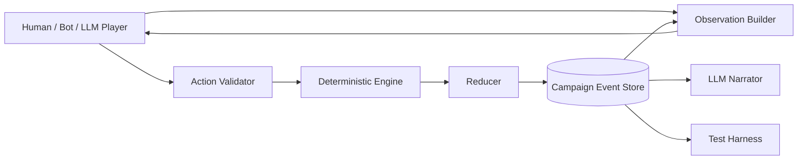
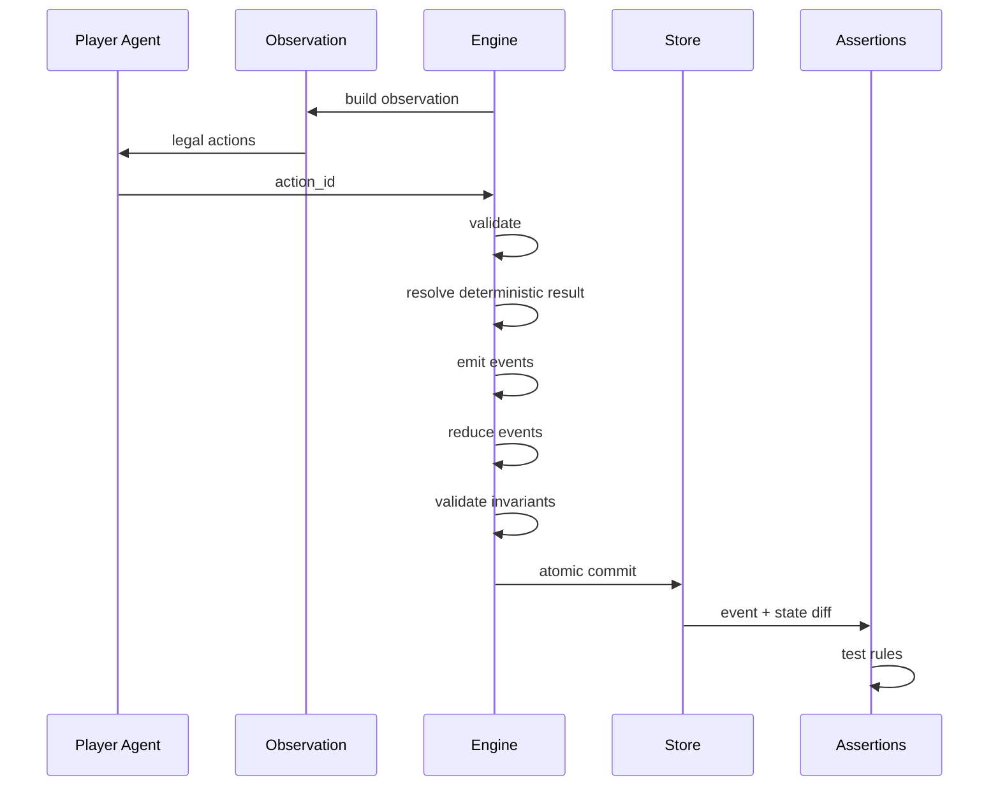
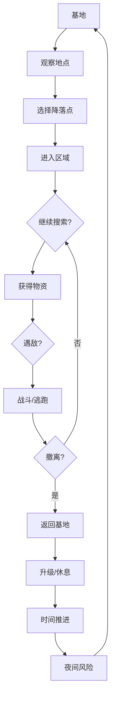
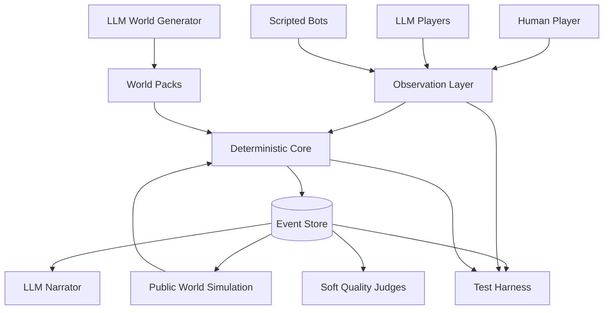

# TheGreatNovel MVP 重构框架与自动游戏测试系统设计

> 日期：2026-07-31  
> 目标：从当前"大而全、持续修 Bug"的架构退回一个可验证、可重放、可自动测试的最小核心，然后通过确定性验证与 scripted autoplay 一层一层增加功能（LLM autoplay 在 LLM Player 层建立后引入）。  
> 原始 Legacy 审查基线：2026-07-31 `main`，最初审查时约为 `4141e905...`。  
> 当前开发线：`mvp-rewrite`。  
> 当前工程阶段：Phase 7 frozen；Phase 7.5 frozen；Phase 8 frozen；Phase 9A frozen；Phase 9B1 frozen；Phase 9B2A frozen (`phase-9b2a-frozen`)；Phase 9B2B design contract candidate / implementation not started；Phase 9C not started。
> 参考作品：用户上传的《全民纜車求生，我一級一個三選一》。

> **V2 修订说明 (2026-07-31)：** 本文档经过增量架构修订。第一 WorldPack 仍可以是缆车求生 Demo，但它的 Base / Expedition / Day-Night / Three-choice 属于第一批 vertical slice 局部实现，不是整个 Engine 的宇宙规则。V2 新增反主题/结构性硬编码原则、反过度抽象原则、Knowledge boundary、Habitat 可选抽象、ProgressionTrack/Gate、Feature Module 责任边界、Compatibility Pressure Test，并更新 Phase 5+ 路线图。原有工程架构内容（EventStore、Replay、Test Pyramid、Autoplay、ExploitAgent 等）完整保留。

---

# 0. 先给结论

如果现在重新做，我不建议“继续重构当前引擎”。

我建议：

> **保留当前仓库作为 Legacy 参考实现，重新建立一个只包含「状态 → 合法行动 → 确定性结算 → 事件记录 → 快照 → 重放 → 自动玩家」的 MVP 内核。**

MVP 第一阶段甚至**不要支持 LLM 自动生成世界**。

先只支持一个固定世界包：

> **缆车求生 Demo**  
> 安全基地 → 观察机会 → 选择降落点 → 探索 / 战斗 / 搜集 → 撤离 → 获得资源 → 强化 → 时间进入夜晚 → 新风险。

这正好对应参考小说最清晰的前期循环：

```text
信息不足
   ↓
观察 / 聊天 / 情报
   ↓
发现多个风险收益不同的机会
   ↓
只能选择有限行动
   ↓
降落 / 探索
   ↓
遭遇危险
   ↓
获取物资
   ↓
能否成功撤离？
   ↓
资源转化为角色 / 基地成长
   ↓
新的能力、新选择、新风险
```

重构以后，系统最重要的资产不再是“功能数量”，而应该是：

1. **每一步游戏都可以完整记录。**
2. **任何 Bug 都可以从记录中 100% 重放。**
3. **LLM 只能做玩家或叙事者，不能偷偷修改游戏事实。**
4. **同一份状态 + 同一个 action + 同一个 seed，必须得到同一个游戏结果。**
5. **任何新功能在进入主干以前，都必须经过 deterministic contract/scenario tests 和 scripted bot autoplay。Phase 8 建立 LLM Player 以后，暴露给玩家决策的 Feature 还必须经过相应的 LLM autoplay / model matrix。**
6. **自动测试发现的 Bug，最终必须转化成不依赖 LLM 的确定性 regression test。**

一句话定义新架构：

> **LLM 在边缘创造行为和文本，确定性引擎在中心维护事实。**

---

# 1. 为什么现在应该重做 MVP，而不是继续修当前项目

## 1.1 当前项目真正值得保留的部分

当前代码其实已经出现了几个很正确的方向。

### A. SQLite Event Store

当前 `engine_runtime/persistence.py` 已经明确规定：

- SQLite `events` 是事实来源；
- `snapshots` 是状态投影；
- 可以从 base state + events 做 replay；
- `verify_projection()` 可以对重放结果和最新 snapshot 做比较。

这个思想应该完整继承。

**但实现应该重写为更小版本，而不是原样搬过去。**

---

### B. GameState + Event Projection

当前 `engine_runtime/state.py` 已经在尝试：

```text
event
  ↓
apply_event()
  ↓
new state
  ↓
SQLite transaction
  ↓
snapshot
```

这也是正确的。

尤其是现在已经把：

- `current_turn`
- `world_turn`

拆开。

这个改动说明当前项目已经遇到了一个非常典型的问题：

> “事件序号”不能等价于“游戏世界时间”。

新 MVP 不应该再叫 `current_turn/world_turn` 来混淆，而应该从第一天就明确分成：

```text
event_seq      # 第几个不可变事件
decision_seq   # 玩家第几次做决定
game_time      # 世界实际经过多少分钟
```

三者是完全不同的东西。

---

### C. Autoplay Harness 的方向是对的

当前已经有：

- `tools/autoplay_test.py`
- `tools/autoplay_suite.py`
- `TelemetryRecorder`
- `AutoAuditor`
- `ABCPolicy`
- `RandomPolicy`
- `AggressivePolicy`
- `BuilderPolicy`

而且已经开始检测：

- 没有可用行动；
- 时间不推进；
- stuck loop；
- 遭遇未关闭；
- time cost 不一致；
- 公共系统休眠；
- option 高重复；
- policy coverage。

这个方向完全应该保留。

---

## 1.2 当前项目为什么会越来越难修

问题不是“代码写得差”。

更大的问题是：

> **太多还没有经过核心循环验证的机制，同时进入了事实层。**

当前 `persistence.py` 已经拥有数十种持久化对象，包括：

- campaigns
- events
- snapshots
- entities
- relationships
- scheduled_events
- generation_runs
- regions
- peer_players
- player_population_snapshots
- rankings
- ranking_snapshots
- achievements
- achievement_unlocks
- system_announcements
- regional_channels
- channel_messages
- private_messages
- trade_orders
- trade_transactions
- market_snapshots
- comparative_snapshots
- rivalries
- player_reputations
- teams
- guilds
- regional_statistics
- ...

这些东西每一个单独看都合理。

但它们放在一起之后，任何一个基础概念变化都会产生巨大传播：

```text
时间模型改变
  ↓
scheduled event 改
  ↓
peer simulation 改
  ↓
ranking 改
  ↓
trade expiry 改
  ↓
autoplay telemetry 改
  ↓
migration 改
  ↓
旧存档改
```

于是你越来越多时间不是在“设计游戏”，而是在：

> **维护多个半成熟系统之间的一致性。**

---

## 1.3 当前世界创建系统尤其应该暂时废弃

当前 `tools/create_save.py` 已经承担了非常多职责：

- 交互式问卷；
- genre contract；
- public survival；
- world blueprint；
- capabilities；
- action targets；
- aggregate validator；
- world compiler；
- 初始化公共状态；
- 生成存档；
- 兼容多 genre；
- schema repair。

而最新一批 commit 又在继续修：

- capability path；
- `disaster` / `disasters`；
- `starting_location` 路径；
- null normalization；
- genre-specific requirements。

这说明一个问题：

> **现在系统还没有稳定的最小运行时，却已经开始解决“任意世界自动编译”的问题。**

这是顺序倒置。

新版本应该：

### Earlier bounded generation

外部客户端可以较早生成 campaign-specific World Draft，但只能使用当前已经支持
并经过审查的 Feature Contract。Draft 必须经过严格编译、语义验证、最小可玩
bootstrap、scripted smoke test 和 canonical hash；它不能发明新的 Action、Event、
Reducer、数据库字段或运行时语义。

### Later general generation

能够发明新机制或 universal World Schema 的通用生成器仍然延期，直到多个结构不同的
WorldPack 对共享抽象形成真实的 Compatibility Pressure Test。第二或第三个结构不同
的 WorldPack 仍然是架构泛化的重要证明，但不再是“任何 LLM 生成内容之前”的永久
硬门槛。

保留原始警告：不要让 LLM 边创建世界边发明规则。

---

# 2. 从参考小说中，MVP 真正应该学习什么

> **First Pressure World, Not Universal Template**
>
> The mechanisms below are concrete first-world pressure tests. They demonstrate scarcity, opportunity cost, extraction, progression and public-world feedback. They are not universal Engine requirements.

参考小说最值得学习的不是"缆车"这个皮肤，而是它前期极其清晰的系统循环。

## 2.1 一个绝对安全 / 相对安全的基地

小说一开始就建立了一个非常重要的规则：

- 缆车是玩家最重要的生存依赖；
- 正常情况下内部安全；
- 可以强化；
- 夜晚仍可能受到外部压力。

这给玩家建立了：

```text
安全区
vs
危险区
```

而不是让整个世界一直处于同一种风险水平。

### MVP 对应

必须有：

```yaml
base:
  safety: high
  storage: limited
  defense: 10
  level: 1
```

基地是：

- 回收战利品的地方；
- 制定下一次行动的地方；
- 成长的可视化载体；
- 风险循环的终点与起点。

---

# 2.2 有限次数的“出去”

小说不是让主角无限探索。

它一开始就规定：

> 每天只有有限机会降落、搜集、撤离。

这非常关键。

如果探索没有机会成本：

```text
探索 A
探索 B
探索 C
全做
```

选择就会退化。

所以 MVP 第一版就必须有硬资源：

```text
时间
行动机会
体力
危险暴露
```

玩家选择 A，必须真实失去 B 的某些可能性。

---

# 2.3 风险收益不同的地点

小说很快给出：

```text
青铜宝箱
低风险

白银宝箱
更高价值
Lv3 危险
```

这比“去左边还是右边”更重要。

真正的选择是：

```text
收益
风险
信息完整度
时间成本
撤离成本
```

之间的冲突。

因此新引擎的 action option 不应该只是：

```json
{
  "label": "探索废墟"
}
```

而应该是具有真实规则合同的：

```json
{
  "id": "explore_old_shop",
  "kind": "EXPLORE",
  "time_cost": 40,
  "stamina_cost": 12,
  "risk_class": "medium",
  "known_information": [
    "可能存在食物",
    "未确认敌人数量"
  ]
}
```

玩家可以不知道隐藏概率，但引擎必须知道行动成本和规则。

---

# 2.4 撤离比“拿到东西”更重要

小说里的探索不是：

```text
找到宝箱
= 成功
```

而是：

```text
进去
→ 搜到东西
→ 背负资源
→ 穿过风险
→ 到达撤离点
→ 成功回基地
```

这天然创造了：

- 贪心；
- 背包容量；
- 是否继续探索；
- 战利品损失；
- 时间窗口；
- 逃跑。

这应该成为 MVP 的核心。

---

# 2.5 成长必须打开新的策略空间

小说的成长不只是：

```text
Attack +5
HP +20
```

而包括：

- 情报能力；
- 弱点命中；
- 建设效率；
- 缆车特性；
- 新功能解锁。

这给玩家的是：

> **新的做法。**

所以 MVP 的成长系统应该首先测试：

```text
升级前不能做 / 很难做的事情
升级后出现新的可行策略
```

而不是只测试伤害变大。

---

# 2.6 三选一的本质是永久放弃

“一級一個三選一”真正有价值的地方不是有三个按钮。

而是：

> **不能全拿。**

所以以后能力系统必须遵循：

```text
Choice = Gain + Opportunity Cost
```

如果下一回合可以把剩下两项补回来，这个系统就失去意义。

---

# 2.7 公共频道的作用不是聊天，而是“世界反馈”

小说中公共频道非常重要，因为它不断向主角提供：

- 其他人的死亡；
- 别人的实力；
- 市场价格；
- 他人的错误；
- 群体恐慌；
- 稀缺情报；
- 比较基准。

这让玩家感受到：

> 世界不是围绕自己单线程运行。

但这不意味着 MVP 一开始就应该模拟 1000 个完整 NPC。

更好的最小实现见后文：

> **群体统计 + 3~5 个具名 Peer。**

---

# 3. 新 MVP 的明确 Scope

> **Historical / Conceptual Capability Tiers**
>
> This section records the original capability-layer thinking. It is not the active implementation sequence.
>
> The authoritative execution roadmap is Section 52: V2 Active Roadmap.

---

# 3.1 MVP 0：只证明“游戏循环成立”

MVP 0 只做以下功能。

## 世界

一个固定：

```text
缆车求生 Demo
```

## 玩家状态

只保留：

```text
HP
stamina
hunger
level
xp
inventory
location
```

## 基地

只保留：

```text
level
defense
storage_capacity
```

## 时间

```text
game_minute
day
day_phase
```

第一版甚至可以规定：

```text
1 day = 720 game minutes
```

只要全系统一致即可。

## 地图

3~5 个节点：

```text
CableCar
OldShop
Village
PoliceStation
ExtractionPoint
```

## 行动

第一版只允许：

```text
OBSERVE
TRAVEL / DROP
SEARCH
FIGHT
FLEE
EXTRACT
REST
UPGRADE
```

不要做：

```text
BUILD
CRAFT
TRADE
GUILD
FACTION
RESEARCH
SOCIAL
BATCH_ACTION
```

至少不是 MVP 0。

---

# 3.2 MVP 1：成长与永久选择

加入：

```text
level up
three-choice talent
base upgrade
装备
```

目标：

> 验证“选择不同成长方向以后，自动玩家的策略真的开始分化”。

---

# 3.3 MVP 2：最小公共世界

加入：

```text
aggregate population
3~5 named peers
system announcements
regional feed
```

暂时不做完整聊天 AI。

例如世界每经过 120 分钟：

```text
999 alive
↓
987 alive
```

同时可能出现：

```text
[公告] 罗力军死于 Lv1 哥布林
[频道] 有人报告村庄附近存在怪物
```

这些事件由游戏系统产生事实。

LLM 只负责把事实写成“频道文本”。

---

# 3.4 MVP 3：交易

只有当：

- 资源系统稳定；
- 稀缺度可测；
- NPC/Peer 能产生不同资源结构；

以后再加入交易。

先做：

```text
direct offer
```

不要一开始做：

```text
order book
market snapshot
historical pricing
trade matching engine
```

---

# 3.5 MVP 4：第二个完全不同的 WorldPack

例如：

```text
永夜冰川
```

如果相同引擎可以运行：

```text
缆车世界
+
永夜冰川
```

才说明你的抽象开始成立。

---

# 3.6 MVP 5：第三个 WorldPack

例如：

```text
巨兽背部
```

到这个阶段才观察：

> 三个世界重复出现的字段到底是什么？

然后再正式定义：

```text
WorldPack Schema v1
```

---

# 3.7 MVP 6 — LLM World Generator

> **Historical / superseded.** The active generation contract is Phase 9B below.

最后才恢复：

```text
自然语言
→ World Blueprint
→ Validator
→ WorldPack
```

这段原始路线不再是当前实现顺序。当前路线允许 bounded campaign-specific generation，
但通用生成器和新运行时语义仍然延期。具体 future bootstrap / lazy-materialization
contract 见 Section 62 与 V2 Active Roadmap 的 Phase 9B。

---

# 4. 新系统最核心的架构



这里有一个绝对原则：

# LLM 永远不在 E / R / DB 内部

它只能位于：

```text
Player
Narrator
World Generator（未来）
Soft Judge
```

而不能位于：

```text
Rule Resolution
Resource Mutation
Combat Damage
Time Advance
Event Commit
Snapshot
```

### V2 补充：Knowledge / Visibility 边界

长期架构中，Observation 之前应有 Knowledge / Visibility 层：

```text
GameState / World Truth
        ↓
Knowledge / Visibility
        ↓
Observation
        ↓
Human / Bot / LLM Player
```

这不是要求现在创建 Knowledge package 或 DB schema。这是架构边界方向：player/agent 看到的是角色有资格知道的世界投影，不是 raw GameState dump。

---

# 5. Historical Bootstrap Layout / 当前目录设计来源

> The layout below records the original clean-room bootstrap recommendation.
>
> The mvp-rewrite repository already has an evolved src/tgn implementation.
>
> Do NOT reorganize the current repository merely to match this historical tree.
>
> Current repository reality + frozen contracts take precedence.

建议不是在现有 `engine_runtime/` 里继续拆。

直接创建新的独立包：

```text
thegreatnovel/
│
├─ src/
│  └─ tgn/
│     ├─ core/
│     │  ├─ models.py
│     │  ├─ reducer.py
│     │  ├─ engine.py
│     │  ├─ actions.py
│     │  ├─ invariants.py
│     │  ├─ rng.py
│     │  └─ clock.py
│     │
│     ├─ storage/
│     │  ├─ event_store.py
│     │  ├─ replay.py
│     │  └─ export.py
│     │
│     ├─ worlds/
│     │  └─ cablecar/
│     │     ├─ world.yaml
│     │     ├─ locations.yaml
│     │     ├─ encounters.yaml
│     │     ├─ loot.yaml
│     │     ├─ upgrades.yaml
│     │     └─ talents.yaml
│     │
│     ├─ llm/
│     │  ├─ player_protocol.py
│     │  ├─ narrator_protocol.py
│     │  ├─ provider.py
│     │  └─ adapters/
│     │
│     ├─ autoplay/
│     │  ├─ runner.py
│     │  ├─ agents.py
│     │  ├─ llm_agent.py
│     │  ├─ telemetry.py
│     │  ├─ assertions.py
│     │  ├─ matrix.py
│     │  └─ report.py
│     │
│     └─ cli.py
│
├─ scenarios/
│  ├─ smoke/
│  ├─ extraction/
│  ├─ combat/
│  ├─ progression/
│  └─ exploits/
│
├─ tests/
│  ├─ unit/
│  ├─ scenario/
│  ├─ replay/
│  └─ regression/
│
├─ autoplay_matrices/
│  ├─ smoke.yaml
│  ├─ nightly.yaml
│  └─ release.yaml
│
├─ runs/                         # gitignore
├─ pyproject.toml
└─ DESIGN.md
```

Legacy reference policy:

- Legacy exists only through Git branch/tag.
- Do not copy legacy/history/old_engine directories into mvp-rewrite.
- Legacy is reference material, never a runtime dependency.

---

# 6. 最重要的重构：只有一个事实源

当前版本同时存在：

- SQLite；
- 多个 YAML；
- Markdown event log；
- snapshot；
- projection；
- migration。

这些都是历史发展造成的。

MVP 应该大幅收缩。

---

# 6.1 Mutable State 只存在 SQLite

静态规则：

```text
world/*.yaml
```

可以放 Git。

动态游戏事实：

```text
campaign.sqlite3
```

只有它可以写。

---

# 6.2 YAML 不再是动态存档

不要再出现：

```text
player.yaml
inventory.yaml
meta.yaml
population_state.yaml
ranking_state.yaml
...
```

同时都是动态可写状态。

它会导致：

```text
到底哪个才是真的？
```

新版本：

```text
world config = YAML
game state   = SQLite snapshot
history      = SQLite events
human export = JSON / MD，只读生成
```

---

# 7. MVP Event Store

当前 Event Store 的思想应该保留，但 schema 缩到最小。

## 7.1 campaigns

```sql
CREATE TABLE campaigns (
    campaign_id TEXT PRIMARY KEY,
    world_pack TEXT NOT NULL,
    world_version TEXT NOT NULL,
    engine_version TEXT NOT NULL,
    seed INTEGER NOT NULL,
    created_at TEXT NOT NULL
);
```

---

# 7.2 events

```sql
CREATE TABLE events (
    event_id TEXT PRIMARY KEY,
    campaign_id TEXT NOT NULL,

    event_seq INTEGER NOT NULL,
    decision_seq INTEGER,

    game_minute INTEGER NOT NULL,

    event_type TEXT NOT NULL,
    actor_id TEXT,
    action_id TEXT,

    causation_id TEXT,
    correlation_id TEXT,

    payload_json TEXT NOT NULL,

    state_hash_before TEXT NOT NULL,
    state_hash_after TEXT NOT NULL,

    created_at TEXT NOT NULL
);
```

---

# 7.3 snapshots

```sql
CREATE TABLE snapshots (
    campaign_id TEXT NOT NULL,
    event_seq INTEGER NOT NULL,
    state_json TEXT NOT NULL,
    state_hash TEXT NOT NULL,
    created_at TEXT NOT NULL,

    PRIMARY KEY (campaign_id, event_seq)
);
```

---

# 7.4 为什么 `game_minute` 必须直接存在

不要通过：

```text
turn × 一个常数
```

推断世界时间。

一个行动可能：

```text
观察：0 min
聊天：5 min
搜房：25 min
撤离：40 min
战斗：8 min
睡觉：360 min
```

所以：

```text
event_seq = 顺序
game_minute = 世界时间
```

必须分开。

---

# 8. GameState 的最小结构

第一版建议不要无限嵌套。

```json
{
  "schema_version": 1,

  "clock": {
    "game_minute": 220,
    "day": 1,
    "phase": "day"
  },

  "player": {
    "hp": 84,
    "stamina": 51,
    "hunger": 62,
    "level": 1,
    "xp": 54,
    "location_id": "old_shop"
  },

  "inventory": {
    "water": 4,
    "food": 6,
    "iron": 3
  },

  "base": {
    "level": 1,
    "defense": 10,
    "storage_capacity": 20
  },

  "expedition": {
    "active": true,
    "loot_weight": 8,
    "extraction_available": true
  },

  "progression": {
    "talents": []
  },

  "world_flags": {}
}
```

第一阶段要克制。

任何新增字段都要问：

> 自动游戏真的证明了它现在有必要吗？

---

# 9. 所有状态改变必须经过 Reducer

```python
new_state = reduce(old_state, event)
```

Reducer 必须是纯函数：

```text
无数据库
无 API
无 LLM
无文件 IO
无当前时间
无随机 random()
```

### V2 补充：Reducer 也是 event-truth / anti-forgery boundary

Action layer 拒绝一个行为，不意味着一个语法正确的伪造 event 可以绕过相同的世界不变量。

Reducer 必须独立验证 event payload 与 engine-computed result 一致。Normal Action validation 通过不等于 Reducer 可以信任 event payload。

---

# 9.1 RNG 怎么做

随机必须显式输入：

```python
result = resolve_combat(
    state,
    action,
    rng=DeterministicRNG(seed, event_seq)
)
```

例如：

```text
campaign seed = 42
event_seq = 18
domain = combat
```

派生：

```text
hash("42|18|combat")
```

这样任何 Bug 都能完全复现。

---

# 10. Action Contract

这是新系统第二重要的东西。

不要让 LLM 自己描述：

> "我搜房间、顺便制作武器、和 NPC 聊天、最后休息。"

然后系统全执行。

### V2 补充：Canonical Legality Contract

State-dependent legality 有且只有一个 canonical source：

```text
get_legal_actions(state)
      ↓
validate_action (consumes canonical legality + parameter/schema validation)
      ↓
execute_action (does not invent another state legality layer)
```

Observation 只展示 canonical legal actions。Autoplay 只消费 canonical legal actions。不要出现 Observation/Validator/Executor/Bot 各有一套 legality。

---

# 10.1 MVP 玩家只能选择引擎提供的合法动作

Observation：

```json
{
  "state_summary": {
    "hp": 84,
    "stamina": 51,
    "time": "Day 1 13:40"
  },

  "situation": "你位于废弃小卖部，远处传来脚步声。",

  "legal_actions": [
    {
      "id": "search_shop",
      "label": "继续搜索",
      "known_cost": {
        "time": 20,
        "stamina": 5
      }
    },
    {
      "id": "leave_for_extract",
      "label": "立即前往撤离点",
      "known_cost": {
        "time": 30,
        "stamina": 8
      }
    }
  ]
}
```

LLM 只允许输出：

```json
{
  "action_id": "leave_for_extract"
}
```

---

# 10.2 不记录 / 不要求 Chain of Thought

自动测试真正需要记录的是：

```text
输入 Observation
Legal Actions
模型输出
解析结果
最终选择
```

不需要让模型输出长篇内部推理。

如果需要行为解释，只允许：

```json
{
  "action_id": "leave_for_extract",
  "intent_summary": "当前战利品已经足够，继续搜索风险过高。"
}
```

这个字段不能参与规则结算。

---

# 10.3 第一版禁止 BATCH_ACTION

当前项目已经因为：

```text
玩家把 A+B+C 合并
```

暴露出选择没有机会成本的问题。

所以 MVP 0：

> **一次 decision 只能提交一个 Action。**

以后如果真的需要组合行动，必须是引擎提前注册的：

```text
COMPOSITE ACTION
```

并且：

```text
total_time
total_stamina
risk_dilution
interruptibility
```

全部由引擎计算。

不是 LLM 自己说“我顺便做”。

---

# 11. Engine 执行流程



---

# 12. Commit 必须是原子的

一次玩家选择产生：

```text
ACTION_STARTED
RESOURCE_CHANGED
COMBAT_RESOLVED
TIME_ADVANCED
ACTION_COMPLETED
```

可以是多个 domain event。

但它们应该作为一个 decision transaction 提交。

如果中间失败：

```text
全部 rollback。
```

永远不能出现：

```text
物资扣了
但是时间没走

敌人死了
但是 XP 没加

撤离成功
但是 location 没回基地
```

---

# 13. 每个 Decision 都必须产生完整 Audit Record

这是你这次重构最应该投入时间的地方。

每一步至少要记录：

```json
{
  "decision_seq": 18,

  "state_hash_before": "...",

  "observation": {...},

  "legal_actions": [...],

  "agent": {
    "type": "llm",
    "provider": "xxx",
    "model": "xxx",
    "prompt_version": "player-v3"
  },

  "raw_model_output": "...",

  "parsed_action": {
    "action_id": "search_shop"
  },

  "events": [...],

  "state_hash_after": "...",

  "assertions": [...],

  "duration_ms": 812
}
```

---

# 14. 游戏存档和自动测试记录要分开

建议：

```text
campaign.sqlite3
```

只保存游戏事实。

而：

```text
run.sqlite3
```

保存一次自动测试运行的测试元数据。

---

# 14.1 Campaign DB

```text
campaign
events
snapshots
```

只回答：

> 游戏世界发生过什么？

---

# 14.2 Run DB

建议：

```text
runs
decisions
llm_calls
assertion_results
metrics
```

回答：

> 这次是谁玩的？哪个模型？为什么失败？测试发现了什么？

---

# 15. Run Manifest

每次自动测试必须首先写：

```json
{
  "run_id": "20260731_cablecar_gpt_x_seed42_001",

  "scenario_id": "cablecar_day1",

  "base_state_hash": "...",

  "engine_git_sha": "...",
  "engine_version": "0.1.0",
  "world_version": "cablecar-0.1.0",

  "seed": 42,

  "agent_type": "llm",
  "provider": "provider_a",
  "model": "model_x",
  "temperature": 0.3,

  "player_prompt_version": "player-v4",

  "max_decisions": 50,

  "status": "running",

  "started_at": "..."
}
```

---

# 16. LLM Call 必须完整记录

建议表：

```sql
CREATE TABLE llm_calls (
    call_id TEXT PRIMARY KEY,
    run_id TEXT NOT NULL,
    decision_seq INTEGER,

    role TEXT NOT NULL,
    provider TEXT NOT NULL,
    model TEXT NOT NULL,

    prompt_version TEXT,
    request_json TEXT NOT NULL,
    response_text TEXT,

    parse_ok INTEGER NOT NULL,
    parsed_json TEXT,

    latency_ms INTEGER,
    input_tokens INTEGER,
    output_tokens INTEGER,

    created_at TEXT NOT NULL
);
```

这会极大提升 Debug 效率。

以后你看到：

> Decision 37 开始模型一直选 WAIT

你可以马上知道：

```text
是模型变了？
prompt 变了？
observation 错了？
legal actions 错了？
还是引擎执行错了？
```

---

# 17. Prompt 也必须版本化

不要直接把 prompt 写死在 Python 字符串里。

```text
prompts/
  player/
    v001.md
    v002.md
  narrator/
    v001.md
```

run manifest 永远记录：

```text
prompt_version
prompt_hash
```

否则两个月以后你无法知道：

> 同一个 model 为什么以前能玩现在不能玩。

---

# 18. 完整 Replay

这是 MVP 的 P0 功能，不是后期功能。

命令：

```bash
python -m tgn replay runs/<run_id>
```

应该：

1. 读取初始 snapshot；
2. 不调用任何 LLM；
3. 按已记录 action 顺序执行；
4. 每一步比较：
   - emitted events；
   - state hash；
5. 任意一步不同立即停止。

结果：

```text
Replay: FAILED

decision: 23
expected state_hash:
8ca...

actual state_hash:
45d...

difference:
inventory.iron expected 5 actual 6
```

这才是真正能让你少修 Bug 的基础设施。

---

# 19. 每个状态都计算 Canonical Hash

```python
canonical = json.dumps(
    state,
    sort_keys=True,
    separators=(",", ":"),
    ensure_ascii=False
)

state_hash = sha256(canonical.encode()).hexdigest()
```

不要把：

```text
created_at
现实时间
日志时间
```

放进可重放状态。

否则 hash 永远不同。

---

# 20. 自动游戏测试必须分四层

这是整个重构计划最关键的一节。

不要只做“LLM 玩 50 回合”。

应该是四层金字塔。

```text
          LLM Matrix
        /            \
     Bot Simulation
   /                  \
 Scenario Integration
/                      \
       Unit Tests
```

---

# 21. Layer 1 — Unit Tests

测试纯函数。

例如：

```text
search consumes correct stamina
combat damage never becomes negative
inventory cannot exceed storage
extract moves player to base
time advance crosses day boundary
level up exactly once
```

特点：

```text
不调用 SQLite
不调用 LLM
毫秒级
```

PR 每次提交都跑。

---

# 22. Layer 2 — Scenario Tests

构造固定状态 + 固定 action sequence。

例如：

## `test_safe_extraction`

```text
start at OldShop
search
move to extraction
extract
```

断言：

```text
player.location == CableCar
loot retained
game_time advanced
expedition inactive
```

---

# 23. Layer 3 — Scripted / Rule-based Autoplay

这是当前 ABC / Random / Aggressive / Builder 思路的升级版。

保留 deterministic bot：

```text
RandomAgent
GreedyLootAgent
SafeSurvivorAgent
RiskSeekerAgent
ProgressionAgent
ExploitAgent
```

---

# 23.1 ExploitAgent 非常重要

它应该故意寻找：

```text
0 时间行动循环
免费资源
重复领取奖励
撤离复制物品
死后继续行动
同时选择多个互斥行动
负体力继续战斗
无限升级
```

你的自动测试不能只模拟“正常玩家”。

一定要有：

> **故意把系统玩坏的玩家。**

---

# 24. Layer 4 — 多 LLM Autoplay Matrix

最终才是：

```text
OpenAI-like model
Anthropic-like model
Gemini-like model
local/open model
...
```

具体 provider 不应该写死在测试框架。

统一接口：

```python
class PlayerAgent(Protocol):
    def choose_action(
        self,
        observation: Observation,
        legal_actions: list[ActionOption],
    ) -> ActionRequest:
        ...
```

---

# 25. LLM Adapter

```text
autoplay/
  llm_agent.py

llm/
  provider.py
  adapters/
```

统一配置：

```yaml
agents:
  - id: model_a_cautious
    type: llm
    provider: provider_a
    model: model_a
    persona: cautious
    temperature: 0.2

  - id: model_b_optimizer
    type: llm
    provider: provider_b
    model: model_b
    persona: optimizer
    temperature: 0.3
```

---

# 26. 不同 LLM 不只是不同模型，还要不同“玩家人格”

建议至少测试：

## cautious

```text
优先生存与撤离
```

## optimizer

```text
最大化长期资源
```

## risk_seeker

```text
偏向高收益风险
```

## completionist

```text
尝试所有系统
```

## literal

```text
严格按照选项文字理解
```

## roleplayer

```text
更多基于叙事合理性选择
```

## exploit_hunter

```text
主动寻找规则漏洞
```

这样可以区分：

> 是游戏系统稳定，还是某个 LLM 恰好没踩到 Bug。

---

# 27. Player LLM 只能看到 Player View

绝对不能把：

```text
enemy hidden stats
loot table
test assertions
future scheduled event
rng result
```

发给 Player Agent。

否则测试无效。

Observation Builder 必须明确：

```text
Internal State
↓
Visibility Filter
↓
Player Observation
```

---

# 28. LLM Judge 只能做 Soft Test

以后可以让另一个 LLM 判断：

```text
选择是否有意义
故事是否连贯
玩家是否感觉成长
世界是否有重复感
```

但：

> **LLM Judge 永远不能决定硬规则是否正确。**

例如：

```text
库存变成 -3
```

不需要 LLM 判断。

这是 deterministic assertion。

---

# 29. 自动审计规则体系

新 `assertions.py` 应该是插件式：

```python
class AssertionRule:
    id: str
    severity: str

    def evaluate(ctx) -> list[Finding]:
        ...
```

---

# 30. P0 Assertions

任何一个出现就认为 run fail。

## SAVE_REPLAY_MISMATCH

```text
重放状态 ≠ 原运行状态
```

## ILLEGAL_STATE

例如：

```text
hp < 0 但 alive=true
inventory < 0
location 不存在
```

## NO_AVAILABLE_ACTION

玩家活着且游戏未结束，但没有合法 action。

## ACTION_EXECUTED_WHILE_ILLEGAL

引擎执行了没有被 LegalActionBuilder 暴露的行为。

## TIME_REVERSAL

游戏时间倒退。

## DUPLICATED_REWARD

同一个 reward id 被领取两次。

## DEAD_PLAYER_ACTED

死亡状态仍可行动。

## ATOMICITY_BROKEN

同一个 decision 中途只提交了部分事件。

---

# 31. P1 Assertions

## ZERO_TIME_LOOP

连续 N 次 action 没有推进世界，也没有改变 meaningful state。

## STUCK_LOOP

同一个行动 / 同一状态模式无限循环。

## TIME_COST_MISMATCH

Action preview 的成本与实际推进不一致。

## ENCOUNTER_ORPHAN

遭遇开启后无法关闭。

## RESOURCE_EXPLOSION

资源在没有对应 source event 时增长。

## FEATURE_DORMANT

启用的 feature 在足够多 simulation 中从未出现。

## DOMINANT_ACTION

一个 action 在大量不同状态下总是严格优于其他选项。

---

# 32. P2 / Design Signals

这些不阻断 build，但必须进入报告。

## OPTION_REPETITION

大量重复选项。

## LOW_CHOICE_ENTROPY

玩家 90% 时间都选同一种行动。

## POLICY_COVERAGE_GAP

某些 action 出现，但所有 bot 都不选。

## LOW_BRANCH_DIVERGENCE

不同选择最终 3~5 回合以后几乎完全一样。

## PROGRESSION_INVISIBLE

升级前后策略分布基本没变。

---

# 33. 新增一个当前框架还没有的重要测试：Choice Divergence

这是我最建议你加入的测试。

你之前遇到的问题：

> A、B、C 好像都能一起做。

更深层的问题其实是：

> 做 A 和做 B，到底会不会让未来真的不同？

所以测试器应该支持：

```bash
python -m tgn fork \
  --run <run_id> \
  --decision 12 \
  --all-actions \
  --horizon 5
```

它会从 Decision 12 snapshot 创建分支：

```text
Branch A
Branch B
Branch C
```

各自继续模拟 5 回合。

比较：

```text
resources
location
risk
known_information
progression
future legal actions
```

如果 5 回合以后：

```text
A/B/C 状态几乎相同
```

报告：

```text
LOW_BRANCH_DIVERGENCE
```

这比单纯看选项文字强得多。

---

# 34. 新增 Choice Opportunity Cost 指标

定义一个简单指标：

```text
OpportunityCost(action A)
=
A 选择后不可再获得的近期价值
```

可以近似计算：

```text
lost_options
expired_opportunities
time consumed
resource consumed
risk exposure
```

如果一个选项：

```text
没有成本
没有时间
不会关闭其他机会
```

它很可能是假选择。

---

# 35. Action Combination Exploit 专门测试

做一个 Adversarial Agent。

它永远尝试：

```text
"我先 A，然后顺便 B，再同时 C"
```

引擎必须：

### MVP

拒绝：

```json
{
  "error": "ONE_ACTION_PER_DECISION"
}
```

### 未来支持组合行动时

必须转成：

```text
registered composite action
```

不能由 Narrator 自由合并。

---

# 36. 自动测试 Run 的文件结构

```text
runs/
└─ 20260731_210501_cablecar_modelA_seed42/
   ├─ manifest.json
   ├─ run.sqlite3
   ├─ campaign.sqlite3
   ├─ transcript.md
   ├─ timeline.jsonl
   ├─ metrics.json
   ├─ report.md
   └─ failures/
      ├─ failure_001.json
      └─ repro_001.json
```

---

# 37. Failure Bundle

自动测试一旦发现 P0/P1：

```json
{
  "finding": {
    "id": "SAVE_REPLAY_MISMATCH",
    "severity": "P0"
  },

  "decision_seq": 37,

  "scenario_id": "cablecar_day1",

  "engine_git_sha": "...",

  "seed": 42,

  "state_before": {...},

  "legal_actions": [...],

  "selected_action": {...},

  "events_emitted": [...],

  "state_after": {...},

  "recent_history": [...]
}
```

并自动输出：

```bash
python -m tgn reproduce failures/failure_001.json
```

---

# 38. 最重要的开发纪律：LLM Bug 必须“固化”

假设某个模型自动玩第 43 回合发现：

```text
撤离以后 loot 被复制。
```

不要只修代码然后重新跑 LLM。

必须：

1. 从 run 中导出 Decision 43 前 snapshot；
2. 导出 action；
3. 创建：

```text
tests/regression/test_issue_0042_extract_duplication.py
```

4. 不使用任何 LLM；
5. 这个 test 永久存在。

因此整个项目应该不断发生：

```text
LLM discovery
      ↓
repro bundle
      ↓
deterministic regression test
      ↓
fix
```

你的测试库会越来越强，而不是每天重复发现同一种 Bug。

---

# 39. Test Matrix

建议提供三个矩阵。

> **Matrix availability is phase-dependent.**
>
> Before Phase 8: Smoke/Nightly use deterministic scripted agents only.
>
> Phase 8+: LLM agents are added to Nightly when the LLM Player contract exists.
>
> Deferred Phase 9D: Multi-model/persona coverage becomes part of the later evaluation
> matrix after the external-client session contracts exist; it is not a Phase 9A–9C
> prerequisite.
>
> A pre-Phase-8 release/freeze does not require nonexistent LLM infrastructure. A pre-Phase-12 release/freeze does not require multiple WorldPacks. Release gates are always scoped to features/phases that currently exist + their explicit Feature Contracts.

---

# 39.1 Smoke

每个 PR：

```yaml
scenarios:
  - cablecar_day1

agents:
  - safe_bot
  - greedy_bot
  - random_bot

seeds:
  - 1
  - 2
  - 3

max_decisions: 30
```

要求：

```text
0 P0
0 replay mismatch
0 crash
```

---

# 39.2 Nightly

每天：

```yaml
scenarios:
  - cablecar_day1
  - extraction_pressure
  - low_resource
  - combat_injury
  - night_attack
  - level_up

agents:
  - safe_bot
  - greedy_bot
  - exploit_bot
  - llm_model_a_cautious
  - llm_model_a_optimizer
  - llm_model_b_cautious
  - llm_model_c_risk

seeds:
  - 1
  - 7
  - 42
  - 99

max_decisions: 100
```

---

# 39.3 Release

重要版本：

```text
多个 WorldPack
多个 LLM
多个 persona
10+ seeds
200~500 decisions
branch divergence
replay
```

---

# 40. 自动测试真正应该看哪些 Metrics

不要只看：

```text
有没有 crash。
```

---

# 40.1 Reliability

```text
completion_rate
crash_rate
replay_match_rate
illegal_action_rate
parse_failure_rate
```

---

# 40.2 Game Health

```text
survival_rate
average_decisions_survived
time_progress_rate
resource_flow
death_causes
```

---

# 40.3 Choice Quality

```text
choice_entropy
option_pick_distribution
branch_divergence
dominant_action_rate
option_expiration_rate
```

---

# 40.4 Progression

```text
time_to_first_upgrade
time_to_level_up
different_build_distribution
pre_vs_post_upgrade_strategy_shift
```

---

# 40.5 Content Reachability

```text
feature_seen_rate
action_type_seen_rate
encounter_seen_rate
talent_seen_rate
```

---

# 40.6 LLM Robustness

```text
invalid_output_rate
illegal_action_attempt_rate
recovery_rate
model_specific_failure_rate
```

---

# 41. 建议的 Gate

数值可以后续根据 baseline 调整，第一版建议：

## Hard Gate

```text
Unit tests = 100%
Scenario tests = 100%
Replay match = 100%
P0 findings = 0
Crash = 0
```

这五个不要妥协。

---

## Simulation Gate

先用 baseline 建立合理区间，不要一上来过度固定。

例如：

```text
NO_AVAILABLE_ACTION = 0
ZERO_TIME_LOOP = 0
duplicate reward = 0
```

---

## Design Gate

不是要求：

```text
玩家必须 50% 生存
```

而是观察：

```text
某次 feature 修改以后
所有策略是否突然都只剩一个最优解？
```

所以重点是 regression delta。

---

# 42. Baseline Comparison

每次 feature PR：

```text
before metrics
vs
after metrics
```

自动生成：

```markdown
## Regression Comparison

| Metric | baseline | candidate | delta |
|---|---:|---:|---:|
| crash_rate | 0% | 0% | 0 |
| replay_match | 100% | 100% | 0 |
| choice_entropy | 0.78 | 0.71 | -0.07 |
| dominant_action | 22% | 51% | +29% ⚠ |
| survival_rate | 61% | 58% | -3% |
```

这样你添加一个系统以后，很快就能看出：

> 是不是反而让玩法更单一了。

---

# 43. Narrator 必须完全脱离 Game Engine

建议：

```text
Game Result
   ↓
Player-visible Event View
   ↓
Narrator LLM
   ↓
Prose
```

Narrator 输出：

```text
story text
```

绝不能输出：

```text
new HP
new loot
new enemy
new reward
```

除非这些已经存在于 engine result。

---

# 44. Narration Fact Checker

第一版可以做 deterministic checker：

如果 Narrator 写：

```text
“你获得了 20 块铁。”
```

但 visible result 中没有 iron gain：

可以标记：

```text
UNSUPPORTED_NUMERIC_CLAIM
```

以后再加 LLM soft judge。

---

# 45. 公共世界最小实现

当前版本的 `public_survival.py + peer_agent.py + rankings + market + channels` 太早太大。

MVP 2 建议：

```json
{
  "population": {
    "alive": 987,
    "active": 810
  },

  "named_peers": [
    {
      "id": "peer_luo",
      "name": "罗力军",
      "alive": false,
      "level": 1
    }
  ]
}
```

---

# 45.1 其他 982 人怎么办？

不需要一人一个 Agent。

用 cohort：

```text
panicked
ordinary
skilled
elite
```

每个 cohort 只保存：

```text
count
avg_power
avg_resources
risk_tendency
```

世界 tick 时 deterministic simulate。

---

# 45.2 什么时候生成具名 Peer？

只有发生：

```text
first kill
rare item
ranking encounter
trade interaction
direct contact
```

以后才 materialize 成具名角色。

这叫：

> **Lazy Materialization**

比一开始创建 1000 个 PeerAgent 简单得多。

---

# 46. Chat 也应该先有 Fact，再有 Text

先产生：

```json
{
  "type": "PEER_DEATH",
  "peer": "罗力军",
  "cause": "goblin",
  "region": "886"
}
```

再交给 LLM 生成：

```text
[公告] 玩家罗力军已被 Lv1 哥布林击杀。
```

而不是先让 LLM 编聊天，再试图从聊天里推断世界发生了什么。

---

# 47. Feature Flag

每个 feature 必须显式注册：

```yaml
features:
  combat: true
  extraction: true
  progression: false
  public_feed: false
  trade: false
```

这比现在 `capabilities` 在生成、validator、compiler 之间不断转换简单得多。

---

# 48. Feature Contract

每新增一个 feature，要提交一个 contract。

例如：

```yaml
id: progression.talent_choice

requires:
  - leveling

events:
  - LEVEL_UP
  - TALENT_OPTIONS_CREATED
  - TALENT_SELECTED

state_paths:
  - progression.talents

invariants:
  - only_one_talent_per_level
  - rejected_options_cannot_be_selected_later_without_new_offer

autoplay_metrics:
  - talent_pick_distribution
  - strategy_shift_after_talent
```

---

# 49. 没有测试 Contract，不允许加 Feature

这是避免再次“尾大不掉”的最重要制度。

新 feature 的 PR 必须回答：

1. 它增加了哪个 state？
2. 它产生哪些 event？
3. 它有哪些 invariant？
4. 自动玩家如何触达它？
5. 如何知道它坏了？
6. 如何知道它值得保留？
7. 哪些假设是当前 WorldPack / vertical slice 局部的？
8. 哪些行为是跨世界契约？
9. 是否引入了主题词汇硬编码？
10. 是否引入了结构性硬编码？
11. 当前有多少真实 use case 需要这个抽象？
12. 更小的 local implementation 能否关闭当前 vertical slice？
13. 是否仅因为未来系统可能需要就引入 registry/framework？

答不出来：

> 先不要写代码。

---

# 50. 新功能开发流程

推荐正式采用：

```text
SPEC
↓
SCENARIO
↓
IMPLEMENT
↓
BOT AUTOPLAY
↓
LLM AUTOPLAY (Phase 8 之后且 feature 暴露给 LLM player 时)
↓
METRIC DIFF
↓
MERGE
```

### V2 补充：Phase 8 之前与之后

**Phase 8 之前**（LLM Player 尚不存在）：

```text
Feature Contract
↓
Deterministic Unit / Contract Tests
↓
Scenario Tests
↓
Minimal Implementation
↓
Scripted Bot Autoplay
↓
Telemetry / Auditor
↓
Replay / Persistence
↓
Failure Bundle / Regression
↓
External Review
↓
Freeze
```

LLM autoplay: NOT REQUIRED（因为 LLM Player 尚不存在）。

**Phase 8 及之后**：对暴露给 player decision-making 的 feature，增加 LLM Autoplay 和 Multi-model/persona testing。但确定性 scripted bots 始终强制保留。LLM 永远不替代确定性回归资产。

---

# 51. 每次只加一个 Vertical Slice

错误方式：

```text
加入 crafting
加入 guild
加入 ranking
加入 NPC
加入 market
然后一起测试
```

正确：

```text
加入「角色升级三选一」
```

完整做到：

```text
state
event
UI observation
action
persistence
replay
autoplay
metrics
regression
```

全部闭环以后，才开始下一个。

---

# 51.1 Coding Agent / Acceptance Integrity Contract

Acceptance criteria are immutable during implementation.

Evidence hierarchy:

```text
Runtime behavior
> Behavioral scenario tests
> Replay / state hash
> Code inspection
> Completion report
```

Do not weaken tests to match implementation. Do not add tautological verification. Do not create tests solely to execute uncovered lines. Do not reinterpret coverage thresholds. Do not self-approve a phase.

Implementation result wording: "implementation candidate complete — ready for external review." External review decides acceptance.

Coverage is a hard threshold where a phase specifies one. Coverage is not the purpose of tests. Correct: unverified contract → meaningful behavior/tamper/scenario test → coverage follows. Wrong: uncovered line → meaningless execution test.

### Phase Freeze Lifecycle

```text
Feature Contract
↓
Implementation Candidate
↓
Deterministic Verification
↓
External Review
↓
Acceptance Fixes if required
↓
Full Regression
↓
Annotated Freeze Tag
↓
Next Phase
```

If a fix changes code after review, the new commit must be reviewed before freeze. Do not freeze an unreviewed cleanup commit.

Freeze itself changes: 0 production files, 0 tests, 0 commits. Freeze tag must be annotated.

Do not create completion canvas/report artifacts unless explicitly requested.

### Future Knowledge Integrity Finding

Once Phase 7.5 Knowledge exists: `KNOWLEDGE_BOUNDARY_VIOLATION` — Player/NPC/Agent receives or uses engine truth that the actor has not legitimately learned. Before Knowledge feature exists: detector inactive / not applicable. Once enabled: treat as integrity-level failure.

### Future Architecture Metrics

```text
Problem-Layer Transition: Turn 10/100/300 是否仍然解决同一种问题？
Theme Leakage: Core 是否逐步积累 WorldPack-specific vocabulary/assumptions？
Cross-World Structural Divergence: 不同 WorldPack 是否产生不同核心循环？
Knowledge Integrity: 角色是否只使用合理知道的信息？
Progression Strategy Divergence: 不同成长是否真正打开不同解法？
Automation Leverage: 成长是否真正减少低层重复劳动？
```

这些是 future architecture/design metrics，不是当前 hard gate。

---

# 52. 推荐的实现阶段

---

# Current Implementation Status / Roadmap Alignment

## Current Implementation Status

**Status Index:**

```text
Phase 1 — frozen (phase1-core-v1)
Phase 2 — frozen (phase2-action-v1)
Phase 3 — implemented / accepted historical gameplay slice
Phase 3.5–3.7 — narration/voice infrastructure introduced and frozen (phase-3.7-frozen)
Phase 4 — deterministic risk slice frozen (phase-4-frozen)
Phase 5 — frozen (phase-5-frozen): World Clock + World Phase / Hazard Window
Phase 6 — frozen (phase-6-frozen): ProgressionTrack + ProgressionGate
Phase 7 — frozen (`phase-7-frozen`): Permanent Build Choice / Build Acquisition
Phase 7.5 — frozen (`phase-7.5-frozen`): Named Actor + Relationship + Knowledge Vertical Slice
Phase 8 — frozen (`phase-8-frozen`): Provider-neutral LLM Player + RecordedDecision Replay
Phase 9A — frozen (`phase-9a-frozen`): External Client Session Protocol
Phase 9B1 — frozen (`phase-9b1-frozen`): Bounded World Draft Compilation
Phase 9B2A — frozen (`phase-9b2a-frozen`): Player-Visible Projection Map
Phase 9B2B — design contract candidate / implementation not started: Atomic Campaign Bootstrap and Projected Session Integration
Phase 9C — not started
```

The implementation deliberately split the original "Phase 2 — Minimal Action Engine" into smaller, independently verifiable stages.

This is an intentional scope reduction following YAGNI, not a change in architectural direction.

### Phase 1 — FROZEN ✅

**Baseline tag:** `phase1-core-v1`

**Implemented and validated:**

- GameState (deterministic state)
- DomainEvent (immutable fact carrier)
- pure Reducer (state transition function)
- core invariants (validation framework)
- canonical state hashing (SHA256 via canonical JSON)
- SQLite EventStore (mutable persistence layer)
- atomic event + snapshot persistence (transactional writes)
- pure replay (`replay_events`, `verify_replay`)
- persistence integrity verification (`verify_persistence_integrity`)
- corruption detection (detect tampering)
- multi-campaign isolation (independent campaigns)

**Phase 1 contracts are frozen.** All these must remain deterministic, replayable, and verifiable forever.

---

### Phase 2 — FROZEN ✅

**Baseline tag:** `phase2-action-v1`

**Baseline commit:** `421e7c753af880f4450e09bdaaacd70f2c113bb3`

**Implemented and validated:**

- ActionIntent as untrusted request (player/bot/LLM → engine)
- ValidatedAction (after validation)
- structured action validation (rejection with error codes)
- structured rejection (accepted=False for illegal actions)
- WAIT as minimal legal action type
- deterministic action cost (duration_minutes confirmed by validator)
- decision_seq semantics (counts player decisions)
- event_seq semantics (counts domain events)
- action_id / actor_id provenance (propagates to DomainEvent)
- Intent → ValidatedAction → DomainEvent → Reducer pipeline
- illegal-action zero-side-effect guarantee (no mutation at all)
- canonical state-hash proof for rejected actions
- replay compatibility (events generated by actions can be replayed)
- persistence integration (using Phase 1 append_transition API)
- persistence reopen verification (full E2E cycle)
- reserved engine metadata protection (reject event_seq/decision_seq/game_minute/etc.)

**Phase 2 intentionally does NOT yet implement:**

- stamina system
- inventory system  
- gameplay locations
- base gameplay
- extraction mechanics
- combat
- WorldPack
- LLM player agent
- autoplay systems
- protagonist fortune/progression runtime systems

These were **deferred**, not removed. The remaining gameplay-oriented parts of the original Phase 2 will be introduced incrementally through Phase 3 vertical slices.

---

### Historical Phase 3 Implementation Plan — Completed

> This subsection records the planning contract used before Phase 3 implementation.
>
> Phase 3 is no longer the next phase. Phase 3 has been implemented and its accepted behavior is now regression history.
>
> Historical status note. The current active phase is defined only by the V2 Active Roadmap
> below; after the accepted Phase 8 freeze it is Phase 9 design contract active /
> implementation not started.

Phase 3 was the first real gameplay vertical slice proving CableCar loop.

**Target loop:**

```text
CableCar Base
      ↓
     DROP
      ↓
Single Exploration Location
      ↓
    SEARCH
      ↓
   Obtain Loot
      ↓
   EXTRACT
      ↓
CableCar Base
```

**The Phase 3 plan introduced only the minimum concepts:**

* one CableCar base location
* one exploration location
* expedition active/inactive state machine
* minimal stamina (costs actions)
* minimal inventory / carried loot container
* DROP action — leave CableCar base and enter the single exploration location
* SEARCH action — search the exploration location and obtain carried loot  
* EXTRACT action — return from the expedition to CableCar base with carried loot
* existing WAIT (from Phase 2)

**The Phase 3 scope intentionally excluded:**

* combat system
* enemy entities
* injury/death mechanics
* NPC agents
* relationship systems
* level XP systems
* talent choice
* fortune_bias runtime
* heroic_intensity runtime
* percentile tracking
* public peers
* trade economy
* LLM player agent
* narrator system
* world generator

---

## Original MVP Roadmap (Preserved)

For historical reference, the original high-level roadmap remains:

# Phase 0 — Archive

当前 `main`：

```text
tag: legacy-engine-2026-07-31
```

创建：

```text
branch: mvp-rewrite
```

不要边重构旧代码边继续加旧 feature。

---

# Phase 1 — Core State / Event

只实现：

```text
GameState
Event
Reducer
EventStore
Snapshot
StateHash
Replay
Invariant
```

没有战斗。

没有 LLM。

测试目标：

```text
1000 个随机 event sequence
重放 hash 100% 相同。
```

---

# Phase 2 — Minimal Action Engine

加入：

```text
legal actions
action validation
time
stamina
inventory
```

世界只有：

```text
base
location A
extraction
```

---

# Phase 3 — Expedition Loop

加入：

```text
drop
search
loot
extract
```

第一个真正可玩的循环：

```text
base
→ expedition
→ loot
→ extraction
→ base
```

---

## Phase 3 Prerequisites: Two Architecture Contracts

### A. State-dependent Legal Actions / Observation

**Historical status at Phase 3 planning time:** Phase 2 had proved that an ActionIntent could be validated against a static whitelist.

**Historical Phase 3 requirement:** Engine was required to derive Legal Actions from GameState.

```text
GameState
  ↓
Player Observation (what is visible)
  ↓
Legal Actions (action_type + constraints)
```

Examples:

```text
at CableCar base
→ DROP may be legal

at exploration location  
→ SEARCH, EXTRACT may be legal

insufficient stamina
→ some actions disappear or reject immediately

already extracted from this location
→ SEARCH must not remain available for same loot type
```

A static `LEGAL_ACTION_TYPES = {"WAIT"}` was sufficient for Phase 2 but is NOT the final architecture.

**Historical planning note:** At the time this contract was written, implementation of the builder was intentionally deferred to the Phase 3 implementation task.

Phase 3 introduced state-based legality incrementally through minimal concepts only.

---

### B. Future Contract: Atomic Multi-Event Decisions

**Phase 3 intentional rule:** One accepted Action → one DomainEvent.

Phase 3 deliberately uses a minimal event-per-decision model:

```text
one accepted Action
→ one decision_seq (e.g., 42)  
→ one semantic DomainEvent
```

Examples of future semantic event directions (not implementation requirements):

```text
DROP          → EXPEDITION_DROPPED
SEARCH        → SEARCH_RESOLVED  
EXTRACT       → EXPEDITION_EXTRACTED
WAIT          → TIME_ADVANCED
```

These names are **illustrative contract direction only**. The important rule is:

```text
one Phase 3 decision
→ one semantic event  
→ Reducer applies all deterministic state effects
→ existing Phase 1 append_transition remains sufficient
```

This is an intentional YAGNI choice. Phase 3 does NOT modify the frozen Phase 1 persistence layer.

However, the architecture must preserve this future capability:

**Future requirement** (after Phase 3): Gameplay actions may produce N > 1 events sharing one decision_seq:

```text
one accepted Action
→ one decision_seq (e.g., 42)
→ N ordered DomainEvents (event_seq: 80, 81, 82, etc.)
```

All events belonging to one accepted decision must eventually be committed as ONE atomic persistence transaction.

Required future property:

```text
Action → Event1 → Event2 → Event3 → final state → ONE database commit
```

If any event fails validation:
If any invariant check fails:
If snapshot insert fails:
If persistence step fails:

```text
rollback EVERYTHING
```

Never allow partial commits like:

```text
loot obtained ✓
but time cost not charged ✗

resource consumed ✓
but extraction failed ✗

enemy defeated ✓
but reward event missing ✗
```

**Historical planning note:** During Phase 3 planning, multi-event persistence, `append_decision()`, and EventStore changes were intentionally deferred. The purpose of this section was to preserve the future atomic multi-event contract without expanding Phase 3's single-event implementation.

---

## Architectural Direction Check

The current implementation remains fully aligned with original rewrite goals:

```text
LLM at the edges
Deterministic Engine at the center

Intent is not Fact
Event is Fact

Structured State is truth
Narrative is presentation

All state mutation goes through Reducer
All bugs become deterministic regressions

Build one vertical slice at a time
Do not restore legacy horizontal complexity
```

The smaller Phase 2 scope is considered an intentional YAGNI improvement, not roadmap failure.


# Phase 4 — Risk

加入：

```text
enemy
fight
flee
injury
death
```

---

# Phase 5 — Day/Night

> **Original roadmap — superseded from Phase 5 onward. See V2 Active Roadmap below.**

加入：

```text
phase change
night risk
base defense
```

现在才开始接近参考小说前 10~20 章的核心体验。

---

# Phase 6 — Upgrade

> **Original roadmap — superseded.**

加入：

```text
base upgrade
player level
```

---

# Phase 7 — Three-choice Talent

> **Original roadmap — superseded.**

加入：

```text
每一级永久三选一
```

重点跑：

```text
choice divergence
build diversity
```

---

# Phase 8 — LLM Player

> **Historical / superseded.** The accepted Phase 8 contract is frozen above; the active
> post-freeze route is Phase 9A–9D below.

此前所有 deterministic 测试通过以后，接入第一个 LLM。

目标不是写小说。

只是：

```text
让 LLM 能稳定理解 Observation → 返回 Action。
```

---

# Phase 9 — Multi-model Matrix

> **Historical / superseded; Deferred Phase 9D.** This original roadmap entry is retained
> as history. It is no longer the sole Phase 9 product goal.

增加多个 LLM adapter。

开始建立：

```text
model failure fingerprints
```

---

# Phase 10 — Narrator

> **Historical / superseded.** Narration infrastructure was introduced earlier; the active
> external-client narration contract is Phase 9C.

等规则运行稳定以后再生成故事文本。

---

# Phase 11 — Public World Lite

加入：

```text
aggregate peers
named peer
announcement
regional feed
```

---

# Phase 12 — Second WorldPack

验证架构是否真的泛化。

---

## V2 Active Roadmap (supersedes original Phase 5–12)

> Original roadmap placed Narrator at Phase 10 and Day/Night at Phase 5.
> Actual development introduced narration/voice infrastructure earlier (Phase 3.6–3.7).
> These are now frozen infrastructure assets.
> Future roadmap continues from repository reality.

### Implementation Notes for Completed Phases

- Phase 1–2: Frozen as documented above.
- Phase 3: Expedition loop implemented. Narrator/Voice infrastructure introduced early (Phase 3.5–3.7).
- Phase 4: Deterministic risk vertical slice (FIGHT/FLEE/HP/death). Frozen as `phase-4-frozen`.
- Phase 4 local contract: encounter currently requires expedition active + player at target. This is a vertical slice constraint, not a universal engine law.

---

### Phase 5 — World Clock + World Phase / Hazard Window

**Product question:**

> Does spending time cause the world to cross a meaningful temporal boundary that changes the player's decision space?

**Contract:**

```text
canonical game time crosses one meaningful boundary
phase/window is deterministically derived or resolved
at least one gameplay rule changes
player Observation makes the changed condition understandable
legal action / cost / opportunity changes meaningfully
replay reproduces the exact boundary behavior
scripted autoplay reaches both sides of the boundary
```

First concrete implementation may use Day → Night. But Day/Night is the first WorldPack configuration, not the universal abstraction. Universal architectural language: World Clock, World Phase, Hazard Window / Opportunity Window.

The existing first-world base may participate in phase-specific rules, but Phase 5 does not introduce a generalized Habitat system.

**Phase 5 exclusions:**

```text
no habitat upgrade system
no base-defense combat
no non-expedition hostile encounter
no generalized EncounterContext framework
no NPC scheduling
no weather framework
no seasons
no universal condition-expression language
no production/upkeep
```

Frozen Phase 4 local contract (active encounter requires expedition active + player at target) remains unchanged during Phase 5. Phase 5 must NOT generalize it. Habitat defense / travel combat / settlement conflict are future abstraction pressures, not Phase 5 requirements.

Do NOT implement: seasons, weather graphs, 100 hazard types, condition expressions, dynamic scripting.

---

### Phase 6 — ProgressionTrack + ProgressionGate

**Contract:**

```text
progression is not only player.level
progression can stop at a meaningful gate and require world interaction
after progression, new strategy/action becomes viable/legal/meaningful
```

First implementation: player progression + habitat progression (two tracks).

ProgressionGate minimal: resource X + resource Y → upgrade unlocks.

Product test: before progression strategy X impossible; after progression X becomes viable. Not just HP 100→110.

Do NOT build UniversalProgressionGraph.

---

### Phase 7 — Permanent Build Choice / Build Acquisition

**Contract:**

```text
limited candidate set + opportunity cost + persistent consequence + strategy divergence
```

Three-choice talent remains valid as first WorldPack's first concrete vertical slice. But three-choice is configuration, not universal engine rule. Future choice sources may be: 2 options, 3 options, N options, world-acquired opportunity, milestone, mentor offer.

Build Divergence test: from same pre-choice state, at least two builds produce different legal actions / preferred strategy / state hashes after several decisions.

ProgressionAttachment is a future seam only — do not build attachment framework now.

---

### Phase 7.5 — Named Actor + Relationship + Knowledge Vertical Slice

**Contract:**

```text
1 persistent named NPC with identity, location, simple goal, minimal relationship, minimal knowledge
1 deterministic autonomous behavior (world actor moves/acts when player absent)
1 knowledge boundary proof: World Truth ≠ Actor Knowledge
Observation respects knowledge boundary
NPC behavior cannot use unknown facts
```

Do NOT implement: 100 NPC, society simulation, LLM NPC, memory vector DB, agent planner.

Named Actor first version: deterministic `if condition: action` is sufficient.

Knowledge is gameplay truth (if it affects future decisions), not rendering preference. But first version only does one secret/fact.

#### Phase 7.5 compatibility boundary for future relationships

Phase 7.5 intentionally remains a minimal slice:

```text
1 persistent named NPC
minimal relationship
minimal knowledge
1 autonomous behavior
```

It does **not** implement a complete romantic relationship system. In particular:

- Phase 7.5 must not assume that a Named Actor and the player have different genders.
- Its local relationship field must not be named `girlfriend`, `boyfriend`, `wife`, `husband`, or another gendered relationship label.
- Phase 7.5 `trust` is a local relationship fact for the first Named Actor slice, not a complete Relationship System.
- Phase 7.5 does not implement romance, mutual consent, dual cultivation, dating simulation, or multiple partners.
- The local data shape must not prevent future adult participants of different gender combinations from using the same relationship contract.
- Phase 7.5 does not infer willingness, consent, love, forgiveness, pressure, or moral meaning from its local `trust` field. Future action legality and relationship agency are separate contracts.
- Phase 7.5 does not require the Named Actor and player to be different genders, and does not add age, preference, or romantic state fields in order to prepare a future system.

The future relationship design must remain optional and must be earned by a real
vertical slice. Named Actor and Public World peer remain separate subsystems.

---

### Phase 8 — LLM Player

**Status:** frozen (`phase-8-frozen`)

Accepted freeze commit: `1dbf380b7a0639c941fe114c6ffccf72eddfbaa3`.

**Product question:**

> Can one provider-neutral LLM Player choose among real legal actions while the
> deterministic Engine remains the only authority, and can the exact player
> choices be replayed without a completion call?

#### Phase 8 first vertical slice contract

```text
1 provider-neutral LLM Player policy
1 injected completion callable
Observation-only model input
exact serialized legal choices
strict JSON choice response
engine-generated ActionIntent
1 immutable RecordedDecision sequence
zero-network RecordedDecision replay
same final state hash
```

The LLM Player may read the current player-visible Observation, inspect the
engine-provided legal choices, choose one `choice_id`, or explicitly stop. It
may not read `GameState`, `World Truth`, unexposed Actor Knowledge, EventStore,
DomainEvent schema, Reducer internals, future results, hidden reward, NPC
private state, or relationship facts.

The LLM Player may not choose `actor_id`, `action_id`, `action_type`, params,
duration, stamina cost, event payload, damage, reward, hidden fact, or state
mutation. The adapter creates the exact `ActionIntent` from the selected
engine-provided choice; model output is never a world fact.

#### Authority flow

```text
GameState
→ build_observation()
→ serialize legal choices
→ injected completion chooses choice_id
→ adapter maps to exact engine-provided LegalAction
→ adapter creates ActionIntent
→ existing validator
→ existing resolver
→ existing DomainEvent
→ existing Reducer
```

`get_legal_actions()` remains the authority for legality. The Phase 8 adapter
does not add a second legality system and does not modify the existing Action,
Event, Reducer, EventStore, or Replay contracts.

#### Model-visible request and strict response

The request contains a detached visible Observation without its raw
`LegalAction` dataclasses, plus a separate ordered tuple of serialized choices.
Each choice preserves the engine-provided `action_type`, params,
`duration_minutes`, and `stamina_cost`. Choice IDs are generated by stable
legal-action order, for example `choice-000`, `choice-001`; identical requests
produce identical IDs and request fingerprints.

The request fingerprint is a SHA-256 over canonical JSON containing the
decision number, detached visible Observation, and serialized choices. It does
not include memory addresses, insertion order accidents, prompt formatting,
completion output, wall-clock time, or random values.

The first slice accepts exactly one of these JSON objects:

```json
{"choice_id":"choice-001"}
{"stop":true}
```

The first object must contain exactly one existing non-empty `choice_id`; the
second must contain exactly one `stop` field whose value is strictly `true`.
Markdown fences, explanation text, arrays, null, multiple objects, extra
fields, unknown choices, non-string IDs, `stop=false`, and mixed choice/stop
objects are invalid. Invalid output produces a stable adapter error before an
ActionIntent, Event, Reducer call, or state mutation. The first slice does not
retry, repair, interpret free text, or ask the model again.

#### RecordedDecision Replay

```text
live/injected completion
→ record every ACTION or STOP decision
→ export canonical JSON bundle
→ import the bundle
→ replay from the same initial GameState
→ zero completion calls and zero network
→ same choices, events, and final state hash
```

`RecordedDecision` is an immutable edge audit / experiment artifact, not a
`DomainEvent`, `GameState`, or authoritative world-history record. An ACTION
record contains decision number, request fingerprint, choice ID, action type,
and an exact params snapshot. A STOP record contains no choice, action type, or
params. Export/import uses a strict schema version, canonical JSON, exact field
sets, continuous decision numbers, and deep-copied params.

`RecordedDecisionPolicy` rebuilds the current request at every step and checks
decision number, fingerprint, outcome, choice existence, action type, and params
against the current engine-provided choice. It never trusts recorded params to
construct an intent. Any mismatch, exhausted record, altered choice, skipped
STOP, or changed visible state raises a clear mismatch error before execution.

#### Phase 8 boundary proof and product path

The first scripted path uses a deterministic injected completion to choose:

```text
DROP → SEARCH → EXTRACT → TALK_TO_ACTOR → STOP
```

The test proves zero illegal actions, preserved Phase 7.5 Knowledge Boundary,
one autonomous actor action, one knowledge transfer, one relationship change,
Event Replay, RecordedDecision Replay, persistence integrity, and explicit
SQLite close → reopen verification. A parameterized action such as
`TALK_TO_ACTOR` must retain the exact engine params (`{"actor_id":"mara"}`)
while the adapter supplies the autoplay actor ID and deterministic action ID.

#### Phase 8 non-goals

```text
real OpenAI / Anthropic / Qwen SDKs
HTTP clients, API keys, credential management, or network calls
model routing, fallback models, multi-model or persona matrices
prompt optimization, retries, recovery, JSON repair, or tool calling
streaming, conversation memory, reflection, or self-correction loops
free-text action interpretation or agent planning
LLM Narrator, LLM NPC, or LLM World Generator
relationship runtime, vector memory, and Phase 9 experiments
```

---

### Phase 9 — External-Client Generated-World Playable Loop

**Status:** design contract active / implementation not started.

**Product goal:**

在没有 LLM API 的情况下，用户能在一个新的、具有项目工具权限的 Codex 或 Qoder
对话中，用一句自然语言启动一次 campaign-specific 世界生成、自动游玩、逐轮小说
输出、完整记录、断点恢复和小说导出流程。Codex/Qoder 是第一批实践客户端，但
Phase 9 合同不得绑定具体品牌。

Phase 9 的完整方向是：

```text
external client
→ World Draft
→ deterministic compilation and validation
→ atomic Campaign creation
→ choice_id-based play
→ traceable multilingual narration
→ resumable autoplay
→ novel.md export
```

这是一项 Product Gate，不代表 Phase 9 的第一 commit 一次实现全部内容。

#### Phase 9A — External Client Session Protocol

**Product question:** Can an external client drive the deterministic Engine without an
API and without direct access to authoritative mutable state?

最小协议方向：

```text
start generation/session
inspect generation status
submit or revise World Draft
compile and validate
start accepted Campaign
request next Observation + legal choices
submit choice_id or STOP
inspect deterministic result
submit narration artifact
resume interrupted session
finish or honestly stop
```

必须继续使用 Phase 8 的权限边界：client 只选择 `choice_id`；Engine 生成
ActionIntent；client 不能指定 `actor_id`、`action_id`、`action_type`、params，不能
产生 DomainEvent，不能修改 GameState。RecordedDecision 继续记录选择，EventStore
继续记录权威世界历史。

第一 slice 不要求 LLM API、Provider SDK、HTTP/MCP server、web UI 或 background
daemon。CLI、文件 artifact 或 stdin/stdout 都可以成为 transport，但具体 transport
要由 Phase 9A Feature Contract 决定。必须支持断点恢复。

##### Phase 9A first vertical slice contract

本次只证明一个由调用方提供合法初始状态的本地 session：

```text
supplied canonical initial GameState
→ one local session directory
→ one SQLite EventStore
→ one external-client request at a time
→ choice_id or explicit STOP
→ deterministic Engine execution
→ persistent session boundary
→ close process
→ reopen and continue from the same authoritative state
```

第一 slice 使用调用方提供的 canonical initial GameState；Phase 9B 才负责从
Compiled WorldPack 产生 initial state。它实现 one-shot CLI command、Observation
与 legal choices、`choice_id` / `STOP`、RecordedDecision audit、Event Replay、
RecordedDecision Replay 和 session integrity verification。

它明确不实现：

```text
World Genesis Request / World Draft / WorldPack compiler / WorldPack validator
atomic generated Campaign publication
narration brief / structured narration claims / novel.md
locale switching / Arabic / LLM API / Provider SDK
HTTP / MCP / web UI / background daemon / automatic repair
multi-model matrix
```

本阶段的 resume 保证是 command-boundary resume：一个 CLI 命令已经成功完成并返回
后，外部 client 或进程可以完全退出；下一次命令重新打开 session，从同一 SQLite
权威状态继续。它不承诺 SQLite commit 与边缘 artifact 写入之间的 crash recovery、
多个 writer 并发或分布式事务。发现 artifact 与 SQLite 不一致时必须 fail closed，
不得猜测或自动修复。

#### Phase 9B — Generated WorldPack Compilation and Atomic Campaign Creation

**Product question:** Can an external client generate a new themed world without having
to produce a perfect final save in one response?

第一 slice 只允许 World Draft 使用当前已支持并经过审查的 Feature Contract：

```text
World Genesis Request
→ external-client World Draft
→ strict compiler
→ machine-readable validation report
→ bounded repair
→ Compiled WorldPack
→ canonical hash
→ bootstrap smoke test
→ atomic Campaign creation
```

必须证明初次 Draft 可以失败，失败返回稳定错误，client 可以只修具体错误，失败
attempt 不产生正式 Campaign；成功 Campaign 绑定完整 Compiled WorldPack 和 hash。
Replay 读取锁定的 WorldPack，不重新调用 client 生成世界。World Draft 不得提供
Python、Reducer、Event schema 或 database schema；Core 不添加 `if punk`、`if arabic`
等题材分支。

允许不同生成世界共用现有机制组合。“不是换皮”的长期证明仍依赖后续新的
Capability 和结构不同的 WorldPack，不要求 Phase 9B 立刻解决所有世界结构差异。

##### Phase 9B1 — Bounded World Draft Compilation

**Status:** implementation candidate; this is not a Phase 9B freeze and does not
create a formal Campaign.

**Product question:** Can a strict external World Genesis Request and a repairable
World Draft become a deterministic, verified compiled artifact without allowing the
external client to invent runtime mechanics?

The first bounded slice is:

```text
strict UTF-8 JSON World Genesis Request
→ strict UTF-8 JSON World Draft
→ explicit local validation with machine-readable issues
→ deterministic normalization
→ compiler-bound runtime IDs for phase75_expedition_v1
→ canonical Compiled WorldPack
→ deterministic initial GameState materialization
→ scripted DROP → SEARCH → EXTRACT → TALK_TO_ACTOR bootstrap smoke
→ canonical hashes
→ atomic compiled-bundle publication and verification
```

The only supported mechanics profile is:

```text
phase75_expedition_v1
```

It reuses the reviewed expedition, world phase, combat-compatible state,
progression, build choice, named actor, relationship, and knowledge-transfer
contracts. A World Draft may provide display content and locale metadata only:
world title, premise, base/target/resource/hazard labels, named actor public name,
role, public goal, and `content_locale`. It may not provide Action or Event types,
Reducer logic, state or database fields, Python expressions, reward formulas,
runtime IDs, hidden facts, private Actor Knowledge, or relationship outcomes.

The authority boundary is:

```text
The external client generates content.
The compiler binds mechanics.
The Engine remains authoritative for state, actions, events, and replay.
```

The transport is strict JSON for this slice. Input files need not already be
canonical, but duplicate keys, non-standard numeric values, non-finite numbers,
invalid UTF-8, unknown fields, missing fields, invalid stable IDs, invalid locale
tags, invalid text, and unsupported profiles must produce deterministic issue
objects. Successful artifacts are canonical UTF-8 JSON. A small frozen issue shape
uses exactly `code`, `path`, `message`, `expected`, `actual`, and
`allowed_values`; issue ordering is deterministic by path and code so an external
client can repair only the reported fields.

Single-document validators use document-local JSON Pointer paths. Combined CLI
validation prefixes request issues with `/request` and draft issues with `/draft`,
then re-sorts the complete issue list by path and code. All accepted text and
machine-readable issue payloads must remain canonical UTF-8 encodable; isolated
Unicode surrogate code points are rejected as invalid text.

The compiler binds the current first-slice runtime IDs. It does not copy display
title, premise, labels, locale, or world ID into mutable GameState. Therefore two
drafts with different themes or languages but the same supported profile and seed
must have identical initial GameState, initial state hash, legal choices, and Phase
8 request fingerprint, while their public content and WorldPack hashes differ.
Locale is metadata only: no translation database, locale lookup, RTL behavior, or
locale-specific runtime branch is part of this slice.

Before publication, the compiler runs the existing deterministic autoplay/replay
path and requires non-empty initial legal choices, four accepted actions, zero
illegal actions, zero Knowledge Boundary violations, successful Event Replay,
the expected Mara autonomous inspection, one knowledge transfer, and one trust
change. The smoke result is a proof artifact, not a formal Campaign state. It does
not create SQLite, a Session, a DomainEvent history, an LLM call, narration, or a
novel export.

The compiled bundle contains exactly:

```text
bundle.json
world_request.json
world_draft.json
compiled_worldpack.json
initial_state.json
compile_report.json
```

All hashes are SHA-256 over the corresponding canonical JSON artifact. Bundle
publication writes a temporary sibling, verifies it by re-reading, recompiling,
rematerializing, and rerunning the smoke proof, then acquires the deterministic
`.{target-name}.publish.lock`, rechecks that the target is absent, and atomically
renames the verified sibling. The lock serializes cooperating compiler writers for
the same target; concurrent or adversarial filesystem writers that bypass this
local lock are outside this slice. Existing targets or locks are rejected without
deleting the pre-existing lock; failed writes, validation errors, smoke failures,
verification failures, and cooperative publish races leave no partial bundle and
never create SQLite. The compile command returns the temporary verification result
after a successful rename; later `verify` commands perform the full verification
again.

The Phase 9B1 CLI exposes only `validate`, `compile`, and `verify`. Formal Campaign
creation, nested Phase 9A Session integration, narration, locale switching, LLM or
provider APIs, HTTP/MCP, YAML authoring, dynamic feature selection, arbitrary rule
generation, universal schemas, repair agents, and generated Python remain outside
this slice and belong to later contracts.

##### Phase 9B2A — Player-Visible Projection Map

**Status:** frozen (`phase-9b2a-frozen`); Phase 9B1 remains frozen at
`phase-9b1-frozen`, and Phase 9B2B is a design contract candidate; implementation
has not started.

**Accepted source baseline:** `a4c79a47dfac88c3f9b39aa8ca50cc6255d48902`.

**Frozen implementation SHA:** `60ebf493ba90114c4f03048558e316ac07118ee2`.

**Product question:** Can a verified Phase 9B1 compiled bundle plus a strict
supplemental Projection Draft produce a deterministic, detached player-facing
presentation without changing the canonical Engine request or exposing hidden
world state?

The bounded slice is:

```text
verified Phase 9B1 compiled bundle
→ strict supplemental Projection Draft
→ deterministic Player Projection Map
→ canonical identity-to-display-label bindings
→ detached player presentation
→ separate projection and presentation hashes
→ atomic projection-bundle publication and verification
```

Phase 9B2A keeps two contracts separate:

```text
Canonical Engine Request
    build_observation() → build_llm_decision_request()

Player Presentation
    detached request + public projection map → presentation
```

The canonical request remains authoritative. Its `request_fingerprint`, choice
IDs, action types, params, duration, stamina cost, GameState, DomainEvent,
RecordedDecision, replay behavior, and legal choices must not depend on display
labels. A projection map is a non-authoritative sidecar: it may explain public
canonical IDs, but it may not read GameState, EventStore, World Truth, Named Actor
private knowledge, or a reducer, and it may not change an action or its legality.

The supplemental Projection Draft does not modify the Phase 9B1 World Draft
schema. Its exact top-level fields are:

```text
schema_version
source_worldpack_hash
labels
```

`labels` contains only these display fields:

```text
secondary_resource
phase_day
phase_night
player_track
base_track
site_condition_subject
site_condition_unstable
site_condition_safe
actor_report_goal
actor_reported_goal
build_window_runner
build_field_rest
build_quick_rest
```

Projection Draft labels are trimmed, bounded text with strict UTF-8, no NUL,
invalid controls, or surrogate code points. `source_worldpack_hash` is a
lowercase SHA-256 value. The draft may not provide canonical IDs, Action or Event
types, choice IDs, state fields, rules, costs, rewards, build effects, legal
conditions, relationship outcomes, fact values, runtime bindings, or locale/theme
branches. It supplies labels only.

The projection compiler must first call `verify_bundle()` on the Phase 9B1 source
bundle. It then verifies that the draft source hash matches the verified WorldPack
hash and binds the current explicit `phase75_expedition_v1` profile. The compiled
Player Projection Map covers all current player-visible identities:

```text
locations: base-1, site-1
resources: salvage, parts
actor: mara
actor goals: inspect_signal, report_finding, reported
fact: site-1-condition with unstable and safe values
progression tracks: player, base
builds: window_runner, field_rest, quick_rest
world phases: DAY, NIGHT
```

These bindings are an explicit local profile contract, not a future dynamic
registry. The projection artifact contains world display content, identity maps,
public actor fields, public facts already present in the request, progression
labels, build display names, phase labels, and display parameters for choices. It
does not contain hidden facts or private actor knowledge. An unmapped identity
must fail closed with `UNMAPPED_PLAYER_IDENTITY` and a machine-readable path; it
must never fall back to displaying a canonical ID or invent a label.

The pure presentation builder has the conceptual contract:

```python
build_player_presentation(
    request: LLMDecisionRequest,
    projection: PlayerProjectionMap,
) -> PlayerPresentation
```

Both inputs are detached public models. The builder maps locations, sorted
inventory and carried loot, phases, progression tracks and costs, public actor
fields, already-public facts, build display names, and choice display parameters.
It copies authoritative build effect summaries, limitations, permanence,
opportunity cost, and selection rules; the Projection Draft cannot create or
replace those gameplay rules. The output preserves the original
`request_fingerprint` and calculates a separate `presentation_hash` from the
canonical presentation JSON. A separate `projection_hash` is calculated from the
canonical Player Projection Map, which does not contain its own hash.

Changing only labels may change the projection, presentation, `projection_hash`,
and `presentation_hash`. It must not change the canonical initial state hash,
legal choices, choice IDs, canonical params, request fingerprint,
RecordedDecision-compatible request, DomainEvent, or replay result. Repeating the
same verified bundle, draft, and request must reproduce every map and hash.

The projection bundle contains exactly four files:

```text
projection_manifest.json
projection_draft.json
player_projection.json
projection_report.json
```

The manifest binds the source WorldPack hash, source initial-state hash, draft
hash, projection hash, and report hash. The report contains only deterministic
fields, including mapped identity count, zero unmapped identities, the initial
request fingerprint, and initial presentation hash. Publication uses a temporary
sibling, temporary verification, an exclusive `.publish.lock`, target recheck,
and atomic rename. Existing targets or locks return `PROJECTION_ALREADY_EXISTS`
without deleting pre-existing content. Verification rechecks the Phase 9B1
source bundle, source hashes, projection recompilation, map equality, initial
canonical request, initial presentation, report, and all hashes. The Phase 9B1
six-file source bundle is never modified.

The Phase 9B2A CLI exposes only `validate`, `compile`, `verify`, and `preview`.
`validate` creates no files; `preview` creates no Session, executes no action, and
modifies no files. There is no formal Campaign, `campaign.sqlite3`, Phase 9A
Session integration, 50-decision gate, Narration, `novel.md`, narration locale,
translation service, RTL UI, LLM API, Provider SDK, HTTP, MCP, daemon, or general
localization framework in this slice. Phase 9B2B is a design contract
candidate; implementation has not started.

Knowledge Boundary remains authoritative: labels for all allowed fact values may
exist in the projection map, but the presentation may map a fact value only when
that value is already present in the canonical public request. TALK before the
fact is public must not reveal it; private actor knowledge, private goals,
`last_autonomous_action`, hidden loot, and World Truth never enter the
presentation.

##### Phase 9B2B — Atomic Campaign Bootstrap and Projected Session Integration

**Status:** design contract candidate / implementation not started.

**Accepted frozen baselines:**

- Phase 9A — frozen at `phase-9a-frozen`.
- Phase 9B1 — frozen at `phase-9b1-frozen`.
- Phase 9B2A — frozen at `phase-9b2a-frozen`.
- Phase 9B2A accepted source baseline —
  `a4c79a47dfac88c3f9b39aa8ca50cc6255d48902`.
- Phase 9B2A frozen implementation —
  `60ebf493ba90114c4f03048558e316ac07118ee2`.

This section is a documentation-only contract. It does not authorize a
`src/tgn/campaign` implementation, a test/configuration change, a new freeze
tag, or a change to any frozen Phase 9A, 9B1, or 9B2A behavior.

**Product question:** Can a verified Phase 9B1 compiled bundle and its matching
verified Phase 9B2A projection bundle be locked into one formal, atomically
published Campaign that starts and resumes the frozen Phase 9A Session while
exposing a matching detached Player Presentation?

This is a Campaign assembly and integration boundary. It is not Narration, an
LLM autoplay system, a translation framework, or a new gameplay-mechanics
slice.

###### 9B2B.1 Bounded lifecycle

The complete first-slice lifecycle is deliberately finite and ordered:

```text
verified Phase 9B1 compiled bundle
→ matching verified Phase 9B2A projection bundle
→ temporary Campaign assembly
→ copy immutable world and projection artifacts
→ reverify copied artifacts
→ initialize one Phase 9A Session from copied initial_state.json
→ verify SQLite, Event Replay, and RecordedDecision Replay
→ build canonical initial request
→ build matching detached Player Presentation
→ bind all source/session/projection hashes in Campaign manifest
→ verify complete temporary Campaign
→ acquire publication lock
→ target recheck
→ atomic no-replace Campaign publication
→ close process
→ reopen Campaign
→ same authoritative state, request, and presentation
```

The external WorldPack and Projection bundle are verified before a formal
Campaign exists. The first verification is not a license to trust those paths
afterward: the assembler copies the exact six WorldPack files and four
Projection files into a temporary sibling, rereads them, and verifies the
copies. The copied Projection bundle is verified against the copied WorldPack,
not against an external source path. Only after those copied artifacts pass is
the copied `initial_state.json` handed to Phase 9A Session bootstrap.

Except for read-only target/lock existence checks, no formal Campaign directory,
SQLite database, Session, or publication lock owned by this attempt may be
created before source and projection verification succeeds. A source failure
must win over a projection/draft failure at this boundary. A cross-world
projection mismatch must fail before Session creation and before any target can
be published.

After publication, no WorldPack or Projection artifact is read from the
external source location. A published Campaign is self-contained and does not
depend on a mutable source directory, temporary directory, host path, process,
LLM, or provider.

###### 9B2B.2 Authority boundary

The layers have one-way responsibilities:

```text
GameState + DomainEvent
    = authoritative Engine truth

campaign.sqlite3
    = authoritative mutable Campaign history for one Session

recorded_decisions.json
    = edge audit of client choices, replayed but never authoritative

copied compiled_worldpack.json and the rest of world/
    = immutable compiled mechanics/content binding

copied player_projection.json and the rest of projection/
    = immutable non-authoritative display binding

Player Presentation
    = detached, non-authoritative view of one canonical request

campaign.json
    = integrity/provenance binding only
```

The Campaign adapter must not:

- mutate `GameState` directly;
- construct a `DomainEvent` or bypass the Engine's Action validation;
- change legality, action params, duration, stamina cost, event payload, or
  state mutation;
- treat a Player Presentation, projection label, locale, or theme as
  authoritative;
- regenerate a World Draft or repair a WorldPack automatically;
- call an LLM, provider SDK, narrator, translator, or web service;
- infer hidden knowledge from a display label or from a source artifact that is
  outside the copied Campaign.

The external client submits only one of these edge intents:

```text
{"request_fingerprint": "<sha256>", "choice_id": "<canonical choice_id>"}
{"request_fingerprint": "<sha256>", "stop": true}
```

`STOP` is an explicit terminal command, not an action choice. The client may
not submit `actor_id`, `action_id`, `action_type`, `params`, duration, stamina
cost, event payload, or a state mutation. The adapter derives the Engine
ActionIntent from the verified canonical request and lets the frozen Phase 9A
Session service execute and record it.

###### 9B2B.3 Exact Campaign directory

The first slice contains exactly fourteen files: one Campaign manifest, six
copied WorldPack files, four copied Projection files, and three Phase 9A
Session files. There are no presentation cache files, request cache files,
provider files, trace files, hidden files, or extra metadata inside the
published directory.

```text
campaign/
├── campaign.json
├── world/
│   ├── bundle.json
│   ├── world_request.json
│   ├── world_draft.json
│   ├── compiled_worldpack.json
│   ├── initial_state.json
│   └── compile_report.json
├── projection/
│   ├── projection_manifest.json
│   ├── projection_draft.json
│   ├── player_projection.json
│   └── projection_report.json
└── session/
    ├── campaign.sqlite3
    ├── session.json
    └── recorded_decisions.json
```

The publication lock is a temporary sibling of `campaign/`, never a file in
the published tree. Temporary assembly directories are also siblings and must
be removed on every failed attempt.

###### 9B2B.4 Exact `campaign.json` contract

`campaign.json` is canonical UTF-8 JSON with exactly this top-level field set;
unknown fields and missing fields are integrity failures:

```json
{
  "schema_version": 1,
  "campaign_format_id": "phase9b2b-campaign-v1",
  "campaign_id": "campaign-001",
  "worldpack_hash": "<sha256 of copied world/compiled_worldpack.json>",
  "source_initial_state_hash": "<sha256 of copied world/initial_state.json>",
  "world_bundle_manifest_hash": "<sha256 of copied world/bundle.json>",
  "player_projection_hash": "<sha256 of copied projection/player_projection.json>",
  "projection_bundle_manifest_hash": "<sha256 of copied projection/projection_manifest.json>",
  "initial_request_fingerprint": "<sha256 of canonical initial request>",
  "initial_presentation_hash": "<sha256 of canonical initial presentation>",
  "session_id": "campaign-001",
  "actor_id": "player",
  "max_decisions": 50,
  "initial_session_state_hash": "<sha256 of SQLite initial GameState>"
}
```

The exact field names are:

```text
schema_version
campaign_format_id
campaign_id
worldpack_hash
source_initial_state_hash
world_bundle_manifest_hash
player_projection_hash
projection_bundle_manifest_hash
initial_request_fingerprint
initial_presentation_hash
session_id
actor_id
max_decisions
initial_session_state_hash
```

The values have these fixed meanings and types:

- `schema_version` is the strict integer `1`.
- `campaign_format_id` is exactly `phase9b2b-campaign-v1`; another format is
  rejected as `UNSUPPORTED_CAMPAIGN_FORMAT`.
- `campaign_id`, `session_id`, and `actor_id` are bounded stable machine IDs
  matching the Phase 9A form `[a-z0-9][a-z0-9_-]{0,63}`. For this first slice,
  `session_id == campaign_id`, because the frozen Phase 9A Session manifest
  requires its `campaign_id` to equal its `session_id`.
- `max_decisions` is a strict positive integer. It is the Phase 9A session
  limit, not a 50-decision autoplay gate.
- Every hash is lowercase SHA-256 over canonical JSON encoded as UTF-8. No raw
  absolute path, wall-clock time, host/user identity, random compilation UUID,
  provider/LLM identity, narration, or future result prediction is allowed.

The nested frozen manifests remain authoritative for their own artifact sets:

```text
campaign.world.bundle.json.worldpack_hash
    == campaign.json.worldpack_hash
campaign.world.bundle.json.initial_state_hash
    == campaign.json.source_initial_state_hash
sha256(campaign.world.bundle.json)
    == campaign.json.world_bundle_manifest_hash
campaign.projection.projection_manifest.json.player_projection_hash
    == campaign.json.player_projection_hash
sha256(campaign.projection.projection_manifest.json)
    == campaign.json.projection_bundle_manifest_hash
```

`player_projection_hash` is the hash of the copied Player Projection Map, not
the hash of the presentation. `initial_request_fingerprint` is the request
fingerprint produced at decision number 1 from the copied initial state by the
frozen Phase 8/9A request builder. `initial_presentation_hash` is the hash of
the detached presentation built from that request and the copied locked
Projection Map. The initial presentation is rebuilt when needed; it is not a
fifteenth file.

`initial_session_state_hash` is the hash of the initial GameState persisted in
the copied SQLite Campaign record. The assembler must prove:

```text
world/bundle.json.initial_state_hash
== sha256(world/initial_state.json)
== campaign.json.source_initial_state_hash
== campaign.json.initial_session_state_hash
== SQLite initial GameState hash
```

The Campaign manifest model is a frozen, detached edge model. It rejects
unknown fields and authority-shaped fields such as `current_state`, events,
event payloads, Action data, or presentation text; exporting a nested value
must not expose a mutable reference that can change the manifest or its hash.
Any attempt to construct or mutate such a model as if it were the authoritative
Engine state is a `CAMPAIGN_INTEGRITY_MISMATCH`, not an implicit update.

The manifest is immutable after publication. Accepted choices and an explicit
STOP update only the frozen Phase 9A mutable edge/session artifacts:
`session/campaign.sqlite3`, `session/session.json`, and
`session/recorded_decisions.json`. The Campaign manifest is not rewritten with
current mutable GameState, current event sequence, current request, or current
presentation data. A mismatch between the immutable manifest and the mutable
Session fails closed instead of triggering a repair or manifest rewrite.

###### 9B2B.5 Source/projection binding and copy race

The matching rule is exact:

```text
projection.projection_manifest.json.source_worldpack_hash
    == world.bundle.json.worldpack_hash
projection.projection_manifest.json.source_initial_state_hash
    == world.bundle.json.initial_state_hash
```

The Campaign assembler performs these checks in two passes:

1. Verify the supplied Phase 9B1 bundle, then verify the supplied Phase 9B2A
   bundle against that verified source. A source failure maps to
   `SOURCE_BUNDLE_INVALID`; a projection artifact failure maps to
   `PROJECTION_BUNDLE_INVALID`; a source hash mismatch maps to
   `PROJECTION_SOURCE_MISMATCH`.
2. Copy all ten source/projection files byte-for-byte into the temporary
   Campaign. Re-read the temporary `world/`, run the Phase 9B1 full verifier on
   that copy, then run the Phase 9B2A verifier using the temporary `world/` as
   its only source. Recompute the two cross-bindings from the copied manifests.
   The post-verification hash binding is a separate required step: the hashes
   used in `campaign.json` must be recomputed from the verified copied bytes
   after this recheck, not copied from the earlier external verification result.

If the external source changes after pass 1, the copied bytes must either still
form one self-consistent verified pair or the attempt fails. The implementation
must never retain a hash returned by an earlier verification while consuming a
different artifact later. The projection mismatch is rejected before Session
creation, before SQLite initialization, and before Campaign publication.

###### 9B2B.6 Thin Phase 9A Session integration

The Campaign layer is a thin local adapter over the frozen Phase 9A one-shot
protocol. Its conceptual commands are:

```text
create
next
choose
stop
status
verify
```

The transport remains local CLI/file/stdin-stdout. `create` performs the full
atomic lifecycle in this section. `next`, `choose`, `stop`, `status`, and
`verify` reopen the published Campaign and close SQLite at the command
boundary.

At `create`, the adapter calls the frozen Session bootstrap with exactly the
copied `world/initial_state.json`, the manifest `campaign_id`/`session_id`, the
manifest `actor_id`, and `max_decisions`. It then verifies the new
`campaign.sqlite3`, `session.json`, and `recorded_decisions.json` before
publication. The Session must be initialized from the copied initial state,
never from the external source path.

For an active Session, both `next` and every successful `choose` response have
two distinct fields:

```text
canonical_request
player_presentation
```

They are both `null` together at a terminal boundary. `canonical_request` is
the detached frozen Phase 9A/Phase 8 request and remains authoritative for:

```text
request_fingerprint
choice_id
action_type
params
duration_minutes
stamina_cost
```

`player_presentation` is built from that detached canonical request and the
locked copied Player Projection Map. It preserves the same request fingerprint
and canonical choice IDs, action types, params, durations, and stamina costs,
then adds only approved display labels and display parameters. It contains no
private knowledge, hidden World Truth, client-supplied action fields, or
alternative legality. It must not be enriched by reading GameState or SQLite
directly; the adapter passes the current detached Phase 9A request to the pure
presentation builder.

The adapter may preserve the frozen Phase 9A `session` and `result` summaries,
but it may not rename a presentation field into a canonical field or make the
presentation the input to `choose`. The client sends the canonical
`request_fingerprint` and `choice_id`, not a displayed label or a displayed
parameter.

###### 9B2B.7 Atomic Campaign creation and failure cleanup

Creation uses a temporary sibling and an exclusive lock with this order:

```text
read-only source/target prechecks
→ source-first WorldPack verification
→ Projection verification and cross-binding
→ create temporary sibling
→ copy exact world/projection artifacts
→ reverify temporary copies
→ initialize temporary Phase 9A Session
→ verify SQLite/Event Replay/RecordedDecision Replay
→ build and bind initial request/presentation
→ write campaign.json canonically
→ verify the complete temporary fourteen-file tree
→ acquire exclusive sibling publication lock
→ recheck target absence
→ atomic no-replace directory publication
→ remove owned lock
```

The final publication primitive must be an operating-system atomic
no-replace directory operation. An ordinary replace-capable `os.rename` is not
a portability guarantee for this contract. The implementation may use the
reviewed platform-specific no-replace primitives (or an equally strong
primitive) and must fail closed with `UNSUPPORTED_CAMPAIGN_FORMAT` when the
platform cannot provide the required guarantee.

The target and lock rules are strict:

- An existing target or pre-existing sibling lock returns
  `CAMPAIGN_ALREADY_EXISTS` and preserves the existing bytes.
- After acquiring its own lock, the writer rechecks the target. A late target
  is preserved and publication is not attempted.
- A no-replace publication conflict returns `CAMPAIGN_ALREADY_EXISTS`; it
  cannot replace, merge, delete, or clobber the competing target.
- Only a lock created by the current attempt may be removed. A pre-existing
  lock is never removed.
- Every failed attempt removes its temporary sibling and owned lock, leaves no
  formal Campaign, and does not create SQLite outside the temporary sibling.
- A source tamper, projection tamper, bootstrap failure, verification failure,
  unsupported platform, or publication race must not leave a partial formal
  Campaign or debris that a later attempt could mistake for one.

No ordinary post-publication verification is part of the success transition:
the complete temporary tree is verified before the atomic move, and the
published tree has the same bytes. A later explicit `verify` command performs
the full read-only verification.

###### 9B2B.8 Read-only `verify campaign`

`verify` is a proof operation, not a repair operation. It must be read-only at
the filesystem and SQLite levels: it creates no files, does not rewrite JSON,
does not run an Engine action, does not append an Event, does not alter a
RecordedDecision, does not repair SQLite, and never regenerates a World Draft.
Any inconsistency fails closed.

It verifies, in order:

1. The Campaign directory contains exactly the fourteen files above, with
   canonical UTF-8 JSON for every JSON file and no unsafe/unknown format.
2. `campaign.json` has exactly the frozen field set, strict types, stable IDs,
   supported format ID, and lowercase SHA-256 values.
3. Every nested WorldPack and Projection manifest hash is recomputed from the
   copied bytes. The copied Phase 9B1 bundle is fully reverified, including
   deterministic recompilation, materialization, and its existing smoke proof.
4. The copied Phase 9B2A bundle is fully reverified against the copied WorldPack
   and its source WorldPack/initial-state bindings are equal. It must not call
   or trust an external source directory.
5. The initial-state binding, `worldpack_hash`, nested manifest hashes,
   projection hash, and both initial edge hashes equal the values recorded in
   `campaign.json`.
6. The frozen Phase 9A Session verifier succeeds after SQLite close/reopen,
   including SQLite persistence integrity, Event Replay, RecordedDecision
   Replay with zero completion calls, contiguous event/decision sequences,
   current state hash, current request fingerprint, and terminal status rules.
7. The current canonical request is rebuilt from the verified frozen Session
   boundary. If the Session is active, its request fingerprint and canonical
   choices must equal the Session metadata and the frozen Engine output. A
   terminal Session has no fabricated request or choice.
8. The current detached Player Presentation is rebuilt from that canonical
   request and the copied locked Projection Map. Its fingerprint and canonical
   choice fields must match; only approved display fields may differ.
9. The initial canonical request/presentation are rebuilt from the copied
   initial state and map and must reproduce
   `initial_request_fingerprint` and `initial_presentation_hash`.
10. The Knowledge Boundary is checked at the rebuilt presentation boundary:
    facts not public before `TALK_TO_ACTOR` stay absent, and the approved fact
    is visible only after the deterministic TALK transition.

Verification must not guess whether a stale external bundle, a mutable source
path, a missing edge artifact, or a damaged SQLite row was intended. It returns
a stable machine-readable failure instead.

###### 9B2B.9 Bootstrap, close/reopen, and resume proof

The required deterministic proof sequence is:

```text
create
→ close/reopen
→ next
→ choose DROP
→ close/reopen
→ next
→ choose SEARCH
→ close/reopen
→ next
→ choose EXTRACT
→ close/reopen
→ next
→ choose TALK_TO_ACTOR
→ close/reopen
→ next
→ verify Knowledge Boundary after TALK
→ choose STOP
→ close/reopen
→ final verify
```

The acceptance proof must show all of the following:

- zero illegal actions and no fabricated WAIT/STOP action;
- the canonical choice list at each boundary is byte/equivalence-identical to
  the frozen Engine/Phase 9A request for the same state;
- the Player Presentation never changes legality or the submitted canonical
  choice;
- request fingerprints match the canonical request at every active boundary;
- action params, duration, stamina cost, accepted action IDs, event payloads,
  and before/after state hashes remain the frozen Phase 9A values;
- the hidden `site-1-condition` fact is absent before TALK and is visible only
  after the deterministic TALK transition, with the expected actor/relationship
  result;
- SQLite closes and reopens between commands, Event Replay succeeds, and
  RecordedDecision Replay succeeds with zero completion calls;
- the final explicit STOP is terminal and does not create a DomainEvent;
- the world and projection files have unchanged bytes/hashes from create
  through final verify.

This proves command-boundary Campaign resume. It does not add narration resume
or novel export; those remain Phase 9C contracts.

###### 9B2B.10 Knowledge Boundary and display independence

The Projection Map may contain labels for allowed fact values, but labels do
not grant knowledge. The presentation builder may map a fact only when the
canonical request already contains that fact. Private actor knowledge, private
goals, `last_autonomous_action`, hidden loot, raw `world_facts`, and other
World Truth stay outside the player presentation.

The display-independence test uses the same supported profile, seed, initial
state, canonical request, and choice path with two Projection Drafts that
change only labels/theme/locale. It must prove:

```text
same initial/current state hashes
same legal choices
same choice IDs, action types, params, durations, and stamina costs
same request fingerprints
same accepted actions and DomainEvents
same Event Replay and RecordedDecision Replay results
different projection hashes
different presentation hashes and display text
```

Campaign behavior must never branch on locale, theme, display labels, or
presentation text. The two Campaign manifests may differ in their bound
projection/presentation hashes, but their Engine/session behavior must remain
equal.

###### 9B2B.11 Campaign error namespace

The Campaign boundary exposes this small stable namespace; nested WorldPack,
Projection, Session, SQLite, and Engine errors are mapped at the boundary
instead of copied into a second large error taxonomy:

```text
CAMPAIGN_ALREADY_EXISTS
CAMPAIGN_NOT_FOUND
CAMPAIGN_INTEGRITY_MISMATCH
SOURCE_BUNDLE_INVALID
PROJECTION_BUNDLE_INVALID
PROJECTION_SOURCE_MISMATCH
SESSION_BOOTSTRAP_FAILED
UNSUPPORTED_CAMPAIGN_FORMAT
```

The intended mapping is:

```text
existing target / existing lock / late no-replace conflict
    → CAMPAIGN_ALREADY_EXISTS
missing published Campaign directory
    → CAMPAIGN_NOT_FOUND
tree, manifest, copied-artifact, hash, presentation, SQLite, or replay failure
    → CAMPAIGN_INTEGRITY_MISMATCH
invalid/revoked Phase 9B1 source verification
    → SOURCE_BUNDLE_INVALID
invalid/revoked Phase 9B2A artifact verification
    → PROJECTION_BUNDLE_INVALID
source-world/projection source hash disagreement
    → PROJECTION_SOURCE_MISMATCH
failure while initializing the copied Phase 9A Session
    → SESSION_BOOTSTRAP_FAILED
unsupported format version or unavailable atomic no-replace platform primitive
    → UNSUPPORTED_CAMPAIGN_FORMAT
```

Every error response is canonical UTF-8 JSON, machine-readable, deterministic,
and safe for a client. It contains no traceback, absolute/temporary path,
host/user detail, raw exception text, or unsafe Unicode. Error mapping stays at
this small Campaign boundary; it does not duplicate every frozen nested error
code.

###### 9B2B.12 Explicit non-goals

The first Campaign slice does not implement:

```text
Narration
narration brief or structured narration claims
novel.md
translation service
runtime locale switching
RTL behavior/UI
LLM API or provider SDK
HTTP, MCP, web UI, or background daemon
automatic World Draft repair
multiple Sessions per Campaign
multiple players
multiple ongoing writers
distributed transactions
cloud persistence
save migration
dynamic mechanics or arbitrary rule generation
general localization
general Campaign plugin/framework
50-decision autoplay gate
```

The bounded Session close/reopen proof is required here, but narration
resume, narration artifacts, long-running external-client resume semantics,
and novel export belong to Phase 9C. Phase 9B2B does not add gameplay
mechanics, a general Campaign system, a World Draft generator, an LLM call, or
an automatic repair path.

###### 9B2B.13 Future acceptance-test matrix

Implementation must add direct regression tests for each row, with no test
that merely executes an uncovered line:

| 场景 | 必须证明 |
| --- | --- |
| 成功创建 | 完整十四文件树、canonical JSON、manifest bindings、copied WorldPack/Projection verification、Session bootstrap、initial request/presentation hashes，且目标只在最后一次 no-replace publication 后出现。 |
| Cross-binding rejection | Projection source WorldPack 或 initial-state hash 不匹配时，在 Session/SQLite 创建前返回 `PROJECTION_SOURCE_MISMATCH`，无正式目标、无临时残留。 |
| Source tamper / source-first | source bundle 无效或在预验证后被修改时，source verification 先于 projection/draft consumption；返回 `SOURCE_BUNDLE_INVALID`，不消费外部不一致副本。 |
| Projection tamper | copied projection manifest/draft/map/report 任一篡改或重编译差异均返回 `PROJECTION_BUNDLE_INVALID` 或 `CAMPAIGN_INTEGRITY_MISMATCH`，不修复原文件。 |
| Session bootstrap failure | SQLite 初始化、初始状态、Session 验证失败时返回 `SESSION_BOOTSTRAP_FAILED`，无正式 Campaign、无 SQLite 脱离临时目录、无临时 debris。 |
| Existing target/lock | 已有目标或已有 sibling lock 返回 `CAMPAIGN_ALREADY_EXISTS`，原目标/lock 内容不变，预存 lock 不被删除。 |
| Late target | lock 后目标出现或 no-replace primitive 遇到目标时不调用可替换发布，竞争目标完整保留，owned lock/temp sibling 清理。 |
| Resume proof | 按 DROP → SEARCH → EXTRACT → TALK_TO_ACTOR → STOP 的 close/reopen 序列继续，状态、request、presentation、SQLite close/reopen 和终态完全一致。 |
| Choice integrity | 客户端只能提交 fingerprint + choice_id/STOP；canonical choices、params、duration、stamina、events 与冻结 Phase 9A 完全一致，presentation 不能改变 legality。 |
| Knowledge Boundary | TALK 前事实不在 canonical request/presentation，TALK 后且仅后事实出现；私有目标、私有知识、hidden loot、World Truth 不泄漏。 |
| Display independence | 只改 Projection labels/theme/locale 时 state/legal choices/IDs/params/costs/fingerprints/actions/events/replays 相同，projection/presentation hashes/text 不同。 |
| Verify read-only | `verify campaign` 前后所有文件 bytes、SQLite bytes/行与修改时间均不变；不创建文件、不执行 action、不追加 event、不写 SQLite、不修复。 |
| Failure cleanup | source/projection/session/verification/platform failure 均无正式目标、无 sibling temp、无 owned lock；原有 target/lock 始终保留。 |
| Concurrency | 两个 cooperating create 同时运行时恰好一个成功，另一个返回 `CAMPAIGN_ALREADY_EXISTS`，最终只有一个有效 Campaign 且无 debris。 |

###### 9B2B.14 Future coverage gate

Coverage is a contract proxy, not a line-execution exercise. When the
Campaign implementation starts, the new `src/tgn/campaign` package must remain
at or above 95%. The reviewed existing gates also remain hard requirements:

```text
src/tgn/projection package >= 95%
full src/tgn coverage must not regress below the reviewed baseline of 96%
```

The Phase 9B2B promotion target is a full `src/tgn` gate of at least 97%, while
the 96% reviewed baseline is the non-regression floor. Direct regression tests
are mandatory for every new branch covering:

```text
source-first validation
post-verification hash binding
immutable model rejection
unsupported action/params schema
legacy display leakage removal
atomic no-clobber publication
```

The test matrix must also directly exercise copied-artifact tamper, cross-world
rejection, cleanup, existing/late targets and locks, unsupported platforms,
publication races, read-only verification, Session bootstrap failure,
Knowledge Boundary, display independence, Event Replay, and RecordedDecision
Replay. No pragma exclusion, coverage omission configuration,
unreachable-code marker, deleted assertion, or other percentage-only bypass is
allowed. This design task changes no test, coverage, or implementation
configuration; it defines the gate for the future implementation.

#### Phase 9C — External Client Narration, Resume and Novel Export

**Product question:** Can the same external client turn deterministic play into traceable
prose, preserve every completed turn, resume after interruption, and export a novel?

每轮顺序必须是：

```text
Engine persists Event and State
→ Engine emits player-visible narration brief
→ external client generates structured claims + prose
→ narration guard validates claims
→ narration artifact is appended
→ prose is streamed or printed to the client conversation
```

不能先输出小说，再补写权威状态。每段 narration 至少应能追溯到 decision number、
action ID、relevant event sequence、state hash before/after、narration locale 和
narration artifact identity；具体 schema 留给 Phase 9C Feature Contract。

必须支持每轮增量保存、从最后一个已提交回合恢复、保留已保存 Event、在 Narrator
失败时将 narration 标为 pending 而不回滚世界事实，并最终导出 `novel.md` 或等价
Markdown。原始逐轮 narration artifact 继续保留；novel export 不是权威世界状态。

#### Phase 9D — Evaluation Matrix（Deferred Phase 9D）

原有 `model × persona × scenario × seed × prompt` 矩阵保留为后续评估路线，但不再
是 Phase 9 的唯一主目标，也不是 Phase 9A–9C 的前置条件。没有 API 时可以先由人工
使用 Codex 与 Qoder 跑相同 session contract；自动 multi-model matrix 等真实 Provider
或可重复 client adapter 出现后再实现。Phase 9A–9C 不得为了未来 matrix 提前建立
model router、fallback framework 或 provider registry。

#### Phase 9 product goal example

用户可以提出类似请求：

```text
随机生成一个朋克求生世界，自动游玩 50 轮。
每轮像小说一样输出结果，记录全部操作，
并在结束后将完整小说保存到存档目录。
小说语言使用阿拉伯语。
```

未来 client 应能生成并局部修复 World Draft、编译并锁定 WorldPack、原子创建
Campaign，连续读取 Observation 和 legal choices，只提交 `choice_id`，让 Engine
确定性结算和持久化，根据 narration brief 生成阿拉伯语小说，保存选择、Event、
状态 hash 和 narration，处理中断并最终导出完整小说。

#### Phase 9 round semantics

```text
50 rounds = at most 50 Engine-accepted player decisions
```

它不等于 50 completion calls、50 Domain Events、50 game days 或 50 novel chapters。
玩家死亡、terminal state、没有合法行动、显式 STOP、invariant failure 或不可恢复
的 session error 都允许提前结束。最终报告必须诚实记录：

```text
requested_decisions
accepted_decisions
stop_reason
```

不得为了凑够 50 轮让 Narrator 虚构剧情。

#### Phase 9 campaign audit target

未来 Campaign 应能够保存或导出等价信息：

```text
authoritative SQLite EventStore
Compiled WorldPack artifact
WorldPack hash
World Genesis Request
generation validation/repair report
RecordedDecision sequence
session operation log
per-turn narration artifacts
run/session manifest
final novel Markdown
```

目录和文件名由各 Phase 9 Feature Contract 决定；本节不提前固定复杂数据库 schema。

#### Phase 9 World Creation Gate

至少用多个主题生成请求，例如朋克移动城市、永夜冰川列车和巨兽背部营地，验证：

```text
World Draft 可以首次失败
错误报告可定位
局部修复可以成功
Compiled WorldPack 通过 schema / semantic validation
只验证 enabled features
所有必需 ID 引用有效
initial Observation 可建立
至少存在一个 legal action
bootstrap smoke test 通过
Event Replay 通过
失败 generation attempt 不产生正式 Campaign
成功 WorldPack 被保存并绑定 hash
Core 没有新增主题名或主题判断
```

这不是要求现在实现三个完整的新机制系统。

#### Phase 9 Language Independence Gate

同一个冻结 Compiled WorldPack、同一个初始状态和同一份 RecordedDecision，在中文、
英文和阿拉伯语 narration 之间必须得到相同的 Action sequence、Event sequence、
final GameState 和 final state hash。验证一次中途由 `zh-CN` 切换到 `ar`：

```text
GameState 不迁移
WorldPack 不重编译
EventStore 不改变既有事件
RecordedDecision 不改变
Replay 不受影响
中文和阿拉伯语 narration artifact 分别保留
所有文本以 UTF-8 保存
```

不得通过解析阿拉伯语散文恢复游戏事实；RTL 网页呈现继续延期到 web product layer。

#### Phase 9A–9C non-goals

```text
OpenAI SDK, Anthropic SDK, Qwen API SDK
HTTP Provider client, API key management, model routing, fallback models
automatic multi-model matrix, automatic prompt optimization
general JSON repair framework, free-text authoritative actions
dynamic plugin framework, LLM-generated Python / Reducer / Event / database schema
universal arbitrary-mechanics World Generator
full web UI, RTL web layout, background autonomous service
```

External client 可以根据机器可读错误主动修正 World Draft，但 Engine 不建立无限
自动 repair agent。每个 Phase 9 子阶段都是独立 Feature Contract；不得把本路线解释
为立即建立 PluginManager、DynamicModuleLoader、UniversalWorldSchema、ProviderRouter、
LocaleFramework、TranslationDatabase、AgentOrchestratorFramework 或 GenericWorkflowEngine。

---

### Phase 10 — Capability Action Vertical Slice

**Contract:**

```text
growth-produced new Capability enters truly executable Action
1 capability only (non-basic combat/interaction action)
source, availability, cost, target, effect, event, state change, observation, replay, autoplay
```

Capability source not locked to player.skills — long-term may come from actor, equipment, progression, relationship, team, habitat, environment, world phase. Phase 10 implements one source only.

Do NOT build: EffectSystem Mega Framework, AbilityGraph, SkillTree framework.

---

### Narration Infrastructure — already introduced earlier

Narrator / Guard / Voice Pack already exist as frozen infrastructure (Phase 3.6–3.7). Frozen contract: facts first, prose second, voice affects style only, guard independent from voice.

---

### Phase 11 — Public World Lite

Content: aggregate population, few external peers, announcement, regional/public feed. Purpose: player feels world externally has other independent participants and group states. Not MMO simulation.

Named Actor (Phase 7.5) and Public World peer are different subsystems — do not conflate.

---

### Phase 12 — Second Structurally Different WorldPack

**Architecture Gate**, not content demo.

Must use: same Engine, same EventStore, same Replay, same Autoplay Harness.

Must challenge at least two structural assumptions from first world (e.g., fixed habitat, expedition-centric encounter, level-style progression, day-night-centric phase, survival economy focus, limited NPC importance).

Anti-Hardcoding Gate: if Core diff shows `if world_type == ...` or world-specific nouns in core → NOT COMPLETE.

Anti-Overgeneralization Gate: if 20 abstraction layers / plugin manager / universal schema added when two simple local variants suffice → NOT COMPLETE.

---

### Long-Horizon Optional Modules (not in current MVP phases)

These require WorldPack-driven demand before implementation:

- Production / Automation / Upkeep
- Bonded Entity (companion/pet/summon/drone)
- Organization (guild/academy/sect/faction)
- Market / Trade
- Settlement / Civilization scale

### Future Optional Vertical Slice — Mutual Bond + Relationship-produced Capability

This is a future optional design direction, not the current active phase and not
an extension of the Phase 7.5 implementation contract.

Recommended development order:

```text
Phase 7.5 establishes one persistent Actor and knowledge boundary.
Phase 8 establishes the LLM Player and its permission boundary.
Phase 10 proves one executable Capability.
Later optional slice proves Mutual Bond + Relationship-produced Joint Capability.
```

Do not renumber or replace the existing Phase 8–12 roadmap to add this optional
slice. It should only start after a real WorldPack demonstrates that a mutual
relationship creates a product problem worth solving.

#### Candidate future Feature Contract

The first relationship / joint-growth slice should remain deliberately small, but
the exact relationship source and action semantics must be earned by the WorldPack.
A candidate proof may include:

```text
1 explicitly adult named Actor when the chosen route is intimate
1 persistent player ↔ actor bond or other relationship-produced connection
1 deterministic route that creates or changes that connection
explicit participant choices, including consent when the chosen action requires it
1 relationship-produced joint action
1 deterministic time / resource cost
1 deterministic strategic consequence
Observation and Knowledge Boundary protection
Event / Reducer / Replay / Persistence / Autoplay proof
```

The first WorldPack may call its joint action `DUAL_CULTIVATE`, but that is only a
candidate local name; other worlds need not use cultivation or romance. The
cross-world architecture language is `Relationship-produced Capability`,
`Relationship-produced Joint Capability`, and `Mutual Joint Action`.

Action executability and relationship agency are separate dimensions. A legal
Action means the Engine can execute its defined consequences; it does not by
itself prove that an actor volunteered, consented, loved, forgave, or considers
the outcome morally right. A WorldPack may intentionally model pressure,
transaction, politics, dependence, control, or coercion when it has a real product
reason. The Engine must preserve the formation history and consequences rather
than let later feelings or narration erase them. It must not make the moral choice
for the player or NPC.

Explicit adult intimate or sexual actions require every relevant participant to be
known adults. Unknown, minor, or contradictory age state makes those actions
unavailable. This boundary does not automatically classify ordinary romance,
nonsexual joint growth, team training, mentorship, or cooperation as adult
intimacy; the WorldPack defines the relevant contract.

#### Future state direction, not an implemented schema

Future relationship facts should remain expressible through participant identity,
relationship or connection kind, current state, and history. A design direction may
use terms such as `actor_id`, `participants`, `kind`, `status`, and `consent`, but
does not mandate a fixed `mutual_consent` map or a romantic-only schema. The same
causal contract must serve male-male, male-female, female-female, and future
identity combinations. Preferences belong to Actor-specific state or WorldPack
configuration and remain subject to Knowledge Boundary.

Do not design a complete `RelationshipGraph` or universal relationship registry
before a second real use case requires it.

#### Future joint-action legality and agency contract

A future joint action must define its own authoritative requirements, including
participants, location or shared context, life and ability state, time, stamina,
resources, opportunity cost, and any relationship, willingness, or consent facts
that this particular action needs. Self-relationships, unknown actors, duplicate
settlement, remote execution, or impossible physical context must be rejected.

The contract must not silently equate “legal” with “consensual.” A deliberately
pressured or unequal route may be executable if the WorldPack explicitly defines
it and records its consequences; the Engine must not label it voluntary or erase
the affected Actor's agency. A persistent bond does not automatically authorize
every future joint action.

#### Future events and authority boundary

Possible semantic event directions are illustrative only:

```text
ROMANTIC_BOND_PROPOSED
ROMANTIC_BOND_FORMED
ROMANTIC_BOND_ENDED
JOINT_CULTIVATION_RESOLVED
```

A future Reducer must independently verify participants, applicable adult status,
relationship or connection state, required choices and consent, location and
action context, time and resource costs, consequences, and idempotency. It must
not trust relationship results, consent, cost, or reward values supplied by a
player, Narrator, or LLM inside an event payload.

#### Future Knowledge Boundary

Potentially private facts include romantic orientation, partner preference, private
attraction, willingness to form a bond, current commitments, private dependence,
and consent for a future action. Observation may expose only what the player has
legally learned. A future LLM Player may see Observation and choose legal actions,
but may not decide that an NPC loves someone, express consent for an NPC, form a
relationship, determine joint-action rewards, or read private Actor state.

#### Future product test

With the same participants and relevant relationship state:

```text
choose joint growth
→ both invest the defined time and resources
→ the world continues running
→ some other opportunities genuinely disappear
→ the participants obtain a strategic result unavailable through the single-actor path
```

Choosing not to perform joint growth must preserve time for other opportunities;
the joint result must not appear for free. The product test is not whether the
game contains romantic prose. After removing the romance or cultivation
narration, the relationship, agency, consent where applicable, joint action, cost,
and consequence must still be provable from structured state and events.

#### Future relationship slice non-goals

The first slice does not simultaneously implement multiple romance candidates,
harem systems, love triangles, jealousy simulation, marriage law, divorce law,
pregnancy, reproduction, children, multi-person cultivation, open-relationship
rules, dating schedules, gift economy, complex dialogue trees, relationship graph
databases, social simulation, LLM NPC free romance, vector memory, or emotion
inference. These are deferred directions, not permanent prohibitions; each needs
an independent product reason, ethical boundary, and Feature Contract after a real
WorldPack creates the pressure.

Production first slice: 1 producer, 1 recipe, minimal input/output, 1 deterministic duration. Must pass state/event/time/replay/autoplay.

Each other future optional module must receive its own minimal Feature Contract when a real WorldPack requires it. Do not predefine a universal slice shape for unrelated systems.

---

# 53. Historical Legacy Guidance — 保留的思想 / 当时暂停的系统

> This section records the original clean-room migration decisions.
>
> It is NOT an instruction to copy, import, or refactor Legacy modules into mvp-rewrite.
>
> Legacy remains reference-only through Git history/branch/tag.
>
> Current implementation work follows src/tgn and the V2 Active Roadmap.

## 应该保留“思想”，但重写实现

### `engine_runtime/persistence.py`

保留：

```text
event sourcing
snapshot
replay
verify projection
SQLite transaction
```

删除：

```text
第一版所有 public/market/guild/ranking 专表
```

---

### `engine_runtime/state.py`

保留：

```text
GameState
single apply path
```

重写：

```text
不再把一堆 YAML 当 mutable projections。
```

---

### `tools/autoplay_test.py`

保留：

```text
Telemetry
Auditor
Policy abstraction
failure dump
exit codes
```

重写：

```text
和 GameEngine 解耦
统一 Agent protocol
支持 replay / branch / multi-model
```

---

### `tools/autoplay_suite.py`

保留：

```text
matrix orchestration
parallel runs
summary report
```

重写为：

```text
scenario × agent × seed × prompt × engine version
```

而不仅仅是：

```text
save × policy
```

---

## 第一阶段直接暂停

### `tools/create_save.py`

暂停。

### `world_compiler.py`

暂停。

### `unified_validator.py`

只在以后 WorldPack Schema 稳定后恢复。

### `public_survival.py`

暂停完整版本。

### `peer_agent.py`

暂停完整版本。

### trade / ranking / guild / team

暂停。

### BATCH_ACTION

取消。

---

# 54. 当前 Autoplay 已经暴露的一个架构教训

当前 `autoplay_test.py` 已经把“机制不可达”逻辑调整成了：

```text
POLICY_COVERAGE_GAP
```

因为：

> “提供过但测试策略没选择”
>
> 不等于
>
> “系统不可达”。

但当前 `tests/test_autoplay.py` 仍然存在对旧：

```text
MECHANISM_UNREACHABLE
```

语义的断言。

这个例子非常典型：

```text
测试框架
和
被测试系统
同时迭代
```

最后测试本身也会漂移。

所以新架构必须分层：

```text
Engine Invariant Tests
        ↑
        独立

Harness Unit Tests
        ↑
        独立

Game Design Metrics
        ↑
        可演进
```

P0 hard invariant 的含义不能随 design 调整随便改变。

---

# 55. Test Harness 自己也必须被测试

至少包括：

```text
recording correct
state hash correct
replay catches corruption
assertion actually fires
runner preserves exit code
timeout works
LLM parse failure is recorded
failure bundle can reproduce
```

特别推荐一个测试：

> **故意向 state 注入一个错误，确认 Auditor 一定能抓到。**

否则出现：

```text
100% tests green
```

并不代表安全，有可能是 detector 根本没工作。

---

# 56. Mutation Testing 思路

以后可以做一个非常有价值的机制：

测试时故意修改引擎：

```text
让 SEARCH 不扣 stamina
让 EXTRACT 不推进时间
让 reward 发两次
```

然后检查：

```text
哪些 assertion 没抓到？
```

如果没抓到：

> 测试系统存在盲区。

---

# 57. Scenario Library 会成为项目最值钱的资产

建议每次 Bug 都创建一个 scenario。

以后目录会变成：

```text
scenarios/
  core/
  combat/
  extraction/
  progression/
  public_world/
  exploits/
  regressions/
```

比复杂 world generator 更有价值。

---

# 58. 一个 Scenario 的格式

```yaml
id: greed_before_extraction

world_pack: cablecar

seed: 42

initial_state:
  player:
    hp: 55
    stamina: 30
    location_id: village
  inventory:
    food: 4
    iron: 5
  expedition:
    active: true
    loot_weight: 15

expected_features:
  - extraction

max_decisions: 10

hard_assertions:
  - no_negative_resources
  - replay_exact
  - eventually_terminal_or_actionable
```

---

# 59. Observation Snapshot 是 Debug 的关键

每一步保存：

```text
模型到底看到了什么
```

很多所谓：

> LLM 太蠢

最终会发现其实是：

```text
Observation 没告诉它 HP
Option label 含糊
成本没有展示
状态过长被截断
```

所以 Observation 是第一等测试对象。

---

# 60. Observation Diff

报告里最好显示：

```diff
Decision 16 → 17

+ hp: 84 -> 51
+ stamina: 40 -> 21
+ night starts in 45 min

Legal actions:
- continue_search
+ extract_now
+ hide
```

这样你肉眼非常容易看出：

> 系统有没有给模型足够信息做决策。

---

# 61. LLM 自动测试不要让模型自己“创建世界”

自动游玩必须建立在固定 scenario 上。

否则：

```text
World Generator A
+
Player Model B
+
Narrator C
```

同时变化。

发现 Bug 时根本不知道是谁造成的。

正确顺序：

```text
固定 WorldPack
固定 seed
固定 initial state
只换 Player LLM
```

---

# 62. World Generation 的测试也应单独存在

> **Historical guidance updated by the Phase 9 design contract below.** Generator tests
> remain separate from player and narration tests, but bounded campaign-specific
> generation is no longer prohibited until a fixed count of manual WorldPacks exists.

以后恢复 LLM world generation：

```text
Generator Test
```

只负责：

```text
能不能产出合法 WorldPack
```

生成成功后：

```text
Compile / Normalize
Validate
Scenario Smoke
Bot Autoplay
```

而不是生成世界后直接让 LLM 开玩。

### V2 补充：Bootstrap + Lazy Materialization

"Compile / normalize" 意味着 validate and bind the minimum playable deterministic contract，不意味着 generate every location/NPC/faction/recipe/event/enemy before Decision 1。

未来世界创建管线：

```text
Natural-language request
        ↓
WorldSeed / WorldPack Draft
        ↓
Schema Validation
        ↓
Semantic Validation
        ↓
Normalize / Bind IDs and contracts
        ↓
Bootstrap Minimal Playable World
        ↓
Bootstrap Smoke Test
        ↓
Create Campaign
        ↓
PLAYABLE IMMEDIATELY
        ↓
Lazy Materialization on demand
        ↓
Validate new material before it becomes canonical truth
```

此处 Lazy Materialization 指 WORLD CONTENT（区域、NPC、事件等），不仅是 Section 45.2 的 lazy named-peer materialization。

Legacy full-world compiler pattern remains intentionally rejected。

Current two-layer route:

```text
Earlier bounded generation:
external client generates a campaign-specific World Draft using only
currently supported and reviewed Feature Contracts.

Later general generation:
a generator that invents new mechanics or a universal World Schema remains
deferred until multiple structurally different WorldPacks validate the abstraction.
```

The compatibility pressure test of a second or third structurally different WorldPack
remains important, but it is not a permanent gate against all earlier bounded generation.

---

# 63. Feature Reachability 怎么真正检测

当前系统已经意识到：

> hardcode 所有 action type 不合理。

新版本应该让 feature 自己声明：

```yaml
feature:
  id: combat
  enabled: true
  expected_reachability:
    within_decisions: 50
```

然后测试：

```text
combat enabled
但 100 个 run 中一次 COMBAT option 都没有出现
```

才叫：

```text
FEATURE_UNREACHABLE
```

而不是：

```text
测试 bot 没选 COMBAT
```

---

# 64. 建议的 CLI

## 开新局

```bash
python -m tgn new \
  --world cablecar \
  --seed 42
```

## 手动玩

```bash
python -m tgn play saves/demo
```

## 单 bot

```bash
python -m tgn autoplay \
  --scenario cablecar_day1 \
  --agent safe_bot \
  --decisions 50
```

## LLM

```bash
python -m tgn autoplay \
  --scenario cablecar_day1 \
  --agent llm:model_a:cautious \
  --decisions 50
```

## Matrix

```bash
python -m tgn matrix autoplay_matrices/nightly.yaml
```

## Replay

```bash
python -m tgn replay runs/<run_id>
```

## Reproduce Failure

```bash
python -m tgn reproduce runs/<run_id>/failures/failure_001.json
```

## Branch Test

```bash
python -m tgn fork \
  --run <run_id> \
  --decision 20 \
  --all-actions \
  --horizon 5
```

---

# 65. Report.md 应该长什么样

```markdown
# Autoplay Report

Run: ...
World: cablecar
Engine: ...
Agent: ...
Seed: 42

## Result
COMPLETED

## Hard Integrity
- replay: PASS
- state invariants: PASS
- illegal execution: PASS

## Findings
- P1: ZERO_TIME_LOOP × 0
- P1: STUCK_LOOP × 0
- P2: OPTION_REPETITION × 2

## Game Metrics
- decisions: 50
- days survived: 3
- expeditions: 4
- successful extracts: 3
- upgrades: 1
- combat encounters: 2

## Choice Metrics
- entropy: 0.72
- dominant option rate: 31%
- average branch divergence: 0.41

## Model Behavior
- parse failures: 0
- illegal requests: 2
- fallback used: 2

## Interesting Decisions
...
```

---

# 66. 不要让 AutoAuditor 变成一个巨大 class

当前 `AutoAuditor` 越加规则会越大。

新版本：

```text
assertions/
  integrity.py
  time.py
  state.py
  combat.py
  extraction.py
  choice.py
  progression.py
```

每条 assertion 独立。

---

# 67. Severity 必须固定语义

## P0 — Integrity

```text
世界事实错误 / 不可重放 / crash / impossible state
```

## P1 — Runtime / Mechanism

```text
系统可以继续运行，但机制明显失灵
```

## P2 — Design Smell

```text
可玩，但体验可能退化
```

## INFO

```text
统计信号
```

不要今天：

```text
MECHANISM_UNREACHABLE = P1
```

明天因为不好测就换概念。

新的名字代表新的 detector。

---

# 68. Version Everything

至少版本化：

```text
engine_version
state_schema_version
event_schema_version
world_pack_version
prompt_version
scenario_version
```

run 中全记录。

---

# 69. Migration 的原则

MVP 阶段：

> **宁愿不兼容旧存档，也不要为了旧存档把新引擎重新复杂化。**

当前项目保留。

旧存档可以继续在 Legacy Engine 运行。

新 MVP 使用：

```text
schema_version = 1
```

等新系统稳定后，如果真的有价值，再写：

```text
legacy → mvp migration
```

不要反过来。

---

# 70. Git 策略

建议：

```text
main
  当前 legacy 版本

tag
  legacy-engine-2026-07-31

branch
  mvp-rewrite
```

MVP 内部稳定后：

```text
tag old main
merge / replace main
```

---

# 71. PR 大小规则

建议明确：

> 一个 PR 只允许一个 vertical feature。

例如：

```text
PR #1 event store
PR #2 replay
PR #3 clock
PR #4 expedition
PR #5 extraction
PR #6 combat
```

不要：

```text
“重构整个 engine”
```

然后 70 个文件一起变。

---

# 72. Definition of Done

一个 feature 完成必须同时满足：

```text
[ ] state model
[ ] events
[ ] reducer
[ ] legal actions
[ ] observation
[ ] persistence
[ ] replay
[ ] hard assertions
[ ] scenario tests
[ ] bot autoplay
[ ] LLM autoplay — required only after Phase 8 exists and when the feature is exposed to LLM player behavior
[ ] metrics
[ ] documentation
```

少一个都不是 Done。

Core universal closure（所有 Phase 强制）：state, events, reducer, legal actions where applicable, observation where applicable, persistence, replay, hard assertions, scenario tests, scripted bot autoplay where gameplay-reachable, regression evidence。

Feature Contract 必须明确说明某层为何 not applicable。不要用 "where applicable" 逃避真实契约。

---

# 73. 第一个真正应该实现的世界：CableCar Mini

> **Historical First-World Content Target**
>
> The content examples below remain useful as CableCar-specific scenarios. They do not define the current implementation order.
>
> Current phase sequencing is governed by the V2 Active Roadmap (Section 52).

建议不要把 294 章内容全部实现。

只实现“第 1 天”。

---

# 73.1 地点

```text
CableCar
Village
OldShop
PoliceStation
Extraction
```

---

# 73.2 资源

```text
food
water
iron
glass
fuel
```

就 5 种。

---

# 73.3 敌人

```text
Goblin
```

一个。

---

# 73.4 装备

```text
Axe
Armor
```

两个。

---

# 73.5 Base

```text
CableCar Lv1
CableCar Lv2
```

只做一次升级。

---

# 73.6 Progression

```text
Level 1
Level 2
```

只验证一次 Level Up。

---

# 73.7 Talent

Level 2 出现：

```text
Information
Combat
Efficiency
```

永久三选一。

只做三种效果。

---

# 73.8 Day/Night

Day：

```text
外出风险正常
```

Night：

```text
base attack probability 增加
```

---

# 74. 第一个 MVP 的完整循环



如果这个循环本身不好玩：

> 不要加 Guild 来救它。

先把这个循环做好。

---

# 75. 第一批必须做的 Autoplay Scenarios

## S01 — Happy Path

```text
降落 → 搜索 → 撤离
```

## S02 — Greed

```text
已有战利品，但还有高风险资源
```

## S03 — Low HP

```text
低 HP 时模型是否仍有合法安全选择
```

## S04 — Low Stamina

```text
体力不足
```

## S05 — Near Night

```text
夜晚即将到来
```

## S06 — Encounter

```text
突然遇怪
```

## S07 — Extraction Pressure

```text
撤离窗口即将关闭
```

## S08 — Full Inventory

```text
背包满
```

## S09 — Upgrade

```text
资源足够升级
```

## S10 — Level Up

```text
触发三选一
```

## S11 — Illegal Combo

模型尝试：

```text
A+B+C
```

## S12 — Reward Replay Exploit

重复执行同一个领取行为。

---

# 76. 什么时候才允许加新 Feature

至少满足：

```text
所有 P0 = 0
现有 replay = 100%
核心 scenarios pass
多策略 bot 无 fatal degeneration
phase-specific hard gates = PASS
```

Phase 8 之后额外要求：至少 2~3 类 LLM 行为可以连续跑 50~100 decisions。

以后再加 feature。

---

# 77. 为什么这个过程最终会比现在更快

现在的模式：

```text
想出新功能
↓
写进大系统
↓
某个地方坏
↓
补 patch
↓
另一个地方坏
↓
再补 migration
```

新的模式：

```text
Feature Contract
↓
Scenario
↓
小实现
↓
自动测试矩阵
↓
发现 Bug
↓
冻结成 regression
↓
通过
↓
下一 Feature
```

项目复杂度仍然会增长。

但：

> **测试资产增长速度会和复杂度一起增长。**

这才是可持续的。

---

# 78. 最终目标架构，而不是 MVP 立刻实现

未来成熟以后可以变成：



但关键是：

> 这个图不是第一天全部实现。

而是每一层通过自动测试以后逐层长出来。

---

# 79. 我对当前项目的具体迁移建议

> **Historical Bootstrap Plan — Superseded**
>
> This sequence describes the original clean-room bootstrap proposal and must not be used as the current implementation roadmap. Current execution order: Section 52 — V2 Active Roadmap.

如果由我实际开始动手，我会按这个顺序：

## Step 1

给当前仓库打 Legacy tag。

## Step 2

建立：

```text
src/tgn/core
src/tgn/storage
src/tgn/autoplay
```

## Step 3

写全新的：

```text
Event
State
Reducer
SQLiteEventStore
Replay
StateHash
```

不要 import 当前 `engine_runtime`。

## Step 4

先做 20~30 个 Event/Replay 单测。

## Step 5

做 CableCar Mini 静态 WorldPack。

## Step 6

实现：

```text
OBSERVE
TRAVEL
SEARCH
EXTRACT
REST
```

## Step 7

实现 scripted bot。

## Step 8

一次跑：

```text
1000 decisions
100 seeds
```

确保没有状态破坏。

## Step 9

加入 COMBAT。

## Step 10

加入三选一。

## Step 11

接第一个 LLM player。

## Step 12

接多模型 matrix。

## Step 13

最后再接 Narrator。

---

# 80. 最重要的五条工程原则

如果整个文档只保留五条，就是下面这些。

## 原则 1

> **Game State 只有一个事实源。**

---

## 原则 2

> **LLM 不修改事实，只提出行动或描述已经发生的事实。**

---

## 原则 3

> **所有 Bug 必须可以不用 LLM 重放。**

---

## 原则 4

> **任何 Feature 在加入前必须定义 Event、Invariant、Scenario、Metric。**

---

## 原则 5

> **在核心循环被证明有趣以前，不增加横向系统复杂度。**

---

## V2 新增原则 6

> **第一 WorldPack 的局部结构不能偷偷成为 universal Engine law。**

## V2 新增原则 7

> **抽象必须由真实 vertical slice 驱动，并优先由第二个结构不同的 use case 验证。**

## V2 新增原则 8

> **Optional Feature 一旦启用，仍然必须进入 State/Event/Replay truth。**

## V2 新增原则 9

> **World Truth 与 Actor Knowledge 必须能够分离。**

## V2 新增原则 10

> **Generality 与 simplicity 必须同时守住：避免 hard-coding，也避免 speculative framework。**

---

# 81. MVP 成功标准

不是：

```text
代码有 50 个系统
```

而是：

> 一个只有几千行核心代码的小引擎，可以被不同自动玩家连续玩几百回合；出错以后，你能从 run id 在一分钟内定位到发生错误的 Decision、输入、Action、Events 和 State Diff，并且可以一条命令完全重放。

如果能做到这一点：

以后你想加入：

```text
交易
NPC
排行榜
公会
复杂天赋
更多世界
世界生成
```

都只是：

> 在一个稳定骨架上增加经过验证的 Feature。

而不是继续把结构压在一个已经越来越难理解的大系统上。

### V2 补充：架构成功标准

```text
same stable Engine supports at least two structurally different WorldPacks

second WorldPack does not require large world_type-specific branching in Core

second WorldPack also does not trigger construction of a universal mega-framework

bugs remain deterministically replayable

optional features remain real State/Event/Replay mechanics when enabled
```

---

# Appendix A — 当前仓库中值得直接参考的文件

重做过程中，建议把下面文件作为“设计参考”，而不是 import dependency：

```text
engine_runtime/persistence.py
  → Event Store / Replay 思路

engine_runtime/state.py
  → GameState / apply event 思路

tools/autoplay_test.py
  → Telemetry / Auditor / Policy 思路

tools/autoplay_suite.py
  → Matrix runner / summary report 思路

tests/test_autoplay.py
  → Harness 自测思路

tools/create_save.py
  → 作为“为什么暂时不要先做通用世界生成器”的复杂度参考

engine_runtime/runtime.py
  → 作为 Legacy 机制全集参考，而不是新 MVP 的基类
```

---

# Appendix B — 当前代码应该立刻避免复制的模式

```text
一个 Runtime 同时知道所有 feature
一个 DB schema 预先容纳所有未来系统
一堆 YAML 和 SQLite 都可能成为 mutable truth
World Generator 先于稳定 World Contract
LLM 可以提交自由组合行动
Autoplay 的策略和规则检测混在一个大 class
Design metric 和 integrity assertion 混在一起
为了旧存档不断增加 migration complexity
```

---

# Appendix C — 参考小说给 MVP 的设计启示

从《全民纜車求生，我一級一個三選一》前期可以抽象出非常适合自动测试的几个机制：

```text
1. 安全基地是资源和成长的锚。
2. 外出机会有限，因此选择有真实机会成本。
3. 地点有不同风险 / 收益 / 信息完整度。
4. 获取战利品不等于成功，必须撤离。
5. 时间变化会改变规则，特别是昼夜。
6. 成长打开新的策略空间，而不只是数值增加。
7. 永久三选一制造长期 build 分化。
8. 公共频道让主角可以通过别人失败学习。
9. 其他玩家提供比较尺度，让成长“被看见”。
10. 新功能应随着进度逐渐解锁，而不是开局全部出现。
```

因此新项目最适合采用：

> **系统逐层解锁，代码也逐层解锁。**

参考小说不是要被一次性“完整建模”。

它更适合被拆成一组逐步加入、逐步自动验证的 Feature。

---

# Appendix D — 推荐第一版 Issue / Milestone 列表

> **Historical First-Pass Issue / Milestone List — Superseded**
>
> Do not create new issues from this list. Current work ordering is controlled by Section 52 V2 Active Roadmap.

```text
MVP-001 Create clean package skeleton
MVP-002 Event model
MVP-003 Canonical state hashing
MVP-004 SQLite event store
MVP-005 Pure reducer
MVP-006 Snapshot + replay
MVP-007 Invariant framework
MVP-008 CableCar Mini world pack
MVP-009 Observation builder
MVP-010 Legal action builder
MVP-011 Time + stamina
MVP-012 Search + loot
MVP-013 Extraction
MVP-014 Scripted autoplay runner
MVP-015 Telemetry + failure bundle
MVP-016 Replay regression exporter
MVP-017 Combat
MVP-018 Day/night
MVP-019 Base upgrade
MVP-020 Level up
MVP-021 Three-choice talent
MVP-022 Branch divergence runner
MVP-023 LLM provider interface
MVP-024 First LLM player
MVP-025 Multi-model matrix
MVP-026 Narrator
MVP-027 Public world lite
MVP-028 Second WorldPack
```

---

## Phase 1 — FROZEN

Baseline tag: `phase1-core-v1`

Validated contracts:

- deterministic GameState
- DomainEvent  
- pure reducer
- canonical state hashing
- SQLite EventStore
- atomic event + snapshot persistence
- pure replay
- persistence integrity verification
- corruption detection
- multi-campaign isolation

Freeze rule:

Later phases must treat these Phase 1 contracts as stable.

Do not weaken, redesign, bypass, or replace Phase 1 persistence / replay / hashing contracts merely to make later features easier to implement.

A Phase 1 contract may only change when a later phase has an explicit documented requirement that makes the change necessary.

Any such change must:

1. be minimal;
2. preserve deterministic replay;
3. preserve persistence integrity;
4. keep all Phase 1 regression tests green;
5. be explicitly reported as a Phase 1 contract change.

---

# Appendix E — 最终一句项目定义

> **TheGreatNovel 不是一个"让 LLM 自由写小说"的系统。它应该是一个可重放的世界模拟器：LLM 在一个真实、有限、持续运行的规则世界中做选择，而小说只是这个世界运行留下的叙事记录。**

---

# Appendix F — V2 Architecture Principles

## F.1 反主题硬编码与反结构性硬编码

设计审查必须同时检查：

```text
theme vocabulary hard-coding (world-specific nouns in Core)
+
structural assumption hard-coding (fixed base, expedition-only encounter, player.level-only progression, three-choice-only build, day/night-only phase)
```

Engine 长期应理解：Actor, Location, Resource, Action, Event, Time, Capability, Effect, Status, Relationship, Knowledge, Rule。而不是主题实体。

## F.2 反过度抽象 (Abstraction Must Be Earned)

错误 A：第一个世界需要木筏 → Core 直接写 BoatSystem。
错误 B：未来可能存在一百种载具 → 现在建立 UniversalHabitatPluginFramework。

正确路线：实现第一个真实 vertical slice → 实现第二个结构不同的真实需求 → 观察真正重复的因果结构 → 提取最小公共抽象。

Feature Module 是概念边界，不意味着现在需要建立动态插件框架。禁止：PluginManager、DynamicModuleLoader、DependencyResolver、UniversalRegistry。

## F.3 Feature Module Boundary

```text
Deterministic Core
+
Optional Feature Modules (多个世界可能复用但不是所有世界都需要)
+
WorldPack (具体题材、资源、能力内容、参数)
+
Narrative / LLM Edge (提出/解释/描写/玩家决策)
```

这是责任边界，不是现在必须存在的 package hierarchy。

**Optional Feature ≠ Soft Fiction.** 启用以后仍然必须接受 State、Event、Rule、Replay 约束。

## F.4 World Truth ≠ Actor Knowledge

World Truth ≠ Actor Knowledge 是正式架构原则。Observation 是角色有资格知道的世界投影，不是 raw GameState dump。

Named Actor 不能使用自己不知道的事实。LLM 不能获得 engine-private information。Knowledge 如果影响 future decisions，就是 gameplay truth，不是 rendering preference。

## F.5 Habitat 作为可选抽象

Habitat（长期生存承载体）不一定是固定地点。可能是：固定建筑、列车、船、大型生物、飞船、移动城市。

但不是所有世界都需要 Habitat。它是 optional world structure，不是 Player 强制字段。当前 `base` 继续作为第一世界有效实现，不需要 rename。

## F.6 ProgressionTrack / ProgressionGate

ProgressionTrack：某实体某一方面的长期成长轨迹。避免把 player.level 当成宇宙统一成长模型。

ProgressionGate：成长瓶颈必须进入世界，要求世界行动。把成长和世界行动重新连接起来。

Three-choice 是配置，不是宇宙规则。ProgressionAttachment 只是 future seam。

## F.7 Compatibility Pressure Test

设计"通用"概念时问：如果换成一个结构完全不同的世界，这个概念还成立吗？

至少思考三类压力形态：
- Type A — Survival / Expedition
- Type B — Mobile Habitat / Economy
- Type C — Character Progression / Social

这些只是 architecture thought tests，不是三个固定 genre enum，不要设计成代码类型。

## F.8 Canonical Legality Contract

```text
get_legal_actions(state)
      ↓
validate_action(state, intent)
      ↓
execute_action(state, intent)
```

get_legal_actions 是 state-dependent player legality 的 canonical source。Observation 只展示这个结果。Autoplay 只消费这个结果。不要出现 Observation/Validator/Executor/Bot 各有一套 legality。

## F.9 Reducer 是 Anti-Forgery Boundary

Reducer 同时是 event truth / anti-forgery boundary。Normal Action layer 拒绝一个行为，不等于 forged event 可以直接修改事实。

## F.10 Coverage 是 Hard Gate，不是测试目的

禁止：coverage missing lines → tests only execute lines → no meaningful contract。
正确：unverified behavior → contract test → coverage follows。

Acceptance thresholds immutable during implementation.

## F.11 Feature Promotion Rule

一个 world-specific/local mechanic 被提升为公共 Feature abstraction 之前，最好至少经过 Use Case A + structurally different Use Case B，确认共享的是 causal structure 而不是名字看起来类似。

## F.12 Cross-World Strategy Collapse

当第二/第三 WorldPack 出现以后：如果不同世界最终都退化为 `search → fight → extract → upgrade`，即使代码没有世界专有名词，仍然说明存在 structural hard-coding。

## F.13 MVP 0–6 与 Phase 0+ 的关系

```text
MVP 0–6 = historical / conceptual capability tiers
Phase 0+ = actual execution roadmap
```

两者不是平行执行计划。

## F.14 Local Simplicity, Global Escape Hatches

当前实现应该尽量简单（one player, one enemy, one base, one progression path 都可以）。但命名和 contract 不应该宣称"永远只能一个"。

> **Do not hard-code the first world. Do not pre-build every future world. Prove one causal slice at a time.**
